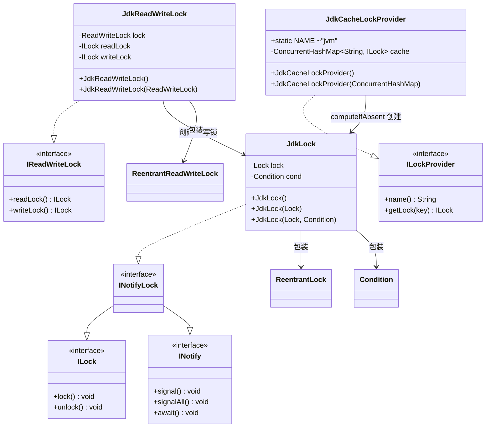

# i2f-lock 锁抽象模块

## 概述

`i2f-lock` 是 i2f-turbo-java 框架中**框架无关的锁抽象契约模块**，提供统一的多粒度锁接口定义及基于 JDK 内置锁的原生实现。仅依赖 `java.util.concurrent.locks`，运行期零三方 Jar 依赖。

模块核心价值在于通过接口抽象将锁的使用与具体实现解耦，使上层业务代码可以面向 `ILock` / `IReadWriteLock` / `ILockProvider` 编程，灵活切换 JVM 进程内锁、分布式锁等不同实现。

## 依赖关系

| 依赖类型 | 坐标 | 说明 |
|---------|------|------|
| 编译 | `i2f.turbo:i2f-jdk` (parent) | 仅继承父 POM 版本管理，无子模块依赖 |
| provided | `org.projectlombok:lombok` | 当前模块未实际使用，由父 POM 统一引入 |

> 模块编译产物无任何运行期外部依赖（`lombok` 为 provided scope，不打入包）。

## 架构设计



## 包结构

```
i2f.lock
├── ILock.java              ← 基本锁接口：lock / unlock
├── INotify.java            ← 条件等待/通知接口：signal / signalAll / await
├── INotifyLock.java        ← 组合接口：ILock + INotify
├── IReadWriteLock.java     ← 读写锁接口：readLock / writeLock
├── ILockProvider.java      ← 锁提供者接口：name / getLock(key)
└── impl
    ├── JdkLock.java        ← 基于 ReentrantLock + Condition 的实现
    ├── JdkReadWriteLock.java   ← 基于 ReentrantReadWriteLock 的实现
    └── JdkCacheLockProvider.java ← 基于 ConcurrentHashMap 缓存的锁提供者
```

## 接口契约

### ILock — 基本锁

```java
public interface ILock {
    void lock() throws Throwable;
    void unlock() throws Throwable;
}
```

标准锁语义：`lock()` 获取锁，`unlock()` 释放锁。方法签名抛出 `Throwable`，允许实现层（如分布式锁）抛出网络异常等受检异常。

### INotify — 条件通知

```java
public interface INotify {
    void signal() throws Throwable;
    void signalAll() throws Throwable;
    void await() throws Throwable;
}
```

对标 `java.util.concurrent.locks.Condition` 的三操作：`signal` 唤醒一个等待线程，`signalAll` 唤醒所有等待线程，`await` 使当前线程等待。

### INotifyLock — 可通知锁

```java
public interface INotifyLock extends ILock, INotify {
}
```

组合接口，标识一个锁同时支持锁定和条件等待/通知能力。继承自 `ILock` + `INotify`，无额外方法。

### IReadWriteLock — 读写锁

```java
public interface IReadWriteLock {
    ILock readLock();
    ILock writeLock();
}
```

返回读锁和写锁，均以 `ILock` 接口暴露，使读写锁的使用与普通锁保持一致的编程体验。

### ILockProvider — 锁提供者

```java
public interface ILockProvider {
    String name();
    ILock getLock(String key);
}
```

按 `key` 获取对应的锁实例，允许多个键共享相同锁或各键独立锁，由实现决定策略。`name()` 返回提供者标识名称。

## 实现详解

### JdkLock

基于 `java.util.concurrent.locks.ReentrantLock` + `Condition` 的 `INotifyLock` 实现。

```java
public class JdkLock implements INotifyLock {
    protected Lock lock = new ReentrantLock();
    protected Condition cond = lock.newCondition();
    // ...
}
```

- **构造器三态**：无参（默认 `ReentrantLock`）、`Lock`（共享外部锁）、`Lock+Condition`（完全自定义）
- `lock()` / `unlock()` 委托给 `ReentrantLock` 的可重入语义
- `signal()` / `signalAll()` / `await()` 委托给 `Condition`
- 适用于 JVM 进程内的线程同步、生产者-消费者等场景

### JdkReadWriteLock

基于 `java.util.concurrent.locks.ReentrantReadWriteLock` 的 `IReadWriteLock` 实现。

```java
public class JdkReadWriteLock implements IReadWriteLock {
    protected ReadWriteLock lock = new ReentrantReadWriteLock();
    protected ILock readLock = new JdkLock(lock.readLock());
    protected ILock writeLock = new JdkLock(lock.writeLock());
    // ...
}
```

- 将 JDK 的 `ReadWriteLock` 适配为 `IReadWriteLock` 接口
- 读锁和写锁通过 `JdkLock` 包装，对外统一为 `ILock` 类型
- 适用于读多写少的场景，如缓存、配置读取等

### JdkCacheLockProvider

基于 `ConcurrentHashMap` 缓存的 `ILockProvider` 实现。

```java
public class JdkCacheLockProvider implements ILockProvider {
    public static final String NAME = "jvm";
    protected ConcurrentHashMap<String, ILock> cache = new ConcurrentHashMap<>();
    // ...
    public ILock getLock(String key) {
        return cache.computeIfAbsent(key, k -> new JdkLock());
    }
}
```

- `NAME = "jvm"` 标识为 JVM 进程内锁提供者
- 通过 `computeIfAbsent` 按 key 懒创建 `JdkLock` 实例，线程安全
- 同一 key 返回同一个 `ILock` 实例，适用于按业务键（如用户ID、订单ID）粒度的锁竞争
- 支持外部传入 `ConcurrentHashMap` 实现缓存共享/定制

## 用法示例

### 基本锁

```java
ILock lock = new JdkLock();
try {
    lock.lock();
    // 临界区代码
} finally {
    lock.unlock();
}
```

### 条件等待/通知

```java
INotifyLock lock = new JdkLock();
// 线程 A
lock.lock();
try {
    while (!conditionMet) {
        lock.await(); // 等待条件满足
    }
    // 条件满足后执行
} finally {
    lock.unlock();
}

// 线程 B
lock.lock();
try {
    // 改变条件
    conditionMet = true;
    lock.signal(); // 通知等待线程
} finally {
    lock.unlock();
}
```

### 读写锁

```java
IReadWriteLock rwLock = new JdkReadWriteLock();

// 读操作
ILock readLock = rwLock.readLock();
readLock.lock();
try {
    // 读共享数据
} finally {
    readLock.unlock();
}

// 写操作
ILock writeLock = rwLock.writeLock();
writeLock.lock();
try {
    // 写共享数据
} finally {
    writeLock.unlock();
}
```

### 按 Key 的锁提供者

```java
ILockProvider provider = new JdkCacheLockProvider();
String orderId = "order_12345";
ILock lock = provider.getLock(orderId);
try {
    lock.lock();
    // 按订单ID粒度的同步操作
} finally {
    lock.unlock();
}
```

## 设计说明

1. **接口抛出 `Throwable`**：所有锁接口方法签名均声明 `throws Throwable`，这是有意设计——使分布式锁实现（需处理网络异常、超时等）与进程内锁共享同一接口，无需调用方做异常类型适配。

2. **`IReadWriteLock` 返回 `ILock` 而非专用接口**：读锁和写锁均以 `ILock` 类型返回，降低使用复杂度。调用方只需记住「读锁不能写，写锁可读写」的语义约束即可。

3. **`ILockProvider` 的 key 映射策略**：当前 `JdkCacheLockProvider` 使用按 key 独立的锁实例，适用于细粒度锁竞争。此接口也适合扩展为分段锁（striped lock）或分布式锁提供者，如 Redis-based LockProvider。

4. **组合优于继承**：`INotifyLock` 通过接口组合（`extends ILock, INotify`）而非继承层次来表达能力聚合，符合最小接口原则。

## 下游消费者

| 消费者模块 | 使用方式 |
|-----------|---------|
| `i2f-jdk-all` | 通过 `i2f-jdk` 父 POM 的 `<module>` 聚合 |
| 根 POM | 间接通过 `i2f-jdk-all` 聚合 |

模块源码级消费者需通过 grep 验证，当前全仓无独立引用 `i2f-lock` 的直接 Maven 坐标依赖。

## 已知限制

- `JdkCacheLockProvider` 的 `ConcurrentHashMap` 缓存不会自动清理，长期运行可能出现 key 泄漏，适合固定 key 集合或 key 数量可控的场景
- `JdkLock` 的 `Condition.await()` 响应中断的方式与 JDK 语义一致（抛出 `InterruptedException`），调用方需注意中断处理
- 所有实现均基于 JVM 进程内锁，不适用于跨进程/跨节点的分布式场景（但接口设计已为分布式实现预留）