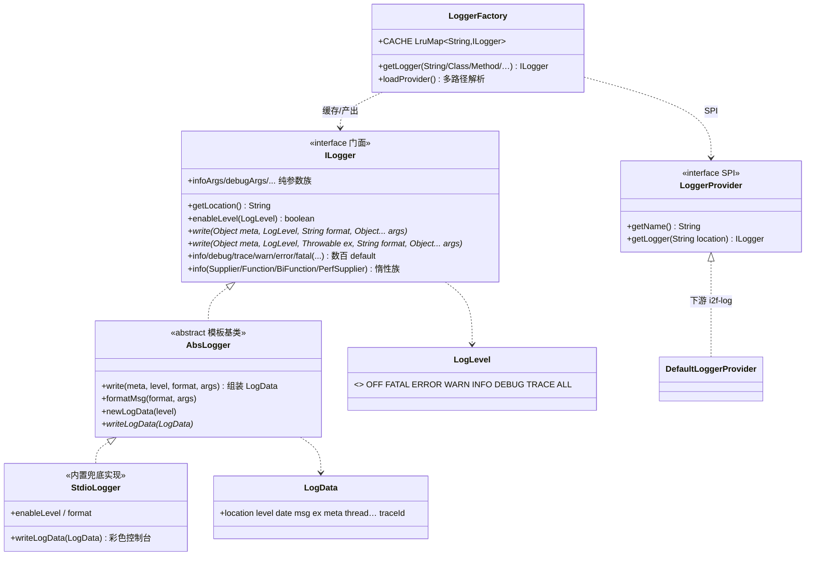
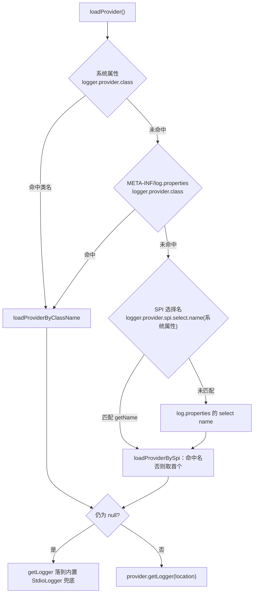

# i2f-log-std

> **日志标准门面层（`std` 契约与实现分离）**。框架无关地定义统一日志大门面 `ILogger`（6 级别 × 多入参形态的数百 `default` 方法，全部收敛到 2 个抽象 `write`）、工厂 `LoggerFactory`（`LruMap` 缓存 + SPI/类名/properties 多路径 Provider 解析）、可插拔实现契约 `LoggerProvider`、数据模型 `LogData`、级别枚举 `LogLevel`、抽象基类 `AbsLogger`（模板方法把 `write` 收敛为 `writeLogData(LogData)`），并内置最简彩色兜底实现 `StdioLogger`。借鉴 SLF4J「门面 + Provider」思路，业务只依赖稳定门面、不被具体日志后端绑死；完整实现留给下游 `i2f-log`。单包族 `i2f.log.std`、10 文件。

## 模块路径

- `i2f-jdk/i2f-log-std`

## 模块依赖

> 内部依赖在前、三方在后；均 compile、版本由父 POM `i2f-jdk` 托管。经源码 import 逐一核实，本模块六个依赖**全部真实使用**（不同于部分模块 lombok 冗余）。

| 依赖 | Maven 坐标 | scope | optional | 用途（核实位置） |
| --- | --- | --- | --- | --- |
| i2f-clock-impl | `i2f.turbo:i2f-clock-impl` | compile | 否 | `LogUtil.newLogData` 用 `SystemClock.currentTimeMillis()` 打时间戳 |
| i2f-trace | `i2f.turbo:i2f-trace` | compile | 否 | `ThreadTrace.beforeTrace(...)`：`LoggerFactory.getLogger()` 无参取调用点、`LogUtil` 抓 DEBUG 级栈帧 |
| i2f-trace-mdc | `i2f.turbo:i2f-trace-mdc` | compile | 否 | `MdcHolder.get(MdcTraces.TRACE_ID)` 为 `LogData` 注入 traceId |
| i2f-lru-map | `i2f.turbo:i2f-lru-map` | compile | 否 | `LoggerFactory.CACHE`（logger 缓存）、`LogUtil.CACHE_LOCATION`（位置截断缓存） |
| i2f-console-color | `i2f.turbo:i2f-console-color` | compile | 否 | `StdioLogger` 用 `ConsoleColor`/`ConsoleOutput.toAnsiString` 输出 ANSI 彩色 |
| lombok | `org.projectlombok:lombok` | compile | 否 | `LogData` 的 `@Data`、`StdioLogger` 的 `@Data`/`@NoArgsConstructor`（真实使用） |

- **下游实现 / 消费方**（grep 核实）：
  - `i2f-jdk/i2f-log`：**默认完整实现**——`DefaultLogger extends AbsLogger`、`DefaultLoggerProvider implements LoggerProvider` 并经 `META-INF/services/i2f.log.std.provider.LoggerProvider` 注册（内容 `i2f.log.provider.DefaultLoggerProvider`）；另有 config/decide/format/writer 各家族消费 `LogData`/`LogLevel`。
  - `i2f-extension/i2f-extension-slf4j-log`：**SLF4J → i2f 适配**（`Slf4jLogLoggerAdapter` 用 `ILogger`、`Slf4jLogLoggerFactoryAdapter` 用 `LoggerFactory`）。
  - `i2f-extension/i2f-extension-log-slf4j`：**i2f → SLF4J 写出**（`LogSlf4jLogWriter` 用 `LogData`/`LogLevel`）。

## 模块设计



**核心是 `ILogger` 的「方法矩阵」设计**：每个动词族 = 「入参形态」×「是否带 `meta`」×「是否带 `Throwable`」，共 6 个级别 × 上述维度，展开为数百个 `default` 方法，**最终全部收敛到 2 个抽象 `write`**：

```
void write(Object meta, LogLevel level, String format, Object... args);
void write(Object meta, LogLevel level, Throwable ex, String format, Object... args);
```

- **入参形态**：`format+args`（`String.format` 风格）、纯 `args`（`*Args`/`*MetaArgs`/`writeArgs`，无格式串自动拼接）、`Supplier<?>`（惰性）、`PerfSupplier<?>`（多参惰性，`T get(Object... args)`）、`Function<T,?>` / `BiFunction<T,U,?>`（带 1~2 个入参的惰性求值）。
- **惰性求值**：所有 `Supplier`/`Function`/`PerfSupplier` 变体都先判 `enableXxx()` 再 `get/apply`，关闭级别时零字符串构造开销——这是 `std` 相对朴素日志 API 的性能设计。
- **`AbsLogger`（模板方法）**：把两个 `write` 统一实现为「`enableLevel` 短路 → `newLogData` 组装 `LogData`（含 `formatMsg` 结果、`meta`、可选 `ex`）→ 抽象 `writeLogData(LogData)`」，子类只需实现 `writeLogData`/`getLocation`/`enableLevel`，把「日志数据」与「输出目的地」解耦。
- **`LogData`**：一次日志的结构化载体——location/level/date/msg/ex/meta/threadName/threadId/className/methodName/fileName/lineNumber/traceId。`LogUtil.newLogData` 用 `SystemClock` 打时间戳、`MdcHolder` 注 traceId，并**仅在 `level >= DEBUG` 时**用 `ThreadTrace.beforeTrace(ILogger 类名)` 抓调用点栈帧填 class/method/file/line（生产 INFO 不付抓栈代价）。
- **`LoggerFactory`（工厂 + 解析）**：`getLogger(String/Class/Method/Class+Method/无参)` 以 `LruMap<String,ILogger>`（1024）缓存；首次调用经 `hasFindProvider` 触发一次 `loadProvider()`。解析优先级：



  - `loadProviderByClassName`：`Class.forName` → 上下文 `loadClass` 兜底 → `isAssignableFrom(LoggerProvider)` → 无参构造 → `newInstance`。
  - `loadProviderBySpi`：`ServiceLoader<LoggerProvider>` 遍历，`getName()` 忽略大小写匹配 `selectName`，匹配不到则返回**首个** provider。
- **`StdioLogger`（内置兜底实现）**：`@Data`；`ThreadLocal<SimpleDateFormat>`；级别色 `logLevelColorMap`（FATAL 亮红/ERROR 红/WARN 黄/INFO 绿/DEBUG 灰…）；`format` 拼「时间 [级别] [location 截断] [thread-id 截断] - msg [--@class.method(file:line)] [--#traceId] [异常栈]」；`enableLevel` 用 `level.level() <= 阈值`（默认 `ALL`，即默认全量）；`writeLogData` 把 **FATAL/ERROR/WARN 送 `System.err`**、其余送 `System.out`。
- **`LogLevel`**：`OFF(0) FATAL(1) ERROR(2) WARN(3) INFO(4) DEBUG(5) TRACE(6) ALL(99)`，数值越小越严重；`parse` 未知/空一律 `OFF`。

## 模块目的

- **门面与实现分离**：全仓统一日志出口，业务代码只依赖 `i2f-log-std` 的稳定门面，运行期按 SPI/属性切换后端（自研 `i2f-log`、SLF4J 适配），不硬绑定某个日志框架。
- **更丰富的 API 面**：相比 `java.util.logging`/朴素 SLF4J，提供 `meta` 通道、纯参数自动拼接、以及 `Supplier`/`Function`/`PerfSupplier` 多形态惰性求值，兼顾易用与「关级零开销」。
- **开箱即用**：无任何 Provider 时由 `StdioLogger` 彩色兜底，保证「拿来即 log」；`traceId`/调用点/线程自动注入，利于链路排查。

## 模块功能

| 能力 | 承载 |
| --- | --- |
| 统一日志大门面（6 级 × 多形态 × meta/Throwable，数百 default） | `ILogger` |
| 惰性求值（Supplier/Function/BiFunction/PerfSupplier） | `ILogger` + `PerfSupplier` |
| logger 缓存与多来源工厂入口（String/Class/Method/无参定位调用点） | `LoggerFactory` |
| 可插拔实现契约 + 系统属性/properties/SPI 三路径解析 | `LoggerProvider` + `LoggerFactory.loadProvider` |
| 「组装 LogData → writeLogData」模板基类，解耦数据与输出 | `AbsLogger` |
| 结构化日志载体（含 traceId/调用点/meta） | `LogData` |
| 级别序与 `<=` 阈值判定、字符串解析 | `LogLevel` |
| 彩色控制台兜底实现（warn+ 走 stderr） | `StdioLogger` |
| `String.format` 风格 + 尾部多余参数自动拼接 + 数组递归展开 | `LogUtil.formatMsg/formatArgs/append` |
| 位置缩写截断（logback 风格，`LruMap` 缓存） | `LogUtil.truncateLocation/truncateString` |

## 模块主要使用方法

**1）取 logger + 常规格式化**

```java
import i2f.log.std.ILogger;
import i2f.log.std.LoggerFactory;

public class OrderService {
    private static final ILogger log = LoggerFactory.getLogger(OrderService.class);

    public void place(long id, String user) {
        log.info("place order #%d by %s", id, user);   // String.format 风格
        log.warn("库存不足");                              // 无参
        log.error(ex, "下单失败 orderId=%d", id);         // 带 Throwable
    }
}
```

**2）惰性求值（关级零开销）**

```java
log.debug(() -> "detail=" + renderExpensive());          // Supplier
log.debug(sb -> sb.append(id).toString(), id);           // Function<T,?>
log.trace((a, b) -> a + ":" + b, k1, k2);                // BiFunction<T,U,?>
log.info((args) -> "n=" + args[0], 42);                  // PerfSupplier（多参）
```

**3）纯参数自动拼接（`*Args`，无格式串）**

```java
log.infoArgs("number:", 1, java.util.Arrays.asList("a", "b"));
// 输出：... [INFO] [...] - [0](String)number:, [1](Integer)1, [2](Arrays$ArrayList)[a, b]
```

**4）`meta` 通道（结构化附加对象）**

```java
log.infoMeta(payloadBean, "user=%s action=login", user); // meta 存入 LogData.meta
// 注意：内置 StdioLogger 不渲染 meta（见瑕疵 #3），meta 仅供自定义 Provider 消费
```

**5）自定义实现：继承 `AbsLogger` + 实现 `LoggerProvider` + SPI 注册**

```java
public class MyLogger extends AbsLogger {                 // 只需实现 3 个方法
    private final String location;
    public MyLogger(String location) { this.location = location; }
    @Override public String getLocation() { return location; }
    @Override public boolean enableLevel(LogLevel lv) { return lv.level() <= LogLevel.INFO.level(); }
    @Override public void writeLogData(LogData data) { /* 落库 / 发送 / 打印 */ }
}

public class MyLoggerProvider implements LoggerProvider {
    @Override public String getName() { return "MyProvider"; }
    @Override public ILogger getLogger(String location) { return new MyLogger(location); }
}
```

```
# resources/META-INF/services/i2f.log.std.provider.LoggerProvider
com.xxx.MyLoggerProvider
```

**6）选择 Provider**

```bash
java -Dlogger.provider.class=com.xxx.MyLoggerProvider -jar app.jar
java -Dlogger.provider.spi.select.name=MyProvider -jar app.jar   # 从 SPI 里按 getName 选
# 或在 classpath 放 META-INF/log.properties: logger.provider.class=com.xxx.MyLoggerProvider
```

## 模块特性总结

- **门面 / 实现分离**：`std` 只定契约与兜底，完整实现（`i2f-log`）与双向 SLF4J 桥接（`i2f-extension-*slf4j*`）皆下游，业务不绑后端。
- **方法矩阵收敛到 2 抽象 `write`**：数百 `default` 提升表达力，实现者负担极小（`AbsLogger` 再降为 1 个 `writeLogData`）。
- **多形态惰性求值**：`Supplier`/`Function`/`BiFunction`/`PerfSupplier` 关级零构造开销。
- **Provider 三路径解析 + 兜底**：系统属性 → `log.properties` → SPI（选名或取首个）→ `StdioLogger`；`LruMap` 缓存 logger。
- **可观测性内建**：`traceId`（MDC）、DEBUG 级调用点（`ThreadTrace`）、线程/时间、彩色输出、warn+ 分流 stderr。
- **纯参数友好**：无格式串时自动 `[idx](Type)value` 拼接并递归展开数组。

## 已知实现瑕疵与注意事项

> 以下均经 `ILogger`/`LoggerFactory`/`LogUtil`/`StdioLogger` 源码逐行核实。

1. **【高·系统性】`*Args`/`*MetaArgs` 全级别门级误写为 `enableFatal()`**：ERROR/WARN/INFO/DEBUG/TRACE 五个级别的 `xxxMetaArgs(Object, Object...)` 与三个 `xxxArgs(...)` 重载（共 **20 个 `default` 方法**）门级判断都用 `enableFatal()`，应为各自的 `enableError()/.../enableTrace()`（核实：`ILogger` L470–504、L688–722、L906–940、L1123–1157、L1339–1373；而同族的 `*Meta`/`format`/`Supplier`/`Function`/`BiFunction` 变体均正确使用 `enableXxx()`，`fatal*` 用 `enableFatal()` 亦正确）。
   - **后果**：`enableFatal()` 在阈值 `>= FATAL(1)` 时恒真（仅 `OFF(0)` 才假），即**除 OFF 外任意级别下这些 `*Args` 调用都会放行并调用 `write`，越过自身级别阈值**。对内置 `StdioLogger`/`AbsLogger` 影响被掩盖——`AbsLogger.write` 内部又判了一次 `enableLevel(level)` 二次拦截；但对「以门面预判定为准、`write` 内不再判级」的 Provider（如 SLF4J/后端桥接），会造成 **DEBUG/TRACE/INFO 级 `*Args` 日志绕过级别过滤在生产刷屏**，且白白执行参数装箱/拼接。修复：每处 `enableFatal()` 改为对应级别的 `enableXxx()`。
2. **`getLogger` 首帧 Provider 装载竞态**：`hasFindProvider.getAndSet(true)` 只保证「尝试装载」执行一次，但并发下 B 线程可能在 A 尚未把 `loggerProvider` 赋值完成前就读到 `true`，遂以 `loggerProvider==null` 落到 `StdioLogger` 并 `CACHE.put(location,...)` **永久缓存兜底实现**；即应用最先创建的那批 logger 有较小概率绑到 `StdioLogger` 而非真实 Provider。
3. **`StdioLogger` 静默丢弃 `meta`**：`meta` 是 API 一等等公民（每个动词都有 `xxxMeta` 重载并存入 `LogData.meta`），但 `StdioLogger.format` 从不输出 `data.getMeta()`——用默认实现时 meta 不可见，仅自定义 Provider 消费。
4. **`LogUtil.formatMsg` 的 `%` 占位符计数粗糙**：以字符 `'%'` 逐个计数，`%%` 转义或文本中裸 `%` 会被误计为占位符；「实参多于占位符」时把尾部实参以 `[i](Type)value` 追加，「实参不足」时 `String.format` 抛异常被 `catch` 吞掉、原样输出仍含 `%s` 的格式串。
5. **`AbsLogger.write` 与 `ILogger` 各 `default` 一律 `catch (Throwable e) {}` 静默吞**：达成「日志永不抛」的设计目标，但实现内部异常（Provider 故障、格式化溢出等）被完全隐藏，无任何诊断线索。
6. **模块自带 `readme.md` 示例笔误**：示例 `import i2f.log.std.Logger;` 实际无此类（应为 `ILogger`）；示例 `enableLevel` 用 `level.level() < controlLevel.level()`（严格小于），与 `StdioLogger`/常规约定的 `<=` 不一致，按其示例会导致临界级别被漏打。属文档瑕疵，不影响本模块代码。
7. **`LogLevel.parse` 未知/空一律 `OFF`**：无法表达「解析失败则默认 INFO」等语义；叠加瑕疵 #1，`OFF` 也是唯一能让 `*Args` 门级 `enableFatal()` 变假（真正压住）的阈值。
