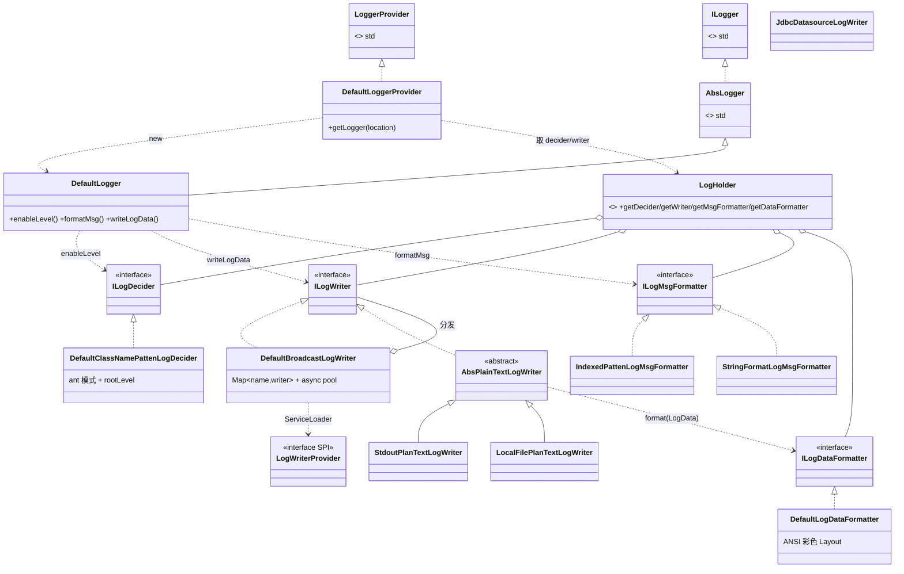
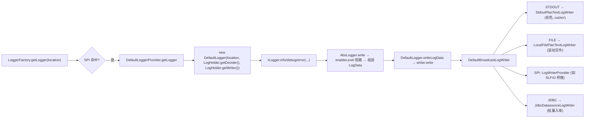

# i2f-log

> `i2f-log-std` 日志门面的**默认完整实现层**。以 SLF4J「门面 + Provider」的思路落地：`DefaultLoggerProvider`（经 SPI `META-INF/services/i2f.log.std.provider.LoggerProvider` 注册，被 `LoggerFactory` 优先选中，取代门面的 `StdioLogger` 兜底）产出 `DefaultLogger`；运行期四大可插拔组件（决策器 `ILogDecider`、写出器 `ILogWriter`、消息格式化器 `ILogMsgFormatter`、数据格式化器 `ILogDataFormatter`）由全局静态注册表 `LogHolder`（`GLOBAL_*` + `THREAD_*` 两级）持有并可替换。内置**广播写出器**（`DefaultBroadcastLogWriter`，异步 work-stealing 池 + 二级 SPI `LogWriterProvider`）、**控制台 / 本地滚动文件 / JDBC 数据源**三类写出器、**彩色 Layout**（`DefaultLogDataFormatter`）、**`System.out/err` 重定向**（`StdoutRedirectPrintStream`，把裸打印纳入日志体系），以及一套 **`log.properties` 配置系统**（`LogConfiguration` + `LogProperties` + `PropertiesFileLogPropertiesLoader`）。单模块 `i2f.log.*` 分 8 个子包、23 个 Java 文件。

## 模块路径

- `i2f-jdk/i2f-log`

## 模块依赖

> 内部依赖在前、三方在后；均 compile、版本由父 POM `i2f-jdk` 托管。经源码 import 逐一核实，pom 声明的 5 个依赖**全部真实使用**（不同于既往多模块的 lombok 冗余）；另有多个能力经 `i2f-log-std` **传递依赖**引入并在本模块源码中直接使用。

| 依赖 | Maven 坐标 | scope | optional | 使用点（源码核实） |
| --- | --- | --- | --- | --- |
| i2f-log-std | `i2f.turbo:i2f-log-std` | compile | 否 | 门面契约：`ILogger`/`LoggerFactory`/`AbsLogger`/`LogData`/`LogLevel`/`LoggerProvider`/`PerfSupplier`/`MdcTraces`；**其自身依赖传递引入**下表 `*` 项，本模块源码直接使用 |
| i2f-uid-impl | `i2f.turbo:i2f-uid-impl` | compile | 否 | `SnowflakeLongUid.getId()` —— `JdbcDatasourceLogWriter` 主键生成 |
| i2f-match | `i2f.turbo:i2f-match` | compile | 否 | `StringMatcher.antClass()`（决策器 ant 匹配择优）、`RegexUtil.format()`（`IndexedPattenLogMsgFormatter` 消息格式化） |
| i2f-reflect | `i2f.turbo:i2f-reflect` | compile | 否 | `ReflectResolver.loadClass/getInstance/invokeSingletonMethod` —— `LogConfiguration` 反射装配自定义 Writer |
| lombok | `org.projectlombok:lombok` | provided（父托管） | 否 | `@Data`/`@NoArgsConstructor` 遍布各 POJO/组件（真实使用） |
| `*` i2f-lru-map | （经 std 传递） | compile | 否 | `LruMap`（`DefaultLogDataFormatter.CACHE_LOCATION` 位置串截断缓存）、`ExpireConcurrentMap`（`DefaultLogger` 级别判定缓存） |
| `*` i2f-clock-impl | （经 std 传递） | compile | 否 | `SystemClock`（文件滚动命名时间戳、过期缓存计时基准） |
| `*` i2f-console-color | （经 std 传递） | compile | 否 | `ConsoleColor`/`ConsoleOutput`/`ConsoleElement` —— `DefaultLogDataFormatter` ANSI 彩色渲染 |
| `*` i2f-trace | （经 std 传递） | compile | 否 | `ThreadTrace` —— `StdoutRedirectPrintStream` 反查调用点 |
| `*` JDK `javax.sql.DataSource` | 随 JDK | — | — | `JdbcDatasourceLogWriter` 仅用 JDBC 标准 API，**无三方 JDBC 依赖** |

- **零三方运行期依赖**：数据库写入只面向 `javax.sql.DataSource` 标准接口，驱动由使用方注入。

## 模块设计

### 分层与协作总览

本模块把 `i2f-log-std` 抽象出的 `ILogger`/`LogData` 补齐为一条可运行的「判定 → 组装 → 格式化 → 广播写出」流水线，各角色都是可替换的接口 + 默认实现，默认实例集中在 `LogHolder`。



### 1. Provider 入口 —— 把门面「接线」到本实现

- `DefaultLoggerProvider implements LoggerProvider`（`getName()` 返回 `"Default"`），`getLogger(location)` 用 `LogHolder` 当前生效的决策器与写出器 `new DefaultLogger(location, decider, writer)`。
- 通过 `src/main/resources/META-INF/services/i2f.log.std.provider.LoggerProvider` 注册（内容一行 `i2f.log.provider.DefaultLoggerProvider`）。`LoggerFactory`（门面侧）装载 Provider 时**优先选 SPI**，于是全仓 `LoggerFactory.getLogger(...)` 在生产中拿到的就是 `DefaultLogger`，而非门面的彩色兜底 `StdioLogger`。

### 2. `LogHolder` —— 全局 + 线程级双路由注册表

- 四类组件各持一个 `DEFAULT_*`（不可变常量默认实例）、`volatile GLOBAL_*`、`ThreadLocal THREAD_*`；`getXxx()` 统一「**线程级优先，回落全局**」。这让「临时在某个线程内改写日志行为（如捕获到内存、单独开关某 writer）」零成本、互不串扰。
- 便捷变更 API：`replaceWriter/replaceDecider`（换整个 GLOBAL）、`registryWriter/removeWriter`（当 GLOBAL 是广播器时增删其子 writer）、`registryDecideLevel/removeDecideLevel`（当 GLOBAL 是 ant 决策器时增删级别模式）。均带 `instanceof` 守卫，误换实现后返回 `false` 而非抛错。

### 3. `DefaultLogger` —— `AbsLogger` 的具体化

- `extends AbsLogger`（门面模板基类，把 `write` 收敛为 `writeLogData`）。三个覆写：
  - `formatMsg(format,args)` → 委托 `LogHolder.getMsgFormatter()`（运行期可切 `String.format` 或 `RegexUtil.format`）。
  - `writeLogData(data)` → `writer.write(data)`（writer 即注入的广播器）。
  - `enableLevel(level)` → 以 `level#location` 为键查 `ExpireConcurrentMap` 缓存，未命中则问 `decider` 并回填。**（此处缓存实际失效且每 logger 起一条调度线程，详见「已知实现瑕疵」。）**

### 4. 决策器 `ILogDecider` —— 按「调用位置」分级

- `DefaultClassNamePattenLogDecider`：`rootLevel`（默认 INFO）+ `pattenMapping`（ant 模式→级别）。判级：无模式时按 `level ≤ rootLevel`；有模式时用 `StringMatcher.antClass().priorMatches(location, patterns)` 取**最精确命中**的模式级别为准（类似 logback `logger name` 就近覆盖）。

### 5. 格式化器 ——「消息格式化」与「数据序列化」两职责分离

- `ILogMsgFormatter`（消息模板 + args → 字符串）：默认 `IndexedPattenLogMsgFormatter`（`RegexUtil.format`，支持 `{0}`/`{-1}`/`{:格式}`/`{t:}` 等索引式占位，见门面约定），备选 `StringFormatLogMsgFormatter`（`String.format`）。
- `ILogDataFormatter`（`LogData` → 整行文本，即其它框架的 Layout）：`DefaultLogDataFormatter` 产出「`时间 [级别] [位置] [线程] - 消息 --@类.方法(文件:行) --#traceId`」，`stdout=true` 时按级别上色（FATAL 亮红 / ERROR 红 / WARN 黄 / INFO 绿 / DEBUG 灰 / TRACE 白，位置青、线程紫、调用点亮青、traceId 亮紫），异常整段堆栈转红。位置串按 `len` 智能缩写（逐段首字母折叠）并用静态 `LruMap(1024)` 缓存结果。

### 6. 写出器族 —— 一个广播 + 三类落地

- `ILogWriter.write(LogData)` 是唯一抽象。
- `DefaultBroadcastLogWriter`：`Map<name, ILogWriter>`，实例初始化块先 `loadStdoutWriter()`（放一个 `StdoutPlanTextLogWriter`，键 `"STDOUT"`）再 `loadSpiWriters()`（`ServiceLoader<LogWriterProvider>`，`test()` 通过才收）。`write` 遍历所有子 writer，`async=true`（默认）时提交到 `newWorkStealingPool(5)` 异步执行，可 `adjustAsync/adjustPoolSize` 调参。
- `AbsPlainTextLogWriter`：模板——用 `LogHolder.getDataFormatter().format(data)` 得整行文本再交给抽象 `write(level, text)`。
  - `StdoutPlanTextLogWriter`：覆写 `write(LogData)` 以 `format(data, true)` 上色；`INFO` 及以上走 `System.out`、以下走 `System.err`。
  - `LocalFilePlanTextLogWriter`：本地滚动文件（`./logs/{app}.log`），按 `fileLimitSize` 归档为 `{app}-yyyyMMdd-HHmmss-SSS.log`、按 `fileLimitTotalSize` 删除最旧；`setParams("k=v&k2=v2")` 供配置式装配；实现 `Closeable` 并在 `finalize` 关流。
  - `JdbcDatasourceLogWriter`：**独立批量入库** writer（`ILogWriter` 直实现，不走纯文本模板）。内建 `LinkedBlockingQueue` + 单个守护线程 `jdbc-log-writer`（指数退避轮询），按 `minBatchSize`/`maxIdleMillSeconds` 攒批、`maxBatchSize` 分批 `addBatch/executeBatch` 写入 `i2f_log` 表（`i2f_log.sql` 附建表脚本）；首写 `checkTable` 按 JDBC URL 自动判定 MySQL 反引号 / Oracle 双引号标识符包裹；主键用 `SnowflakeLongUid`。

### 7. `StdoutRedirectPrintStream` —— 把 `System.out/err` 收编进日志

- 继承 `PrintStream` 但**内部 `out` 是一个空 `ByteArrayOutputStream`**，所有 `print*/println*/write*/printf/format/append` 全部覆写为 `proxy(...)`→按级别 `log.info/error(PerfSupplier, vals)` 走日志体系。
- `redirectSysoutSyserr(keepConsole, useTrace)`：`synchronized(System.class)` 下把 `System.out`/`System.err` 各包一层（out→INFO、err→ERROR），幂等。
- **递归护栏**：`proxy` 先用 `ThreadTrace.last(selfClassName)` 取调用者，若正是 `StdoutPlanTextLogWriter`（我们的 writer 正在往 `System.out` 打印），则直接 `target.println` 透传、不再走日志，避免无限递归。
- **调用点归因**：`useTrace=true` 时扫描当前栈，定位「调用本类 print 的业务帧」，据此派生**逐调用点**的 logger 名（`StdoutRedirectPrintStream.sys.out.类.方法.行号`）再打印。

### 8. 配置系统 —— `log.properties`

- `LogConfiguration.config()`：按 `LOG_CONFIG_FILES`（`log.properties`、`resources/`、`config/`、`conf/`、`META-INF/` 五候选，classpath 与当前目录双找）发现首个文件 → `PropertiesFileLogPropertiesLoader.load(url)` → 映射为 `LogProperties` → 逐段 `configStdoutRedirect/configStdoutWriter/configFileWriter/configBroadcastWriter/configLoggingLevel` 落到 `LogHolder`。
- `PropertiesFileLogPropertiesLoader`：把扁平的 `log.组.属性` / `log.组.items[N].字段` 键解析进对应嵌套 `*Properties`（键名做 `-`/`_` 归一，宽松大小写）。`broadcast-writer.items[N]` 通过反射（`ReflectResolver`）按 `class-name` 实例化 `ILogWriter`、`params` 回调其 `setParams(String)`。
- `log.yml` / `sample/log.properties` 为配置样例，`i2f_log.sql` 为 JDBC writer 建表脚本。



## 模块目的

- 让门面 `i2f-log-std`「开箱即有一套完整、可扩展、零三方依赖」的默认实现，业务仅依赖门面即可获得彩色控制台、文件滚动、数据库入库、`System.out` 收编、properties 配置、SPI 双扩展点等能力。
- 以 `LogHolder` 全局/线程两级注册表 + 两个 SPI（`LoggerProvider` 换实现、`LogWriterProvider` 加输出目标）实现「组件皆可插拔、行为皆可运行期改」。
- 与 SLF4J 生态双向打通：既可作为纯自研日志栈运行，也可经下游 `i2f-extension-log-slf4j`（本模块 `LogWriterProvider` SPI 的消费方）把日志转投到任意 SLF4J 后端。

## 模块功能

| 能力 | 载体 | 说明 |
| --- | --- | --- |
| 门面默认实现 | `DefaultLoggerProvider` + `DefaultLogger` | SPI 注册，产出可运行的 `ILogger` |
| 组件注册/替换 | `LogHolder` | 决策器/写出器/两类格式化器，全局 + 线程双路由 |
| 按位置分级 | `DefaultClassNamePattenLogDecider` | `rootLevel` + ant 模式就近覆盖（`i2f.log.**` 等） |
| 消息模板格式化 | `IndexedPatten`/`StringFormat` `ILogMsgFormatter` | 索引式占位 vs `String.format`，可运行期切换 |
| 整行 Layout + 彩色 | `DefaultLogDataFormatter` | 时间/级别/位置/线程/消息/调用点/traceId/堆栈，ANSI 上色 |
| 广播写出 | `DefaultBroadcastLogWriter` | 多目标分发、异步 work-stealing 池、二级 SPI 装载 |
| 控制台写出 | `StdoutPlanTextLogWriter` | INFO+ → stdout，其余 → stderr |
| 文件写出 | `LocalFilePlanTextLogWriter` | 按大小滚动 + 总量淘汰 + `setParams` 配置式装配 |
| 数据库写出 | `JdbcDatasourceLogWriter` | 有界队列 + 攒批 JDBC 写 `i2f_log`，自动建表、方言标识符包裹 |
| 标准输出收编 | `StdoutRedirectPrintStream` | `System.out/err` → 日志，含递归护栏与逐调用点归因 |
| 外部配置 | `LogConfiguration` + `LogProperties` + `PropertiesFileLogPropertiesLoader` | 发现并解析 `log.properties` 一键装配 |
| 拦截日志类型 | `LogType` | `BEFORE/AFTER/EXCEPT/DIRECT/REMOTE` 方法拦截场景枚举（辅助） |

## 模块主要使用方法

### 1. 直接取用（最常见）

依赖本模块（+ `i2f-log-std`）后，`LoggerFactory` 经 SPI 自动选中 `DefaultLoggerProvider`，业务无感：

```java
ILogger log = LoggerFactory.getLogger(MyService.class);
log.info("订单创建成功: id={}", orderId);          // 索引式占位（默认 RegexUtil.format）
log.error(e, "计算异常: { e:}", e.getMessage());   // 带 Throwable + 具名占位
```

### 2. 一键加载 `log.properties`

在 classpath（或当前目录）放 `log.properties`，启动早期调用一次：

```java
LogConfiguration.config();   // 发现文件 → 装配 stdout/file/broadcast/级别 到 LogHolder
```

> 注意：`config()` 内多处 `catch(Exception){}` 静默吞异常，配置写错不会报错但可能不生效（见瑕疵章节）。

### 3. 编程式增删写出器 / 调级别

```java
// 追加一个文件 writer（需 GLOBAL_WRITER 仍是广播器）
LocalFilePlanTextLogWriter file = new LocalFilePlanTextLogWriter();
file.setFileLimitSize(3 * 1024 * 1024);
LogHolder.registryWriter("FILE", file);

// 为某包名单独放开到 DEBUG
LogHolder.registryDecideLevel("com.myapp.mapper.**", LogLevel.DEBUG);

// 关闭异步，改为同步直写（便于测试断言）
((DefaultBroadcastLogWriter) LogHolder.GLOBAL_WRITER).adjustAsync(false);
```

### 4. 线程级临时接管（如单测收集日志）

```java
LogHolder.THREAD_WRITER.set(data -> collected.add(data));   // 仅当前线程生效
try { /* ... */ } finally { LogHolder.THREAD_WRITER.remove(); }
```

### 5. 收编 `System.out/err`

```java
// keepConsole=false 不再回显原控制台；useTrace=true 归因到真实调用点
StdoutRedirectPrintStream.redirectSysoutSyserr(false, true);
System.out.println("这行会作为 INFO 日志进入日志体系");
```

### 6. JDBC 入库 writer（程序式注册）

```java
JdbcDatasourceLogWriter jdbc = new JdbcDatasourceLogWriter(dataSource, "myapp");
LogHolder.registryWriter("JDBC", jdbc);   // 队列+守护线程自动攒批写入 i2f_log
```

> 该 writer 无 `setParams(String)` 且无参构造 `dataSource` 为空，故**不能**经 `broadcast-writer.items[N]` 配置式装配，须像上面这样程序注入 `DataSource`。

## 模块特性总结

- **门面/实现彻底分离**：本模块是 `i2f-log-std` 的 SPI 默认落地，业务只认门面。
- **两级注册表**：`LogHolder` 全局 + `ThreadLocal`，运行期可换决策/写出/格式化，线程级隔离零成本。
- **双 SPI 扩展点**：`LoggerProvider`（换日志实现）+ `LogWriterProvider`（加输出目标）。
- **多目标广播 + 异步**：控制台、滚动文件、数据库（有界队列攒批）、桥接目标并存。
- **彩色 Layout 与逐调用点归因**：级别配色、位置智能缩写、`System.out` 收编并反查真实调用者。
- **properties 一键装配**：`log.properties` 声明式配置 stdout/file/级别/自定义 writer（反射实例化 + `setParams`）。
- **零三方运行期依赖**：JDBC 只面向 `javax.sql.DataSource`。

## 已知实现瑕疵（源码逐行核实，非编译错误）

1. **`DefaultLogger` 级别缓存「永不相中」且每 logger 泄漏一条调度线程（高危）**。`enableLevel` 用 `ExpireConcurrentMap` 缓存 `level#location` 判定：但门面依赖的 `i2f-lru-map` 中 `ExpireConcurrentMap.get` 存在**过期判定反向**缺陷（`data.expireTs > now` 时返回 `null`），故任何带**未来到期点**的条目被 `set` 后 `get` 恒返回 `null` —— 缓存**永不命中**，每次判级都重算 `decider.enableLevel` 并再 `put`，纯开销。叠加 `expireTs = 30 * 1000` 以 `TimeUnit.SECONDS` 传入（应为 30 秒却成了 ~8.33 小时，单位错配）。更严重：每个 `DefaultLogger` 各自 `new ExpireConcurrentMap<>()` 会启动一条每 30s 的守护 `ScheduledExecutorService`，而 `LoggerFactory` 按 location 缓存 logger ≈ 每个打过日志的类一条线程，**调度线程随类数量线性膨胀且永不回收**。

2. **`JdbcDatasourceLogWriter.stringifyThrowable` 丢失堆栈**。方法把 `ex.printStackTrace(ps)` 写进局部 `bos`，却**从未把 `bos` 内容并入返回值**，只 `return builder`（仅 `类名 : message`）。于是 `ex_trace` 列永远只存一行简述，完整堆栈被静默丢弃。

3. **`JdbcDatasourceLogWriter` 时间列被截断**。`writeData` 对 `datetime` 列用 `stat.setDate(i, new java.sql.Date(getTime()))`，`java.sql.Date` 无时分秒 → 入库丢失时间（应 `setTimestamp`）。

4. **`LogConfiguration.configStdoutWriter` 误挂整个广播器**。`stdoutWriter.enable=true` 时执行 `registryWriter("STDOUT", new DefaultBroadcastLogWriter())` —— 注册的是一整个新广播器（其构造又会各自 `loadStdoutWriter + loadSpiWriters`），而非一个 `StdoutPlanTextLogWriter`。由于 `stdoutWriter` 默认即 `true`，每次 `config()` 都会把 `"STDOUT"` 槽替换成嵌套广播器，导致**二级 SPI writers（如 SLF4J 桥接）被重复装载、日志被重复写出**。

5. **`LogConfiguration.configLoggingLevelItems` 用 `return` 误代 `continue`**。循环里 `if (!item.isEnable()) return;` —— 一旦遇到某个 `enable=false` 的级别项，**其后所有级别项全部不再应用**（对照同类 `configBroadcastWriterItems` 正确使用 `continue`）。

6. **`LocalFilePlanTextLogWriter` 并发竞态**。默认广播器以 `newWorkStealingPool(5)` 异步分发，`write(level,text)` 中 `ps == null` 懒建 `PrintStream`、滚动 `renameTo` + 重开、以及 `PrintStream` 本身的写入均**无同步**，多线程并发写同一文件 writer 存在重复建流、输出交错、滚动竞态；`initialed.getAndSet(true)` 只保护一次性初始化，不保护后续写。

7. **`StdoutRedirectPrintStream` 非按行缓冲 + 归因开销**。`print("a"); print("b")` 会各自成为一条日志（`println()` 还会产生空行日志），而非聚成一行；`useTrace=true` 时**每次输出**都 `Thread.currentThread().getStackTrace()` 并为每个调用点派生独立 logger 名（虽有 std 侧 `LruMap` 兜底仍增加抖动）。`proxy` 中 TRACE/DEBUG/WARN/FATAL 分支为死代码（构造只会是 INFO/ERROR）。

8. **配置/异常被静默吞 + 少量不可达兜底**。`LogConfiguration` 与 `PropertiesFileLogPropertiesLoader` 多处 `catch(Exception){}` 空吞，配置书写错误不报错但不生效（如样例里混用 `:` 作分隔虽能被 `Properties` 容忍）；`StdoutRedirectPrintStream.stringify` 先 `new String(data)`（默认字符集，几乎不抛）再写 UTF-8/GBK 兜底分支，实为不可达死代码；`DefaultBroadcastLogWriter.adjustPoolSize` 直接替换 `pool` 未 `shutdown` 旧池，可能泄漏线程。
