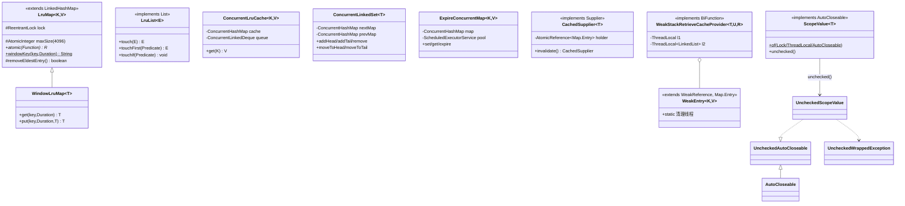
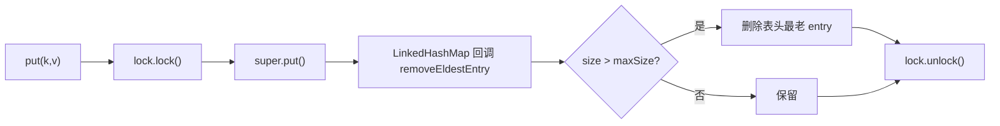

# i2f-lru-map

> 内存缓存 / 自调节容器 / 弱引用复用 / RAII 作用域**工具族**（lru-map）。全模块一个包 `i2f.lru`、13 个类，围绕「用有限内存换重复计算」沉淀四类零三方依赖的通用底座：其一是 **LRU 家族**——`LruMap`（`extends LinkedHashMap` 覆写 `removeEldestEntry` 做容量淘汰、每个读写方法套一把 `ReentrantLock` 的粗粒度同步 LRU，**默认插入序、需 `accessOrder=true` 构造才按访问序淘汰**）、`WindowLruMap`（按 `Duration` 时间片把 key 拼成「槽位键」，靠 LRU 淘汰实现粗粒度时间过期）、`LruList`（`implements List`、`touch` 把命中元素提到头部的读多写少自调节表）、`ConcurrentLinkedSet`（两 `ConcurrentHashMap` + 读写锁手写的可含 null 双向链集）、`ConcurrentLruCache`（`ConcurrentHashMap`+`ConcurrentLinkedDeque`+生成函数的读优 LRU）；其二是 **过期/记忆化**——`ExpireConcurrentMap`（守护线程每 30s 扫过期）、`CachedSupplier`（线程安全、可 TTL、可缓存 null 的记忆化 `Supplier`）；其三是 **弱引用复用**——`WeakEntry`（key 弱引用 + `ReferenceQueue` 清理线程，key 被 GC 即释放 value）与 `WeakStackRetrieveCacheProvider`（L1+L2 两级 `ThreadLocal` 缓存，按对象**身份 `==`** 复用递归/上下文里对同一入参的幂等转换结果）；其四是 **RAII 作用域**——`ScopeValue`/`UncheckedScopeValue`/`UncheckedAutoCloseable`/`UncheckedWrappedException`（try-with-resources 把锁的加解锁、`ThreadLocal.remove`、`AutoCloseable.close` 统一成「获取即登记、块结束自动清理」）。`LruMap` 是全仓库使用最广的反射/编译缓存底座，被 `i2f-lambda-core`/`i2f-lambda`/`i2f-bql`/`i2f-compiler`/`i2f-jdbc-proxy`/`i2f-log` 等大量模块直接 `import`。编译期唯一真正用到的依赖是 `i2f-clock-impl`（`SystemClock` 高频时间源）。

## 模块路径

- `i2f-jdk/i2f-lru-map`

## 模块依赖

| GroupId | ArtifactId | Scope | Optional | 来源 | 用途 |
| --- | --- | --- | --- | --- | --- |
| `i2f.turbo` | `i2f-clock-impl` | compile | 否 | 内部 | `SystemClock.currentTimeMillis()` 作高频时间源：`LruMap.windowKey` 时间片、`ExpireConcurrentMap` 过期判定、`CachedSupplier` TTL 计算 |
| `i2f.turbo` | `i2f-cache-std` | compile | 否 | 内部 | **声明但源码零 `import`**——本模块未实现 `ICache`/`IExpireCache` 等任何 cache-std 契约，属冗余依赖 |
| `org.projectlombok` | `lombok` | provided | 是 | 三方 | **声明但源码零使用**——13 个类均无 `@Data`/`@Getter` 等注解，属冗余依赖（版本由根 POM `dependencyManagement` 托管） |

- 所有依赖不写 `<version>`，由父 POM `i2f-jdk`（`1.0-jdk8`）统一托管；`build` 仅配 `maven-assembly-plugin`。
- 运行期除 `SystemClock` 外**只用 JDK**（`java.util` / `java.util.concurrent` / `java.lang.ref` / `java.util.function`），**零三方运行期依赖**。

## 模块设计

### 一、四类职责划分



四类彼此独立、无强制耦合，仅共享 `i2f.lru` 包与「缓存/自调节」主题；`WindowLruMap` 复用 `LruMap` 的锁与淘汰，`WeakStackRetrieveCacheProvider` 复用 `WeakEntry`，`UncheckedScopeValue` 复用 `UncheckedAutoCloseable`/`UncheckedWrappedException`。

### 二、`LruMap` 的容量淘汰与粗粒度同步

`LruMap` 继承 `LinkedHashMap`，靠 JDK 自带的 `removeEldestEntry` 钩子实现「超容量即丢最老 entry」——`put`/`putAll` 后由父类回调，`size() > maxSize` 时删除表头。它把**几乎每个** `Map` 方法（含 `get`/`size`/`toString`/`equals`/`hashCode`/`finalize`）都套上同一把 `ReentrantLock`，从而让「非线程安全」的 `LinkedHashMap` 获得互斥访问。



> 关键取舍：`LinkedHashMap` 有「插入序」与「访问序（`accessOrder=true`）」两种模式。`LruMap` 的无参/常规构造走**插入序**（`accessOrder=false`），此时淘汰的是「最早放入者」而非「最久未用者」；要得到真正的 LRU（访问也刷新位次、`get` 也改动链表顺序故必须加锁），须显式使用 `LruMap(int, float, boolean accessOrder, int maxSize)` 传 `accessOrder=true`。

- `setMaxSize(int)` 缩小容量时调用 `shrink()`：先把自身复制为 `LinkedHashMap` 快照、`clear()` 后按迭代序重新 `put` 前 `maxSize` 个（`max<0` 表示不限）。
- `atomic(Function<LruMap,R>)` 把一段复合操作整体纳入同一把锁，供调用方做「检查再更新」的原子块。
- `windowKey(key,Duration)`/`windowKey(Duration)`：以 `SystemClock.currentTimeMillis()/窗口毫秒` 的十六进制为「时间片号」，把 `key` 拼成 `key:wk_{片号}`，供 `WindowLruMap` 做时间片寻址。

### 三、时间片过期：`WindowLruMap`

`WindowLruMap<T> extends LruMap<String,T>` 不持时间，只重写 `get/put/containsKey/getOrDefault/remove` 的一整套「带 `Duration`」重载：每次读写前把 `key + Duration` 折算成当前时间片的槽位键。落在同一时间片内的读写命中同一条目，跨片则因键不同而自然「未命中」，旧的槽位键随 LRU 淘汰被动清出——是「用纯 LRU 逼近固定窗口过期」的轻量技巧（非精确到期，取决于访问与淘汰节奏）。

### 四、读多写少自调节：`LruList` 与 `ConcurrentLinkedSet`

- `LruList<E> implements List<E>` 内部委托一个 `LinkedList` + 一把 `ReentrantLock`，除全量 `List` 方法外新增 `touch` 族：`touch(E)`/`touch(int)` 用**引用 `==`** 找到元素并 `addFirst` 提到头部，`touchFirst(Predicate)` 提首个满足者，`touchIf(Predicate)` 批量提到头部，`touchDelegate(Function)` 让外部从委托表取出元素再提头。头节点即「最近最可能被再用」，后续线性扫描更早命中——一种「系统内部性能自调节」。迭代器/列表迭代器由 `SyncWrappedIterator`/`SyncWrappedListIterator` 包装，每步都持锁。
- `ConcurrentLinkedSet<T>` 用 `headNode`/`tailNode` 两个 `AtomicReference` + `nextMap`/`prevMap` 两个 `ConcurrentHashMap`（键值都是 `RefValue`）手写一条双向链，外加 `ReadWriteLock` 保证结构变更互斥。`RefValue` 按 `value` 覆写 `equals/hashCode` 以便作 map 键定位；`NullValue.INSTANCE` 哨兵让 `null` 也能入集。`addHead/addTail` 先 `remove` 再挂接（保证唯一），`moveToHead/moveToTail`、`toList/toReverseList`、`getHead/getTail/getNext/getPrevious` 齐备，`afterModify()` 为子类预留钩子。注意其在持写锁时嵌套调用取读锁的 `contains`/`getHead`（`ReentrantReadWriteLock` 允许持有写锁的线程再获取读锁）。

### 五、读优并发 LRU：`ConcurrentLruCache`

面向「有确定生成函数 `Function<K,V>` 的只读缓存」：`ConcurrentHashMap<K,AtomicReference<V>>` 存值、`ConcurrentLinkedDeque<K>` 记近序、`ReadWriteLock` 协调，`sizeLimit` 默认 `2048`。`get` 命中走读锁（把 key 移到队尾），未命中走写锁、生成值、满则 `queue.poll()` 淘汰队首最久未用。`sizeLimit==0` 退化为「不缓存直调 generator」；`null` key 由独立的 `nullCache` 单独承载。

### 六、TTL 与记忆化：`ExpireConcurrentMap` / `CachedSupplier`

- `ExpireConcurrentMap<K,V>` 用 `ConcurrentHashMap<K,ExpireData<V>>` 存值与 `expireTs`，实例初始化块启动一个**守护** `ScheduledExecutorService` 每 30s `refreshExpires()` 清扫过期项；提供 `set(k,v[,time,unit])`、`expire`、`validSize`（先扫后计）等。
- `CachedSupplier<T> implements Supplier<T>` 把「昂贵且低频变化」的求值（如读 JVM/OS 常量）包成一次性/带 TTL 的记忆化：`holder` 存 `Map.Entry<值, 到期时间戳>`（`-1` 表永不过期），`get()` 未过期直接返回、否则 `updateAndGet` 重算，`allowCacheNull` 控制是否缓存 null 结果，`invalidate()` 手动失效。

### 七、弱引用两级复用：`WeakEntry` / `WeakStackRetrieveCacheProvider`

- `WeakEntry<K,V> extends WeakReference<Object> implements Map.Entry<K,V>` **弱持 key、强持 value**：以 `ReferenceQueue` 注册，静态块启动守护线程 `weak-entry-cleaner` 轮询队列，一旦 key 被 GC 就把对应 `WeakEntry.value` 置 null，避免「value 反向钉住已死的 key」造成泄漏。
- `WeakStackRetrieveCacheProvider<T,U,R> implements BiFunction<T,U,R>` 针对「递归或统一上下文里对同一入参反复做幂等转换（准备/校验/预处理）」的场景，用**两级 `ThreadLocal` 缓存**：L1 单槽 `WeakEntry`、L2 一个 `LinkedList<WeakEntry>`（默认容量 30、命中有 0.3 概率提到队首）。查找按对象**身份 `==`**（非 `equals`）比对输入 `params`；未命中才真正调用 `wrapper` 并把结果连同 `params` 存入两级缓存。构造处刻意禁止 `ret == params`（否则 key 被 value 强引用直到 OOM）。`of(Function)/of(Consumer)/of(BiConsumer)` 提供带缓存包装的工厂。

### 八、RAII 作用域：`ScopeValue` 家族

`ScopeValue<T> implements AutoCloseable` 把「资源 + 清理动作」装进一个可 try-with-resources 的对象：`of(lock)` 构造时即 `lock()`、`close()` 时 `unlock()`；`of(threadLocal)` 结束时 `remove()`；`of(autoCloseable)` 结束时 `close()`；通用 `of(resource, cleaner)` 自定义清理。`unchecked()` 与 `UncheckedScopeValue<T>`（`implements UncheckedAutoCloseable`）配套——后者 `doClose() throws Throwable`，由 `UncheckedAutoCloseable.close()` 默认方法把受检异常包成非受检的 `UncheckedWrappedException`，从而在 try-with-resources 中无需再处理 `Exception`。

## 模块目的

- 用**一个极小、零三方**的模块，收敛「内存受限缓存 + 重复计算复用」这一横切需求，为全仓库的反射缓存、编译缓存、SQL 缓存、参数预处理复用提供统一底座。
- 以 `LruMap` 为核心提供**开箱即用的有界并发 Map**，屏蔽「`LinkedHashMap` + `removeEldestEntry` + 同步」的重复样板。
- 以 `WeakEntry`/`WeakStackRetrieveCacheProvider` 解决「缓存生命周期不能钉住业务对象」与「递归/上下文重复初始化」两类疑难，且随 GC 自动让路。
- 以 `ScopeValue` 家族把锁 / `ThreadLocal` / 可关闭资源的「成对操作」交给编译器强制的 try-with-resources，杜绝忘记解锁/清理。

## 模块功能

| 能力 | 载体 | 说明 |
| --- | --- | --- |
| 有界 LRU Map | `LruMap` | 容量淘汰（`removeEldestEntry`）、`ReentrantLock` 同步、`atomic` 原子块、`setMaxSize`/`shrink`；`accessOrder=true` 才按访问序淘汰 |
| 时间片过期 Map | `WindowLruMap` / `LruMap.windowKey` | 按 `Duration` 折算槽位键，跨片即未命中，借 LRU 被动清理 |
| 读多写少自调节表 | `LruList` | `touch*` 把命中元素提到头部，减少后续扫描 |
| 可含 null 的双向链集 | `ConcurrentLinkedSet` | 手写 next/prev map + 头尾引用 + 读写锁，`moveToHead/Tail`、正/逆序遍历 |
| 读优并发 LRU | `ConcurrentLruCache` | 生成函数式 `get`、`ConcurrentLinkedDeque` 近序、支持 null key、`sizeLimit==0` 直调 |
| TTL 过期 Map | `ExpireConcurrentMap` | 守护线程每 30s 清扫、`set/expire/validSize` |
| 记忆化 Supplier | `CachedSupplier` | 一次性/带 TTL、可缓存 null、`invalidate` |
| 弱引用条目 + 清理线程 | `WeakEntry` | key 弱持、value 强持，key 被 GC 即释放 value |
| 身份复用的两级缓存 | `WeakStackRetrieveCacheProvider` | L1/L2 `ThreadLocal`，`==` 命中，递归/上下文幂等转换复用 |
| RAII 作用域 | `ScopeValue` / `UncheckedScopeValue` | 锁/`ThreadLocal`/`AutoCloseable` 自动登记清理 |
| 非受检关闭 | `UncheckedAutoCloseable` / `UncheckedWrappedException` | `close()` 包 `Throwable` 为非受检 |

## 模块主要使用方法

```java
import i2f.lru.LruMap;
import i2f.lru.WindowLruMap;
import i2f.lru.CachedSupplier;
import i2f.lru.WeakStackRetrieveCacheProvider;
import i2f.lru.ScopeValue;
import java.util.concurrent.locks.ReentrantLock;
import java.time.Duration;

// 1) 有界并发 LRU（反射/编译缓存最常见用法：构造时传容量）
LruMap<String, Class<?>> classCache = new LruMap<>(8192);
classCache.computeIfAbsent("java.lang.String", k -> {
    try { return Class.forName(k); } catch (ClassNotFoundException e) { throw new IllegalStateException(e); }
});
// 要「按访问序」真正 LRU 淘汰，用带 accessOrder 的构造：
LruMap<String, String> trueLru = new LruMap<>(16, 0.75f, true, 1024);

// 2) 一段复合操作整体原子化
int snapshot = classCache.atomic(m -> m.size());

// 3) 时间片过期：5 分钟窗口内同键命中同一值，跨窗口自动失效
WindowLruMap<String> win = new WindowLruMap<>(256);
win.put("token", Duration.ofMinutes(5), "abc");
String v = win.get("token", Duration.ofMinutes(5));

// 4) 记忆化昂贵求值（读一次系统属性，缓存 10 秒）
CachedSupplier<String> javaVer = CachedSupplier.of(
        () -> System.getProperty("java.version"), Duration.ofSeconds(10));
System.out.println(javaVer.get());

// 5) 递归/上下文里对同一入参的幂等转换复用（按对象身份 ==）
Function<Exp, Val> prepared = WeakStackRetrieveCacheProvider.of(this::prepareIfNeeded);
Val r1 = prepared.apply(sameExp);   // 真正准备
Val r2 = prepared.apply(sameExp);   // L1 命中，复用

// 6) try-with-resources 自动解锁 / 清 ThreadLocal
ReentrantLock lock = new ReentrantLock();
try (ScopeValue<ReentrantLock> scope = ScopeValue.of(lock)) {
    // 临界区，块结束自动 unlock
}
```

注意事项：
- 想要真正的 LRU（越常访问越不易被淘汰）时，`LruMap` 必须用 `accessOrder=true` 的构造；默认构造是插入序有界 Map。
- `LruMap` 是**粗粒度单锁**，读多高并发场景吞吐有限；读多写少的自调节队列请配 `LruList.touch` / `ConcurrentLruCache`。
- `LruList.touch`、`WeakStackRetrieveCacheProvider` 的元素比对都是**引用 `==`**，不是 `equals`——复用/提头依赖同一对象实例。
- `CachedSupplier`/`ExpireConcurrentMap`/`WindowLruMap` 的时间全部取自 `SystemClock`（毫秒级缓存时钟），非纳秒精度。

## 模块特性总结

- **零三方、单包、四类正交工具**：LRU 家族 / 过期记忆化 / 弱引用复用 / RAII 作用域，主题统一为「省内存换算力」。
- **`LruMap` 是全仓反射/编译缓存事实标准**：`LinkedHashMap` + `removeEldestEntry` + `ReentrantLock`，另有 `windowKey` 时间片能力。
- **访问序可选**：默认插入序，`accessOrder=true` 才得真正 LRU，锁覆盖 `get` 正是为此。
- **弱引用友好**：`WeakEntry` 用 `ReferenceQueue` + 守护线程，`WeakStackRetrieveCacheProvider` 用 `==` 身份 + L1/L2 `ThreadLocal`，转换/缓存不钉住业务对象。
- **RAII 强制配对**：`ScopeValue` 把锁的加/解、`ThreadLocal.remove`、`close` 收进 try-with-resources，`UncheckedScopeValue` 进一步免去除检异常。
- **依赖极简**：实际仅用 `i2f-clock-impl` 的 `SystemClock`；`i2f-cache-std` 与 `lombok` 均声明未用。

## 下游消费（grep 核实）

- `LruMap`：`i2f-lambda-core`/`i2f-lambda`（反射缓存）、`i2f-bql`（列/表名解析器 `Cached*Resolver`）、`i2f-compiler`（内存编译）、`i2f-database-metadata-bean`、`i2f-jdbc-proxy`/`-xml`（SQL 渲染缓存）、`i2f-mybatis`/`i2f-ognl`、`i2f-groovy`/`i2f-antlr4`(funvi/funic/tiny)、`i2f-ai-std`、`i2f-xproc4j`、`i2f-log`。
- `ExpireConcurrentMap`：`i2f-log`（`DefaultLogger`）。
- `CachedSupplier` / `WeakStackRetrieveCacheProvider`：`i2f-jdbc-procedure`（`BasicJdbcProcedureExecutor`、`AbsXProc4jEventHandler`）。
- `LruList` / `WindowLruMap` / `ConcurrentLruCache` / `ConcurrentLinkedSet` / `ScopeValue`：当前全仓无跨模块 `import`，为面向使用方的自包含工具（随 `i2f-jdk-all` 聚合暴露）。

## 已知实现瑕疵（源码核实）

> 以下问题均据源码逐一核对，未修改任何代码，仅如实记录。

1. **`ConcurrentLruCache.get` 的 null-key 分支在 `finally` 里再 `writeLock().lock()` 而非 `unlock()`**（`ConcurrentLruCache.java:L67`）：`finally { this.lock.writeLock().lock(); }` 不但没释放进入 `try` 前持有的写锁，反而在写锁上又叠加一次重入计数，写锁**永不归还**——首次以 `null` key 调用 `get` 后，任何后续需要写锁的操作（含再次 null-key `get`）都会**永久死锁**。应改回 `finally { this.lock.writeLock().unlock(); }`。
2. **`ConcurrentLruCache.contains(null)` 逻辑取反**（`ConcurrentLruCache.java:L136`）：返回 `nullCache.get() == null`，即「已缓存 null-key 值」时反而报 `false`（不含）、未缓存时报 `true`，与语义相反，应为 `!= null`。
3. **`ExpireConcurrentMap` 的过期判定整体反了**（`ExpireConcurrentMap.java:L78/L93/L128`）：`get`/`exists`/`getExpire` 都以 `if (data.expireTs > SystemClock.currentTimeMillis()) return null/false;` 处理——`expireTs` 是**未来到期时刻**，仍在有效期内（`expireTs > now`）时被判为「无值/不存在」，而真正已过期（`expireTs < now`）时反倒返回数据。正确应为「`expireTs >= 0 && expireTs < now` 视为过期返回 null」。对设置了 TTL 的条目，该容器行为与预期完全相反（未到期取不到、到期了才取得到）。
4. **`LruMap` 名为 LRU 但默认不是「最久未用」淘汰**：无参/常规构造 `accessOrder=false`，`removeEldestEntry` 丢的是**最早插入**者；只有用 `LruMap(int,float,boolean accessOrder,int)` 传 `true` 才得到访问刷新序的真 LRU。调用方若不知此点会得到「先进先出」而非「最近最少用」的行为。
5. **`LruMap.shrink()`（`setMaxSize` 缩容时）保留方向存疑**：按迭代序重新 `put` 前 `maxSize` 条——`accessOrder=true` 下迭代序是「最老→最新」，于是**保留最老、丢弃最新**，与「缩容应优先留新」的直觉相反；仅影响 `setMaxSize` 缩容这一低频路径。
6. **冗余依赖**：`pom.xml` 声明 `i2f-cache-std`、`lombok`，但 13 个类源码对二者**零 `import`/零注解**（已 grep 核实），可移除。
7. **`WeakEntry` 清理线程永不退出、`static queue` 全局共享**：守护线程 `while(true)` + `sleep(30)` 轮询，无中断退出；`queue` 为 `protected static`，跨所有 `WeakEntry` 实例共享一个清理通道（设计上可接受，但属全局可变静态）。
8. **`ConcurrentLinkedSet` 的 `contains`/`remove` 语义依赖 `RefValue` 值等键**：`RefValue` 以 `value` 覆写 `equals/hashCode`，`nextMap.contains(...)` 走的是值判断，遇到 `value` 相等但应为「不同位置元素」的集合语义会有偏差；且 `addTail/addHead` 先 `remove(value)` 再插入，会隐式去重同值元素（当作有序去重集使用需注意）。
