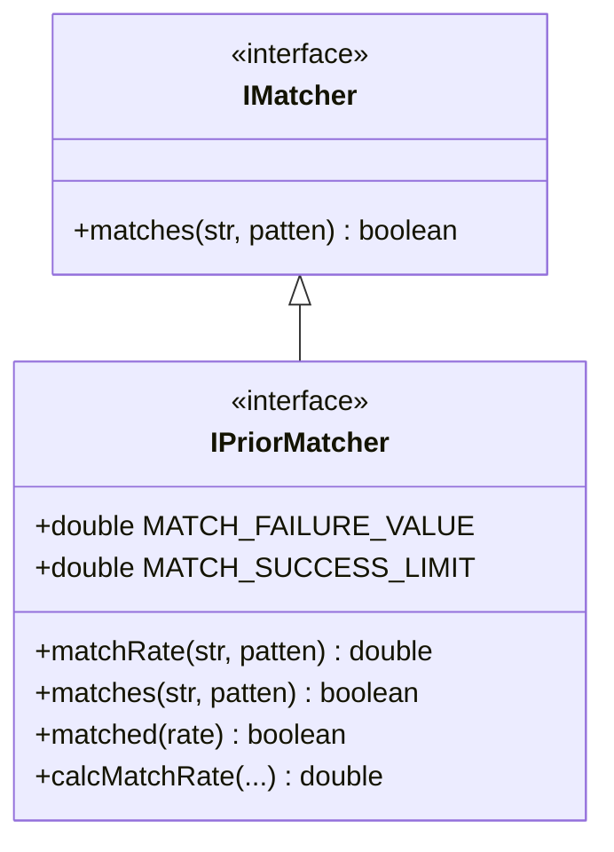

# i2f-match-std

> 字符串**匹配器标准契约层**（match-std）。延续 `i2f-tuple-std`/`i2f-browser-std`/`i2f-codec-std` 的「契约与实现分离」范式，本模块**只有两个接口**，定义「用一个模式串匹配一个目标串」这一动作的最小语义：`IMatcher` 是最简布尔契约 `boolean matches(str, patten)`；`IPriorMatcher extends IMatcher` 在其上补上本模块的灵魂——**匹配优先级/精确度**：把唯一的抽象方法改为 `double matchRate(str, patten)`（负数＝不匹配，正数＝该模式对目标串「有多匹配」的量化分），再用 `default` 把布尔版 `matches` 直接派生自 `matchRate`，并沉淀一个供所有实现共享的打分公式 `calcMatchRate(...)` 与规避浮点精度误判的阈值常量 `MATCH_SUCCESS_LIMIT=-0.5`。它解决的核心问题是：**当一个串同时命中多个模式（如路由/权限/资源通配规则）时，如何客观排序「哪个模式匹配得更精确」**。真正的 `SimpleMatcher`/`AntMatcher`/`RegexMatcher`、按分排序的 `StringMatcher`、桥接 Spring 的 `SpringAntPathMatcher` 全部下沉到 `i2f-match` 与 `i2f-spring-core`。自身仅依赖 lombok（且实际未用），零 i2f 内部依赖。

## 模块路径

- `i2f-jdk/i2f-match-std`

## 模块依赖

| GroupId | ArtifactId | Scope | Optional | 来源 | 用途 |
| --- | --- | --- | --- | --- | --- |
| org.projectlombok | lombok | provided | 是（根 POM `dependencyManagement` 托管） | 三方 | pom 声明，但两个接口**均未使用任何 lombok 注解**，属冗余声明 |

- **零 i2f 内部依赖**：`IMatcher`/`IPriorMatcher` 均为纯接口，仅用 JDK 语言特性（接口继承、`default` 方法、静态常量）。
- 运行期零三方依赖。

## 模块设计

两支接口构成「布尔 → 打分」两级递进契约：



### 1. `IMatcher`：最小布尔契约

单方法 `boolean matches(String str, String patten)`——只回答「目标串 `str` 是否命中模式 `patten`」。参数顺序刻意是「**被匹配串在前、模式在后**」（`str, patten`）。它让「不关心精确度、只要是否匹配」的调用方有一个最朴素的依赖点。

### 2. `IPriorMatcher`：可返回「匹配度」的增强契约

继承并扩展 `IMatcher`，把「唯一必须实现的方法」换成打分版：

- `double matchRate(String str, String patten)`（**抽象**）：负数＝不匹配；非负＝「（末尾匹配程度 + 总体匹配重叠度）的均值」，可用于比较「哪个 `patten` 更精准地匹配 `str`」。
- `default boolean matches(str, patten)`：覆写父接口，实现为 `matched(matchRate(str, patten))`——**布尔匹配天然从打分派生**，实现类无需另写 `matches`。
- `default boolean matched(double rate)`：`rate > MATCH_SUCCESS_LIMIT` 即为匹配。
- `default double calcMatchRate(matchEndStrIndex, matchEndPattenIndex, strLen, pattenLen, matchEndMatchedCount)`：全体实现共享的打分公式，保证不同 matcher 产出的分值**可横向比较**。

### 3. 打分公式与阈值设计

```
calcMatchRate = ((matchEndStrIndex + matchEndPattenIndex) / (strLen + pattenLen)) * 0.5
              + (matchEndMatchedCount / strLen) * 0.5
```

- 第一项度量「**位置推进度**」：匹配推进到的下标之和占总长度的比例（越接近串尾，说明模式与目标重合越充分）。
- 第二项度量「**字面重叠度**」：真正逐字符命中的个数占目标串长度的比例（通配越少、字面命中越多则分越高）。
- 两项各权重 `0.5` 取均值。`MATCH_FAILURE_VALUE=-1.0` 统一表示失败；`MATCH_SUCCESS_LIMIT=-0.5` 而非 `0`，正是因为分值是浮点计算，直接和 `0.0`/`-1.0` 比较可能因精度误判，故取两者中间值做判定阈值。

## 模块目的

- 用两个接口把「字符串模式匹配」抽象成统一、可插拔的契约，让匹配算法（通配、Ant、正则、Spring 路径）与匹配结果的消费者解耦。
- 相比只返回布尔的经典匹配器，额外提供**匹配精确度**这一维度，解决「多规则同时命中时按精确度择优」的通用诉求（路由/权限/资源映射选最具体规则）。
- 把打分公式与成功阈值固化在契约层（`default` 方法 + 常量），使所有实现口径一致、分值可互相比较。

## 模块功能

| 接口 | 成员 | 类型 | 功能 |
| --- | --- | --- | --- |
| `IMatcher` | `matches(str, patten)` | 抽象 | 布尔：`str` 是否命中 `patten` |
| `IPriorMatcher` | `MATCH_FAILURE_VALUE` | 常量 `-1.0` | 统一的「不匹配」返回值 |
| | `MATCH_SUCCESS_LIMIT` | 常量 `-0.5` | 判定匹配成功的阈值（规避浮点精度误判） |
| | `matchRate(str, patten)` | 抽象 | 打分：负＝不匹配，非负＝匹配精确度 |
| | `matches(str, patten)` | default | 由 `matched(matchRate(...))` 派生布尔匹配 |
| | `matched(rate)` | default | `rate > MATCH_SUCCESS_LIMIT` 判是否命中 |
| | `calcMatchRate(...)` | default | 供实现复用的统一打分公式（位置推进度 + 字面重叠度取均值） |

## 模块主要使用方法

契约层本身不含算法，落地在 `i2f-match`。典型使用是「**一个串 + 多个模式，取最精确匹配者**」：

```java
// 实现方：只需写 matchRate，不匹配返回 MATCH_FAILURE_VALUE，命中末尾用 calcMatchRate 打分
public class MyMatcher implements IPriorMatcher {
    @Override
    public double matchRate(String str, String patten) {
        // ... 逐段匹配，失败：return MATCH_FAILURE_VALUE;
        // 命中结束：return calcMatchRate(sidx, pidx, str.length(), patten.length(), matchedCount);
    }
}

// 消费方：i2f-match 的 StringMatcher 把多个模式按 matchRate 降序排名
StringMatcher sm = StringMatcher.antPath();
List<String> best = sm.priorMatches("/a/b/c.png", "/**/*.png", "/a/**", "/**"); // 越精确者越靠前
boolean hit = sm.getMatcher().matches("/a/b/c.png", "/**/*.png");               // 只用布尔判定
```

**注意事项：**
- 参数顺序统一为 `(str, patten)`（被匹配串在前）；调用 Spring 的 `AntPathMatcher`（其签名是 `(pattern, path)`）时须留意在实现里已做参数交换（见 `SpringAntPathMatcher`）。
- 实现 `matchRate` 时务必：不匹配一律返回 `MATCH_FAILURE_VALUE`（`-1.0`），命中返回值必须 `> -0.5`，才能与 `matches`/`matched`/`StringMatcher.priorMatches` 的阈值判定自洽。
- 只需 `IMatcher` 语义时可直接依赖 `matches`；一旦实现 `IPriorMatcher`，`matches` 已有 `default`，无须重复实现。

## 模块特性总结

- **两级契约**：`IMatcher`（布尔）→ `IPriorMatcher`（打分，`matches` 由 `matchRate` 派生），依赖方可按需要选择最宽或最强契约。
- **匹配精确度可量化**：`matchRate` + 共享 `calcMatchRate` 让「多规则同时命中时择优排序」成为一等能力。
- **浮点安全阈值**：`-0.5` 判定线而非 `0`/`-1`，规避浮点精度误判。
- **契约与实现彻底分离**：算法（通配/Ant/正则/Spring 路径）与按分排序门面全部在下游，本层零实现、零内部依赖、运行期零三方。
- **口径统一**：打分公式与常量集中在接口 `default`/静态常量，跨实现可比。

## 可拓展方向

- 可新增 `IMatcher`/`IPriorMatcher` 的其它实现（如 glob、路径前缀、CIDR、SpEL 表达式匹配），只要产出与 `calcMatchRate` 同尺度的分值即可无缝接入 `StringMatcher` 的排序。
- 若需多维度加权，可把 `calcMatchRate` 的固定 `0.5/0.5` 权重提升为可配参数。
- 可增加携带模式元信息的富返回值（命中捕获组、匹配段范围），把 `matchRate` 泛化为返回一个「匹配结果对象」。

## 已知实现瑕疵与边界

以下为阅读本模块 2 个接口（共 51 行）源码、并结合下游实现核对时如实记录的细节（非臆测）：

1. **`calcMatchRate` 对空目标串返回 `NaN`**：第二项 `matchEndMatchedCount * 1.0 / strLen` 直接以 `strLen` 为除数，`str` 为空（`strLen=0`）时得 `0/0=NaN`；因 `NaN > -0.5` 恒为 `false`，故空串即便配空模式也判为「不匹配」，且该 `NaN` 会被下游 `StringMatcher.priorMatches` 的排序比较器当作非常量参与比较，排序结果不确定。属边界，需在实现侧提前拦截空串。
2. **公式两项分母不对称**：第一项除以 `strLen + pattenLen`、第二项只除以 `strLen`（不含 `pattenLen`），是一个刻意的位置/字面启发式均值而非严格归一化——跨 matcher 可比的前提是「都用同一个 `calcMatchRate`」，若某实现自评分值口径不一致会破坏排序。
3. **参数名拼写 `patten`（应为 `pattern`）**：贯穿 `IMatcher`/`IPriorMatcher` 的方法签名与注释（属对外 API 命名，改动需评估下游）。注释里另有笔误「但是哟可能小数精度问题」（应为「有可能」）。
4. **lombok 声明但未使用**：`pom.xml` 引入 lombok，但两个接口无任何 lombok 用法（与 `i2f-tuple-std` 同），属冗余依赖声明。
5. **`IMatcher` 与 `IPriorMatcher.matches` 语义须自洽**：直接实现 `IMatcher` 者自定布尔语义；实现 `IPriorMatcher` 者布尔语义被锁定为「`matchRate > -0.5`」。两者混用时（同一 `patten` 分别喂给不同 matcher 家族）布尔结果是否一致，取决于 `matchRate` 打分是否越过阈值，而非独立判定。
