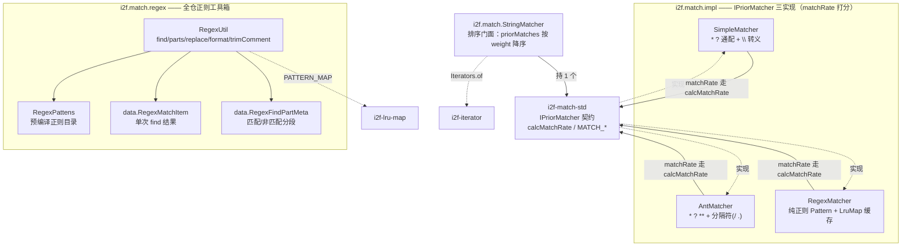
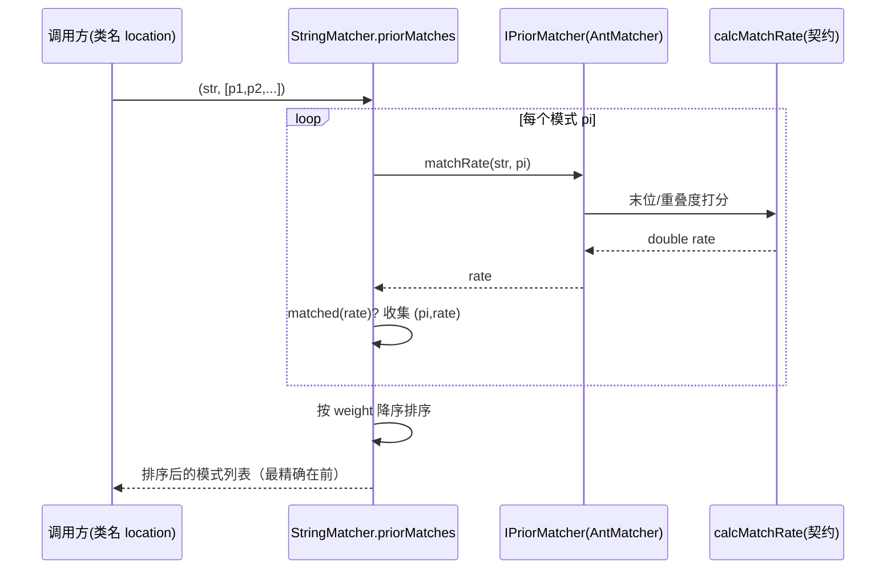

# i2f-match

> 字符串**匹配器实现层 + 正则工具箱**（match）。它是契约 `i2f-match-std`（`IMatcher`/`IPriorMatcher`）的落地所在，同时又是全仓库使用最广的正则处理门面，两者合成本模块的两条主线：其一，三个 `IPriorMatcher` 算法实现——`SimpleMatcher`（`*`/`?` 通配 + `\` 转义）、`AntMatcher`（Ant 风格 `*`/`?`/`**`，可配置分隔符，路径 `/` 或包名 `.`）、`RegexMatcher`（纯正则 `Pattern`，带 `LruMap` 编译缓存），统一按契约的 `calcMatchRate` 产出「匹配精确度」分；`StringMatcher` 作为排序门面，把「一个串同时命中多模式时按精确度择优」收敛为 `priorMatches(...)`（按权重降序返回模式列表），被 `i2f-agent`（字节码转换类匹配）、`i2f-log`（按类名模式选日志级别）等消费。其二，`regex` 子包——`RegexUtil`（`getPattern`/`regexFinds`/`regexFindParts`/`regexFindAndReplace`/`format`/`replace`/`trimComment`/`stringify`）与 `RegexPattens`（数字/标识符/引号串/多风格注释/括号/占位符等预编译正则目录），是全仓约 20 个模块共用的正则底座：funic/tiny 脚本变量插值、MyBatis `?` 回填、Groovy/Java 动态求值去 import、RAG 文本递归切分、UCode/UrlCode/XCode 编解码切分等都构建其上。依赖上游 `i2f-match-std`（契约）、`i2f-lru-map`（正则编译缓存）、`i2f-iterator`（`Iterators.of`），运行期零三方依赖。

## 模块路径

- `i2f-jdk/i2f-match`

## 模块依赖

| GroupId | ArtifactId | Scope | Optional | 来源 | 用途 |
| --- | --- | --- | --- | --- | --- |
| i2f.turbo | i2f-match-std | compile | 否 | 内部 | 匹配契约 `IMatcher`/`IPriorMatcher`，本模块三实现均 `implements IPriorMatcher`，复用其 `matchRate`/`matched`/`calcMatchRate` 与 `MATCH_FAILURE_VALUE`/`MATCH_SUCCESS_LIMIT` |
| i2f.turbo | i2f-lru-map | compile | 否 | 内部 | `RegexMatcher.cache`（1024）与 `RegexUtil.PATTERN_MAP`（2048）缓存编译后的 `Pattern` |
| i2f.turbo | i2f-iterator | compile | 否 | 内部 | `StringMatcher.priorMatches` 借 `Iterators.of(E[]/Iterable)` 把可变参数/集合统一成 `Iterator<String>` |
| org.projectlombok | lombok | provided | 是 | 三方 | 仅 `RegexMatchItem`/`RegexFindPartMeta` 两个数据类用 `@Data`/`@NoArgsConstructor`；由父 POM `dependencyManagement` 托管版本 |

> 版本均由父 POM `i2f-jdk`（`1.0-jdk8`）的 `dependencyManagement` 统一托管，本 POM 不写 `<version>`；`lombok` 在父层声明为 `provided` + `optional`。运行期无任何第三方依赖（仅 `java.util.regex` 等 JDK API）。

## 模块设计

本模块按「**匹配器算法**」与「**正则工具箱**」两条正交主线组织，四个顶层/子包各司其职：



### 1. 三算法共享契约打分，只是「如何 matchRate」不同（核心）

三者都 `implements IPriorMatcher`，都复用契约层的 `calcMatchRate(matchEndStrIndex, matchEndPattenIndex, strLen, pattenLen, matchEndMatchedCount)` 与常量 `MATCH_FAILURE_VALUE=-1.0`/`MATCH_SUCCESS_LIMIT=-0.5`，因此布尔版 `matches` 与 `matched` 均由契约 `default` 派生，实现类只需写 `matchRate`：

- **`SimpleMatcher`**：线性双指针扫描 `*`（跳到下一个非通配 token，用 `startsWith` 探位）/`?`（单字符）/字面量匹配（累计 `mlen`），`\*`/`\?` 转义为字面 `*`/`?`，`\` 后非关键字符则保留原义；结束时 `calcMatchRate(sidx, pidx, slen, plen, mlen)`。
- **`AntMatcher`**：在 Simple 基础上加 `**` 跨分隔符多级匹配，`sep` 可配（`/` 路径、`.` 包名，或构造器传入）。`**` 分支对「剩余串 × 剩余模式」做**递归贪婪回溯**（`tryCount=100` 上界），命中即返回 `currRate*currRate + nextRate*(1-currPer)` 的**自融合打分**（非 `calcMatchRate`）。
- **`RegexMatcher`**：直接 `Pattern.matcher(str).matches()`（全串匹配）判定成败；命中后按「剥掉一组元字符 token 后剩余字面量长度」估算精确度，`Pattern` 经 `LruMap(1024)` 缓存。

### 2. `StringMatcher`：把「多模式命中」升华为「按精确度择优排序」

持一个 `IPriorMatcher`，提供工厂 `simple()`/`ant(sep)`/`antPath()`/`antClass()`，透传 `match`/`matchWithRate`/`matched`，灵魂是 `priorMatches(str, pattens...)`：遍历所有模式，收集 `matched` 者为 `(patten, rate)`，按 `rate` **降序**排序后返回模式串列表——即「最精确的模式排最前」。典型落地：`i2f-log` 的 `DefaultClassNamePattenLogDecider.enableLevel` 用 `StringMatcher.antClass().priorMatches(location, pattenMapping.keySet())` 取 `get(0)`，为「一个类名命中多条日志级别规则」选出最具体的那条。



### 3. `regex` 子包：全仓正则工具箱（本模块真正的「广使用」面）

- **`RegexUtil`**：
  - `getPattern(regex[,flags])`：`LruMap(2048)` 缓存 `Pattern.compile`；
  - `regexFinds`：`Matcher.find()` 循环收集 `RegexMatchItem`（含 `idxStart`/`idxEnd`），可 `limit`；
  - `regexFindParts`：把原串切成「非匹配段 / 匹配段」交替的有序 `RegexFindPartMeta` 列表——**这是「按正则切分后分别处理再重组」的基石**（编解码、RAG 切分都靠它）；
  - `regexFindAndReplace`：基于 `regexFindParts`，对匹配段套 `mapper` 再拼回整串（funic `${var}` 插值、MyBatis `?` 回填、动态求值去 import）；
  - `replace`（三重载：定串 / `Function` / `BiFunction<片段,序号>`）：通用「找-换」，`BiFunction` 版带上匹配序号；
  - `format(format, args...)`：一套 `{索引 标志:格式}` 占位符格式化引擎（比 SLF4J `{}` 更强：支持负索引、`t/T` 类名、`e` null 转空串、`c` 打堆栈、`s` 走 `String.format`、日期类型走 `SimpleDateFormat`/`DateTimeFormatter`）；
  - `stringify`：递归展开数组为 `[a, b, c]`，null 用占位；`trimComment`：用 `RegexPattens.COMMON_COMMENT_REGEX` 去 `//`、`/* */` 注释。
- **`RegexPattens`**：预编译正则目录——整数/浮点、C/Java 声明名与全限定名、双/单引号串、单行/多行/`#`/`--`/XML 注释、大中小括号配对、以及驱动 `format` 的 `INDEXED_FORMAT_PLACEHOLDER_REGEX`。
- **`data`**：`RegexMatchItem`（一次 find 的原文/正则/命中串/起止下标）、`RegexFindPartMeta`（一段 + `isMatch` 标志），均为 lombok `@Data`。

## 模块目的

- 让「字符串匹配」不止步于布尔：以 `matchRate` 量化「有多匹配」，`StringMatcher.priorMatches` 解决「多规则同时命中时选最精确」的真实工程问题（日志级别、类转换匹配、路由/权限通配择优）。
- 把「正则」这一 Java 里最琐碎易错的文本操作，沉淀成一套带缓存、可切分重组、可格式化占位符的统一门面 `RegexUtil`，避免全仓各处重复 `Pattern.compile` 与手写 `Matcher` 循环。
- 三种匹配力度递进可选：Simple（朴素通配）→ Ant（分层路径/包名）→ Regex（完全正则），共享同一打分契约以便横向比较与统一排序。

## 模块功能

| 类型 | 提供 | 说明 |
| --- | --- | --- |
| 匹配算法 | `SimpleMatcher`（含 `INSTANCE`） | `*`/`?` 通配，`\*`/`\?` 转义，`matchRate` 打分 |
| 匹配算法 | `AntMatcher`（`PATH`/`PKG` 常量，`sep` 可配） | Ant 风格 `*`/`?`/`**`，多级贪婪回溯 |
| 匹配算法 | `RegexMatcher`（含 `INSTANCE`） | 纯正则全串匹配，`LruMap` 缓存 `Pattern` |
| 排序门面 | `StringMatcher` | `simple/ant/antPath/antClass`、`match`、`matchWithRate`、`priorMatches`（按精确度降序） |
| 正则工具 | `RegexUtil` | `getPattern`/`regexFinds`/`regexFindParts`/`regexFindAndReplace`/`replace`/`format`/`stringify`/`trimComment` |
| 正则目录 | `RegexPattens` | 数字/标识符/引号串/注释/括号/占位符等预编译正则常量 |
| 数据 | `RegexMatchItem` / `RegexFindPartMeta` | 单次命中结果 / 匹配·非匹配分段元 |

## 模块主要使用方法

**按精确度为多模式择优排序**（日志级别决策式用法）：

```java
// 一个类名同时命中多条 Ant 模式时，取最精确的一条规则
StringMatcher matcher = StringMatcher.antClass();
List<String> priored = matcher.priorMatches(
        "i2f.foo.BarService",
        "i2f.**", "i2f.foo.**", "i2f.foo.Bar*");
String best = priored.get(0); // 打分最高（最具体）的模式排在最前
```

**三算法各取所需**：

```java
boolean p = StringMatcher.antPath().match("/user/auth/inner", "/user/**"); // Ant 路径
boolean c = SimpleMatcher.INSTANCE.matches("a12b", "a*b");                // 朴素通配
boolean r = RegexMatcher.INSTANCE.matches("2026-09-09", "\\d{4}-\\d{2}-\\d{2}"); // 正则
```

**正则切分-重组（`regexFindAndReplace` 惯用法）**：

```java
// funic 脚本 ${var} 插值：把每个 ${...} 命中段交给 mapper 转换后拼回整串
String out = RegexUtil.regexFindAndReplace(text, "\\$\\{[^}]+\\}",
        seg -> resolve(seg.substring(2, seg.length() - 1)));
```

**增强占位符格式化（`RegexUtil.format`）**：

```java
String s = RegexUtil.format("time={0:yyyy-MM-dd HH:mm:ss} null={1e} err={2c}",
        new Date(), null, throwable); // 日期格式化 / null 转空串 / 异常带堆栈
```

**去注释 / 收集命中**：

```java
String code = RegexUtil.trimComment(javaSource); // 去 // 与 /* */
List<RegexMatchItem> found = RegexUtil.regexFinds(text, "(?i)version\\s+is\\s+([0-9.]+)");
```

注意事项：
- `priorMatches` 的跨算法可比性依赖大家都走 `calcMatchRate`；`AntMatcher` 的 `**` 命中返回的是自融合分（`currRate² + nextRate·(1-currPer)`），量纲与其它分并不严格一致，混排时以同一种 matcher 内部比较为准。
- `RegexUtil` 与 `RegexMatcher` **各自维护独立的 `Pattern` 缓存**（2048 / 1024），不互通。
- `RegexMatcher.matches`/`matchRate` 用 `Matcher.matches()`（**全串**匹配），非 `find()`；要子串命中需自带 `.*`。

## 模块特性总结

- **契约落地 + 打分择优**：三 `IPriorMatcher` 实现复用 `i2f-match-std` 的 `calcMatchRate`，`StringMatcher` 把「多模式命中」升级为「精确度降序排序」。
- **匹配力度三级递进**：Simple（通配）→ Ant（分层 `**` + 可配分隔符）→ Regex（完全正则），同一契约横向可选。
- **全仓正则底座**：`RegexUtil`（find/parts/replace/format）+ `RegexPattens`（正则目录）被 agent/log/codec/mybatis/antlr4-funic/ai-std/xproc4j/selenium/jdbc 等约 20 模块依赖。
- **带缓存**：`RegexMatcher`、`RegexUtil` 各以 `LruMap` 缓存编译 `Pattern`，热路径避免重复 `Pattern.compile`。
- **增强占位符**：`RegexUtil.format` 提供负索引、类型名、null 语义、异常堆栈、日期/`String.format` 双模式等超越 JDK/SLF4J 的格式化能力。
- **零三方运行期依赖**：仅 `java.util.regex` + 三个 i2f 兄弟 + lombok（provided/optional）。

## 已知实现瑕疵

以下为通读源码核实、与直觉或注释不符之处，供使用与后续修订参考：

1. **`RegexUtil.format` 实际忽略声明的索引**：解析出 `idx`（含 `{0}`/`{2}`/负索引）后，取值行却是 `val = args[i]`——`i` 是占位符**出现序号**，并非声明索引。故「显式下标选值」并未生效，仅用于越界判定与负索引换算；要按声明下标取值应改为 `args[idx]`。
2. **`format` 负索引两条分支口径不一**：冒号分支 `idx = args.length + idx`（`-1`→末位，正确），无冒号分支 `idx = args.length - 1 + idx`（`-1`→倒数第二，偏一位）。`{-1}` 与 `{-1:}` 解析不一致（虽被瑕疵 1 掩盖）。
3. **`StringMatcher.priorMatches` 比较器非合法全序**：`(o1.weight > o2.weight) ? -1 : 1` 在权重相等时返回 `1`（既称 o1>o2，交换后又称 o2>o1），违反 `Comparator` 反对称性；等权/NaN 时排序结果不稳定。
4. **`RegexMatcher.matchRate` 打分退化**：`calcMatchRate(strLen, pattenLen, strLen, pattenLen, min(residual, strLen))` 使第一项恒为 `0.5`，只剩第二项随「剥元字符后的字面量长度」变化；纯元字符模式（如 `\d+`）一律得平铺的 `0.5`，并非真正的「精确度」度量，`TestMatcher` 中 `matchRate("\\d+", "12345678910")` 期望 `false` 恰暴露此不稳定性。
5. **空安全不一致**：`AntMatcher`/`RegexMatcher` 对 `str`/`pattern` 显式判 null，而 `SimpleMatcher` 无判空，`null` 入参会 NPE。
6. **`AntMatcher` 性能与打分隐患**：每次 `matchRate` 都 `Pattern.compile(sep, LITERAL)`（未缓存）；`**` 递归回溯以 `tryCount=100` 为硬上界，超深路径可能漏配；`**` 命中分与其它 matcher 非同一量纲，跨算法混排时不可靠。
7. **重复正则缓存**：`RegexMatcher.cache`(1024) 与 `RegexUtil.PATTERN_MAP`(2048) 各自为政，同一 `Pattern` 可能被两处分别编译缓存。
