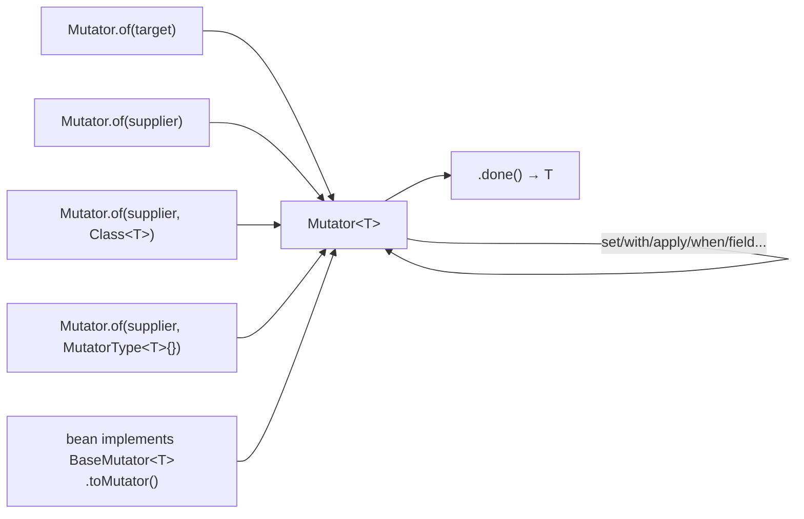
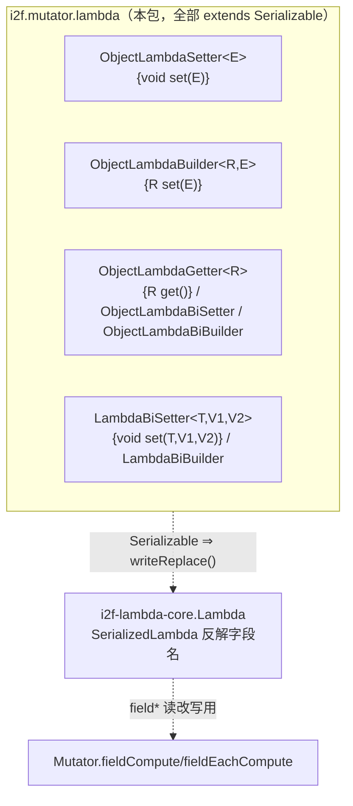
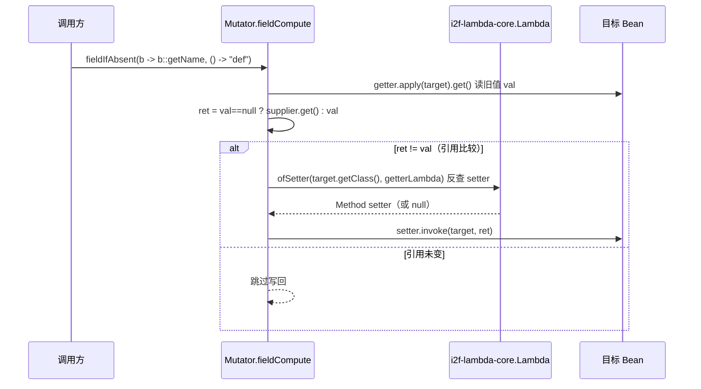

# i2f-mutator

> 流式**对象修改器**（mutator）。提供统一门面 `Mutator<T>`，用「方法引用 / 无参方法引用」在链式调用中**即时修改任意对象**——不依赖 Lombok `@Builder`、不需要为目标类预写链式 setter，即可 `Mutator.of(bean).set(b -> b::setName, "x").with(u -> u::age, 18).set2(map::put, k, v).when(t -> t.getId()==null, t -> t.setId(gen())).done()`。它区分 `set`（无返回值 setter）与 `with`（返回源对象的链式 setter）两族、单元与双元（`set2`/`with2`）两档，并叠加 `apply`/`map`/`cast`/`orElse` 等控制流。最有特色的是 `field*` 反射族（`fieldIfAbsent`/`fieldIfPresent`/`fieldCompute`/`fieldEachCompute`）：借 `i2f-lambda-core` 的 `writeReplace`→`SerializedLambda` 反查 getter 方法引用对应的**字段名**，再反射定位 setter 写回，实现「只给 getter 引用，即可读-改-写」「按类型批量遍历全部字段」。自身仅依赖 `i2f-lambda-core` + lombok（provided/optional），零三方运行期依赖。`BaseMutator<T>` 让任何领域对象实现一个 default 方法即可获得 `.toMutator()` 入口，已被 network / ai-std / ai-rest-openai / spring-web / funic 等广泛实现。

## 模块路径

- `i2f-jdk/i2f-mutator`

## 模块依赖

| GroupId | ArtifactId | Scope | Optional | 来源 | 用途 |
| --- | --- | --- | --- | --- | --- |
| i2f.turbo | i2f-lambda-core | compile | 否 | 内部 | `field*` 反射族的地基：`Lambda.ofSetter`/`ofFieldName`/`walkField`/`getGetter`/`getSetter`，把 getter 方法引用反解为字段名并定位 setter |
| org.projectlombok | lombok | provided | 是 | 三方（根 POM 托管） | 编译期样板；核心 `Mutator` 手写，lombok 非运行期必需 |

- **内部依赖**：`i2f-lambda-core`（进而传递带入 `i2f-lru-map` 做反射缓存）。
- **三方运行期依赖**：无，纯 JDK 反射（`java.lang.reflect.Method`/`Field`/`Array`）。
- 构建仅配 `maven-assembly-plugin`。

## 模块设计

### 入口与终结



- `Mutator<T>` 只持一个可变字段 `protected T target`；除 `map`/`cast` 外所有链式方法 `return this`，`done()` 交出 `target`。
- `of(Supplier, Class<T>)` 与 `of(Supplier, MutatorType<T>)` 的两个类型参数**运行期被忽略**，只为在 `supplier` 返回类型不够具体时（如 `ArrayList::new`、`HashMap::new`）**辅助编译器/IDE 推断补全类型**——`MutatorType<T>` 是空的「类型令牌」超类型标记（`interface MutatorType<T>{}`），用 `new MutatorType<Map<String,Object>>(){}` 匿名子类捕获泛型实参（super type token 技巧）。
- `BaseMutator<T extends BaseMutator<T>>` 是 CRTP 自限定标记接口，唯一 `default toMutator()` = `Mutator.of((T) this)`；领域对象 `implements BaseMutator<自身>` 即零成本获得流式改值入口。

### 两族 × 两档 setter（set / with × 单值 / 双值）

区分维度是**目标方法是否有返回值**与**参数个数**：

| 方法 | 目标形状 | 语义 |
| --- | --- | --- |
| `set(ISetter<T,E>, val)` | 类引用（未绑定）`Class::setXxx` void setter | `setter.accept(target, val)` |
| `set(Function<T,ObjectLambdaSetter<E>>, val)` | 实例引用（已绑定）`u -> u::setXxx` | `setter.apply(target).set(val)` |
| `with(IBuilder<R,T,E>, val)` | 类引用 `Class::withXxx`（返回对象）builder setter | `setter.apply(target, val)`，返回值丢弃 |
| `with(Function<T,ObjectLambdaBuilder<R,E>>, val)` | 实例引用 `u -> u::withXxx` | `setter.apply(target).set(val)`，返回值丢弃 |
| `set2/with2(LambdaBiSetter/LambdaBiBuilder, v1, v2)` | 未绑定双参 | `setter.set(target, v1, v2)` |
| `set2/with2(Function<T,ObjectLambdaBiSetter/BiBuilder>, v1, v2)` | 已绑定双参 `u -> u::put` | `setter.apply(target).set(v1, v2)` |

- **`set` vs `with`**：`set` 面向 `void` setter；`with` 面向「返回源对象」的链式/builder setter。二者在 Mutator 内**都丢弃目标方法返回值、继续用自身 `target`**（链式返回由 Mutator 接管，不依赖目标是否 fluent）。
- **类引用 vs 实例引用**两条并行写法：类引用走 `i2f-lambda-core` 的 `ISetter`/`IBuilder`（把 target 当首参的未绑定方法引用）；实例引用走本包 `lambda` 的 `Object*` 函数式接口（`u -> u::xxx`，IDE 可对真实实例补全）。



- `lambda` 包 7 个 SAM **全部 `extends Serializable`**：在 `set`/`with` 直调路径上序列化并非必需，但 `ObjectLambdaGetter` 等被 `field*` 族用作「可反解的方法引用」——只有 `Serializable` 的 lambda 才有 `writeReplace()`，供 `i2f-lambda-core` 反射出 `getImplMethodName()`→字段名。这与 `i2f-functional`/`i2f-lambda-core` 的「为反射而序列化」一脉相承。

### 零/无参方法调用与空判定

- `set(Function<T,Runnable>)`：`u -> u::json` 触发一个**无参 void** 方法；`with(Function<T,Supplier<R>>)` / `apply(Function<T,R>)`：调用**无参有返回**方法（返回值丢弃）。
- `when(Predicate, Consumer)`：条件执行；`fieldNull/fieldEmpty/fieldBlank(Function<T,Supplier<..>>, Consumer)`：以某**字段值**是否为 null / 空 / 空白为条件执行。判空由内置 `isEmpty(Object)`（null、`String.isEmpty`、`Collection`/`Map` 空、数组长度 0、`CharSequence` 长度 0 → true）与 `isBlank(String)`（全空白）自持实现，不引外部工具。

### 反射式字段读改写（核心特性）

`field*` 族是 mutator 区别于普通链式 setter 的关键——**只给 getter 方法引用，即可读旧值、算新值、反射写回**：



- `fieldIfAbsent`/`fieldIfAbsentV`（缺省填充）、`fieldIfPresent`（存在才转换）、`fieldCompute`（通用读改写）：经 `Lambda.ofSetter(clazz, getterLambda)` 用 getter 的 `SerializedLambda` 反推字段名并按命名约定（`set/with/enable/build` 前缀）定位 setter；找不到 setter 抛 `IllegalStateException("cannot find setter for field : ...")`。
- **写回判等用引用 `!=` 而非 `equals`**：引用不变即视为未修改、跳过赋值（源码注释明确说明），避免等值也无谓触发 setter。
- `fieldEachCompute(Class<E>, BiFunction)` / `fieldEachCompute(Predicate<Field>, BiFunction<Object,Field,Object>)`：**批量**遍历——`Lambda.walkField` 沿类层次（`getFields` + `getDeclaredFields`，递归到 `Object` 前止）收集匹配字段，逐个「getter 优先、退化 `field.setAccessible` 读」→ compute → 「setter 优先、退化 `field.set` 写」，实现「把某类型的所有字段按规则批量改值」。

### 依赖关系

- 上游：`i2f-lambda-core`（`field*` 反射族的字段反查能力）。
- 下游（`BaseMutator` 被实现，广泛）：`i2f-network`、`i2f-ai-std`、`i2f-ai-rest-openai`（MCP 请求/响应）、`i2f-spring-web`、`i2f-springboot-ops-starter`、`i2f-extension-antlr4`（funic 脚本值对象大量 `implements BaseMutator`）、`i2f-extension-xproc4j`、`i2f-extension-ai-rag-sqlite`；经 `i2f-jdk-all` 聚合。

## 模块目的

- **免样板流式改值**：在不给每个 DTO 写 `@Builder`/链式 setter 的前提下，对外部或既有类也能「一个表达式链」完成多属性赋值。
- **类型安全的属性寻址**：用 `u -> u::setXxx` 方法引用替代字符串属性名，重命名/改类型时编译期即暴露。
- **可读改写的声明式组合**：`fieldIfAbsent`/`when`/`orElse` 把「判空填充、条件修改、缺省替换」收敛进同一条链，配合反射 `field*` 达成「给 getter 就能改」。
- **契约下沉**：`BaseMutator` 作为极轻标记接口，使任意对象可选接入，不强制继承体系。

## 模块功能

| 能力 | 载体 | 说明 |
| --- | --- | --- |
| 流式改值门面 | `Mutator<T>` | 包装 target，链式返回 `this`，`done()` 交出 |
| 两种入口 | `of(...)` 多重载 / `BaseMutator.toMutator()` | 含 super-type-token 型 `Class`/`MutatorType` 推断辅助 |
| 单值 set/with | `set`/`with`（类引用 & 实例引用各两重载） | void setter vs 返回源 builder setter |
| 双值 set2/with2 | `set2`/`with2`（`LambdaBi*` / `ObjectLambdaBi*`） | 适配 `put(k,v)` 型双参设置 |
| 无参方法调用 | `set(Runnable)`/`with(Supplier)`/`apply(Function)` | `u -> u::json` 直接触发方法 |
| 条件/缺省控制流 | `when`/`fieldNull`/`fieldEmpty`/`fieldBlank`/`orElse` | 目标级与字段级条件、空值替换 |
| 视角切换 | `map`/`cast` | 把 Mutator 切到另一对象/子类型 |
| 反射读改写 | `fieldIfAbsent(V)`/`fieldIfPresent`/`fieldCompute` | getter 方法引用反查 setter，引用判等跳过写回 |
| 批量字段修改 | `fieldEachCompute`（按类型 / 按 Predicate） | 沿类层次遍历字段批量读改写 |
| 内置空判定 | `isEmpty(Object)`/`isBlank(String)` | null/String/集合/Map/数组/CharSequence |

## 模块主要使用方法

### 1）DTO 实现 BaseMutator，链式装配

```java
public class RestHttpResponse<T> implements BaseMutator<RestHttpResponse<T>> { /* ... */ }

return new RestHttpResponse<T>().toMutator()
        .set(u -> u::setStatusCode, resp.getStatusCode())   // 实例引用（void setter）
        .set(RestHttpResponse::setBody, obj)                 // 类引用（ISetter）
        .with(u -> u::headers, resp.getHeader())             // 返回源对象的 builder setter
        .set(u -> u::json)                                   // 调无参 void 方法
        .with(u -> u::build)                                 // 调无参有返回方法（值丢弃）
        .done();
```

### 2）集合/双属性设置（set2 / with2）

```java
Mutator.of(new HashMap<String,Object>())
       .set2((Map<String,Object> m, String k, Object v) -> m.put(k, v), "a", 1)  // LambdaBiSetter
       .set2(m -> m::put, "b", 2)                                                // ObjectLambdaBiSetter（实例绑定）
       .done();
```

### 3）条件、缺省与视角切换

```java
User u = Mutator.of(User::new, User.class)
        .when(x -> x.getId() == null, x -> x.setId(UUID.randomUUID().toString()))
        .orElse(userFromDb)                 // 若 target 为 null 则替换（默认谓词 isNull）
        .fieldIfAbsent(x -> x::getName, () -> "anonymous") // 反射读改写：name 为空才填
        .map(User::getProfile)              // 切到 profile 视角，返回 Mutator<Profile>
        .done();
```

### 4）批量按类型改字段

```java
// 把对象里所有 String 字段做 trim（含继承字段），非 String / 无 setter 自动跳过
Mutator.of(dto).fieldEachCompute(String.class, (v, field) -> ((String) v).trim()).done();

// 自定义字段过滤（如仅 @Sensitive 字段脱敏）
Mutator.of(entity).fieldEachCompute(
        f -> f.isAnnotationPresent(Sensitive.class),
        (v, f) -> mask(v)).done();
```

### 注意事项

- **`with` 不改变链式目标**：`with` 丢弃被调方法返回值，链始终作用于同一 `target`；若需要「返回新对象后继续改新对象」，应改用 `map(...)` 显式切换视角。
- **`field*` 依赖命名约定定位 setter**：字段须存在符合 `set/with/enable/build` 前缀（或与字段同名）的 public setter，否则抛 `IllegalStateException`；纯只读字段不可用于 `field*` 写回。
- **写回以引用相等（`!=`）判定是否变化**：`computer` 返回同一引用则跳过 setter；返回「等值但不同实例」仍会写回——不要用 `equals` 语义预期「值没变就不写」。
- **`fieldEachCompute` 静默吞异常**：单个字段读写报错被 `// ignore error` 吞掉，批量结果可能不完整而无告警。
- **`cast(Class<R>)` 是 unchecked 强转**：`clazz` 仅辅助推断，实际按 `R extends T` 无校验强转，类型不符会在后续使用时才 `ClassCastException`。
- **大量 `set`/`with` 重载靠方法引用目标签名消歧**：`u -> u::xxx` 绑定到哪个函数式接口，取决于 `u::xxx` 是 0 参 void（`Runnable`）、0 参有返回（`Supplier`）、1 参（`ObjectLambdaSetter/Builder`）等；写错形状会命中非预期重载。

## 模块特性总结

- **免构建器流式改值**：链式 `set/with/apply/...done()`，对任意外部类即时装配。
- **set/with × 单/双值 × 类/实例引用** 的四维 setter 矩阵，覆盖 void、fluent、`put(k,v)`、`u::xxx` 等常见形状。
- **反射式 `field*`**：只给 getter 方法引用即读改写，`fieldEachCompute` 支持按类型/谓词批量修改全部（含继承）字段。
- **与 i2f-lambda-core 共生**：`lambda` 包 SAM 全 `Serializable`，正是为 `SerializedLambda` 反查字段名提供前提。
- **super-type-token 类型补全**：`of(supplier, Class|MutatorType)` 让泛型容器构造也能精确推断。
- **CRTP 轻接入**：`BaseMutator<T extends BaseMutator<T>>` 一个 default 方法接入，被下游广泛实现。
- **零三方依赖**：纯 JDK 反射 + `i2f-lambda-core`。

## 已知实现瑕疵与边界

- **类 Javadoc 示例笔误**：示例中 `apply(HttpRequest::json)` 与其上文类型 `RestHttpResponse` 类名不一致（仅注释，不影响代码），照抄示例易困惑。
- **`with` 语义易误解**：命名暗示「返回新对象的 builder」，但 Mutator 丢弃其返回值继续用原 `target`，与直觉的「with 产生副本」不同，需以 `map` 才切换目标。
- **`field*` 强耦合 setter 命名约定**：无规范 setter 的字段（如仅 Lombok `@Getter`、record 组件、final 字段）不能经 `fieldCompute` 写回；`fieldEachCompute` 对这类字段静默跳过或吞异常，问题不易察觉。
- **`isEmpty(String)` 为 static、`isBlank`/`isEmpty(Object)` 为实例方法**：三者静态性不统一（功能无碍，仅风格）。
