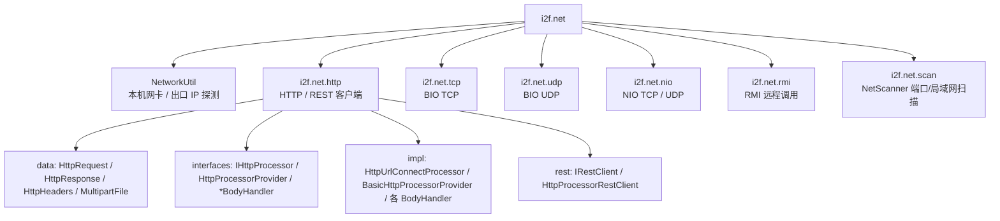

# i2f-network

> 基于 JDK 标准网络 API 的通用网络能力模块，零第三方网络框架依赖，统一封装 HTTP 客户端（含 REST 语义）、BIO/NIO 双实现的 TCP/UDP 通信、RMI 远程调用、本机网卡与出口 IP 探测、以及局域网/端口并发扫描，为上层组件提供可插拔、 fluent 化的网络访问骨架。

## 模块路径

- `i2f-jdk/i2f-network`

## 模块依赖

| GroupId | ArtifactId | Scope | Optional | 说明 |
|---------|-----------|-------|----------|------|
| i2f.turbo | i2f-mutator | compile | false | 提供 `BaseMutator`/`Mutator` 流式（fluent）构建基类，HTTP 请求/响应、REST、 multipart 等模型普遍实现 |
| i2f.turbo | i2f-serialize-impl | compile | false | 提供 `Json2Serializer`/`Xml2Serializer`，用于请求体序列化与响应体反序列化 |
| i2f.turbo | i2f-io-stream | compile | false | 提供 `StreamUtil`，用于流复制、读取字节/字符串、本地化缓存 |
| i2f.turbo | i2f-form-url-encoded | compile | false | 提供 `FormUrlEncodedEncoder`，将对象/Map 编码为 `application/x-www-form-urlencoded` |
| org.projectlombok | lombok | compile | false | 编译期代码生成（`@Data`、`@NoArgsConstructor`） |

> 网络传输层完全构建于 JDK 标准库之上：HTTP 基于 `java.net.HttpURLConnection`，Socket 基于 `java.net`（BIO）与 `java.nio.channels`（NIO），RMI 基于 `java.rmi`。`HttpMultipartFormDataRequestBodyHandler` 使用的 `i2f.reflect.ReflectResolver` 由上述依赖（`i2f-serialize-impl`）传递引入，非本模块直接声明。

## 模块设计

### 分层与子域划分

模块按协议域划分为 5 个相对独立的子域，均汇聚于 `i2f.net` 包下，彼此无强耦合，可按需单独使用：



### 包结构

| 包 | 职责 | 关键类型 |
|----|------|----------|
| `i2f.net` | 本机网络信息探测 | `NetworkUtil`（含内部类 `IpEntry`） |
| `i2f.net.http` | HTTP 门面入口 | `HttpUtil`（全局 `httpProvider`、URL 生成、响应本地化） |
| `i2f.net.http.consts` | HTTP 常量 | `ContentTypeConstants`、`HttpHeaderConstants`、`HttpMethodConstants`、`HttpStatusConstants`、`CharsetConstants` |
| `i2f.net.http.data` | 请求/响应数据模型 | `HttpRequest`、`HttpResponse`、`HttpHeaders`、`MultipartFile` |
| `i2f.net.http.interfaces` | 处理契约 | `IHttpProcessor`、`HttpProcessorProvider`、`IHttpRequestBodyHandler`、`IHttpResponseBodyHandler`、`IHttpResponseExtractor` |
| `i2f.net.http.impl` | 处理实现 | `HttpUrlConnectProcessor`、`BasicHttpProcessorProvider`、各 `*RequestBodyHandler` |
| `i2f.net.http.rest` | REST 语义封装 | `IRestClient`、`HttpProcessorRestClient`、`RestHttpRequest`/`RestHttpResponse` |
| `i2f.net.tcp` | 阻塞式 TCP | `TcpServer`、`TcpClient`、`TcpServerHandler`、`TcpClientHandler`、`TcpServerSessionHandler` |
| `i2f.net.udp` | 阻塞式 UDP | `UdpServer`、`UdpClient`、`UdpServerHandler`、`UdpClientHandler` |
| `i2f.net.nio.tcp` | 非阻塞式 TCP（Selector） | `TcpServer`、`TcpClient`、`ITcpConnector`、`ITcpListener`/`ITcpServerListener`/`ITcpClientListener`、`NioSocketClosedResolver` |
| `i2f.net.nio.udp` | 非阻塞式 UDP（DatagramChannel） | `UdpServer`、`UdpClient`、`IUdpConnector`、`IUdpListener` |
| `i2f.net.rmi` | RMI 注册/查找封装 | `RmiServer`、`RmiClient`、`RmiService`、`RmiServiceImpl` |
| `i2f.net.scan` | 并发端口/局域网扫描 | `NetScanner` |

### 核心设计模式

**1. 处理器可插拔（Strategy）**
`IHttpProcessor` 是传输层抽象，仅约定 `http(request, extractor)` 一个核心方法，并给出 `http()`（流式非阻塞）与 `http2Local()`（缓冲到本地）两个 default 模板。默认实现 `HttpUrlConnectProcessor` 基于 JDK `HttpURLConnection`；替换该实现即可切换底层（如连接池、OkHttp 适配），而 `BasicHttpProcessorProvider` 与各便捷方法保持不变。

**2. Provider 便捷层（Delegation / Facade）**
`BasicHttpProcessorProvider` 持有 `IHttpProcessor`，在其上派生出 `get/postForm/postJson` 等数十个重载（`ForString`/`ForObject`/裸 `HttpResponse`），统一用 mutator 链装配 `HttpRequest` 后委托给底层处理器，是 `HttpUtil.http()` 全局入口的实际承载者。

**3. 请求体内容分派（Strategy by Content-Type）**
`HttpUrlConnectProcessor` 依据 `Content-Type` 选择 `IHttpRequestBodyHandler` 实现：

| Content-Type | Handler | 编码方式 |
|--------------|---------|----------|
| `application/x-www-form-urlencoded` | `HttpFormUrlEncodedRequestBodyHandler` | `FormUrlEncodedEncoder` 表单编码 |
| `application/json` | `HttpJsonRequestBodyHandler` | `IJsonSerializer.serialize` |
| `text/xml` | `HttpXmlRequestBodyHandler` | `IXmlSerializer.serialize` |
| `multipart/form-data` | `HttpMultipartFormDataRequestBodyHandler` | 带 boundary 的分段写出，支持文件 |

各 handler 对 `data` 为 `byte[]` / `InputStream` 的情况统一降级到 `HttpRawBytesRequestBodyHandler` / `HttpRawInputStreamRequestBodyHandler` 原样写出；`HttpFormUrlEncodedRequestBodyHandler` 在检测到 `request.files` 非空时自动委派给 multipart handler。

**4. 响应回调提取（Callback / Extractor）**
`IHttpResponseExtractor<T>` 让调用方在处理器的资源作用域内直接消费 `HttpResponse`（如 `getContentAsObject`、`saveAsFile`），`HttpProcessorRestClient` 借此把响应体反序列化为 `RestHttpResponse<T>`；当提取结果本身是 `HttpResponse` 时，处理器改为挂载 `HttpUrlConnectCloser` 交由响应对象的 `close()` 释放，实现流式长连接与自动关闭的两种资源策略切换。

**5. 流式构建（Mutator）**
`HttpRequest`/`HttpResponse`/`MultipartFile`/`RestHttpRequest` 等均实现 `BaseMutator`，通过 `doGet()/doPost()` 等静态工厂 + `set/with2/apply` 链式设值 + `done()` 完成，配合 `HttpRequest.send(processor)` 一蹴而就。`HttpHeaders` 继承 `LinkedHashMap<String, ArrayList<String>>` 并以大小写不敏感的方式合并同名头（`mergeNames`/`getRealNames`）。

**6. 模板方法（Session 处理）**
BIO 的 `TcpServerSessionHandler` 实现 `onClientArrive` 生成 UUID sessionId 并登记 `ConcurrentHashMap` 会话表，随后为每个连接起独立线程回调抽象方法 `onLoopMessage(...)`，并在异常/关闭时清理会话——把「会话生命周期管理」固化在骨架里，业务只需实现消息循环。

**7. BIO vs NIO 双栈**
`i2f.net.tcp/udp` 为经典阻塞模型：`ServerSocket`/`DatagramSocket` + 独立守护线程 + `*Handler` 回调；`i2f.net.nio.tcp/udp` 为 `Selector` 多路复用单事件循环（`OP_ACCEPT/OP_READ/OP_WRITE/OP_CONNECT`），通过 `ITcpConnector.start()` 进入循环、`await()` 借 `CountDownLatch` 等待绑定/连接就绪，并用 `NioSocketClosedResolver` 区分「对端关闭」与真实 IO 异常。两套 `TcpServer`/`TcpClient` 同名不同包，按并发模型选型。

### 关键算法

- **出口 IP 探测（`NetworkUtil.getPreferredIp`）**：以 UDP `DatagramSocket.connect(8.8.8.8, 80)` 触发路由选择（不实际发包），读取 `getLocalAddress()`；失败则降级为「枚举网卡 → 过滤 down/loopback/multicast → 按 [非虚拟→弱虚拟→强虚拟、名称、IPv4 优先] 排序取首个」。虚拟网卡通过强/弱关键字列表（docker/veth/tun/tap/wg/bond…）识别。
- **并发扫描（`NetScanner`）**：`lanScan` 对 C 段 1–255 逐地址提交线程池并 `isReachable(1000)` 探活，存活者再 `portScan` 在端口区间内以 `new Socket(addr,port)` 连接探测，二者均用 `CountDownLatch` 收敛并发结果到 `ConcurrentHashMap`。

## 模块目的

- 以零第三方依赖的方式，为 i2f 生态提供统一、可插拔的网络访问底座，避免各上层模块各自 `HttpURLConnection`/socket  boilerplate。
- 用契约接口（`IHttpProcessor`、`*Handler`、`ITcpListener`）隔离「使用方式」与「底层实现」，让传输策略、序列化方式、并发模型可独立替换。
- 屏蔽 HTTP 多种 Content-Type 编解码、响应流生命周期、BIO/NIO 事件循环等易错细节。

## 模块功能

| 子域 | 入口 | 能力 |
|------|------|------|
| 本机信息 | `NetworkUtil` | 出口 IP、有效网卡地址枚举、虚拟网卡判定 |
| HTTP | `HttpUtil.http()` / `HttpRequest` | GET/POST/PUT/DELETE，form/json/xml/multipart 请求，字符串/对象/原始流响应 |
| REST | `HttpProcessorRestClient` | 以 `RestHttpRequest` 发起、`RestHttpResponse<T>` 强类型接收 |
| BIO Socket | `i2f.net.tcp` / `i2f.net.udp` | 线程/连接模型的 TCP 会话服务、UDP 收发 |
| NIO Socket | `i2f.net.nio.tcp` / `i2f.net.nio.udp` | Selector 多路复用的 TCP 服务器/客户端、UDP 通道 |
| RMI | `RmiServer` / `RmiClient` | 注册表创建、按名/按路径绑定与查找远程服务 |
| 扫描 | `NetScanner` | 本机/局域网地址枚举、并发端口扫描 |

## 模块主要使用方法

### 1. HTTP：全局便捷入口

```java
// GET 转对象
User user = HttpUtil.http().getForObject(
        "http://host/api/user", params, "UTF-8", User.class, HttpUtil.jsonProcessor);

// POST JSON
HttpResponse resp = HttpUtil.http().postJson("http://host/api/save", userObj);
String body = resp.getContentAsString("UTF-8");
```

### 2. HTTP：链式 HttpRequest + 自定义处理器

```java
IHttpProcessor processor = new HttpUrlConnectProcessor(); // 可替换底层实现
Order order = HttpRequest.doPost("http://host/api/order")
        .set(u -> u::setData, orderPayload)
        .with2(u -> u::addHeader, HttpHeaderConstants.ContentType, ContentTypeConstants.Json)
        .done()
        .send(processor)                       // 流式；如需缓冲到本地用 http2Local
        .getContentAsObject(new Json2Serializer(), Order.class, "UTF-8");
```

### 3. 文件上传（multipart）

```java
HttpResponse resp = HttpRequest.doPost("http://host/upload")
        .multipart()
        .addFile("file", new File("C:/a.png"))
        .set(u -> u::setData, java.util.Collections.singletonMap("desc", "hello"))
        .done()
        .send();
```

### 4. REST 强类型

```java
IRestClient client = new HttpProcessorRestClient();
RestHttpResponse<User> r = client.rest(
        new RestHttpRequest().toMutator()
                .set(u -> u::setUrl, "http://host/api/user/1")
                .set(u -> u::setMethod, HttpMethodConstants.GET)
                .done(),
        User.class);
User data = r.getBody();
```

### 5. BIO TCP 服务（模板方法式会话）

```java
TcpServer server = new TcpServer(9000, new TcpServerSessionHandler() {
    @Override
    public void onLoopMessage(Socket sock, String sessionId, Map<String, Object> session, TcpServer s) throws Exception {
        // 读取流、按会话处理消息；session 可存放连接级状态
    }
});
server.listen(); // 内部起 accept 线程，每连接独立线程回调 onLoopMessage
```

### 6. NIO TCP 服务（Selector 单循环）

```java
new TcpServer(9000, new ITcpServerListener() {
    public void onBind(ServerSocketChannel c, TcpServer s) {}
    public void onAccept(SocketChannel c, TcpServer s) {}
    public void onClosed(SocketChannel c, TcpServer s) {}
    public void onRead(SocketChannel c, TcpServer s) throws IOException { /* 读并回写 */ }
    public void onWrite(SocketChannel c, TcpServer s) throws IOException {}
}).start(); // 阻塞进入事件循环
```

### 7. RMI

```java
// 服务端
RmiServer server = new RmiServer(1099);
server.listen();
server.bindByPath("test", new TestServiceImpl()); // 服务须实现 RmiService(Remote) 且可序列化

// 客户端
RmiClient client = new RmiClient(InetAddress.getByName("127.0.0.1"), 1099);
client.connect();
TestService svc = client.getServiceByPath("test");
```

### 注意事项

- **响应资源生命周期**：`HttpResponse` 为流式模型，`getContentAsString/getContentAsBytes/saveAsFile` 读取后会 `close()`，不可重复读取；需要多次访问或异步处理时用 `http2Local()` 缓冲到本地/临时文件。
- **底层可换、Provider 不变**：全局入口 `HttpUtil.httpProvider` 与 `jsonProcessor` 均为 `volatile`，可在启动时替换为自定义 `IHttpProcessor`/`IJsonSerializer` 实现。
- **BIO 与 NIO 同名类**：`i2f.net.tcp.TcpServer` 与 `i2f.net.nio.tcp.TcpServer` 分属阻塞/非阻塞两套模型，导入时按并发选型区分。
- **扫描为尽力而为**：`NetScanner` 大量吞异常（连接失败即视为未开放），且 `isReachable` 受目标 ICMP/防火墙策略影响，结果仅用于探测参考；`portScan` 会对每个端口打印 `scan:...` 日志。
- **无连接池/重试/HTTPS 高级特性**：HTTP 基于 `HttpURLConnection`，超时默认连接 30s、读取 5min，可在 `HttpRequest` 上调整；重定向由 `allowRedirect` 控制。

## 模块特性总结

- **零第三方网络依赖**：HTTP/Socket/RMI 全部基于 JDK 标准 API，仅复用 i2f 内部的 mutator、serialize、io、form 能力。
- **多协议覆盖**：HTTP（含 REST 强类型）、BIO/NIO 双栈 TCP/UDP、RMI 远程调用、网络信息探测与端口扫描一体。
- **可插拔传输层**：`IHttpProcessor` + `IHttpRequestBodyHandler` + `IHttpResponseExtractor` 三层契约，底层实现、编码方式、响应消费均可替换。
- **多种 Content-Type**：form / json / xml / multipart 自动分派，支持文件上传与原始字节/流写出。
- **fluent 构建 + 全局门面**：`BaseMutator` 链式装配请求，`HttpUtil.http()` 提供开箱即用的默认实例。
- **模板化会话与并发模型**：BIO 的 `TcpServerSessionHandler` 固化会话生命周期，NIO 以 `Selector` 单循环支撑多路复用。
- **本机网络智能判定**：出口 IP 探测带虚拟网卡识别与降级排序，扫描基于线程池 + 闩锁并发收敛。
