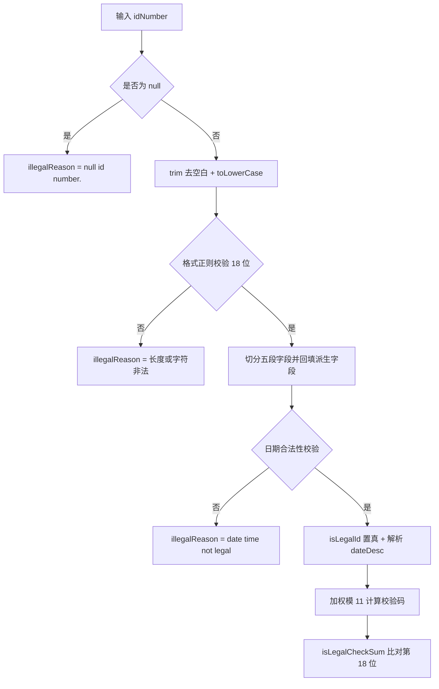

# i2f-number-idcard

> **中国大陆身份证号码解析/校验工具**（3 个 Java 源文件约 164 行 + 1 份 3516 行行政区划字典），以 `IdCardNumberUtil` 静态门面为核心，按 GB 11643-1999 标准实现 18 位公民身份号码的一站式解析与校验：`parse(idNumber)` 一次性切分「行政区划码 / 出生日期 / 顺序码 / 性别位 / 校验位」五段并派生回填 `IdNumberData` 的 16 个字段（区划中文名、性别中文、闰年判定、出生日期对象等），失败时以 `illegalReason` 给出原因而不抛异常；`isLegalIdNumber(idNumber)` 聚合「格式 + 日期 + 校验码」三层判定；校验码以标准「加权因子表 `{7,9,10,5,8,4,2,1,6,3,7,9,10,5,8,4,2}` + 模 11 余数映射表 `{'1','0','X','9','8','7','6','5','4','3','2'}`」加权求和实现（已手工验算与 GB 11643 一致）；`RegionMap` 于类加载时经 `i2f-resources` 加载内置 3516 行行政区划字典，`decode(regionCode)` 提供 6 位区划码 → 中文全称查询。依赖 `i2f-datetime`（闰年/日期合法性判定）、`i2f-resources`（classpath 资源加载）、`lombok`（`@Data` 真实使用），三者均真实使用。**已知瑕疵**：字典 630000-659004 区间（青海 53 行 / 宁夏 31 行 / 新疆 117 行，共 201 行）名称被误加「甘肃省」前缀、字典版本陈旧（含崇文区/宣武区/密云县等已撤销区划且缺港澳台）、`RegionMap` 读字典未指定 UTF-8（GBK 环境乱码）、格式正则 `[0-9|x]` 混入字面量 `|`、`dateFmt` 共享 `SimpleDateFormat` 线程不安全等 9 条（详见文末）。

## 模块路径

- `i2f-jdk/i2f-number-idcard`

## 模块依赖

| 坐标 | scope | optional | 说明 |
|------|-------|----------|------|
| `i2f.turbo:i2f-datetime` | compile | false | 真实使用：`Dates.isLeapYear(int)` 闰年判定、`Dates.isLegalDate(int,int,int)` 日期合法性校验 |
| `i2f.turbo:i2f-resources` | compile | false | 真实使用：`ResourceUtil.getClasspathResourceAsStream` 从 classpath 加载内置区划字典 `assets/regionMap.txt` |
| `org.projectlombok:lombok` | provided | true | 真实使用：`IdNumberData` 上标注 `@Data`/`@NoArgsConstructor`（版本 1.18.44，由根 pom 统一托管） |

## 模块设计

### 架构设计

全模块仅 3 个类、单向依赖链（门面 → 数据载体 → 字典），无接口、无 SPI、无实例状态：

```
i2f.number.idcard
├── IdCardNumberUtil                ← 静态门面：解析 / 校验 / 校验码算法
└── data
    ├── IdNumberData                ← 解析结果载体（16 个 public 字段 + @Data）
    └── RegionMap                   ← 行政区划字典（静态加载 + decode 查询）
```

- `IdCardNumberUtil` 全部为 `public static` 方法，无构造入口、无实例字段，`WEIGHT_TABLE`/`SUM_TABLE` 以 `public static final` 数组暴露。
- `RegionMap` 静态块于类首次加载时一次性把 `assets/regionMap.txt`（3516 行、约 136 KB、UTF-8 无 BOM）读入 `HashMap<String,String>`，之后 `decode` 仅做内存查表。

### 解析流程



### 字段切分规则

18 位号码按固定区间切分为五段（下标为 0 基）：

| 字段 | 子串区间 | 长度 | 含义 |
|------|---------|------|------|
| `region` | `[0, 6)` | 6 | 行政区划码（GB/T 2260） |
| `date` | `[6, 14)` | 8 | 出生日期 `yyyyMMdd` |
| `policy` | `[14, 16)` | 2 | 顺序码前 2 位（第 15-16 位） |
| `sex` | `[16, 17)` | 1 | 性别位（第 17 位，奇男偶女） |
| `checkSum` | `[17, 18)` | 1 | 校验位（第 18 位） |

### 校验码算法（GB 11643-1999）

1. 加权因子：`WEIGHT_TABLE[i] = 2^(18-(i+1)) mod 11`，即 `{7,9,10,5,8,4,2,1,6,3,7,9,10,5,8,4,2}`（i 为 0 基下标，对应第 1-17 位数字）；
2. 加权和：`sum = Σ(WEIGHT_TABLE[i] × digit[i])`，i = 0..16；
3. 余数：`r = sum mod 11`；
4. 校验码查表：`SUM_TABLE[r]`。

| 余数 r | 0 | 1 | 2 | 3 | 4 | 5 | 6 | 7 | 8 | 9 | 10 |
|--------|---|---|---|---|---|---|---|---|---|---|----|
| 校验码 | `1` | `0` | `X` | `9` | `8` | `7` | `6` | `5` | `4` | `3` | `2` |

**手工验算示例**——前 17 位 `11010119900307001`：

| 下标 i | 0 | 1 | 2 | 3 | 4 | 5 | 6 | 7 | 8 | 9 | 10 | 11 | 12 | 13 | 14 | 15 | 16 |
|--------|---|---|---|---|---|---|---|---|---|----|----|----|----|----|----|----|-----|
| 数字 | 1 | 1 | 0 | 1 | 0 | 1 | 1 | 9 | 9 | 0 | 0 | 3 | 0 | 7 | 0 | 0 | 1 |
| 权重 | 7 | 9 | 10 | 5 | 8 | 4 | 2 | 1 | 6 | 3 | 7 | 9 | 10 | 5 | 8 | 4 | 2 |
| 乘积 | 7 | 9 | 0 | 5 | 0 | 4 | 2 | 9 | 54 | 0 | 0 | 27 | 0 | 35 | 0 | 0 | 2 |

加权和 = 154，154 mod 11 = 0，查表得校验码 `1`，故完整合法号码为 `110101199003070011`。

## 模块目的

1. 把身份证号「解析 → 校验」的标准算法（GB 11643-1999）与行政区划数据沉淀为可直接复用的工具，避免各业务模块重复实现。
2. 以「全字段回填 + 原因说明（`illegalReason`）」替代异常流：解析失败不中断调用方，结果对象自带合法性结论与失败原因。
3. 内置行政区划字典随 jar 一并发布，开箱即得区划码 → 中文全称的本地查询能力，无需外部数据源。

## 模块功能

### 1. 身份证号解析（`IdCardNumberUtil.parse`）

- 输入任意字符串（含 null），返回始终非 null 的 `IdNumberData`；
- 成功路径：切分五段字段 → 派生 `sexDesc`（奇男偶女）、`regionDesc`（字典解码）、`isLeap`（`Dates.isLeapYear`）、`dateDesc`（日期对象）→ 计算 `isLegalCheckSum`；
- 失败路径三种 `illegalReason`：`"null id number."`（输入为 null）、`"length not equals 18 or contains other characters."`（正则不匹配）、`"date time not legal"`（日期非法）。

### 2. 合法性判定（`IdCardNumberUtil.isLegalIdNumber`）

- 等价于 `parse(idNumber).isLegalId && parse(idNumber).isLegalCheckSum`（实现上只 parse 一次）；
- 三层判定：格式（18 位正则）→ 日期（`Dates.isLegalDate`）→ 校验码（加权模 11 比对）。

### 3. 校验码计算（`IdCardNumberUtil.getIdNumberCheckSum`）

- 独立公开方法：传入 ≥17 位数字串，返回标准校验位字符（可能为 `X`）；
- `WEIGHT_TABLE` 与 `SUM_TABLE` 以 `public static final` 暴露，可被外部直接复用。

### 4. 行政区划解码（`RegionMap.decode` / `RegionMap.generateMap`）

- `decode(regionCode)`：6 位区划码 → 中文全称（如 `110101` → `北京市市辖区东城区`），未命中返回 `null`；
- `generateMap(InputStream)`：独立公开方法，可将任意「`编码<TAB>名称`」格式输入流解析为 `Map`（支持空白分隔）。

## 模块主要使用方法

```java
// 1. 快速合法性判定（格式 + 日期 + 校验码）
boolean legal = IdCardNumberUtil.isLegalIdNumber("110101199003070011"); // true

// 2. 完整解析：一次拿到全部字段
IdNumberData data = IdCardNumberUtil.parse("110101199003070011");
// data.idNumber        = "110101199003070011"
// data.region          = "110101"
// data.regionDesc      = "北京市市辖区东城区"
// data.date            = "19900307"
// data.dateDesc        = 1990-03-07（java.util.Date）
// data.year/month/day  = "1990" / "03" / "07"
// data.isLeap          = false（1990 非闰年）
// data.policy          = "00"
// data.sex             = "1"
// data.sexDesc         = "男"
// data.checkSum        = "1"
// data.isLegalId       = true
// data.isLegalCheckSum = true
// data.illegalReason   = null

// 3. 解析非法号码：不抛异常，看 illegalReason
IdNumberData bad = IdCardNumberUtil.parse("110101199003070012");
// bad.isLegalId = true；bad.isLegalCheckSum = false
boolean badLegal = IdCardNumberUtil.isLegalIdNumber("110101199003070012"); // false

// 4. 单独计算校验位（补全 17 位残缺号码场景）
char cs = IdCardNumberUtil.getIdNumberCheckSum("11010119900307001"); // '1'

// 5. 单独查询区划中文名
String regionName = RegionMap.decode("110101"); // "北京市市辖区东城区"
```

注意事项：

- `parse` 自身不抛异常（null / 格式 / 日期问题均转为 `illegalReason`）；
- `getIdNumberCheckSum` 直接按位取值，**传入 <17 位会抛 `StringIndexOutOfBoundsException`、含非数字会抛 `NumberFormatException`**，调用前需自行保证入参形态；
- 解析成功路径内部调用共享的 `IdNumberData.dateFmt`（`SimpleDateFormat`），**多线程并发调用 `parse` 存在线程安全隐患**，见文末瑕疵。

## 模块特性总结

- **纯静态门面**：全部 `public static` 方法 + 静态字典，无状态、无生命周期管理；
- **无异常式解析设计**：`parse` 以「结果对象 + `illegalReason`」替代异常流，`isLegalIdNumber` 一行聚合三层判定；
- **标准算法保真**：权重表严格等于 `2^(18-i) mod 11`，余数映射与 GB 11643-1999 一致（手工验算示例通过）；
- **字典内置**：3516 行行政区划字典随 jar 发布，覆盖 31 个省级区划（110000-659004），`decode` 零网络零磁盘查询；
- **超轻量**：3 个类 164 行 Java 源码 + 1 个资源文件，编译产物极小；
- **真实依赖皆轻**：`i2f-datetime`（闰年/日期判定）+ `i2f-resources`（资源加载）+ `lombok`（`@Data`），无任何三方重依赖。

## 模块瑕疵或错误

1. **区划字典数据污染（影响输出正确性）**：`regionMap.txt` 中 630000 起（L3316）至 659004 止（L3516）的 201 行名称全部被误加「甘肃省」前缀——青海 53 行（如 L3316 `630000	甘肃省青海省`）、宁夏 31 行、新疆 117 行（如 L3400 `650000	甘肃省新疆维吾尔自治区`、L3516 `659004	甘肃省省直辖行政单位五家渠市`）。解析青海/宁夏/新疆户籍号码时 `regionDesc` 输出错误前缀。
2. **区划字典版本陈旧**：包含已撤销/变更的历史区划——`110103` 崇文区、`110104` 宣武区（2010 年撤销并入东城/西城）、`110228` 密云县、`110229` 延庆县（2015 年撤县设区）、`500381` 江津市（2006 年撤市设区）等；且缺 71/81/82 开头的港澳台区划条目。
3. **`RegionMap` 读字典未指定字符集**：`new InputStreamReader(is)`（L34）依赖平台默认字符集（中文 Windows + JDK8 默认 GBK），而资源文件为 UTF-8 无 BOM——在非 UTF-8 默认环境启动时 `regionDesc` 全部乱码，应显式传 `StandardCharsets.UTF_8`。
4. **格式正则 `[0-9|x]` 混入字面量 `|`**：L23 `matches("[0-9]{17}[0-9|x]")` 本意是允许末位 `X/x`，但字符类中 `|` 为字面量字符，导致第 18 位为 `|` 的非法串也能通过格式校验（最终虽被校验码比对拦截，语义仍不严谨；正确写法 `[0-9Xx]`，此处依赖前置 `toLowerCase()` 才使 `x` 可匹配）。
5. **`dateFmt` 共享 `SimpleDateFormat` 线程不安全**：`IdNumberData.dateFmt` 为 `public static` 共享实例（L12），`parse` 成功路径直接调用其 `parse` 方法——多线程并发解析存在数据竞争（可能抛出解析异常或得到错乱结果），且该字段 public 可被外部替换。
6. **`getIdNumberCheckSum` 无入参防御**：作为公开方法直接按位取值与 `Integer.parseInt`——传入 <17 位抛 `StringIndexOutOfBoundsException`、含非数字抛 `NumberFormatException`，与 `parse` 的宽容风格不一致，调用方需自行保证入参形态。
7. **`policy` 字段仅截取 2 位**：L31 `substring(14, 16)` 只取第 15-16 位，而 GB 11643 中顺序码为第 15-17 位（3 位）；`sex` 单独取第 17 位逻辑正确，但 `policy` 字段与标准「顺序码」语义不完整（严格实现应为 15-17 共 3 位）。
8. **`dateDesc` 解析空 catch 静默**：L55-59 `dateFmt.parse(ret.date)` 的 catch 块为空——解析失败时 `dateDesc` 保持 `null`，调用方无从感知（虽然格式已校验，属防御性缺失）。
9. **字典加载失败静默降级**：`RegionMap` 静态块捕获 `IOException` 后仅 `printStackTrace` 并保留空 map（L22-24），此时所有 `decode` 返回 `null` 且无显式错误；`decode` 对「未命中」与「加载失败」两种状态均返回 `null`，无法区分。

## 下游与关联

- **全仓暂无源码级消费者**（`import i2f.number.idcard.*` 检索为 0），当前仅处于「库供复用」状态；
- **`i2f-jdk-all`**：聚合 POM 将其纳入批量编译（`i2f-jdk/i2f-jdk-all/pom.xml` L441）；`i2f-jdk/pom.xml` L123 声明 module；根 `pom.xml` L651 做依赖版本托管；
- **`i2f-datetime`**：上游依赖，其文档标注「被 i2f-number-idcard 消费」，消费 `Dates.isLeapYear` 与 `Dates.isLegalDate` 两个静态方法；
- **`i2f-resources`**：上游依赖，消费 `ResourceUtil.getClasspathResourceAsStream` 单一方法；
- 模块内无测试代码（无 `src/test`），无 demo 入口。
