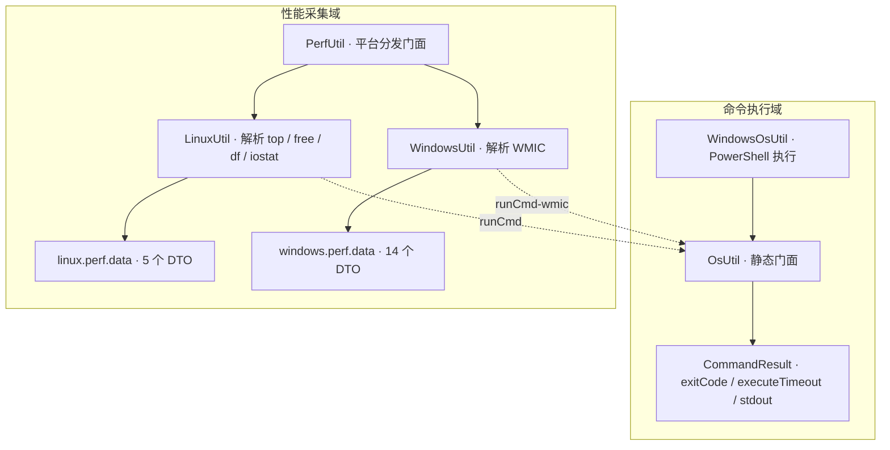
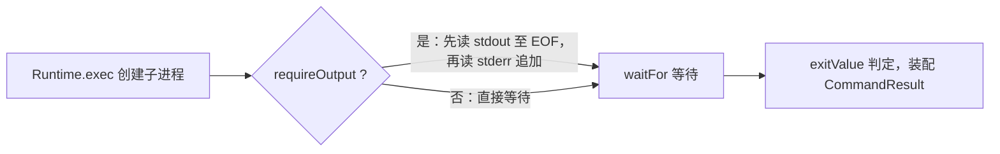

# i2f-os

> **操作系统工具模块**：25 个源文件（1 个命令执行门面 `OsUtil` + 1 个 PowerShell 封装 `WindowsOsUtil` + 1 个结果载体 `CommandResult` + 1 个性能门面 `PerfUtil` + Linux/Windows 两套性能采集器与 19 个 DTO），围绕操作系统提供三类能力——**平台探测**（`isWindows`/`isLinux`/`is64bit`/`getCmdCharset`）、**命令执行**（`Runtime.exec` 多形态封装：`startCmd`/`runCmd`/`execCmd`/`execCmdForResult`，合并 stdout+stderr 并以 `CommandResult` 返回退出码与超时标志；Windows 另提供 PowerShell `-Command` 直执行与 BOM 临时 ps1 脚本执行）、**性能采集**（`PerfUtil` 按平台把 CPU 负载/内存/磁盘使用率分发到 `LinuxUtil`（解析 top/free/df/iostat）或 `WindowsUtil`（解析 WMIC 并映射 14 类设备/系统 DTO））。被 `i2f-mixins`（os_* 混入）、`i2f-ai-std`（技能脚本执行/RAG 命令读取）、`i2f-jdbc-procedure`（LangShell 节点）、模板渲染系、`i2f-springboot-ops-starter`（主机管理与 AI 命令工具）等广泛消费；仅依赖 `i2f-convert`，运行期零三方。

## 模块路径

- `i2f-jdk/i2f-os`

## 模块依赖

| GroupId | ArtifactId | Scope | Optional | 来源 | 用途 |
| --- | --- | --- | --- | --- | --- |
| i2f.turbo | i2f-convert | compile | 否 | 内部 | `WindowsUtil` 用 `Converters.parseInt/parseLong/parseBoolean` 把 WMIC 的字符串值解析为数值/布尔字段（**真实使用**，并传递引入 `i2f-typeof`） |
| org.projectlombok | lombok | provided | 是（根 POM `dependencyManagement` 统一托管） | 三方 | `CommandResult` 使用 `@Data`/`@NoArgsConstructor`（**真实使用**） |

- 父 POM 为 `i2f.turbo:i2f-jdk:1.0-jdk8`。
- **运行期依赖**：仅 `i2f-convert`（及其传递的 `i2f-typeof`）；`lombok` 仅编译期。
- `build` 声明 `maven-assembly-plugin`（继承根 POM `pluginManagement` 中 `jar-with-dependencies` 配置）——属项目打包惯例。
- 无测试目录（`src/test` 不存在），全模块 25 个文件均在 `src/main/java` 下。

## 模块设计

模块按「命令执行」与「性能采集」两个能力域组织，性能采集域自身构建在命令执行域之上（通过 `runCmd` 执行系统命令再解析文本输出）：



### 1. `OsUtil`：命令执行与平台探测静态门面

全静态方法，分四组：

**（1）平台/环境探测**

- `isWindows()`/`isLinux()`：按 `os.name` 是否包含 `window`/`linux`（不区分大小写）判定；macOS 等其余系统两者均 `false`。
- `is64bit()`：按 `os.arch`（`amd64`/`x86_64`/`arm64`/`ppc64`）→ `java.vm.name` 包含 `64-bit` → `sun.arch.data.model == 64` 三级判定。
- `getCmdCharset()`：按 `sun.jnu.encoding` → `file.encoding` → `Charset.defaultCharset()` 三级回退拿到「命令行输出字符集」（中文 Windows 下通常为 GBK），全模块所有命令执行与文本解析的默认字符集均来自它。
- `subline(str, lineIndex, lineCount)`：从 `\n` 切分的文本中截取指定行窗口（`getLinuxTop5` 用它只取 top 输出前 5 行）。

**（2）命令执行四形态**

| 方法族 | 采集输出 | 超时 | 说明 |
| --- | --- | --- | --- |
| `startCmd(...)` | 单参重载走「采集」、其余重载走「不采集」 | 同上不一致 | 命名意为「启动」，但**全部为同步等待**，见「模块瑕疵」第 1 条 |
| `runCmd(...)` | 是 | 默认 3 分钟 | 同步执行并返回 stdout 字符串（高频入口） |
| `execCmd(requireOutput, waitForMillsSeconds, ...)` | 按 `requireOutput` | 按参数（`<0` 无限等待） | 返回 stdout 字符串 |
| `execCmdForResult(...)` | 同上 | 同上 | 返回 `CommandResult`（含退出码/超时标志） |

每个形态均提供「单个命令字符串」（`Runtime.exec(String)`）与「命令数组」（`Runtime.exec(String[])`）两套重载，另支持 `envp`（环境变量）与 `dir`（工作目录）。

**（3）进程输出读取（`getProcessStdout`）**



- `requireOutput=true`：先阻塞读完 stdout 全部内容，再读 stderr 追加到同一缓冲区（**stdout 与 stderr 合并输出**），最后按参数等待进程结束；输出按 `charset`（默认 `getCmdCharset()`）解码。
- `requireOutput=false`：不读流，直接 `waitFor()`/`waitFor(timeout)`。

**（4）结果装配**：交给 `CommandResult.of(process, stdout)`（见下）。

### 2. `WindowsOsUtil`：PowerShell 双执行模式

仅在 Windows 可用（非 Windows 抛 `IllegalStateException("current os is not windows, not support powershell")`），两种执行方式：

| 方法 | 机制 | 适用场景 |
| --- | --- | --- |
| `execPowershell(...)` | `powershell.exe -NoProfile -ExecutionPolicy Bypass -Command {command}`（命令直接作为 `-Command` 参数） | 单行命令、管道表达式（如 `Get-Process \| Select-Object -First 5`） |
| `execPowershellScript(...)` | 把脚本内容写入临时文件 `ps-{uuid}.ps1`（**UTF-8 BOM 头 `EF BB BF`**，规避 PowerShell 默认按系统字符集解析中文的问题），再以 `-File` 执行，`finally` 中删除脚本文件 | 多行完整脚本 |

- 两者最终都委托 `OsUtil.execCmdForResult`，同样支持 `requireOutput`/`waitForMillsSeconds`/`envp`/`dir`/`charset`，返回 `CommandResult`。
- `-NoProfile` 加速启动、`-ExecutionPolicy Bypass` 绕过执行策略限制（属 ops/自动化场景的设计预期，调用方需自行承担命令白名单等安全控制）。

### 3. `CommandResult`：命令执行结果载体

```java
@Data
@NoArgsConstructor
public class CommandResult {
    protected int exitCode;          // 进程退出码；超时时为 Integer.MIN_VALUE
    protected boolean executeTimeout;// 是否未能在等待窗口内结束
    protected String stdout;         // 合并后的 stdout+stderr（requireOutput=false 时为 null）
    public static CommandResult of(Process process, String stdout) { ... }
}
```

`of()` 以 `process.exitValue()` 是否抛异常反推「是否超时」：正常取到退出码则 `executeTimeout=false`；抛 `IllegalThreadStateException`（进程仍在运行）则置 `executeTimeout=true`、`exitCode=Integer.MIN_VALUE`。

### 4. `PerfUtil`：性能采集平台分发门面

3 个方法（`getCpuLoadPercent`/`getMemoryUsedPercent`/`getDiskUsedPercent`）均为「Windows → `WindowsUtil` / Linux → `LinuxUtil` / 其余平台 → `-1`」的直通分发，无缓存（每次调用都会真实执行一次系统命令）。

### 5. 性能采集实现：Linux 命令解析 vs Windows WMIC 解析

| 维度 | `LinuxUtil`（532 行） | `WindowsUtil`（813 行） |
| --- | --- | --- |
| 数据源 | 系统命令文本：`top -c -b -n 1`、`free`、`df`、`iostat -x -k` | `wmic {TYPE} get *`（经 `getWmicList` 按列二次查询） |
| 聚合指标 | CPU=load average1×100；内存=基于 `free`；磁盘=`df` 各挂载点平均 | CPU=各 CPU `LoadPercentage` 平均；内存=基于 `Win32_OperatingSystem`；磁盘=各逻辑盘平均 |
| 明细能力 | `getLinuxTop5`（负载/tasks/`%Cpu`/Mem/Swap 全解析）、`getLinuxFree`、`getLinuxDf`、`getLinuxIostatXk`（avg-cpu + 各设备 13 项 IO 指标） | 14 个 `get*Info`：CPU/OS/进程/内存条/内存缓存/逻辑盘/物理盘/网卡/网卡配置/打印机/打印配置/桌面显示器/启动项/声卡设备 |
| 解析风格 | 手写 `split` + 逐字段 `try/parse`（失败静默忽略） | WMIC 输出按表头列名映射 + `Converters` 解析（失败回退默认值 `-1`/`false`） |
| 平台守卫 | 非 Linux 返回 `null`/空列表 | 非 Windows 返回 `null`/空列表 |

### 6. 包结构

| 包 | 类型 | 职责 |
| --- | --- | --- |
| `i2f.os` | `OsUtil` / `PerfUtil` / `WindowsOsUtil` | 命令执行门面、性能门面、PowerShell 执行 |
| `i2f.os.data` | `CommandResult` | 命令执行结果（退出码/超时/输出） |
| `i2f.os.linux.perf` | `LinuxUtil` | Linux 性能采集（top/free/df/iostat 解析） |
| `i2f.os.linux.perf.data` | 5 个 DTO：`LinuxTop5Dto`（负载/tasks/%Cpu/Mem/Swap）/`LinuxFreeDto`/`LinuxDfDto`/`LinuxIostatDto`/`LinuxIostatItemDto` | Linux 采集数据模型（公共字段风格、零注解） |
| `i2f.os.windows.perf` | `WindowsUtil` | Windows 性能/设备信息采集（WMIC 解析） |
| `i2f.os.windows.perf.data` | 14 个 DTO：`WindowsCpuDto`/`WindowsOsDto`/`WindowsProcessDto`/`WindowsMemoryChipDto`/`WindowsMemCacheDto`/`WindowsLogicalDiskDto`/`WindowsDiskDriveDto`/`WindowsNicDto`/`WindowsNicConfigDto`/`WindowsPrinterDto`/`WindowsPrinterConfigDto`/`WindowsDesktopMonitorDto`/`WindowsStartupDto`/`WindowsSoundDeviceDto` | Windows 采集数据模型（字段与 WMIC 属性一一对应） |

## 模块目的

- 为上层（AI 工具链、存储过程脚本节点、模板渲染、运维控制台、脚本引擎混入）提供**统一的操作系统命令执行入口**：屏蔽 `Runtime.exec` 的流读取、字符集解码、超时等待、退出码收集等重复样板，并统一输出 `CommandResult`。
- 提供**零依赖的平台判定底座**（`isWindows`/`isLinux`/`is64bit`/`getCmdCharset`），让跨平台代码（native 库选择、shell 前缀选择、脚本编码）有统一判据。
- 在 Windows 上补齐**PowerShell 能力**（相对 cmd 更强的表达能力），并用「BOM 临时脚本文件」方案解决中文脚本执行乱码。
- 提供**开箱即用的系统性能采集**：CPU/内存/磁盘使用率三个聚合指标 + Linux/Windows 两套明细解析（top/free/df/iostat、WMIC 全设备信息），供监控/巡检类场景使用。

## 模块功能

| 类型 | 成员 | 说明 |
| --- | --- | --- |
| `OsUtil` | `isWindows()`/`isLinux()` | 平台判定（`os.name` 包含匹配） |
| | `is64bit()` | 64 位判定（`os.arch`→`java.vm.name`→`sun.arch.data.model` 三级） |
| | `getCmdCharset()` | 命令字符集（`sun.jnu.encoding`→`file.encoding`→默认） |
| | `subline(str, lineIndex, lineCount)` | 文本行窗口截取 |
| | `startCmd(...)` 4 重载 | 启动命令（同步等待，输出采集行为因重载而异，见瑕疵第 1 条） |
| | `runCmd(...)` 4 重载 | 同步执行 + 采集输出，默认 3 分钟超时 |
| | `execCmd(...)` 3 重载 | 可控 `requireOutput`/`waitForMillsSeconds`，返回 stdout |
| | `execCmdForResult(...)` 2 重载 | 同上，返回 `CommandResult` |
| | `getProcessStdout(...)` | 公开的流读取工具（stdout+stderr 合并、按字符集解码） |
| `WindowsOsUtil` | `execPowershell(...)` | PowerShell `-Command` 直接执行（非 Windows 抛异常） |
| | `execPowershellScript(...)` | 写 UTF-8 BOM 临时 ps1 → `-File` 执行 → 删除 |
| `CommandResult` | `exitCode`/`executeTimeout`/`stdout` + `of()` | 命令执行结果载体 |
| `PerfUtil` | `getCpuLoadPercent()`/`getMemoryUsedPercent()`/`getDiskUsedPercent()` | 按平台分发的三项聚合指标（不支持平台返回 `-1`） |
| `LinuxUtil` | `getCpuLoadPercent()`/`getMemoryUsedPercent()`/`getDiskUsedPercent()` | 三项聚合指标 |
| | `getLinuxTop5()`（2 重载） | 解析 `top` 输出：负载均值、任务数、`%Cpu` 八项、Mem/Swap |
| | `getLinuxFree()`（2 重载） | 解析 `free` 输出：Mem（6 项）/Swap（3 项） |
| | `getLinuxDf()` | 解析 `df` 输出：文件系统/1K 块/用量/可用/使用率/挂载点 |
| | `getLinuxIostatXk()` | 解析 `iostat -x -k`：avg-cpu 六项 + 每设备 13 项 IO 指标 |
| `WindowsUtil` | `getCpuLoadPercent()`/`getMemoryUsedPercent()`/`getDiskUsedPercent()`（+`char` 盘符重载） | 三项聚合指标（磁盘可按盘符查） |
| | `getCpuInfo()`/`getOsInfo()`/`getProcessInfo()`/`getMemoryChipInfo()`/`getMemCacheInfo()`/`getLogicalDiskInfo()`/`getDiskDriveInfo()`/`getNicInfo()`/`getNicConfigInfo()`/`getPrinterInfo()`/`getPrinterConfigInfo()`/`getDesktopMonitorInfo()`/`getStartupInfo()`/`getSoundDeviceInfo()` | 14 个 WMIC 明细采集，各返回对应 DTO 列表（`getOsInfo` 返回单对象） |
| | `getWmicList(type)` | WMIC 通用解析入口（表头取列 + 逐列二次查询） |
| 19 个 DTO | Linux 5 个 + Windows 14 个 | 均为公共字段 POJO（两侧均零注解；Windows 侧字段与 WMIC 属性对应，Linux 侧字段与命令输出列对应） |

## 模块主要使用方法

**1）平台探测与字符集**

```java
if (OsUtil.isWindows()) {
    // Windows 分支
} else if (OsUtil.isLinux()) {
    // Linux 分支
}
boolean x64 = OsUtil.is64bit();            // 如选择 64 位 native 库
String charset = OsUtil.getCmdCharset();   // 如写入待执行脚本文件的编码
```

**2）执行命令并获取输出**

```java
// 高频入口：同步执行 + 3 分钟默认超时，返回 stdout 字符串（中文 Windows 默认 GBK 解码）
String output = OsUtil.runCmd("ipconfig /all");

// 需要命令数组（避免 Runtime.exec(String) 的空格切分）与全部执行信息时：
CommandResult ret = OsUtil.execCmdForResult(true, TimeUnit.MINUTES.toMillis(3),
        new String[]{"cmd", "/c", "dir"}, null, new File("D:/work"), null);
ret.getExitCode();        // 退出码；超时为 Integer.MIN_VALUE
ret.isExecuteTimeout();   // 是否未在等待窗口内结束
ret.getStdout();          // stdout + stderr 合并文本
```

**3）多平台命令（消费方 `LangShellNode` 的典型模式）**

```java
List<String> cmdArr = new ArrayList<>();
if (OsUtil.isWindows()) {
    cmdArr.addAll(Arrays.asList("cmd", "/c"));
} else if (OsUtil.isLinux()) {
    cmdArr.addAll(Arrays.asList("sh"));   // 先 chmod +x 脚本
}
cmdArr.add(scriptFile.getName());
String out = OsUtil.execCmd(true, timeoutMillis, cmdArr.toArray(new String[0]),
        envp, dir, OsUtil.getCmdCharset());
```

**4）PowerShell（仅 Windows）**

```java
// 单行命令
CommandResult r1 = WindowsOsUtil.execPowershell(true, TimeUnit.MINUTES.toMillis(3),
        "Get-Process | Select-Object -First 5", null, dir, null);

// 多行脚本（内部写 ps-{uuid}.ps1 带 UTF-8 BOM 后 -File 执行，finally 删除）
CommandResult r2 = WindowsOsUtil.execPowershellScript(true, TimeUnit.MINUTES.toMillis(3),
        "$d = Get-Date\nWrite-Output $d", null, dir, null);
```

**5）性能采集**

```java
double cpu = PerfUtil.getCpuLoadPercent();       // 不支持平台返回 -1
double mem = PerfUtil.getMemoryUsedPercent();
double disk = PerfUtil.getDiskUsedPercent();

// 平台明细（仅对应平台可用；非目标平台返回 null/空列表）
LinuxTop5Dto top = LinuxUtil.getLinuxTop5();               // 负载/tasks/%Cpu/Mem/Swap
LinuxFreeDto free = LinuxUtil.getLinuxFree();               // Mem/Swap 数值
LinuxIostatDto io = LinuxUtil.getLinuxIostatXk();           // IO 明细
WindowsOsDto os = WindowsUtil.getOsInfo();                  // 系统信息
List<WindowsProcessDto> procs = WindowsUtil.getProcessInfo();// 进程列表
double dRate = WindowsUtil.getDiskUsedPercent('D');         // 指定盘符使用率
```

**注意事项：**

- `startCmd` 并非异步启动：所有重载内部仍会 `waitFor` 同步等待进程结束（详见「模块瑕疵」第 1 条），且单参重载与多参重载的「输出采集/超时」行为不一致。
- `waitForMillsSeconds` 超时只在 `requireOutput=false`（不读流）时真正可用；`requireOutput=true` 时读流阶段先阻塞到流关闭，超时窗口几乎不起作用（详见瑕疵第 2 条）。
- 命令执行默认字符集为 `getCmdCharset()`（中文 Windows 通常 GBK）；需要 UTF-8 输出时应显式传 `charset`。
- `execCmd` 族将执行失败统一包装为 `IllegalStateException`（不吞异常），但消息中不含命令内容。
- 本模块可执行任意系统命令（含 PowerShell `-ExecutionPolicy Bypass`），属设计预期；调用方（如 ops 的 AI 工具）须自行做工作目录限制、权限与命令白名单等安全控制。
- `PerfUtil`/`LinuxUtil`/`WindowsUtil` 依赖外部命令（top/free/df/iostat/wmic）存在与其输出格式；这些命令缺失或输出格式变化会导致采集结果为空或 `-1`（Windows 侧 WMIC 已被微软弃用，详见瑕疵第 11 条）。

## 下游消费方一览

| 消费方 | 依赖关系 | 使用方式 |
| --- | --- | --- |
| `i2f-mixins` | 直接（POM 声明） | `OsMixins` 以三个 default 方法 `os_windows()`/`os_linux()`/`os_64bit()` 代理 `OsUtil`，作为 Funic/TinyScript/XProc4J 脚本引擎内建函数 |
| `i2f-ai-std` | 直接（POM 声明） | `SkillsTools.run_skill_script` 按脚本后缀选择解释器（`.py`→python、`.pl`→perl、`.js`→node），其余在 Windows 加 `cmd /c`、Linux 用 `sh`，`execCmdForResult` 返回 `CommandResult` 供 AI 工具消费；4 个命令型 RAG 读取器（Pandoc/Markitdown/EasyOcr/PdfEasyOcr）按 `isWindows` 分支执行外部命令 |
| `i2f-template-render` | 直接（POM 声明） | `CmdGenerate` 以 `OsUtil.runCmd(cmdLine, charset)` 执行命令并采集生成内容 |
| `i2f-extension-freemarker` | 直接（POM 声明） | `GeneratorTool` 模板工具函数 `OsUtil.runCmd(cmdLine, charset)` |
| `i2f-extension-velocity` | 直接（POM 声明） | 同上（`GeneratorTool`） |
| `i2f-extension-opencv` | 直接（POM 声明） | `OpenCvProvider` 以 `OsUtil.is64bit()` 选择 64/32 位原生库 |
| `i2f-springboot-ops-starter` | 直接（POM 声明） | `HostOpsController` 主机命令执行（Windows/Linux 分支、`getCmdCharset` 编码、`execCmd` 带超时）；`CommandTools` AI 工具（`get_os_type`/`run_command_line`，`execCmdForResult`）；`PowershellTools` 以 `WindowsOsUtil.execPowershell/execPowershellScript` 暴露 AI 工具（`@Conditional` 限定 Windows）；`PythonTools` 同模式封装 `execCmdForResult`；`SshOpsController`/`OfficeFormatUtil`/`DashScopeOpsController` 平台判定 |
| `i2f-jdbc-procedure` | 传递（经 `i2f-mixins` / `i2f-ai-std`） | `LangShellNode` 最完整的多平台用法：`isWindows/isLinux` 选择 shell 前缀、`getCmdCharset` 写脚本、Linux `chmod +x`、`execCmd(await, timeout, ...)` 执行 |
| `i2f-extension-jdbc-procedure-datax` | 传递（经 `i2f-jdbc-procedure`） | `DataxExecNode` 以 `execCmd(...)` 执行 datax 作业脚本并取回输出 |
| `i2f-tools-ops` | 传递（经 `i2f-springboot-ops-starter`） | `AppStartCommandLineRunner` 启动后在 Windows 用 `runCmd` 打开浏览器；`RobotTools`/`FormTools`/`PandocTools`/`PlaywrightWebSearchTools`/`SeleniumWebSearchTools` 平台判定与命令执行 |
| `i2f-jdk-all` | 聚合打包 | 纳入全仓 fat-jar；另注册于根 POM `dependencyManagement`、`i2f-jdk` 聚合模块（`<module>i2f-os</module>`） |

> 说明：`PerfUtil`/`LinuxUtil`/`WindowsUtil` 性能采集族**当前全仓暂无源码级消费方**（仅 `PerfUtil` 内部引用两个平台实现），属「能力已备、暂无使用」状态。

## 模块特性总结

- **命令执行四形态**：`startCmd`/`runCmd`/`execCmd`/`execCmdForResult`，覆盖「启动/采集输出/自定义超时/完整结果」四档需求，String 与 String[] 双版本重载齐全。
- **stdout+stderr 合并**：单次调用即可拿到两路输出文本，避免调用方分别读取。
- **统一字符集策略**：`getCmdCharset()` 三级回退拿到命令行编码，全模块默认复用，中文 Windows 下不乱码。
- **PowerShell 双模式**：`-Command` 直执行 + UTF-8 BOM 临时脚本（解决中文脚本按系统字符集解析的乱码问题，执行后自动清理）。
- **零三方运行期依赖**：仅内部依赖 `i2f-convert`（WMIC 值解析）；`lombok` 仅编译期。
- **跨平台性能采集**：`PerfUtil` 三项聚合指标 + `LinuxUtil`（top/free/df/iostat 四类解析）+ `WindowsUtil`（14 类 WMIC 明细，字段级对应 14 个 DTO）。
- **平台守卫内建**：性能采集与 WMIC 方法在非目标平台统一返回 `null`/空列表/`-1`，不会在错误平台抛出意外异常。
- **静默容错解析**：Linux 侧逐字段 `try/parse` 失败忽略、Windows 侧 `Converters` 回退默认值——尽量不因单字段异常中断整体采集。

## 可拓展方向

- 用 `ProcessBuilder` 重构命令执行（支持命令行参数列表、`redirectErrorStream(true)` 合并流、异步读流线程），一并修复超时/死锁/子进程回收问题。
- 为「超时判定」引入显式状态（如 `ProcessHandle`/`destroyForcibly`），并区分「超时未结束」与「正常退出但仍存活」。
- 补充 macOS 平台采集（`sysctl`/`vm_stat`/`df`），补齐 `PerfUtil` 的平台矩阵。
- WMIC 弃用迁移：改用 PowerShell CIM（`Get-CimInstance`）或 WMI COM 适配（`com.sun.jna`/`Runtime.exec powershell Get-CimInstance`）。
- 为命令执行增加「输出行回调/流式消费」与「实时日志转发」能力，替代一次性全量缓冲。

## 模块瑕疵或错误

以下为通读本模块 25 个源文件（约 2350 行）并核对全部消费方后如实记录的内容：

1. **`startCmd` 重载行为分叉且均非真正异步**：单参/变参重载 `startCmd(String cmd)`/`startCmd(String... cmdArr)` 实际调用 `runCmd(...)`——即**采集输出并带 3 分钟超时**；而 `startCmd(cmd, charset)`/`startCmd(cmdArr, envp, dir, charset)` 走 `execCmd(false, -1, ...)`——**不采集输出且无限等待**。同名前缀的重载行为、超时策略、输出采集完全不同，且所有重载内部都 `waitFor` 同步阻塞（`explorer` 等 fork 即退的程序表现正常，长命令会一直卡住调用线程）。
2. **`requireOutput=true` 时超时参数形同虚设**：`getProcessStdout` 在读流阶段先阻塞读完 stdout 至 EOF、再读 stderr，**读流不受 `waitForMillsSeconds` 约束**；EOF 需等子进程退出（或关闭流）才出现，之后才执行 `waitFor`，超时窗口几乎不生效。若子进程保持流开启且挂起，读取将无限阻塞。
3. **stdout/stderr 串行读取存在死锁风险**：先读完 stdout 再读 stderr，若子进程 stderr 输出量超过管道缓冲区（Windows 约 4–64KB）而 stdout 尚未关闭，子进程阻塞在写 stderr、父进程阻塞在读 stdout，双方互等——对错误输出量大的命令（编译、下载失败等）是真实风险；`redirectErrorStream(true)` 可规避。
4. **超时后不回收子进程**：`CommandResult.of` 判定超时时只把 `exitCode` 置为 `Integer.MIN_VALUE`，**既不 `destroy()` 也不 `destroyForcibly()`**，超时进程继续存活直至自行结束——`requireOutput=false` 且超时（如 `startCmd` 的无限等待被进程写满缓冲区死锁）会造成进程与调用线程双泄漏；且 `Integer.MIN_VALUE` 作为超时哨兵未与真实退出码的语义在文档/注释中说明。
5. **`IllegalStateException` 包装丢失上下文**：`execCmdForResult` 的 `catch` 中仅 `e.getMessage()`，不含所执行的命令与工作目录，排障时无法定位是哪条命令失败（依赖调用方自行补充日志）。
6. **`runCmd(String)` 单串形态依赖空格切分**：`Runtime.exec(String)` 按空格拆分命令行（不做 shell 解析），路径带空格、引号、重定向、管道等场景行为与用户预期的 shell 语义不符；应优先用命令数组重载（`SkillsTools`/`HostOpsController` 等已按此实践）。
7. **`LinuxUtil.getMemoryUsedPercent` 语义反转**：公式为 `(memTotal - memUsed) / memTotal * 100`，返回的其实是**空闲百分比**（且 `free` 的 `used` 未含 buff/cache），与 `WindowsUtil.getMemoryUsedPercent` 的 `(total - free) / total`（**已用**语义）相反——同一 `PerfUtil` 门面下两平台结果语义互斥，调用方按名称消费必然出错。
8. **`LinuxUtil.getCpuLoadPercent` 语义错误**：返回 `load average1 × 100`——load average 是「运行队列长度均值」而非 CPU 利用率百分比，且未除以 CPU 核数（8 核机器满载时返回约 800），与 Windows 侧「平均 `LoadPercentage`（0–100）」不可比。
9. **`LinuxUtil.getDiskUsedPercent` 等权平均失真**：对 `df` 输出的所有行（含 devtmpfs/tmpfs 等内存文件系统、/boot 等小分区）算术平均，未按容量加权也未过滤虚拟文件系统；另 `df` 未加 `-P` 参数，长设备名下输出折行时该行因 `arr.length != 6` 被静默跳过。
10. **`LinuxUtil` 返回约定不一致 + 静默失败**：非 Linux 平台 `getLinuxDf` 返回空 List，而 `getLinuxTop5`/`getLinuxFree`/`getLinuxIostatXk` 返回 `null`；所有字段解析异常被静默吞掉（仅保留默认值 0/null），调用方无法区分「值为 0」与「解析失败」。`getLinuxIostatXk` 还强依赖固定行号（`i==3` 取 avg-cpu 数值行、`i<6` 作为设备行起点），iostat 版本/输出差异会整体错位。
11. **`WindowsUtil.getWmicList` 的 N+1 进程调用与列交错**：先执行 `wmic {TYPE} get *` 取表头，再**对每一列单独执行一次 `wmic {TYPE} get {column}`**——20~60 列的 DTO 意味着数十次子进程启动，性能差；各列独立执行之间系统状态可能变化（如进程列表），却按「行号」把不同时刻的列值拼进同一对象，可能产生「张冠李戴」的记录；多值字段（如 NIC 的 `IPAddress`）多行输出还会造成整列错位。
12. **WMIC 弃用风险**：WMIC 自 Windows 10 21H1 起被弃用、Windows 11 24H2 起移除；`wmic` 不存在时 `runCmd` 返回的是「命令不存在」的错误输出文本，会被当作正常数据继续解析——Windows 侧全部 `get*Info` 及三个聚合指标将静默产出空/错误数据。
13. **Windows 聚合指标的边界除零**：`getDiskUsedPercent` 对逻辑盘等权平均且未过滤设备类型（光驱/未就绪可移动盘），当 `size` 为 0 时 `(size - freeSpace) / size` 产生 `NaN`/`Infinity` 污染平均值；`getMemoryUsedPercent` 在 `totalVisibleMemorySize` 解析失败（默认 -1）时结果不可预期。
14. **`WindowsOsUtil.execPowershellScript` 传参依赖工作目录 + 临时文件残留**：`-File` 参数传的是**相对文件名** `ps-{uuid}.ps1`（而非绝对路径），依赖 `Runtime.exec` 恰好把子进程工作目录设为 `dir` 才能找到脚本；若 JVM 在执行期间被强杀，`finally` 的删除不会执行，临时 ps1 脚本残留于工作目录。
