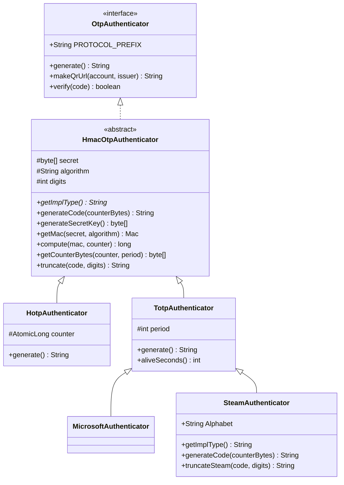
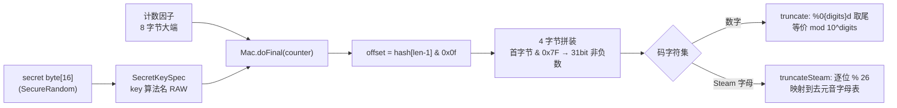

# i2f-otpauth

> 一次性口令（OTP）认证模块，纯 JDK 实现 **RFC 4226/6238 的动态截断内核**与 **`otpauth://` 密钥 URI 装配**：以 `OtpAuthenticator`（`generate`/`verify`/`makeQrUrl`）为契约、抽象基类 `HmacOtpAuthenticator` 承载「共享密钥 + HMAC 算法 + 码长」与全部静态密码学原语，再由 `HotpAuthenticator`（计数器自增）/`TotpAuthenticator`（时间窗口整除）两条实现分头提供「计数因子」，另附 `MicrosoftAuthenticator`（TOTP 语义别名）与 `SteamAuthenticator`（5 位去元音字母表）两个厂商兼容变体。它让「扫码绑定 → 出码 → 校验」三步只需 `new TotpAuthenticator(secret).makeQrUrl(account, issuer)` + `verify(code)` 两行调用，不引入 Google Authenticator/getclabs 等三方库；账号密钥的存取与 Bean 装配刻意留给 `i2f-springboot-totp-starter`，本模块零状态语义、零三方运行期依赖。

## 模块路径

- `i2f-jdk/i2f-otpauth`

## 模块依赖

| GroupId | ArtifactId | Scope | Optional | 来源 | 用途 |
| --- | --- | --- | --- | --- | --- |
| `i2f.turbo` | `i2f-codec-impl` | compile | 否 | 内部 | `i2f.codec.bytes.basex.Base32.encode/decode`——`otpauth://` 里 `secret` 参数的标准编码，以及外部密钥字符串解码为 `byte[]` |
| `i2f.turbo` | `i2f-bytes` | compile | 否 | 内部 | `ByteUtil.toBigEndian(long)` / `toBigEndian(long,int)`——把计数器或时间窗口转成 RFC 4226 规定的 **8 字节大端**输入 |
| `i2f.turbo` | `i2f-crypto-impl` | compile | 否 | 内部 | 提供 `HmacMessageDigester`/`MacAlgorithm` 等 JCE 封装；**本模块源码未直接 `import`**（自行 `"Hmac" + algorithm` 拼名并直用 `javax.crypto.Mac`），属冗余声明，实际只带入传递依赖 |
| `org.projectlombok` | `lombok` | provided | 是 | 三方 | `@Data` 生成 `HmacOtpAuthenticator` 的 `getSecret/getAlgorithm/getDigits/setAlgorithm/setDigits`（下游 `DefaultTotpAuthenticatorFactory` 正靠后两者配置） |

- 所有坐标均无 `<version>`，由根 POM `dependencyManagement` 统一托管；`lombok` 在根 POM 中已声明为 `provided` + `optional`。
- 运行期三方依赖为 **0**：仅使用 JDK 的 `javax.crypto.Mac`、`javax.crypto.spec.SecretKeySpec`、`java.security.SecureRandom`、`java.net.URLEncoder`。
- 被 `i2f-jdk-all` 聚合 POM 汇总引入。

## 模块设计

### 1. 四层继承：契约 → 算法骨架 → 计数因子 → 厂商兼容



- **契约层** `OtpAuthenticator`：仅三个动词——`generate()` 出码、`verify(code)` 校验、`makeQrUrl(account, issuer)` 出绑定 URL；`verify` 提供 `default` 实现「重新生码 + 忽略大小写比较」，所以**任何子类天然可校验**，无需各自再写。
- **算法骨架层** `HmacOtpAuthenticator`：把与「计数因子无关」的部分全部沉淀——密钥/算法/码长三字段、HMAC 计算、动态截断、Base32+URL 编码的 URI 模板；密码学步骤一律为 `public static`，可脱离实例单独调用与测试。
- **计数因子层**：HOTP 与 TOTP 的**唯一实质差别**就是「那 8 字节喂给 HMAC 的东西从哪来」，因此两个子类各自只覆写 `generate()`。
- **厂商兼容层**：`MicrosoftAuthenticator` 是**零覆写的纯语义别名**（沿用 TOTP 全部行为，scheme 仍是 `totp`，因 Microsoft Authenticator 读标准 totp URL）；`SteamAuthenticator` 只替换「数字→字符串」这一步。

### 2. 模板方法 + 策略钩子

抽象基类留了两个可覆写钩子，各自的扩展点正交：

| 钩子 | 作用 | 谁在用 |
| --- | --- | --- |
| `getImplType()`（abstract） | 决定 `otpauth://{type}/` 的 scheme 段 | `hotp`/`totp`/`steam`；Microsoft 继承父类 `totp` |
| `generateCode(byte[] counterBytes)` | 「HMAC → 截断 → 字符化」的编排点 | `SteamAuthenticator` 换成 `truncateSteam` 进制转换 |
| `makeQrUrl(account, issuer)` | URI 参数集随类型变化 | `HotpAuthenticator` 追加 `&counter=`、`TotpAuthenticator` 追加 `&period=` |

### 3. RFC 4226 动态截断内核



- `getCounterBytes(counter, period)` 用 `counter / period` 做**整除取窗口**，故同一 `period` 秒内码值恒定（可重复使用），这也是 TOTP 的本质。
- `HotpAuthenticator` 走 `ByteUtil.toBigEndian(count)`（long 重载即 8 字节），`TotpAuthenticator` 走 `toBigEndian(window, 8)`，二者对 RFC 的 8 字节约定一致。
- `compute` 首字节掩码为 `0x07F`，结果必为非负 31 位整数，因此 `truncate` 的「格式化后取尾」严格等价于 RFC 的 `mod 10^digits`。

### 4. 计数因子：有状态 vs 无状态

| 实现 | 计数因子来源 | 状态 | 同窗口内重复调用 |
| --- | --- | --- | --- |
| `HotpAuthenticator` | `counter.incrementAndGet()`（`AtomicLong`，初值由构造器给） | **实例内有状态** | 每次必然不同 |
| `TotpAuthenticator` | `System.currentTimeMillis() / 1000 / period` | **完全无状态** | 30 秒内返回同一码 |

`TotpAuthenticator.aliveSeconds()` 以「逐秒前推直到码值变化」的方式探测当前码剩余有效秒数（上界 `period-1`），便于前端画倒计时。

### 5. `otpauth://` URI 装配

```
otpauth://totp/{label}?secret={base32}&issuer={issuer}&algorithm={alg}&digits={n}&period={p}
```

- 有 `issuer` 时 label 为 `{issuer}:{account}` 并额外输出 `issuer=` 参数；无 `issuer` 时 label 仅 `account`，且不输出 `issuer=`。
- `urlEncode` 为 `URLEncoder.encode(s,"UTF-8")` 后把 `+` 修正为 `%20`（表单编码的空格规则不适用于 URI query）。

### 6. 包结构

```
i2f.otpauth
├── OtpAuthenticator              契约（generate / verify / makeQrUrl + PROTOCOL_PREFIX）
└── impl
    ├── HmacOtpAuthenticator      抽象骨架：secret/algorithm/digits + RFC 4226 静态内核
    ├── HotpAuthenticator         计数型（RFC 4226）
    ├── TotpAuthenticator         时间型（RFC 6238）+ aliveSeconds
    ├── MicrosoftAuthenticator    TOTP 语义别名（零覆写）
    └── SteamAuthenticator        5 位字母码（覆写 getImplType + generateCode）
i2f.otpauth.test
└── TestOtpAuth                   main 驱动的手工联调（totp / hotp / steam 三场景）
```

## 模块目的

- **去除三方依赖**：TOTP/HOTP 算法在 JDK 里本就只缺一个「动态截断」的胶水，用 `Mac` + `byte[]` 大端转换即可完整实现，无需为此引入外部认证库。
- **算法与账号体系分层**：本模块只认「`byte[] secret` → 码串」，把「账号 ↔ 密钥从哪来」留给上层（`i2f-springboot-totp-starter` 的 `HmacOtpAccountKeyProvider`），保证内核可脱离 Spring 独立复用与测试。
- **一契约多厂商**：Google/Microsoft/Steam 的差异被压到 `getImplType()` 与 `generateCode()` 两个钩子，新增一个厂商变体只需十几行。
- **可扫码**：不只出码，还直接产出标准 `otpauth://` URL，供 `i2f-extension-qrcode` 等生成绑定二维码，打通「绑定 → 校验」闭环。

## 模块功能

| 功能 | 入口 | 说明 |
| --- | --- | --- |
| 随机密钥生成 | `HmacOtpAuthenticator.generateSecretKey()` | `SecureRandom` 取 16 字节（128 bit） |
| HOTP 计数口令 | `new HotpAuthenticator(counter, secret[, algorithm]).generate()` | 每调用一次计数器 +1，`AtomicLong` 保证并发不重码 |
| TOTP 时间口令 | `new TotpAuthenticator(secret[, algorithm]).generate()` | 默认 `SHA1`/6 位/30 秒窗口 |
| Steam 字母口令 | `new SteamAuthenticator(secret[, algorithm])` | 强制 `digits=5`，26 字符去元音字母表 |
| Microsoft 兼容口令 | `new MicrosoftAuthenticator(secret[, algorithm])` | 与 TOTP 完全一致（含 `otpauth://totp` scheme） |
| 口令校验 | `verify(code)`（接口 default） | 重新出码 + `equalsIgnoreCase` |
| 绑定 URI | `makeQrUrl(account, issuer)` | Base32 secret、URL 编码、按类型带 `counter`/`period` |
| 剩余有效期 | `TotpAuthenticator.aliveSeconds()` | 逐秒试探，返回当前码还能用几秒 |
| 裸算法原语复用 | `getMac` / `compute` / `getCounterBytes` / `truncate` / `urlEncode` | 全 `public static`，可独立用于其它 HMAC-OTP 场景 |

## 模块主要使用方法

```java
// 1) 绑定阶段：生成密钥 → 存库的是 Base32 字符串 → 出扫码 URL
byte[] secret = HmacOtpAuthenticator.generateSecretKey();
String storedKey = Base32.encode(secret);
TotpAuthenticator authenticator = new TotpAuthenticator(secret);
String url = authenticator.makeQrUrl("ice2faith", "i2f");
// otpauth://totp/i2f%3Aice2faith?secret=...&issuer=i2f&algorithm=SHA1&digits=6&period=30

// 2) 校验阶段：库里取回 Base32 → 解码 → 比对用户输入的 6 位码
byte[] key = Base32.decode(storedKey);
boolean ok = new TotpAuthenticator(key).verify(userInputCode);

// 3) 自定义算法/码长（@Data 生成的 setter）
TotpAuthenticator a = new TotpAuthenticator(key);
a.setAlgorithm("SHA256");
a.setDigits(8);

// 4) HOTP 双端联调：发送方与校验方必须从同一计数初值出发
HotpAuthenticator sender = new HotpAuthenticator(1234, key);
HotpAuthenticator receiver = new HotpAuthenticator(1234, key);
String code = sender.generate();
boolean match = receiver.verify(code);

// 5) Steam 风格 5 位字母码
String steamCode = new SteamAuthenticator(key).generate();   // 形如 2KQ4V

// 6) 前端倒计时
int alive = new TotpAuthenticator(key).aliveSeconds();

// 7) 下游 SpringBoot 用法（i2f-springboot-totp-starter）
@Autowired
private HmacOtpAccountAuthenticator authenticator;        // 账号级门面
String newKey = authenticator.generateRandomKey();
boolean pass = authenticator.verify("ice2faith", code);
String bindUrl = authenticator.makeUrl("ice2faith", "i2f");
```

注意事项：

- **配置只到「算法 + 码长」**：`@Data` 只加在抽象基类上，故 `TotpAuthenticator.period` 是 `protected` 且**无 getter/setter**，只能在自定义子类内赋值或换用带配置的子类；`digits`/`algorithm` 可公开设置。
- **TOTP 才适合「每次 new 实例」**：`TotpAuthenticator` 无实例状态，可以像 `RefreshController` 那样每个请求 `new` 一个再 `verify`；`HotpAuthenticator` 的状态在实例里，跨请求 `new` 必然回到初值。
- **HOTP 校验会消耗计数**：`verify` 的默认实现调 `generate()`，对 HOTP 即 `counter.incrementAndGet()`——校验失败后接收端计数已前移，且该子类**未暴露计数器的读写**，无法重新同步（详见瑕疵 1）。
- **`algorithm` 需传 JCE 短名**：内部拼成 `"Hmac" + algorithm`，合法值如 `SHA1`/`SHA256`/`SHA512`（与 `otpauth://` 规范取值一致），传错只会被 `NoSuchAlgorithmException` 兜底成 `IllegalStateException`。

## 模块特性总结

- **RFC 4226/6238 完整内核**：HMAC → 动态截断（`0x7F` 掩码 + 4 字节拼装）→ `10^digits` 取模，与规范逐位对齐。
- **纯 JDK + i2f 内部积木**：运行期零三方依赖，只借 `i2f-bytes` 做大端转换、`i2f-codec-impl` 做 Base32。
- **契约极简**：`generate`/`verify`/`makeQrUrl` 三方法即覆盖「出码—校验—绑定」全流程，`verify` 由接口 `default` 统一实现。
- **两级正交扩展点**：`getImplType()` 换协议名、`generateCode()` 换字符化策略，`makeQrUrl()` 换参数集——新增厂商变体成本极低（`MicrosoftAuthenticator` 仅 16 行）。
- **静态内核可独立复用**：`getMac`/`compute`/`getCounterBytes`/`truncate`/`urlEncode` 全为 `public static`，无状态、便于单测。
- **有状态/无状态双实现并存**：HOTP（计数器）与 TOTP（时间窗）共用同一骨架，差异集中在 `generate()` 一处。
- **附带剩余有效期探测**：`aliveSeconds()` 为 UI 倒计时提供数据，无需使用方自己按时间取模。
- **与 Spring 层解耦**：`i2f-springboot-totp-starter` 负责账号密钥与 Bean 装配，`i2f-springcloud-refresh-starter` 直接用它保护刷新端点。

## 已知实现瑕疵

1. **`verify()` 对 HOTP 有副作用且不可恢复**：接口默认实现是 `generate()` 比对，`HotpAuthenticator.generate()` 会 `counter.incrementAndGet()`。因此**校验一次即消耗一个计数**，一旦失败（用户输错、网络重放）两端计数永久错位；而 `HotpAuthenticator` 没有 lombok 注解、`counter` 为 `protected`，对外**没有 `getCounter`/`setCounter`**，使用方无法读取或重新同步计数器。`TestOtpAuth.testHotp()` 之所以通过，是因为发送方与校验方是同一进程内同初值的两个实例。真实跨端 HOTP 需自行继承并暴露计数器。
2. **TOTP 无漂移容差**：`verify` 只比对「当前窗口」的码，不做 RFC 6238 推荐的 `T-1/T/T+1` 前后窗探测，也没有可配置的 look-ahead。任何一侧秒级时钟偏差、或用户在码临近过期时提交，都会校验失败。
3. **`SteamAuthenticator` 的绑定 URL 缺 `period`**：它只覆写 `getImplType()` 与 `generateCode()`，`makeQrUrl` 落到**抽象基类的通用版本**（不带 `period`），而 `TotpAuthenticator` 的子类版本才带——同为时间型的 Steam 变体因此输出不一致；且 `otpauth://steam/...` 是非标准 scheme，普通 Authenticator App 不识别。
4. **label 的 `:` 被整体编码**：基类/子类均写 `urlEncode(issuer + ":" + account)`，冒号被编码为 `%3A`。`keyuri` 规范要求 issuer 与 account **各自百分号编码后以字面 `:` 拼接**，部分严格客户端可能解析异常。
5. **`secret` 带 `=` 填充且二次编码**：`Base32.encode` 输出含 `=` 填充，再被 `urlEncode` 成 `%3D`；不少 App（尤其早期 Google Authenticator）期望**无填充** Base32。需要时自行 `Base32.encode(secret).replaceAll("=", "")`。
6. **口令比较非常量时间**：`equalsIgnoreCase` 逐字符短路返回，理论上存在计时侧信道；模块内也没有失败次数限制/锁定（属上层职责，但需在集成时补足）。
7. **`@Data` 落在抽象基类的连带影响**：`getSecret()` 直接交出可变 `byte[]`（无防御性拷贝，外部可改）；生成的 `equals/hashCode` 只覆盖 `secret/algorithm/digits`，不含 `TotpAuthenticator.period`、`HotpAuthenticator.counter`，故一个 `HotpAuthenticator` 与一个 `TotpAuthenticator` 在三字段相同时会被判定「相等」。
8. **`public static final SecureRandom random` 公开可变**：全局共享的强随机源以 `public` 字段暴露，外部可直接替换/挪用，宜收敛为 `private`。
9. **密钥长度低于 RFC 建议**：`generateSecretKey()` 固定 16 字节（128 bit），而 RFC 4226 建议种子至少 160 bit（20 字节）；需更强只能自行传 `byte[]`。
10. **参数无校验**：`digits` 无范围检查（0 会退化成空串）；`TotpAuthenticator.period` 为 0 时 `getCounterBytes` 的 `counter / period` 直接抛 `ArithmeticException`；空 `secret` 由 `SecretKeySpec` 抛 `IllegalArgumentException`。
11. **重复构建 `Mac` 实例**：`generateCode` 每次都 `Mac.getInstance(...)`；`aliveSeconds()` 一次调用最多计算 `period + 1` 个码，热路径（如批量校验）开销明显，宜复用/缓存 `Mac`。
12. **依赖与实现脱节**：声明了 `i2f-crypto-impl` 却完全未 `import`（该模块的 `MacAlgorithm` 枚举、`HmacMessageDigester` 正是本可替代 `"Hmac" + algorithm` 字符串拼接的东西），属冗余依赖；同理 `i2f-crypto-impl` 又传递带入 `i2f-crypto-std`/`i2f-array` 等，扩大引入面。
13. **测试类位于 `src/main/java`**：`i2f.otpauth.test.TestOtpAuth` 随构件一起发布，且 `main` 内含 `System.in.read()` 阻塞式人工联调逻辑。

## 下游消费

| 消费方 | 用法 |
| --- | --- |
| `i2f-springboot-totp-starter` | `HmacOtpAccountAuthenticator` 以 `HmacOtpAccountKeyProvider`（账号→Base32 密钥，需业务实现）+ `HmacOtpAuthenticatorFactory` 组合出「账号级」`generate/verify/makeUrl` 门面；`DefaultTotpAuthenticatorFactory` 按 `i2f.springboot.totp.factory.type=totp\|microsoft\|steam` 分派到对应子类；`HmacOtpAutoConfiguration` 负责装配 |
| `i2f-springcloud-refresh-starter` | `RefreshController.doRefresh(code)` 用 `new TotpAuthenticator(Base32.decode(Base32.encode(totpKey.getBytes()))).verify(code)` 给 `/refresh/trigger` 端点加二次验证（正是「无状态、每请求新建实例」的典型 TOTP 用法） |
| `i2f-jdk-all` | 聚合 POM 汇总引入 |

> 注：`DefaultTotpAuthenticatorFactory` 在 `type` 命中 `totp`/`microsoft`/`steam` 三个分支时**直接 return**，其后配置 `algorithm`/`digits` 的代码只对外落的自定义类型生效——即内置三种类型不吃这两项配置。
