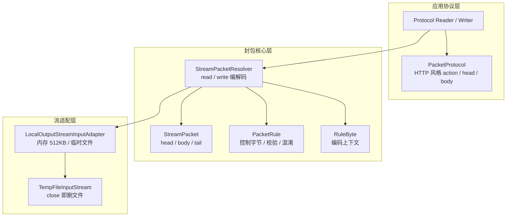
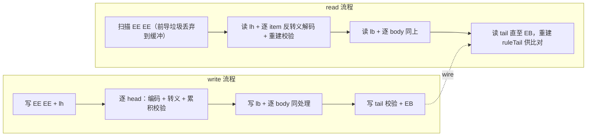

# i2f-packet

> **二进制流封包协议模块**：12 个源文件（约 2000 行，**纯 JDK 零依赖**；11 个正式类 + 1 个置于 `src/main/java` 下的演示类），实现了一套自定义流式封包协议——以 `EE EE` 双字节引导 + 四个控制字节（`EE`/`EF`/`EA`/`EB`）与 `EF` 前缀转义，把「多个 head + 多个 body + 可选 tail 校验」封装为可在一根字节流上连续传输的帧；`StreamPacket` 承载多头多体数据，`StreamPacketResolver` 提供对称的 `read`/`write` 编解码（含前导垃圾扫描定位、转义解码、校验重建），`PacketRule` 将控制字节/缓冲阈值/尾部校验函数/字节编解码器全部可插拔（三预设：`simpleRule` 无校验、`hashRule` 校验、`defaultRule` 校验 + 上下文 XOR 混淆），`PacketProtocol` 进一步把帧映射为 HTTP 风格的应用协议（内置 `action`/`content-type`/`name` 头 + `x-body-{i}-{name}` 体级附加头），`LocalOutputStreamInputAdapter` 按 512KB 阈值自适应内存/临时文件缓冲（`TempFileInputStream` 读完即删文件）。⚠ 全仓**无任何源码级消费方**（仅聚合打包与索引提及）；且读端存在**已实测复现的转义状态缺陷**——数据/校验尾字节恰为 `0xef` 时其后的分隔符/结束符被吞并（静默数据错位或 `IOException`），详见「模块瑕疵」第 1 条。

## 模块路径

- `i2f-jdk/i2f-packet`

## 模块依赖

**本模块未声明任何 Maven 依赖**——无内部依赖、无三方依赖、无 lombok（POJO 全部手写 getter/setter），仅使用 JDK8 的 `java.io`/`java.util` 包，是全仓少见的「绝对零依赖」模块。

| GroupId | ArtifactId | Scope | Optional | 来源 | 用途 |
| --- | --- | --- | --- | --- | --- |
| （无） | — | — | — | — | 本模块 `pom.xml` 未声明任何 `dependencies` |

- 父 POM 为 `i2f.turbo:i2f-jdk:1.0-jdk8`；`build` 声明 `maven-assembly-plugin`（继承根 POM 配置）——属项目打包惯例。
- 无 `src/test` 目录；唯一的「测试」是 `i2f.packet.test.TestStreamPacket`（`main` 方法手工演示，位于 `src/main/java` 下，会被打包进正式 jar，见瑕疵第 12 条）。

## 模块设计

模块分为三层：**应用协议层**（HTTP 风格映射）→ **封包核心层**（规则驱动的编解码）→ **流适配层**（内存/临时文件缓冲）：



### 1. 帧格式（wire 协议）

由 `PacketRule` 类注释与 `StreamPacketResolver` 读写实现共同定义的帧结构（控制字节可自定义，下为默认值）：

```text
EE EE | lh | h0 EA h1 EA ... EA | lb | b0 EA b1 EA ... EA | tail? | EB
 ①      ②        ③                ④        ⑤                 ⑥      ⑦
```

| 序号 | 内容 | 说明 |
| --- | --- | --- |
| ① | `EE EE` | 双字节引导（两个连续 `EE` 避免与单字节转义冲突；读取时可跳过任意前导垃圾后定位） |
| ② | `lh` | head 个数（单字节，0–127，写端校验 >127 抛 `IOException`） |
| ③ | head 区 | `lh` 个 head，**每个 head 后跟一个 `EA` 分隔符**（含最后一个，即共 `lh` 个 `EA`） |
| ④ | `lb` | body 个数（单字节，0–127） |
| ⑤ | body 区 | `lb` 个 body，每个后跟一个 `EA`（共 `lb` 个 `EA`） |
| ⑥ | `tail?` | 可选尾部（当规则支持 tail 且 `lh+lb>0` 时写入，默认 8 字节校验值；空包无 tail） |
| ⑦ | `EB` | 帧结束符 |

**转义规则**（`EF` 为转义前缀；仅对四个控制字节转义，其余字节原样传输）：

| 原始输出字节 | wire 编码 | 读取时还原 |
| --- | --- | --- |
| `EE` | `EF EE` | 遇 `EF` 前缀 + 控制字节 → 还原为后者 |
| `EF` | `EF EF` | 同上 |
| `EA` | `EF EA` | 同上 |
| `EB` | `EF EB` | 同上 |
| 其他 | 原样 | — |

- 空包示例：`EE EE 00 00 EB`（无 head/body、无 tail）。
- 解码时若 `EF` 前缀后跟非控制字节，抛 `IOException("bad packet found.")`（损坏检测）。
- 转义判断发生在**编码（XOR 混淆）之后**；`defaultRule` 的混淆使「编码后恰为控制字节」的字节同样被转义。

### 2. `StreamPacketResolver`：核心编解码器

`read(PacketRule, InputStream)` / `write(PacketRule, StreamPacket, OutputStream)` 读写完全对称，各提供一个使用 `defaultRule` 的默认重载：



- **读取**：先用 `LocalOutputStreamInputAdapter`（`drop`）缓冲并丢弃 `EE EE` 之前的前导数据；未找到引导（含流已结束）返回 `null`；每读出一个数据字节都延迟一拍处理（`ReadPacketContext` 中的 `before/hasBefore/isFirst` 状态机），以区分「数据字节」与「分隔符/转义序列」。
- **写入**：head/body 支持 `null` 元素（跳过，读取端还原为空 item）；`writeEncoded` 逐字节编码、转义并同步累积校验；写入的 body 流会被 `close()`（见瑕疵第 4 条）。
- **对称性**：`RuleByte` 上下文（`isHead`/`currentCount`/`currentIndex`/`dataIndex`）在写端编码与读端解码时保持一致，是 XOR 混淆与校验能够往返的基石（`write` 时 `writeEncoded` 也在编码前把原始字节存入 `ruleByte` 供校验累积）。

### 3. `PacketRule` / `RuleByte`：可插拔规则

`PacketRule<T>` 泛型参数 `T` 为校验累积器的状态类型；全部要素可自定义：

| 要素 | 默认值 | 说明 |
| --- | --- | --- |
| `escape`/`start`/`separator`/`end` | `0xEF`/`0xEE`/`0xEA`/`0xEB` | 四个控制字节（构造时校验必须互不相同，`assertValidBytes`） |
| `memorySize` | `512 * 1024` | body 缓冲与 `drop` 缓冲的内存阈值（**head/tail 不适用**，见瑕疵第 13 条） |
| `tailInitializer` | `() -> 0L` | 校验初值 |
| `tailAccumulator` | `(t, e) -> (t + 1) * 31 + e.getData()` | 逐字节累积（Java 字符串哈希风格） |
| `tailFinisher` | `t -> 8 字节大端` | 输出校验值 |
| `byteEncoder`/`byteDecoder` | `DEFAULT_XOR_ENCODER`（两处复用同一函数） | 混淆函数；`fac` 依赖 `isHead`/`currentCount`/`currentIndex`/`dataIndex` **但不依赖数据本身**，故 XOR 自反、可编解码复用 |

三个预设（`tail` 支持 = 三个校验函数非空；`defaultRule` 是各门面使用的默认规则）：

| 预设 | tail 校验 | XOR 混淆 | 适用 |
| --- | --- | --- | --- |
| `simpleRule()` | 无 | 无 | 最简封包，不校验完整性 |
| `hashRule()` | 8 字节校验 | 无 | 需要完整性校验（wire 明文） |
| `defaultRule()` | 8 字节校验 | 有 | 默认：校验 + 轻量混淆（**非加密**，可逆） |

`RuleByte` 是编解码上下文的载体（`data` 当前字节、`dataIndex` 字节序号、`isHead` 是否头区、`currentIndex` 当前 head/body 序号、`currentCount` head/body 总数）。

### 4. `StreamPacket` / `PacketProtocol`：数据模型与应用协议

- `StreamPacket`：`byte[][] head` + `InputStream[] body` + `byte[] tail`（读到的实际尾部）+ `byte[] ruleTail`（按规则重建的校验值）；`isEqualsTail()` 比较后两者判定完整性；三个 `of(...)` 工厂（String、byte[]、InputStream 三种 body 形态，内部 UTF-8 编码）；`array(T... arr)` 为泛型转数组小工具。
- `PacketProtocol`：把包映射为 HTTP 风格——head 为 `name:value` 文本行（UTF-8），内置 `action`（类比 URL）、`content-type`（`text`/`number`/`json`/`xml`/`file`/`binary`）、`name`（文件名/字段名）；**体级附加头**以 `x-body-{index}-{name}` 约定编码进包 head（`makeBodyHeadName`）；便捷方法 `addText`/`addJson`/`addXml`/`addBinary`/`addFile`/`addBody`；`getBodyHead(index)` 反向提取某 body 的附加头；`toPacket`/`ofPacket` 与 `StreamPacket` 互转。
- 类注释给出容量推导：必要头（action/token/timestamp/messageId）+ 每 body 两个附加头 ⇒ `(128-4)/2=62` 个 body 上限（注：注释写 128，实际单个字节写端限制为 127，见瑕疵第 14 条）。

### 5. 流适配：`LocalOutputStreamInputAdapter` / `TempFileInputStream`

- `LocalOutputStreamInputAdapter` 是「OutputStream 写入 → 供 InputStream 读取」的自适应缓冲：写入量在 `memorySize`（默认 512KB）内用 `ByteArrayOutputStream`；超过后切换到临时文件（`File.createTempFile`，失败静默回退 `./tmp/local-{threadId}-{uuid}.data`）；`getInputStream()` 提供**一次性**输入流（`hasRead` 保护），文件模式返回 `TempFileInputStream`（close 时删除临时文件）；`toByteArray()` 全量取出。
- `TempFileInputStream` 是 `FilterInputStream` 子类，`close()` 时删除其包装的临时文件——即「读取完成即清理」。
- `copy(is, os)`：64KB 缓冲复制工具（**会关闭输入流**）。

### 6. 包结构

| 包 | 类（行数） | 职责 |
| --- | --- | --- |
| `i2f.packet.data` | `StreamPacket`（172） | 包模型：多 head/多 body/tail/ruleTail + 工厂 + 校验比对 |
| `i2f.packet.rule` | `PacketRule`（302） | 封包规则：控制字节、缓冲阈值、校验三函数、编解码函数、三预设 |
| | `RuleByte`（91） | 编解码上下文（data/dataIndex/isHead/currentIndex/currentCount） |
| | `StreamPacketResolver`（388） | 核心编解码：`read`/`write`/`readNextItem`/`writeEncoded` |
| `i2f.packet.io` | `LocalOutputStreamInputAdapter`（224） | 内存/临时文件自适应缓冲（写→读适配） |
| | `TempFileInputStream`（61） | 临时文件输入流（close 即删文件） |
| `i2f.packet.protocol` | `PacketProtocol`（286） | HTTP 风格应用协议映射（action/content-type/name/x-body-i-name） |
| `i2f.packet.protocol.stream` | `InputStreamProtocolReader`（78）/ `OutputStreamProtocolWriter`（80） | 协议级流读写门面（默认规则） |
| `i2f.packet.stream` | `InputStreamPacketReader`（76）/ `OutputStreamPacketWriter`（80） | 包级流读写门面（默认规则） |
| `i2f.packet.test` | `TestStreamPacket`（170） | `main` 演示与手工自测（写读校验、转义样例、explorer 打开输出目录） |

## 模块目的

- 提供一套**轻量、自包含（零依赖）的二进制封包协议**：在 TCP/文件/任意字节流上以帧为单位传输「多个带类型元数据的载荷」（注释场景：上传多个文件 + 文本字段，类比 HTTP multipart 的轻量化替代）。
- 解决流式传输中的三个基础问题：**帧定界**（双字节引导 + 分隔符 + 转义保证数据透明）、**完整性校验**（可选 tail 校验值）、**资源控制**（大 body 超出内存阈值自动落盘、读完即删）。
- 以**规则对象**（`PacketRule`）把控制字节、缓冲大小、校验算法、混淆算法全部外置，使协议可定制、可复用（simple/hash/default 三档开箱即用）。
- 提供 **HTTP 风格的应用层映射**（`PacketProtocol`），让业务按 `action + 头 + 多载荷` 的直觉方式消费封包。

## 模块功能

| 类型 | 成员 | 说明 |
| --- | --- | --- |
| `StreamPacket` | `head`/`body`/`tail`/`ruleTail` | 多 head 多 body 包模型 |
| | `of(byte[] head, InputStream... body)` / `of(String head, String... body)` / `of(byte[] head, byte[]... body)` | 三种便捷工厂（String 以 UTF-8 编码） |
| | `isEqualsTail()` | 实际 tail 与按规则重建的校验值比对 |
| `PacketRule<T>` | `simpleRule()` / `hashRule()` / `defaultRule()` | 三预设规则 |
| | `isTailSupport()` / `isValidBytes()` / `assertValidBytes()` | 校验支持判定与控制字节合法性检查 |
| | 控制字节/缓冲/校验函数/编解码 getter/setter | 全要素可插拔 |
| `RuleByte` | `data`/`dataIndex`/`isHead`/`currentIndex`/`currentCount` | 编解码上下文 |
| `StreamPacketResolver` | `read(is)` / `read(rule, is)` | 帧解码（含前导定位；无包返回 `null`） |
| | `write(packet, os)` / `write(rule, packet, os)` | 帧编码（含转义、校验、尾写） |
| | `readNextItem` / `writeEncoded` | 单个 item 的读/写内核（状态机） |
| `PacketProtocol` | `begin()` / `begin(action)` / `action(...)` / `addHead(...)` | 协议构建（链式） |
| | `addText` / `addJson` / `addXml` / `addBinary` / `addFile` / `addBody` | 各类载荷便捷添加（自动写 `x-body-{i}-*` 附加头） |
| | `getHead(name)` / `getBodyHead(index)` / `getBody()` | 读取头/体级头/体流列表 |
| | `toPacket()` / `toPacket(protocol)` / `ofPacket(packet)` | 与 `StreamPacket` 互转 |
| `InputStreamPacketReader<T>` / `OutputStreamPacketWriter<T>` | `form(is/os)` / `read()` / `write(packet)` / `flush()` / `close()` | 包级流门面（默认 `defaultRule`） |
| `InputStreamProtocolReader<T>` / `OutputStreamProtocolWriter<T>` | `form(is/os)` / `read()` / `write(protocol)` / `flush()` / `close()` | 协议级流门面（默认 `defaultRule`） |
| `LocalOutputStreamInputAdapter` | `write(...)` / `getInputStream()` / `toByteArray()` / `isReadyInput()` / `copy(is, os)` | 512KB 内存/临时文件自适应缓冲 |
| `TempFileInputStream` | `close()` | close 后删除包装的临时文件 |
| `TestStreamPacket` | `main` / `testBasic` / `testStream` | 演示与手工自测（`src/main` 下） |

## 模块主要使用方法

**1）包级读写（默认规则：校验 + 混淆）**

```java
// 写：连续写入两个包到同一流
try (OutputStream os = new FileOutputStream("demo.spkt")) {
    OutputStreamPacketWriter<Long> writer = OutputStreamPacketWriter.form(os);
    writer.write(StreamPacket.of("这是报文头", "第一块数据", "the second data"));
    writer.write(StreamPacket.of(new byte[]{0x00, 0x01}, new byte[]{0x10, 0x11}));
}

// 读：read() 返回 null 表示流中已无更多包（循环终止条件）
InputStreamPacketReader<Long> reader = InputStreamPacketReader.form(new FileInputStream("demo.spkt"));
StreamPacket packet;
while ((packet = reader.read()) != null) {
    boolean intact = packet.isEqualsTail();  // 校验完整性（仅 tail 支持的规则有意义）
    byte[][] head = packet.getHead();
    for (InputStream body : packet.getBody()) {
        byte[] data = readAll(body);
        body.close();                        // 必须 close：文件模式会删除临时文件
    }
}
```

**2）协议级读写（HTTP 风格）**

```java
// 写：action + 普通头 + 文本/文件载荷（自动附加 x-body-{i}-name/content-type）
OutputStreamProtocolWriter<Long> writer = OutputStreamProtocolWriter.form(os);
writer.write(PacketProtocol.begin("/sys/upload")
        .addHead("token", "xxx")
        .addText("username", "admin")
        .addFile("test.pdf", new ByteArrayInputStream(pdfBytes)));

// 读：还原为 PacketProtocol
InputStreamProtocolReader<Long> reader = InputStreamProtocolReader.form(is);
PacketProtocol protocol = reader.read();
protocol.getHead("action");     // "/sys/upload"
protocol.getBodyHead(0);        // {name=username, content-type=text}
List<InputStream> bodies = protocol.getBody();
```

**3）自定义规则**：通过 `PacketRule` 构造器自定义控制字节（必须四个互不相同）、缓冲阈值、校验三函数（可自定义为 CRC 等）与编解码函数（如不混淆则不传后两个参数）；`T` 为校验状态类型。

**4）容量约定**：head 与 body 各最多 127 个；按协议层「每 body 两个附加头 + 4 个普通头」推导约 62 个 body（更多字段建议合并为 JSON 承载）。

**注意事项：**

- `read()` 返回 `null` 表示「流中找不到包」（已结束或无引导字节），**不是异常**；`isEqualsTail()` 仅在 `hashRule`/`defaultRule` 下有意义（`simpleRule` 恒为 `false`，见瑕疵第 7 条）。
- **写入包会关闭传入的 body 流**；读取到的 body 流**只能消费一次**（文件模式），且**必须 close**（否则临时文件残留）。
- 命令行/业务数据中有任意二进制字节时无需手动转义，协议自动处理；但**尾字节恰为 `0xEF` 的数据存在读取缺陷**（见瑕疵第 1 条），选型时务必评估。
- XOR 混淆**不是加密**——仅使明文数据不直接出现在 wire 上；敏感数据需自行加密后再入包。
- 前导垃圾会被完整缓冲后丢弃——极大前导数据（>512KB）会落盘临时文件且不会自动删除（见瑕疵第 5 条）。

## 下游消费方一览

| 消费方 | 依赖关系 | 使用方式 |
| --- | --- | --- |
| `i2f-jdk-all` | 聚合打包 | 将 `i2f-packet` 纳入全仓 fat-jar（L453） |
| 根 POM | 注册 | `dependencyManagement` 统一版本管理（L666） |
| `i2f-jdk` 聚合模块 | 聚合 | `<module>i2f-packet</module>`（L126） |
| `.wiki` 文档体系 | 索引提及 | `wiki.md` 模块列表（「其他」类）、`docs/module-i2f-jdk.md`（「数据包」） |

> 说明：全仓检索 `i2f.packet` 的 import 与 `i2f-packet` 的 POM 引用，**除上面这些聚合/索引外无任何源码级消费方**——协议能力已备，暂无业务使用。

## 模块特性总结

- **自定帧协议**：`EE EE` 双字节引导 + 4 控制字节 + `EF` 前缀转义（仅对控制字节转义），数据全透明，且容忍前导垃圾（自动扫描定位）。
- **多 head + 多 body + 可选 tail**：单帧可承载多个元数据头与多个载荷（各 ≤127），tail 提供可选完整性校验，结构对应 HTTP 的「头 + multipart 体」。
- **规则全可插拔**：控制字节、缓冲阈值、校验三函数（初始化/累积/输出）、字节编解码器均外置；三档预设开箱即用（simple/hash/default）。
- **对称编解码**：`RuleByte` 上下文在写编码与读解码两侧保持一致；XOR 混淆依赖「fac 不依赖数据本身」实现编解码同函数复用。
- **HTTP 风格应用层**：`action`/`content-type`/`name` 内置头 + `x-body-{i}-{name}` 体级附加头，业务按 action + 载荷列表直觉消费。
- **资源自适应**：512KB 内存阈值，超出落盘临时文件；`TempFileInputStream` 读完即删。
- **零依赖纯 JDK**：无任何 Maven 依赖（连 lombok 都未用），可直接拷贝到任意 JDK8 工程。
- **读写门面成对**：Packet/Protocol × Reader/Writer 四个流式门面，均默认 `defaultRule`。

## 可拓展方向

- **修复转义状态缺陷**（最高优先，见瑕疵第 1 条）：终止判定结合 `hasBefore` 状态，并补充「尾字节编码后为 `0xEF`」的边界单元测试。
- 校验算法升级：接入 CRC32/Adler32/长度+摘要（现为 `(t+1)*31+b` 弱校验，碰撞与截断风险高）。
- 可选长度前缀模式（免转义扫描、O(1) 帧定位），或长度+转义的混合模式。
- 协议层增强：body 自动 JSON 编解码、消息 ID/序号内建（注释中提出由 `messageId` 头自行实现）。
- 资源管理增强：临时文件目录/阈值全局配置、流所有权语义（写入不关闭调用方流）、AutoCloseable 链。
- 并发/NIO 支持：Netty ByteBuf 适配、读写线程安全说明。
- 补齐正式单元测试（当前仅 `src/main` 下的 `main` 演示）。

## 模块瑕疵或错误

以下为通读本模块 12 个源文件（约 2000 行）并实测复现后记录的内容：

1. **【高危·已实测】转义状态残留吞并控制字节**：读端 `StreamPacketResolver.readNextItem` 的终止判定 `if (b == end) { if (context.before != rule.getEscape()) { 终止 } }` 只检查 `before` 值而未结合 `hasBefore`（转义序列是否已消费）；转义处理分支写入被转义字节后执行 `context.hasBefore = false; context.before = b`（`b` 即被转义的 `0xEF`），使紧随其后的 `EA`/`EB` 被误判为「仍在转义序列中」而**不终止**。触发条件：**某个 head/body 的最后输出字节（或 8 字节 tail 的最后一字节）编码后恰为 `0xEF`**（wire 上出现 `EF EF` 后紧跟 `EA`/`EB`）。实测复现（编译本模块源码运行）：head=`{41 EF}` + body=`{42}` 写后读回——head 变为 `41 EF EA 01 42`（**吞入分隔符、bodyLen 与 body 字节**）、body 丢失、`isEqualsTail()=false`（**静默数据损坏**）；tail 尾字节为 `0xEF` 的包（head=`{00}`、body=`{0F}` 时校验值恰为 `…03EF`）读取**直接抛 `IOException: packet recognize error`**——即**本模块自己写出的合法包也无法读回**。对照组（尾字节 `0xEE`、`0xEF` 位于数据中间、`defaultRule` 普通数据）全部正常。触发概率与内容相关（尾字节近似均匀时约 1/256），写入端无法规避；修复方向：终止判定改为 `if (!context.hasBefore || context.before != rule.getEscape())`。
2. **`InputStreamProtocolReader.read()` 对「流结束/无包」抛 NPE**：`StreamPacketResolver.read` 找不到包时返回 `null`，`InputStreamProtocolReader.read()` 直接传给 `PacketProtocol.ofPacket(packet)`，后者无 null 防护（`packet.getHead()`）——读到流末尾即 NPE，与 `InputStreamPacketReader.read()` 返回 `null` 的约定不一致，循环读取模式不可用。
3. **读端长度字节无防护**：`read` 中 `int headLen = is.read()`/`bodyLen` 未检查 `-1`（流被截断时 `new byte[-1][]` 抛 `NegativeArraySizeException`，信息不友好）；且不校验 128–255 范围（写端限制 ≤127），读端会照单全收地创建超量数组。
4. **`write` 关闭调用方传入的流**：`StreamPacketResolver.write` 对每个 body 执行 `body[i].close()`；工具方法 `LocalOutputStreamInputAdapter.copy(is, os)` 同样 `is.close()`——调用方若在写包后继续使用该流将失败，且 API 未声明该副作用。
5. **`LocalOutputStreamInputAdapter` 状态与方法不一致**：文件模式下 `toByteArray()` 内部调用 `getInputStream()`（消耗一次性 `hasRead`），此后 `getInputStream()` 抛「cannot provide again」；内存模式下 `toByteArray()` 不消耗状态、可重复调用——**同为公开方法，两种模式行为不同**。另 `read` 中用于丢弃前导垃圾的 `drop` 缓冲从不 `close`：前导数据超 512KB 时会落盘临时文件且**永不删除**（同时为「丢弃」而全量缓冲本身也是浪费）。
6. **`TempFileInputStream.close()` 删除无保护**：`super.close()` 之后才 `tmpFile.delete()` 且无 try-finally——若底层 close 抛异常，临时文件残留。
7. **`simpleRule` 下 `isEqualsTail()` 恒为 `false`**：tail 不支持时写端不写 tail、读端 `tail` 为 0 长度数组而 `ruleTail` 为 `null`（`tail == null || ruleTail == null` 直接 false）——调用方若不做规则判断，会把「无校验规则」误读为「校验失败」。
8. **死代码与重复定义**：写端 `if (head[i] != null) { if (head[i] == null) { ... } }` 内层永假；`writeEncoded` 中 `ref != null && isTailSupport`（后者已含前者）；`read` 开头 `context.isOk` 连续重复初始化；`DEFAULT_RULE` 在 `StreamPacketResolver`/`InputStreamPacketReader`/`OutputStreamPacketWriter`/`InputStreamProtocolReader`/`OutputStreamProtocolWriter` 5 个类中各自 `PacketRule.defaultRule()`（5 个独立实例）。
9. **`PacketRule` setter 不重新校验**：`setEscape/setStart/setSeparator/setEnd` 修改后不调用 `assertValidBytes`——可构造出控制字节冲突的非法规则，导致编解码静默损坏（构造器有校验、setter 无）。
10. **应用层隐式约束与损坏数据崩溃**：head name 若含 `:`，`toPacket` 写出的 `name:value` 在 `ofPacket` 中按 `split(":", 2)` 截断——name 被损坏（未文档化的隐式约束）；`ofPacket` 遇解析不出 `name:value` 的行静默跳过，但遇**空 name** 行（`:v`）会因 `addHead` 抛 `IllegalArgumentException`——损坏/恶意数据导致读取崩溃而非跳过。
11. **`StreamPacket.equals/hashCode` 语义可疑**：对 `InputStream[] body` 用 `Arrays.equals/hashCode`（按元素 equals/hash）——`InputStream` 基本是 identity 语义，两个内容相同的包不相等；hashCode 也随流对象变化，不适合作为 map key。
12. **测试类混入正式源码**：`TestStreamPacket` 位于 `src/main/java`（打包进正式 jar 发布），内含 Windows `explorer` 调用（`Runtime.getRuntime().exec("explorer ...")`）与 `./test/test.spkt` 落盘；项目无 `src/test`、无单元测试框架，本模块**零自动化测试**。
13. **性能限制**：`writeEncoded` 逐字节 `read`/`write`（输出流无缓冲、无批量写入）；读取无长度前缀，靠转义扫描 + 逐字节状态机（O(n)，且不可跳过未读的 body）；`read` 中 head/tail 缓冲使用无参构造（恒 512KB 阈值），**只有 body 与 `drop` 使用 `rule.getMemorySize()`**——阈值配置不覆盖全部缓冲。
14. **注释与实现不一致**：head 上限在 `StreamPacket` 注释为「127」而在 `PacketProtocol` 注释推导中写作「128」（`(128-4)/2=62`）；`InputStreamProtocolReader`/`OutputStreamProtocolWriter` 的 `toString()` 打印的类名是 `InputStreamPacketReader{...}`/`OutputStreamPacketWriter{...}`（复制残留）。
15. **异常信息缺上下文**：`readNextItem` 抛 `IOException("bad packet found.")`/`("packet recognize error, not expect byte found.")` 均不含位置、相位（head/body/tail）与 item 序号，损坏包的定位排查困难；转义解码与校验累积路径的异常也不含数据偏移信息。
