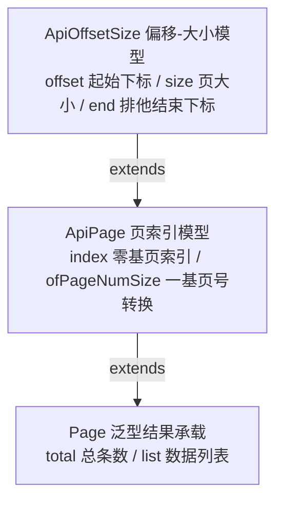
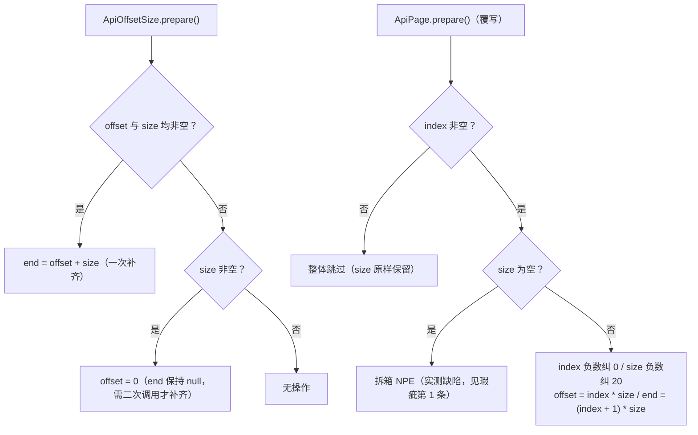

# i2f-page

> **分页数据模型模块**（3 源文件约 216 行，运行期零依赖，lombok 仅编译期 provided）：以三层轻量值对象构成全仓统一的分页契约——`ApiOffsetSize`（offset 起始下标 + size 页大小 + end 排他结束下标三字段模型）、`ApiPage`（0 基页索引 index，支持 1 基页号转换）、`Page<T>`（total 总数 + list 数据列表的结果承载泛型），为 JDBC、MyBatis、Elasticsearch、类型安全查询、过程式 SQL 等分页链提供一致的分页入参与返回结构。

## 模块路径

- `i2f-jdk/i2f-page`

## 模块依赖

| 依赖 | 坐标 | scope | optional | 说明 |
| --- | --- | --- | --- | --- |
| lombok | org.projectlombok:lombok | provided（继承根 POM 管理，版本 1.18.44） | true | 编译期生成 `@Data`/`@NoArgsConstructor` 样板（getter/setter/equals/hashCode/toString），运行期无字节码依赖 |

- 无项目内部依赖，是本组中最底层的分页模型模块（`i2f-bindsql-page`、`i2f-jdbc-impl`、`i2f-extension-mybatis` 等均在其之上）。

## 模块设计

### 1. 三层继承链



- **ApiOffsetSize**：面向「取数下标」的分页参数，`end` 约定为**排他结束下标**（`end = offset + size`，即实际取数区间 `[offset, end)`）。
- **ApiPage**：面向「第几页」的 API 参数，`index` 从 0 开始；`ofPageNumSize` 完成前端常见的 1 基页号到 0 基索引的转换。
- **Page<T>**：查询结果承载，`total` 总条数 + `list` 当前页数据，与分页参数同源（继承链使返回结果自然携带 index/offset/size/end 回显）。

### 2. 状态推导：prepare / beginPage / valid

分页对象是**可变值对象**，字段可由 setter、构造器、`page(...)` 系列方法任意组合设置，派生字段（`end`、`offset`）通过显式的 `prepare()` 推导，而非 setter 自动触发：



- `beginPage()`：`ApiPage` 的兜底入口——`index == null` 置 0、`size == null` 置 20，然后执行 `prepare()`（默认第 1 页、每页 20 条）。
- `valid()`：执行 `prepare()` 后判断 `index != null && size != null` 是否成立。
- 派生规律实测表（JDK8 + lombok 1.18.30 实测，见下方复现证据）：

| 写入组合（基类 ApiOffsetSize） | 一次 prepare 结果 |
| --- | --- |
| `offset=0, size=1` | `end=1`（一次补齐） |
| `offset=null, size=1` | `offset=0`，但 `end=null`；**二次** prepare 后 `end=1` |
| `offset=3, size=null` | 无操作（size 与 end 均保持 null） |
| 两者均 null | 无操作 |

| 写入组合（子类 ApiPage） | prepare 结果 |
| --- | --- |
| `index=2, size=10` | `offset=20, end=30` |
| `index=null, size=10` | 无操作（offset/end 均保持 null）；`beginPage()` 后 `index=0, offset=0, end=10` |
| `index=2, size=null` | **抛 NullPointerException**（`this.size < 0` 拆箱） |
| `index=-1, size=-5` | `index=0, size=20 → offset=0, end=20`（负数归一化） |

### 3. 拷贝与反推

- `pageOffset(ApiOffsetSize page)`：值拷贝 `offset/size/end` 三字段（拷贝前对源对象执行 `prepare()`，**会修改源对象状态**）。
- `ApiPage.page(ApiOffsetSize page)`：先走 `pageOffset`，再按 `index = offset / size` **反推**页索引（仅在 offset 为 size 整数倍时无损）。
- `ApiPage.page(ApiPage page)`：拷贝父类三字段并直接复制 `index`。
- `ApiPage.page(Integer index, Integer size)`：设置 index/size 后立即 `prepare()`。
- `ofOffsetEnd(offset, end)`：以「起止下标」构造，`size = end - offset`。

### 4. 包结构

```
i2f.page
├── ApiOffsetSize  偏移-大小模型（offset/size/end + prepare/pageOffset/of/ofOffsetEnd）
├── ApiPage        页索引模型（index + prepare/beginPage/valid/ofPageNumSize/page 拷贝族）
└── Page<T>        结果承载（total/list + of 工厂/data 填充）
```

## 模块目的

- 为全仓提供**统一、极轻**的分页参数与结果模型，使 JDBC（`i2f-jdbc-impl`）、分页方言（`i2f-bindsql-page`）、MyBatis 拦截器（`i2f-extension-mybatis`）、Elasticsearch（`i2f-extension-elasticsearch`）、脚本引擎（`i2f-extension-xproc4j`）等各条链路共享同一份分页契约，避免各模块自定义分页结构。
- 同时覆盖两种主流分页入参习惯：**下标式**（offset/size，JDBC/ES 友好）与**页号式**（index/size，API 友好），并提供互相转换。
- 以 `end` 排他下标为关键词适配不同数据库方言的分页语法（Oracle ROWNUM、DB2 ROWNUMBER、MySQL limit 等），使方言包装器无需各自换算。

## 模块功能

| 类 | 字段 | 能力 |
| --- | --- | --- |
| `ApiOffsetSize` | `offset`、`size`、`end` | 构造 `(offset,size)`/拷贝构造；工厂 `of`/`ofOffsetEnd`；`prepare` 派生 `end`；`pageOffset` 拷贝 |
| `ApiPage` | 继承三字段 + `index` | 工厂 `of(index,size)`/`ofPageNumSize(页号,页大小)`/`of(ApiOffsetSize)`；`page(...)` 三种拷贝/赋值；`prepare` 归一化与派生；`beginPage` 默认值兜底；`valid` 校验 |
| `Page<T>` | 继承全部 + `total`、`list` | 工厂 `of(page,total,list)`；`data(total,list)`/`data(list)` 填充 |

- 全部类均由 Lombok `@Data` + `@NoArgsConstructor` 生成 getter/setter、无参构造器（`Page` 另有全参风格的静态工厂替代构造）。

## 模块主要使用方法

### 1. 下标式分页（JDBC / ES）

```java
// 直接构造 offset/size（推荐显式给出 offset，避免仅 size 的派生缺口）
ApiOffsetSize page = ApiOffsetSize.of(0, 10);

// JDBC 链：JdbcResolver.page 内部经 BindSqlWrappers.page -> 方言包装器 apply 时自动 prepare()
Page<Map<String, Object>> ret = JdbcResolver.page(conn, bindSql, page);

// Elasticsearch 链
EsQuery query = new EsQuery().page(0, 10); // 内部 new ApiPage(index, size)
Page<Map<String, Object>> esRet = query.searchAsMap(manager);
```

### 2. 页号式分页（API 友好，1 基页号）

```java
// 前端页号从 1 开始：ofPageNumSize(3, 10) 等价于 index=2
ApiPage page = ApiPage.ofPageNumSize(pageNum, pageSize);

// 0 基索引直接构造
ApiPage page2 = ApiPage.of(2, 10);           // index=2, offset=20, end=30

// 默认兜底：第 1 页、每页 20 条
ApiPage page3 = new ApiPage();
page3.beginPage();                            // index=0, size=20, offset=0, end=20
```

### 3. 结果组装

```java
// 静态工厂：复用分页参数对象并回填 total/list
Page<User> ret = Page.of(page, total, list);

// 或独立创建 + data 填充
Page<User> ret2 = new Page<>(ApiPage.of(2, 10)).data(total, list);
```

### 4. MyBatis 线程上下文

```java
MybatisPagination.startPage(offset, size);    // 内部 ApiOffsetSize.of(offset, size) 存入 ThreadLocal
List<User> list = userMapper.list(query);     // 拦截器读上下文改写 SQL
Page<User> ret = MybatisPagination.ofPage(list); // Page.of(getPageAndClear(), getTotalAndClear(), list)
```

### 5. 与分页方言层（i2f-bindsql-page）的协作

```java
// BindSqlWrappers.page 内：pageWrapper.apply(sql, page) -> 内部 page.prepare() 后按方言拼接
PageBindSql bind = BindSqlWrappers.page(conn, bindSql, ApiOffsetSize.of(offset, size));
// MySQL 用 offset/size 拼 "limit ? , ?"；Oracle/DB2/Firebird/CirroData 依赖 end（ROWNUM/PAGE_ROW_ID/TO）
```

### 注意事项

- `end` 为**排他**结束下标（`offset + size`），实际区间为 `[offset, end)`。
- `prepare()` 需显式调用；主要消费链（`BindSqlWrappers.page`、`EsQuery.done()`、拷贝构造）均会代为执行，但直接读取 `end` 前应先调用。
- **仅设置 size 时**（`new ApiOffsetSize(null, n)`）：一次 `prepare()` 只补 `offset=0` 不补 `end`，依赖 `end` 的 Oracle/DB2/Firebird/CirroData 方言会静默退化（详见瑕疵第 3 条）；建议显式传 `offset=0` 构造 `(0, n)`。
- 实例为**可变对象**且会被消费方就地 `prepare()`（如 `pageOffset` 拷贝会修改源对象），不要在多次查询间共享同一实例；每次查询新建。
- 页号与索引易混：`ofPageNumSize` 入参页号从 **1** 开始，`of`/构造器入参 index 从 **0** 开始。

## 下游消费方一览

**源码级消费方**（约 35+ 个源文件引用 `i2f.page.*`）：

| 模块 | 主要消费点 | 用途 |
| --- | --- | --- |
| `i2f-jdk/i2f-bindsql-page` | `BindSqlWrappers.page`、`PageBindSql`、`IPageWrapper` 及 9 个方言包装器（Mysql/Oracle/PostgreSql/SqlServer/Db2/Firebird/IbmAs400/Informix/CirroData） | 分页方言 SQL 生成；`prepare()` 后读 `offset/size/end`（Oracle/DB2/Firebird/CirroData 依赖 `end`，MySQL/PG 用 `offset/size`） |
| `i2f-jdk/i2f-jdbc-impl` | `JdbcResolver`（8+ 个 `page` 重载）、`JdbcTemplate` | JDBC 分页查询与结果组装（`Page.of(pageBindSql.getPage(), total, rows)`） |
| `i2f-jdk/i2f-jdbc-bql` | `BqlTemplate.page(Bql, ApiOffsetSize)` | 类型安全查询分页入口 |
| `i2f-jdk/i2f-jdbc-procedure` | `JdbcProcedureExecutor`、`BasicJdbcProcedureExecutor`、`SqlQueryListNode`、`SqlQueryObjectNode`、`SqlQueryRowNode`（`new ApiOffsetSize(null, 1)` 单行）、`SqlCursorNode`、`SqlEtlNode` | 过程式 SQL 节点分页 |
| `i2f-jdk/i2f-jdbc-proxy` | `BaseMapper.page/pageMap` 接口、`ProxyRenderSqlHandler`、测试代理类 | 代理 Mapper 分页接口契约 |
| `i2f-extension/i2f-extension-mybatis` | `MybatisPagination`（ThreadLocal 上下文）、`MybatisPaginationProxyHandler` | `startPage` 拦截改写 + `ofPage` 组装 |
| `i2f-extension/i2f-extension-elasticsearch` | `EsQuery`、`EsManager`、`EsBeanManager`、`SpringEsQuery` | from/size 分页 + 结果组装 |
| `i2f-extension/i2f-extension-xproc4j` | `ExecContextMethodProvider`（tinyscript API）、`LangEvalJavaNode` | 脚本/Java 节点分页查询透出 |
| `i2f-springboot/i2f-springboot-ops-starter` | `ElasticSearchOpsController`、`DatabaseQueryTools` | 运维 ES 分页、AI 工具 JDBC 分页 |
| `i2f-springboot/test-springboot` | `BqlService` | 演示用例 |

**聚合注册**：`i2f-jdk`（`<module>` L127）、`i2f-jdk-all`（依赖坐标）、根 POM（dependencyManagement）；`i2f-extension-elasticsearch`、`i2f-bindsql-page`、`i2f-jdbc-impl`、`test-springboot` 各自 POM 直接声明依赖。

## 模块特性总结

1. **极简三层模型**：单包 3 文件，继承链 `ApiOffsetSize → ApiPage → Page<T>`，职责递增（参数 → 页参数 → 结果）。
2. **双入参风格**：offset/size（下标式）与 index/size（页号式）并存，`ofPageNumSize` 完成 1 基页号转换。
3. **排他 end 语义**：`end = offset + size`，直接服务 Oracle ROWNUM、DB2/Firebird TO 等「上界排他」方言。
4. **显式状态推导**：`prepare/beginPage/valid` 三方法管理派生字段，未使用 setter 自动触发（避免隐式计算）。
5. **运行期零依赖**：lombok 仅 provided+optional 编译期使用，产物无第三方字节码依赖。
6. **泛型结果承载**：`Page<T>` 与分页参数同源继承，返回体自然携带分页回显字段。
7. **全仓统一契约**：JDBC、MyBatis、ES、BQL、过程式 SQL、脚本引擎共用同一分页模型。
8. **静态工厂齐全**：`of`/`ofOffsetEnd`/`ofPageNumSize`/`page`/`data` 覆盖常用构造与填充场景。

## 可拓展方向

1. **健壮性修复**：`ApiPage.prepare()` 判空（修复 NPE）、`index = offset / size` 防除零、`index * size` 防 int 溢出（改 long 运算或显式校验）。
2. **派生补齐**：`ApiOffsetSize.prepare()` 在仅 size 时同步补 `end = size`，消除单次/二次 prepare 不等价与方言退化。
3. **equals 修复**：继承链改用 `@EqualsAndHashCode(callSuper = true)`，使比较包含父类字段。
4. **结果辅助方法**：总页数（`total/size` 向上取整）、是否还有下一页、当前页区间等便捷计算。
5. **序列化支持**：实现 `java.io.Serializable`（RPC/缓存场景）或补充显式 `serialVersionUID`。
6. **不可变变体**：提供 builder/record（JDK17 侧）风格的不可变分页参数，避免共享可变对象被就地修改。
7. **索引反推校验**：`page(ApiOffsetSize)` 在 `offset % size != 0` 时告警或保留 offset 优先策略，避免静默截断。

## 模块瑕疵或错误

以下第 1-7 条均为**实测确认**（JDK8 + lombok 1.18.30 编译运行最小复现程序，证据留存于 `runtime/tmp/page-repro/`），第 8-11 条为源码走查结论。

1. **【高危·实测】`ApiPage.prepare()` 对 size 的判空缺失导致拆箱 NPE**：`if (this.index != null && this.size < 0)` 在 `size == null` 时对 Integer 拆箱抛 `NullPointerException`。触发条件为「index 已设置、size 为 null」——恰是 API 分页参数缺省 pageSize 的常见形态。实测：`ApiPage.of(5, null)`、`new ApiPage(0, null)`、`ApiPage.ofPageNumSize(3, null)` 全部抛 NPE（连构造器都无法完成）；而同类代码中 `beginPage()` 与 `valid()` 的语义（size 为 null 时兜底 20）说明本意应判 `size == null || size < 0`。修复方向：`if (this.size != null && this.size < 0)` 或改为 null/负数统一兜底 20。
2. **【中危·实测】`ApiPage.page(ApiOffsetSize)` 的反推除法未防 0 导致 `ArithmeticException`**：拷贝构造链中 `index = offset / size` 未校验 `size != 0`。实测：`ApiPage.of(new ApiOffsetSize(5, 0))` 抛 `java.lang.ArithmeticException: / by zero`。修复方向：`size != null && size != 0` 时才反推。
3. **【中危·实测】`ApiOffsetSize.prepare()` 仅 size 时只补 offset 不补 end，引发依赖 end 的方言静默退化**：实测 `ApiOffsetSize.of(null, 1)` 一次 prepare 后为 `offset=0, size=1, end=null`，二次调用才得 `end=1`；而 `of(0, 1)` 一次即 `end=1`。结合 `i2f-bindsql-page` 方言源码：Oracle 包装器在 `offset!=null && end==null` 时落入「仅起点」分支 `ROWNUM >= offset+1`（无上界，**静默全量返回**）、CirroData 落入「无分页」分支；MySQL/PG 因只用 offset/size 不受影响——同参数跨方言行为不一致。`i2f-jdbc-procedure` 的 `SqlQueryRowNode`/`SqlQueryObjectNode` 恰以 `new ApiOffsetSize(null, 1)` 表达「单行查询」意图，在上述方言上会退化为全量加载。修复方向：`else if (size != null) { offset = 0; end = size; }`。
4. **【中危·实测】Lombok `@Data` 继承链 equals/hashCode 不包含父类字段**：`ApiPage` 的 equals 仅比较 `index`、`Page` 仅比较 `total/list`（lombok 编译期即给出警告 "Generating equals/hashCode implementation but without a call to superclass"）。实测：`ApiPage.of(1, 10).equals(ApiPage.of(1, 20))` 为 `true`（offset 10 vs 20、end 20 vs 40 均不同）且 hashCode 同为 60；`Page` 中 index=2 与 index=9 的两个结果页 equals 为 `true`。影响去重、集合语义与测试断言。修复方向：`@EqualsAndHashCode(callSuper = true)`。
5. **【低危·实测】`offset` 反推 `index` 有损且再 prepare 不可逆**：`ApiPage.page(ApiOffsetSize)` 用整除截断（`offset / size`）。实测：`new ApiOffsetSize(15, 10)` 拷贝后 `index=1`，再次 `prepare()` 后 `offset=10, end=20`——原始 offset=15 被静默改写为 10。仅在 offset 为 size 整数倍时无损。
6. **【低危·实测】`pageOffset` 拷贝有副作用**：拷贝前对**源对象**执行 `prepare()`，就地修改调用方传入的对象。实测：源 `ApiOffsetSize.of(null, 8)` 被拷贝后自身 `offset` 由 null 变为 0。
7. **【低危·实测】`ofOffsetEnd` 边界语义不完整**：`ofOffsetEnd(null, 10)` 结果为 `offset=0, size=null`（end=10 未折算为 size=10，参数丢失）；`ofOffsetEnd(3, null)` 走空分支 `else if (offset != null) { }`，结果 `size=null`（无处理）。实测输出见证据文件。
8. **【走查】`prepare()` 的多态语义分裂**：`ApiPage` 覆写 `prepare()` 且不调用 `super`，以 index 驱动派生；同为 `ApiOffsetSize` 声明引用的调用会因实际类型不同得到不同语义——基类 `(null, 10)` 补 `offset=0`，子类 `ApiPage(null, 10)` 因 index 为 null 整体跳过（实测 S4：offset/end 保持 null）。子类「有 size 无 index」时需显式 `beginPage()` 才生效，否则静默无分页参数。
9. **【走查】int 溢出无防护**：`offset = index * size`、`end = (index + 1) * size` 以 int 运算，超大页码/页大小（如 50000 × 50000 ≈ 2.5e9）溢出为负值，静默产生非法分页参数。
10. **【走查】字段间无一致性维护**：`end` 由 setter 修改 `offset/size/index` 后不会失效或重算；旧对象复用（先 `(0,10)` 后再 set 回 null）时 `end` 残留旧值 10，`prepare()` 也不会重置。依赖「每查询新建 + 显式 prepare」的隐式约定。
11. **【走查】可变实例被消费方就地修改**：`BindSqlWrappers.page`/`PageBindSql` 持有同一 `ApiOffsetSize` 引用并调用 `prepare()`，`Page.of(...)` 最终把该实例挂到返回结果上；若多线程或多次查询共享同一实例，派生字段会互相污染。建议始终新建实例。

### 复现证据摘要（runtime/tmp/page-repro/）

```
=== S1 ApiPage.of(5, null)         -> java.lang.NullPointerException
=== S2 new ApiPage(0, null)        -> java.lang.NullPointerException
=== S3 ApiPage.ofPageNumSize(3, null) -> java.lang.NullPointerException
=== S5 of(null, 1) 1st prepare     -> offset=0, size=1, end=null
=== S5 of(null, 1) 2nd prepare     -> offset=0, size=1, end=1
=== S6 ApiPage.of(new ApiOffsetSize(5, 0)) -> java.lang.ArithmeticException: / by zero
=== S7 a.equals(b) = true          -> offset=10/end=20 vs offset=20/end=40（hashCode 均 60）
=== S8 Page a.equals(b) = true     -> index=2 vs index=9（total/list 相同）
=== S9 of(new ApiOffsetSize(15, 10)) after prepare -> offset=10（原 15 丢失）
=== S15 (null,1) 一次 prepare 后模拟 Oracle 分支 -> offset!=null && end==null 成立（ROWNUM >= 1 无上界）
```

- 对照组 S5b（`of(0,1)` 一次 prepare 即 `end=1`）、S10（`ApiPage.of(2,10)` 全链 normal）、S11（`beginPage` 兜底默认 20）、S13（`ofOffsetEnd(3,10)` 正常）均符合预期，确认上述异常为缺陷而非环境问题。
