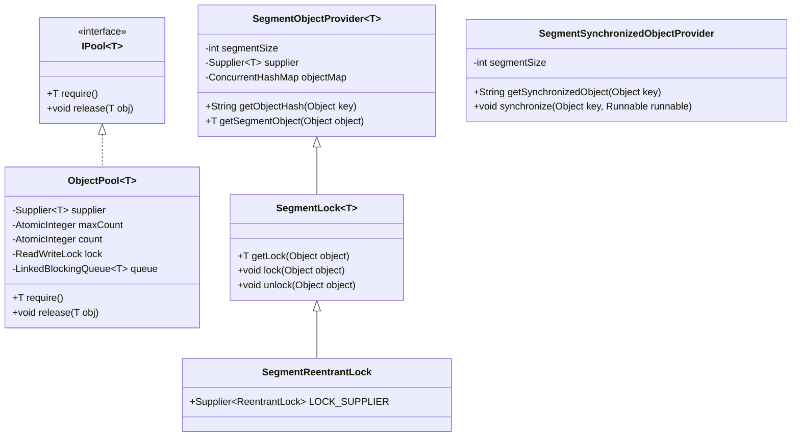
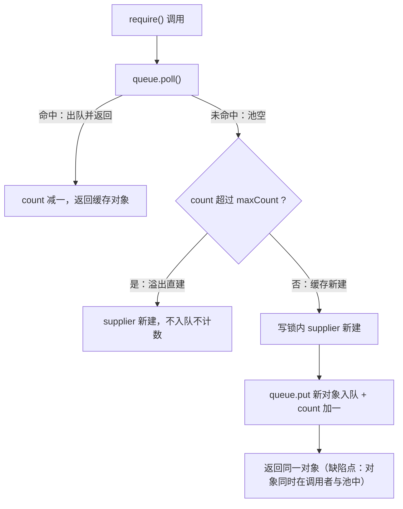

# i2f-pool

> **对象池与分段并发原语模块**（6 源文件约 281 行，纯 JDK 零运行期依赖）：提供两类可独立使用的基础原语——**对象池**（`IPool` 最小契约 require/release + `ObjectPool` 队列缓存实现：LinkedBlockingQueue 缓存、AtomicInteger 计数、ReadWriteLock 检查-创建、Supplier 懒创建、maxCount 默认 300）与**分段并发**（`SegmentObjectProvider` 按 hashCode % segmentSize 懒创建槽位共享对象；`SegmentLock<T extends Lock>` 泛型分段锁与 `SegmentReentrantLock` 专用化；`SegmentSynchronizedObjectProvider` 将槽位编号经 String.intern() 化为有限个全局监视器并提供 Runnable/Supplier/Function 三种 synchronize 辅助）。被 i2f-swl 的 `SwlExchanger` 用于非对称/对称加密器与摘要器实例复用（require/release 配对）。

## 模块路径

- `i2f-jdk/i2f-pool`

## 模块依赖

| 依赖 | 坐标 | scope | optional | 说明 |
| --- | --- | --- | --- | --- |
| lombok | org.projectlombok:lombok | provided | true | 版本继承根 POM 统一管理；⚠ 本模块全部源文件实际未使用任何 lombok 注解（getter/setter 均为手写），属可移除的冗余声明 |

- 无项目内部依赖，无其他三方依赖；实现全部基于 JDK8 原生并发工具（java.util.concurrent）。

## 模块设计

### 包结构与职责

| 包 | 类 | 职责 |
| --- | --- | --- |
| `i2f.pool` | `IPool<T>` | 对象池最小契约：`require()` 申请 / `release(T)` 归还，仅两个动词 |
| `i2f.pool.impl` | `ObjectPool<T>` | 队列缓存对象池实现：Supplier 懒创建、maxCount 上限约束、读写锁保护 |
| `i2f.pool.segment` | `SegmentObjectProvider<T>` | 分段对象提供器：`hashCode % segmentSize` 决定槽位，槽位对象经 `computeIfAbsent` 懒创建并长期共享 |
| `i2f.pool.segment` | `SegmentLock<T extends Lock>` | 分段锁：继承 SegmentObjectProvider，把槽位对象语义化为 `Lock`，提供 `getLock/lock/unlock(key)` |
| `i2f.pool.segment` | `SegmentReentrantLock` | 分段互斥锁专用化：预设 `ReentrantLock::new` 工厂 |
| `i2f.pool.segment` | `SegmentSynchronizedObjectProvider` | 基于 `String.intern()` 的分段同步器：不持有对象表，用 intern 字符串作监视器，提供 3 种 `synchronize` 辅助与 1024 段 `INSTANCE` 单例 |

### 类关系



### ObjectPool：队列缓存对象池

- 字段：`Supplier<T> supplier` 对象工厂；`AtomicInteger maxCount` 上限（构造重载可设，默认 300）；`AtomicInteger count` 计数；`ReadWriteLock lock` 读写锁；`LinkedBlockingQueue<T> queue` 缓存队列。
- `require()` 三分支：① `queue.poll()` 命中 → `count` 减一后直接返回缓存对象；② 未命中且 `count > maxCount`（读锁内侦察）→ `supplier.get()` 直建直接返回（不入队、不计数）；③ 未命中且未超限 → 写锁内 `supplier.get()` 新建、`queue.put()` 入队、`count` 加一后返回。
- `release(T)`：空值忽略；写锁内入队 + `count` 加一。
- `setSupplier(Supplier)`：写锁内替换工厂并清空队列、重置计数（用于整体切换对象生成逻辑）。
- 语义目标：让"创建开销大、可复用"的对象以"借出-归还"方式复用；⚠ 当前实现的空池分支存在独占语义缺陷（实测，见瑕疵 1/2），使用前需知悉。



### 分段并发族：统一的分段思想

所有分段类共享同一个映射策略——**对 key 计算 `Math.abs(hashCode) % segmentSize` 得到槽位编号，同编号的 key 共享同一槽位对象**：

- `SegmentObjectProvider<T>`：`ConcurrentHashMap<String,T>` 存放槽位对象（key 为槽位编号字符串），`computeIfAbsent` 保证并发下懒创建的原子性；槽位对象数量有界（≤ segmentSize，默认 1024）。
- `SegmentLock<T extends Lock>`：把槽位对象约束为 `Lock`；`lock(key)/unlock(key)` 各自独立计算槽位并取同一个锁对象，因 `T extends Lock` 可直接调用 `lock()/unlock()`。
- `SegmentReentrantLock`：`SegmentLock<ReentrantLock>` 的专用化子类，固化 `ReentrantLock::new` 工厂。
- `SegmentSynchronizedObjectProvider`：不维护对象表——将槽位编号字符串 `intern()` 后作为监视器，JVM 保证相同字面值的字符串返回同一对象引用，从而任意 key 都有确定的监视器且数量有界；提供 `synchronize(key, Runnable)`、`synchronize(key, Supplier<V>)`、`synchronize(key, Function<T,R>, T)` 三个辅助方法；`INSTANCE` 为 1024 段共享单例。

### intern 监视器的设计考量

源码注释给出了选择 intern 的原因：任意对象经 hash 后只有 segmentSize 个可能值（`0` 到 `segmentSize-1` 的数字字符串），对这些固定字符串 intern 最多产生 segmentSize 个全局驻留对象（默认 1024），规避了"任意字符串直接 intern 导致字符串常量池无限膨胀甚至 OOM"的风险；同时以极小代价获得 JVM 级的"同 key 同监视器"保证。

`synchronize` 的 lambda 重载选择：有返回值的表达式 lambda（如 `() -> compute()`）自动匹配 `Supplier` 重载，无返回值语句 lambda（如 `() -> System.out.println(x)`）自动匹配 `Runnable` 重载（JDK 按函数接口返回值兼容性解析，已验证编译无歧义）。

### 并发安全设计边界

- ObjectPool：快路径 `poll()` 无锁（LinkedBlockingQueue 线程安全）；检查-创建经读写锁；计数用 AtomicInteger。但"检查"与"创建"之间存在 TOCTOU 窗口（瑕疵 4）。
- 分段族：ConcurrentHashMap 的 `computeIfAbsent` 原子；`intern()` 线程安全。
- 分段锁只保证"同槽位 key 互斥"，不同槽位并发自由——hash 冲突的 key 会意外互斥（退化），见瑕疵 9。

## 模块目的

- 为 i2f-jdk 提供零依赖、可独立拷贝使用的**对象池**与**分段并发**最小原语：池化减少昂贵对象（加密器、Buffer、解析器）的重复创建；分段把全局锁细化为按 key 的细粒度锁，降低热点争用。
- 以"分段"为统一心智模型（hash 槽位共享对象）同时覆盖共享对象、互斥锁、监视器三种用途。

## 模块功能

- 通用对象池：`IPool` 契约 + `ObjectPool` 实现（Supplier 懒创建、上限约束、工厂热替换）。
- 分段对象提供：按 key 提供长期共享的槽位对象（`SegmentObjectProvider`）。
- 分段锁：`SegmentLock` 泛型分段锁与 `SegmentReentrantLock` 专用化（lock/unlock by key）。
- 分段 synchronized：`SegmentSynchronizedObjectProvider` 三种 synchronize 辅助方法 + 全局单例。

## 模块主要使用方法

### 1. 对象池：复用创建昂贵的对象

```java
ObjectPool<MessageDigest> pool = new ObjectPool<>(() -> {
    try {
        return MessageDigest.getInstance("SHA-256");
    } catch (NoSuchAlgorithmException e) {
        throw new IllegalStateException(e);
    }
}, 64);

MessageDigest digest = pool.require();
try {
    byte[] out = digest.digest(data);
} finally {
    pool.release(digest);
}
```

⚠ 注意：当前实现 `require()` 存在"新建对象同时入队并返回"的缺陷（实测），同一实例可能被多个调用者并存持有——对无状态对象影响有限，对有状态/独占要求对象需先修复或避免使用（详见瑕疵 1）。

### 2. 分段锁：按 key 互斥

```java
SegmentReentrantLock lock = new SegmentReentrantLock(64);

lock.lock(userId);
try {
    // 同 userId（同槽位）串行，不同 userId 并发
} finally {
    lock.unlock(userId);
}
```

注意 key 必须是 hashCode 稳定的对象（不能在持有锁期间变化），且 lock/unlock 必须传同一 key（见瑕疵 10）。

### 3. 分段同步：synchronized 风格

```java
SegmentSynchronizedObjectProvider sync = SegmentSynchronizedObjectProvider.INSTANCE;

sync.synchronize(orderId, () -> {
    // 与 orderId 同槽位的代码块互斥
});

String result = sync.synchronize(orderId, () -> doCompute(orderId));
```

### 4. 自定义分段对象

```java
SegmentObjectProvider<ByteBuffer> buffers =
        new SegmentObjectProvider<>(32, () -> ByteBuffer.allocate(4096));
ByteBuffer buf = buffers.getSegmentObject("auth");   // 同槽位 key 复用同一 Buffer

SegmentLock<ReentrantLock> locks = new SegmentLock<>(128, ReentrantLock::new);
locks.lock("abc");
try {
    // ...
} finally {
    locks.unlock("abc");
}
```

## 下游消费方一览

- **i2f-swl → `SwlExchanger`**（唯一源码级消费方）：持有 3 个 `ObjectPool`（`ISwlAsymmetricEncryptor` / `ISwlSymmetricEncryptor` / `ISwlMessageDigester`），以 try/finally 配对 require/release 复用加密器与摘要器实例；`setXxxSupplier` 时联动调用 `ObjectPool.setSupplier` 热替换工厂并清空旧缓存。
- **pom 级引用**：`i2f-swl/pom.xml` 依赖声明；`i2f-jdk-all` 聚合打包；根 `pom.xml` dependencyManagement 统一版本。
- 分段族（4 个类）经全仓检索暂无源码级消费方。

## 模块特性总结

- 纯 JDK 零运行期依赖：仅 `java.util.concurrent` 与 `java.util.function`（lombok 声明未实际使用）。
- API 极简：池 2 动词（require/release）、锁 3 动词（getLock/lock/unlock）、同步 1 动词 3 重载。
- 分段思想全覆盖：同一 hash 槽位策略同时服务"共享对象、互斥锁、监视器"三种场景，理解成本低。
- 懒创建：所有对象均由 Supplier / computeIfAbsent 在首次触达时创建，无预热负担。
- intern 监视器：全局锁对象数量有界（≤ segmentSize），规避字符串常量池膨胀。
- 有界槽位：分段族槽位对象至多 segmentSize 个，内存占用可控。
- 与 i2f-swl 生产集成：已在安全通信模块承担加密器复用职责。
- 适合直接拷贝单类使用：无复杂依赖链。

## 可拓展方向

- 修复 ObjectPool 独占语义（空池直建不入队、release 幂等化），补充失效对象销毁回调、借出超时与空闲回收。
- maxCount 语义梳理：区分"缓存上限"与"借出总数上限"，支持池满阻塞等待或超限抛出策略。
- SegmentObjectProvider 增加 `remove/clear/entries` 管理 API 与 LRU 淘汰。
- 以 `Math.floorMod` 替代 `Math.abs(hash) %` 修正负段号；构造器显式校验 segmentSize。
- 对接项目内 `i2f-lock` 的 `ILock/ILockProvider` 契约，提供分段锁适配器。
- 增加可观测性：池命中率、当前缓存量、分段冲突统计等指标。

## 模块瑕疵或错误

实测复现结论（JDK8 + 最小复现程序，证据留存 `runtime/tmp/pool-repro/`）：

| 场景 | 实测结果 |
| --- | --- |
| S1 连续 3 次 `require()`（maxCount=10） | `o1 == o2`（同一对象重复发放），第 3 次才新建 |
| S2 配对 require→release→require→require | `r1 == r2 == r3`（同一对象被两名并存调用者共享） |
| S3 `maxCount=1` | `m1 == m2` 仍共享同一对象 |
| S4 同一对象双重 release 后连续 require | 连续 4 次全部返回同一对象 |
| S5 `getObjectHash(Integer.MIN_VALUE)` | 返回 `-648`（负段号） |
| S6 `segmentSize=0` | 构造静默通过，首次使用抛 `ArithmeticException: / by zero` |
| S7 `segmentSize=-1` | 所有 key 映射为段 `"0"`（静默退化为单段全局锁） |
| S8/S9 对照组 | 正常分段语义与 SegmentReentrantLock lock/unlock 均正常 |

1. **【高危·实测】`ObjectPool.require()` 空池分支新建对象"同时入队并返回"**——`ret = supplier.get(); queue.put(ret); count.incrementAndGet(); return ret;` 使新对象在交给调用者的同时仍留在池中，下一次 `require()` 会将其再次发放给另一调用者（S1/S2/S3/S10 实测），对象独占语义被破坏；对加密器、Buffer 等有状态对象可能造成数据串扰与并发错误。修复方向：空池时直接 `return supplier.get()` 不入队（入队职责完全交给 `release`），或引入"借出集合"跟踪。
2. **【中危·实测】`release()` 无重复检测与幂等保证**——同一对象可被反复 release，同一引用在队列中堆积并被连续重复发放（S4：双重 release 后同一对象连续发放 4 次）；也没有对失效对象的过滤。
3. **【中危】`count`/`maxCount` 语义错位**——`count` 实际接近"队列内元素数"（入队加一、出队减一），而字段名与构造语义暗示"池中对象总数"；`maxCount` 实际只约束"缓存量"而非"借出对象数"；"溢出直建"路径不计数不缓存，池对象总数可无界增长；判定用 `count > maxCount`（严格大于）边界差一。
4. **【中危】检查-创建 TOCTOU 竞态**——`require()` 在读锁内检查 `count > maxCount`、释放读锁后才在写锁内创建，两个线程可同时通过检查并各自创建入队，计数可越过 maxCount。
5. **【低危】并发与阻塞细节**——`poll()` 出队与 `count.decrementAndGet()` 非原子（队列与计数短暂不一致）；`LinkedBlockingQueue` 无界 + `put()` 永不阻塞，`InterruptedException` 分支形同虚设（`offer()` 更贴切）；"溢出直建"在读锁内调用用户 Supplier，慢工厂会阻塞读锁。
6. **【低危】无效 `transient` 修饰**——`count/lock/queue` 标记 `transient`，但类未实现 `Serializable`，修饰无意义（暗示曾计划序列化能力）。
7. **【中危·实测】`getObjectHash` 的 `Math.abs` 负段号**——`Math.abs(Objects.hashCode(key)) % segmentSize` 在 hashCode 为 `Integer.MIN_VALUE` 时 `Math.abs` 仍返回负数（实测 `-648`），破坏非负段号预期；本例以字符串作 key 尚可容错，但语义错误；应使用 `Math.floorMod`。
8. **【中危·实测】`segmentSize` 仅用 `assert` 校验**——JVM 默认关闭断言：`segmentSize=0` 构造静默通过、使用时抛 `ArithmeticException: / by zero`（S6）；`segmentSize=-1` 时任意值 `% -1 == 0`，所有 key 塌缩到单段，分段锁静默退化为全局锁（S7）。应显式 `if (segmentSize <= 0) throw new IllegalArgumentException(...)`。
9. **【低危】hash 冲突必共享槽位**——不同对象 hashCode 相同（或模后相同）必然共用槽位/锁，hash 分布差的 key 集合会退化为单段串行；使用时应按 key 类型评估碰撞率。
10. **【低危】`SegmentLock.lock/unlock` 两次独立取锁**——解锁依赖 key 的 hashCode 在整个临界区内稳定：若 key 可变且期间 hashCode 变化（或 unlock 传入不同 key），解锁的锁对象与加锁的不同，将抛 `IllegalMonitorStateException` 或死锁；应约定 key 为不可变对象。
11. **【低危】`String.intern()` 的全局性**——intern 字符串在整个 JVM 生命周期驻留且跨所有使用者共享监视器；本模块已把驻留量限制为 segmentSize 个数字字符串（缓解策略正确），但与应用中其他 intern 使用理论上共享同名监视器，属说明性风险。
12. **【信息】无清理与生命周期 API**——模块不提供 `close/remove/clear/invalidate` 等任何清理手段：池对象无有效性校验与空闲回收，槽位对象（含锁与监视器映射）随实例存活至被 GC；`SegmentObjectProvider` 无删除槽位的方法。
13. **【信息】lombok 冗余声明**——pom 声明 lombok 为 provided 依赖，但全部源文件未使用任何 lombok 注解（getter/setter 手写），可安全移除。
