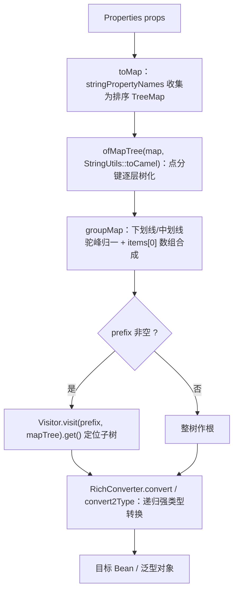

# i2f-properties

> **Properties 配置装载模块**（4 源文件约 260 行 + 1 个演示 properties，运行期依赖 i2f-reflect/i2f-text）：以 `PropertiesUtil` 单门面提供「properties 文件/流 → 强类型 Bean」的完整装载管线——`load(File/URL/InputStream)` 加载 `Properties`；`toMap` 收集为排序 `TreeMap`；`loadAsMapTree` 经 `ObjectRouteResolver` 把点分键树化（`items[0].name` 合成 List）；键名经 `StringUtils::toCamel` 归一化（`stdout_redirect`/`stdout-redirect`/`stdoutRedirect` 三种风格等价）；可选 prefix 以 `Visitor` 表达式定位子树；最终由 `RichConverter` 递归转换为嵌套 Bean/List/枚举/File/Class 等强类型。模块自带 `test` 演示包（对应 i2f-log 的 `log.properties` 结构）与混合键风格示例文件。⚠ 实测两处高危缺陷：**字符串配置转布尔全部得到 true**（`=false` 读回 true，经 i2f-convert 转换链暴露）、**顶层键首段含 `_`/`-`/大写开头时 NPE**（经 i2f-reflect 树化暴露），另有流关闭两态不一致、prefix 静默 null 等（详见瑕疵）。

## 模块路径

- `i2f-jdk/i2f-properties`

## 模块依赖

| 依赖 | 坐标 | scope | optional | 说明 |
| --- | --- | --- | --- | --- |
| lombok | org.projectlombok:lombok | provided | true | 版本继承根 POM 统一管理；仅 `test/TestBeanProperties` 编译期使用 `@Data`/`@NoArgsConstructor` |
| i2f-reflect | i2f.turbo:i2f-reflect | compile | - | `ObjectRouteResolver`（点分键树化 + keyMapper）、`RichConverter`（树 → Bean 递归转换）、`Visitor`（prefix 表达式） |
| i2f-text | i2f.turbo:i2f-text | compile | - | `StringUtils::toCamel` 键名驼峰归一化 |

- 隐式依赖（⚠ 未在 pom 声明）：`i2f-typeof`——`PropertiesUtil` 公共 API 直接使用 `i2f.typeof.token.TypeToken`，实际靠 `i2f-reflect` 的传递依赖编译通过（见瑕疵 7）。
- 传递依赖链：`i2f-convert`、`i2f-lru-map`、`i2f-invokable`（经 i2f-reflect）；`i2f-iterator`、`i2f-match`（经 i2f-text）。

## 模块设计

### 包结构与职责

| 包 | 文件 | 职责 |
| --- | --- | --- |
| `i2f.properties` | `PropertiesUtil` | 模块唯一门面：IO 加载、键值收集、树化、前缀定位、Bean 转换，共 12 个静态方法 |
| `i2f.properties.test` | `TestBeanProperties` | 演示 Bean：5 组配置内部类（stdoutRedirect/stdoutWriter/fileWriter/broadcastWriter/loggingLevel）+ 列表结构（items），结构对应 i2f-log 的 log.properties |
| `i2f.properties.test` | `TestLevel` | 演示枚举：OFF/FATAL/ERROR/WARN/INFO/DEBUG/TRACE/ALL 八级 + `parse` 静态解析（未知值兜底 OFF） |
| `i2f.properties.test` | `TestProperties` | main 演示入口（硬编码 Windows 相对路径） |
| `i2f.properties.test` | `test.properties` | 演示配置：混合三种键风格与 `=`/`:` 两种分隔符 |

### PropertiesUtil API 面

| 方法 | 说明 |
| --- | --- |
| `load(File)` / `load(URL)` / `load(InputStream)` | 加载为 `Properties`（委托 `Properties.load`；统一在内部关闭流，⚠ 关闭两态不一致见瑕疵 3） |
| `loadAsBean(props, [prefix,] Class<T>)` | 树化 + 前缀定位 + 转换为 Bean（Class 重载） |
| `loadAsBean(props, [prefix,] TypeToken<T>)` | 同上（保留泛型的 TypeToken 重载） |
| `loadAsBean(props, [prefix,] Type)` | 同上（裸 Type 重载，走 `RichConverter.convert2Type`） |
| `loadAsMapTree(props)` / `loadAsMapTree(props, keyMapper)` | 键 → 树（`Map<String,Object>`）；不带 mapper 时保留原始键（实测不受瑕疵 2 影响） |
| `toMap(props)` | `Properties` → `TreeMap<String,String>`（按键字典序；仅收集 String 键值，见瑕疵 5） |

### 装载管线



### 键名归一化与树化

- **键风格无关**：`log.stdout_redirect.enable`、`log.stdout-redirect.enable`、`log.stdoutRedirect.enable` 三种写法全部归一到同一路径 `log → stdoutRedirect → enable`（`test.properties` L1-3 即此演示）。归一化由 `StringUtils.toCamel` 完成：不含 `_`/`-` 时仅首字母小写；含则按 `_`/`-` 分词驼峰化。
- **点分键树化**：`a.b.c=v` 逐层生成嵌套 `TreeMap`；`items[0].name=x`、`items[1].name=y` 按下标后缀聚合为同名 `List`（`groupMap` 对 `]` 结尾键做归集）。
- **键序**：中间结构全部为 `TreeMap`（字典序），最终 Bean 字段赋值与键序无关。

### 值转换能力（经 RichConverter → ObjectConvertor）

| 目标类型 | 转换方式 |
| --- | --- |
| 数值类型 | 字符串含进制解析（十进制/`0x`/前导 `0` 八进制/`0b`）、大数兼容 |
| 布尔类型 | ⚠ 任意字符串（含 `"false"`/`"0"`/`""`）全部得到 true（实测，见瑕疵 1） |
| 枚举 | 先按常量 `name` 忽略大小写匹配、数字按 ordinal；未中时尝试调用目标类型 public static 单参工厂方法（`TestLevel.parse` 因此被调用，未知值兜底 OFF，见瑕疵 6） |
| File/URL/URI/Charset | 按字面量构造（URL↔File/URI 互转） |
| Class | `Class.forName` + 线程上下文类加载器兜底 |
| 日期时间 | 多格式尝试解析 |
| 集合/Map/嵌套 Bean | 递归转换（Map→Bean、List→List、数组等） |

### 前缀定位

`prefix` 交给 `Visitor.visit(prefix, mapTree).get()`：支持点路径（实测 `log.broadcastWriter` 直达子树）与索引表达式；⚠ 未命中静默返回 null（见瑕疵 4），且 prefix 需使用已驼峰化的键名。

## 模块目的

- 提供「properties 配置 → 强类型 Bean」的一站式装载：消除逐键 `getProperty` + 手工 parse 的样板代码，让配置直接映射为嵌套对象（枚举、File、List 等自动转换）。
- 作为 i2f-log 等模块配置装配场景的通用底座（`test` 包即以 log.properties 结构建模），并可复用 `ObjectRouteResolver` 的「扁平平铺键 ↔ 对象树」双向能力。

## 模块功能

- 配置加载：文件 / URL / 输入流三种来源。
- 键值收集：`toMap` 排序列化，供树化与自定义处理。
- 键树化：点分路径 + 下标数组合成 + 键风格驼峰归一。
- 前缀定位：Visitor 表达式子树提取。
- 强类型转换：Class/TypeToken/Type 三个重载家族 × 有无 prefix，共 6 个 `loadAsBean`。
- 演示资产：log 风格配置模型、日志级别枚举、混合风格示例配置文件。

## 模块主要使用方法

### 1. 加载 properties 并转换为 Bean

```java
Properties props = PropertiesUtil.load(new File("app.properties"));
AppConfig config = PropertiesUtil.loadAsBean(props, "app", AppConfig.class);
// app.server.port=8080        -> config.server.port
// app.db-master.url=jdbc:...  -> config.dbMaster.url（下划线/中划线归一）
```

### 2. 泛型目标（TypeToken / Type）

```java
PropsWrapper<List<ServerConfig>> wrapper =
        PropertiesUtil.loadAsBean(props, "cluster", new TypeToken<PropsWrapper<List<ServerConfig>>>() {});
```

### 3. 树化后自行处理

```java
Map<String, Object> tree = PropertiesUtil.loadAsMapTree(props);                 // 原始键
Map<String, Object> camelTree = PropertiesUtil.loadAsMapTree(props, StringUtils::toCamel); // 驼峰键
```

### 4. 展示真实演示文件（模块内含）

```java
Properties props = PropertiesUtil.load(new File(".\i2f-jdk\i2f-properties\src\main\java\i2f\properties\test\test.properties"));
TestBeanProperties log = PropertiesUtil.loadAsBean(props, "log", TestBeanProperties.class);
```

⚠ 布尔开关经当前实现读回全部为 true（瑕疵 1）；顶层键不要以 `_`/`-`/大写开头（瑕疵 2）。

## 下游消费方一览

- **源码级**：全仓检索 `import i2f.properties.` 仅命中模块自身 `test/TestProperties`（main 演示）——**无其他模块源码级消费**。
- **pom 级**：`i2f-jdk-all` 聚合依赖（L463-466）；根 `pom.xml` dependencyManagement 注册版本（L679-683）。
- **对比说明**：i2f-log 的 `PropertiesFileLogPropertiesLoader` 为自研加载器（逐键 `Boolean.parseBoolean`），并未依赖本模块——也因此未受瑕疵 1 的布尔缺陷影响。

## 模块特性总结

- 单门面 API：`PropertiesUtil` 一个类承载 12 个方法，覆盖加载/收集/树化/转换全链路。
- 键名风格无关：下划线 / 中划线 / 驼峰三种写法自动归一为同一目标路径。
- 结构自描述：点分路径即对象层级，`items[0].name` 即列表元素，配置文件与 Bean 结构一一对应。
- 转换能力强依赖 `i2f-reflect/i2f-convert`：枚举、File、Class、日期、集合均可直接映射。
- 演示即文档：`test` 包以 log.properties 五组配置展示嵌套 + 列表两种典型形态。

## 可拓展方向

- 修复布尔转换（i2f-convert 层）后本模块即可用于 `enable=false` 类开关配置。
- `loadAsBean` 开放 keyMapper/键风格参数（现仅 `loadAsMapTree` 可定制）。
- 增加 classpath 资源加载（`loadResource`）、多来源合并（文件 + 系统属性 + 环境变量）。
- 结合 `ObjectRouteResolver.toRouteMap` 补全反向能力：Bean → properties store 写回。
- 与 YAML/JSON 装载统一到同一「树 → Bean」管线。
- pom 补充 `i2f-typeof` 显式依赖。

## 模块瑕疵或错误

1. **【高危·实测】字符串配置转布尔全部得到 true**：`=false`、`=0`、`=""`、任意字符串经 `loadAsBean` 读回均为 **true**。根因位于 i2f-convert `ObjectConvertor.tryConvertAsType`：L661-664「boolean 的宽泛转换」无条件 `return toBoolean(val)` 拦截一切非 Boolean 源，而 `toBoolean` 对 String 为「非空即 true」且 L1031 兜底 `return true`；紧随其后的正确实现 `tryParseBoolean`（支持 true/false/1/0/y/n/t/f，L666-672）成为不可达死代码。实测：`log.stdoutRedirect.keepConsole=false` 读回 true；真实 test.properties 中同样反转；`toBoolean("")=true`；对照 `Boolean.FALSE`/数值 `0` 转换正常（false）。修复建议：宽泛转换后置或改调 `tryParseBoolean`，并修正 `toBoolean` 兜底。仅 `Boolean` 对象与数值 `0` 能得 false——凡经本模块装载的布尔开关当前均失效。
2. **【高危·实测】顶层键首段含 `_`/`-`/大写开头时 NPE**：根因位于 i2f-reflect `ObjectRouteResolver.groupMap`——首段经 keyMapper 转换后 `put(putKey, …)`，随后却以原始段名 `get(arr[0])` 取值，二者不一致时返回 null，`obj.put` 抛 NullPointerException。实测：`stdout_redirect.enable=true` 与 `Log.stdoutRedirect.enable=true` 均 NPE；`test.properties` 因全部键以 `log.` 开头（首段转换前后同为 `log`）而幸免。凡键的**最外层第一段**为 `snake_case`/`kebab-case`/首字母大写（如 `app_config.xx`、`App.x`）即触发；第二层起因上层已整体驼峰化而不再触发。规避：键首段保持小写驼峰；或改用无 mapper 的 `loadAsMapTree`（实测原样保留）。
3. **【中危·实测】load(InputStream) 流关闭两态不一致**：正常路径无条件 `is.close()`（调用方复用的共享流会被一并关闭）；异常路径（`Properties.load` 抛 IOException，如非法转义）无 finally 保护、流不关闭（实测：正常 closed=true；第 2 字节抛错 closed=false）。`load(File)`/`load(URL)` 打开的流同样在异常时泄漏。修复建议：try-finally 关闭并明确「是否接管调用方流」。
4. **【中危·实测】prefix 未命中静默返回 null**：`Visitor.visit(prefix, mapTree).get()` 找不到路径时不抛异常、不告警，`RichConverter.convert(null,…)` 直接返回 null（实测 `prefix="notexist"` → bean=null）。拼写错误、大小写不符、prefix 用下划线原形（树中已驼峰化）都会静默得到 null，调用方极易 NPE 于下游。
5. **【低危·实测】toMap 丢弃非 String 键值**：`stringPropertyNames()` 仅收集「键与值均为 String」的条目——`props.put("num", 123)`、`props.put(456, "x")` 均静默消失（实测 containsKey=false）。若有编程式塞入对象值的需求，需改用 `entrySet()` 收集。
6. **【低危·实测】未知枚举字面量静默兜底**：转换链对枚举先按 `name` 匹配、再尝试目标类型 public static 单参工厂方法——`TestLevel.parse` 因之被调用，其内部对未知值兜底返回 OFF，使拼写错误（实测 `limitLevel=NOEXIST` → OFF）被静默吞没；若目标枚举无此类静态方法则转换失败返回原值字符串。建议转换层对未匹配枚举报错或告警。
7. **【低危】pom 隐式依赖 i2f-typeof**：`PropertiesUtil` 公共签名直接暴露 `i2f.typeof.token.TypeToken`（TypeToken 重载），但 pom 未声明该依赖，靠 `i2f-reflect` 传递依赖侥幸编译；上游依赖调整即编译失败。
8. **【低危·设计】loadAsBean 键归一化不可定制**：6 个重载内部硬编码 `StringUtils::toCamel`，既无法自定义键风格也无法禁用归一化（仅 `loadAsMapTree` 开放 mapper）；在瑕疵 2 修复前，该硬编码同时是 NPE 的触发源。
9. **【低危·工程】演示资产混入生产源码目录**：`i2f.properties.test` 包（3 个类）与 `test.properties` 均置于 src/main/java——类会随 jar 发布；`test.properties` 不在 resources 下**不会**被打包，发布物中 `TestProperties.main` 必然读取失败；其硬编码路径 `.\i2f-jdk\...` 仅从仓库根目录运行有效（Windows 相对路径）。
10. **【提示】Properties 标准编码行为**：沿用 `Properties.load` 规范——ISO-8859-1 读取、非 ASCII 需 `\uXXXX` 转义（本模块演示文件全 ASCII 即因此），键值分隔符 `=` 与 `:` 等价（test.properties L28-30 演示）。属 JDK 标准行为而非缺陷，但配置含中文时极易踩坑。
