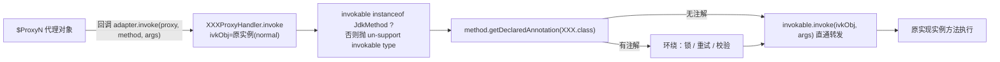
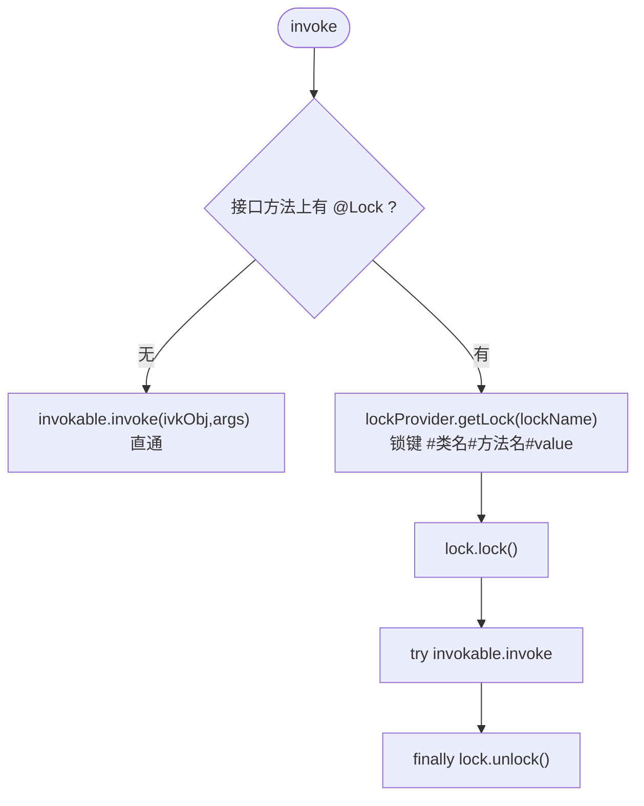
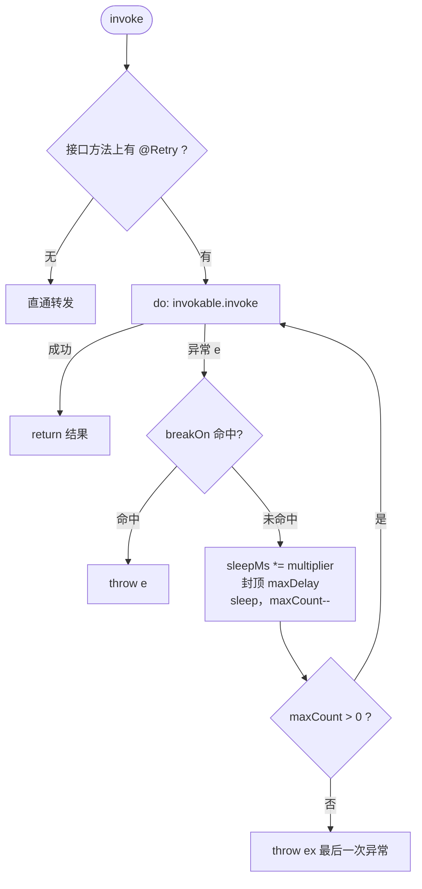
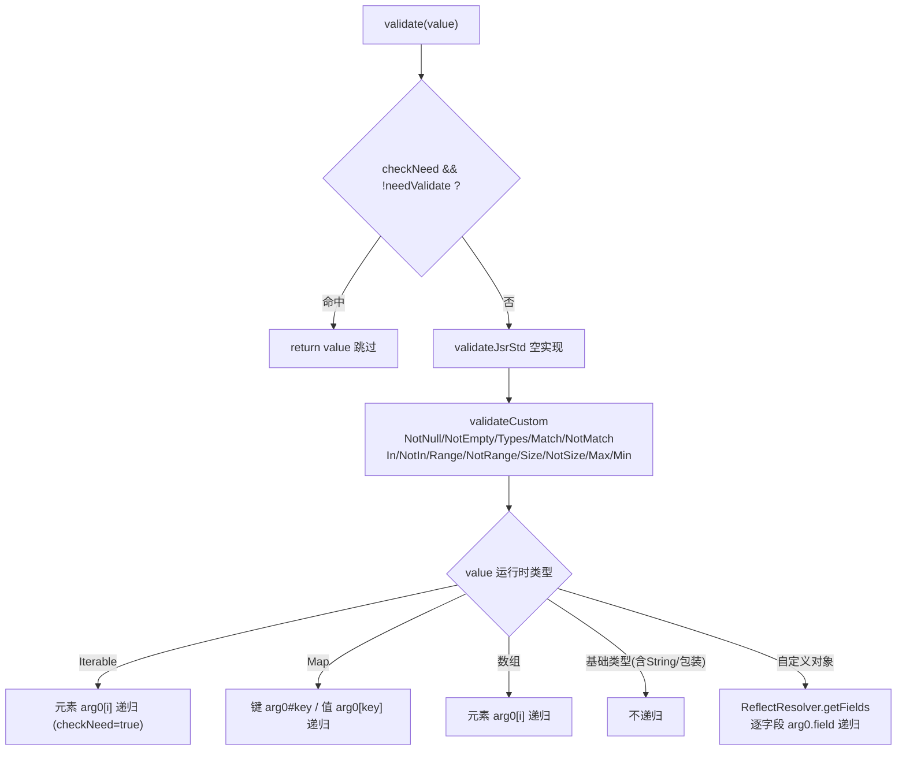

# i2f-proxy-handlers

> **注解驱动的代理处理器模块**（4 源文件约 706 行，依赖 i2f-proxy-std / i2f-annotations-ext / i2f-lock / i2f-convert / i2f-comparator / i2f-reflect）：把 `@Lock` / `@Retry` / `@Validate` 三个注解的横切语义落地为可直接挂上动态代理的 `IProxyInvocationHandler` 实现——`LockProxyHandler`（@Lock 方法级互斥，锁键 = 类名 + 方法名 + value，默认 JVM ReentrantLock、`ILockProvider` 可替换分布式锁）、`RetryProxyHandler`（@Retry 倍率退避重试 + maxDelay 封顶 + breakOn）、`ValidateProxyHandler`（@Validate/@Tag 驱动的参数与返回值深度校验：15 个校验注解族 + 标签过滤 + 对象/集合/Map/数组递归 + 路径化错误消息）、`ValidateException`。⚠ 实测要点：**三个处理器都必须在 normal（实例）形态使用**——interfaces 形态转发即无限递归（实测 getLock 被调 1032 次、根因 StackOverflowError）；**breakOn 完全失效**（JdkMethod 不解包 InvocationTargetException）；转发业务异常被包装为 `UndeclaredThrowableException <- InvocationTargetException <- 业务异常`；@NotSize 双边界判定反转、@Min 失败消息误报 Max（详见文档）。

## 模块路径

- `i2f-jdk/i2f-proxy-handlers`

## 模块依赖

| 依赖 | 坐标 | scope | optional | 说明 |
| --- | --- | --- | --- | --- |
| i2f-proxy-std | i2f.turbo:i2f-proxy-std | compile（继承 i2f-jdk 版本管理） | - | 项目内部依赖：本模块三个处理器均实现其 `IProxyInvocationHandler` 函数式三参契约；传递引入 i2f-invokable（`JdkMethod`/`IInvokable`） |
| i2f-annotations-ext | i2f.turbo:i2f-annotations-ext | compile | - | `@Lock`（元素锁：value/clazz/method）与 `@Retry`（value/delay/maxDelay/multiplier/unit/breakOn）；传递引入 i2f-annotations-core（`@Validate`/`@Tag` 与 NotNull/Range/Size 等校验注解族） |
| i2f-lock | i2f.turbo:i2f-lock | compile | - | `ILock`（lock/unlock 双动词）/`ILockProvider`（getLock(key)）/`JdkCacheLockProvider`（JVM 内 ConcurrentHashMap 缓存 `JdkLock`）/`JdkLock`（ReentrantLock 包装）——LockProxyHandler 的默认锁实现 |
| i2f-convert | i2f.turbo:i2f-convert | compile | - | `ObjectConvertor.tryConvertAsType`：把 @In/@Range/@Max/@Min 的字符串边界值转换为参数声明类型 |
| i2f-comparator | i2f.turbo:i2f-comparator | compile | - | `DefaultComparator.compareDefault`：@Range/@NotRange/@Max/@Min 的通用比较（null 参与比较、跨类型数值经 BigDecimal） |
| i2f-reflect | i2f.turbo:i2f-reflect | compile | - | `ReflectResolver.getFields`/`valueGet`：校验时对自定义对象逐字段反射读取以深度递归 |
| lombok | org.projectlombok:lombok | compile | - | 声明但**源码未实际使用**（四个类均无 lombok 注解），冗余声明 |

- 无三方运行期依赖（lombok 为编译期冗余声明）；全部能力为「纯 JDK + 项目内模块」组合。
- 版本定位：`i2f-proxy-std`（契约）→ `i2f-proxy`（JDK 引擎）→ **本模块（注解语义处理器，按需挂载）**；注解来自 `i2f-annotations-ext`/`i2f-annotations-core`，运行时伙伴为 `i2f-lock`（锁）与 `i2f-comparator`/`i2f-convert`/`i2f-reflect`（校验）。依赖 jar 实测编译运行于 JDK8（`deploy-jdk8` 全家桶 classpath 下编译通过）。

## 模块设计

### 1. 统一模式：注解识别 + 环绕执行 + 原实例转发

三个处理器同构，都是 `IProxyInvocationHandler.invoke(ivkObj, invokable, args)` 的一个「读注解 → 环绕 → 转发」实现：



- 三个处理器都先做 `if (!(invokable instanceof JdkMethod)) throw new IllegalStateException("un-support invokable type=" + ...)` 归一化——只支持 JDK 引擎的 `JdkMethod`，来自 CGLIB 等其它引擎的 IInvokable 会直接拒绝。
- 注解读取均为 `method.getDeclaredAnnotation(...)`（接口方法上的直接声明，见瑕疵 9）。
- 转发统一走 `invokable.invoke(ivkObj, args)`（normal 形态 ivkObj=原实例，可安全转发；interfaces 形态即递归，见瑕疵 1）。
- 「无注解直通」是零侵入开关：未标注解的方法与裸调用等价（L1b/R4 实测）。

### 2. LockProxyHandler：@Lock 方法级互斥

锁键生成（源码原样）：

```java
String lockName = "";
if (ann.clazz())  { lockName = lockName + "#" + method.getDeclaringClass().getName(); }
if (ann.method()) { lockName = lockName + "#" + method.getName(); }
lockName = lockName + "#" + ann.value();     // 默认 clazz=true/method=true/value="" → 如 "#com.x.Task#doTask#"
```

- 默认 provider 为 `new JdkCacheLockProvider()`：JVM 内 `ConcurrentHashMap.computeIfAbsent(lockName, k -> new JdkLock())`（`JdkLock` 包装 `ReentrantLock`）——同锁键全局互斥、**同线程可重入**；`ILockProvider` 可注入（分布式锁场景由其 `getLock` 返回分布式锁实现）。
- 执行模型：`lock.lock()` → `try { invokable.invoke(ivkObj, args) } finally { lock.unlock() }`——异常路径正确释放（L4 实测：方法抛异常后再次调用成功进入方法体）。



- 实测（8 线程 × 50 次非原子自增）：counter=400/400、maxInFlight=1——互斥正确（L1）。

### 3. RetryProxyHandler：@Retry 倍率退避重试

- 参数：`value`（总调用次数，含首次）、`delay`（基准等待）、`multiplier`（增长系数）、`maxDelay`（单次等待封顶）、`unit`（时间单位）、`breakOn`（中断重试的异常类型，⚠ 实测失效，见瑕疵 2）。
- 实测节奏（`value=3, delay=20ms, multiplier=2, maxDelay=1000`）：实际调用间隔 40ms → 80ms（首项**被乘**了 multiplier），总调用 3 次，最后一次失败后仍等待 160ms 才抛出。



- 语义边界：`value=1`（默认值）表示"只调用一次、不重试"，但失败后仍会等待 `delay × multiplier` 才抛出（R6 实测，且被默认 `maxDelay=30` 截断为 30ms）。

### 4. ValidateProxyHandler：@Validate/@Tag 声明式校验引擎（546 行，模块最重）

调用流程（`invoke`）：

1. `getValidateTags(method)` 收集方法上 `@Validate.tags()` 作为标签集；
2. 逐个参数 `validate(false, param[i], "arg"+i, args[i], 参数声明类型, tags)`；
3. `invokable.invoke(ivkObj, args)` 转发执行；
4. 返回值 `validate(false, method, "return", ret, 返回类型, tags)`；
5. 校验失败抛 `ValidateException`（`message()` 优先，否则默认 `"{elemPath} validate {注解名}!"`）。

`validate(checkNeed, elem, elemName, value, elemType, tags)` 的递归分派：

- `checkNeed` 双态：顶层（参数/返回值）传 `false` **无条件校验**；进入嵌套层级传 `true`，先过 `needValidate(elem, tags)`——tags 为空→全量校验；tags 非空→要求元素上有 `@Tag` 与 tags 交集（**标签过滤只作用于嵌套层级**，实测 V10）。
- `validateJsrStd`：JSR 标准注解通道，**空实现**（预留，见瑕疵 11）；`validateCustom`：15 个自定义注解族逐个判定。
- 按值的运行时类型继续下钻（基础类型不含 String 的包装类型直接跳过）：



- 15 个注解族：领域校验 `NotNull`/`NotEmpty`/`Types`；正则族 `Match`(+`Matches` and 组合)/`NotMatch`(+`NotMatches`)；枚举族 `In`/`NotIn`（注解字符串经 `ObjectConvertor` 转参数类型后 `DefaultComparator` 比较）；区间族 `Range`/`NotRange`/`Size`/`NotSize`/`Max`/`Min`；消息统一由 `message()` 或默认模板生成。
- 错误路径示例（实测）：`arg0 validate NotNull!`、`arg0.name validate NotNull!`、`arg0[0].name validate NotNull!`、`return validate NotNull!`。
- `ValidateException` 由 handler 自身 `throw`（不经过 `Method.invoke`），因此校验异常的类型与消息**不被包装**（V2-V11 实测均直接拿到 `ValidateException`）。

### 5. 包结构

- `i2f.proxy.handlers.lock`：`LockProxyHandler`；
- `i2f.proxy.handlers.retry`：`RetryProxyHandler`；
- `i2f.proxy.handlers.validate`：`ValidateProxyHandler`、`ValidateException`。

## 模块目的

- **注解声明式横切（AOP-lite）**：不改业务代码，在接口方法上标注解 + 一行代理装配，即获得「互斥 / 重试 / 校验」三种横切能力，零三方框架依赖。
- **与代理引擎解耦**：三个处理器都是标准 `IProxyInvocationHandler`，凡支持该契约的挂载点（`JdkProxyUtil`、`AspectjUtil`、`IProxyProvider` 等）均可复用。
- **锁能力可演进**：`ILockProvider` 抽象把「JVM 内 ReentrantLock」与「分布式锁」的切换成本收敛为构造参数。
- **校验描述与执行分离**：`i2f-annotations-core` 提供纯语义注解，本模块提供运行期解释器，注解可被文档/代码生成等其它消费方复用。

## 模块功能

- `@Lock` 方法级互斥（锁键 = #类名#方法名#value；JVM ReentrantLock 默认，可换分布式）；
- `@Retry` 参数化退避重试（倍率增长 + maxDelay 封顶 + breakOn 中断）；
- `@Validate` 参数与返回值声明式校验：15 注解族 + `@Tag`/`@Validate(tags)` 标签过滤 + 对象/集合/Map/数组深度递归 + 路径化错误消息；
- 无注解方法零侵入直通转发；
- `ValidateException` 统一校验异常（message/cause 四构造）。

## 模块主要使用方法

### 1. 三个处理器的挂载（必须 normal 实例形态）

```java
// @Lock：接口方法上标注解，实现类照常实现
public interface TaskService {
    @Lock
    void doTask();

    @Lock(value = "order", clazz = false, method = false)   // 锁键仅 "#order"，跨类共享
    void shareTask();
}

TaskService proxy = JdkProxyUtil.proxy(new TaskServiceImpl(), new LockProxyHandler());
proxy.doTask();     // 互斥执行（L1 实测）
```

```java
// @Retry：注意同步调整 maxDelay（默认 30，配默认 SECONDS=30s 设计）
public interface RemoteService {
    @Retry(value = 3, delay = 100, multiplier = 2, maxDelay = 5000, unit = TimeUnit.MILLISECONDS)
    String fetch(String id);
}

RemoteService proxy = JdkProxyUtil.proxy(new RemoteServiceImpl(), new RetryProxyHandler());
String r = proxy.fetch("1");    // 失败自动重试，成功返回（R3 实测）
```

```java
// @Validate：参数注解直接生效；嵌套字段用 @Tag 配方法级 @Validate(tags) 过滤
public class User {
    @NotNull
    @Tag({"login"})
    public String name;

    @NotNull
    public String email;
}

public interface UserService {
    @Validate(tags = {"login"})
    User login(@NotNull String username, @NotEmpty String password);
}

UserService proxy = JdkProxyUtil.proxy(new UserServiceImpl(), new ValidateProxyHandler());
proxy.login("u", "p");          // 通过
proxy.login(null, "p");         // ValidateException: arg0 validate NotNull!
```

### 2. 分布式锁替换（ILockProvider 注入）

```java
// 任意实现 ILockProvider（getLock(key) 返回 ILock）即可整体替换锁语义
LockProxyHandler handler = new LockProxyHandler(redisLockProvider);
TaskService proxy = JdkProxyUtil.proxy(new TaskServiceImpl(), handler);
```

### 3. 注意事项

- **必须 normal（实例）形态**：三个处理器都依赖「转发到真实实例」，interfaces 形态下 `ivkObj` 是代理对象自身，转发会再次回调 handler 形成无限递归（L1c 实测：getLock 被调 1032 次、异常链长 2048、根因 StackOverflowError）。
- **注解必须打在接口方法上**：normal 形态代理传给 handler 的是接口方法的 `Method`，实现类方法上的注解对代理不可见（L2 实测：注解只打实现类 → 不重试、直接透传）。`@Lock`/`@Retry`/`@Validate` 均如此。
- **返回值变量声明为接口类型**：T 从实例实参推断为实现类时会在调用点插入到实现类的 checkcast → CCE（继承 i2f-proxy 的泛型陷阱）；应声明接口类型变量或显式 `JdkProxyUtil.<Ifc>proxy(...)`。
- **转发异常被包装**：业务方法抛出的异常经 `JdkMethod.invoke`（不解包 ITE）→ 调用者收到 `UndeclaredThrowableException <- InvocationTargetException <- 业务异常`（R1/R5 实测）——`catch (IOException)` 之类的类型判断会失效，需遍历 cause；仅本模块「自身抛出」的 `ValidateException` 不被包装。
- **@Range/@Min 与 null 的关系**：null 参与比较被视为小于任何边界——`@Range(min=...)` 对 null 会拒绝（V7 实测 `arg0 validate Range!`）；`@Tag` 过滤只对嵌套字段生效，顶层参数与返回值注解无条件校验。

## 下游消费方一览

| 消费方 | 形态 | 说明 |
| --- | --- | --- |
| i2f-jdk-all | 聚合 | `i2f-jdk-all` L473 聚合打包，随全量 jar 发布 |
| 根 POM | 版本注册 | 根 POM L691 dependencyManagement 统一版本 |

- **全仓暂无源码级消费方**（Java 代码 grep `LockProxyHandler|RetryProxyHandler|ValidateProxyHandler|ValidateException` 与包名 `i2f.proxy.handlers` 均只命中本模块自身；xml 配置 0 命中）——本模块是「注解 → 代理处理器」的参考实现库，供使用方按需手动挂载（用法见上节）；`i2f-proxy-std` 索引摘要中「被 i2f-proxy-handlers 消费」指本模块对 `IProxyInvocationHandler` 契约的依赖方向。

## 模块特性总结

- **注解驱动**：`@Lock`/`@Retry`/`@Validate` 声明式获得互斥/重试/校验，零业务改动；
- **零三方运行期依赖**：纯 JDK + 项目内 i2f 模块（lombok 声明冗余）；
- **三处理器同构**：统一的「注解识别 + 环绕 + 转发」骨架，都是即插即用的 `IProxyInvocationHandler`；
- **锁可插拔**：`ILockProvider` 单点替换 JVM 锁 ↔ 分布式锁；同锁键全局互斥、同线程可重入；
- **校验体系完整**：15 注解族 + 标签过滤 + 四类容器（Iterable/Map/数组/自定义对象）深度递归 + 路径化消息（`arg0[0].name`）；
- **无注解零开销开关**：未标注解的方法与裸调用等价。

## 可拓展方向

- `validateJsrStd` 预留的 JSR-303（javax.validation）通道未实现——可在有依赖环境时补上标准注解桥接；
- `breakOn` 需先解包 `InvocationTargetException` 才能对业务异常生效；
- 对象图校验缺环检测/深度上限（循环引用即栈溢出）；
- 三个处理器目前各自独立，可考虑提供一个「多处理器链式编排」的组合 handler（锁 → 重试 → 校验 叠加生效）。

## 模块瑕疵或错误

以下均为 JDK8 实测（复现件见 `runtime/tmp/proxy-handlers-repro/`，`result8.txt`）：

1. **【高】interfaces 形态直接无限递归**：三个处理器都执行 `invokable.invoke(ivkObj, args)` 转发，interfaces 形态 `ivkObj` 为代理对象自身 → `Method.invoke(proxy)` 重新进入 InvocationHandler → 递归直到栈溢出。实测 L1c：getLock 接口被回调 **1032 次**、异常链长 2048（`UndeclaredThrowableException`/`InvocationTargetException` 交替）、根因 `StackOverflowError`。三个处理器都必须用 `proxy(srcObj, handler)` 实例形态。
2. **【高】breakOn 完全失效**：`JdkMethod.invoke` 直接 `method.invoke(obj, args)` 不拆 `InvocationTargetException`，于是 `catch (Throwable e)` 中的 `e` 恒为 ITE——`breakOn` 里写任何业务异常类型都无法命中。实测 R2：`@Retry(value = 5, breakOn = {IllegalStateException.class})` 的方法抛 IllegalStateException 后仍重试满 5 次。
3. **【高】转发异常类型被包装破坏**：业务异常经 Method.invoke 包装 ITE，handler 直抛（Retry 耗尽后 `throw ex` 抛的也是 ITE）后，JDK 代理发现接口方法未声明该异常 → 再包一层 `UndeclaredThrowableException`。实测 R1/R5/L2/L4 调用者均拿到 `UndeclaredThrowableException <- InvocationTargetException <- IllegalStateException/IOException`；声明了 `throws IOException` 的方法同样被包成 UTEx（抛的是 ITE 不是 IOException）。
4. **【高】@NotSize 双边界判定反转**：源码 `if ((size < min) && (size <= max)) throw`（推测应为 `(size >= min) && (size <= max)`——"尺寸落在闭区间内则拒绝"）。由于 `NotSize.min/max` 均无默认值（必填），双边界是主路径：实测 V6（min=1,max=3）——size=2（区间内，应拒绝）通过；size=4（超上界，应通过）通过；size=0（低于下界，应通过）反而抛 `arg0 validate NotSize!`。即：低于下界被拒、区间内与超上界全部放行，与设计意图整体相反。
5. **【中】@Min 失败消息误报 Max**：ValidateProxyHandler 的 Min 分支使用 `Max.class.getSimpleName()` 拼消息。实测 V5：`@Min("5")` 传 3 → `arg0 validate Max!`。
6. **【中】@Retry 首项等待被乘 multiplier**：`sleepMs` 初始为 `delay`，但先 `sleepMs *= multiplier` 再 sleep——与注解 @Comment「初始等待时长=delay」不符。实测 R1：delay=20ms、multiplier=2 → 首次间隔 **40ms**（设计值应为 20ms）。
7. **【中】@Retry 最后一次失败后仍完整等待**：`maxCount--` 在 sleep 之后，最后一次失败无论是否还有重试机会都要等满退避才退出。实测 R1：`value=3` 最后一次调用后仍等待 160ms 才抛出（lastCallAgo=160ms）；R6/R6b：`value=1`（不重试）仍需等待（30ms/101ms）才抛异常。
8. **【中】maxDelay 与 unit 的耦合陷阱**：`maxDelay` 默认 30 是配默认 `unit=SECONDS`（30 秒）设计；把 `unit` 改为 MILLISECONDS 而不改 maxDelay 时，退避将被**静默截断为 30ms**。实测 R6：`delay=50, multiplier=2, unit=MILLISECONDS`（未设 maxDelay）→ 末尾等待仅 30ms；R6b（maxDelay=1000）→ 完整 101ms。
9. **【中】注解只识别接口方法上的声明**：三个处理器都用 `method.getDeclaredAnnotation(...)`，而代理回调传入的恒为接口方法的 Method——注解打在实现类方法上对代理**完全不可见**（静默不生效）。实测 L2：@Retry 只打在实现类 → 调用一次即抛、不重试。方法注解也无法被继承（JDK 语义），子接口重声明方法时注解不随继承传递。
10. **【中】对象校验无环检测，循环引用栈溢出**：字段递归没有任何 visited/深度保护。实测 V12：自引用对象（`node.next = node`）→ `StackOverflowError`。
11. **【低】JSR 标准校验通道空实现**：`validateJsrStd` 为空方法——javax.validation 标准注解（标准 @NotNull/@Size 等）写在这里会**静默跳过**，不报错也不校验。
12. **【低】@Range/@Min 对 null 拒绝、@Max 对 null 放行**：null 经 `DefaultComparator` 参与比较被视为小于任何边界。实测 V7：`@Range(min="1", max="10")` 传 null → `arg0 validate Range!`（null 被当"小于 1"）；对称地 `@Max` 的 `> 0` 判定对 null 恒 false（放行）——同一参数同时标 @Range 与 @Max 时语义不一致。
13. **【低】标签过滤只作用于嵌套层级**：`@Validate(tags)` 仅影响 `checkNeed=true` 的递归字段（经 `@Tag` 交集）；顶层参数/返回值上的注解**无条件执行**。实测 V10：`@Validate(tags={"login"})` + 顶层 `@NotNull` 参数传 null 照样抛出。
14. **【低】@Size/@NotSize 对非尺寸类型静默通过**：size 探测仅覆盖 Collection/Map/String/StringBuilder/StringBuffer/CharSequence/数组，其余类型 `size=-1` 直接放行（数字误标 @Size 不报错）；`@NotEmpty` 对数字/自定义对象恒判"非空"。
15. **【低】JdkCacheLockProvider 缓存永不清理**：`ConcurrentHashMap` 按 lockName 无限累积 ILock（lockName 含用户 value 且动态多变时缓慢泄漏）；未提供淘汰/释放 API。
16. **【低】@Retry 吞中断与过宽捕获**：`Thread.sleep` 的 `InterruptedException` 被空 catch 吞掉（无法响应取消）；`catch (Throwable)` 使 Error（含 OOM）也进入重试循环。
17. **【低】@Lock 默认锁键尾部多余 "#"**：`value` 默认空串仍无条件拼接分隔符——默认锁键形如 `#com.x.Task#doTask#`（无害但冗余）。
18. **【低】冗余赋值与死代码级小瑕疵**：`invoke` 中 `args[i] = validate(...)` 的返回值原样即入参（从不改写参数），赋值为冗余；`RetryProxyHandler` 的 `sleepMs <= 0` 分支仅在 multiplier=0 时触发（此时又乘出 0），属防御性死路径。
