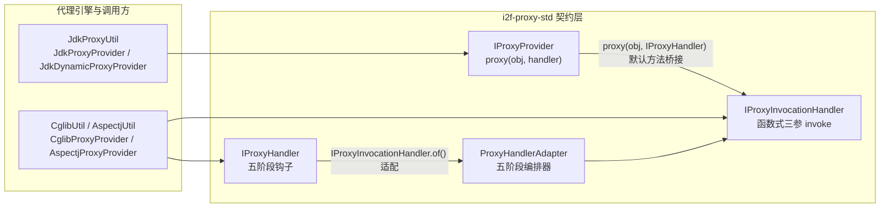
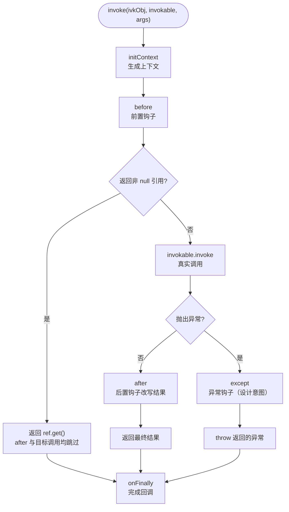
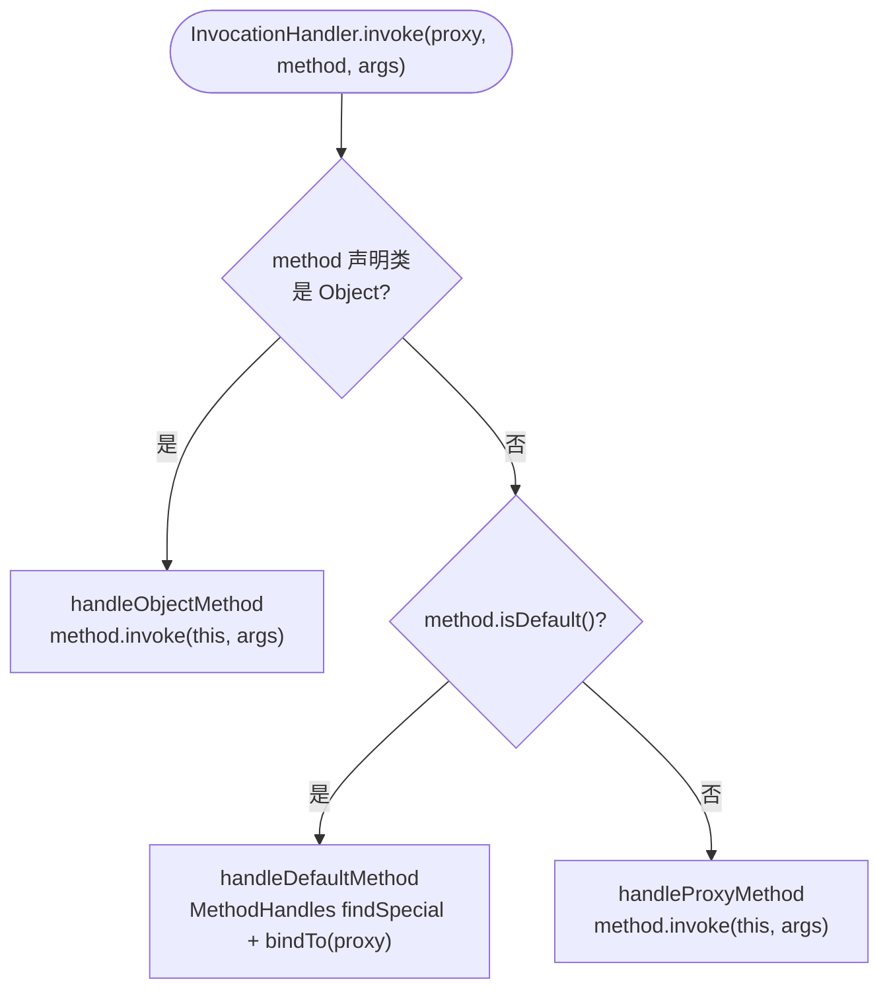

# i2f-proxy-std

> **代理标准契约层**（6 源文件约 320 行，仅依赖 i2f-invokable）：延续仓库 *-std/*-impl 契约与实现分离范式（同 i2f-tuple-std/i2f-match-std），为 JDK 动态代理、CGLIB、AspectJ 等多种代理引擎提供统一的两套代理契约——**五阶段钩子契约 `IProxyHandler`**（initContext 上下文初始化 / before 前置短路 / after 后置改写 / except 异常替换 / onFinally 完成回调）与**函数式调用契约 `IProxyInvocationHandler`**（@FunctionalInterface 三参 invoke(Object, IInvokable, Object...) + `of(IProxyHandler)` 适配工厂），配 `IProxyProvider` 提供者契约（proxy(obj, handler) 双桥接）与 `ProxyHandlerAdapter` 五阶段编排器；另含 `DefaultMethodSmartInvocationHandler`（Object 方法/default 方法/普通方法三路分派的 JDK InvocationHandler 骨架，default 方法经 MethodHandles findSpecial 特殊调用）与 `MethodHandlesUtil`（JDK8 私有构造器反射 / JDK9+ privateLookupIn 的跨版本 Lookup 兼容层）。⚠ 实测三处高危缺陷：五阶段适配器任何目标异常 → 变成无信息的 NPE（原始异常彻底丢失）、智能 handler 对抽象方法直接崩（IllegalArgumentException）、Object 方法语义颠倒（`proxy.equals(proxy)` 返回 false，详见文档）。

## 模块路径

- `i2f-jdk/i2f-proxy-std`

## 模块依赖

| 依赖 | 坐标 | scope | optional | 说明 |
| --- | --- | --- | --- | --- |
| i2f-invokable | i2f.turbo:i2f-invokable | compile（继承 i2f-jdk 版本管理） | - | 项目内部依赖：`IInvokable`（invoke(Object, Object...) throws Throwable + 默认 setAccessible）与 `Invocation`（target/invokable/args 三元载体的 @Data 实体）、`JdkMethod`（Method 的 IInvokable 包装）等；传递引入其编译期 lombok（provided + optional） |

- 无任何三方运行期依赖，纯 JDK8 实现；模块自身不声明 lombok（源码未使用任何 lombok 注解）。
- 契约层不依赖任何代理引擎（JDK Proxy/CGLIB/AspectJ），引擎实现全部位于下游（i2f-proxy 等）。

## 模块设计

### 1. 双契约分工（五阶段钩子 vs 函数式调用）

- **`IProxyHandler`（五阶段钩子契约）**：面向「环绕式 AOP 语义」的扩展点，五个方法全部为 default（空实现即 no-op 处理器，可匿名快速创建）：
  - `initContext(Invocation)`：调用前生成上下文对象（默认 null），贯穿后续全部阶段；
  - `before(context, invocation)`：前置钩子，返回**非 null** 的 `AtomicReference<Object>` 即短路——直接以 `ref.get()` 作为最终返回值，不再执行目标调用与 after（即使 `ref` 内值为 null 也短路，见瑕疵 6）；
  - `after(context, invocation, retVal)`：后置钩子，返回值替换目标调用结果（约定默认返回入参 retVal）；
  - `except(context, invocation, ex)`：异常钩子，返回值替换抛出异常（约定默认返回入参 ex）；
  - `onFinally(context, invocation, retVal, ex)`：finally 阶段回调（无论正常/异常均执行）。
- **`IProxyInvocationHandler`（函数式调用契约）**：面向「一次性拦截函数」的轻量扩展点，`@FunctionalInterface` 单抽象方法 `invoke(Object ivkObj, IInvokable invokable, Object... args) throws Throwable`，可直接用 lambda 实现；附：
  - `default invoke(Invocation)`：把三元载体拆包委托到三参形态；
  - `static of(IProxyHandler)`：五阶段处理器 → 函数式处理的适配工厂（即 `ProxyHandlerAdapter`）。
- 两套契约的关系：**薄五阶段（IProxyHandler）为强大封装、厚三参（IProxyInvocationHandler）为轻量原语**；前者经 `ProxyHandlerAdapter` 降维到后者，下游所有代理引擎统一面向 `IProxyInvocationHandler` 落地。

### 2. 契约与实现的桥接链



- `IProxyProvider`：`<T> T proxy(Object obj, IProxyInvocationHandler handler)` 为唯一抽象；`default proxy(Object obj, IProxyHandler handler)` 经 `IProxyInvocationHandler.of` 桥接——引擎实现者只需实现三参版本即自动获得五阶段能力。
- `Invocation`（来自 i2f-invokable）是契约间的通用载体：target（被代理对象）、invokable（`IInvokable` 调用抽象，JDK 场景为 `JdkMethod`）、args。

### 3. ProxyHandlerAdapter 五阶段编排



- 编排语义（实测对照 S1/S2/S3/S7/S15）：before 短路时 after 不执行、目标不调用、onFinally 仍执行；正常路径 after 的返回值即最终返回值；异常路径设计意图为 except 返回值即抛出值。
- ⚠ 异常分支存在实测高危缺陷（见瑕疵 1）：`catch (Exception e)` 中把**局部变量 `ex`（初始 null）**而非捕获的 `e` 传给 except，且 `throw ex` 无 null 防御——目标方法任何异常经此适配器后统一变成无消息 NPE，真实异常（含 JDK 反射的 InvocationTargetException 包装与 cause）彻底丢失。

### 4. DefaultMethodSmartInvocationHandler 三路分派



- **设计用途**：接口 default 方法在 JDK 动态代理下的正确调用姿势——`Method.invoke(proxy, args)` 会导致无限递归栈溢出，必须经 `MethodHandles` 的 `findSpecial`（对应 invokespecial 字节码）取得默认方法句柄后 `bindTo(proxy).invokeWithArguments(args)` 特殊调用。Runnable 化的典型场景是全 default 接口的 mixin 工具（i2f-mixins 的 `MixinProxyFactory` 以其为唯一 InvocationHandler，接口如 StringMixins 全部方法均为 default）。
- ⚠ `handleObjectMethod` / `handleProxyMethod` 的 `method.invoke(this, args)` 中 `this` 是 **handler 自身**而非代理目标（类无 target 字段），仅适用于「default 方法骨架」场景：抽象方法与 Object 方法语义均坏（见瑕疵 2、3）。
- 实测对照：有参/无参 default 方法正常（S9/S10，JDK8 Proxy 对无参方法传 args=null，`invokeWithArguments(null)` 被当作零参处理）。

### 5. MethodHandlesUtil 跨版本兼容

- **JDK8 路径**：反射获取 `MethodHandles.Lookup(Class, int)` 私有构造器并 `setAccessible(true)`，传入声明类与全权限模式（PRIVATE|PROTECTED|PACKAGE|PUBLIC）构造 Lookup（实测 S13 正常）。
- **JDK9+ 路径**：优先 `MethodHandles.privateLookupIn(declaringClass, MethodHandles.lookup())` 正常访问；若被模块强封装拒绝（抛 `java.lang.reflect.InaccessibleObjectException`，按包名前缀 `java.lang.reflect.` 判定），降级为暴力读取 `MethodHandles.Lookup.IMPL_LOOKUP` 字段再 privateLookupIn——**该降级分支要求启动参数 `--add-opens java.base/java.lang.invoke=ALL-UNNAMED`**。
- **getDefaultMethodHandle(Method)**：`lookup.findSpecial(declaringClass, name, methodType, declaringClass)` 返回绑定前句柄，调用方 `bindTo(实例).invokeWithArguments(args)`（实测 S14 正常，返回 add(1,2)=3）。

### 6. 包结构

- `i2f.proxy.std`：`IProxyHandler`、`IProxyInvocationHandler`、`IProxyProvider` 三个契约接口；
- `i2f.proxy.std.impl`：`ProxyHandlerAdapter`（五阶段适配器）、`DefaultMethodSmartInvocationHandler`（三路分派骨架）、`MethodHandlesUtil`（Lookup 兼容工具）。

## 模块目的

- **统一代理语义**：为全仓 JDK Proxy / CGLIB / AspectJ 等不同代理引擎提供同一套拦截契约（IProxyInvocationHandler 为最小公共面、IProxyHandler 为增强面），使 handler 实现可跨引擎复用（如 mybatis 的 handler 同时被 JDK 与 CGLIB 路径消费）。
- **契约与实现解耦**：契约层零引擎依赖，具体代理创建全部下沉到 i2f-proxy 等实现模块，延续仓库 std/impl 分层范式。
- **JDK8 兼容的 default 方法支撑**：以 MethodHandles 工具 + 智能 handler 补齐 JDK8 动态代理对接口 default 方法的处理空白（mixin 体系的运行基础）。

## 模块功能

- 五阶段 AOP 钩子契约（上下文/前置短路/后置改写/异常替换/finally 回调）及函数式三参调用契约；
- 五阶段 → 三参的适配编排（ProxyHandlerAdapter）；
- 代理提供者契约与双形态桥接（IProxyProvider）；
- default 方法经 MethodHandles findSpecial 的特殊调用支持（JDK8/JDK9+ 双路径）；
- Object 方法（toString/hashCode/equals）与 default 方法的分派骨架（DefaultMethodSmartInvocationHandler，⚠ 仅 default 场景可用）。

## 模块主要使用方法

### 1. 直接实现函数式契约（推荐，最轻量）

```java
IProxyInvocationHandler handler = (ivkObj, invokable, args) -> {
    long start = System.currentTimeMillis();
    try {
        return invokable.invoke(ivkObj, args);   // 显式转发真实调用
    } finally {
        System.out.println(invokable.getName() + " cost=" + (System.currentTimeMillis() - start));
    }
};
// 交给下游引擎：JdkProxyUtil.proxy(srcObj, handler) / CglibUtil.proxy(clazz, handler) /
// AspectjUtil.proxy(pjp, handler) 等
```

### 2. 使用五阶段钩子（IProxyHandler）

```java
IProxyHandler handler = new IProxyHandler() {
    @Override
    public AtomicReference<Object> before(Object ctx, Invocation inv) {
        // 非 null 返回即短路；返回 null 则继续真实调用
        return null;
    }

    @Override
    public Object after(Object ctx, Invocation inv, Object retVal) {
        return retVal;   // 可改写返回值
    }

    @Override
    public Throwable except(Object ctx, Invocation inv, Throwable ex) {
        return ex;       // 约定原样返回；⚠ 实测适配器不会把真实异常传进来（见瑕疵 1）
    }

    @Override
    public void onFinally(Object ctx, Invocation inv, Object retVal, Throwable ex) {
        // 无论正常/异常均执行
    }
};
JdkProxyUtil.proxy(srcObj, handler);   // 内部经 IProxyInvocationHandler.of 适配
```

### 3. 经 IProxyProvider 面向引擎编程

```java
IProxyProvider provider = JdkProxyProvider.INSTANCE;       // 或 CglibProxyProvider 等
Object proxy = provider.proxy(target, (IProxyInvocationHandler) (ivkObj, invokable, args) -> {
    return invokable.invoke(ivkObj, args);
});
// 或直接使用五阶段重载：provider.proxy(target, proxyHandler);
```

### 4. 全 default 接口的 mixin 代理（DefaultMethodSmartInvocationHandler）

```java
// 接口所有方法均为 default 时，default 方法不被拦截而是执行默认实现本身
DefaultMethodSmartInvocationHandler handler = new DefaultMethodSmartInvocationHandler();
Object mixin = Proxy.newProxyInstance(cl,
        new Class[]{StringMixins.class}, handler);
// 注意：接口含抽象方法时该 handler 不可用（handleProxyMethod 直接抛 IllegalArgumentException，见瑕疵 2）
```

### 注意事项

- 三参 `invoke` 的 `args` 在 JDK 动态代理无参方法场景为 **null**（JDK8 实测 P5），实现内需自行兜底；
- 经 `JdkMethod`（=反射 Method.invoke）调用时，一切目标异常（含 Error）会被 JDK8 包装为 `InvocationTargetException`（实测 P1-P4）——直接实现函数式契约做异常处理时需 `getTargetException()` 解包；
- JDK8 反射调用与 `MethodHandles` 场景建议开启 `--add-opens` 以覆盖 JDK9+ 运行（见 MethodHandlesUtil 降级说明）。

## 下游消费方一览

| 消费方 | 形态 | 说明 |
| --- | --- | --- |
| i2f-proxy | POM 直接依赖 | JDK 动态代理实现：`JdkProxyUtil`（IProxyHandler/IProxyInvocationHandler 双形态重载）、`JdkProxyProvider`/`JdkDynamicProxyProvider`（IProxyProvider 实现）、`BasicDynamicProxyHandler`（唯一 `implements IProxyHandler` 的官方五阶段抽象骨架） |
| i2f-proxy-handlers | POM 直接依赖 | `RetryProxyHandler`/`LockProxyHandler`/`ValidateProxyHandler`（i2f-proxy-handlers 的 3 个函数式 handler 实现） |
| i2f-mixins | POM 直接依赖 | `MixinProxyFactory`：以 `DefaultMethodSmartInvocationHandler` 为全局 HANDLER + ConcurrentHashMap 缓存 mixin 代理实例（全 default 接口工具族，如 StringMixins 1258 行 default 方法） |
| i2f-spring-core | POM 直接依赖 | Spring 场景 CglibUtil（IProxyHandler/IProxyInvocationHandler 双形态） |
| i2f-extension-cglib | POM 直接依赖 | `CglibProxyProvider`（IProxyProvider 实现）、`CglibUtil`、`CglibProxyInvocationHandlerAdapter`（MethodInterceptor → 三参 invoke，ivkObj 传 CGLIB 代理对象） |
| i2f-extension-mybatis | POM 直接依赖 | `MybatisPaginationProxyHandler`/`MybatisRecordSqlProxyHandler`/`MybatisResultSetMetaProxyHandler` + `MybatisInterceptorProxyInvocationHandlerAdapter` |
| i2f-extension-aspectj | 经 i2f-proxy 传递 | `AspectjUtil.proxy(pjp, handler)` 双形态 + `AspectjProxyProvider`（IProxyProvider 实现） |
| i2f-ai-std | 经 i2f-proxy 传递 | `AiServiceDynamicProxyHandler`（@AiService 接口 → AI Agent 调用，default 方法经 `MethodHandlesUtil.getDefaultMethodHandle` 直调）等 10 个文件 |
| i2f-jdk-all / 根 POM | 聚合 | i2f-jdk-all L477 聚合、根 POM L696 版本注册 |

- 消费哲学：**函数式契约（IProxyInvocationHandler）为全仓主流消费面**——mybatis/ai-std/proxy-handlers 的 handler 均为「实现三参 invoke + 按注解分发」模式；五阶段契约主要经 JdkProxyUtil/CglibUtil/AspectjUtil 的 IProxyHandler 重载与 BasicDynamicProxyHandler 骨架使用。

## 模块特性总结

- **契约/实现分离**：本模块零代理引擎依赖，纯契约 + 适配 + JDK 兼容工具；引擎能力全部下沉（i2f-proxy/CGLIB/AspectJ）。
- **双契约双形态**：五阶段钩子（IProxyHandler）与函数式三参（IProxyInvocationHandler）互补，`of()` 工厂实现降维适配；五方法全 default 使 no-op handler 可匿名创建。
- **函数式友好**：IProxyInvocationHandler 是 @FunctionalInterface，可直接 lambda；default invoke(Invocation) 提供三元载体拆包。
- **JDK8 与 JDK9+ 双兼容**：MethodHandlesUtil 静态初始化时探测 JDK 能力（私有构造器 vs privateLookupIn），default 方法调用链路面向 JDK8 语法实现。
- **通用载体设计**：Invocation（target/invokable/args）来自 i2f-invokable，天然桥接任意调用抽象（JdkMethod/JdkConstructor/AspectjInvoker 等自定义 IInvokable 可插拔）。
- **五阶段编排完备**：initContext → before(短路) → after(改写) → except(替换) → onFinally(回调)，语义覆盖环绕通知的一切要素（⚠ 异常分支实现有缺陷）。

## 可拓展方向

- 修复 ProxyHandlerAdapter 的 except 传参与 throw null 缺陷（见瑕疵 1），恢复异常替换能力。
- `DefaultMethodSmartInvocationHandler` 增加 target 字段与 `resolveHandler(target)` 子类钩子，使 handleProxyMethod 可委托真实对象（当前仅 skeleton）。
- 为 `MethodHandlesUtil` 增加 `ConcurrentHashMap<Class, Lookup>` / `Map<Method, MethodHandle>` 缓存，降低 default 方法反射开销。
- `handleObjectMethod` 按标准代理语义实现（toString 委托目标、equals 基于目标与代理身份、hashCode 与 equals 配套）。
- 提供 `IProxyInvocationHandler` 的组合工具（多个 handler 链式编排，如日志→限流→重试）。
- 为 `IProxyHandler` 补齐 before-null 语义的 Javadoc 与默认 `except` 的 null 防御。

## 模块瑕疵或错误

1. **【高危·实测】ProxyHandlerAdapter except 传错变量 + throw null：任何目标异常 → 无信息 NPE，原始异常彻底丢失**。`catch (Exception e)` 中 `ex = handler.except(context, invocation, ex)` 的第三参传的是**局部变量 ex（初始为 null）**而非捕获的 `e`；默认 except 返回入参（null）→ `throw ex` 即 `throw null` → NullPointerException。实测：RuntimeException("boom") → `NPE / msg=null / cause=null`（S4）；覆写 except 的所有实现拿到的入参恒为 null（S5 记录+原样返回 → 再 NPE；S6 返回新异常 → 抛 replaced 但依旧拿不到 boom）；AssertionError 经 JDK 反射包装（InvocationTargetException）同样落入此分支变 NPE（S8）；onFinally 的 ex 参数也恒为 null（S7 异常路径 `retVal=null / ex=null`）。根因含两处：传参应为 `e`、`throw ex` 缺少 null 防御。修复方向：`ex = handler.except(context, invocation, e); if (ex == null) { ex = e; } throw ex;`。影响面：凡经 `IProxyInvocationHandler.of()`/`JdkProxyUtil.proxy(srcObj, IProxyHandler)`/`CglibUtil`/`AspectjUtil` 的五阶段链路，异常处理与诊断能力全部失效。
2. **【高危·实测】DefaultMethodSmartInvocationHandler.handleProxyMethod 对抽象方法直接崩溃**：`method.invoke(this, args)` 的接收者是 handler 自身（类无 target 字段），`this` 不实现被代理接口 → 任意接口抽象方法调用抛 `IllegalArgumentException: object is not an instance of declaring class`（S11）。该 handler 实为「全 default 接口专用骨架」，类名 Smart 与可实例化（非 abstract）容易误导使用。
3. **【高危·实测】同 handleObjectMethod 的 Object 方法语义颠倒**：`method.invoke(this, args)` 把 handler 自身作为接收者——`proxy.toString()` 返回 `DefaultMethodSmartInvocationHandler@5fd0d5ae`、`proxy.hashCode()` 返回 handler 的 hash（S12）；最严重的是 equals 自反性破坏：**`proxy.equals(proxy)` 返回 false**（handler.equals(proxy)）、`proxy.equals(handler)` 返回 true（handler.equals(handler)）——代理对象放入 HashMap/Set 等容器时行为不可预期。
4. **【中危】except 钩子与适配器的契约断裂未被防御**：即使修复传参（瑕疵 1），默认 `except` 实现 `return ex` 在 ex 为 null 时仍会 `throw null`；接口 Javadoc 只约定"返回值应该和第三个入参 ex 一致"，未约定 null 语义，适配器又无 null 兜底。
5. **【中危】`catch (Exception e)` 无法覆盖自定义 IInvokable 直抛 Error 的场景**：JdkMethod 反射链路上 Error 被 InvocationTargetException 包装（实测 P3/P4）而"意外"进入 except；但自定义 IInvokable（非反射实现）直接抛 Error 时会穿透 catch——except 不触发、onFinally 的 ex 亦为 null，Error 不受五阶段管控。
6. **【中危】before 短路语义与直觉存在缺口**：`before` 返回非 null 的 `AtomicReference<Object>` 即短路（after 不执行、目标不调、S3 实测），且**引用非 null 但值为 null 时同样短路返回 null**（S15 实测）——"返回 null 表示不拦截"的直觉只适用于引用本身，Javadoc 未说明这两点。
7. **【低危】MethodHandlesUtil.getLookup 无缓存**：每次调用都重新反射构造 Lookup（JDK8 `newInstance`）或走 privateLookupIn（JDK9+），随后 `findSpecial`；default 方法高频调用场景（如 mixin 工具族）存在重复反射开销。
8. **【低危】JDK9+ 强封装降级路径依赖启动参数**：privateLookupIn 正常路径被模块系统拒绝后需暴力读 `IMPL_LOOKUP`，未被 `--add-opens java.base/java.lang.invoke=ALL-UNNAMED` 时抛 `RuntimeException: got MethodHandles.Lookup failure`——属环境敏感设计（comment 已说明），无 --add-opens 时 default 方法链路在 JDK9+ 上可能不可用。
9. **【低危】IProxyProvider.proxy 泛型无约束**：`<T> T proxy(Object obj, IProxyInvocationHandler handler)` 的 T 与入参无类型关联，实现端均为未经受检转换（如 `JdkProxyProvider` 的 `(T) JdkProxyUtil.proxy(...)`）——调用方错误指定 T 时堆污染延迟到使用点爆发。
10. **【低危】ProxyHandlerAdapter 构造器不校验 handler 为 null**：传入 null 时错误延迟到 invoke 首行 `handler.initContext` 才抛 NPE；`IProxyHandler` 五方法全 default（no-op 可直接匿名 new）在测试中友好，但生产误用无提示。
11. **【说明】文档与实现语义缺口**：`initContext` 生成的 context 对象在五个钩子间传递但无任何类型约束（Object），实现者需自行约定；`before` 的 Javadoc 示例语义（"返回值不为null,则表示提前返回"）与 `AtomicReference` 内值 null 的行为不一致（见瑕疵 6）。
