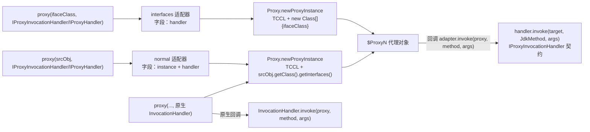
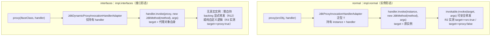
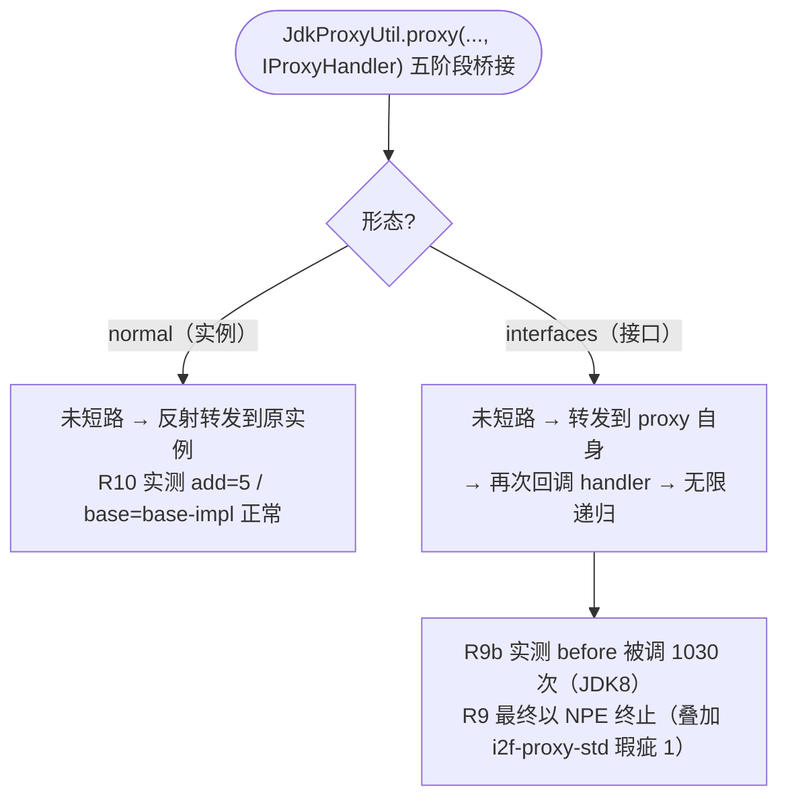

# i2f-proxy

> **JDK 动态代理实现模块**（6 源文件约 170 行，依赖 i2f-proxy-std）：把 i2f-proxy-std 的拦截契约落地到 `java.lang.reflect.Proxy`。`JdkProxyUtil` 单门面提供 6 个 proxy 重载——IProxyInvocationHandler 函数式 / IProxyHandler 五阶段 / 原生 InvocationHandler 三套契约，各自支持「实例（normal）」与「接口 Class（interfaces）」两种形态；normal 包 `JdkProxyInvocationHandlerAdapter` 持有被代理实例（handler 收到的 target 为**原实例**，可直接转发），interfaces 包 `JdkDynamicProxyInvocationHandlerAdapter` 无实例（target 为**代理对象自身**）；`JdkProxyProvider`/`JdkDynamicProxyProvider` 两个 IProxyProvider 实现（INSTANCE 单例）；`BasicDynamicProxyHandler` 把五阶段 before 解包为 `resolve(context, ivkObj, method, args)` 抽象骨架。被 ai-std / http-proxy / jdbc-proxy / extension-aspectj / xproc4j-starter 五处消费。⚠ 实测要点：**interfaces 形态 + 五阶段未短路会无限递归**（before 被调 1030 次后以 NPE 终止）；**泛型 T 陷阱**（代理赋给实现类类型立即 CCE）；default 与 Object 方法全部回调 handler，语义需自行处理（详见文档）。

## 模块路径

- `i2f-jdk/i2f-proxy`

## 模块依赖

| 依赖 | 坐标 | scope | optional | 说明 |
| --- | --- | --- | --- | --- |
| i2f-proxy-std | i2f.turbo:i2f-proxy-std | compile（继承 i2f-jdk 版本管理） | - | 项目内部依赖：`IProxyHandler`（五阶段钩子）/`IProxyInvocationHandler`（函数式三参 + `of()` 工厂）/`IProxyProvider` 三契约与 `ProxyHandlerAdapter` 五阶段编排器；传递引入 i2f-invokable（`JdkMethod`/`IInvokable`/`Invocation` 通用载体，本模块适配器每次调用现场构造 `JdkMethod`） |

- 无三方运行期依赖，纯 JDK（java.lang.reflect.Proxy / InvocationHandler / Method）；模块自身不声明 lombok。
- 引擎与契约的边界：本模块是 i2f-proxy-std 契约的 **JDK 引擎实现**（CGLIB 实现在 i2f-extension-cglib、AspectJ 桥接在 i2f-extension-aspectj）。

## 模块设计

### 1. JdkProxyUtil 六重载门面（三契约 × 双形态）

| 重载 | 形态 | 链路 | 说明 |
| --- | --- | --- | --- |
| `proxy(T srcObj, IProxyInvocationHandler)` | normal | `JdkProxyInvocationHandlerAdapter(srcObj, handler)` → `proxy(srcObj, InvocationHandler)` | 以实例出发，handler 收到的 ivkObj 为**原实例** |
| `proxy(Class<T> interfaces, IProxyInvocationHandler)` | interfaces | `JdkDynamicProxyInvocationHandlerAdapter(handler)` → `proxy(interfaces, InvocationHandler)` | 以接口 Class 出发，handler 收到的 ivkObj 为**代理对象自身** |
| `proxy(T srcObj, IProxyHandler)` | normal | `IProxyInvocationHandler.of(handler)` 桥接后同上 | 五阶段契约入口（转发默认行为依赖 normal 的 target 语义，见 3 节） |
| `proxy(Class<T> interfaces, IProxyHandler)` | interfaces | 同上桥接 | 五阶段 + 接口形态（⚠ 未短路即递归） |
| `proxy(T srcObj, InvocationHandler)` | 底层 | `srcObj.getClass().getInterfaces()` + TCCL `newProxyInstance` | 原生 InvocationHandler 直通；提取直接接口全集 |
| `proxy(Class<T> clazz, InvocationHandler)` | 底层 | `new Class[]{clazz}` + TCCL `newProxyInstance` | 原生直通；仅单接口 |



- 所有生成均使用**线程上下文类加载器**，返回值为未受检泛型 `(T)`（见瑕疵 3/9）；每次调用生成新的代理实例（代理类的 Class 由 JDK 内部缓存）。

### 2. 双形态适配器与 target 语义（核心差异）



- 两适配器的 `invoke` 均为 `final public`（封闭不可覆写），且每次调用现场构造 `new JdkMethod(method)`（无缓存）。
- 该 target 语义差异是下游 handler 的直接依赖面：AiServices/RestClientProvider/ProxySqlExecuteGenerator 等 interfaces 形态消费方均采用「纯函数式 handler 自行实现逻辑」（不回转发 target），而 AspectjUtil 采用 normal 形态（见消费方一览）。

### 3. 五阶段在双形态下的行为分叉（组合陷阱）

ProxyHandlerAdapter（i2f-proxy-std）的未短路路径执行 `invocation.getInvokable().invoke(invocation.getTarget(), invocation.getArgs())`，于是同一段五阶段代码在两种形态下行为完全不同：



- **interfaces 形态 + 五阶段是组合禁区**：handler 必须对所有路径短路（before 返回非 null），或改用纯函数式 IProxyInvocationHandler——这正是全部下游消费方选择「三参函数式直通」的原因。
- normal 形态的五阶段完全可用：BasicDynamicProxyHandler 短路由 before 生效（R10 echo=short:z）、未短路路径反射转发原实例（R10 add=5 / base=base-impl）。
- 递归终止形式为 NPE，是「无限递归 + i2f-proxy-std 瑕疵 1（except 传错变量 + throw null）」叠加的产物——递归中的异常链每一层都被 `throw null` 转成无信息 NPE。

### 4. default 方法与 Object 方法路由（实测）

- JDK Proxy 生成类覆写接口的**全部方法**（含 default）与 Object 方法，统一回调 InvocationHandler——R5 实测 handler 依次收到 `[greet][toString][hashCode][equals]`，default `greet()` 返回 handler 的 `handled:greet`（而非 default 实现 `default-greet`）。
- 后果：handler 必须自行处理 Object 方法语义——代理类对返回值做强制类型转换，`hashCode` 返回非 int / `equals` 返回非 boolean 会 CCE、返回 null 直接 NPE；default 方法若想执行默认实现，需 MethodHandles findSpecial 直调（i2f-proxy-std 的 `MethodHandlesUtil.getDefaultMethodHandle`），直接 `invokable.invoke(proxy, args)` 会再次进入 handler 导致递归。
- normal 形态下转发 default 方法安全（target 为原实例，由实例类实现或接口默认实现兜底）。

### 5. 接口提取与空接口边界（实测）

- `proxy(T srcObj, ...)` 提取 `srcObj.getClass().getInterfaces()`（仅直接接口），Proxy 引擎自动解析接口树：`CalcImpl implements Calc(extends Base), Extra` 实测代理 `instanceof Calc/Extra/Base` 全 true、生成类 interfaces=[Calc,Extra]（R7）。
- **无接口实例可静默创建「无接口代理」**（R4，JDK8 实测）：`interfaces=0` 创建成功（`com.sun.proxy.$Proxy2`），Object 方法回调 handler（toString=p4-handled），但无法当原类型使用（赋回原类型 CCE）——产出「只能当 Object 用」的代理（见瑕疵 6）。
- interfaces 形态的单 Class 重载只生成 `new Class[]{clazz}` 单接口代理——多接口组合需自行使用原生 `Proxy.newProxyInstance`。

### 6. BasicDynamicProxyHandler 五阶段解包骨架

- `before(context, invocation)` 中把 `invocation.getInvokable()` 强转 `JdkMethod`、取 `getMethod()`，连同 `context/target/args` 打包为抽象方法 `resolve(context, ivkObj, method, args)`——子类只需实现 resolve（返回非 null `AtomicReference` 即短路，R10 实测）。
- 全仓无消费方（示范骨架，见瑕疵 11）；强转 JdkMethod 使其仅适用于 JDK 引擎。

### 7. 包结构

- `i2f.proxy`：`JdkProxyUtil`（门面）；
- `i2f.proxy.impl.normal`：`JdkProxyInvocationHandlerAdapter`（实例适配器）、`JdkProxyProvider`（IProxyProvider 实现，INSTANCE 单例）；
- `i2f.proxy.impl.interfaces`：`JdkDynamicProxyInvocationHandlerAdapter`（接口适配器）、`JdkDynamicProxyProvider`（IProxyProvider 实现，INSTANCE 单例）、`BasicDynamicProxyHandler`（五阶段解包骨架）。

## 模块目的

- **契约落地 JDK 引擎**：将 i2f-proxy-std 的双契约（IProxyHandler/IProxyInvocationHandler）在 JDK 原生反射代理上完整实现，零三方依赖。
- **双形态适配**：分别服务「有真实实例可转发」（normal）与「仅接口定义、handler 全自定义」（interfaces）两类代理需求；后者是声明式接口工具（REST Client / AI Service / DAO Mapper）的基础设施。
- **Provider 标准化接入**：以 IProxyProvider 实现（JdkProxyProvider/JdkDynamicProxyProvider）支持「面向引擎编程」，与 CGLIB/AspectJ Provider 同构。

## 模块功能

- 三契约 × 双形态的 JDK 动态代理创建（JdkProxyUtil 六重载）；
- IProxyInvocationHandler / IProxyHandler → JDK InvocationHandler 的适配（两适配器）；
- IProxyProvider 的 JDK 实现（normal / dynamic 双 Provider，INSTANCE 单例）；
- 五阶段 before → resolve 的解包骨架（BasicDynamicProxyHandler）；
- 接口树自动收集、上下文类加载器代理类生成、原生 InvocationHandler 直通。

## 模块主要使用方法

### 1. 实例代理（normal，可直接转发）

```java
Calc src = new CalcImpl();
Calc proxy = JdkProxyUtil.proxy(src, (IProxyInvocationHandler) (ivkObj, invokable, args) ->
        invokable.invoke(ivkObj, args));   // ivkObj 即原实例，可安全转发（R1 实测）
proxy.add(1, 2);   // 3
```

### 2. 接口代理（interfaces，handler 自定义逻辑）

```java
// 声明式接口工具模式（AiServices / RestClientProvider 同款）：
// target=proxy 自身，handler 不转发，完全自行实现响应逻辑
MyApi api = JdkProxyUtil.proxy(MyApi.class, handler);

// 若确有 backing 对象，可自持并显式转发（R12 实测模式）：
Calc backing = new CalcImpl();
Calc proxy = JdkProxyUtil.proxy(Calc.class,
        (IProxyInvocationHandler) (p, invk, a) -> ((JdkMethod) invk).invoke(backing, a));
```

### 3. 五阶段处理器（仅 normal 形态）

```java
Calc proxy = JdkProxyUtil.proxy((Calc) new CalcImpl(), new BasicDynamicProxyHandler() {
    @Override
    public AtomicReference<Object> resolve(Object context, Object ivkObj, Method method, Object... args) {
        if ("echo".equals(method.getName())) {
            return new AtomicReference<>("short:" + args[0]);   // 非 null 即短路
        }
        return null;   // 未短路 → 反射转发原实例（normal 形态安全）
    }
});
```

⚠ interfaces 形态切勿使用「未短路转发」的五阶段（无限递归，见设计 3 节）。

### 4. Provider 面向引擎编程

```java
IProxyProvider provider = JdkProxyProvider.INSTANCE;            // 实例形态（obj 传实例）
// IProxyProvider provider = JdkDynamicProxyProvider.INSTANCE;  // 接口形态（obj 传接口 Class）
Object proxy = provider.proxy(target, (IProxyInvocationHandler) (ivkObj, invokable, args) -> ...);
```

### 5. 原生 InvocationHandler 直通

```java
Calc proxy = JdkProxyUtil.proxy(src, (InvocationHandler) (p, m, a) -> m.invoke(new CalcImpl(), a));   // R16 实测
```

### 注意事项

- **lambda 必须显式转型**：`(p, m, a) -> ...` 同时匹配 `InvocationHandler` 与 `IProxyInvocationHandler` 两个三参函数式参数，编译歧义——需 `(IProxyInvocationHandler) (…) -> …` 或 `(InvocationHandler) (…) -> …`（AspectjUtil 正因此如此书写）。
- **返回值必须用接口类型接收**：T 从实例实参推断为实现类时会插入到实现类的 checkcast，代理对象不是其子类 → CCE（R6）；应声明为接口类型变量，或 `JdkProxyUtil.<Ifc>proxy(...)` 显式指定（见瑕疵 3）。
- **args 在无参方法时为 null**（JDK Proxy 规范，i2f-proxy-std 文档 P5 实测），handler 内需兜底。
- **Object 方法与 default 方法都会回调 handler**（R5），且代理类对返回值做类型强转——务必按方法名处理 `hashCode/equals/toString`。
- **代理类加载器为线程上下文类加载器**：跨容器/模块化环境使用时注意 TCCL 与接口类加载器的一致性。
- 代理类名是 JDK 实现细节（JDK8 `com.sun.proxy.$ProxyN` / JDK9+ `jdk.proxyN.$ProxyN`，双版本实测对照），不可依赖。

## 下游消费方一览

| 消费方 | 形态 | 说明 |
| --- | --- | --- |
| i2f-ai-std | POM 直接依赖 | `AiServices.create(type, handler)` → `JdkProxyUtil.proxy(type, handler)`（interfaces）+ `AiServiceDynamicProxyHandler implements IProxyInvocationHandler`（@AiService 声明式接口动态代理） |
| i2f-http-proxy | POM 直接依赖 | `RestClientProvider.getClient(interfaces, handler)` → `proxy(interfaces, handler)`（interfaces）+ `RestClientProxyHandler`（REST 声明式客户端） |
| i2f-jdbc-proxy | POM 直接依赖 | `ProxySqlExecuteGenerator.proxy(clazz, sqlHandler)` → `proxy(clazz, handler)`（interfaces）+ `ProxyRenderSqlHandler`（DAO 接口 → 动态 SQL 执行） |
| i2f-extension-aspectj | POM 直接依赖 | `AspectjUtil.proxy(pjp, handler)`——normal 形态（pjp 声明类型为 ProceedingJoinPoint 接口），lambda 内对 `proceed` 特判走 aop，其余 `invokable.invoke(ivkObj, args)` 转发（normal target=原 pjp） |
| i2f-springboot-xproc4j-starter | 经传递依赖 | `SpringJdbcProcedureProxyMapperFactoryBean` → `proxy(mapperClass, handler)`（interfaces）；传递链：i2f-extension-xproc4j → i2f-jdbc-procedure → i2f-jdbc-proxy-xml → i2f-jdbc-proxy |
| i2f-jdk-all / 根 POM | 聚合 | i2f-jdk-all L469 聚合、根 POM L686 版本注册 |

- 消费哲学：**全部消费方都走「三参函数式 IProxyInvocationHandler」通道**（interfaces 形态为主、AspectjUtil 为 normal）；五阶段能力无外部消费（仅框架内桥接）；`JdkProxyProvider`/`JdkDynamicProxyProvider`/`BasicDynamicProxyHandler` 全仓暂无消费方（面向 IProxyProvider 编程的备用实现与示范骨架）。

## 模块特性总结

- **零三方依赖**：仅 JDK 反射代理 + 项目内 i2f-proxy-std/i2f-invokable；
- **三契约 × 双形态矩阵**：6 重载覆盖函数式 / 五阶段 / 原生三种 handler 契约与实例 / 接口两种入口；
- **target 语义显式二分**：normal=原实例（可转发）、interfaces=代理自身（全自定义）——下游按需选择；
- **函数式友好**：主推 lambda 三参实现，适配器 final invoke 封闭；
- **原生逃生舱**：InvocationHandler 直通重载允许绕过标准契约直接使用 JDK 原生能力；
- **无缓存设计**：每次 proxy 调用生成新代理实例（代理类 Class 由 JDK 内部缓存），实例级复用交由下游（如 MixinProxyFactory 的 ConcurrentHashMap）。

## 可拓展方向

- 规避与 i2f-proxy-std 的组合缺陷：interfaces 形态增加递归/形态自检，或为五阶段转发加显式文档级禁用；
- `proxy(Class<T>, ...)` 增加可变接口重载（`Class<?>... interfaces`）支持多接口组合；
- 适配器增加 `JdkMethod` 缓存（ConcurrentHashMap<Method, JdkMethod>）降低每调用对象创建开销；
- Provider 以 SPI（META-INF/services）注册 INSTANCE，或提供工厂自动发现；
- `proxy(T srcObj, ...)` 增加接口白名单/黑名单过滤（当前提取全部直接接口）；
- 为 lambda 歧义提供命名静态工厂替代（如 `functional(...)` / `raw(...)`）并在门面收敛文档说明。

## 模块瑕疵或错误

1. **【高危·实测】interfaces 形态 + 五阶段未短路 = 无限递归**：interfaces 适配器传给 handler 的 target 是代理对象自身，ProxyHandlerAdapter 未短路路径反射转发 `invocation.getTarget()` 即再次回调 handler——R9b 实测 before 被调用 **1030 次**（JDK8，栈耗尽后终止），R9 最终以 NPE 呈现（递归异常链被 i2f-proxy-std 瑕疵 1 的 `throw null` 逐层转换为 NPE）。唯一安全用法：interfaces 形态对所有路径短路，或改用纯函数式 IProxyInvocationHandler。
2. **【高危·实测】五阶段异常链缺陷在 JdkProxyUtil 通道全量复现**：normal 形态目标方法抛异常 → `NPE / msg=null / cause=null`（R14）；覆写 except 的入参恒为 null（R15，except called=true / saw=null）——即 i2f-proxy-std 瑕疵 1（except 传错变量 + throw null）经 `JdkProxyUtil.proxy(srcObj, IProxyHandler) → of() → ProxyHandlerAdapter` 链路的直接表现，原始异常（含 InvocationTargetException 包装与 cause）彻底丢失。
3. **【中危·实测】泛型 T 陷阱：代理赋给实现类类型立即 CCE**：`proxy(T srcObj, …)` 的 T 随实例实参推断为实现类，调用点插入到实现类的 checkcast——R6 实测 `com.sun.proxy.$Proxy0 cannot be cast to repro.Reproduce$CalcImpl`。必须用接口类型变量接收或显式 `<T>` 指定；把 `new XxxImpl()` 内联传入时极易踩坑（AspectjUtil 因 pjp 声明为接口类型而幸免）。
4. **【中危·实测】Object 方法全量回调且返回值被强制类型转换**：handler 收到 toString/hashCode/equals（R5），代理类对结果做 int/boolean 强转——通用型 handler 若对未识别方法返回 null 或业务值，将抛 NPE/CCE；equals 自反性等语义完全由 handler 负责（对照 i2f-proxy-std 的 DefaultMethodSmartInvocationHandler 同类缺陷）。
5. **【中危·实测】default 方法被回调而非执行默认实现**：R5 实测 `greet()` → `handled:greet`（handler 拦截）；如需默认实现须经 MethodHandles findSpecial 直调（i2f-proxy-std 的 MethodHandlesUtil），直接 `invokable.invoke(proxy, args)` 会进入递归。
6. **【中危·实测】无接口实例静默产出「无接口代理」**：R4 实测 `interfaces=0` 不抛异常创建成功（`com.sun.proxy.$Proxy2`），返回对象无法当原类型使用（赋回原类型 CCE），只能按 Object 使用且全回调 handler——建议使用方自行做「无接口快速失败」防御。
7. **【中危】双三参函数式重载造成 lambda 歧义**：`proxy(target, (p, m, a) -> …)` 无法直接编译（InvocationHandler 与 IProxyInvocationHandler 竞争），所有调用点被迫显式 cast——API 面同时暴露两个三参函数式契约的代价（见可拓展方向）。
8. **【中危】interfaces 形态无 target 注入**：`invocation.getTarget()` 拿到的是代理自身，handler 若误按「目标对象」使用（如对 target 反射转发）不会立即报错，而是静默递归或行为异常；框架层面对「实例/接口」两种入参无类型防护（obj 与 Class 同为 Object/泛型）。
9. **【低危】代理类加载器固定为 TCCL + 仅提取直接接口**：`proxy(T srcObj, …)` 在容器/插件化环境（TCCL ≠ 接口的类加载器）可能抛 ClassCastException/IllegalArgumentException；`proxy(Class<T>, …)` 仅支持单接口，多接口组合无门面支持。
10. **【低危】两个 Provider 的 Object 参数无类型防护**：`JdkProxyProvider.proxy(obj,…)` 期望实例、`JdkDynamicProxyProvider.proxy(obj,…)` 期望接口 Class，签名同为 Object——误传（如把实例传给 dynamic 版）仅在运行期以未受检强转/代理数组元素错误等难定位异常暴露。
11. **【低危】BasicDynamicProxyHandler 仅限 JDK 引擎且全仓无消费**：`(JdkMethod) invocation.getInvokable()` 强转使跨引擎（CGLIB/AspectJ）复用同一 handler 时 CCE；作为「官方骨架」无任何使用示例可循。
12. **【说明】适配器与实现的细节约束**：两适配器 invoke 为 final public（不可扩展）、instance/handler 字段未 final（仅构造赋值）、JdkMethod 每次调用现场创建无缓存；代理类名与异常消息随 JDK 版本变化（实测对照：JDK8 `com.sun.proxy.$ProxyN` / JDK9+ `jdk.proxyN.$ProxyN`；NPE 帮助消息仅 JDK14+ 出现），不要依赖类名/消息格式做逻辑判断。
