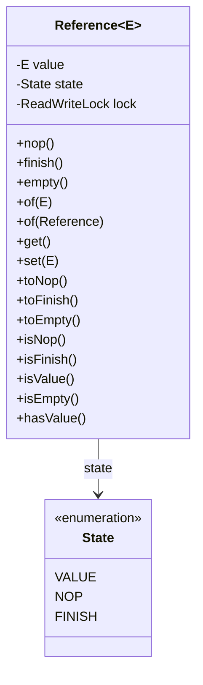
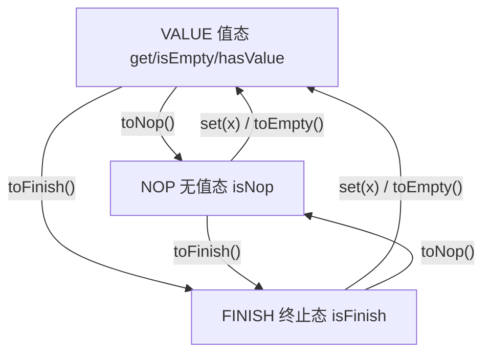

# i2f-reference

> **值的三态引用包装模块**：全模块仅 1 个类 `Reference<E>`（`i2f.reference` 单包，183 行，含内嵌 `State` 枚举），用「VALUE 有值 / NOP 无值跳过 / FINISH 终止」三态显式刻画 JDK `null` 无法区分的「有值 / 值为 null / 没有值 / 数据流已结束」四种语义；`nop()`/`finish()`/`empty()`/`of(x)` 四静态工厂 + `get`/`set`/`of(Reference)`/`isXxx`/`toXxx` 共 11 个实例方法全部收敛到单一「value + state」状态机，由内置 `ReentrantReadWriteLock` 保证读写安全。被 `i2f-iterator`（元素读取三态协议）与 `i2f-container`（RingQueue 队列槽位）直接依赖，并沿「`i2f-text` 文本主干」与「`i2f-match` 匹配主干」传递至 `i2f-jdbc-impl`/`i2f-jdbc-procedure`/`i2f-jdbc-proxy`/`i2f-extension-antlr4`/`i2f-extension-xproc4j`/`i2f-ai-rest-openai` 等 9 模块 19 个源文件消费（可空值缓存、扩展点短路、SSE 流终止信号）。**pom 零 Maven 依赖**（连 lombok 都未声明），纯 JDK 实现——全仓依赖最纯粹的模块之一。

## 模块路径

- `i2f-jdk/i2f-reference`

## 模块依赖

| 依赖 | 坐标 | Scope | 说明 |
| --- | --- | --- | --- |
| （无） | — | — | `pom.xml` **未声明任何依赖**——零 i2f 内部依赖、零三方运行期依赖 |

- **纯 JDK 实现**：全部代码只用到 `java.util.Objects` 与 `java.util.concurrent.locks.ReadWriteLock`/`ReentrantReadWriteLock`。
- 父 POM 为 `i2f.turbo:i2f-jdk:1.0-jdk8`；`build` 声明 `maven-assembly-plugin`（继承根 POM `pluginManagement` 中 `jar-with-dependencies` 配置，`package` 阶段执行 `single` 目标）——对零依赖模块将产出与普通 jar 等价的 fat-jar，属项目打包惯例。
- 与多数模块不同，pom 连惯例性声明的 `lombok` 都没有（本模块也确无 lombok 用法），是真正意义上的「零依赖」。
- 源码结构（单包单类）：

```text
i2f-jdk/i2f-reference
└── src/main/java/i2f/reference/Reference.java
```

## 模块设计

全模块只有一条状态机轴线：「状态 `state` × 值 `value`」二维组合；四个静态工厂、三个构造器、六个读方法、五个写方法全部围绕它展开。

### 1. `Reference<E>`：单一状态机类



- **`state`**：三态枚举，决定「这个引用处于什么性质」；**`value`**：真正承载的值，可为 null；两者是唯一的数据字段（外加每实例一个读写锁 `lock`）。
- **静态工厂 4 个**：`nop()`（无值）、`finish()`（终止）、`empty()`（值态空值）、`of(value)`（值态有值）。
- **构造器 3 个**：`(value)` 默认 VALUE；`(value, state)` 指定状态；`(value, state, lock)` 额外注入自定义读写锁。
- **实例方法 11 个**：读 `get`/`isNop`/`isFinish`/`isValue`/`isEmpty`/`hasValue`，写 `set`/`of(Reference)`/`toNop`/`toFinish`/`toEmpty`。

### 2. 三态与四义

类注释点明设计目标：「提供一个值的性质的包装，以用于表示没有值 nop、终止 finish、值为 null、有值的区分」。即用 3 个状态组合出 4 种语义，其中后两种同属 VALUE 态、以 `value` 是否为 null 区分：

| 语义 | 构造入口 | state | value | 判定方法 | `get()` |
| --- | --- | --- | --- | --- | --- |
| 有值 | `of(x≠null)` | VALUE | x | `isValue()`/`hasValue()` | 正常返回 |
| 值为 null | `of(null)`、`empty()`、`new Reference<>(null)` | VALUE | null | `isValue()`/`isEmpty()` | 返回 null |
| 没有值（跳过/不适用） | `nop()` | NOP | null | `isNop()` | 抛 `IllegalStateException` |
| 终止（流结束） | `finish()` | FINISH | null | `isFinish()` | 抛 `IllegalStateException` |

- 判定关系：`isValue()` ⊇ (`isEmpty()` ∪ `hasValue()`)，二者互斥且穷尽 VALUE 态；NOP/FINISH 不属于任何一者。
- `isEmpty()` 的语义是「是值态、但值为 null」，**不等于**「没有值」——「没有值」要用 `isNop()`。

与 JDK 现有载体的对照（这就是本类存在的理由）：

| 载体 | 可装 null | 区分「值为 null / 没有值」 | 表达「跳过 / 终止」 |
| --- | --- | --- | --- |
| `null` | 是 | 否 | 否 |
| `java.util.Optional` | 否（禁止 null） | 否 | 否 |
| `java.util.concurrent.atomic.AtomicReference` | 是 | 否 | 否 |
| `Reference` | 是 | 是（VALUE+null vs NOP） | 是（NOP/FINISH） |

### 3. 状态迁移



- 三态之间**任意两态均可互迁**（`toNop`/`toFinish`/`toEmpty` 可跨态直达；`set(x)` 等价于「置值并回到 VALUE」）。
- 唯一的拷贝入口：实例方法 `of(Reference<E> ref)` 把源引用的 `value + state` 原样拷入当前对象，可落在三态中的任意一个。
- 三个 `toXxx` 都会先清空 `value`（置 null），再设置目标状态。

### 4. 读写锁与线程安全边界

- 每个实例默认持有一个 `ReentrantReadWriteLock`（第 3 构造器可注入共享/自定义锁）；`get`/`set`/`of(Reference)`/`isXxx`/`toXxx` 全部在锁内执行。
- `isEmpty()`/`hasValue()` 在自身读锁内再调 `isValue()`——形成读锁重入，依赖 `ReentrantReadWriteLock` 的可重入语义。
- 锁只保护单个实例自身的读写；`equals`/`hashCode`/`toString` 是仅有的三个未加锁出口（`value`/`state` 均非 volatile）。

### 5. equals 语义与包结构

- `equals`：`getClass()` 精确匹配 + `value` 与 `state` 均相等；`hashCode` = `Objects.hash(value, state)`；`toString` 输出 `Reference{value=..., state=...}`。
- 由此：`Reference.of(null)` 与 `Reference.empty()` 相等；`nop()` 与 `finish()` 互不相等；**状态参与相等性**（同为 null 值，nop 与 empty 不相等）。

| 包 | 类型 | 职责 |
| --- | --- | --- |
| `i2f.reference` | `Reference<E>`（含内嵌 `State`） | 三态值包装全部能力（工厂/访问器/状态迁移/Object 语义） |

## 模块目的

- **补齐 null 的语义盲区**：单个 `null` 无法同时表达「没有值」「值为 null」「流结束」「跳过」四种意图，`Reference` 用显式状态把这四种语义带进方法签名与返回值。
- **统一流式协议的元素信号**：迭代器/SSE 等「逐元素产出」场景，用一个返回类型同时承载「有值 / 跳过继续 / 到此为止」三类信号（`i2f-iterator` 的 `ResourceIterator` 即以此定义元素读取钩子）。
- **可空值的缓存包装**：作为 Map/Cache 的值类型，使「未缓存」（get 返回 null）与「已缓存但结果是 null」（`of(null)`）在类型上可区分（`i2f-jdbc-proxy` 的 relTypes 缓存）。
- **扩展点的短路协议**：`nop()` 表示「无意见、继续默认逻辑」，返回值态表示「短路、直接采用」，让钩子方法在不引入异常/特殊返回值的情况下表达"是否接管"（antlr4 脚本解析器与 jdbc-procedure 的 before 钩子）。

## 模块功能

| 类型 | 成员 | 说明 |
| --- | --- | --- |
| 静态工厂 | `nop()` | 构造 NOP 无值态（跳过/不适用信号） |
| | `finish()` | 构造 FINISH 终止态（数据流结束信号） |
| | `empty()` | 构造 VALUE 值态、值为 null（与 `of(null)` 等价） |
| | `of(E value)` | 构造 VALUE 值态并携带值（value 可为 null） |
| 构造器 | `Reference(E)` / `(E, State)` / `(E, State, ReadWriteLock)` | 默认 VALUE；可指定状态；可注入自定义读写锁 |
| 读方法 | `get()` | 读锁内取值；**非 VALUE 态抛 `IllegalStateException`** |
| | `isValue()` / `isNop()` / `isFinish()` | 三态判定（互斥） |
| | `isEmpty()` / `hasValue()` | VALUE 态子判定：值为 null / 值非 null |
| 写方法 | `set(E)` | 写锁内置值并回到 VALUE 态 |
| | `of(Reference<E>)` | 写锁内拷贝源引用的 value+state（源为 null 则 NPE） |
| | `toNop()` / `toFinish()` / `toEmpty()` | 清空值并迁移到 NOP / FINISH / VALUE(null) |
| Object | `equals` / `hashCode` / `toString` | 按 value+state；不加锁读取 |

## 模块主要使用方法

**1）四态构造与判定**

```java
Reference<String> nop = Reference.nop();         // 没有值：跳过/不适用
Reference<String> fin = Reference.finish();      // 终止：数据流结束
Reference<String> empty = Reference.empty();     // 值态：值为 null
Reference<String> some = Reference.of("data");   // 值态：有值

nop.isNop();        // true
fin.isFinish();     // true
empty.isEmpty();    // true（isValue() 且 value == null）
some.hasValue();    // true
some.get();         // "data"
nop.get();          // 抛 IllegalStateException: current state is [NOP], not readable.
```

**2）流式元素协议：一个返回值承载「有值/跳过/结束」**

```java
// 数据源侧：逐元素产出三态（i2f-iterator 的 ResourceIterator 元素钩子即此约定）
public Reference<String> readLine() throws IOException {
    String line = reader.readLine();
    if (line == null) {
        return Reference.finish();          // EOF -> 终止信号
    }
    if (line.isEmpty()) {
        return Reference.nop();             // 空行 -> 跳过信号
    }
    return Reference.of(line);              // 有值（值本身也可为 null）
}

// 消费侧：先看状态，再取值
Reference<String> ref = readLine();
if (ref.isFinish()) {
    // 流结束，收尾/释放资源
} else if (ref.isNop()) {
    // 跳过，继续下一轮
} else if (ref.isValue()) {
    String v = ref.get();                   // 注意用 isValue(): 值可能是 null
}
```

**3）可空值缓存：区分「未缓存」与「缓存了 null」**

```java
LruMap<String, Reference<Type[]>> cache = new LruMap<>(2048);

Reference<Type[]> ref = cache.get(key);
if (ref != null) {
    relTypes = ref.get();        // 命中：这里可能得到 null（已缓存的“null 结果”）
} else {
    relTypes = compute(key);     // 未命中：回源计算
    cache.put(key, Reference.of(relTypes));  // of(null) 同样登记为“已缓存”
}
```

**4）扩展点短路：nop 表示「不接管」，值态表示「短路返回」**

```java
// 扩展点默认实现：不表态，继续默认逻辑
public Reference<?> beforeInvokeInstanceMethod(...) {
    return Reference.nop();
}

// 框架消费侧：值态才短路
Reference<?> ref = beforeInvokeInstanceMethod(...);
if (ref != null && ref.isValue()) {
    return ref.get();            // 短路：直接作为调用结果
}
// ... 否则继续默认逻辑
```

**注意事项：**

- `get()` 仅在 VALUE 态可用，NOP/FINISH 态会抛 `IllegalStateException`——调用前须以 `isValue()`（或 `hasValue()`）开路。
- 区分两种判定：`isValue()` 表示「值语义成立」（值可为 null），`hasValue()` 表示「值非 null」；只要判「有没有可用值」用 `hasValue()`，要区分「值为 null 也算结果」用 `isValue()`。
- `ref.of(otherRef)` 是**实例拷贝方法**（把 otherRef 的 value+state 拷入 ref），不是静态工厂；静态工厂是 `Reference.of(x)`，二者同名不同语义，阅读时注意接收者。
- `equals` 含 `state`：`Reference.of(null).equals(Reference.empty())` 为 true，但它们与 `nop()`/`finish()` 均不相等。
- 每个实例持有一个 `ReentrantReadWriteLock`——高频创建场景（逐元素包装）注意开销；框架内可对确定不共享的引用复用 `set`/`toXxx` 迁移代替 new。
- 本类与 `java.util.concurrent.atomic.AtomicReference` 无继承/适配关系，仅名称相近；也**未实现 `Serializable`**，不能直接用于序列化缓存或跨进程传递。

## 下游消费方一览

| 消费方 | 依赖关系 | 使用方式 |
| --- | --- | --- |
| `i2f-iterator` | 直接（POM 声明） | **元素读取三态协议**：`ResourceIterator` 的元素读取钩子签名 `ExFunction<RESOURCE, Reference<E>>`，约定 `of(x)` 有值 / `nop()` 跳过继续读 / `finish()` 终止；`hasNext()` 以 `ref.isValue()` 判缓存、`next()` 取 `ref.get()` 后 `toNop()` 消费；`FileLineIterator`/`ReaderLineIterator` 用 `readLine()==null → Reference.finish()` 表达 EOF；`PredicateIterator` 同构三态状态机（该消费方自身另有已记录的高危缺陷，详见 i2f-iterator 文档） |
| `i2f-container` | 直接（POM 声明） | **队列槽位包装**：`RingQueue` 以 `Reference<E>[]` 数组作环形槽位——`enqueue` 用 `Reference.of(val)` 入队、出队用 `ret.get()` 取值；`dequeueIf()`/`head()`/`tail()` 在空队列时返回 `Reference.nop()` 而非 null，调用方以 `isValue()`/`isNop()` 判定；测试类直接打印 head/tail 的 `Reference` 三态 |
| `i2f-jdbc-impl` | 传递（经 `i2f-match → i2f-iterator`） | `JdbcResultObjectExtractor.extract` 接口返回 `Reference<Object>`：`nop()` = 本抽取器不适用、`of(rs.getBytes(...))` = 抽取结果；`JdbcResolver` 解析结果集逐列 `ref.isValue()` 后才取值 |
| `i2f-jdbc-proxy` | 传递（经 `i2f-jdbc-impl`/`i2f-match`） | `ProxyRenderSqlHandler` 以 `LruMap<String, Reference<Type[]>>` 缓存泛型 relTypes——`Reference.of(relTypes)` 使「已计算但值为 null」与「未缓存」（map 返回 null）在类型上可区分 |
| `i2f-jdbc-procedure` | 传递（经 `i2f-jdbc-impl`） | ① `JdbcProcedureExecutor` 接口内嵌 `nop()`/`isNop(Object)` 默认方法，把三态协议固化为「节点返回值协议」；② `BasicJdbcProcedureExecutor` 对 JavaCaller 返回值解包：`isValue()` 才写入 `RETURN`，NOP/FINISH 跳过；③ `XmlNode.attrConstValueMap` 以 `Optional<Reference<Object>>` 缓存常量优化结果（`isValue()` = 已完成优化）；`constAttrValueOptimize` 返回 `of(value)`/`nop()` |
| `i2f-extension-antlr4` | 传递（经 `i2f-match`） | **扩展点短路协议**：`DefaultFunicResolver`/`DefaultTinyScriptResolver` 的 `beforeInvokeInstanceMethod`/`beforeInvokeGlobalMethod`/`beforeInvokeStaticMethod`/`beforeFunctionCall` 钩子返回 `Reference<?>`——默认 `nop()` 表示不短路、继续默认逻辑；覆写返回值态即短路（调用结果直接采用） |
| `i2f-extension-xproc4j` | 传递（经 `i2f-jdbc-procedure`/`i2f-extension-antlr4`） | `ProcedureFunicResolver`/`ProcedureTinyScriptResolver` 覆写 before 钩子返回 `Reference.of(ret)`，把存储过程节点调用短路为脚本函数结果；`LangEvalJavaNode` 把 `i2f.reference.Reference` 注入内存编译代码的默认 import——脚本中可直接构造 Reference 参与流程控制 |
| `i2f-ai-rest-openai` | 传递（经 `i2f-ai-std → i2f-io-file → i2f-text → i2f-iterator`） | **SSE 流协议**：`completionSse(req, Consumer<Reference<OpenAiCompletionChunkRespDto>>)`——每个数据块回调 `Reference.of(resp)`，流结束时回调 `Reference.finish()` |
| `i2f-jdbc-procedure-idea-plugin` | 构建期/IDE 插件（Gradle 项目） | 生成的 Java 代码片段模板把 `i2f.reference.Reference` 列为默认 import（与 xproc4j 脚本运行时环境对齐） |
| `i2f-jdk-all` | 聚合打包 | 纳入全仓 fat-jar；另注册于 `i2f-jdk` 聚合模块与根 POM 依赖托管 |

**传递扩散路径**：`i2f-iterator` 恰位于全仓两条依赖主干上——① `i2f-text`（文本系）→ `i2f-iterator`；② `i2f-match`（匹配/正则系）→ `i2f-iterator`。`i2f-text` 被 io-file/mixins/dict/properties 等大量模块依赖（由此触达 ai 族），`i2f-match` 被 jdbc-impl/antlr4 等依赖（由此触达 jdbc 与脚本族）——本模块便随这两条主干传递进全仓。

## 模块特性总结

- **单类极简**：1 个类 + 1 个内嵌枚举 = 全部 API，一屏读完（4 工厂 + 3 构造器 + 11 实例方法）。
- **三态四义、语义显式**：把「有值 / 值为 null / 跳过 / 终止」从惯例约定升级为类型状态；判定方法成组命名（`isXxx` 判定 / `toXxx` 迁移 / `of` 构造）。
- **读写锁保护**：单实例级 `ReentrantReadWriteLock`，get/set/状态迁移全在锁内，值语义与状态迁移在并发下保持一致。
- **工厂与迁移双入口**：静态工厂造新实例；`set`/`toXxx` 原地迁移（复用实例规避锁与对象创建开销）。
- **零依赖**：零 i2f 内部依赖、零三方依赖、连 lombok 声明都没有，可下沉到任何最受限的运行环境。
- **消费面广**：2 个直接依赖 + 7 个传递消费模块/项目，共 19 个源文件 import，横跨迭代器、容器、JDBC、脚本引擎、AI 流式四域。

## 可拓展方向

- 增加 JDK `Optional` 式的安全取值 API（`getOrDefault`/`orElse`/`ifPresent`/`map`），减少调用方手写 `isValue()` 判断。
- 为 `nop`/`finish` 提供不可变共享单例（对照 `Optional.empty()`），并让它们不携带读写锁，消除高频场景的锁对象分配。
- 提供与 `Optional` 的桥接（`toOptional()`/`fromOptional()`）以缓解「Optional 内嵌 Reference」的嵌套复杂度。
- 补 `Serializable` 支持（自定义 `writeReplace` 序列化 value+state），覆盖缓存/跨进程场景。
- `equals`/`hashCode`/`toString` 纳入锁保护或把 `value`/`state` 改为 volatile，抹平与「线程安全」宣称的一致性缝隙。

## 模块瑕疵或错误

以下为通读本模块唯一源文件（183 行）并核对全部 19 个消费文件后如实记录的内容：

1. **每实例一个读写锁，信号工厂无单例**：`private ReadWriteLock lock = new ReentrantReadWriteLock();` 使每次 `new`/`nop()`/`finish()`/`empty()` 都伴随一个完整读写锁对象（含 AQS）的创建；而在 `i2f-iterator` 的读取循环、SSE 逐 chunk、`RingQueue` 逐元素等高频路径中，这类"短命信号引用"被反复创建，对象与锁分配开销被放大（对照 `Optional.empty()` 单例思路，本类无共享常量实例）。
2. **`get()` 由正常状态触发异常**：NOP/FINISH 在流/队列生态中是常态信号而非错误，但取值只能走 `get()`（非 VALUE 态抛 `IllegalStateException`），且无 `getOrDefault`/`orElse` 等安全替代——调用方处处手写 `isValue()` 判断，漏判即运行时异常。
3. **`equals`/`hashCode`/`toString` 脱离锁保护**：三方法直接裸读 `this.value`/`state`（`equals` 还裸读对方字段），而字段非 volatile、可见性完全依赖读写锁——并发环境下这三个出口可能读到不处于一致快照的中间状态，与设计上的线程安全承诺存在缝隙（`toString` 用作日志路径时最易暴露）。
4. **`of(Reference<E>)` 实例方法与静态工厂 `of(E)` 同名**：`ref.of(other)` 外观与静态工厂一致，语义却是「拷贝 other 的 value+state 进 ref」（无返回值）；易误读为构造/比较，且对入参无 null 保护（直接 NPE）、读取源对象字段不加源锁。
5. **`isEmpty()`/`hasValue()` 内联 `isValue()` 依赖读锁重入**：两方法在自身读锁内再获读锁，在默认 `ReentrantReadWriteLock` 上正确；但第 3 构造器允许注入任意 `ReadWriteLock`，注入不可重入实现会自死锁、注入 null 则全部方法 NPE（无校验），形成「可注入锁」与「重入假设」之间的隐藏耦合。
6. **`empty()` 与 `of(null)` 完全等价、`toEmpty()` 命名歧义**：两个入口生成相同对象（VALUE+null），属冗余 API；`toEmpty()` 字面易读作「置为空状态」，实际是「置为值态且值 null」——本类不存在独立"空状态"，语义需靠文档澄清。
7. **状态可被外部强制构造、类未 final 且 equals 用 `getClass()`**：`State` 与 `Reference(E, State)` 均为 public，外部可自由拼装任意状态组合；类允许被继承，但 `equals` 的 `getClass()` 精确匹配使子类实例与父类实例永不相等，子类化即破坏对称性并损伤封装。
