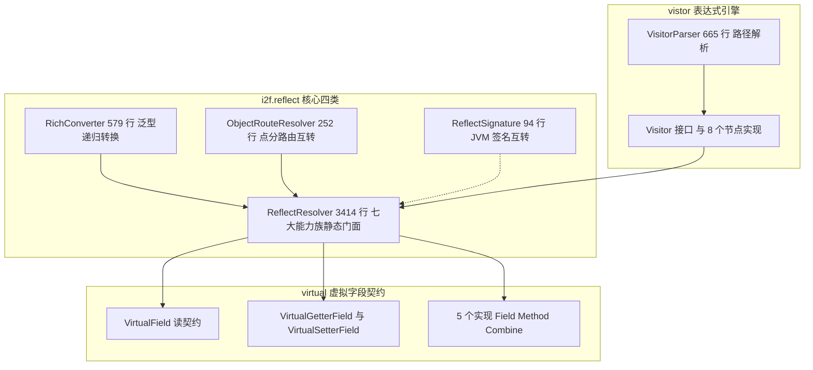

# i2f-reflect

> **全仓反射能力的中央底座**：33 个源文件约 6200 行——`ReflectResolver` 以 3414 行单类、226 个 `public static` 成员承载七大能力族（类加载、字段/方法发现、注解解析、反射调用匹配、值读写、Bean 复制、虚拟字段），配 `RichConverter`（579 行泛型递归强转）、`ObjectRouteResolver`（252 行点分路由扁平↔树）、`ReflectSignature`（94 行 JVM 签名互转）与 `vistor` js 风格表达式引擎（`user.roles[0].name`）；约 30 个 LruMap 静态缓存 + `ENABLE_CACHE` 全局开关。被全仓约 44 个模块 79 个源文件消费，是 lambda / properties / bql / spring-mvc-metadata / jdbc-procedure 的共同反射地基（⚠ 存在 `loadClassWithJdk` 直载结果丢失、`RichConverter` 迭代器转换死循环 OOM 等 16 项已实证缺陷，详见文档）。

## 模块路径

- `i2f-jdk/i2f-reflect`

## 模块依赖

| 依赖 | 坐标 | Scope | 说明 |
| --- | --- | --- | --- |
| i2f-lru-map | `i2f.turbo:i2f-lru-map` | compile | 约 30 个静态反射缓存的底座（容量 8192/2048 两档） |
| i2f-convert | `i2f.turbo:i2f-convert` | compile | `ObjectConvertor` 值/参数转换：`valueSet`、`convertAsExecutableArgs`、`RichConverter` 共用 |
| i2f-typeof | `i2f.turbo:i2f-typeof` | compile | `TypeOf` 装箱感知类型判定（`isVoid`/序列化过滤）+ `TypeToken` 泛型令牌（`RichConverter`） |
| i2f-invokable | `i2f.turbo:i2f-invokable` | compile | `IMethod` 契约：调用匹配泛化到非反射可调用对象（脚本函数等） |
| lombok | `org.projectlombok:lombok` | 由父 POM 管理 | `virtual/impl` 5 个实现类的 `@Data` 等，编译期注解 |

- 版本由父 POM `i2f.turbo:i2f-jdk:1.0-jdk8` 统一管理；`build` 声明 `maven-assembly-plugin`（继承根 POM 配置，项目打包惯例，对普通模块产出 fat-jar 与普通 jar 等价）。
- 四个 i2f 内部依赖均为**编译期实依赖**（无 optional）；除 lombok 外无任何三方依赖。

源码结构（33 个 Java 文件，约 6200 行）：

```text
i2f-jdk/i2f-reflect
└── src/main/java/i2f/reflect
    ├── ReflectResolver.java        3414 行 七大能力族静态总门面（226 个 public static 成员）
    ├── RichConverter.java           579 行 泛型递归转换
    ├── ObjectRouteResolver.java     252 行 点分路由扁平↔树
    ├── ReflectSignature.java         94 行 JVM 签名互转
    ├── virtual/                     虚拟字段契约（3 接口 + 5 实现，共 384 行）
    ├── vistor/                      表达式引擎（Visitor + 8 实现 + VisitorParser 665 行，共 1028 行）
    └── test/                        11 个演示类（约 460 行，⚠ 混入主构件随 jar 发布）
```

## 模块设计

### 1. 总体结构：一超多强



- `ReflectResolver` 是绝对核心：其余三类与两个契约包均围绕它构建——`RichConverter`/`ObjectRouteResolver`/Visitor 各实现类内部大量调用其 `getFields`/`valueGet`/`valueSet`/`loadClass`。
- `ReflectSignature` 仅反向依赖 `ReflectResolver` 的两个类名互转方法（`className2UrlPath`/`path2ClassName`）与 `loadClass`。

### 2. ReflectResolver：七大能力族

| 能力族 | 关键 API | 要点 |
| --- | --- | --- |
| 类加载与类名互转 | `loadClass`、`loadClass0/1`、`loadClassWithJdk`、`path2ClassName`、`className2Path/PathFileName/UrlPath`、`isJdkClas` | 上下文类加载器 + `Class.forName` 双路径；原始类型名映射（`"long"→Long.class`、`"string"→String.class`）；`LOAD_CLASS_PREFIXES`（22 项）短名前缀补全；`CACHE_LOAD_CLASS`(2048) 缓存 |
| 字段发现 | `getField`、`getFields`、`getFieldsByName`、`getForceFields`、`isIgnoreSerializeFields` | 默认按「序列化视角」过滤 transient、static final 常量与 Type/Number/IO 流族字段；`getForceFields` 不过滤 |
| 方法发现 | `getMethod`、`getMethods`、`getMethodsByName` | 谓词过滤重载 + 父子类/接口方法归并 |
| 注解解析 | `getAnnotation`、`getAnnotations`、`findAnnotation`、`findAllAnnotation`、`getAssignAnnotations`、`getAnnotationAllValues`、`getAnnotationValue` | 元注解递归、`@Repeatable` 展开、成员方法注解、注解值一键读取 |
| 调用匹配 | `matchExecMethod`、`matchExecutable`、`getTypeDistance`、`convertAsExecutableArgs` | 类型距离打分排序 + 两轮匹配（精确轮 + `supportConvert` 转换轮）+ varargs 打包 |
| 实例化与调用 | `getInstance`、`invoke*`、`invokeSingletonMethod`、`getDefaultInstanceForJuc` | 构造器/方法多态匹配；JUC 接口给出默认实例 |
| 值读写 | `valueGet`、`valueSet` | getter 优先、字段兜底；`ObjectConvertor` 自动转换 |
| Bean 复制 | `copy`、`beanCopy`、`beanAssign`、`beanMerge` 及 `*Weak` 变体 | 三语义 + 弱名归一 + 多别名映射 + 7 个行为回调 |
| 虚拟字段 | `getVirtualFields`、`getVirtualGetterFields`、`getVirtualSetterFields`、`map2beanVirtual`、`beanVirtual2map` | 字段 + 方法合成读写契约 |

**调用匹配算法**：`matchExecMethod`（`Iterable<IMethod>` 泛化版，可匹配脚本函数等非反射可调用对象）先以「真实类型 × 需求类型」的 `getTypeDistance` 距离打分取最近命中；精确轮失败后开启 `supportConvert` 二轮（允许经 `ObjectConvertor` 转换后匹配）；`convertAsExecutableArgs` 把实参加工为可执行参数（含变长参数数组打包）。

**Bean 复制三语义**（全部收敛到 `beanCopy0`）：

| API | 语义 | 过滤规则 |
| --- | --- | --- |
| `beanCopy` | 全量覆盖：src 有什么就盖什么（含 null） | 无 |
| `beanAssign` | 源非空才覆盖：src 的 null/空串跳过 | `newValueCopyFilter` |
| `beanMerge` | 补空：dst 为空时才用 src 填补，两侧非空保留 dst | `newValueCopyFilter` + `oldValueCoverFilter` |

- `beanCopy0` 还支持 `srcFieldNameMapper`/`dstFieldNameMapper`（`Function<Field, List<String>>`，一个字段可映射出多个别名参与匹配）与 `valueMapper` 值变换；`*Weak` 变体以弱名归一（忽略 `-`/`_`/大小写）匹配跨命名风格的字段。
- `getFields`/`getMethods` 带谓词重载 + 注解伴随查询（`getFieldsWithAnnotation`/`getFieldsWithAnyAnnotations`）。

**缓存体系**：约 30 张静态 `LruMap`（类加载 2048，其余多为 8192），统一经 `cacheDelegate` 读写；`ENABLE_CACHE`（`public static AtomicBoolean`，默认 true）为全局开关——关闭时向 `cacheDelegate` 传 null 缓存、走无锁直算路径。

### 3. RichConverter：泛型递归转换

- 双端分派：源类型（Collection/Map/数组/Iterable/Enumeration/Iterator/Bean）× 目标类型（Collection/Map/Bean/数组）组合递归转换；目标为接口而无实现类时以 `defaultImpls`（ArrayList/LinkedHashMap/LinkedHashSet）兜底。
- 泛型：以 `TypeToken` 声明目标泛型，`fetchRelType/fetchRelTypeNext` 沿 `getGenericSuperclass`/`getGenericInterfaces` 回溯实际类型参数；`weakMatchField` 开启字段弱名匹配。
- 入口：`convert(obj, Class/Type)` 与 `convert2Type`；Bean→Map/Bean→Bean 按字段名逐字段转换。

### 4. ObjectRouteResolver：点分路由

- 路径协议：`user.roles[0].name` 点分扁平键 ↔ 嵌套树形结构互转，支撑 properties 与表单编码两类场景。
- API：`toRouteMap`（Bean→点分扁平）、`toFlatMap`（树→递归摊平）、`ofMapTree`（扁平→树，带 keyMapper）、`groupMap`（按前缀分组聚合成树）。
- `toRouteMapNext` 五分支递归：Map/Collection/Array/Bean/基础类型逐类处理。

### 5. vistor：js 风格表达式引擎

- 语法要点（整理自 `VisitorParser` 的 117 行头注释）：路径 `user.roles[0].@getKeys(#{name})[0]`；根常量 `$root`；参数根 `#{参数}`；当前节点 `$node`/`$param`；布尔与空 `$true/$false/$null`；`$length`/`$size`；`@类.方法()` 静态/实例方法调用；数值字面量 `$123`/`$123l`/`$0x1F`/`$0b101`/`$017`/`$1.5f` 等。
- 8 个节点实现：`MapVisitor`、`ListVisitor`、`SetVisitor`、`ArrayVisitor`、`FieldVisitor`、`StaticFieldVisitor`、`ConstVisitor`、`ReadonlyVisitor`；`Visitor` 接口提供 `get/set/delete/parent/castAs/getAs` 与两个 `visit` 静态入口。
- 三张 LruMap 缓存（tokens/params/patterns）；解析路径段时按原 Map 的 key 类型推断转换（foundMapKeyConverter）。

### 6. virtual：虚拟字段契约

- `VirtualField`（name/type/readable/writeable + get/set）为基契约，另有 `VirtualGetterField`/`VirtualSetterField` 两个专用接口。
- 5 个实现（lombok `@Data`）：`FieldGetterSetterField`（字段直读直写）、`MethodGetterField`/`MethodSetterField`、`MethodGetterSetterField`（方法对）、`CombineGetterSetterField`（组合读写来源）。
- 由 `getVirtualFields` 从「字段 + getter/setter 方法」合成：`getXxx/isXxx/hasXxx` 识别 getter，`setXxx/withXxx`（含 fluent 返回 this 的 setter）识别 setter；`map2beanVirtual`/`beanVirtual2map` 以虚拟字段为协议做 Map↔Bean 复制。

## 模块目的

- **全仓统一反射底座**：把类加载、元数据发现、调用匹配、值读写等散落的反射代码收敛为单一门面，下游（lambda/properties/bql/mybatis/脚本/AI/Spring 元数据）不再各自手写。
- **精确与宽松匹配并存**：`getTypeDistance` 距离排序 + 两轮匹配 + `ObjectConvertor` 转换，让「类型精确的调用」与「需要自动转换的调用」都能命中。
- **序列化友好元数据**：`getFields` 默认输出「可序列化视角」的字段集（滤 transient/常量/JDK 内部字段），供 JSON/导出场景直接使用。
- **结构互转总线**：`RichConverter` + `ObjectRouteResolver` + Visitor 构成「Bean ↔ Map ↔ 点分扁平 ↔ 表达式路径」四态互转，是配置装载（properties）、表单编解码（form-url-encoded）、脚本节点（jdbc-procedure）三类管线的共同地基。
- **零三方依赖承诺**：仅 4 个 i2f 内部模块 + lombok，可下沉到任意 JDK8 环境。

## 模块功能

### ReflectResolver（226 个 public static 成员）

| 类别 | 成员 | 说明 |
| --- | --- | --- |
| 类加载 | `loadClass`/`loadClass0`/`loadClass1`/`loadClassWithJdk` | 双路径加载 + 前缀补全 + 2048 缓存（⚠ `loadClassWithJdk` 有缺陷） |
| 类名互转 | `path2ClassName`/`class2Path`/`className2Path`/`className2PathFileName`/`className2UrlPath` | 路径/URL/类名三态互转 |
| 类型判定 | `isVoid`/`isArray`/`isJdkClas`/`isJdkClassName` | 装箱感知（`TypeOf`），⚠ `isJdkClas` 为拼写固化的公开 API |
| 字段 | `getField`/`getFields`/`getFieldsByName`/`getForceFields`/`getFieldsWithAnnotation`/`isIgnoreSerializeFields` | 序列化视角过滤 + 注解伴随字段查询 |
| 方法 | `getMethod`/`getMethods`/`getMethodsByName` | 谓词过滤重载 |
| 注解 | `getAnnotation`/`getAnnotations`/`findAnnotation`/`findAllAnnotation`/`getAssignAnnotations`/`getAnnotationAllValues`/`getAnnotationValue` | 元注解递归 + Repeatable 展开 |
| 调用 | `getInstance`/`invoke*`/`invokeSingletonMethod`/`matchExecMethod`/`matchExecutable`/`getTypeDistance`/`convertAsExecutableArgs` | 构造器与方法的距离匹配调用 |
| 值读写 | `valueGet`/`valueSet` | getter/setter 优先、字段兜底 |
| Bean 复制 | `copy`/`beanCopy(0)`/`beanAssign`/`beanMerge` 及 `*Weak` | 三语义 + 弱名 + 多别名 + 回调 |
| 虚拟字段 | `getVirtualFields`/`getVirtualGetterFields`/`getVirtualSetterFields`/`map2beanVirtual`/`beanVirtual2map` | ⚠ 泄漏 Object 继承方法 |
| 命名工具 | `firstUpper`/`firstLower`/`fieldNameByMethodName`/`iterGetterNames`/`iterSetterNames`/`getGetterNames`/`getSetterNames` | ⚠ 前缀剥离规则有误 |
| 数组工具 | `arrayLength`/`arrayGet`/`arraySet` | `java.lang.reflect.Array` 包装 |
| 缓存 | `cacheDelegate`/`ENABLE_CACHE` | 统一缓存委托（⚠ synchronized 粗锁） |

### RichConverter

| 类别 | 成员 | 说明 |
| --- | --- | --- |
| 转换入口 | `convert(obj, Class)`/`convert(obj, Type)`/`convert2Type` | 支持 `TypeToken` 泛型声明 |
| 泛型工具 | `fetchRelType`/`fetchRelTypeNext` | 沿继承链回溯实际泛型参数 |
| 弱名 | `weakName` | ⚠ 与 ReflectResolver 的三套弱名规则互不一致 |
| 接口兜底 | `defaultImpls` | ArrayList/LinkedHashMap/LinkedHashSet |

### ObjectRouteResolver

| API | 方向 | 说明 |
| --- | --- | --- |
| `toRouteMap` | Bean → 点分扁平 | 产出 `user.name`/`roles[0].name` 形态键 |
| `toFlatMap` | 树 → 扁平 | 递归摊平为 `Map<String,String>` |
| `ofMapTree` | 扁平 → 树 | 支持 keyMapper（⚠ `groupMap` 键映射 NPE） |
| `groupMap` | 扁平 → 分组树 | 按前缀分组聚合 |

### ReflectSignature

| API | 说明 |
| --- | --- |
| `toSign(Class)`/`ofSign(String)` | 单类型描述符互转（`Ljava/lang/String;`/`I` 等）；数组走 `getName()` 形态 |
| `sign(Method)`/`sign(Field)` | 方法完整描述符（`(Ljava/lang/Object;)Ljava/lang/String;`）/ 字段类型签名；⚠ 方法描述符 `ofSign` 不可回解 |

### Visitor / virtual

- 见「模块设计」第 5、6 小节；`Visitor.visit(表达式, 根对象)` 一行进入，随后 `get/set/delete` 读写路径指向的节点。

## 模块主要使用方法

**1）类加载与动态实例化**（i2f-log `LogConfiguration` 模式）

```java
Class<?> clazz = ReflectResolver.loadClass(className);   // 短名/全名/原始类型名均可
Object config = ReflectResolver.getInstance(clazz);      // 构造器多态匹配（含默认参数兜底）
ReflectResolver.invokeSingletonMethod(config, "setParams", params); // 按方法名 + 实参匹配调用
```

**2）注解解析**（i2f-spring-mvc-metadata `ApiMethodResolver` 模式）

```java
RequestMapping rm = ReflectResolver.getAnnotation(clazz, RequestMapping.class);
GetMapping gm = ReflectResolver.getAnnotation(method, GetMapping.class);
Map<String, Object> values = ReflectResolver.getAnnotationAllValues(method, AnnName.class); // 一次取全部值
String[] tags = ReflectResolver.getAnnotationValue(method, AnnName.class, "tags");          // 只取单个成员
```

**3）Bean 复制三语义**

```java
ReflectResolver.beanCopy(src, dst);       // 全量覆盖：src 有什么就盖什么（含 null）
ReflectResolver.beanAssign(src, dst);     // 源非空才覆盖（null/空串跳过）
ReflectResolver.beanMerge(src, dst);      // 补空：dst 为空时才用 src 填写
ReflectResolver.beanAssignWeak(src, dst); // 弱名匹配：user_name / userName / USERNAME 互配
```

**4）值读写与反射调用**

```java
Object v = ReflectResolver.valueGet(bean, "name");   // getter 优先，取不到走字段
ReflectResolver.valueSet(bean, "name", "root");      // setter 优先 + 类型自动转换
```

**5）泛型递归转换**（RichConverter）

```java
List<TestUser> users = RichConverter.convert(rawList, new TypeToken<List<TestUser>>() {}.getType());
```

**6）扁平与树互转**（form-url-encoded / properties 管线）

```java
ObjectRouteResolver.toRouteMap(bean);                          // {user.name=..., user.roles[0].name=...}
Map<String, String> flat = ObjectRouteResolver.toFlatMap(map); // 树 → 扁平
Map<String, Object> tree = ObjectRouteResolver.ofMapTree(flat, keyMapper); // 扁平 → 树
```

**7）Visitor 表达式路径读写**（i2f-jdbc-procedure 脚本节点模式）

```java
Visitor visitor = Visitor.visit(result, params);   // result 为根，params 为参数表
Object cur = visitor.get();                        // 读路径指向的节点
visitor.set(newValue);                             // 写
visitor.delete();                                  // 删

// 表达式示例（均经探针验证）
Visitor.visit("list[1]", root).get();                  // 20
Visitor.visit("user.name", root).get();                // admin
Visitor.visit("list.$size", root).get();               // 3
Visitor.visit("@String.valueOf($23.5)", root).get();   // 23.5（静态方法调用 + 数值字面量）
```

**注意事项：**

- 全限定类名（含 `.`）**不要**走 `loadClassWithJdk`（缺陷 1，会返回 null）；直接用 `loadClass`，它支持全名直载。
- `RichConverter` **勿直接传 `Iterator`**（缺陷 4：`hasNext()` 误用成死循环，探针实测 OOM）；先收集为 List 再转换。
- `ObjectRouteResolver.toRouteMap` 对 null 值不安全（缺陷 3）：顶层 null、Map/List 内含 null 值均抛 NPE 且向调用方传播；输入前先过滤，或容忍调用点静默吞异常（Bean 字段 null 场景）。
- `groupMap` 使用 keyMapper 改写键会 NPE（缺陷 5）；需要分组时自行聚合。
- `getVirtualFields` 输出需自行过滤 Object 继承方法与伪字段（`wait/equals/toString/class/hCode`，缺陷 7）。
- **transient 不是安全边界**：`getFields` 会滤掉 transient 字段，但 `valueGet`/`valueSet` 仍可读写（缺陷 6）。
- `ReflectSignature.ofSign` 不能回解 `sign(Method)` 产出的方法描述符（缺陷 8）；方法描述符适合做唯一键而非往返转换。
- 缓存由 `ENABLE_CACHE` 全局控制；`cacheDelegate` 对每张表 `synchronized` 粗锁，高并发下可能成为热点（缺陷 13）。

## 下游消费方一览

模块级：全仓（模块外）约 **44 个模块、79 个源文件**引用 `i2f.reflect`，约 34 处 POM 声明依赖。按类分布：

| 类 | 消费文件数 | 主要消费方 |
| --- | --- | --- |
| `ReflectResolver` | 70 | `ApiMethodResolver`（约 25 处，最重）、`RestClientProxyHandler`(18)、`AgentContextHolder`(17)、`DefaultFunicResolver`(17)、`BeanDatabaseMetadataResolver`(16)、`Bql`(10)、`EsBeanManager`(10)、`LogConfiguration` 等 |
| vistor 系 | 13 | `i2f-properties`、`i2f-jdbc-procedure`、`i2f-extension-xproc4j`、`i2f-extension-antlr4` 等 |
| `RichConverter` | 8 | `i2f-properties`、`i2f-form-url-encoded`、`i2f-ai-std` 等 |
| `ObjectRouteResolver` | 2 | `i2f-properties`、`i2f-form-url-encoded` |
| `ReflectSignature` | 1 | `i2f-lambda`（`LambdaInflater`） |
| `VirtualField` | 0 | 暂无模块外直接消费（仅模块内 virtual 体系自用） |

典型消费明细（源码证据）：

| 消费方 | 使用方式 |
| --- | --- |
| `i2f-log` `LogConfiguration` | L169 `loadClass(className)` + L173 `getInstance(clazz)` + L178 `invokeSingletonMethod(...)`：配置类动态装载与 setter 调用 |
| `i2f-spring-mvc-metadata` `ApiMethodResolver` | L160-170 `getAnnotation(clazz/method, RequestMapping/GetMapping/PostMapping/...)`：Spring MVC 注解逐项读取 |
| `i2f-lambda` `LambdaInflater` | L73 `getMethods(clazz, 谓词)` + L75 `ReflectSignature.sign(method)`：SerializedLambda 描述符到真实 Method 的反解 |
| `i2f-properties` `PropertiesUtil` | L54-56 `Visitor.visit(prefix, mapTree).get()` + `RichConverter.convert(root, beanClass)`；L91 `ObjectRouteResolver.ofMapTree` |
| `i2f-form-url-encoded` `FormUrlEncodedEncoder` | L27 `toRouteMap` + L151 `toFlatMap` + L152 `ofMapTree(keyMapper)` + L124-142 `RichConverter.convert*` |
| `i2f-jdbc-procedure` `BasicJdbcProcedureExecutor` | L483/488 `getAnnotation` + L1611/1623 `loadClass` + L1840-1875 `Visitor.visit(result, params)` 的 `get/set/delete` |

三条典型管线：


## 模块特性总结

- **一超多强**：3414 行单类承载七大能力族与 226 个公开静态成员；其余 3 个核心类 + virtual/vistor 两包均为其专用外设。
- **缓存全开**：约 30 张 LruMap 静态缓存 + `ENABLE_CACHE` 全局开关 + 统一 `cacheDelegate` 委托。
- **三语义 Bean 复制**：copy/assign/merge + 弱名归一 + 单字段多别名映射 + 7 个行为回调。
- **四态互转总线**：Bean ↔ Map ↔ 点分扁平 ↔ 表达式路径（RichConverter + ObjectRouteResolver + Visitor）。
- **序列化视角过滤**：`getFields` 默认剔除 transient/常量/JDK 内部字段，供序列化/导出直用。
- **消费面极广**：44 模块 79 文件，横跨 Spring 元数据、脚本引擎、AI、JDBC、配置装载、表单编解码、方法引用解析七域。
- **零三方依赖**：仅 4 个 i2f 内部模块 + lombok（编译期）。

## 模块瑕疵或错误

以下 16 项为通读全部 33 个源文件并**编译工作区源码运行探针**（12 项关键断言）后如实记录——其中 8 项由运行时探针坐实：

| # | 探针断言 | 实测结果 | 对应缺陷 |
| --- | --- | --- | --- |
| 1 | `loadClassWithJdk("java.util.Date")` | `null`（`loadClassWithJdk("Date")` 正常返回） | 缺陷 1 |
| 2 | `getTypeDistance(String, CharSequence)` | `2147483647`（`Integer.MAX_VALUE`）；`Integer→Comparable` = 2 | 缺陷 2 |
| 3 | `toRouteMap`：Bean 字段为 null | 看似正常（NPE 被调用点吞掉） | 缺陷 3 |
| 4 | `toRouteMap`：顶层 null / Map、List 内含 null 值 | `NullPointerException` 向调用方传播 | 缺陷 3 |
| 5 | `RichConverter.convert(iterator, ArrayList.class)` | `OutOfMemoryError` | 缺陷 4 |
| 6 | `groupMap(flat, k -> "user")` | `NullPointerException` | 缺陷 5 |
| 7 | `getFields(Bean)` / `valueGet(bean, "secret")` | 字段表无 `secret` / 仍读到 `42` | 缺陷 6 |
| 8 | `getVirtualFields(Role)` / `beanVirtual2map(role)` | `[name, wait, equals, toString, hCode, class]` / 输出混入垃圾键 | 缺陷 7 |
| 9 | `sign(String#valueOf)` → `ofSign` | `(Ljava/lang/Object;)Ljava/lang/String;` → `null` | 缺陷 8 |
| 10 | `Visitor.visit` 常规路径 | 正常（`list[1]`=20、`$size`=3、`set` 生效、`@String.valueOf($23.5)`=23.5） | — |
| 11 | `Visitor.visit("@java.util.Objects.toString($123)")` | `IllegalStateException` | 缺陷 1 级联 |
| 12 | `toSign/ofSign` 单类型往返 | 正常（`Ljava/lang/String;`/`I`） | — |

具体缺陷：

1. **`loadClassWithJdk` 丢弃直载结果**（`ReflectResolver` L263-273）：直载结果 `ret` 未提前返回，随后进入前缀循环被**无条件覆盖**：

```java
Class<?> ret = loadClass(className);      // 直载命中也不会返回
for (String item : jdkPackages) {
    ret = loadClass(item + className);    // ← ret 被逐次覆盖
    if (ret != null) { break; }
}
return ret;
```

对含 `.` 的全限定名（如 `java.util.Date`），前缀拼接必然失败，最终返回 `null`（探针实证）；级联导致 `VisitorParser` 的 `@全限定类名.方法()` 调用抛 `IllegalStateException`（探针实证）。修复：循环前补 `if (ret != null) return ret;`。

2. **`getTypeDistance` 接口分支判定错误**（`ReflectResolver` L1139-1169）：接口递归结果以 `if (next != -1) return next;` 判定命中，但失败哨兵值是 `Integer.MAX_VALUE` 而非 `-1`——实测 `String→CharSequence` 返回 `MAX_VALUE`（2147483647），仅「首个接口直接命中」的场景碰巧正确（`Integer→Comparable`=2）。影响：接口参数在距离排序中被当作超远距离/无匹配，`matchExecMethod` 的接口入参场景可能选到更差重载或匹配失败。

3. **`ObjectRouteResolver.toRouteMapNext` 缺 `return`**（L36-43）：`obj == null` 分支 `builder.put(path, obj)` 后缺少 `return`，继续执行 `obj.getClass()` 抛 NPE。实测：顶层 null、Map/List 内含 null 值时 NPE 向调用方传播；Bean 字段为 null 时因调用点（L113-128）`catch (Exception e) {}` 静默吞异常而「看似正常」（put 已在 NPE 前执行）。影响：null 值路由场景崩溃或静默丢数据。

4. **`RichConverter` 迭代器分支死循环**（`RichConverter` L275-282）：循环体误把 `hasNext()` 当 `next()` 用：

```java
while (iterator.hasNext()) {
    Object item = iterator.hasNext();   // ← 应为 iterator.next()；boolean 被当元素
    ...
}
```

指针永不前进、while 恒真，无限添加 Boolean 直至 `OutOfMemoryError`（探针实证）。影响：`Iterator` 源转换完全不可用且为灾难性死循环。

5. **`groupMap` 键映射不一致 NPE**（`ObjectRouteResolver` L192-251）：建分组用 keyMapper **映射后**的键（`ret.put(putKey, new TreeMap<>())`），取分组却用**原键**（`ret.get(arr[0])`）→ null → NPE（探针实测 `User→user` 即崩）。此即 `i2f-properties` 文档记载缺陷的根因。

6. **序列化过滤不对称**：`isIgnoreSerializeFields`（L38-69）使 `getFields` 排除 transient、static final 常量与声明类为 Type/Number/InputStream/OutputStream/Reader/Writer/Scanner 的字段（探针：`secret` 被滤）；但 `valueGet(bean, "secret")` 全量返回 `42`（走 `getField` 独立定位，不经该过滤）。影响：以 `getFields` 为序列化边界的调用方，实际过滤点可被旁路。

7. **虚拟字段泄漏 Object 继承方法**（`getVirtualFields0` L2862-2943）：实测 `Role` 的虚拟字段为 `[name, wait, equals, toString, hCode, class]`。根因：① `fieldNameByMethodName`（L2374-2385）对 `hashCode()` 误剥离 `has` 前缀得 `hCode`、`getClass()` 剥 `get` 得 `class`；② 未排除 `Object` 的公开方法（`toString/equals/wait` 被当作 getter/setter）。影响：`beanVirtual2map` 输出被污染（探针实测混入 `toString/hCode/class` 键）。

8. **`ReflectSignature` 签名 API 不对称**（94 行）：`sign(Method)` 产出完整方法描述符（`(Ljava/lang/Object;)Ljava/lang/String;`），但 `ofSign` 只支持单类型描述符（`Ljava/lang/String;`/`I` 往返正常），方法描述符回解得 `null`（探针实证）。影响：名称为「互转」实际仅单向；当前唯一消费方 `LambdaInflater` 只用 `sign` 作 map 键，暂未踩坑。

9. **`getMethods`/`getVirtualFields0` 接口递归传错变量**：带谓词重载遍历 `superInterface` 时递归的是 `superclass`（L2661-2695、L2862-2943），多级接口继承场景会漏收深层接口的方法。

10. **类加载前缀表错拼与重复**（L200-223）：`"java,time.temporal."` 逗号应为点；`"java.concurrent."`/`"java.concurrent.atomic."`/`"java.concurrent.locks."` 均缺 `util.`（正确为 `java.util.concurrent.*`）——短名加载 `ConcurrentHashMap`/`AtomicInteger`/`ReentrantLock` 等 JUC 类必然失败；`JDK_CLASS_PREFIXES`（约 120 项，L72-198）含 `sun.security.`、`com.sun.imageio.`、`com.sun.jndi.`、`com.sun.media.` 等多组重复项。

11. **命名拼写固化**：公开 API `isJdkClas`（L225）少字母（应为 Class）；包名 `i2f.reflect.vistor` 拼写错误（应为 visitor）——两类名字均随构件长期保留。

12. **三套弱名归一规则互不一致**：`ReflectResolver.weakName(String)` 剥 `[-_'"`.]`、`weakFieldName(Field)` 只剥 `[-_]`、`RichConverter.weakName` 剥 `[-\_$]` 且不剥点号——同一对字段在不同 API 的弱匹配判定可能不同。

13. **`cacheDelegate` 粗粒度锁**（L2253-2272）：`synchronized (cache)` 使每张 LRU 表的全部读写串行（约 30 张表、容量 8192/2048），高并发反射场景成为热点；`ENABLE_CACHE=false` 时走 null 缓存无锁直算（设计行为）。

14. **演示代码混入主构件**：`i2f.reflect.test` 包 11 个演示类与 `RichConverter.main()`（import `i2f.reflect.test.TestRole`）位于 `src/main/java`，随 jar 一起发布——构件含非生产代码且演示类持有对核心类的 compile 依赖。

15. **`ObjectRouteResolver` 数组占位分组依赖字典序**（L231-240）：下标信息被丢弃、依赖 `TreeMap` 字符串序聚合——两位数下标（如 `[10]` 排在 `[2]` 前）与数值序不一致，10 元素以上列表分组顺序可能错乱。

16. **静默吞异常遍布**：`ReflectResolver` 内 14 处 `catch (Exception ...)`（类加载、注解、缓存等路径）吞掉现场，叠加缺陷 3 等场景把崩溃伪装为「正常返回」，排障困难；此外单类 3414 行 + `public static` 可变字段 `ENABLE_CACHE` 也使误用面与维护成本偏大。

## 可拓展方向

- 按缺陷清单修复：① `loadClassWithJdk` 直载提前返回；② `getTypeDistance` 哨兵改为 `Integer.MAX_VALUE`；③ `toRouteMapNext` 补 `return`；④ 迭代器改用 `next()`；⑤ `groupMap` 统一映射键；⑥ 虚拟字段过滤 `Object` 方法与伪字段；⑦ `ofSign` 支持方法描述符。
- `cacheDelegate` 换 `ConcurrentHashMap` + 分段/无锁读，消除全表 `synchronized`。
- 前缀表去重并补正 JUC/`java.time.temporal` 项；`isJdkClas` 增加正名别名 `isJdkClass`。
- 把 3414 行单类按能力族拆分为门面 + 内部实现类（保持静态 API 不变）。
- `test` 演示包迁至 `src/test/java` 或从构件排除（assembly/excludes）。
- 弱名归一收敛为单一常量方法，供三类 API 共用。
