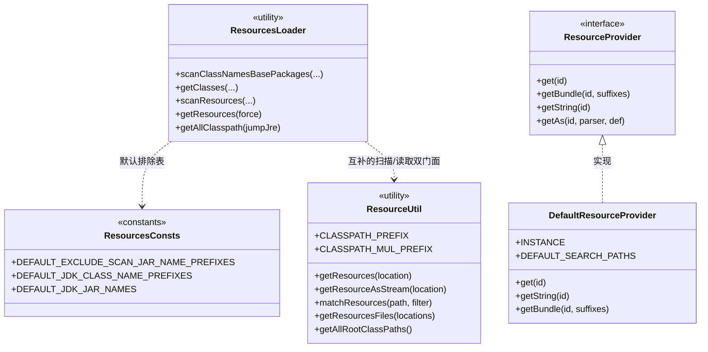
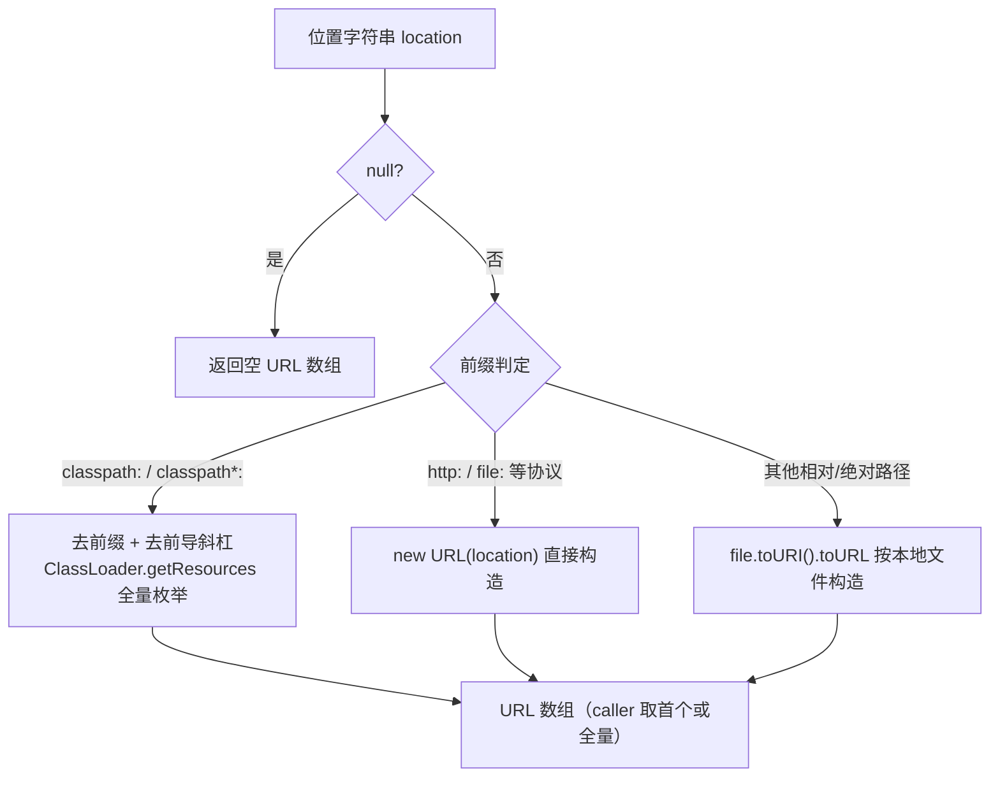
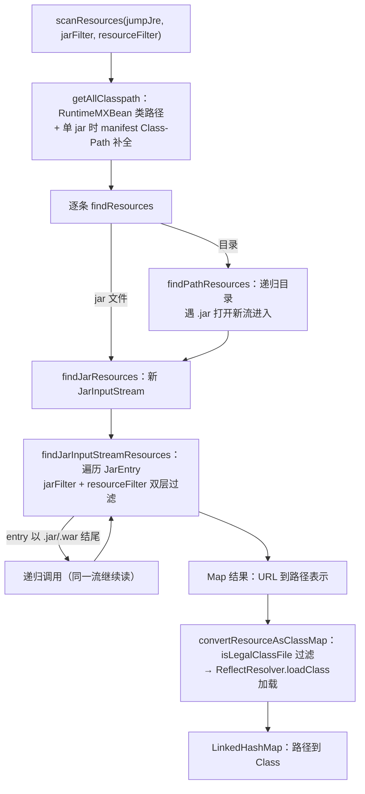
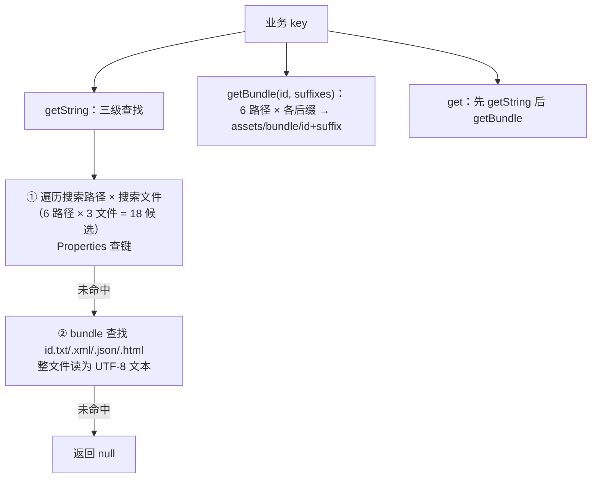

# i2f-resources

> **资源定位与类路径扫描工具箱**：5 个源文件约 1460 行（`i2f.resources` 主包 3 类 + `i2f.resources.provider` 契约 1 接口 + `impl` 默认实现 1 类），收敛三族能力——① 读取门面 `ResourceUtil`（`classpath:`/`classpath*:`/`file:`/URL/相对/绝对六态位置统一解析为 `URL`/`InputStream`/`bytes`/`String`，另含 `matchResources` 通配匹配与 `getResourcesFiles` 位置→`File` 集合展开）；② 扫描引擎 `ResourcesLoader`（全类路径的类/资源扫描：目录递归 + jar 流遍历 + 嵌套 jar 解包 + manifest `Class-Path` 补全 + `jumpJre` 跳过 JRE + 双 `BiPredicate` 过滤 + `isLegalClassFile` 合法性判定 + 包名前缀收缩算法 + `ReflectResolver.loadClass` 类加载，另含 `RES_CACHE` 静态资源缓存）；③ 提供者 SPI `ResourceProvider` + `DefaultResourceProvider`（以 `INSTANCE` 单例按 `assets.properties`/`assets/bundle/` 目录约定提供 properties 键值、无后缀/带后缀资源流与 `getAs` 类型化取值）。依赖 `i2f-reflect`/`i2f-io-stream`（pom 另声明 `i2f-match` 但源码零引用，疑为冗余），零三方依赖；被 11 个模块直接消费 + 6 个模块经 `i2f-ai-std` 传递消费（共 25 个源文件），是全仓「包扫描驱动注解注册」（netty controller / quartz 任务）与「内置资源加载」（字典、模板、OCR 脚本、原生库）的地基。

## 模块路径

- `i2f-jdk/i2f-resources`

## 模块依赖

| 依赖 | 坐标 | Scope | 说明 |
| --- | --- | --- | --- |
| i2f-reflect | `i2f.turbo:i2f-reflect` | compile | 扫描引擎使用 `ReflectResolver`：`getClasspathName`（去 `classpath:`/前导 `!`/`/` 归一）、`getClassLoader`（TCCL 优先）、`loadClass`（带 LruMap 缓存的类加载）、`path2ClassName`（资源路径→类名） |
| i2f-io-stream | `i2f.turbo:i2f-io-stream` | compile | `ResourceUtil` 与 `ResourceProvider` 使用 `StreamUtil`（`readBytes`/`readString`，自动关闭） |
| i2f-match | `i2f.turbo:i2f-match` | compile | ⚠ pom 声明但全部 5 个源文件**零 `i2f.match` 引用**，疑为冗余/遗留声明 |
| （三方） | — | — | 零三方依赖，纯 JDK 实现（`java.util.jar`、`java.lang.management`、`java.util.function`） |

- 父 POM 为 `i2f.turbo:i2f-jdk:1.0-jdk8`；`build` 声明 `maven-assembly-plugin`（继承根 POM `plugin-phase` 的 `jar-with-dependencies` 配置）。
- 另无 lombok 声明（本模块也无 lombok 用法）。
- 源码结构：

```text
i2f-jdk/i2f-resources
└── src/main/java/i2f/resources
    ├── ResourceUtil.java            (291 行)
    ├── ResourcesConsts.java         (207 行)
    ├── ResourcesLoader.java         (684 行)
    └── provider
        ├── ResourceProvider.java    (83 行)
        └── impl
            └── DefaultResourceProvider.java (196 行)
```

## 模块设计

三族能力彼此正交：读取门面服务于「已知位置取内容」，扫描引擎服务于「未知位置找目标」，提供者 SPI 服务于「按业务 key 取约定资源」。前两者为静态工具类，后者为接口 + 默认实现。

### 1. 类型关系



- **`ResourceUtil`**：单资源读取（首个命中）+ 通配匹配 + 位置展开为 `File`；面向「调用方已知目标」。
- **`ResourcesLoader`**：全类路径遍历（目录/jar/嵌套 jar）+ 类加载；面向「目标未知、按包名或过滤条件寻找」。
- **`ResourceProvider`**：业务资源约定（`resources/assets/` 目录、properties 键值、bundle 媒体文件）；接口 default 方法提供 `String/bytes/类型化` 便捷读取，实现类只约定「怎么找到流」。
- 两个工具类各自维护一套 classpath 解析（`ResourceUtil.getResources` vs `ResourcesLoader.getAllClasspath`），**策略并不完全一致**（见「模块瑕疵」第 4 条）。

### 2. 位置字符串解析链（ResourceUtil）



- 六态位置统一收敛到 `URL`：`classpath:` 与 `classpath*:` **行为完全相同**（都全量枚举，非 Spring 语义中「`classpath:` 只取首个」）。
- 非 classpath 分支**不校验文件存在性**：`getResource` 对不存在的本地路径也会返回 `file:` URL，错误延迟到 `openStream()` 才暴露。
- `getResourceAsStream` 在无任何命中时抛 `FileNotFoundException`（`getResource` 则返回 null）。

### 3. 扫描引擎流程（ResourcesLoader）



- **类路径来源**：`RuntimeMXBean.getClassPath()` 按 `File.pathSeparator` 切分（跨平台正确），`jumpJre` 时跳过 `/jre/lib/`；当类路径只有一个 jar 时补读其 manifest `Class-Path`（相对项先按 CWD、再按 jar 父目录解析存在性）。
- **jar 内 URL 形态**：条目 key 形如 `jar:file:/.../x.jar!/a/b/C.class`，value 形如 `!a/b/C.class`；目录文件 value 形如 `/a/b/c.txt`。
- **类加载**：`convertResourceAsClassMap` 中 `ReflectResolver.path2ClassName`（自动剥 `!`/`/`）→ `ReflectResolver.loadClass`（LruMap 缓存，加载失败静默跳过）。
- **缓存**：`getResources()` 的 `RES_CACHE` 静态缓存全量非 class 资源映射，**空结果不进缓存**（每次重扫）；`clear()+putAll()` 刷新非原子。

### 4. 双层过滤与默认排除表

所有扫描入口最终收敛到 `scanResources(jumpJre, jarFilter, resourceFilter)` 的双 `BiPredicate`：

| 过滤器 | 签名 | 作用 | 默认 |
| --- | --- | --- | --- |
| `jarFilter` | `BiPredicate<String, Boolean>`（jarName, embed） | 按 jar 名放行/跳过；`embed=true` 顶层 jar、`false` 嵌套 jar | `isDefaultExcludeScanJarName` |
| `resourceFilter` | `BiPredicate<URL, String>`（url, path） | 按资源条目过滤 | 依入口不同（非 class 文件 / 合法 class 文件） |

`ResourcesConsts` 提供默认排除常量：`DEFAULT_EXCLUDE_SCAN_JAR_NAME_PREFIXES`（约 150 个三方 jar 名前缀：`lombok-`/`spring-`/`log4j-`/`mybatis-`/`jackson-` 等）、`DEFAULT_JDK_JAR_NAMES`（24 个 JDK 自带 jar）、`DEFAULT_JDK_CLASS_NAME_PREFIXES`（7 个 JDK 包前缀）。`isDefaultExcludeScanJarName` 返回 `true` 表示**保留扫描**（详见瑕疵第 2 条）。

### 5. 包名前缀收缩算法（getShortlyCommonPrefixes）

包扫描前先用 `getShortlyClassNamePrefixes` 把候选包名收缩为最短前缀集，避免父子包重复遍历：

```text
输入：com  com.i2f  org  org.cglib
输出：com  org        （com.i2f 被 com 吸收、org.cglib 被 org 吸收）
```

- 算法：按 `separator` 切段、长度升序逐层构建前缀串；当某成员的段前缀恰为集合内成员（且其后随分隔符或是其本身）时，把被包含成员标记排除。
- 按包名（`.`）与 URL 路径（`/`）两个视角各有一套入口：`getShortlyClassNamePrefixes` / `getShortlyUrlPathPrefixes`。
- 该算法支撑 `scanClassNamesBasePackages` 的「类名前缀 + 资源路径前缀」双重过滤（见下）。

### 6. 提供者约定（DefaultResourceProvider）



- 目录约定（类注释示例）：`classpath:/resources/assets/string.properties` 中 `app.name=test` → `getString("app.name")`；`classpath:/resources/assets/bundle/bg.mp3` → `getBundle("bg", ".mp3")`。
- 搜索路径：`classpath:resources` / `classpath:` / `./resources` / `.` / `../resources` / `..`（每个再拼 `assets/`）；搜索文件：`assets.properties` / `resources.properties` / `string.properties`。
- classpath 前缀在本类中**手动重新实现**（`loader.getResources` + 去前导斜杠），未复用 `ResourceUtil`。

## 模块目的

- **统一资源定位协议**：把 `classpath:`/`classpath*:`/`file:`/URL/相对/绝对六种写法收敛到同一入口，屏蔽类加载器、目录、jar 包之间的差异。
- **支撑注解驱动框架的包扫描**：以 `scanClassNamesBasePackages` 实现「给包名、拿 Class 集合」的地基能力（netty 注解 controller 注册、quartz 任务扫描、xproc4j 脚本节点发现等均以此起步）。
- **内置资源随 jar 分发**：给字典、模板、OCR 脚本、原生动态库等「随包携带」的资源提供稳定读取通道（`getClasspathResourceAsStream/AsString`）。
- **应用级资源访问约定**：以 `ResourceProvider` SPI 把「配置键值 + bundle 媒体」的目录约定沉淀为可替换的提供者，业务侧一行 `getString/getBundle/getInteger` 取值。

## 模块功能

**A. ResourceUtil（读取门面，静态类）**

| 类别 | 成员 | 说明 |
| --- | --- | --- |
| 常量 | `CLASSPATH_PREFIX` / `CLASSPATH_MUL_PREFIX` | `classpath:` / `classpath*:` 前缀常量（外部消费方也用于位置判断，如 jdbc-procedure） |
| 定位 | `getLoader()` | TCCL 优先、本类类加载器兜底 |
| | `getClasspathResource(location)` / `getClasspathResources(location)` | classpath 前缀 + 单个/全量 |
| | `getResource(location)` / `getResources(location)` | 六态位置统一解析，单个（首个）/全量 |
| 读取 | `getResourceAsStream` / `getClasspathResourceAsStream` | 首个命中开流；无命中抛 `FileNotFoundException` |
| | `getResourceAsBytes` / `getResourceAsString(location, charset)` | 经 `StreamUtil` 读 bytes/文本（自动关闭） |
| | `getClasspathResourceAsBytes` / `getClasspathResourceAsString` | classpath 前缀版 |
| 列表 | `matchResources(path, itemFilter)` | 遍历位置下列出的目录/jar 条目，按文件名 `Predicate` 过滤，返回 URL→文件名 Map |
| 位置展开 | `getResourceFiles(location)` / `getResourcesFiles(locations)` | 位置字符串→`File` 集合：classpath 拼全部根类路径、`file:` 解析、其余按本地路径 |
| | `getAllRootClassPaths()` | `RuntimeMXBean` 类路径 + classpath 根资源，合并去重 |
| 演示 | `main(args)` | `matchResources` 使用示例（生产类中保留的 demo） |

**B. ResourcesLoader（扫描引擎，静态类）**

| 类别 | 成员 | 说明 |
| --- | --- | --- |
| 单资源 | `getClasspathResource(name)` | `ReflectResolver.getClasspathName` 归一后取 URL |
| | `getResourceAsStream(url)` | 普通 URL 直开；多层 `!/` 嵌套 jar URL 拆解后**流式解包**读入内存返回 |
| 包扫描 | `scanClassNamesBasePackages(...)` ×4 | 包名 → 类名类映射（前缀收缩 + 类名/路径双过滤 + filter） |
| 类扫描 | `getClasses(...)` ×5 / `getDefaultClasses(...)` ×4 | 全类路径类扫描；default 版自动排除 JDK 类 |
| | `convertResourceAsClassMap(map, filter)` | 资源映射 → 类映射（合法性判定 + `loadClass`） |
| 资源扫描 | `scanResources(...)` ×4 / `scanDefaultResources()` | 全类路径资源映射（URL→路径表示） |
| 过滤工具 | `isJarFile` / `isClassFile` / `isLegalClassFile` | 后缀与类名合法性判定（排除匿名内部类 `$数字`、数字结尾段等） |
| | `isJdkClass(clazz)` / `isDefaultExcludeScanJarName(jarName)` | JDK 类判定 / 默认 jar 排除（语义见瑕疵 2） |
| 内部遍历 | `findResources` / `findPathResources` / `findJarResources` / `findJarInputStreamResources` | 目录递归、jar 流遍历、（伪）嵌套 jar 递归 |
| 类路径 | `getAllClasspath()` / `getAllClasspath(jumpJre)` | `File.pathSeparator` 切分 + manifest `Class-Path` 补全 |
| 缓存 | `getResources()` / `getResources(force)` | `RES_CACHE` 全量非 class 资源缓存（空不进缓存） |
| 算法 | `getShortlyClassNamePrefixes` / `getShortlyUrlPathPrefixes` / `getShortlyCommonPrefixes` | 包名前缀收缩 |

**C. ResourcesConsts（常量表）**

| 常量 | 规模 | 说明 |
| --- | --- | --- |
| `DEFAULT_EXCLUDE_SCAN_JAR_NAME_PREFIXES` | 约 150 项 | 三方 jar 名前缀黑洞表（框架/日志/驱动/序列化/大数据等） |
| `DEFAULT_JDK_CLASS_NAME_PREFIXES` | 7 项 | `java.`/`javax.`/`jakarta.`/`javafx.`/`sun.`/`jdk.`/`com.sun.` |
| `DEFAULT_JDK_JAR_NAMES` | 24 项 | `rt.jar`/`tools.jar`/`charsets.jar` 等 JDK8 自带 jar |

**D. ResourceProvider / DefaultResourceProvider（提供者）**

| 类别 | 成员 | 说明 |
| --- | --- | --- |
| 抽象 | `get(id)` | 唯一抽象方法：返回资源流（找不到返回 null，按其约定） |
| default | `getBundle(id, suffixes...)` | 按后缀序依次试探（null 后缀视为空串） |
| | `getString(id, charset)` / `getString(id)` / `getBytes(id)` | 流读文本/字节（`StreamUtil`，自动关闭） |
| | `getAs(id, parser, def)` | `ExFunction` 解析 + 任何 Throwable 静默回退默认值 |
| | `getInteger/getLong/getBoolean/getFloat/getDouble` | 类型化快捷取值（均带默认值） |
| 实现 | `DefaultResourceProvider.INSTANCE` | 单例；覆写 `get`/`getString(id)`/`getBundle` 实现 assets 三级查找 |
| | `getSearchFiles()` / `getSearchBundleFiles(id, suffixes...)` | 搜索候选生成（路径×文件 / 路径×后缀 笛卡尔积） |

## 模块主要使用方法

**1）读取单个资源（六态位置统一入口）**

```java
// classpath 读取（首个命中）
InputStream is = ResourceUtil.getClasspathResourceAsStream("assets/excel/map-export-template.xlsx");
byte[] bytes = ResourceUtil.getClasspathResourceAsBytes("assets/pandoc/custom-reference.docx");
String tpl = ResourceUtil.getClasspathResourceAsString("tpl/ddl/table-ddl.mysql.sql.vm", "UTF-8");

// 任意位置：classpath: / classpath*: / file: / http: / 相对 / 绝对
URL url = ResourceUtil.getResource("classpath:string.properties");
URL[] all = ResourceUtil.getResources("file:/data/config/");     // 全量
URL none = ResourceUtil.getResource("/not/exist");                // 不校验存在性，返回 file: URL
```

**2）包扫描：给包名拿 Class 集合（注解驱动框架起点）**

```java
// 扫描 basePackages 下类，并用 filter 只保留带注解的类（netty controller 用法）
Map<String, Class<?>> map = ResourcesLoader.scanClassNamesBasePackages((name, clazz) -> {
    return ReflectResolver.getAnnotation(clazz, NettyController.class) != null;
}, "com.example.web");

// 不过滤，扫描多个包（quartz 用法；父子包自动收缩）
Map<String, Class<?>> all = ResourcesLoader.scanClassNamesBasePackages(null, "com.example.jobs", "com.example.jobs.sub");

// 默认排除 spring-/lombok- 等三方 jar 与 JDK 类
Map<String, Class<?>> defaults = ResourcesLoader.getDefaultClasses();
```

**3）资源扫描：全类路径资源映射（带缓存）**

```java
// 全量非 class 资源（首次全扫，随后走 RES_CACHE；force=true 强制重扫）
Map<URL, String> resources = ResourcesLoader.getResources();

// 按过滤条件扫描（如只保留 .properties）
Map<URL, String> props = ResourcesLoader.scanResources((url, path) -> path.endsWith(".properties"));
```

**4）位置字符串展开为 File 集合（目录监视/热加载场景）**

```java
// 混合位置：classpath*/classpath/file/相对目录 → 所有根类路径下展开的 File 集合
Set<File> paths = ResourceUtil.getResourcesFiles(Arrays.asList(
        "classpath*:procedure/", "resources", "classpath:com", "file:/E:/procedure"));
```

**5）ResourceProvider：按业务 key 取值（默认 assets 约定）**

```java
ResourceProvider provider = DefaultResourceProvider.INSTANCE;

String name = provider.getString("app.name");              // assets/string.properties 中 key
String text = provider.getString("banner");                // assets/bundle/banner.txt 整文件
InputStream mp3 = provider.getBundle("bg", ".mp3");        // assets/bundle/bg.mp3
Integer port = provider.getInteger("server.port", 8080);   // 解析失败/找不到 → 默认值
```

**注意事项：**

- `classpath:` 与 `classpath*:` 在 `ResourceUtil` 中**行为一致**（都全量枚举）；不要按 Spring 语义预期「`classpath:` 只取首个」。
- `getResourceAsStream` 无命中抛 `FileNotFoundException`；`getResource` 无命中返回 null；非 classpath 的本地路径不校验存在性。
- `DefaultResourceProvider` 三个 API 的失败行为不一致：`getString(id)` 找不到返回 null、`getString(id, charset)` 找不到抛 `IllegalStateException`（接口 default 包装 NPE）、`get(id)` 在 `getString` 未命中时**触发 NPE**（详见瑕疵 1，使用 `get` 前务必规避）。
- `ResourcesLoader.getResources()` 的空结果不缓存（环境空资源时会反复全量扫描）；`RES_CACHE` 刷新为 `clear()+putAll()` 两步。
- 扫描目标为 fat-jar（`BOOT-INF/lib` 嵌套 jar）时，嵌套 jar 内的资源**不会**被真正列出，且其后续条目 URL 会失真（详见瑕疵 3）。
- `ResourcesLoader.getResourceAsStream(URL)` 专治多层 `!/` 的嵌套 jar URL（如 `jar:file:/app.jar!/BOOT-INF/classes!/x.class`），会把目标内容读入内存返回 `ByteArrayInputStream`，查找失败返回 **null**（不抛异常）。

## 下游消费方一览

| 消费方 | 依赖关系 | 使用方式 |
| --- | --- | --- |
| `i2f-io-file` | 直接（POM 声明） | `FileUtil.getFileWithClasspath`：`getClasspathResource(fileName)` 把 classpath 写法转 URL → File |
| `i2f-number-idcard` | 直接 | `RegionMap` 静态初始化：`getClasspathResourceAsStream(REGION_MAP_LOCATION)` 加载 3516 行行政区划字典 |
| `i2f-ai-std` | 直接 | ① `SkillsHelper.getSkillResource`：`getResource(path)` 失败则 `getClasspathResource(path)` 兜底；② OCR RAG 读取器：`getClasspathResourceAsStream("/assets/python/ocr_easyocr.py")` 释放内置 Python 脚本 |
| `i2f-translate-en2zh` | 直接 | `SimpleWordTranslator`：`getClasspathResourceAsStream("/assets/database/translate_en2zh.zip")` 加载词典 |
| `i2f-translate-zh2pinyin` | 直接 | `PinyinProvider`：`getClasspathResourceAsStream("/assets/database/translate_zh2pinyin.zip")` 加载词典 |
| `i2f-extension-netty` | 直接 | `HttpRequestDispatchAdapter.addMappingByScanPackage`：`scanClassNamesBasePackages(filter, pkgs)` 扫描 `@NettyController` 注解控制器注册路由 |
| `i2f-extension-quartz` | 直接 | `QuartzScanner.scanBasePackage`：`scanClassNamesBasePackages(null, pkgs)` 扫描包内类再反射解析 `@QuartzSchedule` 方法 |
| `i2f-extension-easyexcel` / `i2f-extension-fastexcel` | 直接 ×2 | `ExcelExportTask`：`getClasspathResourceAsStream("assets/excel/map-export-template.xlsx")` 加载内置导出模板 |
| `i2f-extension-reverse-engineer-generator` | 直接 | 12+ 处 `getClasspathResourceAsString("tpl/....vm", "UTF-8")` 加载 Velocity 代码/文档模板（RE 生成器与 ER 图生成器） |
| `i2f-tools-encrypt` | 直接 | `HelpMenuHandler`：`getClasspathResourceAsString("static/help.txt", "UTF-8")` 读取帮助文本 |
| `i2f-jdbc-procedure` | 传递（经 `i2f-ai-std`） | ① `LangFileReadTextNode`：以 `CLASSPATH_PREFIX`/`CLASSPATH_MUL_PREFIX` 常量判断位置 → `getResource(str)` 取 URL 读脚本文件；② `DirectoryWatchingJdbcProcedureXmlNodeMetaCacheProvider`：`getResourcesFiles(locations)` 把混合位置展开为监视目录集合 |
| `i2f-extension-ai-rag-sqlite` | 传递（经 `i2f-ai-std`） | `SqliteVecUtils`：`getClasspathResourceAsStream("/assets/sqlite-vec/" + name)` 释放 sqlite-vec 原生动态库 |
| `i2f-springboot-ops-starter` | 传递（经 `i2f-ai-std`） | `OfficeFormatUtil`：`getClasspathResourceAsStream(embedPath)` 加载内置文档模板 |
| `i2f-springboot-xproc4j-starter` | 传递（经 `i2f-extension-xproc4j → i2f-jdbc-procedure → i2f-ai-std`） | `SpringContextJdbcProcedureExecutorAutoConfiguration`：`getResourcesFiles(Arrays.asList(arr))` 解析 procedure 位置配置 |
| `i2f-tools-ops` | 传递（经 `i2f-springboot-ops-starter`） | `PandocTools`：`getClasspathResourceAsStream("assets/pandoc/custom-reference.docx")` 加载 Pandoc 参考文档 |
| `i2f-jdbc-procedure-idea-plugin` | 构建期/IDE 插件（Gradle 复合构建 `:i2f-extension-xproc4j`） | 3 个调试器测试类：`getClasspathResourceAsString(resourceFile, "UTF-8")` 读取被调试脚本 |
| `test-springboot` | 直接（POM 声明） | 未见源码级引用（主/测试源码均无 `import i2f.resources`，疑为资源结构示例依赖） |
| `i2f-jdk-all` / 根 POM | 聚合打包 / 版本托管 | 纳入全仓 fat-jar 与 `dependencyManagement` 统一版本 |

**说明**：`ResourceProvider`/`DefaultResourceProvider`（provider 子包）目前**全仓无源码级消费方**——SPI 契约与默认实现已就绪但尚未被业务模块引入（`i2f-resources` 自身的 `main` 演示除外）。统计口径：25 个源文件 `import i2f.resources`（24 个主源 + 1 个 `TestReverseEngineer` 测试）。

## 模块特性总结

- **三族正交**：读取门面（ResourceUtil）、扫描引擎（ResourcesLoader）、提供者 SPI（ResourceProvider/Default），职责边界清晰。
- **六态位置协议**：`classpath:`/`classpath*:`/`file:`/URL/相对/绝对统一收敛，全仓通用。
- **扫描能力完整**：目录递归、jar 流遍历、嵌套 jar URL 解包（`getResourceAsStream`）、manifest `Class-Path` 补全、`jumpJre` 跳过 JRE。
- **过滤体系双维度**：jar 名（含 `embed` 区分顶层/嵌套）+ 资源路径双 `BiPredicate`，默认排除表覆盖约 150 个三方前缀。
- **前缀收缩算法**：包扫描前自动消除父子包重复（`com.i2f` 折叠进 `com`）。
- **类加载贯通**：`isLegalClassFile` 合法性判定（排除 `$数字` 匿名类等）后经 `ReflectResolver.loadClass`（LruMap 缓存）直接产出 `Class`。
- **零三方依赖**：仅 2 个内部依赖（+1 个零引用的 `i2f-match`），可下沉到最受限环境。
- **消费面广**：11 个模块直接消费 + 6 个模块传递消费，覆盖 IO、ID、AI、翻译、Excel、Netty、Quartz、逆向生成、脚本引擎（xproc4j/jdbc-procedure）多个域。

## 可拓展方向

- 把 `ResourceProvider` 接入 `i2f-spi`（`@Spi` + `META-INF/services`）实现「可插拔资源提供者」，并让 `DefaultResourceProvider` 成为其默认实现。
- 修复 `DefaultResourceProvider.get(id)` 的 `getBundle(id, null)` NPE 并统一三个 API 的「找不到」语义（统一返回 null 或统一抛异常）。
- `classpath:` 与 `classpath*:` 语义分化（对齐 Spring：前者 `getResource` 首个、后者 `getResources` 全量）。
- `RES_CACHE` 空结果标记（区分「未扫描」与「扫描为空」）与原子替换（`AtomicReference` 换引用代替 `clear+putAll`）。
- `getAllRootClassPaths` 改用 `File.pathSeparator` 切分（与 `ResourcesLoader.getAllClasspath` 对齐），消除 Windows 硬编码。
- 嵌套 jar 真正解包：读取 jar entry 内容重建 `JarInputStream`，支持 Spring Boot fat-jar 的资源扫描。
- 为 `isLegalClassFile` 的数字规则增加白名单/精确化（如仅排除版本化目录段），避免误杀合法类。

## 模块瑕疵或错误

以下为通读 5 个源文件（约 1460 行）并核对 25 个消费文件后如实记录的内容：

1. **`DefaultResourceProvider.get(id)` 变长参数误传 null 致 NPE**：`get(String id)` 中 `getBundle(id, null)` 传的是 null **数组**（而非单元素 `(String) null`）——`suffixes` 为 null 进入 `getSearchBundleFiles` 的增强 for 循环立即 NPE。触发条件：`getString(id)` 未命中（即常规的「key 不存在」场景），因此 `get` 无法按注释预期回退到无后缀 bundle 查找。三个 API 失败行为还不一致：`getString(id)`→null、`getString(id, charset)`（接口 default）→`StreamUtil` 读 null 流传 NPE 后包装 `IllegalStateException`、`get(id)`→上述 NPE。
2. **`isDefaultExcludeScanJarName` 命名与返回语义相反**：方法返回 `true` 表示**保留扫描**（未命中 JDK jar 表与排除前缀表），返回 `false` 表示跳过；但方法名字面是「是否默认排除的 jar 名」。消费端 `!jarFilter.test(...)` 二次取反后功能正确，但任何按名字直觉直接使用的调用（`if (isDefaultExcludeScanJarName(x)) skip`）都会全反。
3. **`findJarInputStreamResources` 嵌套 jar 为「假递归」**：发现 `.jar` entry 时递归调用**同一个 `JarInputStream`** 继续读——`getNextJarEntry` 只能返回外层 jar 的后续条目，无法进入该 entry 的内容（真读法需先读出 entry 字节再重建流）。后果：① 嵌套 jar 内部资源不会被列出；② 递归内读到的外层后续条目被错误挂到 `jar:...x.jar!/`（嵌套）前缀的 URL 下，造成 URL 失真与 value 前缀叠加（`!a.jar!b.jar!...`）。fat-jar / `BOOT-INF/lib` 场景受影响（磁盘上的独立嵌套 jar 目录结构走 `findPathResources → findJarResources` 新流分支则正确）。
4. **`getAllRootClassPaths` 硬编码 `";"` 分号**：`getRuntimeMXBean().getClassPath().split(";")` 仅适用 Windows；Linux/macOS 的 `pathSeparator` 是 `:`，拆分失效（对比：`ResourcesLoader.getAllClasspath` 正确使用 `File.pathSeparator`——同一模块两套类路径解析策略不一致）。另此 `split(";")` 对正则中的分隔符未转义（此处分号无特殊含义，暂无影响）。
5. **`isLegalClassFile` 的数字规则过宽**：`className.matches(".*\\d+\\..*")` 会排除任何「数字后紧跟点」的类名——包段以数字结尾（如 `com.example.v2.App`、`mybatis3.mapper.Foo`）的**合法类被误杀**，在全类路径扫描中静默丢失。
6. **`ResourceUtil.matchResources` 缺陷簇**：① `file` 协议分支 `file.listFiles()` 未判空，URL 指向文件或无权限目录时 `for (File item : null)` NPE；② `jar` 分支对命中的每个 entry 通过 `getClasspathResources(name)` 反查 URL——嵌套 jar 内条目反查不到（返回空数组），匹配项静默丢失；③ jar 文件路径提取 `substring("file:/".length())` 依赖 `jar:file:/...` 的 URL 形态，`jar:file:///`（三斜杠）形态下会多出前导斜杠。
7. **`getResourceFiles` 不校验存在性、对 jar 类路径生成无意义路径**：classpath 分支把「所有根类路径（含 jar 文件）+ 相对路径」直接拼为 `File`——当根类路径是 jar 文件时产生 `xxx.jar/assets/...` 之类的虚拟路径；所有分支均不检查 `exists()`，调用方须自行过滤（`DirectoryWatching...` 中即以 `dir.exists()` 兜底）。另 `getResourcesFiles` 对单个位置异常静默吞掉（空 catch）。
8. **`RES_CACHE` 空结果不缓存 + 刷新非原子**：`getResources(force)` 判断 `!RES_CACHE.isEmpty()`——若环境资源扫描结果为空，每次调用都重新全量扫描（注释中的「缓存」在空环境下永不生效）；刷新采用 `clear()+putAll()` 两步，并发调用方可能观察到中间态（空/部分映射）。
9. **`ResourcesConsts` 重复项**：`DEFAULT_EXCLUDE_SCAN_JAR_NAME_PREFIXES` 中 `org.apache.`（第 54、159 行）与 `org.eclipse.`（第 55、154 行）各重复一次——无功能影响（前缀匹配短路），属清单维护瑕疵。
10. **`classpath:` 与 `classpath*:` 语义未分化**：`ResourceUtil.getResources` 对两前缀执行完全相同的「全量枚举」逻辑，与 Spring 惯例（`classpath:` 只取首个命中）不同；`getResource`/`getClasspathResource` 虽只返回首个，但那是「取数组第一个」，仍然付出了全量枚举的成本。
