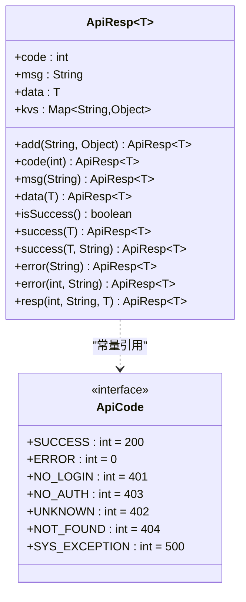
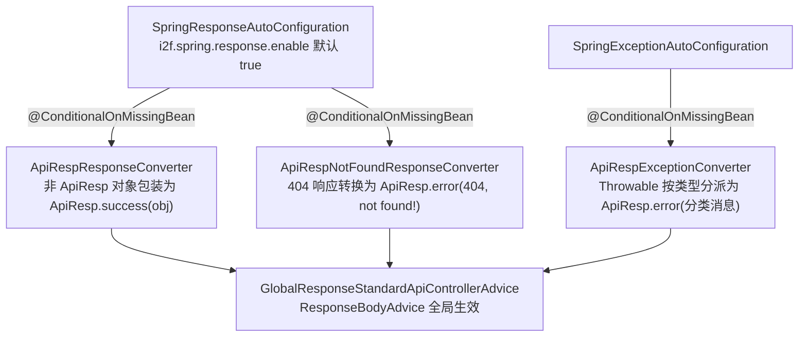

# i2f-resp

> **统一 API 响应契约模块**（2 源文件约 95 行、运行期零依赖仅 lombok 编译期）：`ApiResp<T>` 泛型响应体——`code`/`msg`/`data` 三字段 + 惰性 `kvs` 扩展键值，链式 `code()/msg()/data()/add()` 与 `success/error/resp` 静态工厂并存，`isSuccess()` 以 `code == 200` 为唯一判据；`ApiCode` 常量接口收纳 7 个状态码（SUCCESS=200、ERROR=0、NO_LOGIN=401、NO_AUTH=403、UNKNOWN=402、NOT_FOUND=404、SYS_EXCEPTION=500）。作为全仓 HTTP 层「正常返回链路」的统一响应模型（与 `i2f-exception` 的「异常抛出链路」互补且互不依赖）：`i2f-springboot-spring-starter` 以 `@ConditionalOnMissingBean` 默认装配「响应包装 / 异常转换 / 404 转换」三个转换器使其成为 SpringBoot 全局默认响应体，security/shiro/sentinel/activity/spring-authentication 等安全与业务处理器直接构造返回，`i2f-ai-rest-openai` 的 MCP 网关接口签名直接使用；共 9 模块 23 源文件消费。

## 模块路径

- `i2f-jdk/i2f-resp`

## 模块依赖

| 坐标 | 用途 | scope | optional |
| --- | --- | --- | --- |
| （项目内部依赖） | 无 | —— | —— |
| org.projectlombok:lombok:1.18.44 | `@Data`/`@NoArgsConstructor` 编译期生成 getter/setter/equals/hashCode/toString | provided | true |

- 除 lombok 外无任何依赖；版本由根 POM `dependencyManagement` 统一托管（`<lombok.version>1.18.44</lombok.version>`）。

## 模块设计

**1. 两级结构：常量接口 + 泛型载体**

- `ApiCode`：`public interface` 形态的常量池，集中约定响应码语义；
- `ApiResp<T>`：唯一载体类，泛型 `T` 承载业务载荷，`code`/`msg` 承载状态与消息。

**2. 链式（Fluent）与 Bean 双风格并存**

- 字段级：lombok `@Data` 生成标准 getter/setter，兼容 Jackson/Fastjson 等 Bean 序列化；
- 方法级：`code(int)`/`msg(String)`/`data(T)` 返回 `this`，供链式装配；`add(String, Object)` 首次调用时惰性创建 `HashMap` 并返回 `this`。

**3. 静态工厂三族（5 个入口）**

- 成功族：`success(data)`（msg 固定 `"success"`）、`success(data, msg)`；
- 错误族：`error(msg)`（码取 `ApiCode.ERROR`=0）、`error(code, msg)`；
- 通用族：`resp(code, msg, data)`（等价于 public 构造器）。

**4. 双扩展槽**

- `data`：类型安全主载荷（由泛型 `T` 约束）；
- `kvs`：`Map<String, Object>` 任意附加键值（traceId、耗时等无类型约定扩展位）。

**5. 判定语义单一**

`isSuccess()` 仅比较 `code == ApiCode.SUCCESS`（200），不关心 `msg`/`data`。



**6. 下游 SpringBoot 装配路径**

`i2f-springboot-spring-starter` 将本模块设为「默认响应体」——三个转换器均以 `@ConditionalOnMissingBean` 注册，业务方自定义 `StandardApiResponseConverter` 等 Bean 即可整体替换：



## 模块目的

- **统一返回结构**：让 Controller、安全处理器、限流处理器、AI 网关等所有 HTTP 出口共用同一响应体（`code`/`msg`/`data`），前端与调用方只需一套解析逻辑；
- **约定响应码语义**：以 `ApiCode` 集中沉淀 7 个通用码，避免裸数字散落；
- **为 SpringBoot 全局集成提供默认实现**：spring-starter 的响应包装/异常转换/404 转换均以本模块类型作为开箱即用默认值；
- **为 MCP/内部 REST 网关提供轻量信封**：`i2f-ai-rest-openai` 的自研 Simple MCP 协议直接用 `ApiResp<List<ToolDefinition>>` 作为工具列表与调用结果的传输信封。

## 模块功能

### ApiCode 状态码表

| 常量 | 值 | 语义 | 备注 |
| --- | --- | --- | --- |
| `SUCCESS` | 200 | 成功 | `isSuccess()` 唯一判据 |
| `ERROR` | 0 | 通用错误 | `error(String)` 默认码 |
| `NO_LOGIN` | 401 | 未登录 | 沿用 HTTP 语义 |
| `NO_AUTH` | 403 | 无权限 | 沿用 HTTP 语义 |
| `UNKNOWN` | 402 | 未知错误 | 与 HTTP 402（Payment Required）语义冲突 |
| `NOT_FOUND` | 404 | 资源不存在 | 沿用 HTTP 语义 |
| `SYS_EXCEPTION` | 500 | 系统异常 | 沿用 HTTP 语义 |

### ApiResp 字段

| 字段 | 类型 | 说明 |
| --- | --- | --- |
| `code` | `int` | 状态码（默认 0） |
| `msg` | `String` | 提示消息 |
| `data` | `T` | 业务载荷（泛型） |
| `kvs` | `Map<String, Object>` | 扩展键值，首次 `add()` 时惰性创建，未使用时为 null |

### ApiResp 成员方法

| 类别 | 签名 | 说明 |
| --- | --- | --- |
| 构造 | `ApiResp(int code, String msg, T data)` | 全参构造 |
| 构造 | `ApiResp()` | `@NoArgsConstructor`，默认 code=0 |
| 实例 | `ApiResp<T> code(int)` / `msg(String)` / `data(T)` | 链式赋值，返回 this |
| 实例 | `ApiResp<T> add(String key, Object val)` | 惰性建 kvs 并追加，返回 this |
| 实例 | `boolean isSuccess()` | `code == ApiCode.SUCCESS` |
| 静态 | `ApiResp<T> success(T data)` | 码 200 + msg `"success"` |
| 静态 | `ApiResp<T> success(T data, String msg)` | 码 200 + 自定义 msg |
| 静态 | `ApiResp<T> error(String msg)` | 码 `ApiCode.ERROR`（0） |
| 静态 | `ApiResp<T> error(int code, String msg)` | 自定义码 |
| 静态 | `ApiResp<T> resp(int code, String msg, T data)` | 通用工厂 |
| 生成 | `getXxx` / `setXxx` / `equals` / `hashCode` / `toString` | lombok `@Data` 生成 |

## 模块主要使用方法

### 1. 最少一行：Controller 直接返回

```java
@GetMapping("/user/{id}")
public ApiResp<User> user(@PathVariable Long id) {
    return ApiResp.success(userService.get(id));
}
```

### 2. 错误响应

```java
return ApiResp.error("参数不合法");                          // code = ApiCode.ERROR(0)
return ApiResp.error(ApiCode.NO_LOGIN, "请先登录");          // code = 401
return ApiResp.error(ApiCode.SYS_EXCEPTION, "internal error!");
```

### 3. 链式构造 + 扩展字段（kvs）

```java
return new ApiResp<Map<String, Object>>()
        .code(ApiCode.SUCCESS)
        .msg("ok")
        .data(result)
        .add("traceId", traceId)
        .add("costMillis", cost);
```

### 4. 泛型工厂 + 自定义消息

```java
return ApiResp.success(list, "query ok");   // 注意：msg 参数在 data 之后
```

### 5. 继承扩展专用响应类型（仓库内案例）

`SimpleMcpToolListRespDto` 通过继承附加专用语义：

```java
public class SimpleMcpToolListRespDto extends ApiResp<List<DefaultToolDefinition>> {
}
```

### 6. 消费端反序列化与判定（仓库内案例）

`HttpSimpleMcpClientToolProvider` 以 `ApiResp.class` 反序列化并同时使用两种判定：

```java
RestHttpResponse<ApiResp> resp = restClient.rest(..., ApiResp.class);
ApiResp<?> dto = resp.getBody();
if (dto.getCode() != ApiCode.SUCCESS) { ... }   // 或 dto.isSuccess()
```

### 7. SpringBoot 零配置接入

引入 `i2f-springboot-spring-starter` 即自动获得：非 `ApiResp` 返回值的全局包装、异常 → `ApiResp.error` 转换、404 → `ApiResp.error(404)`；自定义 `StandardApiResponseConverter`/`StandardApiExceptionConverter`/`StandardApiNotFoundResponseConvertor` Bean 可覆盖默认。

## 模块特性总结

- **极简**：2 文件 95 行，单一载体类 + 单一常量接口，无继承体系、无注解驱动；
- **运行期零依赖**：仅 lombok（provided + optional）编译期参与；
- **泛型类型安全**：`data` 由 `T` 约束，配合 `ApiResp<Page<User>>` 等嵌套声明保类型；
- **双风格 API**：Bean getter/setter（序列化友好）+ 链式方法（装配友好）并存；
- **双扩展槽**：强类型 `data` + 弱类型 `kvs`；
- **单判据**：`isSuccess()` 只看 `code == 200`；
- **Spring 生态默认装配**：作为 spring-starter 响应体系的默认实现，可整体替换。

## 下游消费方

### 直接消费（POM 直接声明 i2f-resp，7 模块 19 文件）

| 模块 | 文件数 | 用法 |
| --- | --- | --- |
| `i2f-ai-rest-openai` | 4 | MCP 网关接口签名 `ApiResp<List<ToolDefinition>>`（`HttpSimpleMcpServer`）、`success/error` 包装（`HttpSimpleMcpServerImpl`）、`ApiResp.class` 反序列化 + `ApiCode.SUCCESS` 判定（`HttpSimpleMcpClientToolProvider`）、继承扩展（`SimpleMcpToolListRespDto`） |
| `i2f-springboot-spring-starter` | 3 | 全局响应包装（`ApiRespResponseConverter`）、异常转换（`ApiRespExceptionConverter`）、404 转换（`ApiRespNotFoundResponseConverter`），均 `@ConditionalOnMissingBean` 默认装配 |
| `i2f-springboot-security-starter` | 5 | 安全异常处理器（`SecurityExceptionHandler` 403）、认证成功/失败、登出成功、授权异常处理器 forward `ApiResp` 作为响应体 |
| `i2f-springboot-shiro-starter` | 4 | Shiro 异常处理器（401/403/500）、登录成功/失败、登出处理器 forward `ApiResp` |
| `i2f-springboot-activity-starter` | 1 | `ActivityController` 全部端点返回 `ApiResp.success(...)` |
| `i2f-springcloud-alibaba-sentinel-starter` | 1 | 限流/降级/热点/系统保护的阻塞异常处理器返回 `ApiResp.error(...)` |
| `i2f-spring-authentication` | 1 | `SecurityForwardController` 认证转发端点统一包装（ApiResp 原样透传 + success 兜底） |

### 传递消费（经 `i2f-ai-rest-openai` 传递引入，2 模块 4 文件）

| 模块 | 文件数 | 传递路径 | 用法 |
| --- | --- | --- | --- |
| `i2f-springboot-ai-mcp-server` | 2 | `→ i2f-ai-rest-openai → i2f-resp` | netty 入站处理器（`HttpSimpleMcpInBoundHandler`）与 SpringWeb 控制器（`SpringHttpSimpleMcpController`）序列化 MCP 网关响应 |
| `i2f-springboot-ops-starter` | 2 | `→ i2f-ai-rest-openai → i2f-resp` | Office 文档转换工具（`OfficeFormatUtil` 返回 `ApiResp<File>`）与 `OpenAiOpsController` 消费 |

### 聚合与注册

| 位置 | 说明 |
| --- | --- |
| 根 `pom.xml` | `dependencyManagement` 版本托管 |
| `i2f-jdk/pom.xml` | 模块聚合（`i2f-resources` 之后注册） |
| `i2f-jdk-all` | 全量聚合包引入 |

### 文档互引

`i2f-exception` 的模块文档将本模块列为「正常返回链路」对照（`i2f-resp` 提供返回包装、`i2f-exception` 提供异常抛出），两模块间无代码/依赖关系。

## 模块瑕疵或错误

1. **`ApiCode` 为常量接口（Constant Interface 反模式）**：`public interface` 而非 `enum`/`final class`——任何类 `implements ApiCode` 即被常量污染命名空间；无法 switch 穷举（非 enum）也无 `values()`，语义上不具备类型安全约束力。
2. **两套码值体系混编、且常量未被消费方遵守**：`ERROR=0`（业务码 0）与 HTTP 风格 401/403/404/500 并存；`UNKNOWN=402` 与 HTTP 标准 402 Payment Required 语义冲突。实证：`ShiroExceptionHandler` 使用裸数字 `ApiResp.error(403/401/500, ...)`、`SecurityExceptionHandler` 使用裸数字 `403`、`ApiRespNotFoundResponseConverter` 直接写 `ApiCode.NOT_FOUND`——码表覆盖不足导致裸数字回潮。
3. **`error(String msg)` 默认错误码为 0 而非 500**：`ApiCode.ERROR`=0；若响应直接序列化返回，HTTP 状态仍是 200，错误语义只存在于 body 的 code 字段，与 HTTP 层状态码脱钩（是否映射由上层决定）。
4. **`isSuccess()` 会被 Bean 序列化框架识别为只读属性**：`isXxx()` 符合 JavaBean 布尔属性规范，Jackson/Fastjson 序列化时会在 JSON 中额外输出 `"success": true/false` 字段（既有便利性也有“响应体悄悄多字段”的意外性）；且无对应的 `isError()` 方法。
5. **工厂方法参数顺序不一致**：`success(T data, String msg)` 的 msg 在 data **之后**，而构造器与 `resp(int code, String msg, T data)` 的 msg 在 data **之前**——同一模块内两种调用习惯相反，易写混。
6. **`getKvs()` 未调用 `add()` 时返回 null**：惰性初始化导致直接遍历 kvs 前必须判空；序列化输出受各框架 null 策略影响（Jackson 默认输出 `"kvs": null`，fastjson 默认省略）。
7. **API 面冗余**：`error(int code, String msg)` 与 `resp(int code, String msg, T data)` 功能重叠（`resp(code, msg, null)` 等价）；另有 `success(data)`/`success(data, msg)` 与 `resp(200, msg, data)` 三路重复。
8. **`add(String key, Object val)` 无防护**：不校验 null key（HashMap 允许 null key，静默接受）；无 null 值跳过、Map 批量合并等增强；`kvs` 值类型无约束（`Object` 直接进 JSON）。
9. **`ApiResp` 未实现 `Serializable`**：RMI/分布式缓存/会话复制等需要 JDK 序列化的场景无法直接使用（仓库内 REST 客户端走 JSON 不受影响）。
10. **常量声明顺序交错**：源码中 `NO_AUTH=403` 在 `UNKNOWN=402` 之前（401/403/402/404），阅读时易错位。

## 可拓展方向

- 将 `ApiCode` 演进为 `enum` 或增加成对的 `final class` 常量类，同时补齐 5xx 细分（400/405/409/503 等）以减少裸数字回潮；
- 为 `kvs` 增加判空安全访问（`getKv(key)`/`putIfAbsent`）与批量 `addAll(Map)`；
- 增加 `success()`（无载荷）与 `error()`（默认码）无参便捷工厂，以及 `successOrError` 三目式工厂；
- 视需要引入 traceId/timestamp 一等字段（当前只能放 `kvs`）；
- 提供与 `i2f-page.Page` 配套的教学式分页工厂（`page(Page<T>)`）收敛常见组合。
