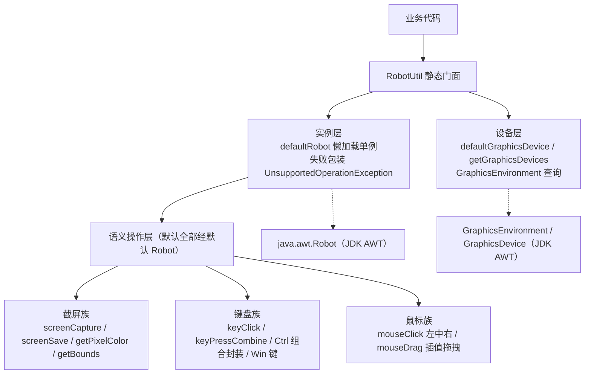
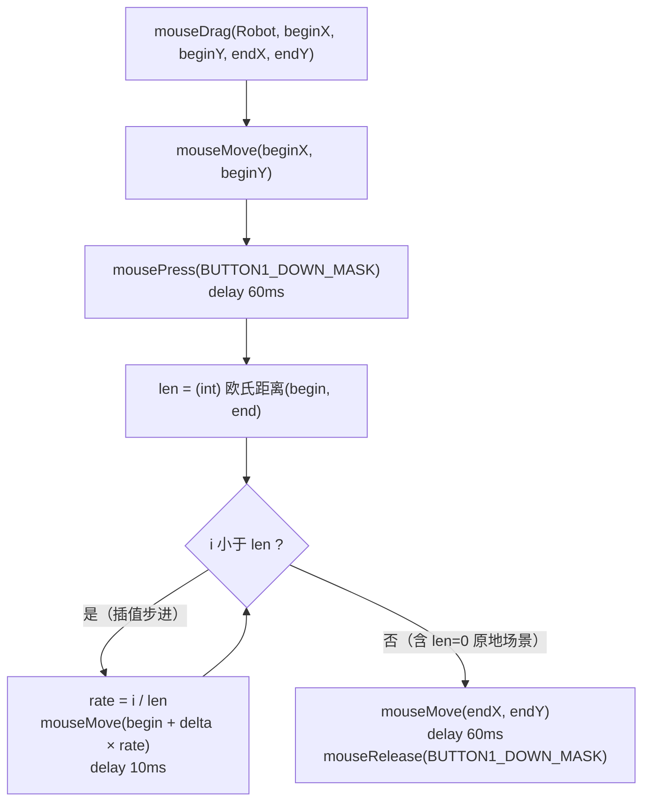

# i2f-robot

> **AWT 桌面自动化工具**（单类 `RobotUtil`：20 个方法名 / 24 个公开静态方法、约 165 行、纯 JDK 零依赖、全仓零消费方）：把 `java.awt.Robot` 封装为静态门面——设备层 `defaultGraphicsDevice()`/`getGraphicsDevices()` 获取屏幕设备，实例层 `defaultRobot()` 同步方法懒加载单例（构造失败统一包装为 `UnsupportedOperationException`），操作层三族：**截屏族**（`screenCapture()` 主屏截图、`screenSave(File)` 按扩展名 jpg/jpeg/png/bmp 选编码器存图（其余回退 png）、`getPixelColor(x,y)` 像素取色、`getBounds()` 主屏边界）；**键盘族**（`keyClick` 单键点按、`keyPressCombine` 正序按下+逆序弹起组合键、Ctrl+C/V/X、Ctrl+Shift+Esc、Ctrl+Alt+Del、`keyClickWindows()` Win 键）；**鼠标族**（左/中/右键点击、任意 `BUTTONn_DOWN_MASK` 点击、`mouseDrag` 左键直线插值拖拽 10ms/步）。键鼠操作内置 60ms 按下-弹起间隔。定位为面向使用者的独立工具类库——经 `i2f-jdk-all` 聚合打包、无 Main-Class 非可执行 jar，仓库内无消费方。⚠ 主要瑕疵：多屏支持残缺（全部操作固定默认屏幕）、`keyPressCtrlAltDelete()` 受 Windows SAS 安全注意序列保护本质无效、拖拽步进/点击延迟魔法数硬编码不可调、`screenSave` 非白名单后缀静默按 png 编码但保留原扩展名——详见下文。

## 模块路径

- `i2f-jdk/i2f-robot`

## 模块依赖

| 坐标 | 用途 | scope | optional |
| --- | --- | --- | --- |
| （项目内部依赖） | 无 | —— | —— |
| （第三方依赖） | 无——仅用 JDK 的 `java.awt`（Robot/GraphicsDevice/Rectangle/Color）、`java.awt.event`（InputEvent/KeyEvent）、`java.awt.image.BufferedImage`、`javax.imageio.ImageIO` | —— | —— |

- `i2f-robot/pom.xml` 无任何 `<dependencies>`；`i2f-jdk` 父 POM 也无公共依赖注入（未使用 lombok）——本模块是 i2f-jdk 家族中少数「编译期与运行期均纯 JDK」的模块之一。

## 模块设计

**1. 单类静态门面（Facade over AWT Robot）**

全部能力收敛在 `RobotUtil` 一个类，分三级：

- **设备层**：`defaultGraphicsDevice()`（`GraphicsEnvironment.getLocalGraphicsEnvironment().getDefaultScreenDevice()`）与 `getGraphicsDevices()`（全屏枚举）——均为无状态一行包装；
- **实例层**：`DEFAULT_ROBOT` 私有静态字段 + `defaultRobot()`（`synchronized` 方法级锁保证懒加载单例，绑定默认屏幕设备）；构造失败（如无图形环境抛 `AWTException`）捕获后统一抛 `UnsupportedOperationException(e.getMessage(), e)`；
- **操作层**：24 个公开静态方法按「截屏 / 键盘 / 鼠标」三族展开，默认全部行走 `defaultRobot()`；其中 4 组方法额外提供 `(Robot, ...)` 重载以支持传入自定义实例。

**2. 内置节拍（Timing）约定**

- 单键点按与单键点击：`press → delay(60) → release`；
- 组合键：正序 `keyPress`（每键间隔 60ms），随后逆序 `keyRelease`（每键间隔 60ms）——修饰键先按后放，满足操作系统对组合键的时序要求；
- 鼠标拖拽：按下后沿直线插值，每步 10ms。

**3. 鼠标拖拽直线插值算法**

`mouseDrag` 以起止点欧氏距离取整为插值步数 `len`，第 i 步落在 `begin + (end - begin) × (i / len)`，每步 `mouseMove` + 10ms 延时；循环后再显式 `mouseMove(end)` 兜底收口（抵消 `(int)` 截断误差），最后 `mouseRelease`。





## 模块目的

- **降低 AWT Robot 的使用门槛**：`new Robot()` 的受检异常、屏幕设备获取、键码组合等样板收敛为一行静态调用；
- **沉淀常用桌面操作语义**：Win 键、Ctrl+C/V/X、Ctrl+Shift+Esc（任务管理器）、左中右键点击等高频动作命名化；
- **提供可复用的自动化积木**：截屏存盘、像素取色、组合键、拖拽四大能力可拼装成更大的桌面自动化脚本；
- **以库形态对外发布**：独立单类模块，经 `i2f-jdk-all` 一并提供给外部使用者（仓库自身不消费）。

## 模块功能

### 设备与实例（3 个方法名）

| 签名 | 说明 |
| --- | --- |
| `static GraphicsDevice defaultGraphicsDevice()` | 默认屏幕设备；无图形环境抛 `HeadlessException` |
| `static GraphicsDevice[] getGraphicsDevices()` | 全部屏幕设备数组（多屏枚举入口） |
| `static synchronized Robot defaultRobot()` | 懒加载单例（绑定默认屏幕）；构造失败抛 `UnsupportedOperationException` |

### 截屏与取色（4 个方法名）

| 签名 | 说明 |
| --- | --- |
| `static Color getPixelColor(int x, int y)` | 取指定坐标像素颜色（经默认 Robot） |
| `static Rectangle getBounds()` | 默认屏幕设备的边界矩形 |
| `static BufferedImage screenCapture()` | 抓取主屏全屏画面到内存 |
| `static void screenSave(File file) throws IOException` | 截图并按文件扩展名选择编码器写盘（jpg/jpeg/png/bmp；其余或无扩展名时回退 png） |

### 键盘（9 个方法名 / 10 个方法）

| 签名 | 说明 |
| --- | --- |
| `static void keyClickWindows()` | 单点 Win 键（Windows 下弹出开始菜单） |
| `static void keyClick(int key)` | 单键点按（传 `KeyEvent.VK_*` 键码） |
| `static void keyClick(Robot robot, int key)` | 同上，指定 Robot 实例 |
| `static void keyPressCtrlC()` / `keyPressCtrlV()` / `keyPressCtrlX()` | Ctrl+C / Ctrl+V / Ctrl+X |
| `static void keyPressCtrlShiftEsc()` | Ctrl+Shift+Esc（任务管理器） |
| `static void keyPressCtrlAltDelete()` | Ctrl+Alt+Del（SAS 受限，见瑕疵 2） |
| `static void keyPressCombine(int... keys)` | 组合键：正序按下 + 逆序弹起 |
| `static void keyPressCombine(Robot robot, int... keys)` | 同上，指定 Robot 实例 |

### 鼠标（7 个方法名 / 10 个方法）

| 签名 | 说明 |
| --- | --- |
| `static void mouseClickLeft()` / `mouseClickRight()` / `mouseClickMiddle()` | 左 / 右 / 中键点击 |
| `static void mouseClick(int button)` | 任意按钮掩码（`InputEvent.BUTTONn_DOWN_MASK`） |
| `static void mouseClick(Robot robot, int button)` | 同上，指定 Robot 实例 |
| `static void mouseDrag(int beginX, int beginY, int endX, int endY)` | 左键直线插值拖拽（10ms/步） |
| `static void mouseDrag(Robot robot, int beginX, int beginY, int endX, int endY)` | 同上，指定 Robot 实例 |

## 模块主要使用方法

### 1. 截屏：内存 / 存盘 / 取色

```java
BufferedImage img = RobotUtil.screenCapture();        // 抓屏到内存
RobotUtil.screenSave(new File("shot.png"));           // 存盘（PNG 编码）
RobotUtil.screenSave(new File("shot.jpg"));           // 存盘（JPEG 编码）
Color color = RobotUtil.getPixelColor(100, 200);      // 指定坐标取色
Rectangle bounds = RobotUtil.getBounds();             // 主屏边界
```

### 2. 点击与单键

```java
RobotUtil.mouseClickLeft();                           // 左键单击
RobotUtil.mouseClickRight();                          // 右键单击
RobotUtil.keyClick(KeyEvent.VK_ENTER);                // 回车
RobotUtil.keyClickWindows();                          // Win 键（弹开始菜单）
```

### 3. 组合键

```java
RobotUtil.keyPressCtrlC();                            // 复制
RobotUtil.keyPressCtrlV();                            // 粘贴
RobotUtil.keyPressCtrlX();                            // 剪切
RobotUtil.keyPressCtrlShiftEsc();                     // 任务管理器
RobotUtil.keyPressCombine(KeyEvent.VK_ALT, KeyEvent.VK_TAB);   // Alt+Tab
```

### 4. 鼠标拖拽（画线 / 框选）

```java
RobotUtil.mouseDrag(300, 300, 800, 600);   // 从 (300,300) 沿直线拖到 (800,600)
```

注意：拖拽时长 ≈ 像素距离 × 10ms（另加起止停顿各 60ms），远距离拖拽明显变慢。

### 5. 传入自定义 Robot（部分方法支持）

```java
Robot robot = new Robot();                 // 或 new Robot(graphicsDevice)
RobotUtil.keyClick(robot, KeyEvent.VK_F5);
RobotUtil.mouseClick(robot, InputEvent.BUTTON1_DOWN_MASK);
RobotUtil.keyPressCombine(robot, KeyEvent.VK_CONTROL, KeyEvent.VK_S);
```

注意：截屏与取色（`screenCapture`/`screenSave`/`getPixelColor`）没有 `(Robot, ...)` 重载，只能走默认实例。

### 6. 组合场景：打开任务管理器并截图留证

```java
RobotUtil.keyPressCtrlShiftEsc();          // 打开任务管理器
Thread.sleep(1000);                        // 等待窗口出现（工具类无 sleep 封装）
RobotUtil.screenSave(new File("taskmgr.png"));
```

### 7. 环境前提

需要非 headless 的图形环境（`GraphicsEnvironment.isHeadless()` 为 false）；macOS 需为应用授予辅助功能（Accessibility）权限；Linux Wayland 会话下 AWT 原生支持受限（通常需 X11/XWayland）。

## 模块特性总结

- **单类约 165 行**：全部能力一个类，无接口、无继承体系、无配置开关；
- **纯 JDK**：仅 `java.awt` / `javax.imageio` / `java.awt.event`，零第三方坐标；
- **静态门面 + 双轨重载**：默认实例便捷调用 + 4 组 `(Robot, ...)` 自定义实例重载；
- **内置节拍**：60ms 键鼠点击间隔、10ms 拖拽步进，调用方无需自行包装延时；
- **组合键时序正确**：修饰键正序按下、逆序弹起；
- **无状态**：唯一可变状态是缓存的 `DEFAULT_ROBOT` 单例；
- **面向使用者的独立发布**：仓库内零消费，经 `i2f-jdk-all` 对外打包；
- **环境敏感**：headless 不可用、Windows SAS 不可注入、Wayland 受限。

## 下游消费方

### 直接消费（0 模块 0 文件）

两轮全仓扫描（`import i2f.robot` / `RobotUtil` 关键字，含 src/test，排除 target）均 0 命中——仓库内没有任何模块引用本模块。其在仓库中的定位是「可对外发布的独立工具类库」而非「被其他模块复用的构件」（同 `i2f-os`、`i2f-jvm` 一类）。

### POM 声明与聚合

| 位置 | 行 | 说明 |
| --- | --- | --- |
| 根 `pom.xml` | L719-723 | `dependencyManagement` 版本托管（`${i2f.version}`） |
| `i2f-jdk/pom.xml` | L137 | 模块注册（位于 `i2f-resp` 之后、`i2f-rowset` 之前） |
| `i2f-jdk-all/pom.xml` | L495-498 | 全量聚合包引入 |
| `i2f-robot/pom.xml` | —— | 挂 `maven-assembly-plugin`（无配置体）：继承根 POM `pluginManagement`（3.1.0，`jar-with-dependencies` + `appendAssemblyId=false`），产出 `i2f-robot-1.0-jdk8.jar`；**无 Main-Class，非可执行 jar**，仅走统一打包流程 |

### 文档互引

`.wiki/wiki.md`（模块清单）与 `.wiki/docs/module-i2f-jdk.md`（旧版粗粒度列表）已将本模块登记为「其他/机器人」类工具。

## 模块瑕疵或错误

1. **多屏支持残缺**：`getGraphicsDevices()` 能枚举全部屏幕设备，但 `defaultRobot()`/`getBounds()`/`screenCapture()`/`screenSave()`/`getPixelColor()` 全部固定默认屏幕——副屏无法截屏、取色、点击；`new Robot(GraphicsDevice)` 的按设备构造能力未被任何公开方法利用，也没有按设备的重载。
2. **`keyPressCtrlAltDelete()` 在 Windows 上本质无效**：Ctrl+Alt+Del 是 Secure Attention Sequence（SAS），由系统安全层（winlogon）专属处理，`Robot` 所依赖的事件注入无法触发（微软对 `SendInput` 注入 SAS 有明确限制）；该方法仅在部分 X11 环境可能产生效果，跨平台语义基本为空。
3. **拖拽速度与点击延迟魔法数硬编码**：click/组合键 60ms、拖拽 10ms/步均为字面量，未抽常量、无速度参数；`mouseDrag` 步数 = 欧氏距离取整，1000px 拖拽需约 1000 次 `mouseMove` × 10ms ≈ 10 秒以上，长距离拖拽显著变慢且不可调。另，`(int)` 截断使步距误差在高分屏上被放大（终点由显式 `mouseMove(end)` 兜底，功能不受影响）。
4. **`screenSave` 非白名单后缀静默回退**：扩展名不在 `{jpg, jpeg, png, bmp}`（如 `.gif`）或文件名无扩展名时，内容按 `png` 编码写出但文件名保持原样——扩展名与实际内容不符且无任何提示；方法无返回值，调用方无从得知实际编码格式与写出结果（失败仅以 `IOException` 表达）。
5. **headless 失败方式不统一**：设备路径（`defaultGraphicsDevice()`/`getBounds()`）直接抛 `HeadlessException`；`defaultRobot()` 将 `AWTException` 包装为 `UnsupportedOperationException(e.getMessage(), e)`——部分平台 `AWTException.getMessage()` 可能为 null，异常信息为空；两类异常类型不同，调用方难以统一捕获与提示。
6. **无双击 / 长按 / 单独 press-release 封装**：`mouseClick*` 与 `keyClick` 将按下-弹起捆绑在方法内，未暴露「仅按下」「仅弹开」的公开方法——长按无法表达；双击需自行两次调用（间隔 ≈ 60ms + 调用开销），不受控。
7. **`(Robot, ...)` 重载不对称**：`keyClick`/`mouseClick`/`mouseDrag`/`keyPressCombine` 提供自定义实例重载，但 `getPixelColor`/`screenCapture`/`screenSave`/`getBounds` 只有默认实例版本——借用自定义 Robot 时无法配套截屏与取色。
8. **`defaultRobot()` 失败不记忆**：无图形环境下每次调用都重新执行 `new Robot()` 并重复走异常构造路径；异常包装仅透传平台 message，未补充来源上下文（如 "robot init failed for default screen"）。
9. **工具类无私有构造器**：`public class RobotUtil` 未声明私有构造、未 `final` 修饰，可被 `new RobotUtil()` 无意义实例化。
10. **零测试覆盖**：模块无 `src/test` 目录，24 个公开方法无任何自动化验证（键盘/鼠标注入难以单元测试是客观原因，但取色、`screenSave` 编码选择、拖拽插值等可计算部分也未覆盖）。

## 可拓展方向

- 补齐多屏能力：增加 `robotOf(GraphicsDevice)` 与按设备的 `screenCapture(GraphicsDevice)`/`getPixelColor(GraphicsDevice, x, y)` 重载；
- 参数化节拍：抽取 `CLICK_DELAY`/`DRAG_STEP_DELAY` 常量并提供静态配置或实例化门面（`new RobotUtil(robot, delay)` 风格）；
- 增加 `mouseDoubleClick()`、分离式 `mousePress`/`mouseRelease` 与 `keyDown`/`keyUp`；
- `screenSave` 对不支持的后缀显式抛异常或返回实际写出格式，替代静默回退；
- 增加 `sleep(ms)` 薄封装与 `waitForPixel(x, y, color, timeoutMillis)` 轮询等待等组合积木；
- 提供 `keyType(String)` 文本键入（当前需调用方自行映射字符到键码）与剪贴板粘贴辅助组合。
