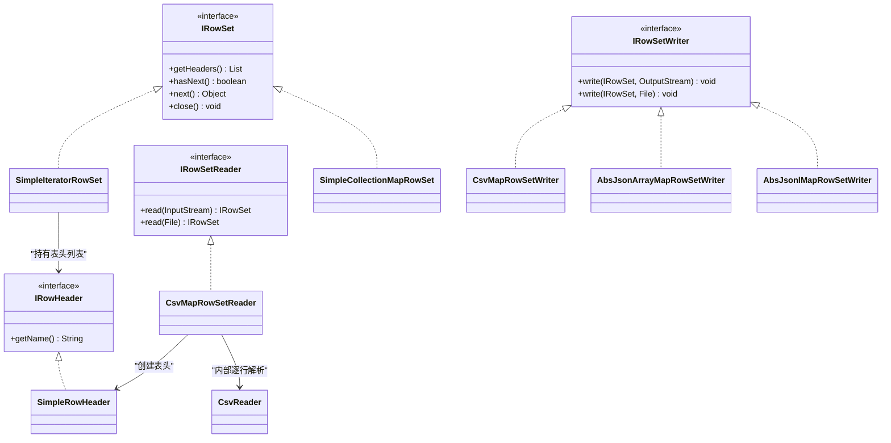
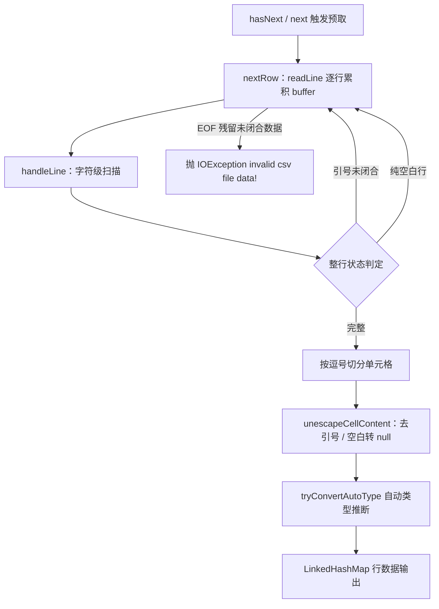
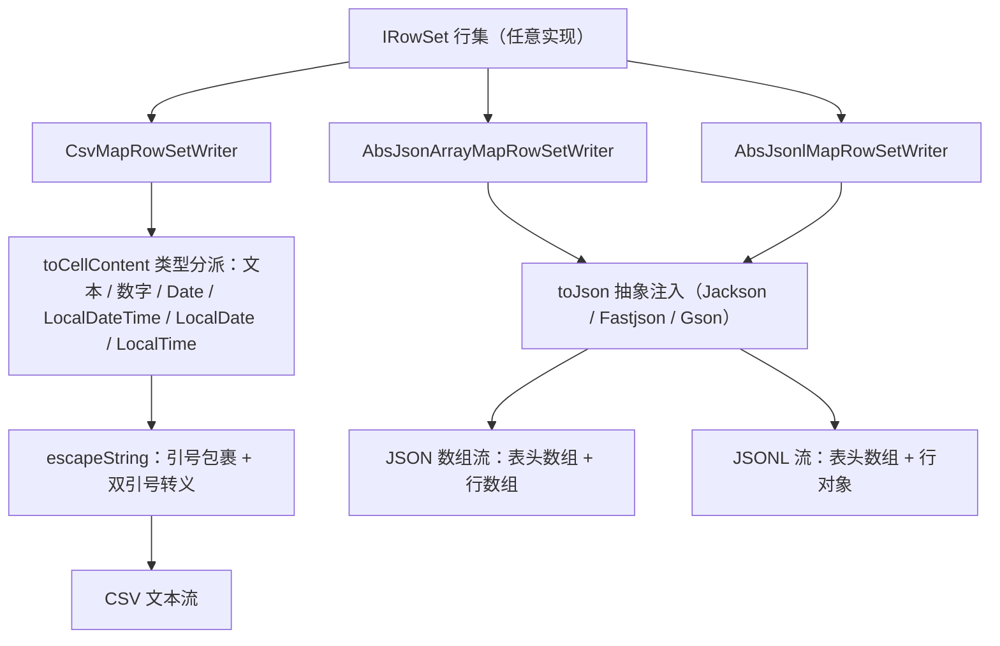

# i2f-rowset

> **表格行集流式读写契约模块**（12 源文件约 830 行、**零项目内部依赖**、仅 lombok 编译期依赖）：以 `IRowSet<T> = Iterator<T> + Closeable` 的流式行集契约为核心，把「任意可迭代表格数据」（数据库结果集、集合、流式生成器）与「任意落地格式」（CSV / JSON / JSONL）解耦。`std` 契约层给出 `IRowHeader / IRowSet / IRowSetReader / IRowSetWriter` 四接口与 `SimpleRowHeader / SimpleIteratorRowSet / SimpleCollectionMapRowSet` 三个简单实现；`impl/csv` 提供字符级状态机 `CsvReader`（引号包围、双引号转义、跨行续读）+ 自动类型推断的 `CsvMapRowSetReader` + 类型分派格式化的 `CsvMapRowSetWriter`；`impl/json` 以两个抽象 writer（数组套数组 / JSONL）把 `toJson` 注入留给使用方，不绑定具体 JSON 库。全仓唯一直接消费方为 `i2f-springboot-ops-starter` 数据源运维控制台（CSV 导出/导入）。

## 模块路径

- `i2f-jdk/i2f-rowset`

## 模块依赖

| 依赖 | Maven 坐标 | scope | optional | 说明 |
| --- | --- | --- | --- | --- |
| 项目内部依赖 | —— | —— | —— | **无**（不依赖任何 i2f 模块，亦无三方运行库） |
| lombok | `org.projectlombok:lombok` | `provided` | `true` | 编译期生成 `@Data` / `@NoArgsConstructor` 样板（版本 `1.18.44` 由根 POM `dependencyManagement` 托管） |

## 模块设计

### 四层包结构

1. **`i2f.rowset.std` 契约层**（4 接口）：`IRowHeader`（列头，仅 `getName()`）、`IRowSet<T>`（行集 = `Iterator<T>` + `Closeable`）、`IRowSetReader<T>`（`InputStream → IRowSet`，附 `File` 便捷默认方法）、`IRowSetWriter<T>`（`IRowSet → OutputStream`，附 `File` 便捷默认方法）。
2. **`i2f.rowset.std.impl` 简单实现**（3 类）：`SimpleRowHeader`（单列名）、`SimpleIteratorRowSet<T>`（包装任意 `Iterator` / `Iterable` + 表头列表）、`SimpleCollectionMapRowSet`（`Collection<Map>` 行集，可从集合首行 `keySet` 自动推断表头）。
3. **`i2f.rowset.impl.csv` CSV 实现**（3 类）：`CsvReader`（`Iterator<List<String>> + Closeable`，流式 CSV 解析）、`CsvMapRowSetReader`（CSV → `IRowSet<Map<String,Object>>`，含自动类型推断）、`CsvMapRowSetWriter`（`IRowSet<Map>` → CSV，含类型分派格式化）。
4. **`i2f.rowset.impl.json` JSON 抽象写出**（2 类）：`AbsJsonArrayMapRowSetWriter`（表头数组 + 每行一个 JSON 数组）、`AbsJsonlMapRowSetWriter`（表头数组 + 每行一个 JSON 对象），二者把 `toJson(Object)` 抽象留给使用方注入 Jackson / Fastjson / Gson 等。



### 关键设计点

- **流式迭代而非全量列表**：`IRowSet` 直接继承 `Iterator`，消费方以 `hasNext()/next()` 逐行拉取、配合 `Closeable` 释放底层资源（典型 try-with-resources），大结果集导出/导入无需全量载入内存。
- **表头与数据分离**：`getHeaders()` 返回 `List<IRowHeader>`，`IRowHeader` 只约束列名——写出方依赖表头顺序决定列序，读取方从表头（或首行）确定列名。
- **惰性首行解析**：`CsvMapRowSetReader.read()` 返回的匿名 `IRowSet` 用 `AtomicBoolean isFirst` 保证表头行只在第一次 `getHeaders()/hasNext()/next()` 时读取一次；`withHeaders=false` 时首行作为数据并以 `c1..cN` 生成表头。
- **CSV 解析状态机**（`CsvReader`）：`readLine` 逐行累积进 `StringBuffer`（`\n` 连接，支持引号内跨行）；`handleLine` 字符级扫描——`,` 分列、`"` 切换包围态、`""` 成对跳过转义；行不完整（引号未闭合/除空白外无内容）则继续读下一行；`holder` 预取缓存保证 `hasNext()/next()` 语义配对；EOF 时残留非空白数据抛 `IOException("invalid csv file data!")`。
- **读取侧自动类型推断**（`tryConvertAutoType`，开关 `tryConvertAutoType`）：`BigDecimal` 优先 → 文本 `"null"` 转 `null` → `"true"` 转 `true` → 依次尝试 `yyyy-MM-dd HH:mm:ss.SSS` / `yyyy-MM-dd HH:mm:ss` / `yyyy-MM-dd` / `HH:mm:ss` 四种日期格式（`fmtPatterns` 可配置）→ 保底返回原字符串。
- **写出侧类型分派**（`toCellContent`）：`CharSequence/Appendable` → `escapeString`；`Number` → 文本长于 8 且开启 `bigNumberToString` 才 `escapeString`（防 Excel 科学计数法）；`Date / LocalDateTime / LocalDate / LocalTime` → 各自格式器格式化后 `escapeString`；其余对象 `String.valueOf` + `escapeString`。
- **转义约定**：`escapeString` 把 `"` 双写为 `""` 并整体加引号；`escapeSpaces` 开启时把真实 `\t \n \r` 转为字面 `\t \n \r`；读写两端 `escapeSpaces` / `nullAsEmpty` 开关对称配置。
- **JSON 库无关**：JSON 写出层两个抽象类只管「行集遍历 + 格式骨架 + 换行」，`toJson(Object)` 由使用方注入具体序列化库（仓库内已备 Jackson 参考适配器）。





## 模块目的

- **统一表格数据读写契约**：用 `IRowSet` 一族接口把「数据来源」与「落地格式」解耦，来源只需提供迭代器 + 表头，格式实现只需消费迭代器 + 表头。
- **流式低内存**：迭代器拉取 + 惰性表头，支撑大结果集的 CSV 导出与 CSV 文件流式批量导入。
- **零依赖可移植**：不依赖任何 i2f 模块与三方运行库（仅 lombok 编译期），可被任意模块拎出单独使用。
- **JSON 格式开放式接入**：抽象 `toJson` 注入使 JSON 数组 / JSONL 写出不绑定序列化库。
- **实测服务于数据库运维控制台**：`i2f-springboot-ops-starter` 的 `/datasource/export`（查询结果 → CSV 下载）与 `/datasource/import`（CSV 上传 → 表结构匹配 → `${}` 绑定批量插入）即本模块的落地场景。

## 模块功能

### 契约接口（`i2f.rowset.std`）

| 接口 | 职责 | 成员 |
| --- | --- | --- |
| `IRowHeader` | 单列头（列名） | `getName()` |
| `IRowSet<T>` | 流式行集契约 | `getHeaders()`、`hasNext()`、`next()`、`close()`（默认空实现） |
| `IRowSetReader<T>` | 输入流 → 行集 | `read(InputStream)`（抽象）、`read(File)`（默认：`FileInputStream` 包装） |
| `IRowSetWriter<T>` | 行集 → 输出流 | `write(IRowSet, OutputStream)`（抽象）、`write(IRowSet, File)`（默认：写完 `close`） |

### 简单实现（`i2f.rowset.std.impl`）

| 类 | 说明 |
| --- | --- |
| `SimpleRowHeader` | 单 `name` 字段的列头（`@Data`） |
| `SimpleIteratorRowSet<T>` | 包装 `Iterator<T>` / `Iterable<T>` + 表头列表的通用行集 |
| `SimpleCollectionMapRowSet` | 包装 `Collection<Map<String,Object>>`；构造器之一从集合**首行 `keySet` 推断表头**，另一构造器接收显式表头列表 |

### CSV 读写（`i2f.rowset.impl.csv`）

| 类 | 说明 |
| --- | --- |
| `CsvReader` | 流式 CSV 解析器（`Iterator<List<String>> + Closeable`）：引号包围、双引号转义、跨行续读、EOF 残留校验；开关 `nullAsEmpty`（默认 `true`）、`escapeSpaces`（默认 `false`）；提供公开的 `unescapeCellContent(String)` 单元格还原方法 |
| `CsvMapRowSetReader` | `IRowSetReader<Map<String,Object>>` 实现；开关：`withHeaders`（默认 `true`，首行做表头，否则 `c1..cN`）、`charset`（默认 UTF-8）、`nullAsEmpty`、`escapeSpaces`、`tryConvertAutoType`（默认 `true`）、`fmtPatterns`（4 种默认日期模式） |
| `CsvMapRowSetWriter<M extends Map<String,Object>>` | `IRowSetWriter<M>` 实现；开关：`withHeaders`、`charset`、`nullAsEmpty`、`escapeSpaces`、`bigNumberToString`（默认 `true`，数字文本长于 8 才加引号）、`dateTimeFormat` / `dateFormat` / `timeFormat`（`yyyy-MM-dd HH:mm:ss` / `yyyy-MM-dd` / `HH:mm:ss`）；格式化器经**静态 ThreadLocal** 缓存 |

### JSON / JSONL 写出（`i2f.rowset.impl.json`）

| 类 | 输出形态 | 抽象成员 |
| --- | --- | --- |
| `AbsJsonArrayMapRowSetWriter<M>` | 每行一个 JSON 数组：首行为表头数组，其后为数据数组（数组套数组，整体多行 JSON 文本） | `toJson(Object)` |
| `AbsJsonlMapRowSetWriter<M>` | 行级 JSONL：可选表头数组行 + 每行一个 JSON 对象（`map` 直接序列化） | `toJson(Object)` |

仓库内已编写的使用方参考适配器（位于 `i2f-springboot-ops-starter`）：

| 适配器 | 注入库 | 接线状态 |
| --- | --- | --- |
| `JacksonJsonArrayCollectionMapRowSetWriter` | Jackson `ObjectMapper.writeValueAsString` | **已编写未接线**（全仓无引用） |
| `JacksonJsonlCollectionMapRowSetWriter` | 同上 | **已编写未接线**（全仓无引用） |

## 模块主要使用方法

### 1. CSV 导出：查询结果流式落盘

来自 `DatasourceOpsController.export`（简化）：

```java
// 数据源：任意 Iterator<Map<String,Object>>（示例来自 JDBC ResultSet 包装）
Iterator<Map<String, Object>> iterator = ...;

List<IRowHeader> headers = new ArrayList<>();
for (QueryColumn column : columns) {
    headers.add(new SimpleRowHeader(column.getName()));
}

SimpleIteratorRowSet<Map<String, Object>> rowSet = new SimpleIteratorRowSet<>(headers, iterator);
CsvMapRowSetWriter<Map<String, Object>> writer = new CsvMapRowSetWriter<>();
writer.write(rowSet, os);   // 或 writer.write(rowSet, file) 写入文件
```

### 2. CSV 导入：流式批量写库

来自 `DatasourceOpsController.doImport`（简化）：

```java
CsvMapRowSetReader reader = new CsvMapRowSetReader();
try (IRowSet<Map<String, Object>> read = reader.read(new FileInputStream(csvFile))) {
    List<IRowHeader> headers = read.getHeaders();   // 惰性解析首行表头
    // 与数据库表列做大小写无关匹配，生成 insert into ... ${列名} 绑定 SQL
    JdbcResolver.batch(conn, sql, read::next 包装为 Iterator, 300);   // 每 300 行一批
}
```

### 3. JSON / JSONL 导出：继承抽象类注入 JSON 库

```java
public class JacksonJsonlRowSetWriter<M extends Map<String, Object>>
        extends AbsJsonlMapRowSetWriter<M> {
    protected ObjectMapper mapper;

    @Override
    public String toJson(Object obj) {
        try {
            return mapper.writeValueAsString(obj);
        } catch (JsonProcessingException e) {
            throw new RuntimeException(e.getMessage(), e);
        }
    }
}
```

### 4. 自定义行集：匿名实现 IRowSet

`CsvMapRowSetReader.read()` 返回的即是匿名 `IRowSet` 实现——为任意数据源包装行集时可直接照此模式：实现 `getHeaders()/hasNext()/next()/close()` 四方法即可复用全部 writer。

### 5. 从集合快速构造行集

```java
// 显式表头
SimpleCollectionMapRowSet rowSet = new SimpleCollectionMapRowSet(
        Arrays.asList("id", "name"), rows);
// 或从首行 keySet 推断表头（注意 HashMap 顺序不稳定）
SimpleCollectionMapRowSet rowSet2 = new SimpleCollectionMapRowSet(rows);
```

### 6. 开关速查

| 开关 | 所在类 | 默认 | 作用 |
| --- | --- | --- | --- |
| `withHeaders` | Reader / Writer / JSON writer | `true` | 首行是否作为表头 / 是否写表头行 |
| `nullAsEmpty` | `CsvReader`（经 Reader 透传）、Writer | `true` | **读取**：空白单元格 → `null`；**写出**：`null` → 空字符串 |
| `escapeSpaces` | `CsvReader`、Writer | `false` | 读写时将 `\t \n \r` 与字面转义序列互转 |
| `tryConvertAutoType` | `CsvMapRowSetReader` | `true` | 自动推断 BigDecimal / true / 日期 |
| `fmtPatterns` | `CsvMapRowSetReader` | 4 种模式 | 日期推断格式集 |
| `bigNumberToString` | `CsvMapRowSetWriter` | `true` | 数字文本长于 8 时加引号（防科学计数法） |
| 日期格式三件套 | `CsvMapRowSetWriter` | 标准格式 | `Date` / `LocalDateTime` / `LocalDate` / `LocalTime` 输出格式 |
| `charset` | Reader / Writer / JSON writer | UTF-8 | 读写编码 |

### 7. 注意事项

- **先读 `getHeaders()` 再 `next()`**：表头决定 `CsvMapRowSetWriter` 的列序；数据行的 map 以列名取值（`map.get(name)`）。
- **资源管理**：`reader.read(...)` 返回的行集持有底层流，使用后必须 `close()`（try-with-resources）；`writer.write(rowSet, os)` 只 `flush` 不 `close`，输出流的关闭由调用方负责。
- **单线程消费**：行集内部状态（迭代器、预取缓存）非线程安全。

## 模块特性总结

- **零项目内部依赖**：整个模块不 import 任何 i2f 模块（仅 lombok 编译期），可独立拎出使用。
- **流式迭代 + Closeable**：行集即迭代器，配 try-with-resources 释放资源，适合大结果集导出 / 大文件导入。
- **表头惰性解析**：CSV 首行仅在首次访问表头/数据时读取一次（`AtomicBoolean` 保证），并支持无表头文件的 `c1..cN` 列名生成。
- **CSV 引号状态机**：支持引号包围、`""` 转义、引号内跨行换行、空白行跳过、EOF 残留校验。
- **双向自动转换**：读取侧 BigDecimal / 布尔 / 日期推断，写出侧类型分派格式化 + 数字防科学计数。
- **读写开关对称**：`nullAsEmpty` / `escapeSpaces` / `withHeaders` / `charset` 两端成对，方便约定回环。
- **JSON 库无关**：抽象 `toJson` 注入，Jackson 适配器已提供参考实现。
- **实测唯一直接消费方**：`i2f-springboot-ops-starter`（数据源控制台 CSV 导出/导入）。

## 下游消费方

### 直接消费（1 模块 3 源文件）

| 消费方 | 使用内容 |
| --- | --- |
| `i2f-springboot-ops-starter` / `datasource/controller/DatasourceOpsController` | `/export`：`SimpleIteratorRowSet` + `SimpleRowHeader` + `CsvMapRowSetWriter` 导出查询结果为 CSV；`/import`：`CsvMapRowSetReader.read()` 流式读取 CSV → 表列匹配 → `${}` 绑定批量插入 |
| `i2f-springboot-ops-starter` / `common/JacksonJsonArrayCollectionMapRowSetWriter` | 继承 `AbsJsonArrayMapRowSetWriter` 注入 Jackson（**已编写未接线**） |
| `i2f-springboot-ops-starter` / `common/JacksonJsonlCollectionMapRowSetWriter` | 继承 `AbsJsonlMapRowSetWriter` 注入 Jackson（**已编写未接线**） |

### 传递声明（1 模块，无直接 API 调用）

| 模块 | 链路 |
| --- | --- |
| `i2f-tools-ops` | `i2f-tools-ops → i2f-springboot-ops-starter → i2f-rowset`（pom 声明 `i2f-springboot-ops-starter`，未直接 import `i2f.rowset`） |

### POM 声明与聚合

| 位置 | 行号 | 形态 |
| --- | --- | --- |
| 根 `pom.xml` | L724-728 | `dependencyManagement` 版本托管（`${i2f.version}`） |
| `i2f-jdk/pom.xml` | L138 | 模块注册（位于 `i2f-robot` 之后、`i2f-script` 之前） |
| `i2f-jdk-all/pom.xml` | L499-502 | 全量聚合包引入 |
| `i2f-springboot-ops-starter/pom.xml` | L119-122 | 直接依赖（默认 compile 传递，无 scope / optional 限制） |
| `i2f-rowset/pom.xml` | —— | 挂 `maven-assembly-plugin`（无配置体）：继承根 POM 统一打包流程 |

### 文档互引

| 文档 | 提及 |
| --- | --- |
| `.wiki/wiki.md` | L106：归入「页面/分页」能力组（`i2f-page`, `i2f-rowset`） |
| `.wiki/docs/module-i2f-jdk.md` | L59 / L212：`i2f-rowset | 行集处理` |
| `.wiki/docs/ops-starter.md` | L47：`i2f-rowset → 行集（CSV 导入导出）` |

## 模块瑕疵或错误

1. **布尔解析不对称（实打实的 Bug）**：`CsvMapRowSetReader.tryConvertAutoType` 中 `"false"` 分支返回的是 `str`（字符串 `"false"`）而非 `false`——只有 `"true"` 会变成布尔；写出端 `Boolean false → "false" →` 读回为字符串，双向往返类型漂移（疑为笔误 `return str;` 应为 `return false;`）。
2. **`nullAsEmpty` 同名反义**：读取端（`CsvReader.unescapeCellContent`）`nullAsEmpty=true` 时空白单元格返回 **`null`**（空 → null）；写出端（`CsvMapRowSetWriter.nullString`）`nullAsEmpty=true` 时 `null` 输出**空字符串**（null → 空）。两侧开关同名、方向相反，极易误配。
3. **数据行比表头长时越界**：`CsvMapRowSetReader` 匿名行集的 `next()` 以 `headers.get(i)` 按数据列数取列头，ragged CSV（数据行单元格数 > 表头列数）会抛 `IndexOutOfBoundsException`；表头行本身也无去重/长度兜底。
4. **`unescapeCellContent` 首引号即截尾**：只要 `trim()` 后以 `"` 开头就执行 `substring(1, length-1)`，不校验尾字符是否引号——`"a` 会丢末尾字符返回 `""`，单字符 `"` 直接 `StringIndexOutOfBoundsException`（正常解析路径下未闭合引号会被攒行，此缺陷主要影响公开方法直调）。
5. **静态 ThreadLocal 格式化器与实例格式字段串扰**：`CsvMapRowSetWriter` 的 `SDF` / `DATETIME_FORMATTER` 等为 **static ThreadLocal**，而 `dateTimeFormat` 等模式串是**实例字段**——同一线程先后使用不同 `dateTimeFormat` 的两个实例时，第二个实例直接复用第一个实例缓存的 formatter，自定义格式**静默失效**；ThreadLocal 也永不清理。
6. **引号前内容静默丢弃**：`CsvReader.handleLine` 中未处于包围态时遇到 `"` 会以该位置重置 `lastIdx`，`ab"cd"` 这类畸形输入的前缀 `ab` 被静默丢弃（结果为 `cd`），无告警。
7. **文本类型无法保真往返**：读取端去掉引号后统一走类型推断，写出端字符串会被加引号、但读取端不区分「引号包裹的文本」与裸文本——字符串 `"123"` / `"null"` / `"true"` 读回后变成 `BigDecimal(123)` / `null` / `true`，与原始文本类型不再一致。
8. **File 便捷方法的资源管理缺陷**：`IRowSetWriter.write(rowSet, File)` 默认实现在 `write` 抛出异常时不会关闭 `FileOutputStream`（无 try-finally）；`IRowSetReader.read(File)` 则把 `FileInputStream` 的关闭责任隐含转移给返回的行集（实现方不覆盖 `close()` 即泄漏），契约未明示。
9. **JSON 写出层重复与死代码**：两个 Abs 抽象类（含 `escapeSpaces`、`withHeaders`、`charset`、write 骨架）约九成重复未抽公共基类；`i2f-springboot-ops-starter` 中两个 Jackson 适配器编写后**未接线**（无端点/调用方）；JSONL 形态的表头行仍输出 JSON 数组（与行对象形态不一致）。
10. **表头重复列名与推断顺序不稳**：`CsvMapRowSetReader.next()` 用 `LinkedHashMap` 以列名做键，**同名列后者覆盖前者**（静默丢列）；`SimpleCollectionMapRowSet` 从首行 `keySet` 推断表头，`HashMap` 行数据会导致表头顺序不稳定。

## 可拓展方向

- **JSON / JSONL 读取**：当前仅提供写出抽象，可补 `IRowSetReader` 实现（Jackson 适配器已具备注入能力）。
- **Jackson 适配器接线**：为 ops-starter 增加 JSON / JSONL 导出端点，或将适配器上移模块内提供。
- **ragged 行策略**：表头长度守卫 + 可配置的填充 / 截断策略，替代越界异常。
- **类型推断细粒度开关**：数字 / 布尔 / 日期独立开关（当前一个 `tryConvertAutoType` 全开全关）并修正 `"false"` 缺陷。
- **转义与格式器治理**：`escapeSpaces` 与引号转义的 RFC 4180 兼容性梳理；格式化器缓存改为实例级（或模式串作键的实例缓存）消除 ThreadLocal 串扰。
- **公共基类抽取**：合并两个 JSON Abs writer 的公共骨架。
