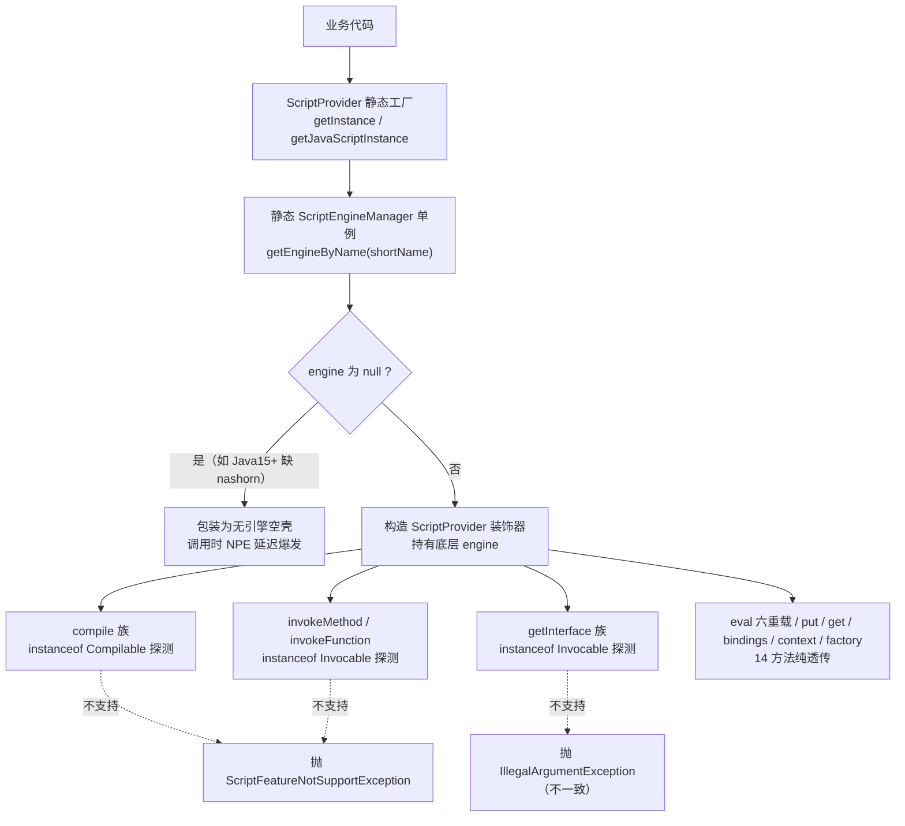
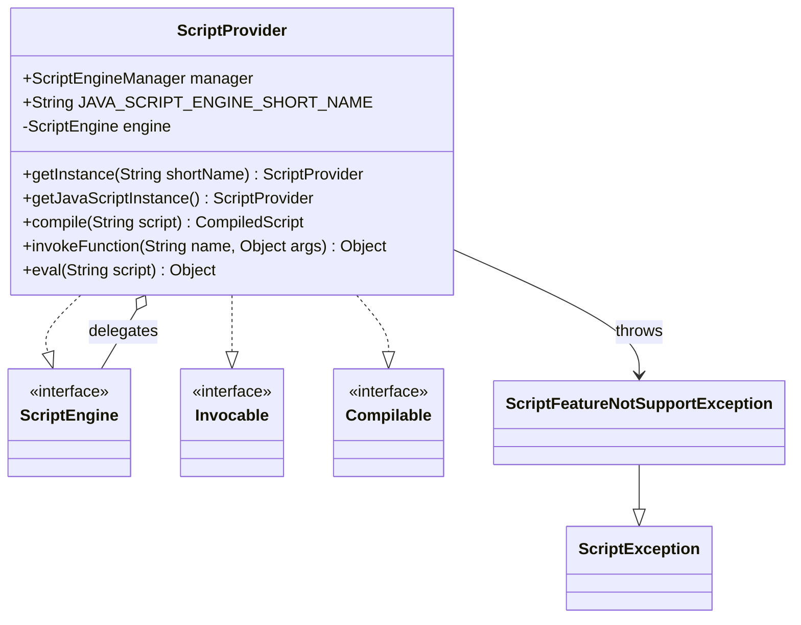

# i2f-script

> **JSR-223 脚本引擎统一门面**（4 源文件约 280 行、零项目内部依赖）：`ScriptProvider` 以装饰器方式包装任意 `javax.script.ScriptEngine`，同时实现 `ScriptEngine` + `Invocable` + `Compilable` 三个 JSR-223 接口，把分散的「执行 / 调函数 / 编译复用」三类能力聚合为单一门面；`compile`/`invokeMethod`/`invokeFunction` 调用前先做 `instanceof` 特性探测，不支持时抛出自定义 `ScriptFeatureNotSupportException`（继承 `ScriptException`），其余 14 个方法全部透传底层引擎。静态工厂 `getJavaScriptInstance()` 一行接入 JDK 内置 Nashorn（Java 15+ 需自行补 `nashorn-core` 15.4）。全仓唯一源码级消费方为 `i2f-extension-xproc4j`（`LangEvalJavascriptNode` 的 `<lang-eval-javascript>` 求值 + `LangEvalJavaNode` 动态编译 import 注入）。⚠ 主要瑕疵：引擎获取为 null 时静默构造、NPE 延迟爆发（Java15+ 未补 nashorn 即中招）、三接口无条件实现致 `instanceof Compilable` 探测失真、`getInterface` 异常类型与其余守卫不一致、lombok 声明冗余——详见下文。

## 模块路径

- `i2f-jdk/i2f-script`

## 模块依赖

| 坐标 | 用途 | scope | optional |
| --- | --- | --- | --- |
| （项目内部依赖） | 无——不依赖任何 i2f 模块 | —— | —— |
| `org.projectlombok:lombok` | 根 POM 统一托管（1.18.44）；⚠ 模块源码零 lombok 注解，**声明冗余未使用** | provided | true |
| `org.openjdk.nashorn:nashorn-core:15.4` | **仅 Java 15+ 环境需要**（Nashorn 随 JDK 15 被正式移除）；Java 8~14 使用 JDK 内置 JavaScript 引擎，无需添加；provided+optional 不向下游传递 | provided | true |

- `i2f-script/pom.xml` 的 nashorn 依赖自带注释原文：「如果 Java 环境高于 java15，则需要添加此依赖，否则不要添加，原因是 nashorn 的 JavaScript 引擎在 java15 被正式移除」；
- 本模块是少数「零项目内部依赖」的就绪型模块之一（同 `i2f-rowset`），且运行期实际依赖完全由宿主 JDK / 可选 nashorn 决定。

## 模块设计

**1. 三接口聚合门面（装饰器 / 委托模式）**

- 构造注入任意 `ScriptEngine`（`ScriptProvider(ScriptEngine engine)`），自身实现 `ScriptEngine` + `Invocable` + `Compilable` 三接口共 **20 个方法**；
- 除受特性探测守卫的 `compile`/`invoke*`/`getInterface` 两组（6 方法）外，其余 **14 个方法**（`eval` 六重载、`put`/`get`、`getBindings`/`setBindings`/`createBindings`、`getContext`/`setContext`、`getFactory`）全部一行透传底层引擎。

**2. 运行时特性探测守卫**

- `compile(String)`/`compile(Reader)`：先 `engine instanceof Compilable`，不满足抛 `ScriptFeatureNotSupportException`；
- `invokeMethod`/`invokeFunction`：先 `engine instanceof Invocable`，不满足抛 `ScriptFeatureNotSupportException`；
- `getInterface(Class)`/`getInterface(Object, Class)`：同样探测 `Invocable`，但抛的是 `IllegalArgumentException`——**同一语义两套异常类型**（见瑕疵 3）。

**3. 静态工厂族与全局 manager**

- `public static final ScriptEngineManager manager`：全局单例（类加载时构造，触发 JSR-223 SPI 引擎发现）；
- `getEngine(String shortName)` → `manager.getEngineByName(shortName)`（**查不到返回 null，无兜底**）；
- `getJavaScriptEngine()` = `getEngine("JavaScript")`（短名常量 `JAVA_SCRIPT_ENGINE_SHORT_NAME`）；
- `getInstance(shortName)` / `getJavaScriptInstance()`：把引擎包装为 `ScriptProvider`（同样不校验 null）。

**4. 异常体系**

- `ScriptFeatureNotSupportException extends javax.script.ScriptException`，四构造器：message / cause / message+fileName+lineNumber / message+fileName+lineNumber+columnNumber——可直接携带脚本错误定位信息。

**5. 包结构（3 包 4 类）**

| 包 | 类 | 职责 |
| --- | --- | --- |
| `i2f.script` | `ScriptProvider` | 门面主体：三接口实现 + 四静态工厂 |
| `i2f.script.exception` | `ScriptFeatureNotSupportException` | 特性不支持异常（继承 `ScriptException`） |
| `i2f.script.test` | `TestScriptEngine` / `TestScriptProvider` | 两个 `main` 演示（原生 JSR-223 用法 vs 本门面用法），位于 **src/main/java，随构件发布** |





## 模块目的

- **抹平 JSR-223 的接口分裂**：`ScriptEngine`/`Invocable`/`Compilable` 本是三个独立接口，使用方需自行 `instanceof` + 强转；门面一次包装即统一类型，编译期即可直接调用三类能力；
- **把「能力缺失」变成显式信号**：不支持编译/调函数时抛出带语义的 `ScriptFeatureNotSupportException`（而非裸 `ClassCastException`）；
- **JavaScript 场景开箱即用**：`getJavaScriptInstance()` 一行接入 JDK 内置 Nashorn（Java 8~14），为规则表达式、动态求值提供最短路径；
- **引擎无关**：任何注册到 `ScriptEngineManager` 的引擎（JavaScript/Groovy/Jython 等）均可包装，为 `xproc4j` 多语言求值节点提供统一入口。

## 模块功能

### 静态工厂与常量（4 方法 + 2 常量）

| 签名 | 说明 |
| --- | --- |
| `static ScriptEngine getEngine(String shortName)` | 按短名查询引擎；**查不到返回 `null`** |
| `static ScriptEngine getJavaScriptEngine()` | 等价 `getEngine("JavaScript")`；Java 8~14 返回 Nashorn |
| `static ScriptProvider getInstance(String shortName)` | 按短名包装为门面（null 引擎不校验） |
| `static ScriptProvider getJavaScriptInstance()` | 包装 JavaScript 引擎——最常用入口（xproc4j 即用此） |
| `static final ScriptEngineManager manager` | 全局引擎管理器单例（JSR-223 SPI 发现） |
| `static final String JAVA_SCRIPT_ENGINE_SHORT_NAME` | 常量 `"JavaScript"` |

### `ScriptEngine` 接口实现（14 方法，全部透传）

| 分组 | 方法 | 说明 |
| --- | --- | --- |
| 执行 | `eval(String)` / `eval(Reader)` / `eval(String, ScriptContext)` / `eval(Reader, ScriptContext)` / `eval(String, Bindings)` / `eval(Reader, Bindings)` | 六重载直连引擎；`ScriptException` 原样上抛 |
| 变量 | `put(String, Object)` / `get(String)` | 引擎级全局变量读写 |
| 绑定 | `getBindings(int)` / `setBindings(Bindings, int)` / `createBindings()` | 作用域绑定管理 |
| 上下文 | `getContext()` / `setContext(ScriptContext)` | 脚本上下文读写 |
| 工厂 | `getFactory()` | 返回底层引擎的 `ScriptEngineFactory` |

### `Invocable` 接口实现（4 方法，2 方法带守卫）

| 签名 | 守卫行为 |
| --- | --- |
| `invokeMethod(Object thiz, String name, Object... args)` | 非 `Invocable` 引擎 → 抛 `ScriptFeatureNotSupportException` |
| `invokeFunction(String name, Object... args)` | 非 `Invocable` 引擎 → 抛 `ScriptFeatureNotSupportException` |
| `getInterface(Class<T>)` | 非 `Invocable` 引擎 → 抛 **`IllegalArgumentException`**（不一致） |
| `getInterface(Object thiz, Class<T>)` | 同上 |

### `Compilable` 接口实现（2 方法，带守卫）

| 签名 | 守卫行为 |
| --- | --- |
| `compile(String script)` | 非 `Compilable` 引擎 → 抛 `ScriptFeatureNotSupportException` |
| `compile(Reader script)` | 同上 |

### 异常（4 构造器）

| 构造器 | 说明 |
| --- | --- |
| `ScriptFeatureNotSupportException(String s)` | 仅消息 |
| `ScriptFeatureNotSupportException(Exception e)` | 包装原因异常 |
| `ScriptFeatureNotSupportException(String, String, int)` | 消息 + 文件名 + 行号 |
| `ScriptFeatureNotSupportException(String, String, int, int)` | 再带列号 |

### 演示主类（2）

| 类 | 演示内容 |
| --- | --- |
| `TestScriptEngine` | **原生 JSR-223 范式**：`manager.getEngineByName("JavaScript")` → `eval` → `instanceof Invocable` 强转调 `invokeFunction` → `instanceof Compilable` 编译 → `put`/`get` 传参取参 |
| `TestScriptProvider` | **门面范式**：`ScriptProvider.getJavaScriptInstance()` 一行接入后重复上述场景（无强转） |

## 模块主要使用方法

### 1. JavaScript 一行接入

```java
ScriptProvider provider = ScriptProvider.getJavaScriptInstance();
Object ret = provider.eval("1 + 2 * 3;");       // 7（Integer）
provider.eval("print('Hello, World!');");        // Nashorn 的 print 输出到标准输出
```

### 2. 传参、取参与独立 Bindings

```java
ScriptProvider provider = ScriptProvider.getJavaScriptInstance();

// 方式一：引擎级变量
provider.put("name", "John");
provider.eval("var upperCaseName = name.toUpperCase();");
Object upper = provider.get("upperCaseName");    // "JOHN"

// 方式二：独立绑定作用域（推荐，避免引擎全局污染）
Bindings bindings = provider.createBindings();
bindings.put("a", 1);
bindings.put("b", 2.5);
Object sum = provider.eval("a + b;", bindings);  // 3.5（1 被提升为 Double）
```

### 3. 调用脚本中的函数（Invocable）

```java
ScriptProvider provider = ScriptProvider.getJavaScriptInstance();
provider.eval("function add(a, b) { return a + b; }");
Object ret = provider.invokeFunction("add", 1, 2);   // 3
```

### 4. 编译复用（Compilable）

```java
ScriptProvider provider = ScriptProvider.getJavaScriptInstance();
CompiledScript compiled = provider.compile("Math.pow(x, 2);");

Bindings bindings = provider.createBindings();
bindings.put("x", 5);
Object ret = compiled.eval(bindings);                // 25.0
```

### 5. 桥接为 Java 接口（getInterface，实验性）

```java
public interface MathOps {
    int sub(int a, int b);
}

ScriptProvider provider = ScriptProvider.getJavaScriptInstance();
provider.eval("function sub(a, b) { return a - b; }");
MathOps ops = provider.getInterface(MathOps.class);  // 脚本全局函数按名称绑定接口方法
int r = ops.sub(5, 3);                               // 2
```

注意：该路径依赖引擎对 `Invocable.getInterface` 的实现（Nashorn 支持）；能力缺失时抛的是 `IllegalArgumentException` 而非 `ScriptFeatureNotSupportException`。

### 6. 包装其他脚本引擎

```java
ScriptProvider groovy = ScriptProvider.getInstance("groovy");  // 需引擎实现已注册到 classpath
ScriptProvider js = ScriptProvider.getInstance("js");          // Nashorn 亦注册 "js"/"nashorn" 等短名
```

注意：短名不存在时 `getEngine` 返回 `null`，`getInstance` 不校验——得到的是调用即 NPE 的空壳（见瑕疵 1）。

### 7. Java 15+ 环境准备

```xml
<dependency>
    <groupId>org.openjdk.nashorn</groupId>
    <artifactId>nashorn-core</artifactId>
    <version>15.4</version>
</dependency>
```

- Java 8~14：无需任何附加依赖（JDK 内置 Nashorn）；
- Java 15+：不添加该依赖时 `getJavaScriptInstance()` 返回空壳，首次 `eval` 才以 NPE 暴露（排查成本高，建议启动期自检）。

### 8. 注意事项

- **线程安全**：JSR-223 引擎（尤其 Nashorn）**非线程安全**，门面未做任何同步——多线程场景应每线程独立实例，禁止共享单例；
- **异常处理**：`eval`/`invoke*`/`compile` 抛受检 `ScriptException`（含文件名/行号）；若脚本上下文有业务信号语义，可仿照 xproc4j 包装为业务异常（`ThrowSignalException`）；
- **资源形态**：`ScriptProvider` 不实现 `Closeable`，也无可取回底层引擎的 getter。

## 模块特性总结

- **4 源文件约 280 行**：单一门面类 166 行 + 异常 27 行 + 两个演示主类 88 行；
- **零项目内部依赖**：不依赖任何 i2f 模块；
- **三接口聚合**：`ScriptEngine`+`Invocable`+`Compilable` 一次包装统一暴露，省去调用方 `instanceof` + 强转样板；
- **特性探测守卫**：`compile`/`invoke*` 前置能力检查并抛语义化异常（`getInterface` 例外，抛 `IllegalArgumentException`）；
- **静态工厂 + 全局 manager**：类加载即完成 JSR-223 引擎 SPI 发现；
- **15 个透传方法零加工**：`eval` 六重载与绑定/上下文管理均直连底层；
- **自定义异常携带脚本定位信息**：`fileName`/`lineNumber`/`columnNumber` 四构造器；
- **Java15+ 一键补齐**：可选 `nashorn-core` 15.4（provided+optional）适配新 JDK；
- **演示主类随构件发布**：`i2f.script.test` 包两个 `main` 混在主源码树。

## 下游消费方

### 直接消费（1 模块 2 文件）

| 模块 | 文件 | 用法 |
| --- | --- | --- |
| `i2f-extension-xproc4j` | `LangEvalJavascriptNode.java` | `ScriptProvider.getJavaScriptInstance()` + `createBindings()` 求值 `<lang-eval-javascript>`/`<lang-eval-js>` XML 标签；`ScriptException` 包装为 `ThrowSignalException`；同时实现 `EvalScriptProvider` 供 `js`/`JavaScript` 多语言路由 |
| `i2f-extension-xproc4j` | `LangEvalJavaNode.java` | 仅取 `ScriptProvider.class.getName()`，把 `i2f.script.*` 包通配 import **注入动态编译的 Java 脚本代码段**（`MemoryCompiler`），使脚本可直接使用 `ScriptProvider`——不直接调用其方法 |

`LangEvalJavascriptNode` 核心用法（实证源码）：

```java
public static Object evalJavascript(String script, Object context, JdbcProcedureExecutor executor) {
    ScriptProvider provider = ScriptProvider.getJavaScriptInstance();
    Bindings bindings = provider.createBindings();
    bindings.put("executor", executor);
    bindings.put("params", context);
    try {
        return provider.eval(script, bindings);
    } catch (ScriptException e) {
        throw new ThrowSignalException(e.getMessage(), e);
    }
}
```

`LangEvalJavaNode` 的注入方式（`castAsImportPackageName` 将类名转为包通配）：

```java
.append("import ").append(castAsImportPackageName(ScriptProvider.class.getName())).append(";").append("\n")
// 生成：import i2f.script.*;   → 动态编译的 Java 脚本可引用 ScriptProvider
```

### 依赖链与 POM 声明

| 位置 | 行 | 说明 |
| --- | --- | --- |
| 根 `pom.xml` | L729-733 | `dependencyManagement` 版本托管（`${i2f.version}`） |
| `i2f-jdk/pom.xml` | L139 | 模块注册 |
| `i2f-jdk/i2f-jdbc-procedure/pom.xml` | L72-75 | **编译级依赖声明**（无 scope/optional 修饰）；⚠ 该模块源码零 `i2f.script` 引用——实际作用是为下游 xproc4j 传递供应（其动态生成代码需 `import i2f.script.*` 可编译、JS 节点需运行期可用） |
| `i2f-jdk/i2f-jdk-all/pom.xml` | L505 | 全量聚合包引入 |
| `i2f-script/pom.xml` | —— | 挂 `maven-assembly-plugin`（无配置体）：继承根 POM `pluginManagement`（3.1.0，`jar-with-dependencies` + `appendAssemblyId=false`），产出 `i2f-script-1.0-jdk8.jar`；因运行时依赖均为 provided/optional，胖包实际只含模块自身类；**无 Main-Class，非可执行 jar** |

传递链：`i2f-springboot-xproc4j-starter` → `i2f-extension-xproc4j` → `i2f-jdbc-procedure` → `i2f-script`。另注意 `i2f-extension-xproc4j` 自身也声明了 `nashorn-core`（provided+optional），即 Java 15+ 下由扩展侧补齐引擎实现。

### 误报说明与文档互引

- 全仓 `ScriptProvider` 字面量扫描的多数命中为 `EvalScriptProvider`（jdbc-procedure 自有接口）与 `VelocityScriptProvider`（velocity 扩展内部接口）**同名子串误报**，均已逐一核实非本模块类型；
- `.wiki/wiki.md` L97「反射/编译」行与 `.wiki/docs/module-i2f-jdk.md` L144 旧列表均已登记本模块（脚本引擎）。

## 模块瑕疵或错误

1. **引擎为 null 静默构造、NPE 延迟爆发**：`getEngine` 查不到引擎返回 `null`（L23-26 无兜底），`getInstance`（L32-34）与构造器（L19-21）均不校验——Java 15+ 未补 `nashorn-core` 时 `getJavaScriptInstance()` 返回「空壳门面」，首次 `eval`/`put` 才以 `NullPointerException` 暴露，且堆栈指向透传行而非根因（工厂缺 fail-fast 与启动自检）。
2. **三接口无条件实现致 `instanceof` 探测失真**：`ScriptProvider` 恒为 `Compilable`/`Invocable`/`ScriptEngine` 实例——外部若沿用 JSR-223 惯用安全分支 `if (provider instanceof Compilable)` 将**永远为 true**，把「编译期可探测能力」退化为「运行时异常兜底」，恰与门面宣称的守卫语义自相矛盾。
3. **异常契约不一致**：`compile`/`invokeMethod`/`invokeFunction` 不支持时抛 `ScriptFeatureNotSupportException`，而 `getInterface`×2（L77-92）抛 `IllegalArgumentException`——同一「引擎能力缺失」语义两套异常类型，调用方无法统一捕获。
4. **守卫样板四份重复**：每个受守卫方法各自内联 `instanceof` + 强转 + 拼接异常消息，未抽公共断言方法（`requireCompilable()` 之类），实现层冗余且易漏改。
5. **lombok 依赖声明冗余**：pom 声明 `org.projectlombok:lombok`，但模块源码零 lombok 注解与引用——死依赖（与 `i2f-resources` 冗余声明 `i2f-match` 同类问题）。
6. **演示类混入主源码树**：`i2f.script.test.TestScriptEngine`/`TestScriptProvider` 位于 `src/main/java` 且含 `main`，随正式构件发布污染 API 面；其中 `TestScriptEngine` 演示的是**原生 JSR-223 范式**而非本门面，示范价值与包归属均欠妥。
7. **异常类无 `serialVersionUID`**：`ScriptException` 实现 `Serializable`，子类未声明 `serialVersionUID`，编译器产生告警。
8. **底层引擎不可取回**：`engine` 私有且无 getter——无法访问被包装引擎的原生扩展能力，也无法参与资源释放；门面亦未实现 `Closeable`。
9. **仅按 name 查询 + 全局静态 manager**：不支持 `getEngineByExtension`/`getEngineByMimeType` 维度；静态 `manager` 在应用服务器多 ClassLoader 环境下存在 JSR-223 引擎注册可见性问题的经典隐患，门面无任何缓解或说明。
10. **无线程安全说明与防护**：JSR-223 引擎（尤其 Nashorn）非线程安全，门面既无同步也无文档提示；配合 `getJavaScriptInstance()` 的便利工厂，极易被误作线程安全工具共享使用。
11. **零测试覆盖**：无 `src/test` 目录；两个 `main` 演示无断言、不可回归，`ScriptFeatureNotSupportException` 分支、null 引擎路径、守卫一致性等均无自动化验证。

## 可拓展方向

- **工厂 fail-fast**：`getInstance`/构造器对 null 引擎抛明确异常（或提供 `Optional` 版本），并为 JavaScript 场景提供「启动期可用性自检」方法；
- **显式能力查询**：暴露 `isCompilable()`/`isInvocable()` 委托探测，替代失真的 `instanceof` 判定；
- **统一异常契约**：`getInterface` 归并到 `ScriptFeatureNotSupportException`；
- **资源与访问器**：增加 `engine()` getter 与 `Closeable` 支持，便于取回原生能力与释放资源；
- **守卫重构**：抽公共断言方法消除四份重复样板；
- **工程卫生**：演示类迁移至 `src/test`（或独立示例模块），移除冗余 lombok 声明，补 `serialVersionUID`；
- **引擎维度扩展**：提供按扩展名/MIME 查询的工厂与短名常量表；
- **编译缓存门面**：按脚本内容缓存 `CompiledScript`（Nashorn 编译成本可观），对齐 xproc4j 场景的高频求值需求。
