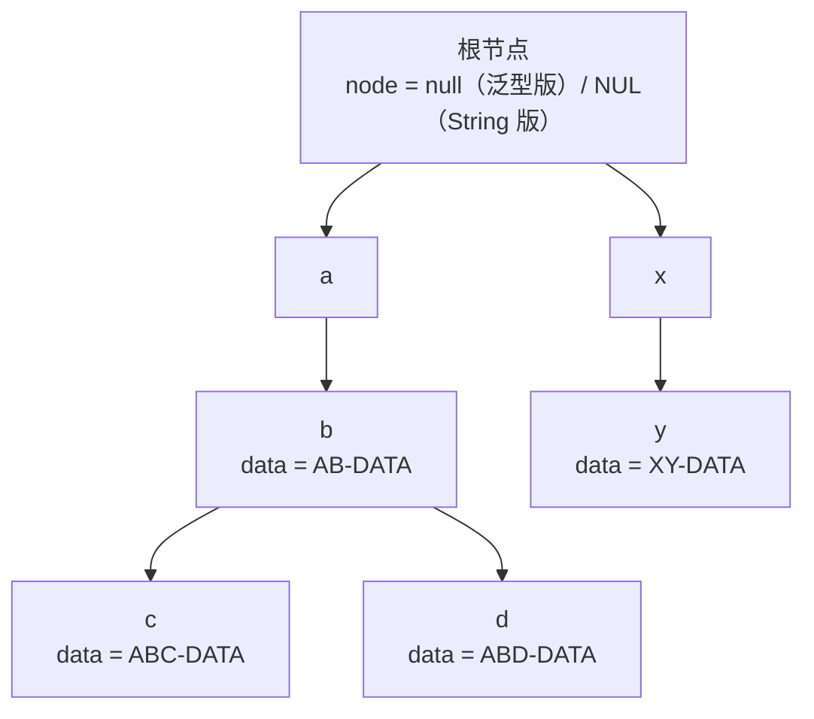
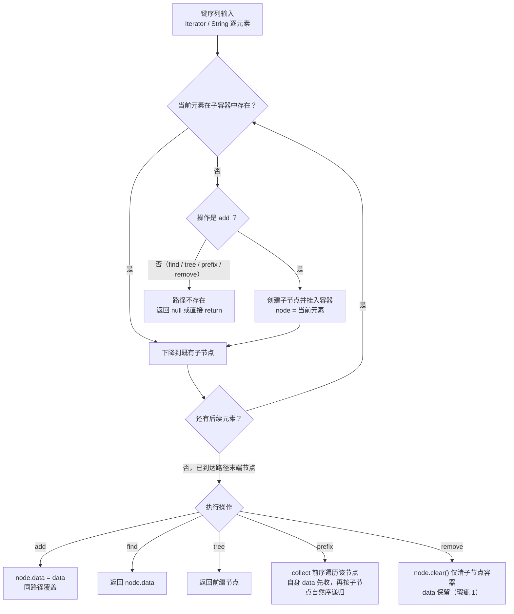

# i2f-search

> **极简前缀索引树（Trie / 字典树）双形态**（2 源文件约 265 行、零三方依赖）：`PrefixSearchTree<T, D>` 以任意元素序列（`Iterator<T>`）为键路径、`StringSearchTree<D>` 为 String 键逐字符特化版，均以 `ConcurrentSkipListMap` 作有序子节点容器，提供 `add` 挂载（同键覆盖）/ `find` 精确查找 / `prefix` 前缀批量召回 / `collect` 有序全量导出 / `printTree` ASCII 树形打印 / `remove` 删除 / `clear` 清空。子节点自然序 + 前序遍历 ⇒ 召回与导出结果天然按键排序（字典序）；空迭代器约定为根节点操作。全仓**零源码消费方**（仅 POM 声明 4 处，经 `i2f-jdk-all` 聚合发布）。⚠ 主要瑕疵：`remove` 只清子树不删自身 `data`（叶子路径删除为**完全空操作**、中间节点留空壳）、null 键 NPE 与非 `Comparable` 键 `ClassCastException` 延迟爆发、两棵树约 90% 重复代码——详见下文。

## 模块路径

- `i2f-jdk/i2f-search`

## 模块依赖

| 坐标 | 用途 | scope | optional |
| --- | --- | --- | --- |
| （项目内部依赖） | 无——不依赖任何 i2f 模块 | —— | —— |
| `org.projectlombok:lombok` | 根 POM 统一托管；⚠ 模块源码零 lombok 注解，**声明冗余未使用** | provided | true |

- 运行期仅用 JDK 原生类：`ConcurrentSkipListMap` / `LinkedList` / `PrintStream` / `Iterator`，与 `i2f-script`、`i2f-rowset` 同属少数「零项目内部依赖」的就绪型模块；
- 打包为 `maven-assembly-plugin` 标准构件（根 POM 统一配置）。

## 模块设计

**1. Trie（前缀树 / 字典树）双形态**

- `PrefixSearchTree<T, D>`：泛型版——键是**任意类型元素的序列**（`Iterator<T>`，如多级路径 token），数据 `D` 挂载在路径末端节点；
- `StringSearchTree<D>`：String 特化版——逐 `char`（`charAt`）下沉，子容器为 `ConcurrentSkipListMap<Character, ...>`；
- 两棵树方法一一对应，`StringSearchTree<D>` 实质等价于 `PrefixSearchTree<Character, D>` 的扁平 API 版本（约 90% 代码重复，见瑕疵 6）。

**2. ConcurrentSkipListMap 有序子节点容器（核心选型）**

- 每个节点持有 `private ConcurrentSkipListMap<K, Node> tree`；
- 收益一 **自然序**：子节点按 key 自然序排列，前序遍历 ⇒ `collect`/`prefix` 输出**字典序**；
- 收益二 **并发安全读**：`get`/`entrySet` 遍历无锁；
- 代价：key 必须 `Comparable`（泛型未约束，非 Comparable 键延迟到 `put` 抛 `ClassCastException`）；**不允许 null 键**（null 键直接 NPE）——见瑕疵 2。

**3. 前序遍历收集（Preorder collect）**

- `collect(node, list)` 递归：先收 `node.data`（非 null 才收），再按子节点自然序递归；
- `prefix(iter)` = 定位前缀节点 → 收集该节点及其全部子孙——**端点自身数据也包含在结果内**（「前缀含端点」语义）；
- `collect()` = 从根收集全树；`LinkedList` 承载结果。

**4. 空序列 = 根节点操作（边界约定）**

- `add(空迭代器, data)` 把数据直接挂到根节点；`find(空迭代器)` 返回根数据；`prefix(空迭代器)` 返回全树——根可当作「空前缀」使用（无注释/文档说明，纯约定）。

**5. printTree 调试打印**

- ASCII 树形输出：每级缩进 `|-`，挂载数据行前缀 `>/ `；
- ⚠ 打印根不一致：`PrefixSearchTree` 根 `node` 为 null，首行打印字面 "null"；`StringSearchTree` 根 `node` 为 char 默认值 `\0`（NUL 控制字符，终端表现为空行）——见瑕疵 8。

**6. 包结构（1 包 2 类）**

| 包 | 类 | 职责 |
| --- | --- | --- |
| `i2f.search.prefix` | `PrefixSearchTree<T, D>` | 泛型键序列前缀树（135 行） |
| `i2f.search.prefix` | `StringSearchTree<D>` | String 键特化版（130 行） |



> 上图对应文档探针实证的树形（依次 add `(a,b)→AB-DATA`、`(a,b,c)→ABC-DATA`、`(a,b,d)→ABD-DATA`、`(x,y)→XY-DATA`）；此时 `prefix(a)` 返回 `[AB-DATA, ABC-DATA, ABD-DATA]`——前序遍历（端点在先）+ 子节点自然序。



## 模块目的

- **为「前缀召回」提供最小实现**：自动补全候选、词表/字典索引、多级配置路径、路由前缀匹配等场景，`add` 挂数据 + `prefix` 一次召回，纯 JDK 实现不必引入 Guava 等重库；
- **天然有序输出**：利用 `ConcurrentSkipListMap` 自然序，召回/全量导出**免二次排序**；
- **双键形态覆盖两类用法**：多级 token 序列（泛型版）与普通字符串（String 版）各取所需；
- **调试友好**：`printTree` 直接打印 ASCII 树形，便于排查索引结构。

## 模块功能

### `PrefixSearchTree<T, D>`（泛型键序列版）

| 分组 | 方法 | 说明 |
| --- | --- | --- |
| 写入 | `add(Iterator<T> iter, D data)` | 沿键路径逐级建节点，末端节点挂 `data`；同路径重复 add 覆盖 |
| 查询 | `find(Iterator<T> iter)` | 精确定位返回 `data`；路径不存在返回 `null`（与 data 本身为 null 不可区分） |
| 查询 | `tree(Iterator<T> iter)` | 返回前缀节点本体（可取子树操作）；路径不存在返回 `null` |
| 查询 | `prefix(Iterator<T> iter)` | 前缀节点及其全部子孙的 `data` 列表（**含端点自身**、按键序）；路径不存在返回 **`null`** |
| 查询 | `collect()` | 全树 `data` 有序列表（前序遍历） |
| 维护 | `remove(Iterator<T> iter)` | ⚠ 仅清目标节点子容器，`data` 不删（瑕疵 1） |
| 维护 | `clear()` | 清空当前节点子容器（`data` 同样保留） |
| 输出 | `printTree(PrintStream out)` | ASCII 树形打印（`|-` 缩进、`>/ ` 数据行） |
| 数据 | `getData()` / `setData(D)` | 当前节点数据读写 |
| 辅助 | `collect(PrefixSearchTree<T, D> node, List<D> list)` | 递归收集辅助——⚠ 以 public 实例方法暴露（瑕疵 5） |

### `StringSearchTree<D>`（String 特化版）

与上表同构，入参从 `Iterator<T>` 换为 `String`（内部 `charAt` 逐字符）：

| 方法 | 说明 |
| --- | --- |
| `add(String str, D data)` | 逐字符建树挂数据 |
| `find(String str)` / `tree(String str)` | 精确查找 / 取前缀节点 |
| `prefix(String str)` | 前缀召回（含端点、有序；不存在返回 null） |
| `collect()` / `clear()` / `printTree(PrintStream out)` | 同泛型版 |
| `remove(String str)` | ⚠ 同泛型版的 remove 瑕疵 |

### 实证行为速查（运行时探针验证）

| 场景 | 结果 |
| --- | --- |
| `prefix("ab")`（String 树含 abc/abd） | `[ABC, ABD]`——**有序**；端点 b 无数据故不含 |
| 泛型版 `prefix(a,b)`（b 自身有数据） | `[AB-DATA(b), ABC-DATA(c), ABD-DATA(d)]`——端点数据最先 |
| 同路径重复 `add` | 后写覆盖前值（`find` 返回 `NEW`） |
| `remove("abc")` 后 `find("abc")` | **仍返回 `ABC`**（叶子路径删除完全无效） |
| 泛型版 `remove(a,b,c)` 后 | `find` 仍 `ABC-DATA`、`prefix(a,b)` 结果不变 |
| `remove` 携带 data 的中间节点后 | `find` 仍有值、`tree` 仍返回非 null 空壳节点 |
| `add` 传入含 null 的键序列 | `NullPointerException`（ConcurrentSkipListMap 拒绝 null 键） |
| 非 `Comparable` 键 `add` | `ClassCastException`（延迟到 `put` 爆发） |
| 空迭代器 `add`/`find`/`prefix` | 根节点数据操作；`prefix(空)` 返回全树 `[ROOT-DATA]` |
| `printTree` 首行 | 泛型版字面 `null`；String 版 NUL 控制字符（显示为空行） |

## 模块主要使用方法

### 1. 基础写入与精确查询

```java
StringSearchTree<String> tree = new StringSearchTree<>();
tree.add("abc", "ABC-DATA");
tree.add("abd", "ABD-DATA");
tree.add("xy", "XY-DATA");

String data = tree.find("abc");        // "ABC-DATA"
String miss = tree.find("zz");         // null（路径不存在）
```

### 2. 前缀召回（自动补全核心）

```java
List<String> candidates = tree.prefix("ab");  // [ABC-DATA, ABD-DATA]（按键序，免二次排序）

// ⚠ 前缀不存在时返回 null（而非空列表），必须判空：
List<String> none = tree.prefix("zz");        // null
```

### 3. 泛型键序列（多级路径）

```java
PrefixSearchTree<String, String> ptree = new PrefixSearchTree<>();
ptree.add(Arrays.asList("user", "list").iterator(), "USER_LIST");
ptree.add(Arrays.asList("user", "detail").iterator(), "USER_DETAIL");
ptree.add(Arrays.asList("order").iterator(), "ORDER");

String one = ptree.find(Arrays.asList("user", "list").iterator());    // "USER_LIST"
List<String> userScoped = ptree.prefix(Arrays.asList("user").iterator());
// [USER_LIST, USER_DETAIL]（user 节点无自身数据）
List<String> all = ptree.collect();   // [ORDER, USER_LIST, USER_DETAIL]（字典序）
```

### 4. 空迭代器 = 根操作

```java
ptree.add(Collections.<String>emptyList().iterator(), "ROOT-DATA");
Object root = ptree.find(Collections.<String>emptyList().iterator());            // "ROOT-DATA"
List<String> whole = ptree.prefix(Collections.<String>emptyList().iterator());   // 全树
```

### 5. 全量导出与调试打印

```java
List<String> all = tree.collect();     // 全树数据按键序
tree.printTree(System.out);            // ASCII 树形打印
```

### 6. 删除注意事项（当前版本的坑）

```java
tree.remove("abc");
// ⚠ remove 不生效：tree.find("abc") 仍为 "ABC-DATA"
// 当前唯二的「清数据」变通：
//   1) 重新 add 同路径赋新值（覆盖）
//   2) add 同路径赋 null —— find 返回 null、collect 不再收集（data 为 null 不收集，但节点仍留存）
```

### 7. 线程使用提醒

```java
// 子容器是 ConcurrentSkipListMap，但组合操作（containsKey→put、data 赋值）非原子：
// 并发写场景需外部加锁；单写多读场景相对安全（读侧无锁）。
```

## 模块特性总结

- **纯 JDK 零三方依赖**（lombok 声明冗余未用），运行期仅 JDK 原生类；
- **双形态 API**：泛型键序列（`Iterator<T>`）与 String 特化版（逐 char），方法一一对应；
- **前缀召回一条链**：`prefix` 定位 + 前序收集 = 前缀批量召回（含端点自身）；
- **天然有序**：子节点 `ConcurrentSkipListMap` 自然序 + 前序遍历 ⇒ 召回与全量导出免排序（字典序）；
- **空迭代器=根操作**：支持「空前缀」与根数据挂载；
- **调试打印**：`printTree` 输出 ASCII 树形（`|-` 缩进 + `>/ ` 数据行）；
- **并发读安全、写非原子**：容器并发安全但组合操作无锁，使用需按「单写多读」纪律；
- **同键覆盖**：`add` 同路径重复调用即覆盖，无多值/版本支持；
- **零消费方、零测试**：全仓无源码引用，无 src/test——与 `i2f-robot` 同属「已随构建发布、尚未使用」状态。

## 下游消费方

**源码级消费方：0 个**——全仓脚本扫描（除本模块外全部 `.java` 文件）对 `PrefixSearchTree`、`StringSearchTree` 字面零命中。

**POM 声明 4 处**（全部为聚合/托管性质，无实际业务消费）：

| 位置 | 性质 |
| --- | --- |
| 根 `pom.xml` L734-738 | `dependencyManagement` 版本托管（`${i2f.version}`） |
| `i2f-jdk/pom.xml` L140 | `<module>` 聚合声明（模块纳入构建） |
| `i2f-jdk-all/pom.xml` L507-510 | 无条件依赖（随 `i2f-jdk-all` 胖包发布） |
| `i2f-search/pom.xml` 自身 | 自声明 |

- 发布链路：`i2f-jdk-all`（聚合胖包）→ 间接出现在各业务方 classpath，但无任何代码引用；
- wiki 提及：`.wiki/wiki.md` L113 将本模块归入「其他」分类；`.wiki/docs/module-i2f-jdk.md` L250 标注用途为「搜索」；
- 结论：**已随构建发布、尚未有使用方**——接入成本为零（零内部依赖），可直接 `prefix`/`find` 起用。

## 模块瑕疵或错误

**1. `remove` 只清子树、不删自身 `data`（核心缺陷，两棵树同病）**

- `remove` 定位到目标节点后仅调用 `node.clear()`（即 `tree.clear()` 清子节点容器），`data` 字段原样保留；
- 实证：`remove("abc")` 后 `find("abc")` 仍返回 `ABC-DATA`、`prefix("ab")` 结果不变——**对叶子路径的 remove 是完全空操作**；
- 中间节点更糟：data 保留且节点无法从父容器摘除（空壳节点残留），`tree(path)` 仍命中非 null 空节点，内存无从回收；
- 正确实现需 `node.data = null` + 空节点向父级回溯剪枝（当前类无 parent 引用，需路径栈或递归返回值方案）。

**2. null 键 NPE / 非 `Comparable` 键 `ClassCastException` 延迟爆发**

- `ConcurrentSkipListMap` 拒绝 null 键：键序列含 null 时 `containsKey(null)` 直接 NPE（实证）；
- 泛型 `T` 未加 `extends Comparable` 约束：非 Comparable 键直到 `tree.put` 才抛 `ClassCastException`（实证）——错误地点远离调用现场。

**3. 线程安全假象**

- 子容器选 `ConcurrentSkipListMap`（并发安全），但 `add` 的 containsKey→put 先查后写、`node.data = data`（非 volatile）均非原子；
- 并发写入可能丢更新/读到中间态；类注释与文档均未声明线程使用要求。

**4. `prefix` 与 `collect` 空语义不一致**

- `prefix` 路径不存在 → `null`；路径存在但无数据 → 空列表；`collect` 空树 → 空列表——同类查询两种空语义，调用方极易漏判 NPE；
- 与 `tree`/`find` 的 null 返回叠加，共 4 种「空」的表现形式。

**5. `collect(node, list)` 辅助方法 API 暴露失当**

- 递归辅助本应 private/static，现为 public 实例方法且接收任意节点参数——可从树 A 实例收集树 B 的节点（语义上无意义）；
- 对照 `printTreeNext` 是 private、`collect` 却是 public——同类辅助两种暴露级别，边界混乱。

**6. 两棵树约 90% 重复代码**

- `StringSearchTree<D>` 与 `PrefixSearchTree<Character, D>` 方法一一对应（仅入参从 `Iterator<T>` 变为 `String`），逐行近似；
- 双重维护：任何修复（如瑕疵 1 的 remove）都需在两处同步，极易遗漏。

**7. `add` 中 `col` 死变量（PrefixSearchTree L31-35）**

- `List<T> col = new LinkedList<>();` 收集完整键路径却从未读取——死代码（疑似早期回溯/剪枝实现残留）。

**8. printTree 根打印不一致**

- 泛型版根 `node` 为 null → 首行打印字面 `null`；
- String 版根 `node` 是 char 默认值 `\0` → 首行输出 NUL 控制字符（终端显示为空行/乱码风险）。

**9. printTree 前缀构造 O(level²)**

- 每级用 `String +=` 循环拼接 `|-`，深树大量打印时字符串复制开销平方级（小问题，属实现粗糙）。

**10. lombok 声明冗余**

- pom 声明 lombok 依赖，但源码零 lombok 注解（两个类全手写 getter/setter）——可移除（与 `i2f-script` 的既有模式一致）。

**11. 零测试覆盖**

- 模块无 src/test，空树/空键/覆盖/删除/并发等边界无任何自动化验证；本页全部行为结论均为文档撰写时运行时探针实证所得（非仓库既有测试）。

## 可拓展方向

- **修复 remove 语义**：`data = null` + 空节点剪枝（parent 引用或路径栈回溯），并区分「删数据」与「剪子树」两个 API；
- **空语义统一**：`prefix` 返回空列表替代 null（或 `Optional`），与 `collect` 对齐；
- **父子健壮性**：泛型加 `Comparable` 约束或运行时前置校验（提前抛 `IllegalArgumentException`）；null 键友好报错；
- **消除重复**：`StringSearchTree` 重构为 `PrefixSearchTree<Character, D>` 的包装/继承，单点维护；
- **API 简化**：`Iterator<T>` 入参增加 `Iterable<T>`/`Collection<T>`/`String...` 便捷重载，减少调用侧 `.iterator()` 噪音；
- **并发一致性**：`add`/`remove` 加同步或提供并发契约文档；`data` 字段 `volatile` 化；
- **功能增强**：最长前缀匹配（`findLongest`）、通配/正则前缀、按数据聚合计数、序列化支持；
- **性能与调试**：printTree 用 `StringBuilder`/indent 参数优化；提供 `toMap()`/`keys()` 视图；`LinkedList` 换 `ArrayList`；
- **测试补齐**：JUnit 覆盖 add/find/prefix/remove 边界与覆盖语义，锚定 remove 修复行为；
- **接入落地**：为路由前缀索引、配置键树、自动补全等首批场景寻找消费方（当前零消费方）。
