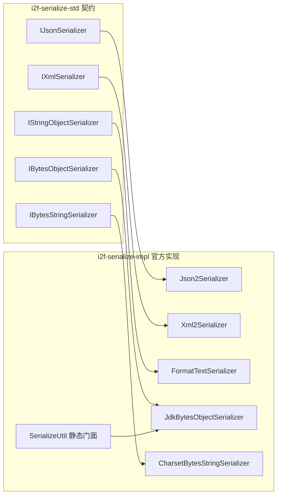
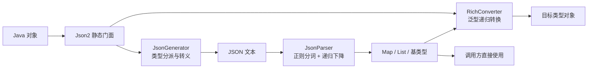
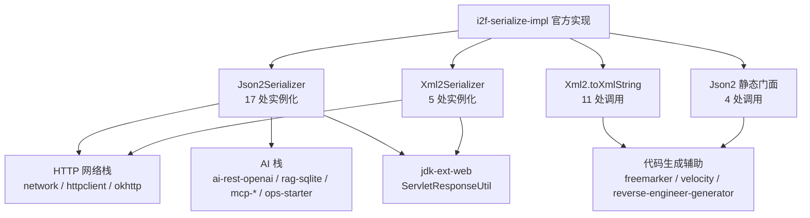

# i2f-serialize-impl

> **序列化契约的官方实现层**（配套 `i2f-serialize-std` 契约的官方实现下沉，延续 `i2f-codec-std/impl`、`i2f-crypto-std/impl` 的「std 定契约、impl 出实现」范式）。全模块 **13 个源文件、约 1422 行**（无测试源码），分五族落地 std 契约：**字节族**——`SerializeUtil` 静态门面（`jdkSerialize/jdkDeserialize`）+ `JdkBytesObjectSerializer`（JDK 原生 `ObjectOutputStream` 序列化，`INSTANCE` 单例、null 透传）+ `CharsetBytesStringSerializer`（UTF8/GBK/ISO88591 三静态常量，委托 `CharsetStringByteCodec`）；**JSON 族（自研零第三方依赖引擎）**——`Json2` 静态门面（`toJson/parseJson` + Class/Type/TypeToken 三态转换）、`Json2Serializer`（`IJsonSerializer` 实现，**被 17 处实例化为全仓默认 JSON 引擎**）、`JsonGenerator`（229 行生成器：null→Boolean→String→Number→Date→LocalDateTime→LocalDate→数组→Map→Collection→Enum→bean 反射分派链，`INSTANCE`/`INSTANCE_WITHOUT_NULL` 双单例，ThreadLocal 日期格式化）、`JsonParser`（407 行递归下降解析器：`nextBlock` 正则分词 + `nextEnclose` 括号配对 + `{}`/`[]` 状态机，JSON5 风格超集支持单引号/`//`与`/* */`注释/圆括号）；**文本族**——`FormatTextSerializer`（「`类名:内容`」自描述格式，`java.lang.` 前缀压缩为 `$`，null→`null:`）；**XML 族**——只写生成器 `Xml2`（160 行，`<SimpleName type="object">` 类型标签 + 五字符转义表 + `WITH_TYPE` 全局开关）+ `Xml2Serializer`（反序列化三方法全抛 `UnsupportedOperationException`）与独立解析器 `XmlParser`（213 行，`XmlCtx` 上下文 + `XmlNode` 树节点，含 main 演示）；**消费局面**——`Json2Serializer` 17 处 / `Xml2Serializer` 5 处实例化（HTTP 网络栈、AI 栈、jdk-ext-web），`Json2.toJson` 4 处与 `Xml2.toXmlString` 11 处静态调用，而 `SerializeUtil`/`JdkBytesObjectSerializer`/`CharsetBytesStringSerializer`/`FormatTextSerializer`/`XmlParser`/`XmlCtx` **六类全仓零消费**。⚠ 运行时探针实证 40 项（28 通过 / 12 失败 / 10 观察）：`unescape` 顺序缺陷吞转义（字面 `\t` 变 TAB、字面 `\n` 错转换行）、`\b`/`\f`/`\uXXXX` 还原不对称、裸键 `{a:1}` 静默丢数、大整数与 `|123` 抛 `NumberFormatException`、`deserializeAsMap` 顶层数组 `ClassCastException`、带 `<?xml?>` 声明 XML 直接 `StringIndexOutOfBoundsException`、charset null 泄漏 `CodecException`（非 `SerializeException` 族）、`textDeserialize(null)` NPE 等——详见文档。

## 模块路径

- `i2f-jdk/i2f-serialize-impl`

## 模块依赖

| 坐标 | scope | optional | 说明 |
|------|-------|----------|------|
| `i2f.turbo:i2f-serialize-std` | compile | - | 序列化契约层：本模块实现 `IJsonSerializer`/`IXmlSerializer`/`IStringObjectSerializer`/`IBytesObjectSerializer`/`IBytesStringSerializer` 五接口，抛出 `SerializeException` 及 Json/Xml/FormatText 三个格式子异常 |
| `i2f.turbo:i2f-codec-impl` | compile | - | `CharsetStringByteCodec`：字符集字符串↔字节底座（`CharsetBytesStringSerializer` 委托；`encode`=字节→文本、`decode`=文本→字节） |
| `i2f.turbo:i2f-match` | compile | - | `RegexPattens` 正则常量（数字/引号字符串/注释等）+ `RegexUtil.regexFinds` + `RegexMatchItem`：JSON 分词与 XML 属性解析 |
| `i2f.turbo:i2f-typeof` | compile | - | `TypeOf.isBaseType` 基类型判定（FormatText/JsonGenerator）+ `TypeToken` 泛型令牌（Json2 类型化入口） |
| `i2f.turbo:i2f-convert` | compile | - | `ObjectConvertor.tryConvertAsType` 基类型文本转换（FormatText 反序列化） |
| `i2f.turbo:i2f-check` | compile | - | `Predicates` 判定工具（JsonGenerator 字符串转义辅助分支） |
| `i2f.turbo:i2f-reflect` | compile | - | `ReflectResolver`（`loadClass` 类加载 / `getFields` 字段发现）+ `RichConverter`（泛型递归强转，Json2 类型化转换引擎） |
| `org.projectlombok:lombok` | provided | ✓（父 POM 统一 optional） | `@Data` + `@NoArgsConstructor`：**Json2 / Json2Serializer / JsonGenerator / XmlCtx / XmlNode 五类**实际使用（有别于 std 的冗余声明） |

构建插件与全仓惯例一致：`maven-assembly-plugin`（供聚合打包，无额外配置）。

## 模块设计

### 包结构

```
i2f.serialize
├── SerializeUtil.java                              # 静态门面：jdkSerialize/jdkDeserialize 直通 JdkBytesObjectSerializer.INSTANCE
├── bytes/
│   ├── charset/
│   │   └── CharsetBytesStringSerializer.java       # String↔byte[] 字符集互转（UTF8/GBK/ISO88591 三常量）
│   └── jdk/
│       └── JdkBytesObjectSerializer.java           # Object↔byte[] JDK 原生序列化（INSTANCE 单例、null 透传）
└── str/
    ├── json/impl/
    │   ├── Json2.java                              # JSON 静态门面（toJson/parseJson + Class/Type/TypeToken 三态）
    │   ├── Json2Serializer.java                    # IJsonSerializer 契约实现（含 map2Bean/bean2Map/deserializeAsMap）
    │   ├── JsonGenerator.java                      # 生成器：类型分派链 + 七种转义 + 双单例 null 策略
    │   └── JsonParser.java                         # 解析器：正则分词 + 括号配对 + 四位/二位状态机 + unescape
    ├── text/
    │   └── FormatTextSerializer.java               # 「类名:内容」自描述文本（$ 压缩 java.lang.，包装任意文本序列化器）
    └── xml/impl/
        ├── Xml2.java                               # XML 生成器（type 类型标签 + 转义表 + Date 格式化，WITH_TYPE 开关）
        ├── Xml2Serializer.java                     # IXmlSerializer 只写实现（反序列化三方法全抛 UOE）
        └── parser/
            ├── XmlParser.java                      # 独立解析工具（trimComments + readOneTag + 递归 parseNext，含 main）
            ├── XmlCtx.java                         # 解析上下文（name/tag/attr/content/xml/form/to 七字段）
            └── XmlNode.java                        # 解析树节点（name/content/attrs/nodes + 链式 add）
```

### 契约-实现映射与双通道



### 自研 JSON 引擎数据流



### 关键实现语义

| 实现类 | 落地契约 | 关键行为 |
|--------|----------|----------|
| `SerializeUtil` | —（静态门面） | 2 个方法直通 `JdkBytesObjectSerializer.INSTANCE`；静态方法自身不判 null（null 安全性来自被委托实例） |
| `JdkBytesObjectSerializer` | `IBytesObjectSerializer` | `public static`（**非 final**，可被替换）`INSTANCE` 单例；`serialize/deserialize` null 透传；`ObjectOutputStream/ObjectInputStream` 实现；失败统一包装 `SerializeException(e.getMessage(), e)`；静态 `jdkSerialize/jdkDeserialize` 与实例方法并存 |
| `CharsetBytesStringSerializer` | `IBytesStringSerializer` | 三静态常量（`UTF8`/`GBK`/`ISO88591`）+ 三构造器（默认/字符集名/codec 注入）；`serialize`（文本→字节）委托 `codec.decode`、`deserialize`（字节→文本）委托 `codec.encode`（**方向与方法名直觉相反**）；无 null 判断（T33 实证泄漏 `CodecException`） |
| `FormatTextSerializer` | `IStringObjectSerializer` | 「`类名:内容`」格式：null→`"null:"`、`"null:"`→null；`java.lang.` 前缀 ↔ `$` 整段压缩（无点号：`$Integer:123`）；基类型直拼文本、引用类型委托构造注入的 serializer（`deserialize(text, clazz)`）；`textDeserialize(null)` 直接 NPE（T29 实证） |
| `Json2` | —（静态门面） | `INSTANCE`（保留 null）/`INSTANCE_WITHOUT_NULL` 双生成器引用；`toJson` 系列 + `parseJson(Class/Type/TypeToken)` 经 `RichConverter` 做类型化转换 |
| `Json2Serializer` | `IJsonSerializer` | `serialize`→`JsonGenerator.toJson`；`deserialize` 三级重载（Map 直出经 `JsonParser.parse`、类型化经 `RichConverter.convert`、未知 type 抛 `UnsupportedOperationException`）；`deserializeAsMap` 强转 `(Map)`（T13 顶层数组 CCE）；`map2Bean` 经 RichConverter（T19b 实证可用）、`bean2Map` 默认拒绝（T19a 抛 `JsonSerializeException`） |
| `JsonGenerator` | —（生成器） | 分派链：null→Boolean→String→Number→Date→LocalDateTime→LocalDate→数组→Map→Collection→Enum→bean 反射；`whenString` 七种转义（`\`/`"`/`\b`/`\f`/`\n`/`\r`/`\t`）；`whenMap` 的 key **不转义**；LocalTime 无分支**落 bean 反射**（T17a）；`Double.NaN` 裸输出 `NaN`（T17d）；bean 反射失败抛 `IllegalStateException`；ThreadLocal `SimpleDateFormat`/`DateTimeFormatter` |
| `JsonParser` | —（解析器） | `parse`=`parseNext(json,"")`；`splitTokens` 过滤空白与 `//`、`/* */` 注释；字符串 token 经 `QUOTE_STRING_PATTERN`/`SINGLE_QUOTE_STRING_PATTERN` 整体匹配；`nextEnclose` 栈式括号配对；`{}` 四位状态机（key/`:`/value/`,`）与 `[]` 二位状态机；`unescape` 六步 `replaceAll`（**顺序缺陷**，见瑕疵）；数字链 Long→Double→BigDecimal 兜底 |
| `Xml2` | —（生成器） | `WITH_TYPE`（默认 true）全局静态开关；`transMap` 五字符转义（`&` 最先）；**静态共享 `SimpleDateFormat`**（线程不安全）；null 字段完全消失；Map key 任意字符直接作标签名；只处理 `Date`（LocalDate/LocalDateTime 不支持）；反射失败抛 `IllegalStateException` |
| `Xml2Serializer` | `IXmlSerializer` | `serialize`→`Xml2.toXml`；`deserialize` 三方法全抛 `UnsupportedOperationException("Xml2 un-support parseText.")`——**只写实现** |
| `XmlParser` | —（独立工具） | `trimComments` 手写扫描剔除 `<!-- -->`；`readOneTag` 手写标签扫描（`<?xml?>` 声明被当首个开始标签 -> `bodyEnd` 缺陷**直接崩溃** T25）；`parseNext` 递归建树 + **`System.out.println(ctx)` 调试输出残留**（T26）；属性经 `REG_KEY_EQUAL_VALUE` 正则解析；不支持 CDATA、属性值实体不解码 |
| `XmlCtx` | —（数据载体） | `@Data`：name/tag/attr/content/xml/form/to 七字段（`form` 疑为 `from` 拼写） |
| `XmlNode` | —（数据载体） | `@Data` 树节点：name/content/attrs/nodes + 链式 `add`；**content 存完整标签文本**（T26 实证 `<a>1</a>` 而非内部文本 `1`） |

### 设计原则

1. **契约-实现分离的官方落地**：std 契约层零实现逻辑，本模块兑现其「官方实现下沉」承诺——五接口（Json/Xml/String-Object/Bytes-Object/Bytes-String）各有一组落地类，调用方按需在 Json2 与 Jackson/Fastjson/Gson 适配器之间替换。
2. **零第三方依赖的自研 JSON 引擎**：JsonGenerator/JsonParser 不引任何 JSON 库，全自研正则分词 + 递归下降 + 单遍生成，是 AI 栈/HTTP 网络栈默认引擎（17 处实例化）的立足点；代价是转义/数字/裸键等边界健壮性不足（见瑕疵）。
3. **双单例 null 策略**：`JsonGenerator.INSTANCE`（保留 null）与 `INSTANCE_WITHOUT_NULL`（剔除 null 字段）双静态实例对应 `toJson` 系列的 `nullExclude` 开关，避免每次构造。
4. **XML 生成/解析双轨互不相通**：`Xml2` 是带 `type` 类型标签的只写生成器（`Xml2Serializer` 包装），`XmlParser` 是独立树解析工具（`XmlNode` 结果形态不同）——两者不构成「序列化-反序列化」闭环，解析器无对应生成器、生成器无对应解析器。
5. **分级降级与显式拒绝混合**：JSON 引擎对未支持输入走「正则不匹配 -> BigDecimal 兜底 -> 抛 `IllegalArgumentException`」链；XML 反序列化、格式文本异常等则以显式异常拒绝——策略不统一是瑕疵清单的组成部分。
6. **辅助格式补位**：`FormatTextSerializer`（自描述「类名:内容」）与 `CharsetBytesStringSerializer`（字符集字节互转）作为调试/特定场景的补充格式，以组合方式复用其他 serializer。

## 模块目的

- 兑现 `i2f-serialize-std` 文档承诺的**官方实现下沉**：Json2、Xml2、FormatText、JdkBytes、Charset 五族实现直接落地 std 五接口，让「面向契约编程」的调用方零适配即用。
- 提供**零第三方依赖的 JSON 引擎**：在网络栈/AI 栈等不便引入 Jackson/Gson 的场景（jdk8 基线、轻量依赖）作为默认 JSON 引擎，`Json2Serializer` 因此成为全仓 17 处实例化的主力实现。
- 提供**多格式序列化工具箱**：字节（JDK 原生/字符集互转）与文本（JSON/XML/自描述文本）双通道覆盖，配合 std 的适配器可跨通道桥接。
- 为 `Xml2.toXmlString` 提供**轻量文本转义工具**（`&<>'"` 五字符），被代码生成器族（reverse-engineer-generator 9 处等）用作 XML/HTML 片段转义。

## 模块功能

| 类型 | 定位 | 关键方法 | 主要消费方 |
|------|------|----------|------------|
| `SerializeUtil` | JDK 序列化静态门面 | `jdkSerialize`/`jdkDeserialize` | **全仓零消费**（能力族未启用） |
| `JdkBytesObjectSerializer` | Object↔byte[] JDK 原生 | `serialize`/`deserialize` + `INSTANCE` | **全仓零消费**（i2f-hash 仅接口注入无实现提供方） |
| `CharsetBytesStringSerializer` | String↔byte[] 字符集互转 | `serialize`/`deserialize` + 三常量 | **全仓零消费** |
| `FormatTextSerializer` | 「类名:内容」自描述文本 | `textSerialize`/`textDeserialize`/`serializeCopy` | **全仓零消费** |
| `Json2` | JSON 静态门面 | `toJson` 系列 / `parseJson(Class/Type/TypeToken)` | freemarker/velocity `GeneratorTool`、javacode-graph 测试 |
| `Json2Serializer` | JSON 契约实现 | `serialize`/`deserialize` 三级/`deserializeAsMap`/`map2Bean`/`bean2Map` | **17 处实例化**：network(4)、ai-rest-openai(3)、ops-starter(2)、rag-sqlite(2)、mcp-server(2)、httpclient、okhttp、jdk-ext-web、mcp-client |
| `JsonGenerator` | JSON 生成器 | `toJson(obj[, nullExclude])` | 被 Json2/Json2Serializer 内部使用（无外部直接 import） |
| `JsonParser` | JSON 解析器 | `parse`/`splitTokens`/`unescape` | 被 Json2/Json2Serializer 内部使用（无外部直接 import） |
| `Xml2` | XML 生成器 | `toXml([withHead])`/`toXmlString`（转义） | 生成器经 Xml2Serializer 消费；`toXmlString` 11 处静态调用 |
| `Xml2Serializer` | XML 只写实现 | `serialize`（deserialize 全抛 UOE） | **5 处实例化**：network(2)、httpclient、okhttp、jdk-ext-web |
| `XmlParser` | 独立 XML 解析工具 | `parse`/`trimComments`/`parseNext` | **全仓零消费**（仅自带 main 演示） |
| `XmlCtx` | 解析上下文载体 | getter/setter（@Data） | **全仓零消费**（XmlParser 内部流转） |
| `XmlNode` | 解析树节点 | `add` 链式构建（@Data） | 仅 XmlParser 内部使用（外部同名第三方类为扫描误报） |

## 模块主要使用方法

### 1. JSON 契约用法（Json2Serializer）

```java
IJsonSerializer json = new Json2Serializer();

// 序列化（默认保留 null 字段；Json2.toJson(map, true) 可排除）
String text = json.serialize(user);                 // {"name":"tom","age":18}

// 反序列化三级
Object raw = json.deserialize(text);                // Map/List 原始结构（JsonParser 直出）
User u = json.deserialize(text, User.class);        // 类型化（RichConverter 转换）
TypeToken<List<User>> tok = new TypeToken<List<User>>() {};
List<User> list = (List<User>) json.deserialize(text2, tok);  // 泛型令牌
Map<String, Object> map = json.deserializeAsMap(text);        // MCP 工具参数场景（顶层须为对象）
```

### 2. Json2 静态门面（免实例化）

```java
String text = Json2.toJson(map);            // 保留 null
String text2 = Json2.toJson(map, true);     // 排除 null 字段
Object obj = Json2.parseJson("{\"a\":1}");  // Map 直出
User u = Json2.parseJson(text, User.class); // 类型化
```

### 3. XML 生成（只写）

```java
// 生成带类型标签的 XML
String xml = Xml2.toXml(user);
// <User type="object"><name type="string">tom</name><age type="number">18</age></User>

// 契约方式（写入 IXmlSerializer 注入点）
IXmlSerializer xmlWriter = new Xml2Serializer();
String body = xmlWriter.serialize(user);

// 轻量文本转义（代码生成器的 XML/HTML 片段场景）
String safe = Xml2.toXmlString("<a>\"1\"</a>");  // &lt;a&gt;&quot;1&quot;&lt;/a&gt;
```

### 4. 自描述文本（FormatTextSerializer）

```java
// 包装任意 IStringObjectSerializer，如 Json2Serializer
FormatTextSerializer fmt = new FormatTextSerializer(new Json2Serializer());
String s = fmt.serialize(123);        // $Integer:123（java.lang. 压缩为 $）
Object v = fmt.deserialize(s);        // 123
Object n = fmt.deserialize("null:");  // null
```

### 5. 字节族

```java
// JDK 原生序列化（维护期系统的兼容场景）
byte[] enc = JdkBytesObjectSerializer.INSTANCE.serialize(obj);  // null -> null
Object back = JdkBytesObjectSerializer.INSTANCE.deserialize(enc);
byte[] enc2 = SerializeUtil.jdkSerialize(obj);                  // 静态门面等价

// 字符集字符串互转
byte[] bytes = CharsetBytesStringSerializer.UTF8.serialize("china");
String str = CharsetBytesStringSerializer.UTF8.deserialize(bytes);
```

### 6. 注意事项（探针实证警示）

1. **JSON 转义往返有损（高危）**：`JsonParser.unescape` 六步 `replaceAll` 顺序缺陷——含反斜杠的字符串往返后**内容被篡改**：字面 `\t`（反斜杠+t）被吞成 TAB、字面 `\n` 被错成真换行（T2/T4 实证）；`\b`/`\f` 生成侧转义但解析侧不还原、`\uXXXX` 完全不支持（T3/T5）。**跨端交换前必须对含反斜杠文本做验证**。
2. **裸键无空格静默丢数（高危）**：`{a:1}` 解析为**空 Map `{}`**（不报错），`{a: 1}` 同样丢失；必须 `{a : 1}`（冒号前留空格）或 `{"a":1}`（引号键）才能解析（T6/T7/T7b）——**静默失败**是最大陷阱。
3. **数字边界会抛未包装异常**：20 位大整数与 `|123`（正则字符类 `[+|-]` 笔误）都直接抛 `NumberFormatException`（T9/T10）；`1e5` 经兜底转 `100000.0`（Double），不保留指数形式。
4. **`deserializeAsMap` 仅接受顶层对象**：输入顶层为数组时抛 `ClassCastException`（内部 `(Map)` 强转，T13）；调用前请确认结构或改用 `deserialize`。
5. **`Xml2Serializer` 只写**：`deserialize` 三方法全抛 `UnsupportedOperationException`（T24）；需要 XML 解析请用独立的 `XmlParser`（与 Xml2 不构成闭环）。
6. **`XmlParser` 不支持 XML 声明**：带 `<?xml ...?>` 头的文档直接抛 `StringIndexOutOfBoundsException`（T25）——输入前须剥离声明；解析过程还会向 stdout 打印 `XmlCtx` 调试信息（T26）。
7. **charset 实现异常族不一致**：`CharsetBytesStringSerializer` 对 null 输入抛 `CodecException`（不是 `SerializeException` 子类），catch `SerializeException` 无法兜住（T33/T34）。
8. **`FormatTextSerializer.textDeserialize(null)` 抛 NPE**（T29）；`SerializeUtil.jdkSerialize(null)` 则安全返回 null（T31，透传自 INSTANCE）。

## 下游消费方一览

扫描口径：全仓 `src/main|test/java` 主源码池（排除本模块与 `runtime/tmp`），大小写敏感全文扫描。

| 实现/入口 | 调用处数 | 模块（处数） |
|-----------|----------|--------------|
| `new Json2Serializer()` | **17** | network(4)、ai-rest-openai(3)、ops-starter(2)、rag-sqlite(2)、springboot-ai-mcp-server(2)、httpclient(1)、okhttp(1)、jdk-ext-web(1)、springboot-ai-mcp-client(1) |
| `new Xml2Serializer()` | **5** | network(2)、httpclient(1)、okhttp(1)、jdk-ext-web(1) |
| `Json2.toJson`（静态） | 4 | freemarker(1)、velocity(1)、javacode-graph 测试(2) |
| `Xml2.toXmlString`（静态转义） | **11** | reverse-engineer-generator(9)、freemarker(1)、velocity(1) |
| `SerializeUtil` / `JdkBytesObjectSerializer` / `CharsetBytesStringSerializer` / `FormatTextSerializer` / `XmlParser` / `XmlCtx` | **0** | **全仓零消费**（详见瑕疵第 12 条） |

源码证据行：

| 证据 | 位置 |
|------|------|
| `protected IJsonSerializer jsonSerializer = new Json2Serializer();` | `i2f-network/.../HttpUrlConnectProcessor.java:38` |
| `public static volatile IJsonSerializer jsonProcessor = new Json2Serializer();` | `i2f-network/.../HttpUtil.java:29` |
| `protected IJsonSerializer jsonSerializer = new Json2Serializer();` | `i2f-extension-ai-rag-sqlite/.../SqliteRagEmbeddingStore.java:44` |
| `protected IJsonSerializer jsonSerializer = new Json2Serializer();` | `i2f-springboot-ai-mcp-server/.../SpringHttpSimpleMcpController.java:37` |
| `protected IXmlSerializer xmlSerializer = new Xml2Serializer();` | `i2f-extension-httpclient/.../HttpClientHttpProcessor.java:41` |
| `public static volatile IXmlSerializer xmlSerializer = new Xml2Serializer();` | `i2f-jdk-ext-web/.../ServletResponseUtil.java:19` |
| `return Json2.toJson(obj);` | `i2f-extension-freemarker/.../GeneratorTool.java:185` |
| `line.setComment(Xml2.toXmlString(line.getComment()));` | `i2f-extension-reverse-engineer-generator/.../ReverseEngineerGenerator.java:185` |
| `str = Xml2.toXmlString(str);` | `i2f-extension-reverse-engineer-generator/.../DatabaseEr2DrawIoGenerator.java:26` |

消费分层全景：



## 模块特性总结

- **官方五件套落地**：bytes-charset、bytes-jdk、str-json（4 类）、str-text、str-xml（3 + 解析 3 类）共 13 文件 1422 行，std 五接口全部有官方实现。
- **零第三方依赖自研 JSON 引擎**：正则分词 + 递归下降 + 单遍生成，全仓唯一不依赖 Jackson/Gson 的 JSON 实现，`Json2Serializer` 以 17 处实例化成为默认 JSON 引擎。
- **JSON5 风格超集**：解析器支持单引号字符串/`//`行注释/`/* */`块注释/圆括号分组（T12 实证通过），但冒号语法有裸键缺陷。
- **双单例 null 策略**：`INSTANCE`/`INSTANCE_WITHOUT_NULL` 静态复用，`toJson(obj, nullExclude)` 一键切换。
- **XML 只写 + 独立解析器双轨**：`Xml2`（类型标签生成）+ `XmlParser`（树解析）互不相通，「写用 Xml2、读用 XmlParser」且解析器不支持 XML 声明。
- **消费两极分化**：JSON/XML 契约实现被网络/AI 栈大量实例化（22 处），而字节/文本/解析器能力族（6 类）全仓零消费——能力就位但未启用。
- **异常族不统一**：`SerializeException`（JDK 族/Json2Serializer）、`CodecException` 泄漏（charset 族）、`IllegalStateException`（JsonGenerator/Xml2 反射失败）、`UnsupportedOperationException`（只写拒绝）、`IllegalArgumentException`/`NumberFormatException`（解析失败）、NPE（FormatText）六类混杂。
- **lombok 实质使用**：5 个类（Json2/Json2Serializer/JsonGenerator/XmlCtx/XmlNode）使用 `@Data`+`@NoArgsConstructor`，非 std 的冗余声明模式。

## 模块瑕疵或错误

### 运行时探针实证（runtime/tmp/serialize-impl-probe，40 项断言/观察：28 通过、12 失败、10 观察）

失败项（全部为已实证缺陷）：

| # | 断言 | 预期 | 实际 | 缺陷归类 |
|---|------|------|------|----------|
| **T2** | 含字面 `\t`（反斜杠+t）字符串 JSON 往返 | `he said "hi"\n\t`（保真） | `\t` 被吞为真 TAB | unescape 顺序缺陷 |
| **T3** | `\b`（退格）往返 | 还原退格 | 保留字面 `\b` 两字符（不对称） | 转义不对称 |
| **T4** | 字面 `\n`（反斜杠+n）须保值 | `a\nb` 字面 | 错转为真换行 | unescape 顺序缺陷 |
| **T5** | `"\u0041"` 解析 | `A` | 保留字面 `\u0041` | `\u` 转义未实现 |
| **T6** | `{a:1}` 裸键 | `{a=1}` | **`{}` 静默丢数** | 分词/状态机缺陷 |
| **T9** | 20 位大整数 | `BigDecimal` | `NumberFormatException` | 数字解析无兜底 |
| **T10** | `\|123` | 拒绝或 123 | `NumberFormatException`（正则 `[+\|-]` 笔误放行） | 正则字符类笔误 |
| **T13** | `deserializeAsMap("[1,2]")` | List 或被拒 | `ClassCastException` | 强转缺陷 |
| **T25** | 带 `<?xml?>` 声明解析 | 根子节点 `root` | `StringIndexOutOfBoundsException` | XmlParser 声明不支持 |
| **T29** | `textDeserialize(null)` | null 或格式异常 | `NullPointerException` | 判空缺失 |
| **T33** | `CharsetBytesStringSerializer.UTF8.serialize(null)` | null | `CodecException` | 判空缺失 + 异常族泄漏 |
| **T34** | charset null 异常族 | `SerializeException` | `CodecException`（非其子类，catch 不到） | 异常族不一致 |

观察项（行为记录，含设计取舍）：

| # | 观察 | 实测值 | 解读 |
|---|------|--------|------|
| T7b | `{"a":1}`（引号键无空格） | `{a=1}` | 引号键可解析，裸键不可——语法支持不一致 |
| T17a | `Json2.toJson(LocalTime)` | `{"hour":10,"minute":30,"..."}` | LocalTime 缺分派分支，落 bean 反射 |
| T17b | `Json2.toJson(User bean)` | `{"name":"tom","age":18}` | bean 反射序列化正常 |
| T17c | `Json2.toJson(Date)` | `"1970-01-01 08:00:00.000"` | 日期序列化为字符串（含时区偏移） |
| T17d | `Json2.toJson(Double.NaN)` | `NaN` | 裸 NaN 非法 JSON，不可再解析 |
| T17e | `parseJson("NaN")` | `IllegalArgumentException` | 非法输入经 BigDecimal 兜底失败抛出 |
| T19b | `map2Bean` | `User{name=jim, age=20}` | 经 RichConverter 实际可用 |
| T22a | `Xml2.toXml(User)` | `<User type="object">...` | 类型标签生成正确（无 XML 头） |
| T26 | 无声明 XML 解析 | `root/a=<a>1</a>/b=<b>2</b>` | 可解析但节点 content 为完整标签文本；stdout 被 5 行 `XmlCtx` dump 污染 |
| T28 | FormatText map 往返 | `{a=1}` | 包装 Json2Serializer 时可往返 |

通过项（28 项概括）：基本往返与安全路径全部通过——Map 往返（T1）、`{a : 1}`（T7）、数字 Long/-60/12.5D/`1e5`（T8/T11）、单引号+块注释（T12）、类型化 bean 与未知 type 显式拒绝（T14/T15）、null 保留/排除（T16）、枚举名（T18）、bean2Map 默认拒绝（T19a）、XML 类型标签/转义/只写拒绝（T22b/T23/T24）、FormatText 全绿（T27a-e）、JDK 序列化往返与 null 透传（T30/T31/T32）、charset UTF8/GBK 往返（T35）。

### 缺陷与问题清单

1. **【实证·高危】`JsonParser.unescape` 六步 `replaceAll` 顺序缺陷**：`\\`→`\` 排第一步，先把字面 `\\t` 压缩为 `\t`，随后 `\t`→TAB 步骤再把它转成真 TAB；同理字面 `\\n` 被错转真换行（T2/T4）。**含反斜杠的字符串 JSON 往返有损且静默**——数据校验/签名场景会直接破坏内容。根因：多步全局替换互相污染，应改为单遍字符扫描。
2. **【实证·高危】转义还原不对称**：`JsonGenerator.whenString` 转义七种（含 `\b`/`\f`）但 `unescape` 只还原五种（`\n r t " '`），`\b`/`\f` 往返破坏（T3）；`\uXXXX` 生成端不产出、解析端不支持（T5）——生成/解析转义集必须成对维护。
3. **【实证·高危】裸键静默丢数**：`{a:1}` 与 `{a: 1}` 均解析为 `{}`（T6 实证；仅 `{a : 1}` 冒号前带空格或 `{"a":1}` 引号键可解析，见 T7/T7b），根因是 `nextBlock` 不按 `:` 切分（`a:1` 整体成 token），flags 配对要求 `key`/`:`/`value`/`,` 四元素而永远凑不齐——**静默为空 Map 而非报错**，是最危险的失败模式。
4. **【实证·中危】数字解析链脆弱**：`INTEGER_NUMBER_REGEX` 字符类 `[+|-]` 笔误（应为 `[+-]`）使 `|123` 通过预检后抛未包装 `NumberFormatException`（T10）；20 位大整数 `Long.parseLong` 溢出 NFE（T9）；无指数形式正则且前导零 `0123` 走 BigDecimal 兜底变 Double——数字边界无系统性测试。
5. **【实证·中危】`deserializeAsMap` 强转脆弱**：`(Map) deserialize(enc)` 直接强转，顶层数组抛 `ClassCastException`（T13）——应先 `instanceof` 判断并抛出带语义的异常。
6. **【实证·高危】`XmlParser` 不支持 XML 声明**：`<?xml ...?>` 被当首个开始标签（名 `?xml`），闭合配对永远失败 -> `bodyEnd` 保留初值 0 < `bodyBegin` -> `substring(38,0)` 抛 `StringIndexOutOfBoundsException`（T25）——**绝大多数真实 XML 文档带声明头，解析器开箱即崩**。
7. **【实证·中危】`XmlParser.parseNext` 生产代码 `System.out.println(ctx)`**：每次解析节点向 stdout 打印 `XmlCtx` 全文（T26 前后 5 行 dump），作为库代码污染宿主进程标准输出。
8. **【实证·中危】charset 族 null 与异常族缺陷**：`CharsetBytesStringSerializer` 无判空，null 输入在 `String.getBytes`/codec 层抛 `CodecException`（T33），且 `CodecException` 不在 `SerializeException` 家族内 -> 按契约 catch `SerializeException` 无法兜住（T34）。
9. **【实证·低危】`FormatTextSerializer.textDeserialize(null)` NPE**（T29）：`str.indexOf(":")` 无判空，格式异常路径全被 NPE 抢跑（应抛 `FormatTextSerializeException`）。
10. **【静态·中危】`Xml2` 全局可变静态状态**：`WITH_TYPE` 静态开关 + `transMap` + **静态共享 `SimpleDateFormat`**（`yyyy-MM-dd HH:mm:ss SSS` 线程不安全）——并发序列化会得到错乱日期；`WITH_TYPE` 亦无法按调用定制。
11. **【静态·低危】`JsonGenerator` 细节缺陷**：`whenMap` 输出 key 不转义（key 含引号产出非法 JSON）；LocalTime 无分派落 bean 反射（T17a）；`Double.NaN` 裸输出非法 JSON 且不可回读（T17d/T17e）；`whenBean` 反射失败抛 `IllegalStateException` 与全类 `SerializeException` 约定不一致。
12. **【扫描实证】六类能力全仓零消费**：`SerializeUtil`/`JdkBytesObjectSerializer`/`CharsetBytesStringSerializer`/`FormatTextSerializer`/`XmlParser`/`XmlCtx` 在 4619 个主源码文件中零引用；`i2f-hash` 的 13 个 HashProvider 虽声明 `IBytesObjectSerializer` 构造依赖但全仓无任何调用方提供实现——**字节序列化能力族处于「已实现未启用」状态**。
13. **【静态·低危】`XmlParser` 功能缺口**：不支持 CDATA、属性值不做实体解码（`&amp;` 等原样保留）、`trimComments` 手写扫描对异常文档鲁棒性未知；`XmlCtx.form` 疑似 `from` 拼写错误。
14. **【静态·低危】`JsonGenerator`/`JsonParser` 无外部直接 import 消费**：仅经 `Json2`/`Json2Serializer` 间接使用——公开 API 面大于实际使用面（或应降级为包私有）。

## 可拓展方向

1. **重写 `unescape` 为单遍字符扫描**：按 `\` 转义对逐一消费（`\\`/`\"`/`\'`/`\n`/`\r`/`\t`/`\b`/`\f`/`\uXXXX` 全表），彻底消除多步 `replaceAll` 的顺序污染（T2/T3/T4/T5 一并修复）并提升性能。
2. **裸键分词容错**：`nextBlock` 普通分支增加 `:`/`,` 断点或后处理切分 `key:value`，消灭 `{a:1}` 静默丢数；补充 JSON 兼容性测试集（裸键/引号键/嵌套/注释组合）。
3. **数字解析健壮化**：修正 `[+|-]` 笔误；`Long` 溢出后降级 `BigInteger`/`BigDecimal`；补指数形式正则；统一以 `IllegalArgumentException` 包装（或专用 `JsonParseException`）。
4. **修复 `XmlParser`**：解析前跳过 `<?xml ...?>` 声明与 `<!DOCTYPE>`；移除 `println` 调试输出（改由调用方日志）；支持 CDATA；属性值实体解码。
5. **统一异常族**：charset 族补判空并包装 `SerializeException`；`FormatTextSerializer.textDeserialize` 判 null 抛 `FormatTextSerializeException`；`JsonGenerator` 反射失败改抛 `SerializeException` 子类。
6. **`Xml2` 线程安全与实例化**：`SimpleDateFormat` 改 ThreadLocal 或局部变量；`WITH_TYPE` 从静态开关改为实例字段（保留静态默认值兼容）。
7. **`deserializeAsMap` 防御性改造**：`instanceof Map` 判断 + 顶层数组自动包一层或抛语义化异常；`Json2Serializer.deserialize(enc,type)` 的 `UnsupportedOperationException` 改为契约化能力探测。
8. **激活字节能力族或裁撤**：为 `i2f-hash` 提供 `JdkBytesObjectSerializer.INSTANCE` 默认注入，或将 6 个零消费类下沉/合并；为 `JsonGenerator`/`JsonParser` 降级可见性以收敛 API 面。
