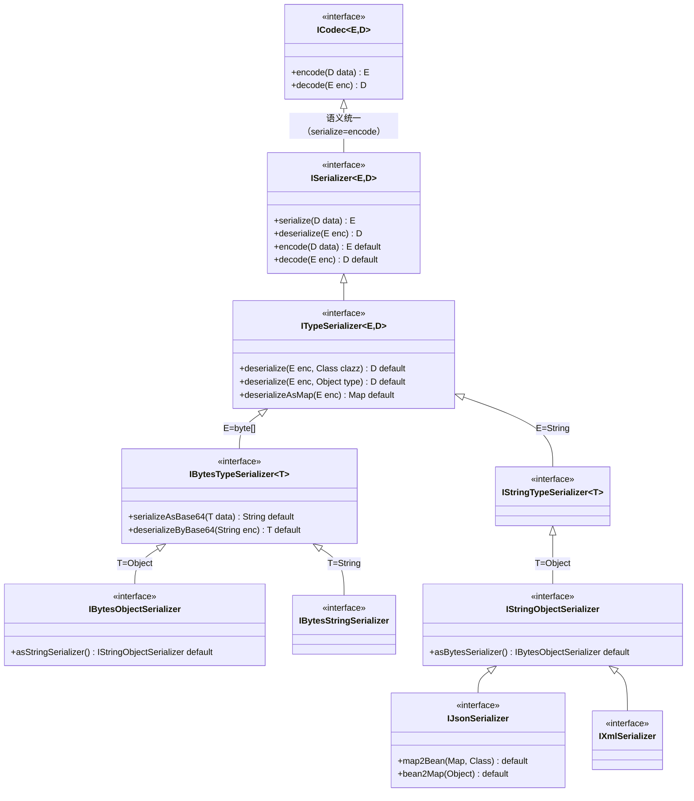
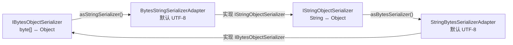
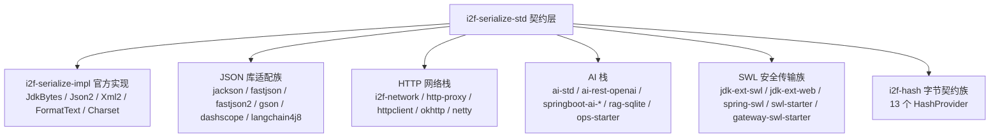

# i2f-serialize-std

> **序列化标准契约层**（`std` 契约与实现分离，延续 `i2f-codec-std`/`i2f-crypto-std`/`i2f-compress-std` 的「接口稳定、实现可换」范式）。全模块仅 **15 个类型、约 384 行**（9 接口 + 4 异常 + 2 适配器）：以根接口 `ISerializer<E,D>` 用 `serialize/deserialize` 双动词抽象「对象 ↔ 编码结果」的双向转换，并通过 `default encode/decode` 与上游 `i2f-codec-std` 的 `ICodec<E,D>` 无缝统一（序列化即编解码）；`ITypeSerializer` 叠加类型化反序列化三级重载（`deserialize(enc)` / `deserialize(enc, Class)` / `deserialize(enc, Object type)`）与 `deserializeAsMap`；沿**数据通道**固定泛型派生 4 个子接口——`IBytesObjectSerializer`/`IBytesStringSerializer`（byte[] 通道）与 `IStringObjectSerializer`/`IStringTypeSerializer`（String 通道），byte[] 通道再叠加 `serializeAsBase64/deserializeByBase64`；领域契约 `IJsonSerializer`（+`map2Bean/bean2Map`）与 `IXmlSerializer`（标记组合）；两通道间以 `asStringSerializer()/asBytesSerializer()` + 两个镜像适配器（默认 UTF-8）互相桥接；`SerializeException`（继承编解码 `CodecException`）与 Json/Xml/FormatText 三子异常构成异常族。它不与任何序列化框架绑定，被 **26 个外部模块 77 个源文件**消费（`IJsonSerializer` 53 处 import，为全仓最大契约面之一）：AI 栈（`AiAgent` 字段注入 + MCP 工具参数 `deserializeAsMap`）、HTTP 网络栈（`HttpProcessorProvider` 的 processor 参数 + `HttpResponse.getContentAsObject`）、SWL 加密传输族、i2f-hash 字节契约与 jackson/fastjson/fastjson2/gson 适配器实现；配套官方实现下沉于 `i2f-serialize-impl`（JdkBytes/Json2/Xml2/FormatText/Charset）。

## 模块路径

- `i2f-jdk/i2f-serialize-std`

## 模块依赖

| 坐标 | scope | optional | 说明 |
|------|-------|----------|------|
| `i2f.turbo:i2f-codec-std` | compile | - | 上游编解码契约：`ISerializer` 继承 `ICodec`（复用 encode/decode 动词），`SerializeException` 继承 `CodecException` |
| `org.projectlombok:lombok` | provided | ✓（父 POM 统一 optional） | **声明未用**：15 个源文件均无 lombok 注解，属冗余声明 |

构建插件与全仓惯例一致：`maven-assembly-plugin`（供聚合打包，无额外配置）。

## 模块设计

### 包结构

```
i2f.serialize.std
├── ISerializer.java                        # 根契约：serialize(D)→E / deserialize(E)→D + ICodec 默认桥接
├── type/
│   └── ITypeSerializer.java                # 类型化层：deserialize(enc, Class/Object) + deserializeAsMap
├── bytes/
│   ├── IBytesTypeSerializer.java           # byte[] 通道：serializeAsBase64 / deserializeByBase64
│   ├── IBytesObjectSerializer.java         # byte[]↔Object：asStringSerializer()（适配到文本通道）
│   └── IBytesStringSerializer.java         # byte[]↔String：IBytesTypeSerializer<String> 固化
├── str/
│   ├── IStringTypeSerializer.java          # String 通道：ITypeSerializer<String, T> 固化
│   ├── IStringObjectSerializer.java        # String↔Object：asBytesSerializer()（适配到字节通道）
│   ├── json/
│   │   ├── IJsonSerializer.java            # JSON 领域契约：+map2Bean / bean2Map
│   │   └── exception/JsonSerializeException.java
│   ├── xml/
│   │   ├── IXmlSerializer.java             # XML 领域契约：纯标记组合，无增量方法
│   │   └── exception/XmlSerializeException.java
│   └── text/exception/FormatTextSerializeException.java
├── exception/
│   └── SerializeException.java             # 序列化根异常（extends CodecException）
└── adapter/
    ├── BytesStringSerializerAdapter.java   # bytes 实现 → String 外观（默认 UTF-8）
    └── StringBytesSerializerAdapter.java   # String 实现 → bytes 外观（默认 UTF-8）
```

### 契约继承架构



### 双通道桥接模型



### 关键方法语义

| 方法 | 默认实现语义 | 说明 |
|------|--------------|------|
| `serialize(D)→E` / `deserialize(E)→D` | 抽象方法（实现方提供） | 根契约双动词，方向：D→E 正向、E→D 反向 |
| `encode/decode`（ICodec 桥接） | `default` 委托 serialize/deserialize | 序列化器可直接当编解码器使用（融入 codec 管线） |
| `deserialize(enc, Class)` | **忽略 clazz** 直接 `deserialize(enc)` | 支持类型化的实现（如 Json2Serializer）会覆写做真转换 |
| `deserialize(enc, Object type)` | **忽略 type** 直接 `deserialize(enc)` | 实现可自行解析 `Type`/`TypeToken` 等令牌 |
| `deserializeAsMap(enc)` | 抛 `UnsupportedOperationException` | 仅 JSON 实现有意义（AI 栈 MCP 参数解析的实际入口） |
| `serializeAsBase64(data)` | 标准 Base64 编码；`null→null` | 字节序列化结果的文本化便捷方法 |
| `deserializeByBase64(enc)` | 标准 Base64 解码；`null→null` | 文本输入的直接反序列化便捷方法 |
| `asStringSerializer()` | 返回 `BytesStringSerializerAdapter` | 字节通道 → 文本通道外观（可指定 charset） |
| `asBytesSerializer()` | 返回 `StringBytesSerializerAdapter` | 文本通道 → 字节通道外观（可指定 charset） |
| `map2Bean(map, clazz)` | `deserialize(serialize(map), clazz)` | 默认依赖实现的反序列化类型化能力 |
| `bean2Map(obj)` | 抛 `JsonSerializeException` | 默认不支持，需实现覆写（fastjson/jackson/gson 已覆写） |

### 设计原则

1. **序列化与编解码统一抽象**：`ISerializer` 继承 `ICodec` 并以 `default` 方法互委（`encode=serialize`、`decode=deserialize`），使序列化器天然融入全仓编解码契约体系，无需双重适配。
2. **数据通道维度固化泛型**：沿「编码结果形态」固定泛型参数——byte[] 通道（`IBytesTypeSerializer<T>`）与 String 通道（`IStringTypeSerializer<T>`），再按「对象/字符串」固化 T，共派生 4 个可直接实现子接口；领域契约（JSON/XML）继续叠加在文本通道之上。
3. **default 渐进增强**：Base64 便捷、类型化重载、适配器工厂、map2Bean 均以 `default` 提供渐进能力——实现方只需落地根双动词即可免费获得，能力不足时以「降级/抛异常」明示（见「模块瑕疵或错误」中对降级静默性的讨论）。
4. **契约与实现分离**：本模块零实现逻辑（仅 2 个桥接适配器），官方实现（JDK 序列化/Json2/Xml2/FormatText/Charset）下沉 `i2f-serialize-impl`，三方 JSON 库适配（jackson/fastjson/fastjson2/gson）下沉各 extension 模块。
5. **异常族继承编解码体系**：`SerializeException extends CodecException`（运行期异常），Json/Xml/FormatText 三子异常按格式细分，与 codec/crypto/compress 等 std 模块共享同一异常底座。

## 模块目的

- 为全仓的**序列化/反序列化行为**提供与具体框架无关的统一契约：调用方面向 `IJsonSerializer`/`IStringObjectSerializer` 等接口编程，实现可在 Json2、Jackson、Fastjson、Gson、JDK 原生之间自由替换。
- 用**双通道模型**（byte[] / String）+ 双向适配器消除「对象→字节」与「对象→文本」两类序列化语义的割裂，任意通道实现均可桥接出另一个通道的外观。
- 用 `default` 方法把**Base64 文本化、类型化反序列化、Map 直出**等高频便捷能力沉淀到契约层，让最小实现（2 个方法）即可获得完整能力面。
- 为 AI 栈（MCP 工具参数）、HTTP 网络栈（请求/响应处理器）、SWL 加密传输族提供**可注入、可替换**的序列化处理器类型（processor 参数/字段注入）。

## 模块功能

| 类型 | 定位 | 关键方法 | 主要消费方 |
|------|------|----------|------------|
| `ISerializer<E,D>` | 根契约（继承 `ICodec`） | `serialize`/`deserialize` + 默认 `encode`/`decode` 桥接 | std 内部契约链 |
| `ITypeSerializer<E,D>` | 类型化反序列化层 | `deserialize(enc, Class/Object)`、`deserializeAsMap` | std 内部契约链 |
| `IBytesTypeSerializer<T>` | byte[] 通道 + Base64 便捷 | `serializeAsBase64`/`deserializeByBase64` | 经子接口间接受益 |
| `IBytesObjectSerializer` | byte[]↔Object + 通道适配 | `asStringSerializer()` | i2f-hash 13 个 HashProvider、ZookeeperManager、JdkBytesObjectSerializer |
| `IBytesStringSerializer` | byte[]↔String 固化 | （继承 Base64 便捷） | CharsetBytesStringSerializer（官方实现） |
| `IStringTypeSerializer<T>` | String 通道固化 | （继承类型化重载） | std 内部契约链 |
| `IStringObjectSerializer` | String↔Object + 通道适配 | `asBytesSerializer()` | i2f-network、i2f-http-proxy、jackson AbsJacksonSerializer |
| `IJsonSerializer` | JSON 领域契约 | `serialize`/`deserialize`/`deserializeAsMap`/`map2Bean`/`bean2Map` | **53 处 import**：AI 栈、HTTP 栈、SWL 族、JSON 库适配族 |
| `IXmlSerializer` | XML 领域契约（标记组合） | `serialize`（可读性由实现决定） | httpclient/okhttp/network/jackson-xml |
| `SerializeException` | 序列化根异常 | —（`extends CodecException`） | 各实现类包装失败时抛出（7 处 import） |
| `JsonSerializeException` | JSON 细分异常 | — | `IJsonSerializer.bean2Map` 默认方法 |
| `XmlSerializeException` | XML 细分异常 | — | **全仓零抛出**（死类，见瑕疵） |
| `FormatTextSerializeException` | 格式文本细分异常 | — | `FormatTextSerializer`（i2f-serialize-impl） |
| `BytesStringSerializerAdapter` | 字节实现→文本外观 | 构造时指定 charset（默认 UTF-8） | 经 `asStringSerializer()` 暴露（当前零消费） |
| `StringBytesSerializerAdapter` | 文本实现→字节外观 | 构造时指定 charset（默认 UTF-8） | 经 `asBytesSerializer()` 暴露（当前零消费） |

## 模块主要使用方法

### 1. 面向契约编程（处理器注入）

```java
// HTTP 栈：processor 由调用方注入，可随意换成 Jackson/Fastjson/Gson 适配器
HttpProcessorProvider provider = new HttpUrlConnectProcessor();
Map<String, Object> resp = provider.getForObject(
        "http://host/api", params, "UTF-8", Map.class, new Json2Serializer());

// AI 栈：字段级注入 + 运行时替换
AiAgent agent = new AiAgent();
agent.jsonSerializer(new JacksonJsonSerializer(new ObjectMapper()));
```

### 2. JSON 契约（IJsonSerializer）核心四件事

```java
IJsonSerializer json = new Json2Serializer();

String text = json.serialize(bean);                    // 对象 → JSON 文本
User user = json.deserialize(text, User.class);        // JSON → 类型化对象（依赖实现的转换能力）
TypeToken<List<User>> token = new TypeToken<List<User>>() {};
Object list = json.deserialize(text, token);           // 泛型令牌（TypeToken/Type 由实现解析）
Map<String, Object> map = json.deserializeAsMap(text); // 免反射直出 Map（MCP 工具参数的实际入口）
```

### 3. 字节契约（IBytesObjectSerializer）

```java
IBytesObjectSerializer bytes = JdkBytesObjectSerializer.INSTANCE;

byte[] enc = bytes.serialize(obj);              // 对象 → 字节（JDK 原生序列化）
String b64 = bytes.serializeAsBase64(obj);      // 对象 → Base64 文本（契约层便捷方法）
Object back = bytes.deserializeByBase64(b64);   // Base64 文本 → 对象（null 输入安全返回 null）

// 哈希场景：先序列化为字节再做哈希（i2f-hash 13 个 HashProvider 的构造契约）
IHashProvider<String> hash = new ApHashProvider(JdkBytesObjectSerializer.INSTANCE);
```

### 4. 双通道互转（适配器）

```java
IBytesObjectSerializer bytesSerializer = JdkBytesObjectSerializer.INSTANCE;

// byte[] 实现 → String 外观（默认 UTF-8，可指定 charset）
IStringObjectSerializer asText = bytesSerializer.asStringSerializer();
IStringObjectSerializer asTextGbk = bytesSerializer.asStringSerializer("GBK");

// String 实现 → byte[] 外观（反向）
IBytesObjectSerializer asBytes = new Json2Serializer().asBytesSerializer();
```

### 5. 自定义实现（契约最小落地）

```java
// 只需实现根双动词，类型化/Base64/适配能力全部由 default 方法免费获得
public class MyBytesSerializer implements IBytesObjectSerializer {
    @Override
    public byte[] serialize(Object data) { /* 编码逻辑 */ }

    @Override
    public Object deserialize(byte[] enc) { /* 解码逻辑 */ }
}
```

### 6. 注意事项

1. **适配器不判 null**（已实证）：`asStringSerializer()/asBytesSerializer()` 产物对 `null` 输入抛 `SerializeException(message=null, cause=NPE)`，而底层良好实现（如 `JdkBytesObjectSerializer.serialize(null)=null`）是 null 透传的——桥接会改变 null 语义，null 数据请先判空。
2. **类型化重载默认静默忽略类型参数**：`deserialize(enc, Class)` 默认直接 `deserialize(enc)`——传 `Integer.class` 会得到未转换的原始结果（如 String `"123"`），不转换也不报错；如需真转换请选用覆盖了该方法的实现（Json2Serializer 经 RichConverter 转换）。
3. **`deserializeAsMap` 默认抛 `UnsupportedOperationException`**：非 JSON 实现调用即抛，使用前应确认实现支持。
4. **`bean2Map` 默认抛 `JsonSerializeException`**：只有 fastjson/fastjson2/gson/jackson 适配器覆写了它；`map2Bean` 虽有默认实现但仅做「序列化→反序列化」往返，不做 bean 转换。
5. **`IXmlSerializer` 不保证可反序列化**：官方 `Xml2Serializer` 的 `deserialize` 三方法全部抛 `UnsupportedOperationException`（只写实现）；契约无法静态区分只写/可读实现，请在运行期确认。
6. **`SerializationException` message 可能为 null**：实现侧 `new SerializeException(e.getMessage(), e)` 模式在 NPE 场景（message=null）会构造无消息异常，排障时请看 `getCause()`。

## 下游消费方一览

扫描口径：全仓 `import i2f.serialize.std.*` 的主源码共 **92 文件**（含自身 15）、测试源码 3 文件；即外部 **26 个模块、77 个主源文件 + 3 个测试文件**消费本契约。

按契约统计 import 次数（含 std 内部与官方实现）：

| 契约 | import 次数 | 说明 |
|------|-------------|------|
| `IJsonSerializer` | **53** | 全仓最大契约面之一：AI 栈 + HTTP 栈 + SWL 族 + 全部 JSON 库适配 |
| `IBytesObjectSerializer` | 18 | i2f-hash 13 个 HashProvider + ZookeeperManager 等 |
| `IStringObjectSerializer` | 11 | HTTP 响应处理、REST 客户端、Jackson 基类 |
| `IXmlSerializer` | 9 | httpclient/okhttp/network/jackson-xml/扩展 web |
| `SerializeException` | 7 | 各实现类失败包装 |
| `ITypeSerializer` / `ISerializer` | 2 / 1 | 仅 std 内部契约链 |
| `IBytesStringSerializer` | 1 | 仅官方实现 CharsetBytesStringSerializer |
| `JsonSerializeException` | 1 | 仅 std 自身 bean2Map 默认方法 |

按场景分布：

| 消费场景 | 模块（文件数） | 典型用法 |
|----------|----------------|----------|
| AI 栈 | i2f-ai-std(7)、i2f-ai-rest-openai(3)、springboot-ai-starter(1)、springboot-ai-mcp-client(1)、springboot-ai-mcp-server(2)、springboot-ops-starter(2)、ai-rag-sqlite(2)、ai-dashscope(1)、ai-langchain4j8(1) | `AiAgent.jsonSerializer(IJsonSerializer)` 注入 + MCP 工具参数 `deserializeAsMap` 9 处 |
| HTTP 网络栈 | i2f-network(8)、i2f-http-proxy(2)、httpclient(3)、okhttp(3)、netty(6) | `HttpProcessorProvider` processor 参数、`HttpResponse.getContentAsObject(...)`、`RestClientProvider.getClient(interfaces, processor)` |
| SWL 安全传输族 | jdk-ext-swl(1)、jdk-ext-web(1)、spring-swl(2)、springboot-swl-starter(3)、springcloud-gateway-swl-starter(3) | 握手/加解密报文的 JSON 编解码（`SwlWebFilter`/`SwlSpringController` 构造注入） |
| 字节契约/存储 | i2f-hash(13)、extension-zookeeper(1) | 对象先序列化再哈希；Zookeeper 数据持久化 |
| JSON 库适配族 | jackson(3)、fastjson(1)、fastjson2(1)、gson(1) | `implements IJsonSerializer` / `implements IStringObjectSerializer` 适配器 |
| 官方实现 | i2f-serialize-impl(5) | JdkBytes/Json2/Xml2/FormatText 实现 std 契约 |

源码证据行：

| 证据 | 位置 |
|------|------|
| `public <T> T getContentAsObject(IStringObjectSerializer processor, Class<T> clazz)` | `i2f-network/.../HttpResponse.java:77` |
| `public <T> T getClient(Class<T> interfaces, IStringObjectSerializer processor, IEnvironment environment)` | `i2f-http-proxy/.../RestClientProvider.java:15` |
| `<T> T postFormForObject(HttpRequest request, String charset, Class<T> clazz, IJsonSerializer processor)` | `i2f-network/.../HttpProcessorProvider.java:17` |
| `protected IBytesObjectSerializer serializer;`（`hash()` 中 `serializer.serialize(obj)`） | `i2f-hash/.../IByteArrayHashProvider.java:13,24` |
| `private IBytesObjectSerializer serializer;` | `i2f-extension-zookeeper/.../ZookeeperManager.java:29` |
| `protected volatile IJsonSerializer jsonSerializer;` / `public AiAgent jsonSerializer(IJsonSerializer jsonSerializer)` | `i2f-ai-std/.../AiAgent.java:46,60` |
| `public abstract class AbsJacksonSerializer implements IStringObjectSerializer` | `i2f-extension-jackson/.../AbsJacksonSerializer.java:13` |
| `Map<String, Object> argumentsMap = jsonSerializer.deserializeAsMap(arguments);` | `i2f-ai-std/.../AiAgent.java:286` |
| `protected IJsonSerializer jsonSerializer = new Json2Serializer();`（+ `IXmlSerializer xmlSerializer = new Xml2Serializer()`） | `i2f-extension-httpclient/.../HttpClientHttpProcessor.java:40-41` |
| `jsonSerializer.deserialize(reqJson, SwlData.class)` / `jsonSerializer.serialize(respHandleShake)` | `i2f-springboot-swl-starter/.../SwlSpringController.java:47,70` |

消费分层全景：



### 官方配套实现（i2f-serialize-impl）

| 实现类 | 落地契约 | 说明 |
|--------|----------|------|
| `JdkBytesObjectSerializer` | `IBytesObjectSerializer` | JDK 原生序列化（`INSTANCE` 单例、null 透传）；配套 `SerializeUtil.jdkSerialize/jdkDeserialize` 静态门面 |
| `Json2Serializer` | `IJsonSerializer` | 自研 Json2 解析器 + `RichConverter` 类型化转换（支持 `Type`/`TypeToken`）；**被 17 处实例化为默认 JSON 引擎**（network/AI/springboot 等） |
| `Xml2Serializer` | `IXmlSerializer` | Xml2 只写实现（反序列化三方法全抛 `UnsupportedOperationException`）；被 5 处实例化 |
| `FormatTextSerializer` | `IStringObjectSerializer` | 「`类名:内容`」自描述文本格式（`java.lang.` 前缀压缩为 `$`），包装任意文本序列化器 |
| `CharsetBytesStringSerializer` | `IBytesStringSerializer` | 字符集编解码（UTF8/GBK/ISO8859-1 三常量），委托 `CharsetStringByteCodec` |

## 模块特性总结

- **纯契约层**：15 个类型仅 9 接口 + 4 异常 + 2 桥接适配器，零业务实现；仅依赖上游 `i2f-codec-std`（compile）+ lombok（provided 未用）。
- **序列化=编解码**：根契约与 `ICodec` 通过 default 方法互委，序列化能力无缝融入全仓 codec 体系。
- **双通道 + 双向适配**：byte[] 通道与 String 通道各自固化 2 个对象向接口，并以 default 工厂 + 镜像适配器（默认 UTF-8）互相桥接。
- **最小实现成本**：实现方只需落地 `serialize`/`deserialize` 两方法，Base64 便捷/类型化重载/通道适配/编解码桥接全部由 default 方法免费获得。
- **渐进增强 + 显式降级**：能力不足时以「默认降级（忽略类型参数）或显式拒绝（抛异常）」表达，但降级静默性存在争议（见瑕疵）。
- **最大契约面**：被 26 模块 77 源文件消费，`IJsonSerializer` 53 处 import——AI 栈 MCP 参数、HTTP 处理器、SWL 安全传输、JSON 库适配的共同序列化地基。
- **异常族与全局统一**：`SerializeException extends CodecException`，Json/Xml/FormatText 三子异常细分格式，与编解码/加密体系的异常底座一致。

## 模块瑕疵或错误

### 运行时探针实证（runtime/tmp/serialize-probe，15 断言，12 通过 3 失败）

| # | 断言 | 预期 | 实际 | 结论 |
|---|------|------|------|------|
| T1 | `serializeAsBase64(null)` | null | null | ✓ |
| T2 | `deserializeByBase64(null)` | null | null | ✓ |
| T3 | Base64 往返 | `"hello"` | `"hello"` | ✓ |
| T4 | `bytes.serialize(null)`（原始通道） | null | null | ✓ |
| **T5** | `asStringSerializer().serialize(null)` | null | `SerializeException(msg=null, cause=NPE)` | **✗ 缺陷** |
| **T6** | `asStringSerializer().deserialize(null)` | null | `SerializeException(msg=null, cause=NPE)` | **✗ 缺陷** |
| T7 | `deserialize(enc, Integer.class)` 默认行为 | 转换或报错 | 返回未转换 String `"123"`（clazz 被静默忽略） | ⚠ 静默降级实证 |
| T8 | `deserializeAsMap` 默认行为 | — | 抛 `UnsupportedOperationException("un-implements deserialize as map")` | ⚠ 默认拒绝实证 |
| T9 | `bean2Map` 默认行为 | — | 抛 `JsonSerializeException("json serializer not support bean2map")` | ⚠ 默认拒绝实证 |
| T10 | `map2Bean` 默认行为 | — | 仅 serialize→deserialize 往返（`Map` → `String`，无 bean 转换） | ⚠ 能力缺口实证 |
| T11/T12 | 异常链 `CodecException ← SerializeException ← JsonSerializeException` | 成立 | 成立 | ✓ |
| T13/T14 | 正常往返 / GBK 适配往返 | `"abc"` / `"china"` | 一致 | ✓ |
| **T15** | `asBytesSerializer().serialize(null)`（反向） | null | `SerializeException(msg=null, cause=NPE)` | **✗ 缺陷** |

### 缺陷与问题清单

1. **【实证·中危】双向适配器 null 语义缺失**：`BytesStringSerializerAdapter`/`StringBytesSerializerAdapter` 的 `string2bytes`/`bytes2string` 及 `serialize/deserialize` 链未做 null 判断——底层「null 透传」约定（`JdkBytesObjectSerializer.serialize(null)=null`、T4）经适配器后被破坏为 `SerializeException`（T5/T6/T15）。当前因适配器族全仓零调用（见第 6 条）为**潜伏缺陷**，一旦启用桥接即触发。
2. **【实证·中危】类型化反序列化默认静默忽略类型参数**：`ITypeSerializer.deserialize(enc, Class)`/`deserialize(enc, Object)` 默认直接忽略参数降级（T7：传 `Integer.class` 得 String `"123"`）——类型转换意图被无声吞掉，既非转换也非报错；调用方无法从返回值察觉参数失效，易在跨实现替换（支持→不支持类型化）时引入隐性行为差异。
3. **【实证·低危】`deserializeAsMap` 内聚性存疑**：定义在最通用的 `ITypeSerializer` 上（byte[] 通道实现天然无法支持），默认抛 `UnsupportedOperationException`（T8）——真正的使用方只有 JSON 契约（AI 栈 MCP 参数 9 处）。
4. **【实证·低危】`map2Bean`/`bean2Map` 默认行为不对称**：`bean2Map` 默认显式拒绝（T9），`map2Bean` 默认有实现但仅做文本往返、不做 bean 转换（T10）——同名便利方法一个「拒绝」一个「假成功」，行为一致性差。
5. **【实证】异常 message 丢失模式**：实现侧 `new SerializeException(e.getMessage(), e)` 在 NPE 场景（message=null）构造出 `message=null` 的异常（T5/T6/T15 的 `msg=null`）——最需要诊断信息的 null 异常场景反而丢失消息。
6. **【扫描实证】桥接能力全仓零消费**：`asStringSerializer()`/`asBytesSerializer()`/`serializeAsBase64`/`deserializeByBase64` 及两个适配器在 92 个消费文件中**无任何外部调用**——「跨通道桥接」为设计预留能力，尚未被实际启用（缺陷 1 因此未暴露）。
7. **【静态】`XmlSerializeException` 为死类**：全仓 0 处 `new XmlSerializeException`（`Xml2Serializer`/`JacksonXmlSerializer` 失败时抛的是 `UnsupportedOperationException`/`SerializeException`）；`JsonSerializeException` 也仅 1 处（std 自身默认方法）。
8. **【静态】`IXmlSerializer` 无法静态区分只写/可读**：纯标记组合接口（零增量方法），官方实现 `Xml2Serializer` 反序列化全抛 `UnsupportedOperationException`——调用方只有运行时才知道拿到的是只写实现。
9. **【静态】适配器镜像重复**：两个适配器除方向相反外逻辑约 90% 重复；且每次转换按字符串查 charset（`str.getBytes(charset)`/`new String(bytes, charset)`）未缓存 `Charset` 对象，高频路径存在名称查找开销。
10. **【静态】lombok 冗余声明**：pom 声明 `lombok`（provided），15 个源文件无一使用（同族 std 模块的共性问题）。

## 可拓展方向

1. **修复适配器 null 语义**：`string2bytes`/`bytes2string` 补 null 透传判断（与 `IBytesTypeSerializer` 的 null 安全约定一致），并缓存 `Charset` 对象；同时把 `new SerializeException(e.getMessage(), e)` 升级为 message 空值兜底（如 `e.getClass().getSimpleName()`）。
2. **类型化反序列化增加能力探测**：为 `deserialize(enc, Class/type)` 引入 `supportsTypeDeserialize()` 默认探测，或把「不支持」从静默降级改为显式抛「此实现不支持类型化」——消除 T7 式无声吞参。
3. **下沉 `deserializeAsMap`**：从 `ITypeSerializer` 移至 `IJsonSerializer`（或独立 `IMapDeserialize` 接口），消除 byte[] 通道的无意义默认拒绝。
4. **拆分 XML 契约能力**：将 `IXmlSerializer` 拆为「只写」与「可读」两个子契约（或补 `isReadable()` 探测），让运行期失败前移为编译期/启动期判断。
5. **统一 map/bean 双向语义**：为 `map2Bean`/`bean2Map` 提供一致的默认策略（都拒绝或都尽力往返），并明确文档化「依赖实现的转换能力」边界。
6. **清理冗余**：移除 lombok 声明与死类 `XmlSerializeException`；两个适配器可抽取公共基类收敛镜像代码。
