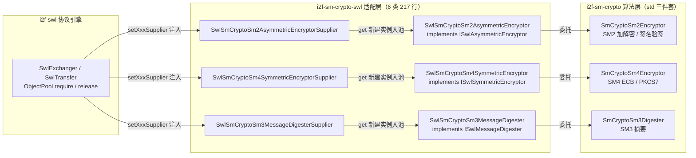

# i2f-sm-crypto-swl

> **SWL（Secure Wire Layer）安全传输协议族的纯 Java 国密适配层**——全模块仅 **6 个源文件、217 行、2 个包、零算法实现**，无 `src/test` 测试目录、无 `resources`。职责单一：以适配器模式把 i2f-sm-crypto 的 std 适配三件套（`SmCryptoSm2Encryptor`/`SmCryptoSm4Encryptor`/`SmCryptoSm3Digester`）包装为 i2f-swl-std 的三大密码学契约——`SwlSmCryptoSm2AsymmetricEncryptor`（SM2 → `ISwlAsymmetricEncryptor`）、`SwlSmCryptoSm4SymmetricEncryptor`（SM4 → `ISwlSymmetricEncryptor`）、`SwlSmCryptoSm3MessageDigester`（SM3 → `ISwlMessageDigester`），并配 3 个 Supplier 工厂（`supplier/` 包）供协议引擎 i2f-swl 的 `SwlExchanger` 以 `ObjectPool` 池化装配——使 SWL 在「JDK 默认实现（RSA/AES/SHA-256）」与「BouncyCastle/antherd 实现」之外，获得**第三套可整体互换的国密实现**。
>
> **接入方式（配置驱动）**：本模块被两个 SWL Starter 以 POM 依赖内置（`i2f-springboot-swl-starter/pom.xml:57-60`、`i2f-springcloud-gateway-swl-starter/pom.xml:49-52`，均非 optional），仅需把 `i2f.swl.web.asym-algo-class` 等配置项指向本模块 Supplier 类名，即由 `ReflectResolver` 反射实例化激活（`SwlSpringAutoConfiguration.java:67-113`）；截至当前仓库快照，全仓 **0 处** Java 源码 import、0 处 YAML 配置实际启用（**可用未启用**）；混淆器 `ISwlObfuscator` 不在本模块实现范围（沿用默认 Base64）。
>
> ⚠ **重点风险**：本模块自身仅为 217 行胶水代码，但其算法底座 i2f-sm-crypto 存在**严重安全缺陷**——`Sm2Cipher` 静态 boost keypair（`Sm2Cipher.java:28/69/424`）导致 SM2 加密与签名进程级复用同一 k（同明文同密文、密钥流复用、两条签名可恢复私钥，已探针实证），而 SWL 每请求的会话密钥正由 SM2 加密保护、报文摘要由 SM2 签名——**修复上游前不可用于生产**（详见 i2f-sm-crypto 模块文档）。另有 `generateKeyPair()`/SM3 摘要路径异常未包装为 `SwlException`、`cipherMode` 字段死状态（宣称 C1C2C3、实际 C1C3C2）等瑕疵——详见「模块瑕疵或错误」。

## 模块路径

- `i2f-jdk/i2f-sm-crypto-swl`

## 模块依赖

| 依赖（maven 坐标） | scope | optional | 用途 |
| --- | --- | --- | --- |
| `i2f.turbo:i2f-sm-crypto:1.0-jdk8` | compile | 否 | 唯一算法提供方——引用 `SmCryptoSm2Encryptor`/`SmCryptoSm4Encryptor`/`SmCryptoSm3Digester` 三个 std 适配类；SM2/SM3/SM4 算法逻辑全部来自本依赖（pom.xml:21-24） |
| `i2f.turbo:i2f-swl-std:1.0-jdk8` | compile | 否 | 契约层——3 个密码学接口 + 3 个 `ISwlXxxSupplier` 接口 + `SwlCode` 错误码 + `SwlException`（pom.xml:25-28） |
| `org.projectlombok:lombok` | provided（继承根 POM `dependencyManagement`，pom.xml:83-89） | true（继承） | **声明未用**：6 个源文件零 lombok 注解（pom.xml:16-19） |

- 构建插件：仅 `maven-assembly-plugin`（裸声明，版本由父 POM `i2f-jdk` → `i2f-turbo-java` 统一管理）；编译产物 `i2f-sm-crypto-swl-1.0-jdk8.jar`（模块 `target/` 实证）。
- 版本继承 `i2f-jdk` parent（`1.0-jdk8`）；根 POM `dependencyManagement` 以 `${i2f.version}` 统一版本（pom.xml:754-758）；`i2f-jdk-all` 聚合发布（i2f-jdk-all/pom.xml:523-526）；`i2f-jdk` 模块清单第 144 项（i2f-jdk/pom.xml:144，紧随 i2f-sm-crypto 之后）。
- 模块无 `src/test`、无 `resources`，编译产物仅 6 个 class。

## 模块设计

1. **生态位：SWL 三套可互换实现中的「国密一极」**——同一套 `i2f-swl-std` 契约下，本模块以「纯 Java 自研算法」路线对标另两套实现；协议引擎只认契约接口，替换 Supplier 即整体切换算法族：

| 实现模块 | 算法栈 | 非对称 | 对称 | 摘要 | 混淆 | 三方密码依赖 |
| --- | --- | --- | --- | --- | --- | --- |
| i2f-swl（默认，`i2f.swl.impl`） | JDK 内置 JCE | RSA 2048 | AES-128 | SHA-256 | Base64（自带实现） | 无 |
| **i2f-sm-crypto-swl（本模块）** | **纯 Java 自研国密** | **SM2** | **SM4** | **SM3** | 无（沿用默认 Base64） | 无 |
| i2f-extension-swl | BouncyCastle / antherd | RSA2048 / BC-SM2 / antherd-SM2 | AES256 / BC-SM4 / antherd-SM4 | SHA512 / BC-SM3 / antherd-SM3 | Base64 等 | bcprov、sm-crypto |

2. **适配器一对一映射（零算法、全委托）**——6 个类全部为「字段持有 std 实例 + 方法逐层转发」，无任何业务逻辑：

| SWL 契约（i2f-swl-std） | 适配器（本模块） | 行数 | 委托目标（i2f-sm-crypto std） | 出/入参编码 |
| --- | --- | --- | --- | --- |
| `ISwlAsymmetricEncryptor`（11 方法） | `SwlSmCryptoSm2AsymmetricEncryptor` | 89 | `SmCryptoSm2Encryptor`（new 实例字段，SwlSmCryptoSm2AsymmetricEncryptor.java:16） | hex |
| `ISwlSymmetricEncryptor`（5 方法） | `SwlSmCryptoSm4SymmetricEncryptor` | 52 | `SmCryptoSm4Encryptor`（new 实例字段，:14） | hex |
| `ISwlMessageDigester`（2 方法） | `SwlSmCryptoSm3MessageDigester` | 23 | `SmCryptoSm3Digester.INSTANCE`（单例，:12） | hex |
| `ISwlAsymmetricEncryptorSupplier` | `SwlSmCryptoSm2AsymmetricEncryptorSupplier` | 18 | `new SwlSmCryptoSm2AsymmetricEncryptor()`（:16） | — |
| `ISwlSymmetricEncryptorSupplier` | `SwlSmCryptoSm4SymmetricEncryptorSupplier` | 18 | `new SwlSmCryptoSm4SymmetricEncryptor()`（:16） | — |
| `ISwlMessageDigesterSupplier` | `SwlSmCryptoSm3MessageDigesterSupplier` | 17 | `new SwlSmCryptoSm3MessageDigester()`（:15） | — |

3. **装配链路**——Supplier 是引擎与本模块之间的唯一创建入口；`SwlExchanger` 的三个 `ObjectPool` 基于类型化 Supplier 构造（SwlExchanger.java:68-74），`setXxxSupplier` 换实现时同步替换池的供应商（SwlExchanger.java:88-101）：



4. **异常翻译策略**——把 std 层的受检异常翻译为携带 SWL 错误码的 `SwlException`（RuntimeException，全链路不声明 throws）；翻译**不完整**（两处缺口，见瑕疵 1）：

| 适配器操作 | 处理方式 | 错误码（SwlCode） |
| --- | --- | --- |
| SM2 `encrypt` | 捕获 `Exception` → `SwlException(code, msg, cause)` | `ASYMMETRIC_ENCRYPT_EXCEPTION`（1100），:55-61 |
| SM2 `decrypt` | 同上 | `ASYMMETRIC_DECRYPT_EXCEPTION`（1200），:64-70 |
| SM2 `sign` | 同上 | `ASYMMETRIC_SIGN_EXCEPTION`（1300），:73-79 |
| SM2 `verify` | 同上 | `ASYMMETRIC_VERIFY_EXCEPTION`（1400），:82-88 |
| SM2 `generateKeyPair` | **无 try/catch**，泄漏 `IllegalStateException` | —（瑕疵 1） |
| SM4 `generateKey` | 捕获 `Exception` → `SwlException` | `SYMMETRIC_INVALID_KEY_EXCEPTION`（2300），:17-23 |
| SM4 `encrypt` | 同上 | `SYMMETRIC_ENCRYPT_EXCEPTION`（2100），:36-42 |
| SM4 `decrypt` | 同上 | `SYMMETRIC_DECRYPT_EXCEPTION`（2200），:45-51 |
| SM3 `digest` / `verify` | **无 try/catch**，泄漏 `IllegalStateException` | —（瑕疵 1） |

5. **算法语义与格式约定**（互操作关键，全部经上游源码核实）：
   - **SM2**：密钥为 hex（私钥 64 hex 字符；公钥 128 hex 或 `04` 前缀 130 hex）；`encrypt(String)` 出参 hex 密文、`decrypt(String)` 入参 hex；签名默认**裸 `r‖s` 拼接**（`der=false`、`hash=false` 即不启用 ZA 杂凑，Sm2.java:58-61），出参 hex；`verify(sign, data)` 被校验签名在前。
   - **分组模式实际为 C1C3C2**：适配器调用 `Sm2.doEncrypt(data, pubKey)`（SmCryptoSm2Encryptor.java:207-213）不传递模式 → `Sm2Cipher` 对 null 默认 C1C3C2（Sm2Cipher.java:64-66、149-151）；std 类字段 `cipherMode = C1C2C3`（SmCryptoSm2Encryptor.java:24）从未被读取（死状态），与默认 C1C2C3 的对端不互通——详见瑕疵 2。
   - **SM4**：密钥为 32 hex 字符（16 字节）；`Sm4.encrypt/decrypt` 默认 **ECB + PKCS7**（padding null → PKCS_7，Sm4Cipher.java:208-209；非 CBC 即 ECB 语义），出/入参 hex。
   - **SM3**：`digest(String)` 出参 64 字符 hex（32 字节摘要的 hex 表示）；`verify` 以 `equalsIgnoreCase` 比较（大小写不敏感，SmCryptoSm3Digester.java:49-56）。
   - **有选择规避上游缺陷**：SM2/SM4 的 std 类 byte[] 重载存在缺陷（如 `verify(byte[])` 误把 data 当签名字节，SmCryptoSm2Encryptor.java:200-205），**本模块只走 String 重载**，天然绕开该缺陷路径。

6. **状态模型与引擎协作**——适配器不持有跨请求状态语义，密钥全部经 `setKey/setPublicKey/setPrivateKey/setKeyPair` 注入；`generateKey()`/`generateKeyPair()` **不写入实例**（与 swl-std 各实现的镜像约定一致），引擎使用姿势为「generate → 显式 set」：发送路径 `generateKey→setKey`、`setPublicKey→encrypt(key)`（SwlExchanger.java:227-237），接收路径 `setPublicKey→verify`、`setPrivateKey→decrypt`、`setKey→decrypt(parts)`（SwlExchanger.java:435-476）。
7. **包结构**：`i2f.sm.crypto.swl`（3 个适配类）+ `i2f.sm.crypto.swl.supplier`（3 个工厂类），共 2 包 6 类、无类间依赖（仅各自向下依赖 std 三件套与契约接口）。

## 模块目的

- 为 SWL 安全传输提供**国密合规选项**（SM2/SM3/SM4 三件齐备），满足等保、密评等场景对商用密码算法的强制要求。
- **纯 Java 零三方密码学依赖**：相对 i2f-extension-swl 的 BouncyCastle/antherd 路线，本模块（连同算法底座 i2f-sm-crypto）不引入外部密码库与 JNI 原生库，适合三方依赖受限的环境。
- **验证 SWL 插拔架构**：以 6 类 217 行的最小胶水体量证明「契约 + Supplier」依赖倒置设计的可行性——引擎代码零改动即可整体切换算法族。
- **复用而非重写**：算法全部复用 i2f-sm-crypto 的自研实现，本模块只承担「契约对齐 + 异常翻译」职责，避免算法代码双份维护。

## 模块功能

- **SM2 非对称密码**：密钥对生成（hex 公私钥）、密钥对/单钥读写、加解密（hex 密文，C1C3C2）、签名验签（裸 r‖s hex）。
- **SM4 对称密码**：密钥生成（32 hex 字符）、密钥读写、加解密（ECB/PKCS7，hex）。
- **SM3 摘要**：`digest`（64 hex）、`verify`（忽略大小写）。
- **Supplier 工厂**：3 个类型化无参工厂，接入 `SwlExchanger.setXxxSupplier` / `ObjectPool` 池化体系。
- **异常翻译**：将 std 层异常翻译为携带 SWL 错误码的 `SwlException`（覆盖 SM2 加解密/签名验签与 SM4 密钥生成/加解密共 7 类操作；`generateKeyPair` 与 SM3 路径除外）。

## 模块主要使用方法

```java
// 1) 直接装配协议引擎：三件套 Supplier 整体替换默认 JDK 实现（推荐路径）
SwlTransfer transfer = new SwlTransfer();
transfer.setAsymmetricEncryptorSupplier(new SwlSmCryptoSm2AsymmetricEncryptorSupplier());
transfer.setSymmetricEncryptorSupplier(new SwlSmCryptoSm4SymmetricEncryptorSupplier());
transfer.setMessageDigesterSupplier(new SwlSmCryptoSm3MessageDigesterSupplier());
// 混淆器不在本模块范围，沿用引擎默认 SwlBase64Obfuscator（SwlExchanger.java:60）
// 引擎随后按 Supplier 建池、按需 require/release 适配器实例（SwlExchanger.java:68-101）
```

```java
// 2) 独立使用适配器（等价于引擎内部调用姿势：generate 后必须显式回填密钥）
ISwlAsymmetricEncryptor asym = new SwlSmCryptoSm2AsymmetricEncryptor();
AsymKeyPair keyPair = asym.generateKeyPair(); // SM2 密钥对（hex）；不写入实例
asym.setKeyPair(keyPair);

String enc = asym.encrypt("hello");           // hex 密文（C1C3C2）
String dec = asym.decrypt(enc);               // "hello"
String sign = asym.sign("data");              // 裸 r‖s 的 hex 签名
boolean ok = asym.verify(sign, "data");       // 注意参数顺序：被校验签名在前

ISwlSymmetricEncryptor sym = new SwlSmCryptoSm4SymmetricEncryptor();
String key = sym.generateKey();               // 32 hex 字符；不写入实例
sym.setKey(key);                              // 必须回填，否则 encrypt/decrypt 抛 SwlException(2100/2200)
String sm4Enc = sym.encrypt("hello");         // hex 密文（ECB/PKCS7）
```

```java
// 3) Spring Boot / Spring Cloud Gateway 配置激活（前提：对应 starter 已内置本模块依赖）
// application.yml —— 类名反射实例化，见 SwlSpringAutoConfiguration.getBeanByTypeOrNewInstance
i2f:
  swl:
    web:
      asym-algo-class: i2f.sm.crypto.swl.supplier.SwlSmCryptoSm2AsymmetricEncryptorSupplier
      symm-algo-class: i2f.sm.crypto.swl.supplier.SwlSmCryptoSm4SymmetricEncryptorSupplier
      digest-algo-class: i2f.sm.crypto.swl.supplier.SwlSmCryptoSm3MessageDigesterSupplier
```

注意事项：

- **三件套须整体切换**：SWL 双端必须使用同一套算法组合（密文编码/签名格式随实现变化），单件混搭会导致对端验签或解密失败；引擎默认三件为 JDK RSA/AES/SHA-256（SwlExchanger.java:55-59），不配置即不会启用国密。
- **generate 系列不写实例**：`generateKey()`/`generateKeyPair()` 只返回值、不回填实例字段，调用方必须显式 `setKey`/`setKeyPair`（引擎即如此，SwlExchanger.java:227-237）。
- **verify 参数顺序**：`verify(sign, data)` / `verify(digest, data)`——被校验值在前（对照 SmCryptoSm2Encryptor.verify → `Sm2.doVerifySignature(data, sign, pubKey)`）。
- **编码约定**：SM2/SM4 出参 hex；SM3 摘要 64 字符 hex；以上经引擎再次 Base64 混淆的仅有 Header 字段（由 obfuscator 负责，与本模块无关）。
- **优先注册为 Spring Bean**：`getBeanByTypeOrNewInstance` 先取容器 Bean、反射兜底（SwlSpringAutoConfiguration.java:67-82），如需自定义构造逻辑可实现 Supplier 并注册 Bean。

## 模块特性总结

1. **极简胶水层**：6 类 217 行、2 包，零算法实现、零资源、零测试，全部逻辑为「委托 + 异常翻译」。
2. **契约对齐型设计**：一对一实现 i2f-swl-std 三大密码学契约 + 3 个 Supplier 别名接口，可与 JDK/BC 实现互换。
3. **纯 Java 国密栈**：无任何三方密码学依赖（对照 i2f-extension-swl 的 BouncyCastle 路线），无 JNI。
4. **配置驱动激活**：两 Starter 内置依赖 + `i2f.swl.web.*-algo-class` 类名反射实例化，无需改代码换算法。
5. **引擎池化友好**：Supplier 工厂 + `ObjectPool` require/release 复用适配器实例（连带承载 SwlExchanger 池管理的既有缺陷，见 i2f-swl 文档）。
6. **有选择规避上游 byte[] 缺陷**：仅使用 std 类的 String 重载，绕开 `verify(byte[])` 等缺陷路径。
7. **异常翻译不完整**：`generateKeyPair`/SM3 路径裸抛 `IllegalStateException`（瑕疵 1）。
8. **继承式安全风险**：算法底座 SM2 k 复用缺陷直接威胁 SWL 会话密钥机密性（瑕疵 3）。

## 模块瑕疵或错误

1. **异常翻译不完整（一致性缺陷）**：`SwlSmCryptoSm2AsymmetricEncryptor.generateKeyPair()`（:19-22）无 try/catch，其内部 `SmCryptoSm2Encryptor.genKey()` 把 `SmException` 包装为 `IllegalStateException`（SmCryptoSm2Encryptor.java:50-56）直接泄漏；`SwlSmCryptoSm3MessageDigester.digest/verify`（:15-22）同样不包装（`SmCryptoSm3Digester` 内部抛 `IllegalStateException`，SmCryptoSm3Digester.java:41-56）。后果：调用方按 `SwlException` 统一捕获会漏掉这两条路径；且 `SwlCode` 的 `DIGEST_SIGN_EXCEPTION`(3100)/`DIGEST_VERIFY_EXCEPTION`(3200) 段码在本模块**零使用**。
2. **`cipherMode` 死字段与「文档语义」偏差**：`SmCryptoSm2Encryptor.cipherMode` 默认 C1C2C3（SmCryptoSm2Encryptor.java:24）但从未被 `encrypt/decrypt(String)` 读取，实际经 `Sm2Cipher` null 默认走 **C1C3C2**（Sm2Cipher.java:64-66/149-151）；适配层未传递模式，属继承上游的误导字段。互操作注意：与按国密常见默认 C1C2C3 输出的对端/工具交互将解密失败（本模块自洽：自身加密→自身解密正常）。
3. **（高危 · 继承上游）SM2 k 进程级复用**：SM2 加密（Sm2Cipher.java:69）与签名（经 `getPoint()`，Sm2Cipher.java:424）均使用静态 `boostKeyPair`（Sm2Cipher.java:28）——i2f-sm-crypto 探针实证：同明文两次加密密文完全相同、密钥流复用可提取明文差异、**两条签名即可恢复私钥**。SWL 中每请求会话密钥由 SM2 加密保护、`digital` 字段由 SM2 签名——该缺陷直接威胁传输机密性与身份认证，**必须在 i2f-sm-crypto 修复后才能启用本实现**（详见 i2f-sm-crypto 模块文档「模块瑕疵或错误」）。
4. **SM4 密钥生成失败误用错误码**：`generateKey` 失败包装为 `SYMMETRIC_INVALID_KEY_EXCEPTION`（2300，语义为「密钥非法」）而非更贴切的生成失败语义（SwlSmCryptoSm4SymmetricEncryptor.java:17-23）；按码分支的消费方需知晓该语义偏差。
5. **`getKey()` 初始返回 null 的 API 误导**：适配器不保存 `generateKey()` 的返回值（:17-23），实例化后直接 `getKey()` 恒为 null，须先 `setKey`（:30-33）；对不熟悉「generate 不写实例」约定的使用者是隐性陷阱。
6. **零测试 + 无源码级消费**：模块无 `src/test`，SM2/SM3/SM4 与 SWL 契约的端到端一致性（hex 大小写、空数据、异常码映射）无自动化验证；全仓 0 处源码 import，激活依赖 YAML 类名字符串——类名拼写/类路径错误只能在运行期暴露，且两 Starter 对 Supplier 装配异常统一兜底为 `SwlException(2000, SYMMETRIC_EXCEPTION)`（SwlSpringAutoConfiguration.java:96-121），原始原因信息易被吞没。
7. **后补痕迹**：`SwlSmCryptoSm3MessageDigesterSupplier` 的 `@date` 为 2026/4/8（其余 5 类为 2024/7/10），与 swl-std 的 `ISwlMessageDigesterSupplier`（同为 2026/4/8）呼应——摘要工厂是契约体系后补的变体，提示早期版本摘要实现曾无法池化注入。
8. **池化共享可变状态（使用提示）**：适配器实例经 `ObjectPool` 跨请求复用，实例上的密钥字段属共享可变状态；当前引擎在每次使用前都显式 `set*` 覆盖（SwlExchanger.java:232/277/436/459/469），自定义池化使用需自行保证同样的「用前必设」纪律；另注意引擎 `sendByRaw`/`receiveByRaw` 的 require/release 无 try/finally（i2f-swl 文档已记录），异常路径下池化实例可能泄漏。

## 消费现状与验证（拓展）

- **POM 级直接依赖（2 处，均非 optional）**：

| 消费方 | 声明位置 | 用途 |
| --- | --- | --- |
| `i2f-springboot-swl-starter` | pom.xml:57-60 | 提供类路径，供 `i2f.swl.web.*-algo-class` 配置按类名反射实例化（SwlSpringAutoConfiguration.java:67-113） |
| `i2f-springcloud-gateway-swl-starter` | pom.xml:49-52 | 同上（SwlGatewayAutoConfiguration.java:63-109） |

- **Java 源码级消费**：全仓 `i2f.sm.crypto.swl.*` 的 import **0 处**（检索 `i2f\.sm\.crypto\.swl|SwlSmCrypto` 全仓 22 处命中均在模块自身与 wiki 文档内）；字符串 `i2f-sm-crypto-swl` 全仓命中仅 5 处 POM 声明（根 POM:756、i2f-jdk/pom.xml:144、i2f-jdk-all:525、两 Starter 各 1）——**能力可用但当前仓库未启用**。
- **上游反向引用**：i2f-sm-crypto 文档记载本模块为其消费方（「SWL 安全传输族 3 类 + 3 Supplier」，i2f-sm-crypto/readme.md:489）；i2f-swl-std 文档将其列为三套实现之一（i2f-swl-std/readme.md:77/242/261）。
- **发布路径**：随 `i2f-jdk-all` 聚合发布（i2f-jdk-all/pom.xml:523-526）；根 POM `dependencyManagement`（pom.xml:754-758）统一版本 `${i2f.version}`。
- **验证口径**：以上基于当前仓库快照（模块 6 源文件 217 行、依赖 3 条、消费检索全仓 *.java/pom.xml/wiki）静态核实；模块算法正确性未做运行期验证（无测试资源可用），安全结论引用 i2f-sm-crypto 的探针实证。
