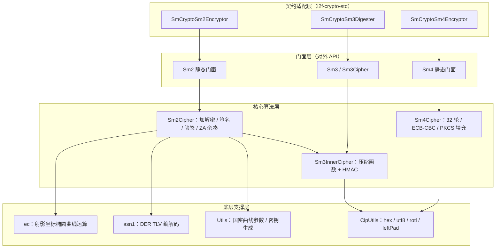
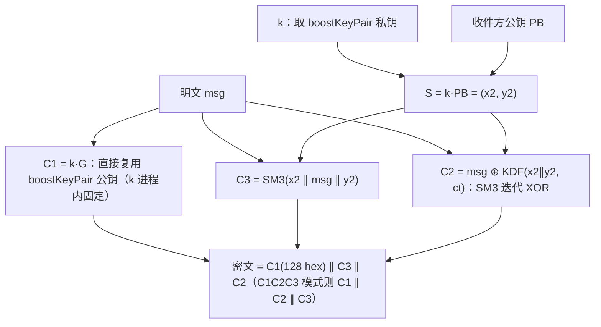
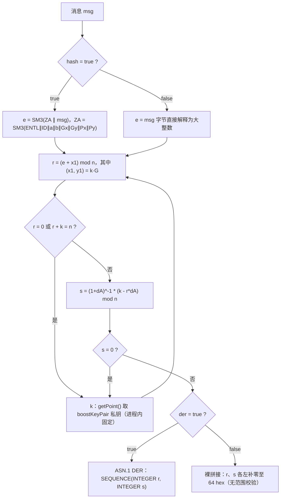
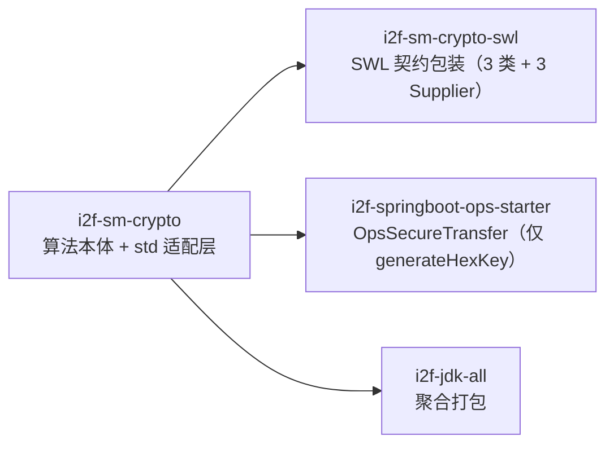

# i2f-sm-crypto

> **纯 Java 国密算法实现库**（SM2 / SM3 / SM4 三算法全自研，25 个类型 / 约 2565 行 + 384 行测试）：JS 库 `sm-crypto`（antherd/JuneAndGreen 版，基于 jsbn）的等价 Java 移植——在 `src/main/java/i2f/sm/crypto/**` 目录树内**逐文件保留 JS 参考源码**（8 个 `.js` 文件约 1340 行）作为移植对照。提供 SM2 加解密（C1C3C2/C1C2C3）、SM2 签名验签（裸 r||s / ASN.1 DER、可开关 ZA 杂凑）、SM3 杂凑与 HMAC-SM3、SM4 分组密码（ECB/CBC、PKCS#5/PKCS#7），零密码学三方依赖（仅编译期 `provided` 引 antherd `sm-crypto` 做测试对照）；三方依赖倒挂三层——`ec`（射影坐标椭圆曲线）→ `sm2/sm3/sm4`（算法核心）→ `std`（`i2f-crypto-std` 契约适配），配套 Vue3 演示工程与性能对比测试。⚠ 模块存在**严重安全缺陷**：`Sm2Cipher.boostKeyPair` 静态缓存的随机数 k 被永久复用，已实证可由两条签名恢复私钥（见「模块瑕疵或错误」）。

## 模块路径

- `i2f-jdk/i2f-sm-crypto`

## 模块依赖

| 坐标 | scope | optional | 说明 |
|------|-------|----------|------|
| `i2f.turbo:i2f-crypto-std` | compile | - | 上游密码契约：`IAsymmetricEncryptor` / `ISymmetricEncryptor` / `IMessageDigester` 及 `AsymKeyPair` / `BytesKey` / `BytesPublicKey` / `BytesPrivateKey` 密钥载体（`std` 适配层实现） |
| `i2f.turbo:i2f-codec-impl` | compile | - | 编解码实现：`HexStringByteCodec`（hex 收尾）与 `CharsetStringByteCodec.UTF8`（UTF-8 收尾），经 `CipUtils`/`Utils` 承接 JS 版 `hex/utf8` 工具函数 |
| `i2f.turbo:i2f-bytes` | compile | - | `ByteUtil.ofBigEndian` 用于 SM3 消息扩展的字（4 字节大端）读取 |
| `org.projectlombok:lombok` | provided | ✓（父 POM 统一） | **真实使用**：8 个文件使用 `@Data` / `@NoArgsConstructor`（KeyPair、Asn1.Der、Asn1Object、EcParam、EcCurveFp、EcPointFp、EcFieldElementFp、Sm2Cipher.Point、SmCryptoSm2Encryptor） |
| `com.antherd:sm-crypto:0.3.2.1-RELEASE` | provided | - | antherd 官方 JS 库（J2V8/Nashorn 封装）——仅 `TestCmpSm` 测试对照与性能对比使用，主源码零引用 |
| `org.openjdk.nashorn:nashorn-core:15.4` | provided | ✓ | Java 15+ 环境补充被移除的 Nashorn JS 引擎（antherd 库运行依赖）；JDK8 环境无需引入 |

构建插件与全仓惯例一致：`maven-assembly-plugin`（父 POM 统一配置 jar-with-dependencies）。

## 模块设计

### 包结构

```
i2f.sm.crypto
├── sm2/
│   ├── Sm2.java                            # SM2 静态门面（密钥/加解密/签名/验签/公钥推导/getPoint）
│   ├── Sm2Cipher.java                      # SM2 核心（438 行）：加解密、签名、验签、ZA 杂凑、boostKeyPair
│   ├── Utils.java                          # 曲线参数（GB/T 32918 标准值）、密钥对生成、压缩/校验公钥、utf8↔hex
│   ├── KeyPair.java                        # 公私钥 16 进制字符串对（@Data）
│   ├── Sm3Inner.java / Sm3InnerCipher.java # SM3 压缩函数 + HMAC（被 sm3 包与 SM2 共用）
│   ├── Asn1.java                           # DER 编解码入口（encodeDer / decodeDer / Der 结构体）
│   ├── asn1/
│   │   ├── Asn1Object.java                 # TLV 基类（getEncodedHex / getLength 短/长格式）
│   │   ├── DerInteger.java / DerSequence.java  # INTEGER(0x02) / SEQUENCE(0x30) 标签对象
│   │   └── Asn1Inner.java                  # TLV 解析辅助（bigintToValue / getLenOfL / getL / getStartOfV）
│   ├── ec/
│   │   ├── EcParam.java                    # 曲线+基点 G+阶 n 三元组
│   │   ├── EcCurveFp.java                  # 素域曲线 y²=x³+ax+b（decodePointHex 解析 0/2/3/4/6/7 前缀）
│   │   ├── EcPointFp.java                  # 射影坐标点（加减倍点、negate、isInfinity、3k 窗口 multiply）
│   │   ├── EcFieldElementFp.java           # 素域元素（四则/平方/取反）
│   │   └── EcInner.java                    # BigInteger 常量 2/3
├── sm3/
│   ├── Sm3.java                            # SM3 静态门面（String/byte[] 双通道）
│   └── Sm3Cipher.java                      # SM3/HMAC 分发（Mode 枚举）
├── sm4/
│   ├── Sm4.java                            # SM4 静态门面（密钥生成/加解密 String/byte[] 双通道）
│   └── Sm4Cipher.java                      # SM4 核心（328 行）：Sbox/CK、32 轮、ECB/CBC、PKCS 填充
├── std/
│   ├── SmCryptoSm2Encryptor.java           # IAsymmetricEncryptor 适配（加解密/签名/验签 + 密钥 6 形态存取）
│   ├── SmCryptoSm3Digester.java            # IMessageDigester 适配（INSTANCE 单例 + String 便捷方法）
│   └── SmCryptoSm4Encryptor.java           # ISymmetricEncryptor 适配（Key/String/byte[] 密钥形态）
├── exception/
│   └── SmException.java                    # 模块唯一异常（extends RuntimeException）
└── util/
    └── CipUtils.java                       # 编解码/rotl 循环左移/leftPad 左补零
```

> 注：`src/main/java/i2f/sm/crypto/**` 下 8 个 `.js` 文件为 JS 原版参考（与上述 Java 文件同名同层级），Maven 不编译、不打包；`src/main/web/` 为 Vue3+Vite 演示工程（内含完整 JS 版 sm-crypto 副本）。

### 分层架构



### SM2 加密流程（默认 C1C3C2）



### SM2 签名 / 验签流程



验签逆运算：`t = (r + s) mod n`；`(x1', y1') = s·G + t·PA`；判定 `r == (e + x1') mod n`。

### 设计要点

1. **JS 一比一移植取向**：函数命名（`doEncrypt`/`doDecrypt`/`doSignature`/`doVerifySignature`/`getHash`/`getPoint`/`compressPublicKeyHex`）、参数形态（hex 字符串出入口、`pointPool` 点池、`der`/`hash` 开关、默认 `userId="1234567812345678"`）均与 JS 原版对齐；`src/main/java` 内嵌 JS 源文件作为移植基准与后续维护对照。
2. **椭圆曲线层为 jsbn 的忠实翻译**：`EcFieldElementFp`（素域四则）、`EcPointFp`（**标准射影坐标系**，`add`/`twice` 按 λ 公式展开）、`multiply` 采用 **3k 加减法窗口算法**（`k3 = 3k`，逐位比较 `k` 与 `k3` 决定加 `±G`），无 Montgomery/Jacobian 优化，性能依赖 `BigInteger`。
3. **SM3 双入口共用一套压缩函数**：`sm3` 包只做 String/hex 收尾，压缩与 HMAC 全部落于 `sm2.Sm3InnerCipher`（历史原因被 SM2 包"借用"）；HMAC 为标准 iPad（0x36）/oPad（0x5c）双轮结构，块长 64。
4. **SM4 自底向上单文件实现**：Sbox（256 项）/CK（32 项）常量内联，`byteSub`/`l1`/`l2` 位运算 + `sms4KeyExt` 密钥扩展（解密时轮密钥反序）+ `sms4Crypt` 4 字并行 32 轮；`sms4Crypt`/`sms4KeyExt` 为 `public`，可绕过上层填充直接做标准向量验证（探针即以此验证）。
5. **密文两种序模式**：`CipherMode.C1C3C2`（默认，新国标）与 `C1C2C3`（旧序），按需切分/拼装；解密时从密文前 64 字节还原 C1 并补 `04` 前缀解码。
6. **DER 自研 TLV 编解码**：`Asn1Object`（TLV 基类）→ `DerInteger`/`DerSequence` 组装；解析走 `Asn1Inner.getStartOfV/getL` 游标推进，`bigintToValue` 处理正数前导 `00` 与负数补码。
7. **"预生成密钥对"加速机制（本设计的核心偏差点）**：`Sm2Cipher.boostKeyPair` 静态字段在类初始化时生成一次密钥对，并由守护线程（`boost-sm2-key-gen`）再生成一次替换，此后**加密的 k 与签名的 k 永久复用同一值**——JS 原版为"预生成点池、取完即换"（每次 `generateKeyPairHex` 或 `pointPool` 耗尽后重新生成），Java 移植时退化为"只生成一次"，构成严重安全缺陷（详见下文）。
8. **契约适配层的二进制语义走 UTF-8 String 往返**：`std` 三个适配器在 `byte[]` 与 `String` 之间一律经 `CharsetStringByteCodec.UTF8` 转换（对齐 SWL 场景的文本传输需求），对非 UTF-8 二进制数据存在损坏风险（详见瑕疵）。
9. **异常体系单一**：全模块仅 `SmException`（RuntimeException）一个异常类型，`decrypt error`/`iv is invalid`/`key is invalid`/`padding is invalid`/`Malformed UTF-8 data` 等消息为排障锚点。
10. **测试即演示**：3 个测试类均为 `main` 方法直跑（无 JUnit 依赖），`TestCmpSm` 与 antherd JS 版逐项对照 + 1000 次性能基准对比；配套 `web/` Vue3 工程用打包的 JS 版演示同款能力。

## 模块目的

- 为 `i2f` 生态提供**零三方依赖的纯 Java 国密算法底座**：JDK 原生 `Security` 不含 SM2/SM3/SM4（JDK8），本模块使 JDK8 环境无需引入 BouncyCastle 即可获得完整国密能力。
- 作为 `i2f-crypto-std` 契约的国密实现落位（`SmCryptoSm2Encryptor`/`SmCryptoSm3Digester`/`SmCryptoSm4Encryptor`），直接支撑 `i2f-sm-crypto-swl` 的 SWL 安全传输族，与 AES/RSA 实现可互换插拔。
- 提供与 JS 版 `sm-crypto` **同构的 API 形态**（hex 字符串出入口、同名方法、同语义开关），服务 Java 后端与前端 JS 演示/联调的同构移植诉求。
- 保留 JS 原版源码于源码树中，作为移植基准、行为对照与后续维护的"单一事实源"。

## 模块功能

| 类型 | 定位 | 关键方法 | 说明 |
|------|------|----------|------|
| `Sm2`（sm2 包） | SM2 静态门面 | `generateKeyPairHex` / `doEncrypt` / `doDecrypt` / `doSignature` / `doVerifySignature` / `getPublicKeyFromPrivateKey` / `getPoint` / `compressPublicKeyHex` / `verifyPublicKey` / `comparePublicKeyHex` | String 与 byte[] 双通道重载；加解密/签名均带 `CipherMode`/`der`/`hash` 参数 |
| `Sm2Cipher` | SM2 核心实现 | `doEncrypt` / `doDecrypt` / `doSignature` / `doVerifySignature` / `getHash` / `getPoint` | 438 行；KDF（SM3 迭代 XOR）、ZA 杂凑、DER 开关、点池 `pointPool` |
| `Utils` | 曲线与密钥工具 | `generateKeyPairHex` / `generateEcparam` / `compressPublicKeyHex` / `verifyPublicKey` / `comparePublicKeyHex` / `utf8ToHex` / `arrayToUtf8` / `hexToArray` | 国密推荐曲线参数（p/a/b/Gx/Gy/n）硬编码；`a,b,c` 三参变体支持外部注入随机源 |
| `KeyPair` | 密钥载体 | getter/setter | `publicKey`（`04` 前缀 130 hex）/ `privateKey`（64 hex）字符串对 |
| `EcPointFp` | 射影坐标点 | `add` / `twice` / `multiply` / `negate` / `isInfinity` / `equals(EcPointFp)` | 3k 窗口乘法；`getX()/getY()` 惰性求逆（副作用缓存 `zinv`） |
| `EcCurveFp` | 素域曲线 | `decodePointHex` / `fromBigInteger` | 支持 0（无穷远）/2/3（压缩）/4/6/7（未压缩）前缀解析 |
| `EcFieldElementFp` | 素域元素 | `add` / `subtract` / `multiply` / `divide` / `square` / `negate` | `divide` 依赖 `modInverse` |
| `EcParam` / `EcInner` | 曲线参数三元组 / 常量 | — | `EcParam(curve, g, n)`；`EcInner.TWO/THREE` |
| `Asn1` / `asn1.*` | DER 编解码 | `encodeDer` / `decodeDer` | `DerInteger(0x02)` + `DerSequence(0x30)`；`Asn1Object` 支持长/短格式长度 |
| `Sm3` / `Sm3Cipher` | SM3 门面与分发 | `sm3(input[, mode, key])` | `Mode.SM3`（默认）/`Mode.HMAC`；String 出入口为 hex |
| `Sm3InnerCipher` | SM3 压缩函数 + HMAC | `sm3` / `hmac` / `P0` / `P1` / `xor` | 消息扩展 W[68]/W'[64]，64 轮压缩，V 初始值国标 |
| `Sm4` / `Sm4Cipher` | SM4 门面与核心 | `generateKey` / `generateHexKey` / `encrypt` / `decrypt` / `sms4KeyExt` / `sms4Crypt` | `Padding.PKCS_7`（默认）/`PKCS_5`；`Mode.ECB`（默认）/`CBC` |
| `SmCryptoSm2Encryptor` | `IAsymmetricEncryptor` 适配 | `genKey` / `genKeyPair` / `encrypt` / `decrypt` / `sign` / `verify`（String/byte[] 双形态） | 密钥 6 种形态互转（KeyPair/PublicKey/PrivateKey/byte[]/String/AsymKeyPair） |
| `SmCryptoSm3Digester` | `IMessageDigester` 适配 | `INSTANCE` / `digest(String/byte[]/InputStream)` / `verify` | 单例；流式读取（4096 缓冲）后 close 输入流 |
| `SmCryptoSm4Encryptor` | `ISymmetricEncryptor` 适配 | `genKey(静态)` / `keyOf` / `encrypt` / `decrypt` | 密钥以 hex String 存储 |
| `SmException` | 模块唯一异常 | — | extends RuntimeException，无条件携带消息 |
| `CipUtils` | 编解码/位运算工具 | `hexToArray` / `arrayToHex`（强制小写）/ `utf8ToArray` / `arrayToUtf8` / `rotl` / `leftPad` | 底层委托 `i2f-codec-impl` |

## 模块主要使用方法

### 1. SM2 密钥对与公钥处理

```java
// 生成密钥对：publicKey 为 04‖x‖y（130 hex），privateKey 为 64 hex
KeyPair keyPair = Sm2.generateKeyPairHex();

String pub = keyPair.getPublicKey();       // 04 + 128 hex
String pri = keyPair.getPrivateKey();      // 64 hex

// 由私钥推导公钥（P = d·G）
String pub2 = Sm2.getPublicKeyFromPrivateKey(pri);

// 压缩公钥（04‖x‖y → 02/03‖x，按 y 奇偶选前缀；仅接受 130 长度）
String compressed = Sm2.compressPublicKeyHex(pub);

// 公钥校验与等价比较（均为曲线成员校验，非完整 SM2 公钥合法性校验）
boolean onCurve = Sm2.verifyPublicKey(pub);
boolean same = Sm2.comparePublicKeyHex(pub, pub2);
```

### 2. SM2 加解密（String 通道，默认 C1C3C2）

```java
// String 明文 → hex 密文；解密 hex 密文 → UTF-8 明文
String enc = Sm2.doEncrypt("Hello 你好", pub);
String dec = Sm2.doDecrypt(enc, pri);

// 切换 C1C2C3 旧序（加密/解密必须成对使用同一模式）
String encOld = Sm2.doEncrypt("Hello 你好", pub, Sm2Cipher.CipherMode.C1C2C3);
String decOld = Sm2.doDecrypt(encOld, pri, Sm2Cipher.CipherMode.C1C2C3);

// byte[] 通道（⚠ 加密会就地篡改入参数组，且解密失败抛 SmException("decrypt error")）
byte[] encBytes = Sm2.doEncrypt(new byte[]{1, 2, 3}, pub);   // 入参会被写坏，先 clone
byte[] decBytes = Sm2.doDecrypt(encBytes, pri);
```

### 3. SM2 签名与验签

```java
// 默认：裸 r‖s（各 32 字节、左补零 64 hex），不做杂凑
String sign = Sm2.doSignature("payload", pri);
boolean ok = Sm2.doVerifySignature("payload", sign, pub);

// 变体：der=true（ASN.1 DER 编码）、hash=true（先算 ZA 杂凑，可指定 userId）
String derSign = Sm2.doSignature("payload", pri);
String sign2 = Sm2.doSignature("payload", pri, null, true, false, null, null);
boolean ok2 = Sm2.doVerifySignature("payload", sign2, pub, true, false, null);

String sign3 = Sm2.doSignature("payload", pri, null, false, true, pub, "1234567812345678");
boolean ok3 = Sm2.doVerifySignature("payload", sign3, pub, false, true, "1234567812345678");
```

> ⚠ 签名方法内部使用 `boostKeyPair` 的固定 k（非随机），**不要在生产环境直接使用本模块的签名能力**（详见「模块瑕疵或错误」第 1 条）。

### 4. SM3 杂凑与 HMAC

```java
// SM3 摘要：String 出入口为 hex（64 字符）
String hash = Sm3.sm3("abc");
// 66c7f0f462eeedd9d1f2d46bdc10e4e24167c4875cf2f7a2297da02b8f4ba8e0

// byte[] 出入口（返回 32 字节原始摘要）
byte[] hashBytes = Sm3.sm3("abc".getBytes("UTF-8"));

// HMAC-SM3：key 为 hex 字符串（或 byte[]），非可选；key=null/空时抛 SmException("invalid key")
String mac = Sm3.sm3("abc", Sm3Cipher.Mode.HMAC, "0123456789abcdef0123456789abcdef");
byte[] macBytes = Sm3.sm3(data, Sm3Cipher.Mode.HMAC, keyBytes);
```

### 5. SM4 加解密与密钥生成

```java
// 生成 16 字节密钥（hex 字符串 / 原始字节）
String keyHex = Sm4.generateHexKey();
byte[] key = Sm4.generateKey();

// 默认 ECB + PKCS#7：String 明文 → hex 密文，解密反向
String enc = Sm4.encrypt("hello sm4", keyHex);
String dec = Sm4.decrypt(enc, keyHex);

// CBC + 指定 IV（IV 必须 16 字节，否则抛 SmException("iv is invalid")）
String iv = "000102030405060708090a0b0c0d0e0f";
String encCbc = Sm4.encrypt("hello sm4", keyHex, Sm4Cipher.Padding.PKCS_7, Sm4Cipher.Mode.CBC, iv);
String decCbc = Sm4.decrypt(encCbc, keyHex, Sm4Cipher.Padding.PKCS_7, Sm4Cipher.Mode.CBC, iv);

// byte[] 通道（key 必须 16 字节）
byte[] encBytes = Sm4.encrypt(data, key, Sm4Cipher.Padding.PKCS_7, Sm4Cipher.Mode.ECB, null);
```

标准向量对照（探针实证通过）：`key = pt = 0123456789abcdeffedcba9876543210` 单块加密结果为 `681edf34d206965e86b3e94f536e4246`，可用 `sms4KeyExt + sms4Crypt` 直接复现。

### 6. i2f-crypto-std 契约适配（面向接口编程）

```java
// SM2：IAsymmetricEncryptor —— 密钥 6 形态互转 + 加解密/签名/验签
SmCryptoSm2Encryptor sm2 = new SmCryptoSm2Encryptor(pub, pri);
byte[] cipher = sm2.encrypt(data);          // 走 UTF-8 String 往返（二进制慎用）
byte[] plain = sm2.decrypt(cipher);
byte[] sign = sm2.sign(data);
boolean ok = sm2.verify(sign, data);        // ⚠ 已知缺陷：恒失败/抛异常（见瑕疵第 2 条）

i2f.sm.crypto.sm2.KeyPair kp = SmCryptoSm2Encryptor.genKey();
KeyPair jdkKp = SmCryptoSm2Encryptor.genKeyPair();  // JDK KeyPair（BytesPublicKey/BytesPrivateKey）

// SM3：IMessageDigester 单例
byte[] digest = SmCryptoSm3Digester.INSTANCE.digest(data);  // ⚠ 返回 hex-ASCII 64 字节（见瑕疵第 6 条）
String hex = SmCryptoSm3Digester.INSTANCE.digest("text");
boolean ok2 = SmCryptoSm3Digester.INSTANCE.verify(hex, "text");

// SM4：ISymmetricEncryptor
SmCryptoSm4Encryptor sm4 = new SmCryptoSm4Encryptor(keyHex);
byte[] cipher2 = sm4.encrypt(data);
byte[] plain2 = sm4.decrypt(cipher2);
```

### 7. 注意事项

1. **加解密输出的 C1 来自进程级固定 k**（`boostKeyPair`）：同一 JVM 内不同调用加密同一明文会得到**完全相同**的密文；请务必阅读「模块瑕疵或错误」第 1 条再决定是否使用。
2. **`doEncrypt(byte[])`/`doDecrypt(byte[])` 就地修改入参数组**（加密后的入参即密文），调用方需自行 `clone()`。
3. **`std` 适配层的 byte[] 接口走 UTF-8 String 往返**：仅适用于文本内容；非 UTF-8 二进制（如 0xFF/0xFE）会在编码时被替换字符损坏。
4. **`SmCryptoSm2Encryptor.cipherMode` 字段无效**：字段声明默认 `C1C2C3` 但从未传入 `Sm2` 调用，String/byte[] 路径实际固定 C1C3C2，设置该字段不改变行为。
5. **解密失败语义**：SM2 篡改密文抛 `SmException("decrypt error")`（c3 校验）；SM4 解密空输入抛 `ArrayIndexOutOfBoundsException`（非业务异常）；SM4 密文不足整块时尾部残块被静默丢弃（随后填充校验大概率抛 `padding is invalid`）。
6. **`der=true` 验签对畸形输入抛异常**（如 `StringIndexOutOfBoundsException`/`NumberFormatException`），而非返回 `false`；`der=false` 时签名 hex 短于 64 字符同样抛 `StringIndexOutOfBoundsException`。
7. **`hash=true` 的互操作边界**：签名与验签在本模块内部自洽（已实证），但 ZA 的 ENTL 字段使用小端字节序，与 GB/T 32918 标准及 JS 版 `sm-crypto` 不一致（见瑕疵第 3 条），跨实现验签会失败。
8. **`decodePointHex` 不校验点在曲线上**：`doEncrypt`/`doVerifySignature` 解码外部传入公钥时不做过曲线校验（`Sm2.verifyPublicKey` 才校验），存在无效曲线攻击面。
9. **SM4 无 NoPadding 选项**：`Padding` 枚举仅 PKCS_7/PKCS_5，加密端一律填充（null 默认 PKCS_7）；如需零填充需自行处理。

## 模块特性总结

- **零密码学三方依赖**：SM2/SM3/SM4 全自研（BigInteger 域运算 + 位运算），仅编译期 `provided` 引入 antherd `sm-crypto`（测试对照）与 nashorn-core（Java 15+ JS 引擎补充，optional）。
- **JS 同构移植**：函数命名、参数形态、默认值、hex 出入口与 JS 版 `sm-crypto` 一一对应，源码树内嵌 JS 原版作对照。
- **完整 SM2 能力面**：密钥生成/压缩/校验、加解密（C1C3C2/C1C2C3）、签名验签（DER/裸序、ZA 开关、userId 可配）、公钥推导。
- **SM3 双形态**：摘要 + HMAC；SM4 双模式（ECB/CBC）+ 双填充（PKCS#5/PKCS#7）+ 密钥生成。
- **算法本体经标准向量验证**：SM3（`abc`/64×`abcd` 两组）与 SM4 单块向量通过；SM2 DER 签名、C1C2C3 模式、hash 模式往返自洽。
- **契约适配层可插拔**：`std` 三适配器实现 `i2f-crypto-std` 契约，与 AES/RSA 实现互换用于 SWL 安全传输族。
- **⚠ 安全性不可用于生产**：`boostKeyPair` k 复用（已实证恢复私钥）、ZA 端序偏差、`verify(byte[])` 恒失败——三个致命/高危缺陷详见下文。
- **测试即 main 程序**：对照 antherd 版逐项验证 + 性能基准（1000 次）；配套 Vue3 演示工程。

## 模块瑕疵或错误

> 以下缺陷按严重度分级；标注「探针实证」的条目已在 JDK8 + 模块 `target/classes` 环境实际运行复现（见「运行时探针实证」表）。

### 1.【严重·安全】boostKeyPair：k 进程级永久复用（加密密钥流复用 + 签名私钥可恢复）

`Sm2Cipher` 静态字段与静态块（`Sm2Cipher.java:28-48`）：

```java
protected static volatile KeyPair boostKeyPair = Utils.generateKeyPairHex();

static {
    Thread thread = new Thread(() -> {
        try {
            KeyPair pair = Utils.generateKeyPairHex();
            if (pair != null) { boostKeyPair = pair; }
        } catch (Throwable e) { System.err.println(e); }
        try { TimeUnit.SECONDS.sleep(15); } catch (Exception e) {}
    });
    thread.setDaemon(true);
    thread.setName("boost-sm2-key-gen");
    thread.start();
}
```

- 守护线程**只生成一次密钥对并替换，缺少 JS 原版的"取完即换/循环补充"**（JS 版 `sm2/index.js` 每次调用 `generateKeyPairHex` 或点池耗尽重新生成），替换后线程休眠 15 秒即结束，`boostKeyPair` 此后**永久固定**。
- `doEncrypt`（`Sm2Cipher.java:69-73`）与 `getPoint()`（`Sm2Cipher.java:422-436`）均直接使用该固定密钥对：**加密的 k 与签名的 k 是同一个进程级常量**（`Point extends KeyPair`，临时私钥 k 通过 getter 公开暴露）。
- **加密侧**：同 JVM 内两次加密同明文同公钥 → 密文完全相同（C1、C2、C3 全同）；不同明文 → 密钥流相同，`C2₁ ⊕ C2₂ = m₁ ⊕ m₂`，已知一条明文即可恢复另一条。
- **签名侧**：两次签名 nonce k 相同 → 私钥可被**两条签名直接解出**：`dA = (s₁−s₂) / ((r₂−r₁) − (s₁−s₂)) mod n`。探针实测：同一消息两次签名完全相同；两条不同消息签名后恢复私钥 `match=true`。
- 附带现象：进程启动初期存在"K1 → K2"的替换窗口（守护线程生成完成后替换），窗口期前后密文 C1 前缀会突变（探针观察到首次 3 连调用 `c1==c2:false`，3 秒后稳定为 `true`），行为不可预期。
- **修复方向**：每次加密/签名调用 `Utils.generateKeyPairHex()`（或恢复 JS 式点池"取完即换"），绝不可跨调用缓存 k。

### 2.【高·功能】SmCryptoSm2Encryptor.verify(byte[],byte[])：签名参数错用为 data（探针实证）

`SmCryptoSm2Encryptor.java:201-205`：

```java
@Override
public boolean verify(byte[] sign, byte[] data) throws Exception {
    String signHex = HexStringByteCodec.INSTANCE.encode(data);  // BUG：应为 sign
    String str = CharsetStringByteCodec.UTF8.encode(data);
    return verify(signHex, str);
}
```

- `sign` 参数被完全忽略，`data` 的 hex 被当作签名去验证 `data` 本身——签名正确与否都不可能通过；`data` 的 hex 短于 64 字符时直接抛 `StringIndexOutOfBoundsException`，恰为 32 字节时抛 `NumberFormatException: Zero length BigInteger`（探针实测两种均复现）。
- 影响：所有经 `IAsymmetricEncryptor.verify(byte[],byte[])` 契约调用本实现的上层（含潜在的 SWL 验签链路）验签必然失败/异常。
- 修复：`String signHex = HexStringByteCodec.INSTANCE.encode(sign);` 并补 `signToHex`/`hexToSign` 语义对称测试。

### 3.【高·互操作】ZA 杂凑 ENTL 字节序为小端（探针实证，与 GB/T 32918/JS 版不一致）

`Sm2Cipher.getHash`（`Sm2Cipher.java:385-389`）：

```java
byte[] tmp = new byte[2 + data.length];
tmp[0] = (byte) (entl & 0x00ff);       // 小端：低字节在前
tmp[1] = (byte) (entl >> 8 & 0x00ff);
```

- GB/T 32918.2 与 JS 原版均为大端（`unshift(entl >> 8 & 0xff)` 再 `unshift(entl & 0xff)`）；探针以 `userId="1234567812345678"`（ENTL=128=0x0080）对照计算：**实现结果 == 小端构造，≠ 大端构造**。
- 影响：`hash=true` 的签名/验签仅在本模块内部自洽（双方都错），与标准 SM2 实现、antherd JS 版、国密工具链**互不通过**；涉及 ZA 的场景（证书签名等）不可互通。
- 修复：`tmp[0] = (byte)((entl >> 8) & 0xff); tmp[1] = (byte)(entl & 0xff);`。

### 4.【高·副作用】doEncrypt(byte[])/doDecrypt(byte[]) 就地篡改入参数组（探针实证）

`Sm2Cipher.java:121`（解密侧同型，`Sm2Cipher.java:202`）：

```java
msg[i] = (byte) ((msg[i] ^ t.get()[offset.getAndIncrement()]) & 0x0ff);
```

- `c2 = msg` 直接复用入参数组写回：调用方传入的明文数组在加密后变为密文（探针：`before=6162636465666768` → `after=dab499e6d583873b`），解密同理。调用方未预期时会造成数据静默损坏。
- 修复：`byte[] c2 = Arrays.copyOf(msg, msg.length);` 后对副本异或。

### 5.【中·数据安全】std 适配层 byte[] 接口走 UTF-8 String 往返：非 UTF-8 二进制损坏（探针实证）

`SmCryptoSm2Encryptor.java:180-191`、`SmCryptoSm4Encryptor.java:73-84`、`SmCryptoSm3Digester.java:35-39`：

```java
public byte[] encrypt(byte[] data) throws Exception {
    String str = CharsetStringByteCodec.UTF8.encode(data);  // 二进制 → UTF-8 字符串（有损）
    String hex = encrypt(str);
    return HexStringByteCodec.INSTANCE.decode(hex);
}
```

- 非 UTF-8 字节序列在 `UTF8.encode` 时被替换字符（U+FFFD）替换后不可逆：探针输入 `fFFE010203` 往返得到 `efbfbdefbfbd010203`（`equal=false`）。SM2/SM4 两适配器同样中招（已分别实证）。
- 修复：byte[] 通道应直接走 hex/字节，不经字符集转换（如 `SmCryptoSm4Encryptor` 可用 `CipUtils.arrayToHex` 直转 key/data）。

### 6.【中·契约】SmCryptoSm3Digester.digest(byte[]) 返回 hex-ASCII 编码而非原始摘要（探针实证）

`SmCryptoSm3Digester.java:34-39`：

```java
public byte[] digest(byte[] data) throws Exception {
    String str = new String(data, "UTF-8");   // 二进制不安全
    String digest = digest(str);
    return digest.getBytes("UTF-8");          // 返回 64 字节 hex 文本
}
```

- 违反 `IMessageDigester` 语义（应为 32 字节原始摘要）：探针得到 `len=64`，内容为标准 hex 串；`InputStream` 变体与 `digest(byte[])` 同病，且会 close 入参流。
- 修复：改为 `return Sm3InnerCipher.sm3(data);` 直接返回 32 字节。

### 7.【中·健壮性】SM4 边界与 std 字段失效（探针实证）

- **解密空输入**：`Sm4Cipher.java:296-297` 去填充取 `outArray.get(len-1)`，空输入时抛 `ArrayIndexOutOfBoundsException: -1`（探针实测），非业务异常且排查困难；应先判空抛 `SmException`。
- **尾部残块静默丢弃**：主循环 `while (restLen >= BLOCK)`（`Sm4Cipher.java:252`）只处理整块，非 16 倍数的密文尾字节被丢弃后再去填充，报错信息（`padding is invalid`）无法定位"长度非法"根因；应在入口校验 `inArray.length % BLOCK == 0`（解密侧）。
- **`cipherMode` 字段失效**：`SmCryptoSm2Encryptor.java:24` 声明 `C1C2C3` 默认值但从未传入 `Sm2.doEncrypt/doDecrypt` 调用，String/byte[] 路径恒为 `Sm2` 默认 C1C3C2（探针：切换字段前后密文相同）；字段误导调用方。
- **SM2 错误模式解密**抛 `SmException("decrypt error")`（可接受，但无法区分"模式错误"与"密文被篡改"）。

### 8.【中·工程】测试覆盖与断言失效

- `TestCmpSm`/`TestSm`/`TestUnit` 均为 `main` 直跑 + `assert` 断言：默认 JVM 不带 `-ea` 时**断言全部静默失效**，回归失去保护。
- `der`/`hash`/`C1C2C3`/HMAC 路径在全模块测试中**零覆盖**（`TestCmpSm` 只用默认 `der=false/hash=false/C1C3C2`）；`SmCryptoSm2Encryptor.verify(byte[])` 的严重 bug 因而未被发现。
- `TestCmpSm` 中 `cmp2Ok`/`cmp3Ok`（与 antherd 交叉验签）仅打印不断言；性能测试 `perf=true` 只跑 1 轮。

### 9.【低·代码质量】其余问题

| 问题 | 位置 | 说明 |
|------|------|------|
| `getLenOfL` 运算符优先级 bug | `Asn1Inner.java:50` | `x & 0x07f + 1` 实际为 `x & 0x80`，长格式长度分支失效（对 ≤127 字节的 SM2 DER 属死代码，超大整数场景会解析错误）；`charAt` 单字符 parseInt 遇 A-F 亦会 NFE |
| `EcPointFp` 双 `equals` 语义 | `EcPointFp.java:52` | 手写 `equals(EcPointFp)`（射影等价）与 `@Data` 生成的 `equals(Object)`（字段等价）并存，`comparePublicKeyHex` 走前者，集合/缓存场景易踩后者 |
| `@Data` getter 副作用 | `EcPointFp.getX()/getY()` | 首次调用缓存 `zinv`（惰性求逆），getter 有可观察副作用；`@NoArgsConstructor` 下反序列化对象 getter 直接 NPE |
| `EcFieldElementFp` 缺 x<q 校验 | `EcFieldElementFp.java:25` | TODO 未实现：构造元素时不校验 `x >= q`，非法输入静默进入运算 |
| `decodePointHex` 不验曲线成员 | `EcCurveFp.java:49-85` | 仅解析坐标，不解方程校验；`doEncrypt`/`doVerifySignature` 直接接受任意 hex 公钥（无效曲线攻击面） |
| `compressPublicKeyHex` 窄支持 | `Utils.java:77-92` | 仅接受 130 长度（带 04 前缀）；已压缩输入再压缩直接抛 `SmException` |
| `Utf8ToHex` 走整数位运算还原 | `Utils.java:97-142` | JS 移植痕迹：字节序经由 `int` 字移位往返，功能正确但绕路；`arrayToUtf8` 对非法 UTF-8 抛 `SmException("Malformed UTF-8 data")`（丢失原始异常） |
| SM3 长度字段溢出 | `Sm3InnerCipher.java:44` | `int len = array.length * 8`：输入 ≥ 256MB 时 int 溢出，超大输入摘要错误（低危） |
| `getPoint()` 公开暴露 k | `Sm2Cipher.java:422-436` | `Point extends KeyPair` 且 getter 公开，临时私钥 k 泄漏给任意调用方 |
| 异常消息未分级 | 全模块 | `SmException("decrypt error")` 等无错误码，无法程序化区分 |
| 演示工程为脚手架 | `web/` | Vue3+Vite 默认模板 + `HelloWorld.vue`（用打包 JS 版计算展示），未与 Java 实现联动 |

## 运行时探针实证

> 探针源码与运行脚本（`target/probe/Probe.java`、`build.bat`，`target` 目录已被 `.gitignore` 忽略）在 JDK 1.8.0_201 下编译运行，classpath = 模块 `target/classes` + 本地仓库依赖；结论：**18 通过 / 2 失败 / 11 观察**（失败项均对应上表缺陷）。

| 探针 | 结果 | 关键输出 |
|------|------|----------|
| SM3 标准向量 `abc` | ✅ PASS | `66c7f0f4...8f4ba8e0` 与国标一致 |
| SM3 标准向量 64×`abcd` | ✅ PASS | `debe9ff9...9c0c5732` 与国标一致 |
| SM3-HMAC | 观察 | `len=64`，功能可用（无标准向量断言） |
| SM4 单块标准向量 | ✅ PASS | `681edf34d206965e86b3e94f536e4246` 与国标一致 |
| SM4 ECB/CBC 往返 | ✅ PASS | 文本数据往返一致 |
| SM2 同明文两次加密 | ✅ PASS | 密文**完全相同**（k 复用实锤）；3 秒后仍相同且跨调用 C1 前缀稳定 |
| SM2 密钥流复用 | 观察 | 两密文 C2 尾字节 XOR = `0x1` = 两明文尾字节 XOR（明文差异可提取） |
| SM2 同消息两次签名 | ✅ PASS | 签名**完全相同**（nonce 复用实锤） |
| SM2 私钥恢复 | ✅ PASS | 由两条不同消息签名按 `dA = Δs/(Δr−Δs)` 恢复私钥，`match=true`（严重级实证） |
| `std verify(String)` 正常签名 | ✅ PASS | `true`（String 通道正确） |
| `std verify(byte[])` 正常签名 | ❌ 失败 | 短数据抛 `StringIndexOutOfBoundsException`；32B 数据抛 `NumberFormatException`（sign 参数被忽略） |
| `doEncrypt(byte[])` 入参篡改 | ✅ PASS | `6172...6768` → `dab499e6d583873b`（入参变密文） |
| `Sm3Digester.digest(byte[])` | ❌ 失败 | 返回 64 字节 hex-ASCII 而非 32 字节摘要 |
| SM4 解密空输入 | 观察 | 抛 `ArrayIndexOutOfBoundsException: -1` |
| ZA ENTL 端序 | ✅ PASS | `impl==LE:true impl==BE:false`（小端实锤） |
| DER 签名往返 | ✅ PASS | 70 字节 DER 编码验签通过 |
| hash=true 往返 | ✅ PASS | 内部自洽（互操作性受端序影响除外） |
| C1C2C3 模式往返 | ✅ PASS | 往返成功；错误模式解密抛 `SmException("decrypt error")` |
| std SM2 加解密（ASCII） | ✅ PASS | 文本往返一致；`cipherMode` 字段切换无效实证 |
| std 二进制（SM2/SM4） | 观察 | `fFFE010203` → `efbfbdefbfbd010203`（UTF-8 往返损坏） |
| 篡改密文解密 | 观察 | 抛 `SmException("decrypt error")`（c3 校验生效） |

## 下游消费方一览

扫描口径：全仓 `import i2f.sm.crypto.*` 的外部主源码共 **7 文件 / 2 模块**（模块自身 25 文件除外）。

| 消费模块 | 文件 | 典型用法 |
|----------|------|----------|
| `i2f-sm-crypto-swl` | `SwlSmCryptoSm2AsymmetricEncryptor`、`SwlSmCryptoSm4SymmetricEncryptor`、`SwlSmCryptoSm3MessageDigester` + 3 个 `supplier/` Supplier 类 | 实现 SWL 契约 `ISwlAsymmetricEncryptor`/`ISwlSymmetricEncryptor`/`ISwlMessageDigester`，将 `SmCryptoSm2Encryptor`/`SmCryptoSm4Encryptor`/`SmCryptoSm3Digester`（std 适配层）委托给 SWL 安全传输族，异常统一包装为 `SwlException` |
| `i2f-springboot-ops-starter` | `OpsSecureTransfer.java:65` | 仅使用 `i2f.sm.crypto.sm4.Sm4.generateHexKey()` 生成本地随机 SM4 密钥；其余 SM2/SM3/SM4 计算用 antherd JS 版（同一文件内两套实现并存） |
| `i2f-jdk-all` | `pom.xml:521` | 聚合打包（聚合 jar 发布） |

源码证据行：

| 证据 | 位置 |
|------|------|
| `private SmCryptoSm2Encryptor encryptor = new SmCryptoSm2Encryptor();` | `i2f-sm-crypto-swl/.../SwlSmCryptoSm2AsymmetricEncryptor.java:16` |
| `private SmCryptoSm4Encryptor encryptor = new SmCryptoSm4Encryptor();` | `i2f-sm-crypto-swl/.../SwlSmCryptoSm4SymmetricEncryptor.java:14` |
| `private SmCryptoSm3Digester digester = SmCryptoSm3Digester.INSTANCE;` | `i2f-sm-crypto-swl/.../SwlSmCryptoSm3MessageDigester.java:12` |
| `String randomKey = i2f.sm.crypto.sm4.Sm4.generateHexKey();` | `i2f-springboot-ops-starter/.../OpsSecureTransfer.java:65` |
| `<artifactId>i2f-sm-crypto</artifactId>` | `i2f-jdk/i2f-jdk-all/pom.xml:521` |

消费关系（模块视角）：



## 测试工程与演示

| 资产 | 内容 |
|------|------|
| `TestCmpSm`（298 行） | 与 antherd JS 版逐项对照（SM3/SM4/SM2 的加解密、签名验签、密钥生成）+ 1000 次性能基准（`perf=true` 时仅 1 轮，`perf=false` 时随机中英文文本 300 轮）；交叉验签结果仅打印不断言 |
| `TestSm`（72 行） | 最简冒烟：SM3 一致性、SM4 往返、SM2 签名验签与加解密（`assert` 默认失效） |
| `TestUnit`（16 行） | `Utils.utf8ToHex/hexToArray` 的 UTF-8 与 hex 互转编码验证 |
| `web/`（Vue3 + Vite） | 脚手架演示工程：`HelloWorld.vue` 直接调用打包的 JS 版 sm-crypto 计算 SM2/SM3/SM4 并展示（`src/sm-crypto/` 为 JS 库完整副本），未与 Java 实现联动 |
| `target/probe/` | 本次文档的运行时探针（`Probe.java` + `build.bat` + `cp.txt`），已被 git 忽略，可重复用于回归 |

## 可拓展方向

1. **修复安全缺陷（最高优先）**：每次调用生成随机 k（或恢复 JS 式点池"取完即换"）；修 `verify(byte[])` 的签名参数；修 ZA 端序大端化；`doEncrypt` 使用数组副本。修复后 `i2f-sm-crypto-swl` 与 `OpsSecureTransfer` 才具备生产可用性。
2. **二进制安全改造**：std 适配层去掉 UTF-8 String 往返，直接走字节（`Sm3Digester.digest(byte[])` 返回 32 字节原始摘要）。
3. **标准向量测试补齐**：引入 JUnit 或以 `-ea` 运行的 gradle/maven 测试，覆盖 SM2 标准向量（GB/T 32918.5 附录）、HMAC-SM3、DER 长格式、C1C2C3、空输入与非法长度等边界。
4. **常量时间与侧信道加固**：`BigInteger.modInverse`/窗口乘法当前无随机化与常量时间保证，可引入标量盲化（blinding）缓解时序侧信道。
5. **点运算优化**：射影坐标乘法为朴素 3k 窗口 + BigInteger，可替换为 Jacobian + wNAF + 预计算表（可预期 2~5 倍提速），或将来切换到 JDK 原生 SM 支持（Java 17+ 的 `KeyAgreement`/BouncyCastle 可选）。
6. **API 现代化**：将 hex 字符串出入口扩展为 `byte[]`-first API；`SmException` 增加错误码枚举；`getPoint()` 收敛为包内可见。
7. **与 OpsSecureTransfer 的实现统一**：该文件当前 SM2/SM3 用 antherd、SM4 密钥用本模块，修复缺陷后可全量切换到本模块，移除 JS 引擎依赖。
