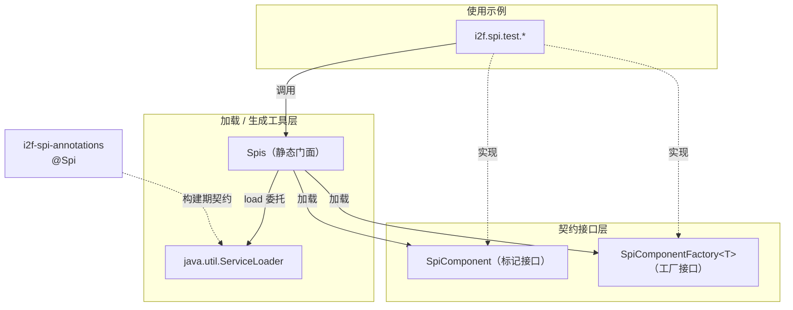

# i2f-spi

> SPI（Service Provider Interface）运行期支撑模块，基于 JDK `java.util.ServiceLoader` 封装统一的 SPI 服务加载能力，并提供组件标记接口、组件工厂接口，以及 `META-INF/services/` 描述文件的编程式生成工具。

## 模块路径

- `i2f-jdk/i2f-spi`

## 模块依赖

| GroupId | ArtifactId | Scope | Optional | 说明 |
|---------|-----------|-------|----------|------|
| i2f.turbo | i2f-spi-annotations | compile | false | 提供 `@Spi` 标记注解，声明服务实现类与其提供的接口 |

> 运行期加载逻辑完全构建在 JDK 标准库之上（`java.util.ServiceLoader`、`java.sql.Driver`、`java.security.Provider`、`java.io.*`），除 `i2f-spi-annotations` 外无其它内部依赖。

## 模块设计

### 分层结构

模块按「契约接口 / 加载工具 / 使用示例」三类职责组织在 `i2f.spi` 包下：



### 包结构

| 包 / 类 | 角色 | 说明 |
|---------|------|------|
| `i2f.spi.SpiComponent` | 标记接口 | 空接口，作为「可被 SPI 统一收集的服务组件」的公共父类型 |
| `i2f.spi.SpiComponentFactory<T>` | 工厂接口 | 声明 `type()`、`build()`，可选 `requires()` 描述依赖集合 |
| `i2f.spi.Spis` | 静态工具门面 | 封装 `ServiceLoader` 加载、Java 标准 SPI 快捷入口、描述文件生成 |
| `i2f.spi.test.*` | 使用示例 | `TestSpi`/`TestSpiComponent`/`TestSpiComponentFactory`/`TestUser` 演示注册与加载闭环 |

### 核心设计点

1. **统一收集两类服务（`loadSpiComponents`）**：一次性把 `SpiComponent` 直接实现与 `SpiComponentFactory` 工厂实现汇总为 `List<Object>`，让「现成组件」与「需构建的组件」在同一入口下被发现。

2. **容错加载（`ignoreFailure`）**：加载过程对迭代中的 `Error` 做捕获，默认 `ignoreFailure=true`，即某个提供者损坏（类缺失/初始化失败）时跳过而非中断整体加载，提升在插件化/多 jar 环境下的健壮性。

3. **标准 SPI 快捷入口**：`loadJdbcDrivers()`、`loadJceProviders()` 直接复用 `ServiceLoader` 加载 JDK 已约定的 `java.sql.Driver`、`java.security.Provider`，无需用户手写类型。

4. **工厂依赖声明（`requires()`）**：`SpiComponentFactory` 预留 `requires()` 返回该组件构建前依赖的其它 SPI 类型集合（默认 `null`），为上层容器实现按依赖顺序装配提供元信息。

## 模块目的

- 屏蔽 `java.util.ServiceLoader` 的迭代与异常处理细节，提供「一行获取全部实现」的简洁加载 API。
- 定义 `SpiComponent` / `SpiComponentFactory` 两枚契约接口，为 i2f 体系的插件化组件提供统一的发现入口。
- 提供 `makeSpiFile(...)`，在没有构建期插件的场景下以编程方式生成 `META-INF/services/` 描述文件，打通「注册 → 加载」闭环。

## 模块功能

| 功能 | 入口方法 | 输出 |
|------|----------|------|
| 加载指定接口的全部实现 | `Spis.load(Class<T>)` / `load(Class<T>, boolean)` | `List<T>` |
| 汇总收集组件与工厂 | `Spis.loadSpiComponents()` | `List<Object>` |
| 加载 JDBC 驱动 | `Spis.loadJdbcDrivers()` | `List<java.sql.Driver>` |
| 加载 JCE 安全提供者 | `Spis.loadJceProviders()` | `List<java.security.Provider>` |
| 生成服务描述文件 | `Spis.makeSpiFile(接口, 实现...)` | 写入 `META-INF/services/<接口全名>` |

## 模块主要使用方法

### 1. 注册：生成 `META-INF/services/` 描述文件

```java
// 在默认路径 "." 下生成 META-INF/services/i2f.spi.SpiComponent 文件
Spis.makeSpiFile(SpiComponent.class, TestSpiComponent.class, TestUser.class);
Spis.makeSpiFile(SpiComponentFactory.class, TestSpiComponentFactory.class);

// 也可指定输出根目录
Spis.makeSpiFile("target/classes", SpiComponent.class, MyComponent.class);
```

### 2. 加载：获取全部实现

```java
// 加载某一接口的所有提供者（默认忽略单个提供者的失败）
List<SpiComponent> components = Spis.load(SpiComponent.class);

// 严格模式：提供者加载失败时抛出错误
List<SpiComponent> strict = Spis.load(SpiComponent.class, false);

// 一次性汇总组件与工厂
List<Object> all = Spis.loadSpiComponents();

// Java 标准 SPI 快捷加载
List<Driver> drivers = Spis.loadJdbcDrivers();
List<Provider> providers = Spis.loadJceProviders();
```

### 3. 定义工厂型组件

```java
public class TestSpiComponentFactory implements SpiComponentFactory<TestUser> {
    @Override
    public Class<?> type() { return TestUser.class; }

    @Override
    public TestUser build() { return new TestUser("admin", "123456"); }

    // 可选：声明构建前依赖的其它 SPI 类型
    @Override
    public Set<Class<?>> requires() { return Collections.emptySet(); }
}
```

注意事项：

- `Spis.load(...)` 返回的实例由 `ServiceLoader` 惰性构造并缓存，加载的接口需存在可被 `ServiceLoader` 识别的 `META-INF/services/<接口全名>` 描述文件（由构建期 `@Spi` 插件或 `makeSpiFile` 生成）。
- `makeSpiFile` 采用「覆盖写」语义：同一接口的文件会被重写，只保留本次传入的实现列表，不会与已有内容合并。
- 默认容错加载会吞掉提供者抛出的 `Error`；若需要暴露装配问题，应显式使用 `load(clazz, false)`。

## 模块特性总结

- 基于 JDK `ServiceLoader` 的零框架依赖 SPI 加载门面。
- 双契约接口：`SpiComponent`（现成组件）与 `SpiComponentFactory<T>`（工厂构建），并预留 `requires()` 依赖声明。
- 容错加载策略（`ignoreFailure`），适配多 jar / 插件化环境的健壮启动。
- 内置 JDBC 驱动、JCE Provider 等 Java 标准 SPI 的快捷加载入口。
- 提供 `makeSpiFile` 编程式生成服务描述文件，与 `i2f-spi-annotations` 的 `@Spi` 构建期契约互为补充。
- 附带 `i2f.spi.test` 完整「注册 → 加载」示例，可直接作为使用模板。
