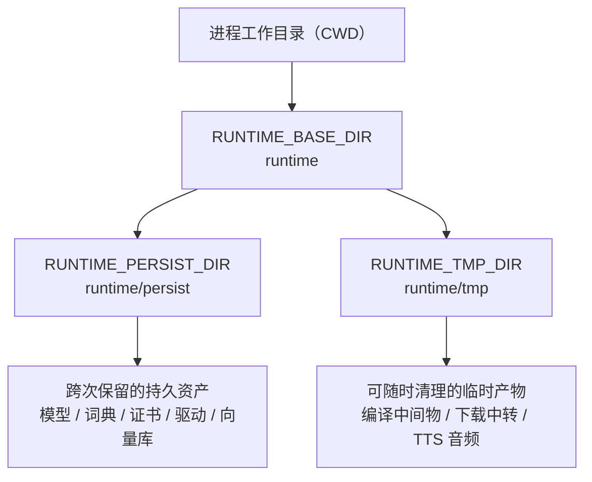
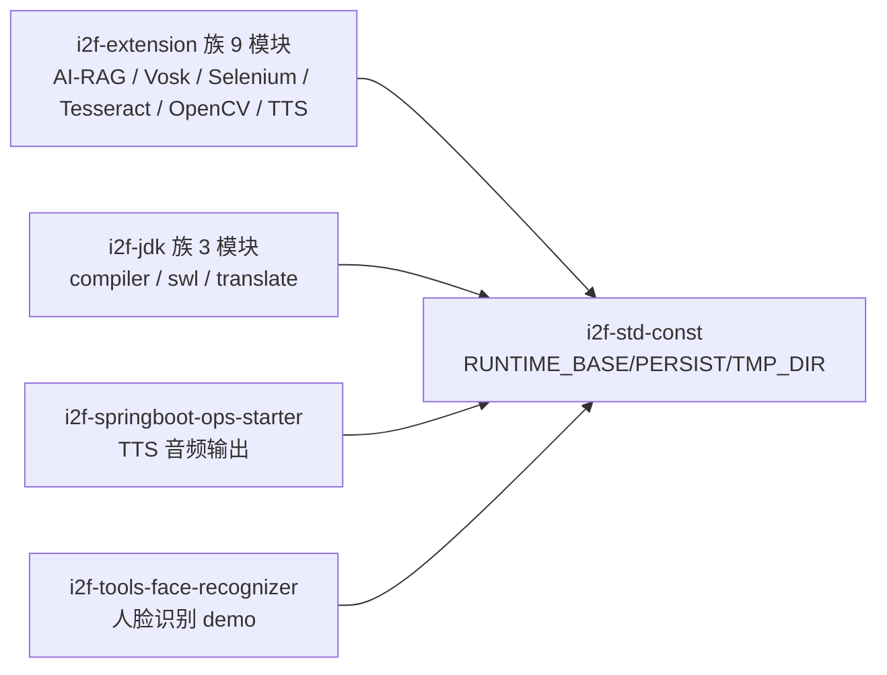

# i2f-std-const

> **全仓统一的「运行时目录约定」常量词汇表**（全模块仅 1 个常量接口 `StdConst`、12 行源码、3 个常量、零运行期依赖）：以 `RUNTIME_BASE_DIR`（`runtime`）为组合根派生两大类运行时目录——`RUNTIME_PERSIST_DIR`（`runtime/persist`，跨次保留的持久资产：模型/词典/证书/驱动/向量库）与 `RUNTIME_TMP_DIR`（`runtime/tmp`，可随时清理的临时产物：编译中间物/下载中转/TTS 音频），均为**相对路径**（相对 JVM 工作目录），消费方自行拼 `./` 前缀并负责建目录。被 **14 模块 17 源文件约 31 处**消费（PERSIST 27 处 / TMP 4 处 / BASE 0 处直接引用）：最重消费族为 `i2f-extension-*`（ai-rag-sqlite / vosk / selenium / tesseract / opencv-data / opencv-javacv / tts-espeak / tts-jacob 的模型与数据落盘）与 `i2f-jdk` 的 compiler（内存编译产物）/ swl（证书）/ translate 族（SQLite 词典），另有 ops-starter（TTS 音频输出）与 tools-face-recognizer；工作区实证 `i2f-tools-ops/runtime/` 完整落地「persist 存 sqlite-vec.db 与驱动 exe、tmp 存驱动下载 zip 与 tts 音频」的划分。13 模块 POM 显式声明依赖（`browser-playwright` 声明零使用），随 `i2f-jdk-all` 聚合与根 POM 版本托管发布；lombok 声明未用。

## 模块路径

- `i2f-jdk/i2f-std-const`

## 模块依赖

| 坐标 | scope | optional | 说明 |
|------|-------|----------|------|
| `org.projectlombok:lombok` | provided | ✓（父 POM 统一） | **声明未用**：接口内无任何 lombok 注解，模块自身零真实依赖 |

构建插件与全仓惯例一致：`maven-assembly-plugin`（父 POM 统一配置 jar-with-dependencies，对纯常量模块意义有限）。

## 模块设计

### 常量清单

| 常量 | 字面值 | 语义定位 | 直接引用统计 |
|------|--------|----------|--------------|
| `RUNTIME_BASE_DIR` | `runtime` | 运行时根目录（组合基础，供拼自定义子目录） | 0 处 |
| `RUNTIME_PERSIST_DIR` | `runtime/persist` | 持久化目录：跨进程/跨次保留的资产（模型/词典/证书/驱动/数据库） | 27 处 / 15 文件 |
| `RUNTIME_TMP_DIR` | `runtime/tmp` | 临时目录：可随时清理的中间产物（编译中间物/下载中转/音频输出） | 4 处 / 3 文件 |

### 目录约定与派生关系



### 设计要点

1. **单接口常量词汇表**：`interface StdConst` 利用接口字段隐式 `public static final` 的语义承载 3 个字符串常量，无任何方法——Java 8 时代跨模块常量组织手法（Effective Java 将其列为「常量接口」反模式，但对纯常量契约库尚属实用惯例）。
2. **两层目录结构**：`RUNTIME_BASE_DIR` 为组合根，仅用于派生 PERSIST/TMP 两个用途轴（自身零直接消费方）；如需 `runtime` 下其它子目录，消费方可自行拼 `RUNTIME_BASE_DIR`。
3. **persist / tmp 语义划分**：判断标准为「是否需要跨次保留」——下载的模型、解压后的常驻驱动、SQLite 数据库、证书 → `persist`；下载的中转压缩包、编译中间产物、一次性音频输出 → `tmp`。工作区实证完整印证该划分（见「运行时目录实证」）。
4. **相对路径约定**：三个常量均为相对路径（相对 JVM 工作目录 CWD），不含 `./` 前缀；消费方普遍再拼 `"./" +` 后交给 `File`/`FileOutputStream`（实测 27 处带 `./` 前缀、4 处直接拼接，两种风格等价并存）。
5. **零行为纯数据**：只提供路径字符串，不负责创建目录、清理或校验——建目录责任落在消费方（`FileUtil.useParentDir` / `mkdirs()` / 依赖父目录已存在）。
6. **依赖图最底层**：零 i2f 内部依赖、零三方运行期依赖，可安全出现在任意模块的依赖链中；命名中的 `Runtime` 与 JDK `java.lang.Runtime` 无任何关系，仅为「运行时目录」语义。

## 模块目的

- 为全仓提供**统一的运行时落盘目录约定**，消除各扩展模块自行硬编码 `./runtime/xxx` 魔法路径的散乱局面。
- 以 `persist` / `tmp` 两级语义划分，让运行时数据具备**整体可迁移、可清理、可忽略**的边界（备份/清理/加入 .gitignore 都以 `runtime` 目录为单元）。
- 以零依赖的最底层定位，使任意层级模块（JDK 族、扩展族、SpringBoot starter、工具族）均可零负担引用，不引入任何传递依赖。

## 模块功能

| 能力 | 说明 |
|------|------|
| 运行时根目录常量 | `RUNTIME_BASE_DIR = "runtime"`（组合基础） |
| 持久化目录常量 | `RUNTIME_PERSIST_DIR = "runtime/persist"`（跨次保留资产） |
| 临时目录常量 | `RUNTIME_TMP_DIR = "runtime/tmp"`（可清理产物） |

## 模块主要使用方法

```java
import i2f.std.consts.StdConst;

import java.io.File;

// 持久化目录：存放需跨次保留的资产（模型/词典/证书/驱动）
File persistDir = new File("./" + StdConst.RUNTIME_PERSIST_DIR + "/my-feature");
persistDir.mkdirs(); // 常量只给路径字符串，建目录是消费方的责任

// 临时目录：存放可随时清理的中间产物
File tmpFile = new File("./" + StdConst.RUNTIME_TMP_DIR + "/work-" + System.currentTimeMillis() + ".dat");

// 如需 runtime 下自定义子目录（BASE 的直接使用场景）
File myDir = new File("./" + StdConst.RUNTIME_BASE_DIR + "/my-dir");
```

### 注意事项

1. **相对路径语义**：常量值相对 JVM 工作目录（CWD），IDE 运行、命令行启动、不同启动目录会落到不同物理位置；部署时需明确工作目录。
2. **`./` 前缀由消费方决定**：常量本身不带前缀，实际代码两种拼接风格并存（`"./" + CONST` 与 `CONST + "/..."`），功能等价但风格不统一。
3. **不做任何目录操作**：不建目录、不清理、不校验存在性；`tmp` 下的文件不会被自动清理，需要消费方自行管理生命周期。
4. **忽略策略需自行处理**：根 `.gitignore` 无 `runtime` 条目（全仓仅 `i2f-tools-ops` 在自有 `.gitignore` 中忽略）；运行时产生文件的模块建议自行忽略 `runtime`。
5. **与 JDK `Runtime` 类无关**：`RUNTIME_*` 前缀指「运行时目录」，避免误联想。

## 模块特性总结

- **极致轻量**：1 接口 / 12 行 / 3 常量，为全仓最小模块之一。
- **零运行期依赖**：lombok 为冗余声明，可安全出现在任何依赖图位置，无传递依赖负担。
- **高消费广度**：14 模块 17 源文件约 31 处引用，横跨扩展族、JDK 族、SpringBoot starter 与工具族。
- **纯约定式契约**：只输出字符串，无行为、无状态、无资源。
- **单一组合根**：BASE → PERSIST / TMP 的派生链只有一层，语义边界清晰（跨次保留 vs 可清理）。

## 模块瑕疵或错误

> 本模块无逻辑代码，以下均为约定完备性与风格层面的低危问题（另附消费方侧观察）。

1. **【低·惯例】常量接口反模式**（`StdConst.java:7`）：以 `interface` 承载常量（Effective Java 列为 anti-pattern），若未来重构可改为 `final class` + 私有构造器；当前无 `implements StdConst` 用法，改动成本低。
2. **【低·文档】三常量无 javadoc**：`persist` 与 `tmp` 的取舍标准（何物该进哪个目录）没有文字约定，全靠既有先例推断；如「下载中转 zip 进 tmp、解压后驱动进 persist」的口径未明文化，新接入者容易放错。
3. **【低·配置】目录名硬编码、无外部化配置**：`"runtime"` 为字面量，无系统属性/环境变量覆盖入口；容器化或固定数据盘（如 `/data`）场景无法在不改代码的前提下重定向。
4. **【低·一致性】消费方拼接风格分裂**：27 处 `"./" + CONST` 与 4 处直接拼接（ai-rag-sqlite 3 处、QwenAudioTtsWebSocket 1 处）并存；行为等价，但代码风格与「相对 CWD」的显式程度不一致。
5. **【低】lombok 冗余声明**：接口无任何 lombok 注解，依赖声明无实际作用。
6. **【观察】`RUNTIME_BASE_DIR` 零直接引用**：仅作为组合基础存在；runtime 下新增固定子目录只能依赖本模块扩展，侧向扩展（消费方自行拼 BASE）会让目录结构失去词汇表约束。
7. **【观察】忽略策略分散**：根 `.gitignore` 不含 `runtime` 条目，全仓仅 `i2f-tools-ops/.gitignore:6` 忽略；在其之外直接运行消费模块时，运行时生成物可能出现在 `git status`。
8. **【消费方侧】`i2f-extension-browser-playwright` 声明依赖零使用**：其 POM 声明 `i2f-std-const` 但源码零引用（目录路径未使用本模块约定）。

## 运行时目录实证

工作区扫描发现 `i2f-tools/i2f-tools-ops/` 下实际存在由消费模块运行生成的完整示例（被该模块自有 `.gitignore` 忽略）：

```
i2f-tools/i2f-tools-ops/runtime/          # 实际落地示例（CWD=模块目录）
├── persist/                              # 跨次保留
│   ├── sqlite-vec/
│   │   ├── sqlite-vec.db                 # ai-rag-sqlite：SQLite 向量库数据
│   │   └── vec0.dll                      # 下载释放的 SQLite 原生扩展
│   └── webdriver/
│       ├── chromedriver.exe              # selenium：解压后的常驻驱动
│       └── msedgedriver.exe
└── tmp/                                  # 可随时清理
    ├── chrome-driver-145.0.7632.117.zip  # selenium：驱动下载中转包
    └── tts_audio/
        └── audio_*.mp3                   # ops-starter：Qwen TTS 音频输出（5 个）
```

该实证完整印证 persist / tmp 的语义划分：

| 产物 | 目录 | 判断标准 |
|------|------|----------|
| `sqlite-vec.db`、`vec0.dll` | `persist` | 跨次保留：数据库与原生库需要复用 |
| `chromedriver.exe`、`msedgedriver.exe` | `persist` | 跨次保留：解压后的驱动反复使用 |
| `chrome-driver-*.zip` | `tmp` | 一次性中转：解压后即可丢弃 |
| `audio_*.mp3` | `tmp` | 一次性产物：取用后可清理 |

## 下游消费方一览

扫描口径：全仓 `import i2f.std.consts.StdConst` 共 **17 源文件**（15 主源码 + 2 测试源码）+ `browser-playwright` POM 声明未用。

| 消费模块 | 文件 | 使用常量与用途 |
|----------|------|----------------|
| `i2f-extension-ai-rag-sqlite` | `SqliteBucketRagMemoryStore:34` / `SqliteRagEmbeddingStore:37` / `SqliteVecUtils:47` | PERSIST：sqlite-vec 向量库与原生库路径（无 `./` 前缀） |
| `i2f-extension-asr-vosk` | `AsrVoskProvider:20` | PERSIST：vosk 中文小模型目录 |
| `i2f-extension-browser-selenium` | `BrowserSelenium:46/212/279` | PERSIST：webdriver 驱动目录；TMP：驱动包下载中转 |
| `i2f-extension-ocr-tesseract` | `OcrTesseractProvider:20` | PERSIST：tesseract 训练数据目录 |
| `i2f-extension-opencv-data` | `OpenCvDataFileProvider:15` | PERSIST：opencv 数据文件根目录 |
| `i2f-extension-opencv-javacv` | `TestOpenCvFaceRecognizer` / `TestRawFaceRecognize`（src/test，共 9 处） | PERSIST：人脸识别模型 / 训练 / 测试目录 |
| `i2f-extension-tts-espeak` | `TtsEspeakProvider:24` | PERSIST：espeak 可执行目录 |
| `i2f-extension-tts-jacob` | `TtsJacobProvider:27` | PERSIST：jacob dll 目录 |
| `i2f-jdk/i2f-compiler` | `MemoryCompiler:175` | TMP：内存编译产物 classes 输出目录 |
| `i2f-jdk/i2f-swl` | `SwlResourceCertManager:32/51` | PERSIST：`swl/cert` 证书本地目录 |
| `i2f-jdk/i2f-translate-en2zh` | `SimpleWordTranslator:90` | PERSIST：SQLite 词典 database 目录 |
| `i2f-jdk/i2f-translate-zh2pinyin` | `PinyinProvider:72` | PERSIST：SQLite 词典 database 目录 |
| `i2f-springboot-ops-starter` | `QwenAudioTtsWebSocket:39` | TMP：TTS 音频输出（POM 未显式声明，经传递获得） |
| `i2f-tools-face-recognizer` | `TestOpenCvFaceRecognizer`（demo 类，5 处） | PERSIST：同 javacv 测试用途（POM 未显式声明，经传递获得） |

POM 声明汇总：

| 类别 | 模块 |
|------|------|
| 显式声明且真实使用（12） | ai-rag-sqlite、asr-vosk、browser-selenium、ocr-tesseract、opencv-data、opencv-javacv（仅测试使用）、tts-espeak、tts-jacob、compiler、swl、translate-en2zh、translate-zh2pinyin |
| 显式声明但零使用（1） | browser-playwright |
| 未声明、经传递使用（2） | springboot-ops-starter、tools-face-recognizer |
| 聚合/托管 | `i2f-jdk-all`（聚合，pom.xml:537）、根 POM（dependencyManagement，pom.xml:771） |

源码证据行：

| 证据 | 位置 |
|------|------|
| `public static final String DEFAULT_DB_FILE_PATH = StdConst.RUNTIME_PERSIST_DIR + "/" + SqliteVecUtils.DIR_NAME + "/sqlite-vec.db";` | `i2f-extension-ai-rag-sqlite/.../SqliteRagEmbeddingStore.java:37` |
| `File modelFile = new File("./" + StdConst.RUNTIME_PERSIST_DIR + "/models/opencv-face.xml");` | `i2f-extension-opencv-javacv/.../TestOpenCvFaceRecognizer.java:28` |
| `File outputDir = new File("./" + StdConst.RUNTIME_TMP_DIR + "/memory-compiler/classes/" + ...);` | `i2f-jdk/i2f-compiler/.../MemoryCompiler.java:175` |
| `private File localFilePath = new File("./" + StdConst.RUNTIME_PERSIST_DIR + "/" + DEFAULT_PATH);` | `i2f-jdk/i2f-swl/.../SwlResourceCertManager.java:32` |
| `protected String outputFile = StdConst.RUNTIME_TMP_DIR + "/tts_audio/audio_" + taskId + ".mp3";` | `i2f-springboot-ops-starter/.../QwenAudioTtsWebSocket.java:39` |

消费关系（模块视角）：



## 可拓展方向

1. **补齐 javadoc 约定**：为 3 个常量补注释，明确 persist / tmp 的取舍标准与 BASE 的使用场景（文档化「何物进何目录」）。
2. **外部化配置入口**：支持系统属性（如 `-Di2f.runtime.dir=/data/runtime`）或环境变量覆盖，兼顾容器与固定数据盘部署。
3. **可选辅助方法**：提供 `getPersistDir()` 返回 `File` 并自动 `mkdirs` 的便捷方法（或保持纯常量定位，将辅助下沉到别的工具模块）。
4. **常量组织进化**：如未来大版本重构，可改为 `final class StdConst` + 私有构造器的 Java 惯例形态。
5. **统一忽略策略**：在根 `.gitignore` 增加 `runtime/` 条目，或在文档中约定各消费方自行忽略。
