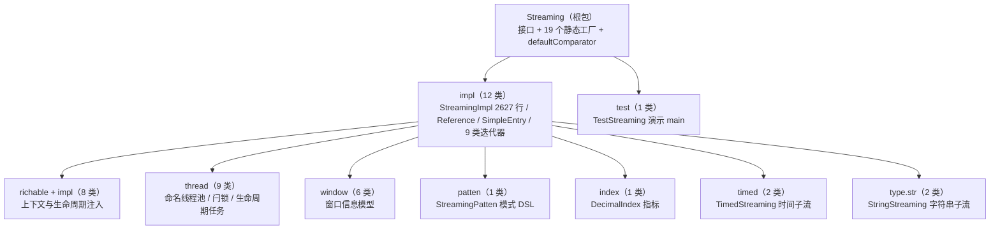
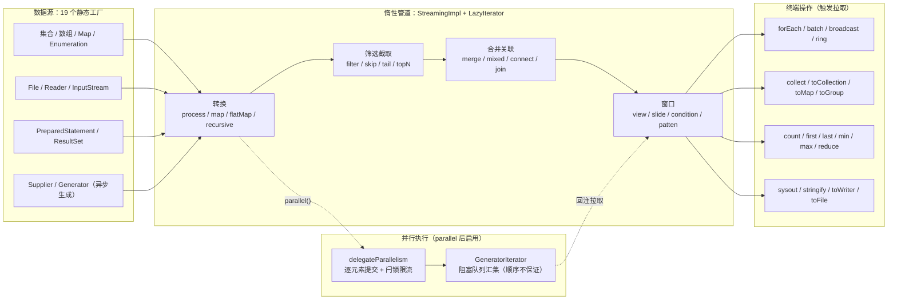
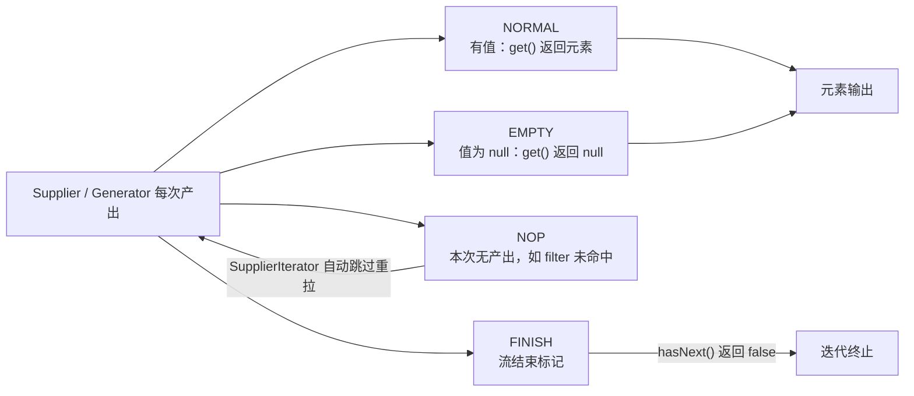

# i2f-streaming

> **函数式流式处理框架 / JDK8 从零实现的类 Stream 惰性管道**——全模块 **43 个源文件、6258 行、零 Maven 依赖（纯 JDK8 标准库）**，无 `src/test` 测试目录。核心是接口 `Streaming<E>`（772 行、百余个方法：**19 个静态数据源工厂** + 90 余个算子与 default 便利方法）与唯一实现 `StreamingImpl`（2627 行，单类承载全部算子）。能力全景：① 拉取式惰性管道——每个中间算子都是 `new StreamingImpl(new LazyIterator<>(...), this)`，构造零执行、终端操作才真正驱动迭代；② `Reference` 四态协议（NORMAL/EMPTY/NOP/FINISH）与 9 类迭代器工具箱（Lazy/Supplier/SupplierBuffer/Generator/Resources/Merge/Mixed/Connect/Mapper）；③ 并行模型 `parallel()/pool()/parallelism()`——逐元素提交 + 自研 `AtomicCountDownLatch` 滑动窗口限流 + `GeneratorIterator` 阻塞队列汇集（顺序不保证）；④ rich 上下文注入与生命周期回调（`RichStreamProcessor` + 6 个 Rich 抽象函数类）；⑤ 五大元素窗口（view/slide/count/condition/patten）+ `StreamingPatten` 单链表模式 DSL + `timed` 时间子流（乱序容忍 `timeOrdered`、slide/session/view 时间窗）；⑥ `StringStreaming` 字符串子流、`NamingForkJoinPool` 命名线程池、`DecimalIndex` 数值指标。
>
> **消费现状**：全仓 **零消费方**——0 个模块 `import i2f.streaming`（对照实验：`i2f-io-file` 在 i2f-extension 有 42 处导入证明搜索口径有效），仅随 `i2f-jdk-all` 聚合发布。属于"能力储备型"模块，尚未经真实场景验证。
>
> ⚠ **重点瑕疵**：`limit(count)` 计数未自增实际不截断（StreamingImpl.java:766-783）、`globalContext` 自赋值致跨算子共享失效（:62）、`LifeCycleRunnable/Callable` 异常字段赋值笔误（isThrowable 恒 false）、`AtomicCountDownLatch.await` 1ms 忙等待无超时、`NamingForkJoinPool` 反射 JDK 私有 API（JDK9+ 失效静默回退）、`GeneratorIterator` 裸线程无关闭机制、零测试 + `TestStreaming` 硬编码本机绝对路径且随 jar 发布、调试 `System.out.println` 残留等——详见「模块瑕疵或错误」。

## 模块路径

- `i2f-jdk/i2f-streaming`

## 模块依赖

- 本模块 POM **未声明任何依赖**（`dependencies` 节点不存在）——连父 POM 统一管理的 lombok 都未引入，且源码中 **lombok 零使用**（`grep lombok` 0 命中），是全仓少见的"纯 JDK 零依赖"模块。

| 依赖（maven 坐标） | scope | optional | 用途 |
| --- | --- | --- | --- |
| 无（未声明任何依赖） | — | — | 源码仅使用 JDK8 标准库：`java.util.*`、`java.util.concurrent.*`、`java.util.function.*`、`java.util.stream.*`、`java.io.*`、`java.lang.reflect.*`、`java.math.*`、`java.security.SecureRandom`、`java.sql.*` |

- 构建插件：仅 `maven-assembly-plugin`（裸声明无配置，版本由父 POM `i2f-jdk` → `i2f-turbo-java` 统一管理）。

## 模块设计

1. **接口 + 单一实现的分层**：`Streaming<E>` 是唯一门面（DSL 声明 + 19 个静态数据源工厂 + `defaultComparator`）；`StreamingImpl<E>` 是唯一实现，2627 行承载全部算子逻辑。每个中间算子返回 `new StreamingImpl(new LazyIterator<>(supplier), this)`——**构造零执行、终端才逐级拉取**，全链除必要算子（sort/reverse/distinct/sample/tail/topN 等）外无中间集合。
2. **`Reference` 四态协议**（`impl/Reference.java`）：`NORMAL` 有值 / `EMPTY` 值为 null（`of(null)` 归入此态）/ `NOP` 本次无产出（拉取方自动跳过）/ `FINISH` 流结束单例；`get()` 对 NOP/FINISH 抛 `NoSuchValueException`。所有算子以 `Supplier<Reference<T>>` 为统一产出契约。
3. **迭代器工具箱**（`impl` 包 9 类）：`LazyIterator`（首次访问才初始化 + onBefore/onAfter 生命周期钩子，是每条管道的骨架）、`SupplierIterator`（单值拉取，跳过 NOP）、`SupplierBufferIterator`（批量缓冲，逐批消费）、`GeneratorIterator`（后台线程 + `LinkedBlockingQueue` 异步生成，并行结果汇集与流式生成器均基于它）、`ResourcesIterator`（资源初始化/释放回调，服务 Reader/ResultSet/PreparedStatement 数据源）、`MergeIterator`（顺序拼接）、`MixedIterator`（随机交织）、`ConnectIterator`（按位拉链）、`MapperIterator`（元素映射）。
4. **并行模型**：`parallel()/sequence()` 切换开关，`pool(ExecutorService)/pool(size)/defaultPool()/parallelism(n)` 配置执行器与在途窗口。`delegateParallelism`（StreamingImpl.java:173-214）对每个元素 `pool.submit`，用 `AtomicCountDownLatch` 限制在途任务数（达到 `parallelCount` 即阻塞等待归零再开下一批），结果经 `GeneratorIterator` 阻塞队列串行化——**产出顺序不保证**。默认池为 `NamingForkJoinPool.getPool(availableProcessors, "streaming", "default(N)")` 静态单例（StreamingImpl.java:46）。
5. **rich 上下文注入与生命周期**：算子若实现 `RichStreamProcessor`（`richable.impl` 提供 6 个抽象类：RichConsumer/RichFunction/RichBiConsumer/RichBiFunction/RichPredicate/RichSupplier），执行前由 `richInject/richBefore/richAfter` 注入 `localContext/globalContext/parallel/parallelCount/pool` 并触发 `onBefore/onAfter`；非 Rich 但 `Closeable` 的算子在 richAfter 阶段自动 close（异常仅 `printStackTrace`）。
6. **窗口体系**：基类 `WindowInfo` 统一记录 `elementCount`（元素计数）/ `windowCount`（开窗计数）/ `submitWindowCount`（提交计数），派生 `ViewWindowInfo`（前后视野）、`SlideWindowInfo`（当前窗口内计数）、`ConditionWindowInfo`（条件值）、`TimeWindowInfo`/`ViewTimeWindowInfo`（窗口/真实起止时间）。实现模式统一为 `waitList`（待提交窗口队列）+ `SupplierBufferIterator`：逐元素喂入所有在窗窗口，满足条件者成批提交，流终对残余窗口 flush。
7. **模式匹配 DSL**（`patten/StreamingPatten.java`）：单链表 + 前驱回链，`begin(filter).repeat(n).next(filter)...`；`any()` 永真、`repeat(n)` 固定次数、`repeats()` 无限（count=-1 贪婪延续）、`follow(maxCount, filter)` 最大间隔容忍；`end()` 回溯首节点。`pattenWindow` 对每个匹配头元素分裂一个新候选窗口并行推进。
8. **时间维度**（`timed` 包）：`timed(timestampMapper)` 把 `Streaming<E>` 提升为 `Streaming<Map.Entry<Long, E>>`（事件时间）；`timeOrdered(maxDelay)` 用 `TreeMap` 延迟缓冲实现乱序容忍；`slideTimeWindow/sessionTimeWindow/viewTimeWindow/latelyAggregateTime` 等全部基于事件时间戳推进与释放。
9. **类型糖与周边**：`StringStreaming`（notEmpty/notBlank/startsWith/endsWith/大小写/trim/split/replaceAll 的字符串默认方法链）；`thread` 包（`NamingThreadFactory`、`NamingForkJoinPool`、JDK/Atomic 两套闩锁任务包装、LifeCycle Callable/Runnable 生命周期任务基类）；`DecimalIndex`（BigDecimal 的 sum/count/min/max/avg 指标）。
10. **包结构与管道架构**：





## 模块目的

- 以"**拉取式惰性管道**"补齐 JDK8 Stream 的短板：Stream 不可重复消费且缺少窗口/时间/模式匹配/上下文注入；本模块提供可组合的迭代器算子层，数据源覆盖集合、数组、文件行、JDBC ResultSet、异步生成器等。
- 提供**可编程的并行执行模型**（自定义池、并行度、在途窗口限流），不依赖 commonPool。
- 提供**窗口与时间语义的一等公民支持**：元素窗口（5 类）、时间窗口（4 类）、模式序列挖掘、乱序容忍，面向流式统计/监控/挖掘类场景。
- 以**零依赖**定位为可被全仓任何模块（含 JDK8 环境）直接复用的基础能力层——不过当前尚无模块引用，属于设计供给先于需求。

## 模块功能

- **数据源工厂（19 个静态方法）**：`ofInt(begin,step,end)`、`ofRandomInt`、`ofRandom`、`ofDir`、`ofField`、`ofMethod`、`ofGenerator`；`of(Supplier/Iterable/Map/Iterator/Enumeration/T.../Stream/File+charset/InputStream+charset/Reader/PreparedStatement/ResultSet)`。
- **转换**：`process`（1→N 收集式）、`map`、`mapNonNull`、`flatMap`（及数组/Iterable 多个语法糖）、`recursive`/`recursiveMap`（树形递归展开）。
- **筛选/截取**：`filter`、`notNull`、`skip`、`limit`、`tail`、`topN/maxN/minN`、`afterAll/beforeAll/afterN/beforeN`、`rangeAll/dropRange`、`firstN/lastN`。
- **排序/变换**：`sort(±asc/comparator)`、`reverse`、`shuffle`、`distinct`、`sample(rate)/sampleCount`、`indexed`。
- **合并/关联**：`merge`（顺序拼接）、`mixed`（随机交织）、`include/exclude`、`connect`（按位拉链）、`join`（条件/键）、`keyBy`（3 重载分组）、`countBy`（2 重载计数）。
- **窗口**：`viewWindow`、`slideWindow`、`countWindow`、`conditionWindow`、`pattenWindow`；timed 的 `slideTimeWindow/timeWindow/sessionTimeWindow/viewTimeWindow`。
- **统计/聚合**：`count`、`anyMatch/allMatch`、`min/max/most/least`（±key）、`reduce/aggregate`、`latelyAggregate/latelyAverage/latelyIndex`（滑动近期窗口）。
- **输出**：`collect/iterator/toCollection/toMap/toGroup`、`forEach(±index)`、`batch`、`broadcast/ring/random`（多消费者分发）、`peek/print/sysout`、`stringify`、`toWriter/toStream/toFile`。
- **子流升级**：`timed`（时间流）、`string`（字符串流）。

## 模块主要使用方法

```java
// 1) 基础管道：文件行 → 拆词 → 过滤 → 并行映射 → 终端输出
Streaming.of(new File("data.txt"), "UTF-8")   // 按行读文件（惰性，未消费不读）
        .flatMap((line, collector) -> {        // 一行拆多词
            for (String w : line.split("\\s+")) {
                if (!w.isEmpty()) collector.accept(w);
            }
        })
        .filter(e -> e.matches("[a-zA-Z0-9]+"))
        .parallel()                            // 之后的 map/forEach 走并行执行
        .map(String::toLowerCase)
        .forEach((item, index) -> System.out.println(index + ": " + item));

// 2) 元素窗口：每个元素携带"前 2 后 3"的视野列表
Streaming.of(0, 1, 2, 3, 4, 5, 6, 7, 8, 9)
        .viewWindow(2, 3)
        .forEach(entry -> {
            List<Integer> key = entry.getKey();               // 窗口元素
            ViewWindowInfo info = entry.getValue();           // 窗口元信息
            System.out.println(key.get(info.getBeforeCount()) + "=" + key + ":" + info);
        });

// 3) 计数窗口 = windowSize 与 slideCount 相同的滑动窗口（非重叠定长批）
Streaming.of(1, 2, 3, 4, 5, 6, 7, 8, 9).countWindow(3).forEach(System.out::println);

// 4) 时间窗口（事件时间）：以元素值当时间戳，间隔 3 断开的会话窗口
Streaming.of(1, 2, 3, 6, 7, 8, 11, 12)
        .timed(e -> (long) e)
        .sessionTimeWindow(3)
        .sysout("time:");

// 5) 模式匹配（序列挖掘）：6,6 → 3 → 4 → 0... → 5 → 7{0,3} ×2 → 8
Streaming.of(6, 6, 3, 4, 0, 0, 0, 5, 0, 0, 7, 0, 7, 8)
        .pattenWindow(patten -> patten
                .next(e -> e == 6).repeat(2)
                .next(e -> e == 3)
                .next(e -> e == 4)
                .next(e -> e == 0).repeats()
                .next(e -> e == 5)
                .follow(3, e -> e == 7).repeat(2)
                .next(e -> e == 8))
        .sysout("match:");

// 6) 统计与分组：计数分组 + 结果收集
Map<String, Integer> freq = Streaming.of("a", "b", "b", "c")
        .countBy()
        .toCollection(new LinkedList<>())          // Entry<元素,次数>
        .stream().collect(Collectors.toMap(...));  // 或直接 toMap/toGroup

// 7) 组装结果
List<String> list = Streaming.of("a", "b").toCollection(new LinkedList<>());
Map<String, Integer> map = Streaming.of("a", "bb")
        .toMap(() -> new HashMap<>(), e -> e, String::length, (a, b) -> b);
```

注意事项：

1. **一次性消费**：管道底层是 Iterator 拉取，做过终端操作后不可重放（`GeneratorIterator` 会启动后台线程更不可复用）；需要重放请先 `toCollection` 缓存或重建流。
2. **并行顺序不保证**：`parallel()` 之后元素产出顺序取决于任务完成顺序；`forEach(BiConsumer)` 的第二参数仍是源序号而非执行序号。
3. **资源型数据源靠"消费耗尽"关闭**：`of(Reader/ResultSet/PreparedStatement)` 经 `ResourcesIterator` 在迭代结束时释放资源，中途放弃消费不会关闭底层资源。
4. **null 语义分裂**：单值算子（map/filter）会把 null 以 `EMPTY` 态传递，批量算子（SupplierBufferIterator 路径）会静默丢弃——有 null 风险时建议显式 `notNull()`。
5. **边界/负数**：`skip(-1)` 会丢弃全部元素；`limit` 存在计数缺陷（见瑕疵）；`keyBy/countBy` 结果末尾总会附加一个 null 键条目（含空集合/null 计数）。
6. **输出端**：`toStream` 会关闭底层输出流，`toWriter` **不会**关闭传入的 Writer。

## 模块特性总结

- **零依赖纯 JDK8**：不引 lombok 及任何三方库，编译/运行期均无外部牵扯。
- **惰性拉取管道**：构造零执行，链式算子仅包装迭代器；全链几乎无中间集合（必须全量的算子除外）。
- **单类实现全部算子**：`StreamingImpl` 2627 行 god class，改动影响面大（是特性也是风险）。
- **自研并行限流模型**：逐元素提交 + `AtomicCountDownLatch` 在途窗口控制 + 阻塞队列汇集，区别于 ForkJoin 分片模型。
- **内建窗口体系**：元素窗口 5 类 + 时间窗口 4 类 + 模式 DSL，`WindowInfo` 三计数（元素/开窗/提交）自带可观测性。
- **rich 上下文与生命周期**：local/global 上下文、并行参数自动注入算子；`Closeable` 算子自动关闭。
- **时间语义完备**：事件时间、乱序容忍（`timeOrdered`）、会话/滑动/视图时间窗、近期聚合。
- **能力储备定位**：全仓零消费、零测试，未经真实场景验证。



## 模块瑕疵或错误

1. **`limit(long count)` 计数未自增、实际不截断（功能性缺陷）**：StreamingImpl.java:766-783 中 `AtomicLong cnt` 声明后从未自增，`cnt.get() < count` 对 count>0 恒真——`limit(N)` 全量透传（不截断），count==0 直接空流，count<0 也透传；对照有 `cnt.getAndIncrement()` 的 `skip()`（:743-763）可证为笔误遗漏。
2. **`globalContext` 自赋值致跨算子共享失效**：StreamingImpl.java:60-67 第三构造器 `this.globalContext = globalContext;`（自赋值，应为 `parent.globalContext`），叠加 `prepare()` 对 null 新建空 Map ——每级算子各持独立 `globalContext`，"全局上下文"设计目标失效；仅 `keyBy` 系列显式传参（:1080/:1116/:1119）能让子流继承。
3. **`LifeCycleRunnable`/`LifeCycleCallable` 异常字段赋值笔误**：LifeCycleRunnable.java:21-23、LifeCycleCallable.java:24-27 中 `catch (Throwable e)` 写的是 `this.throwable = throwable;`（字段赋给自身，恒 null）——`isThrowable()` 恒 false，`onThrowable` 收到 null cause，原始异常信息丢失（并再抛 cause=null 的 `IllegalStateException`）。
4. **`AtomicCountDownLatch.await()` 忙等待**：AtomicCountDownLatch.java:35-47 以 `Thread.sleep(1)` 自旋轮询，无超时、无中断传播；它是并行限流核心（`delegateParallelism`），任务未 `down()` 则永久死循环。
5. **`NamingForkJoinPool` 反射 JDK 私有 API**：NamingForkJoinPool.java:48-152 反射使用 `ForkJoinPool` 私有 5 参构造器与 `FIFO_QUEUE/LIFO_QUEUE/MAX_CAP/checkParallelism/nextPoolId` 私有成员定制线程名；JDK9+ 强封装下必然失败，且 catch 块为空（静默吞异常）后回退公共构造器——线程名丢失、失败无感知。
6. **`GeneratorIterator` 裸线程 + 无关闭机制**：GeneratorIterator.java:23-40 首次拉取时 `new Thread(...)`（非线程池、非守护线程）；生成器阻塞在 `queue.put` 时若消费侧提前终止则线程永久挂起，无 interrupt/close 能力。
7. **零测试 + `TestStreaming` 发布风险**：无 `src/test` 目录；唯一 demo `i2f.streaming.test.TestStreaming`（254 行）位于 `src/main/java` 会随 jar 发布，且 :23/:72 硬编码作者本机绝对路径（`D:\IDEA_ROOT\DevCenter\i2f-boost\i2f-stream\...`），在他人机器运行将 NPE/读取失败。
8. **调试输出残留**：AtomicCountDownLatchRunnable.java:21、AtomicCountDownLatchCallable.java:21 在任务完成时 `System.out.println("down:" + 线程名/ID)` 直接打印。
9. **工具类小瑕疵**：`Reference.hashCode()`（Reference.java:147-152）、`SimpleEntry.hashCode()`（SimpleEntry.java:67-71）用 `h | l` 而非 `31*h+l`，哈希聚集质量差；`SupplierIterator.hasNext()`（:20-30）`while(true)` 依赖 supplier 永不返回 null 且最终 FINISH，否则死循环；`MergeIterator.next()` 越界抛 `NullPointerException`、`MixedIterator.next()` 空集抛 `IllegalArgumentException`（均非 `NoSuchElementException`）；`defaultComparator`（Streaming.java:314-330）对非 Comparable 元素退化为 hashCode 比较（"哈希序"语义不可预期）；大量空 `finally {}` 块与冗余代码（StreamingImpl.java:263-265、:1604 迭代器 remove 后随即 clear）。
10. **设计一致性瑕疵**：`of(Stream<T>)`（Streaming.java:169-174）先 `collect` 成 `LinkedList` 再迭代，违背流式初衷；随机源混用（`ofRandom*` 用 `SecureRandom`，`shuffle/sample/sampleCount` 用 `Math.random()`，StreamingImpl.java:850-935）；`skip` 与 `limit` 对负数语义不一致（前者清空、后者透传）。

## 模块结构一览（拓展）

| 包 | 类数 | 代表类 | 职责 |
| --- | --- | --- | --- |
| `i2f.streaming` | 1 | `Streaming` | 门面接口：19 个静态数据源工厂 + 90 余个算子/default 方法 |
| `i2f.streaming.impl` | 12 | `StreamingImpl`(2627 行)、`Reference`、9 类迭代器、`SimpleEntry` | 核心实现与迭代器/引用协议 |
| `i2f.streaming.richable(.impl)` | 8 | `RichStreamProcessor`、6 个 Rich 抽象函数类 | 上下文/并行参数注入与生命周期回调 |
| `i2f.streaming.thread` | 9 | `NamingForkJoinPool`、`AtomicCountDownLatch` | 命名线程池、两套闩锁任务包装、生命周期任务基类 |
| `i2f.streaming.window` | 6 | `WindowInfo` 及 5 个子类 | 窗口元信息模型（三计数 + 子类扩展字段） |
| `i2f.streaming.patten` | 1 | `StreamingPatten` | 序列模式匹配 DSL（链表 + repeat/repeats/follow/any） |
| `i2f.streaming.index` | 1 | `DecimalIndex` | BigDecimal 数值指标（sum/count/min/max/avg） |
| `i2f.streaming.timed` | 2 | `TimedStreaming` | 事件时间子流：乱序容忍、时间窗口、近期聚合 |
| `i2f.streaming.type.str` | 2 | `StringStreaming` | 字符串子流默认方法（notEmpty/split/trim/大小写等） |
| `i2f.streaming.test` | 1 | `TestStreaming` | 演示 main（位于 src/main/java，硬编码本机路径） |

## 与 JDK8 Stream 的对比（拓展）

| 维度 | i2f-streaming | JDK 8 Stream |
| --- | --- | --- |
| 依赖 | 零依赖纯 JDK8 | JDK 内置 |
| 惰性 | 拉取式 Iterator，构造零执行 | 拉取/推混合 |
| 窗口 | 内建 5 类元素窗口 + 4 类时间窗口 + 模式 DSL | 无（需自实现） |
| 时间语义 | timed 子流：事件时间/乱序容忍/会话窗口 | 无 |
| 并行 | 自定义池 + 在途窗口限流，逐元素任务 | commonPool ForkJoin 分片 |
| 上下文注入 | rich local/global context + 生命周期回调 | 无 |
| 资源关闭 | 迭代耗尽自动关闭（ResourcesIterator） | try-with-resources |
| 成熟度 | 零测试、全仓零消费 | JDK 级成熟 |

## 消费现状与验证（拓展）

- **源码级**：`import i2f.streaming` 全仓（排除本模块）命中 **0 个文件**；`i2f.streaming.` 字符串提及同样 **0 处**。对照实验：`import i2f.io.file` 在 i2f-extension 命中 42 处，证明搜索口径有效。
- **POM 级**：仅两处声明——根 POM `dependencyManagement`（pom.xml:774-778）与 `i2f-jdk-all` 聚合依赖（i2f-jdk-all/pom.xml:539-542），无任何模块真正依赖；`i2f-jdk-all` 自身亦无消费方（仅随根 POM 管理发布）。
- **结论**：本模块是"基础设施预留"——能力完整但未落地，后续接入时建议先补测试与修复「模块瑕疵或错误」中的中危项。

## 可拓展方向（拓展）

1. **修复已知缺陷**：`limit` 计数、`globalContext` 继承、`LifeCycle*` 异常字段（三处均为低改动量笔误）；`AtomicCountDownLatch` 换 `CountDownLatch`/`Phaser` 或补超时与中断。
2. **补 `src/test` 单测**：覆盖 Reference 协议、窗口边界、并行顺序、patten 匹配等核心语义；将 `TestStreaming` 迁入测试目录并清理硬编码路径。
3. **消费落地**：可作为数据处理（i2f-data-processor）、采集/监控、ops 工具链的底层管道；接入前先在真实场景验证并行与窗口行为。
4. **工程化解耦**：拆分 `StreamingImpl` god class；将 `thread` 包工具与仓内 `i2f-thread` 模块做归并对齐。
5. **替换私有 API 依赖**：`NamingForkJoinPool` 改用标准线程工厂命名方案；移除调试打印。
6. **语义文档化**：为 `Reference` 四态、null 去留、并行顺序、负数边界补齐 javadoc 与使用约定。
