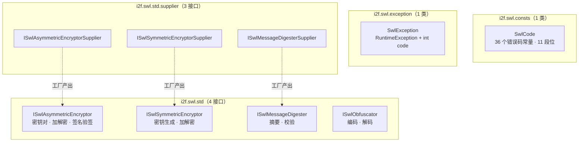
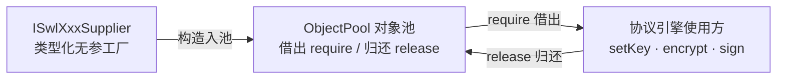
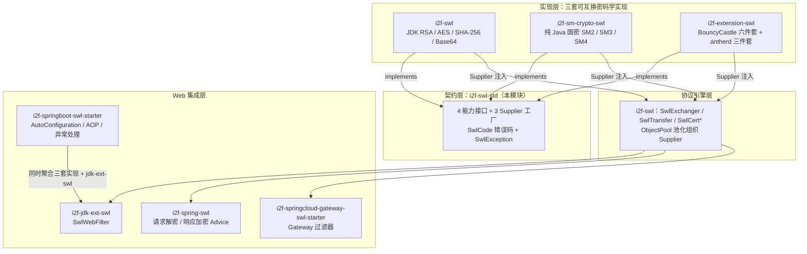

# i2f-swl-std

> **SWL（Secure Wire Layer）安全传输协议族的纯契约层 / 密码学 SPI 标准**——全模块仅 **9 个源文件、213 行、零实现零状态**、无 `src/test` 测试目录。构成：4 个能力接口（`ISwlAsymmetricEncryptor` 11 方法：密钥对生成/加解密/签名验签；`ISwlSymmetricEncryptor` 5 方法：密钥生成/加解密；`ISwlMessageDigester` 摘要与校验；`ISwlObfuscator` 混淆编解码）+ 3 个 Supplier 类型别名接口（供对象池化的类型化无参工厂）+ 36 个常量的 `SwlCode` 错误码枚举（0~10000 共 **11 个十进制段位**）+ 携带 `int code` 的 `SwlException`。为「SWL 安全传输族」**三套可互换的密码学实现**提供依赖倒置契约：i2f-swl（JDK 内置 RSA/AES/SHA-256/Base64）、i2f-sm-crypto-swl（纯 Java 国密 SM2/SM3/SM4）、i2f-extension-swl（BouncyCastle 六件套 + antherd 三件套）；协议引擎 i2f-swl 以 `ObjectPool` + Supplier 池化组织实现（`SwlExchanger`/`SwlTransfer`），jdk-ext/spring/springboot/springcloud 四层 Web 集成栈统一消费。
>
> **消费现状**：被 **6 个模块 115 处 import** 消费——i2f-extension-swl 43、i2f-swl 27、i2f-springboot-swl-starter 15、i2f-springcloud-gateway-swl-starter 15、i2f-sm-crypto-swl 13、i2f-jdk-ext-swl 2；全仓 **74 处** 抛出 `SwlException`；POM 直接依赖 3 处（i2f-swl / i2f-sm-crypto-swl / i2f-extension-swl），随 `i2f-jdk-all` 聚合发布。
>
> ⚠ **重点瑕疵**：`SwlCode` 中 `DIGITAL_MISSING_EXCEPTION` 与 `DIGITAL_VERIFY_FAILURE_EXCEPTION` 的 code 值重复（均为 **9100**，SwlCode.java:50-51），导致按 code 反查枚举时后者永远不可达（i2f-springboot-swl-starter 的 `SwlExceptionHandler.java:33-40` 正是按此方式反查）；36 个常量中 **12 个全仓零引用**；枚举缺 `of(int code)` 反查方法；`SwlException` 缺 `serialVersionUID`；四大接口零 javadoc（`@desc` 全空）——参数顺序、编码格式（hex/base64）、密钥状态语义均无文字约定——详见「模块瑕疵或错误」。

## 模块路径

- `i2f-jdk/i2f-swl-std`

## 模块依赖

| 依赖（maven 坐标） | scope | optional | 用途 |
| --- | --- | --- | --- |
| `i2f.turbo:i2f-crypto-std:1.0-jdk8` | compile | 否 | 唯一实际使用的内部依赖——仅引用 `AsymKeyPair`（非对称密钥对数据类，`publicKey`/`privateKey` 双 String），用于 `ISwlAsymmetricEncryptor` 的密钥对出参加入参 |
| `org.projectlombok:lombok` | provided（继承根 POM `dependencyManagement`，pom.xml:83-89） | true（继承） | **声明未用**：9 个源文件零 lombok 注解（全部手写 getter/构造器） |

- 构建插件：仅 `maven-assembly-plugin`（裸声明，版本由父 POM `i2f-jdk` → `i2f-turbo-java` 统一管理）。
- 模块无 `src/test`、无 `resources`，编译产物仅 9 个 class。

## 模块设计

1. **契约层定位（依赖倒置）**：「SWL 安全传输」按 `std 契约层 → impl 实现层 → 协议引擎 → Web 集成层` 四层分层，本模块是最底层纯接口层——**不含任何密码学算法实现**，只定义「非对称/对称/摘要/混淆」四大能力签名与错误码词典；三套密码实现（JDK/国密/三方库）各自 `implements` 契约即可被协议引擎无感替换。
2. **三包九文件结构**（3 个包、全部为 public 类型，零相互依赖——`consts`/`exception` 互不引用，`std.supplier` 仅依赖 `std`）：



3. **四大能力契约**（对应安全传输的四个密码学要素）：

| 接口 | 行数 | 方法数 | 方法清单 | 角色 |
| --- | --- | --- | --- | --- |
| `ISwlAsymmetricEncryptor` | 32 | 11 | `generateKeyPair/getKeyPair/setKeyPair`、`get/setPublicKey`、`get/setPrivateKey`、`encrypt/decrypt`、`sign/verify` | 非对称密码：密钥对生命周期 + 加解密 + 数字签名；**双轨密钥 API**（密钥对整体 3 方法 + 单钥读写 4 方法） |
| `ISwlSymmetricEncryptor` | 18 | 5 | `generateKey/getKey/setKey/encrypt/decrypt` | 对称密码：会话密钥生成与加解密（SWL 中用于加密业务数据，密钥经非对称加密传输） |
| `ISwlMessageDigester` | 12 | 2 | `digest/verify` | 摘要：报文验签（`data+randomKey+timestamp+nonce+certId` 拼接摘要） |
| `ISwlObfuscator` | 12 | 2 | `encode/decode` | 混淆编码：安全头字段（randomKey/nonce/sign/digital）的传输前编码（默认 Base64 变体） |

4. **Supplier 类型别名接口**（各 13 行）：`ISwlXxxSupplier extends Supplier<ISwlXxx>`——命名式函数式接口，为 `ObjectPool` 等池化容器提供「类型化无参工厂」；`SwlExchanger` 以此构造 `ObjectPool<ISwlAsymmetricEncryptor>` 等三个对象池，实现密码器实例的**借用-归还池化复用**（`requireXxx()`/`releaseXxx()`），避免每次新建密码器（RSA 密钥解析开销大）：



5. **错误码体系（SwlCode）**——36 个常量按业务**十进制段位**分段（0 内部 / 1000 非对称 / 2000 对称 / 3000 摘要 / 4000 nonce 防重放 / 5000 签名 / 6000 随机密钥 / 7000 客户端密钥 / 8000 服务端密钥 / 9000 数字签名 / 10000 证书），段内每 100 一档细分（如 1000 段：1000 基础/1100 加密/1200 解密/1300 签名/1400 验签/1500 密钥非法/1501 公钥非法/1502 私钥非法）；错误码经 `SwlException.code()` 携带至集成层（springboot starter 有专门的 `SwlExceptionHandler` 按码反查枚举返回结构化错误）。
6. **异常传递（SwlException）**：`RuntimeException` 子类（非受检，全链路不声明 `throws`）+ `int code` 字段 + `.code()` 访问器（刻意采用 record 风格，而非 JavaBean 的 `getCode()`）；4 个构造器覆盖 `(code)`、`(code,message)`、`(code,message,cause)`、`(code,cause)` 各抛出场景。
7. **可替换实现族（本模块的生态位）**——三套实现均通过「实现 4 接口 + 提供 Supplier」接入，协议引擎侧只需替换 Supplier 即可整体换算法（如 RSA→SM2、AES→SM4），实现类之间可混搭（非对称用国密、对称用 BC）：

| 实现模块 | 技术栈 | 提供实现 |
| --- | --- | --- |
| i2f-swl（`i2f.swl.impl`） | JDK 内置 JCE | `SwlRsaAsymmetricEncryptor`、`SwlAesSymmetricEncryptor`、`SwlSha256MessageDigester`、`SwlBase64Obfuscator` + 3 个 Supplier |
| i2f-sm-crypto-swl | 纯 Java 自研国密 | SM2/SM3/SM4 三实现 + 3 个 Supplier |
| i2f-extension-swl | BouncyCastle / antherd | BC 六件套（RSA2048/AES256/SHA512/SM2/SM3/SM4）+ 6 个 Supplier、antherd 三件套 + 3 个 Supplier |

8. **一致性依赖约定而非声明**：接口无 javadoc，参数顺序（`verify(sign, data)` 签名在前）、输出编码（摘要实现返回 hex、加解密实现返回 Base64）、`generateKeyPair()` 是否写入实例状态（各实现均不写入）等均无线索可依——新实现必须对照既有实现「镜像」约定才能互操作（详见瑕疵 5）。

## 模块目的

- 为「SWL 安全传输协议」提供**密码学能力的依赖倒置契约**：协议引擎（i2f-swl 的 `SwlExchanger`/`SwlTransfer`）只依赖本模块的接口与错误码，不绑定具体算法——RSA/AES/SHA-256 是默认实现而非唯一实现，SM2/SM3/SM4 与 BouncyCastle 实现可在不改引擎代码的前提下替换接入。
- 统一「会话密钥交换式安全传输」的**错误码词典**：1000~10000 共 11 段覆盖非对称、对称、摘要、防重放（nonce/时间戳）、签名、随机密钥、双端密钥、数字签名、证书全部失败面，供多层集成栈共享同一套语义。
- 以 **213 行的极小体积**充当安全传输族「最稳定的依赖底座」：上层三套实现、四个 Web 集成模块均只依赖接口，保证实现升级（如纯 Java SM2 性能优化）不影响消费方。

## 模块功能

- **非对称密码契约**：密钥对生成（`generateKeyPair`）、密钥对与单钥读写（双轨 API）、加解密（`encrypt`/`decrypt`）、签名验签（`sign`/`verify`）。
- **对称密码契约**：会话密钥生成（`generateKey`）、密钥读写、加解密。
- **摘要契约**：`digest`（生成摘要/验签值）、`verify`（校验）。
- **混淆编解码契约**：`encode`/`decode`（安全头字段传输编码）。
- **类型化工厂契约**：3 个 `ISwlXxxSupplier`（对象池化与依赖注入入口）。
- **错误码词典**：`SwlCode` 36 个常量（11 段位）。
- **统一异常**：`SwlException`（code + message + cause 三要素，非受检）。

## 错误码体系（SwlCode）速查（拓展）

| 段位 | 常量 | 码值 | 全仓引用 |
| --- | --- | --- | --- |
| 0 内部 | `INTERNAL_EXCEPTION` | 0 | ✅ 兜底码 |
| 1000 非对称 | `ASYMMETRIC_EXCEPTION` | 1000 | ❌ 零引用 |
| | `ASYMMETRIC_ENCRYPT_EXCEPTION` | 1100 | ✅ 11 处（最高频） |
| | `ASYMMETRIC_DECRYPT_EXCEPTION` | 1200 | ✅ 5 处 |
| | `ASYMMETRIC_SIGN_EXCEPTION` | 1300 | ✅ 5 处 |
| | `ASYMMETRIC_VERIFY_EXCEPTION` | 1400 | ✅ 5 处 |
| | `ASYMMETRIC_INVALID_KEY_EXCEPTION` | 1500 | ✅ 3 处 |
| | `ASYMMETRIC_INVALID_PUBLIC_KEY_EXCEPTION` | 1501 | ❌ 零引用 |
| | `ASYMMETRIC_INVALID_PRIVATE_KEY_EXCEPTION` | 1502 | ❌ 零引用 |
| 2000 对称 | `SYMMETRIC_EXCEPTION` | 2000 | ✅ 9 处（被集成层当通用兜底码） |
| | `SYMMETRIC_ENCRYPT_EXCEPTION` | 2100 | ✅ 1 处 |
| | `SYMMETRIC_DECRYPT_EXCEPTION` | 2200 | ✅ 1 处 |
| | `SYMMETRIC_INVALID_KEY_EXCEPTION` | 2300 | ✅ 8 处 |
| 3000 摘要 | `DIGEST_EXCEPTION` | 3000 | ❌ 零引用 |
| | `DIGEST_SIGN_EXCEPTION` | 3100 | ✅ 3 处 |
| | `DIGEST_VERIFY_EXCEPTION` | 3200 | ✅ 3 处 |
| 4000 nonce | `NONCE_EXCEPTION` | 4000 | ❌ 零引用 |
| | `NONCE_MISSING_EXCEPTION` | 4100 | ✅ 1 处 |
| | `NONCE_INVALID_EXCEPTION` | 4200 | ❌ 零引用 |
| | `NONCE_TIMESTAMP_EXCEED_EXCEPTION` | 4300 | ✅ 1 处 |
| | `NONCE_ALREADY_EXISTS_EXCEPTION` | 4400 | ✅ 1 处 |
| 5000 签名 | `SIGN_EXCEPTION` | 5000 | ❌ 零引用 |
| | `SIGN_MISSING_EXCEPTION` | 5100 | ✅ 1 处 |
| | `SIGN_VERIFY_FAILURE_EXCEPTION` | 5200 | ✅ 3 处 |
| 6000 随机密钥 | `RANDOM_KEY_EXCEPTION` | 6000 | ❌ 零引用 |
| | `RANDOM_KEY_MISSING_EXCEPTION` | 6100 | ✅ 1 处 |
| | `RANDOM_KEY_INVALID_EXCEPTION` | 6200 | ✅ 1 处 |
| 7000 客户端密钥 | `CLIENT_ASYM_KEY_EXCEPTION` | 7000 | ❌ 零引用 |
| | `CLIENT_ASYM_KEY_NOT_FOUND_EXCEPTION` | 7100 | ✅ 1 处 |
| 8000 服务端密钥 | `SERVER_ASYM_KEY_EXCEPTION` | 8000 | ❌ 零引用 |
| | `SERVER_ASYM_KEY_NOT_FOUND_EXCEPTION` | 8100 | ✅ 1 处 |
| 9000 数字签名 | `DIGITAL_EXCEPTION` | 9000 | ❌ 零引用 |
| | `DIGITAL_MISSING_EXCEPTION` | **9100** | ✅ 1 处 |
| | `DIGITAL_VERIFY_FAILURE_EXCEPTION` | **9100** ⚠ 重复 | ✅ 2 处（但按码反查不可达） |
| 10000 证书 | `CERT_EXCEPTION` | 10000 | ❌ 零引用 |
| | `CERT_ID_MISSING_EXCEPTION` | 10100 | ✅ 2 处 |

- 统计口径：全仓（排除本模块）`SwlCode.常量` 引用去重后 **24 个常量被引用、12 个零引用**（9 个段基础码 + 1501/1502/4200），完整明细见「消费现状与验证」。

## 模块主要使用方法

```java
// 1) 实现契约接口：以 JDK RSA 为例（节选自 i2f-swl 的 SwlRsaAsymmetricEncryptor）
public class SwlRsaAsymmetricEncryptor implements ISwlAsymmetricEncryptor {
    private IAsymmetricEncryptor encryptor = new AsymmetricEncryptor(RsaType.ECB_PKCS1PADDING);

    @Override
    public AsymKeyPair generateKeyPair() {
        try {
            KeyPair keyPair = AsymmetricEncryptor.genKeyPair(RsaType.ECB_PKCS1PADDING);
            return new AsymKeyPair(base64(keyPair.getPublic()), base64(keyPair.getPrivate()));
        } catch (Exception e) {
            throw new SwlException(SwlCode.ASYMMETRIC_INVALID_KEY_EXCEPTION.code(), e.getMessage(), e);
        }
    }

    @Override
    public String encrypt(String data) {
        try {
            return base64(encryptor.encrypt(utf8(data)));   // 约定：出参 Base64
        } catch (Exception e) {
            throw new SwlException(SwlCode.ASYMMETRIC_ENCRYPT_EXCEPTION.code(), e.getMessage(), e);
        }
    }
    // ... decrypt / sign / verify / 密钥读写：失败一律包装为 SwlException(码, 消息, 原因)
}
```

```java
// 2) 注入协议引擎（推荐路径）：SwlTransfer/SwlExchanger 只认接口，替换 Supplier 即换算法
SwlTransfer transfer = new SwlTransfer();
transfer.setAsymmetricEncryptorSupplier(() -> new SwlAntherdSm2AsymmetricEncryptor()); // 非对称换国密
transfer.setSymmetricEncryptorSupplier(() -> new SwlBcAes256SymmetricEncryptor());      // 对称换 BC
transfer.setMessageDigesterSupplier(SwlSha256MessageDigester::new);                     // 摘要工厂（Lambda 即可）
transfer.setObfuscator(new SwlBase64Obfuscator());                                      // 混淆器（共享实例，无池化）

// 引擎内部自动池化：ObjectPool 基于 Supplier 创建，require/release 管理密码器生命周期
```

```java
// 3) 错误处理：按码分支（常量比较）或按码反查枚举（注意 9100 重复值缺陷）
try {
    SwlData response = transfer.receive(clientId, request);
} catch (SwlException e) {
    if (e.code() == SwlCode.SIGN_VERIFY_FAILURE_EXCEPTION.code()) {
        // 报文验签失败
    } else if (e.code() == SwlCode.NONCE_TIMESTAMP_EXCEED_EXCEPTION.code()) {
        // 时间戳超出允许窗口（重放防护）
    }
    // 反查模式（i2f-springboot-swl-starter 的 SwlExceptionHandler.java:33-40 官方做法）：
    SwlCode swlCode = SwlCode.INTERNAL_EXCEPTION;
    for (SwlCode value : SwlCode.values()) {
        if (value.code() == e.code()) { swlCode = value; break; }   // 9100 时恒命中 DIGITAL_MISSING
    }
}
```

注意事项：

1. **编码格式无文字契约**：三套实现的输出约定为「摘要→hex（`SwlSha256MessageDigester`）、非对称/对称密文→Base64、RSA 密钥→Base64、AES/SM4 密钥→hex 字符串」，但接口与 javadoc 均未声明——更换实现或与 JS/其他语言端互通时必须对照具体实现源码确认（如 i2f-sm-crypto 与 antherd JS 库的互通依赖 `sm-crypto` 等价实现）。
2. **`verify(sign, data)` 参数顺序**：两套接口均为「签名/摘要在前、原文在后」，新实现必须保持同序。
3. **`generateKeyPair()` 不写入实例状态**：现有两套实现（RSA、SM2）的 `generateKeyPair()` 仅返回新密钥对，不设置到内部密码器——后续 `encrypt/decrypt/sign/verify` 前需显式 `setKeyPair`/`setPublicKey`/`setPrivateKey`；且 `getKeyPair()` 在未设置状态时会 NPE（`SwlRsaAsymmetricEncryptor.java:48-61` 无判空）。
4. **池化实例的密钥状态不隔离**：`ObjectPool` 复用的密码器会保留上次借出方的密钥——`require` 借出后应先 `setKey`/`setPublicKey` 再操作；使用完必须 `release` 归还，否则池泄漏（`SwlExchanger.java:103-125` 的 require/release 对是标准姿势）。
5. **`SwlException` 为非受检异常**：全链路无 `throws` 声明，失败直接冒泡；Web 层需专门兜底（springboot starter 提供 `SwlExceptionHandler`，springcloud 网关提供异常转换器）。
6. **按码反查枚举不可靠**：9100 重复值使 `DIGITAL_VERIFY_FAILURE_EXCEPTION` 永远查不到，若需精确区分请直接与常量码比较。

## 模块特性总结

- **纯契约零实现**：9 文件 213 行、零状态、零算法——模块本身不含一行密码学代码。
- **依赖倒置的密码学 SPI**：4 接口 + 3 类型化工厂，是三套实现（JDK/国密/BC-antherd）可互换的根基。
- **极简依赖**：唯一实际依赖 `i2f-crypto-std`（仅用 `AsymKeyPair` 数据类）；lombok 声明未用。
- **统一错误码词典**：11 段位 36 常量覆盖安全传输全失败面，跨四层集成栈共享。
- **record 风格 API**：`SwlCode.code()`/`SwlException.code()` 非 JavaBean `getCode()` 风格（刻意统一，但与仓内 lombok `@Data` 生态不一致）。
- **池化友好设计**：Supplier 类型别名专为 `ObjectPool` 等容器定制，密码器复用降低密钥解析开销。
- **消费面广**：6 模块 115 处 import、74 处异常抛出、被四个 Web 集成模块依赖——是全仓安全传输域的核心底座。
- **文档缺失**：接口/枚举零 javadoc，互操作约定全靠源码对照（见瑕疵）。

## 模块瑕疵或错误

1. **`SwlCode` 码值重复（功能性缺陷）**：`DIGITAL_MISSING_EXCEPTION(9100)` 与 `DIGITAL_VERIFY_FAILURE_EXCEPTION(9100)` 同值（SwlCode.java:50-51）——任何「按 code 反查枚举」的逻辑都会恒命中前者、后者不可达；i2f-springboot-swl-starter 的 `SwlExceptionHandler.java:33-40` 正是 `for (SwlCode value : SwlCode.values()) if (value.code() == code) break` 的反查实现，`DIGITAL_VERIFY_FAILURE` 的报错会被上抛为 `DIGITAL_MISSING` 语义。
2. **12 个常量全仓零引用（死码）**：9 个段基础码（`ASYMMETRIC_EXCEPTION`/`DIGEST_EXCEPTION`/`NONCE_EXCEPTION`/`SIGN_EXCEPTION`/`RANDOM_KEY_EXCEPTION`/`CLIENT_ASYM_KEY_EXCEPTION`/`SERVER_ASYM_KEY_EXCEPTION`/`DIGITAL_EXCEPTION`/`CERT_EXCEPTION`）+ `ASYMMETRIC_INVALID_PUBLIC_KEY_EXCEPTION`/`ASYMMETRIC_INVALID_PRIVATE_KEY_EXCEPTION`/`NONCE_INVALID_EXCEPTION`——36 个中仅 24 个被引用；段基础码设计意图（分类兜底）未落地，消费方反而把 `SYMMETRIC_EXCEPTION`(2000)、`INTERNAL_EXCEPTION`(0) 当通用兜底使用（见 9）。
3. **缺 `of(int code)` 反查方法**：枚举未提供静态反查，消费方被迫各自写 `values()` 遍历样板代码（springboot/springcloud 各一套），且该模式与重复值缺陷叠加放大危害。
4. **`SwlException` 序列化与构造器缺口**：`RuntimeException` 子类无 `serialVersionUID`（SwlException.java:8）；无 `(String message)` 单参构造——仅需文字报错时也必须携带一个 code（多传 `INTERNAL_EXCEPTION.code()`）。
5. **四大接口零 javadoc（互操作靠猜）**：9 个文件 `@desc` 全空——`verify(sign, data)` 参数顺序、`digest` 输出格式（hex 还是 Base64）、`encrypt` 输出编码、`generateKeyPair` 是否写入实例状态、`setKeyPair(null 字段跳过)` 的部分更新语义、线程安全约定全部无文字声明；新实现者只能对照既有实现「镜像」语义。
6. **`ISwlAsymmetricEncryptor` 双轨密钥 API 冗余**：`getKeyPair/setKeyPair` 与 `get/setPublicKey`、`get/setPrivateKey` 表达同一状态、四组读写方法并存；`setKeyPair` 对 null 字段跳过（部分更新）、`getKeyPair` 在未初始化实现上 NPE——接口层面均无约束说明。
7. **能力契约不对称**：`ISwlObfuscator` 独缺 Supplier 变体（另三个齐备），迫使 `SwlExchanger` 中混淆器只能共享单例（`SwlExchanger.java:60`）；且 `ISwlMessageDigesterSupplier` 的 `@date` 为 2026/4/8（其余为 2024/7/11）——摘要工厂是后补契约，暴露「供应商变体曾整体缺失」的演进痕迹。
8. **lombok 声明未用**：pom 声明 lombok（provided/optional），9 个源文件零 lombok 注解——无效依赖声明。
9. **错误码语义被消费方普遍无视（体系未被约束的佐证）**：① `SYMMETRIC_EXCEPTION`(2000) 被 springboot/springcloud 集成层当「不安全请求/配置失败」通用码使用 9 处（`SwlSpringAop.java:89`、`SwlSpringAutoConfiguration.java:97-120`、`SwlGatewayAutoConfiguration.java:93-116`）；② i2f-swl 的 `SwlAesSymmetricEncryptor.java:56,67` 对称加解密失败却抛 `ASYMMETRIC_ENCRYPT_EXCEPTION`(1100) 非对称码——码表已提供 2100/2200 精细码却未遵循。
10. **枚举零注释**：36 个常量无 javadoc、段位划分规则（十进制分段、段内百位细分）无文字说明；段基础码语义（何时用段基础码、何时用精细码）无约定，是零引用与误用的直接成因。

## 消费现状与验证（拓展）

- **源码级 import 统计**（全仓排除本模块，共 **115 处**）：

| 消费模块 | import 数 | 主要用途 |
| --- | --- | --- |
| i2f-extension-swl | 43 | BC/antherd 六+三件套实现（实现接口 + 抛 SwlException + 引用 SwlCode） |
| i2f-swl | 27 | 协议引擎：`SwlExchanger`/`SwlTransfer`/`SwlCert*` 组织四接口 + JDK 四件套实现 |
| i2f-springboot-swl-starter | 15 | 自动装配三套实现、`SwlExceptionHandler` 异常处理、AOP 安全校验 |
| i2f-springcloud-gateway-swl-starter | 15 | 网关过滤器安全传输与异常转换 |
| i2f-sm-crypto-swl | 13 | SM2/SM3/SM4 三实现 + 3 Supplier |
| i2f-jdk-ext-swl | 2 | `SwlWebFilter` 异常与错误码引用 |

- **接口热度**：`SwlException` 25 处、`SwlCode` 23 处、`ISwlAsymmetricEncryptor` 12 处、`ISwlMessageDigester` 11 处、`ISwlSymmetricEncryptor` 11 处、3 个 Supplier 各 9 处、`ISwlObfuscator` 6 处。
- **异常抛出点**：`new SwlException(...)` 全仓 **74 处**——i2f-extension-swl 27、i2f-swl 26、网关 starter 8、i2f-sm-crypto-swl 7、springboot starter 5、i2f-jdk-ext-swl 1。
- **POM 级**：直接依赖 3 处（i2f-swl/pom.xml:23、i2f-sm-crypto-swl/pom.xml:27、i2f-extension-swl/pom.xml:22）；根 POM `dependencyManagement`（pom.xml:786）统一版本；`i2f-jdk-all` 聚合发布（i2f-jdk-all/pom.xml:549）。springboot/springcloud starter 经 `i2f-swl` 传递获得本模块。
- **SwlCode 使用统计**：36 个常量中 24 个被引用（引用最多 `ASYMMETRIC_ENCRYPT_EXCEPTION` 11 处、`SYMMETRIC_EXCEPTION` 9 处、`SYMMETRIC_INVALID_KEY_EXCEPTION` 8 处）、12 个零引用（明细见上方速查表）。
- **验证方式**：PowerShell `Select-String -Encoding UTF8` 全仓（`.java`/`pom.xml`）排除本模块路径统计 import/引用/抛出分布；`SwlCode.常量` 全模式匹配后按 `Group-Object` 计数。
- **附注**：i2f-extension-swl 的测试 `TestMixedSwlTransfer.java`（:21-44）仍沿用旧版 API（`setMessageDigester`/`resetSelfKeyPair`/`getRemoteAsymSign`），与当前 `SwlExchanger`/`SwlTransfer` 已脱节（该模块测试目录包含此失效用例）。

## SWL 安全传输族全景（拓展）


- 其中 i2f-springboot-swl-starter 的 pom 同时直接依赖三套实现与 `i2f-jdk-ext-swl`，是「全量装配点」；i2f-spring-swl 仅依赖协议引擎 + jdk-ext-web。

## 可拓展方向（拓展）

1. **修复 9100 重复值**（`DIGITAL_VERIFY_FAILURE_EXCEPTION` 改 9200），并补充 `SwlCode.of(int code)` 静态反查方法，替换消费方两处 `values()` 遍历样板。
2. **补契约 javadoc**：参数顺序、编码格式（hex/base64）、密钥状态语义（generateKeyPair 写不写入实例）、`setKeyPair` 部分更新、线程安全约定——消除「靠镜像源码互操作」的隐性成本。
3. **补齐 `ISwlObfuscatorSupplier`**：消除四能力契约的不对称；核对 `ISwlMessageDigesterSupplier` 是否已全量接入消费方。
4. **清理死码或明确保留意图**：12 个零引用常量要么使用、要么标注「段位保留/分类兜底」注释；`INTERNAL_EXCEPTION`/`SYMMETRIC_EXCEPTION` 被当兜底码的现象可通过新增通用码（如 `UNKNOWN_EXCEPTION`）治本。
5. **`SwlException` 工程化**：补 `serialVersionUID` 与 `(String message)` 单参构造；可选增加 `swlCode()` 方法返回枚举（内部做反查并规避重复值）。
6. **消费方对齐**：修正 i2f-swl `SwlAesSymmetricEncryptor` 的 1100/1200 误用码；修复 `SwlExchanger.sendByRaw` 中 `releaseMessageDigester`（:273）先归还、`enableDigital=false` 分支（:280）后使用的池化时序问题；更新 i2f-extension-swl 的失效测试 `TestMixedSwlTransfer`。
