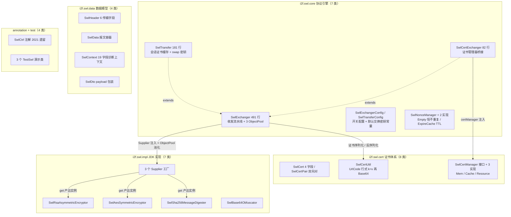
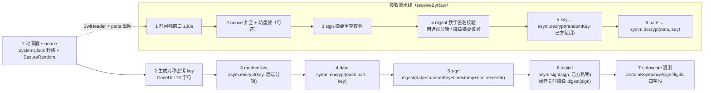
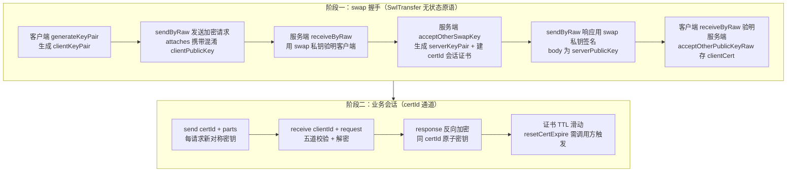

# i2f-swl

> **SWL（Secure Wire Layer）安全网络层的默认实现层与协议引擎**——全模块 **30 个源文件、2100 行**，另含 299 行内嵌设计文档（`src/main/java/i2f/swl/readme.md`，随 jar 打包）。三层引擎角色：无状态的 `SwlExchanger`（491 行）承载「时间戳窗口 → nonce 防重放 → 摘要签名 → 非对称数字签名 → 对称加密 + 非对称加密」完整收发流水线，并以 3 个 `ObjectPool` 池化管理密码器（require/release）；有状态的 `SwlTransfer`（181 行，extends SwlExchanger）叠加 certId→`SwlCert` 的 TTL 会话缓存与内置交换密钥对；`SwlCertExchanger`（82 行，extends SwlExchanger）桥接 `SwlCertManager` 证书体系（内存/缓存/资源三实现）。配套 JDK 四件密码学实现（RSA 2048 / AES-128 / SHA-256 / Base64 混淆 + 3 个 Supplier）、证书工具链（`SwlCert`/`SwlCertPair`/`SwlCertUtil` Base64 行式序列化）、防重放管理器（`SwlNonceManager` 接口 + Empty/ExpireCache 两实现）、数据模型四件套（`SwlHeader`/`SwlData`/`SwlContext`/`SwlDto`）与 2021 年遗留的 `SwlCtrl` 注解（in/out 双开关）。
>
> **协议本质**：每请求生成一次性随机对称密钥 `key`，用对端公钥加密为 `randomKey` 随报文传输；报文 `data` 用 `key` 对称加密；`sign=摘要(data+randomKey+timestamp+nonce+certId)` 防篡改；`digital=己方私钥签名(sign)` 防伪造；四个安全头字段经 Base64 混淆编码。防重放双闸门：时间戳 ±30 秒窗口 + nonce 一次性（默认关闭）。
>
> **消费现状**：被 **6 个模块 115 处 import** 消费——i2f-swl 自身 60、i2f-springboot-swl-starter 14、i2f-springcloud-gateway-swl-starter 13、i2f-extension-swl 13（测试示例）、i2f-spring-swl 12、i2f-jdk-ext-swl 3；`new SwlTransfer(...)` 全仓 14 处、`new SwlExchanger(...)` 6 处；POM 直接依赖 5 个模块（jdk-ext-swl、spring-swl、springboot/springcloud 两个 swl-starter + `i2f-jdk-all` 聚合），随 `i2f-jdk-all` 发布。
>
> ⚠ **重点瑕疵**：`SwlTransfer.removeCert` 永不删除证书（L106-114 存在即提前 return，`cache.remove` 不可达）；`sendByRaw`/`receiveByRaw` 池化 require/release 无 try/finally 保护——任一步骤抛异常即对象池泄漏；`sendByRaw` L273 先归还摘要器、L280（`enableDigital=false` 分支）又使用已归还对象；`receiveByRaw` L340 `Long.parseLong(timestamp)` 对畸形时间戳抛未包装的 `NumberFormatException`；`SwlTransferConfig` 源码硬编码默认交换 RSA/SM2 私钥（L21-27，不替换即公开密钥）；内嵌 readme 与实现三处不一致（sign 是否含 clientPublicKey、receive 是否重置证书 TTL、nonce 是否用 uuid）；消费方实证：jdk-ext-swl `SwlWebFilter.java:369` `"$." + responseBody`（byte[] 拼接，对照同作者 `SwlGatewayFilter.java:479` 的 `"$." + responseText` 判定为笔误）——详见「模块瑕疵或错误」。

## 模块路径

- `i2f-jdk/i2f-swl`

## 模块依赖

| 依赖（maven 坐标） | scope | optional | 用途 |
| --- | --- | --- | --- |
| `i2f.turbo:i2f-swl-std:1.0-jdk8` | compile | 否 | 契约层——4 大能力接口 + 3 Supplier + `SwlCode`/`SwlException`（本模块是其实例化落地的默认实现） |
| `i2f.turbo:i2f-std-const` | compile | 否 | `StdConst.RUNTIME_PERSIST_DIR`——证书文件默认落盘目录（`SwlResourceCertManager`） |
| `i2f.turbo:i2f-clock-impl` | compile | 否 | `SystemClock.currentTimeMillis()`——时间戳生成与窗口校验（`SwlExchanger`） |
| `i2f.turbo:i2f-crypto-impl` | compile | 否 | JDK JCE 封装——`RsaType.ECB_PKCS1PADDING`/`AsymmetricEncryptor`、`AesType.ECB_ISO10126Padding`/`SymmetricEncryptor`、`MessageDigester.SHA_256` |
| `i2f.turbo:i2f-codec-impl` | compile | 否 | `Base64StringByteCodec`/`HexStringByteCodec`/`CharsetStringByteCodec`/`UrlCodeStringCodec`/`Base64Obfuscator` 编解码底座 |
| `i2f.turbo:i2f-code` | compile | 否 | `CodeUtil.makeCheckCode(16)`——AES-128 对称密钥生成 |
| `i2f.turbo:i2f-lru-cache` | compile | 否 | `LruMap`（1024 容量）——`SwlCacheCertManager`/`SwlResourceCertManager` 本地热点缓存 |
| `i2f.turbo:i2f-pool` | compile | 否 | `ObjectPool`——非对称/对称/摘要密码器三池化（`SwlExchanger`） |
| `i2f.turbo:i2f-io-file` | compile | 否 | `FileUtil`——证书文件读写与父目录自动创建（`SwlResourceCertManager`）；传递引入 `i2f-io-stream`（`StreamUtil`） |
| `i2f.turbo:i2f-cache` | compile | 否 | `IExpireCache`/`MapCache`/`ObjectExpireCacheWrapper`——`SwlTransfer` 会话缓存与 `SwlExpireCacheNonceManager` 防重放缓存 |
| `org.projectlombok:lombok` | provided（继承根 POM `dependencyManagement`） | true（继承） | `@Data`/`@Getter`/`@Setter`——本模块**重度使用**（30 个文件中 26 个含 lombok 注解） |

- 构建插件：仅 `maven-assembly-plugin`（裸声明，版本由父 POM 统一管理）。
- 无 `src/test` 测试目录（唯一 3 个测试类以 `main` 方法形式放在 `src/main/java/i2f/swl/test/`，随主 jar 打包）；组织方式瑕疵见瑕疵 9。

## 模块设计

1. **三层引擎角色（继承链）**：`SwlExchanger`（无状态协议核心）→ `SwlTransfer`（会话状态 + 证书缓存）/ `SwlCertExchanger`（证书管理器桥接），后两者均 `extends SwlExchanger` 并复用其收发流水线：

| 类 | 行数 | 职责 | 关键成员 |
| --- | --- | --- | --- |
| `SwlExchanger` | 491 | 无状态收发协议引擎：密钥交换、签名、加解密流水线 + 池化 | 6 个开关（enableTimestamp/Nonce/Encrypt/Digital + 窗口/超时）、3 Supplier + 3 ObjectPool、`sendByRaw`/`receiveByRaw`/`sendByCert`/`receiveByCert` |
| `SwlTransfer` | 181 | 有状态会话层：certId→SwlCert 的 TTL 缓存、swap 交换密钥、默认证书 | `IExpireCache<String,String>`、`swapKeyPair`、`buildCert`/`getCert`/`acceptOtherPublicKey*`/`send`/`receive`/`response`/`sendDefault` |
| `SwlCertExchanger` | 82 | 证书管理器桥接：从 `SwlCertManager` 加载证书再调用超类收发 | `certManager`（默认 `SwlResourceCertManager`）、`createCertPair`/`sendByCertId`/`receiveByCertId`/`responseByCertId`/`acceptByCertId` |

2. **模块包结构（11 个包、30 个文件）**：



3. **发送流水线（`sendByRaw`，SwlExchanger.java:190-290）**——7 步密码学编排：



4. **ObjectPool 池化复用**：三个 Supplier（非对称/对称/摘要）在 `SwlExchanger` 字段初始化时构造三个 `ObjectPool`（transient，SwlExchanger.java:66-74）；`setXxxSupplier` 同步调用 `pool.setSupplier`（L88-101）；`requireXxx()`/`releaseXxx()` 公开成对暴露（L103-125）；短流程内部（`generateKeyPair`/`generateKey`/`generateCertPair`）用 try/finally 保证归还（L127-154），但两个大流程 `sendByRaw`/`receiveByRaw` **未用 try/finally**（见瑕疵 2）。
5. **证书体系**：`SwlCert` 四字段（certId/己方公钥 publicKey/己方私钥 privateKey/对端公钥 remotePublicKey）；`SwlCertPair` 封装 server、client 两份对称视角的证书；`SwlCertUtil` 序列化为「URL 编码行式 k=v → UTF8 字节 → Base64」文本；`SwlCertManager` 接口按 `(certId, server|client)` 双维度存取，三个实现——`SwlMemCertManager`（ConcurrentHashMap）、`SwlCacheCertManager`（LruMap 1024 热点 + ICache 后端）、`SwlResourceCertManager`（LruMap + 本地文件 `runtime/persist/swl/cert` + classpath 回退加载，默认实现）。
6. **Nonce 防重放（SwlNonceManager）**：接口 `contains/set` 双动词；`SwlEmptyNonceManager`（恒 false + 空操作，默认兜底）；`SwlExpireCacheNonceManager`（2026/4/9 后补，`swl:nonce:` 前缀 + IExpireCache TTL）。启用时以 `clientId-nonce`（或 `timestamp-nonce`）为键查重（SwlExchanger.java:358-371）。
7. **数据模型四件套**：`SwlHeader`（6 个 public 字段：timestamp/nonce/randomKey/sign/digital/certId——传输面上网的字段）；`SwlData`（header/parts/attaches/context 报文容器）；`SwlContext`（19 字段全流程诊断上下文：密钥、明文 data、校验结果 signOk/digitalOk、clientId/window 等——**含私钥与对称密钥明文**，消费方须在传输前 `setContext(null)`）；`SwlDto`（payload 单字段，2026/3/22 后补，用于把 SwlData JSON 再套 Base64 的 HTTP 握手传输包装）。
8. **JDK 四件密码学实现**：`SwlRsaAsymmetricEncryptor`（RSA/ECB/PKCS1，密钥 Base64）、`SwlAesSymmetricEncryptor`（AES/ECB/ISO10126Padding，密钥 16 字符、密文 Base64）、`SwlSha256MessageDigester`（SHA-256，输出 hex）、`SwlBase64Obfuscator`（Base64Obfuscator 变体）+ 3 个 Supplier（`SwlSha256MessageDigesterSupplier` 为 2026/4/8 后补）。
9. **内置交换密钥与配置**：`SwlTransferConfig` 常量区硬编码默认 swap RSA 与 SM2 密钥对（L21-27，供演示/开箱使用）；`SwlExchangerConfig` 6 开关默认 `enableTimestamp=true`（30 秒窗）、`enableNonce=false`、`enableEncrypt=true`、`enableDigital=true`；配置支持 `applyConfig` 热应用（不动 Supplier 与池）。
10. **SwlCtrl 注解（2021/9/2 历史遗留）**：`in()/out()` 双开关，方法/类级——被本模块无关的 Web 集成层用于标记「入参需解密/出参需加密」，早于 2024 年引擎诞生，是旧版框架移植痕迹。

## 模块目的

- **为 SWL 安全传输协议提供开箱即用的默认实现**：JDK 内置 JCE 全实现（RSA/AES/SHA-256/Base64），零三方密码学库——`new SwlTransfer()` 即得可用引擎，替换 Supplier 即可切换为国密（i2f-sm-crypto-swl）或 BouncyCastle（i2f-extension-swl）。
- **把「会话密钥交换式安全传输」固化为可复用协议引擎**：时间戳窗口、nonce 一次性、摘要防篡改、数字签名防伪造、随机对称密钥 + 非对称密钥保护五道校验按固定顺序编排——Web 集成四层（filter/advice/AOP/gateway）共享同一套收发语义。
- **提供会话证书的完整生命周期管理**：certId 会话证书的生成（`generateCertPair`/`createCertPair`）、交换（`acceptOtherPublicKey*`/`acceptOtherSwapKey`）、TTL 缓存（`SwlTransfer.cache`）、三种持久化策略（内存/缓存/文件+classpath）。
- **以「诊断上下文」换取可观测性**：`SwlContext` 保留全流程中间值（signOk/digitalOk/window/nonceKey 等 19 字段），异常时可直接定位失败环节。

## 模块功能

- **密钥生成**：非对称密钥对（`generateKeyPair`）、对称密钥（`generateKey`）、会话证书对（`generateCertPair`/`createCertPair`）。
- **安全收发**：raw 模式（`sendByRaw`/`receiveByRaw`——直接给远端公钥 + 己方私钥）、cert 模式（`sendByCert`/`receiveByCert`——SwlCert 对象）、会话模式（`SwlTransfer.send`/`receive`/`response`/`sendDefault`——certId 定位）、管理器模式（`SwlCertExchanger.*ByCertId`）。
- **握手协议原语**：`getSelfSwapKey` 取交换私钥；`acceptOtherSwapKey`（解混淆 + 生成新 certId + 存证书）与 `acceptOtherPublicKey`/`acceptOtherPublicKeyWithId`/`acceptOtherPublicKeyRaw`——支撑「swap 握手换回 serverCert」的完整流程（见使用方法第 3 节）。
- **证书管理**：`buildCert`/`getCert`/`removeCert`/`resetCertExpire`/`getSelfPublicKey`/`getSelfPrivateKey`/`getOtherPublicKey`/`getOtherCertIdDefault`。
- **证书持久化**：三实现任选（内存/缓存/资源文件）。
- **防重放**：NonceManager 查重 + 时间戳窗口校验。
- **混淆编码**：`obfuscateEncode`/`obfuscateDecode`（对 SwlHeader 四安全字段及自定义数值）。
- **数据模型与注解**：SwlHeader/SwlData/SwlContext/SwlDto + SwlCtrl。

## 模块主要使用方法

```java
// 1) 零装配默认使用：不开任何 Supplier，即用 JDK RSA 2048 + AES-128 + SHA-256 + Base64
SwlTransfer client = new SwlTransfer();   // 等价于 new SwlExchanger() + 会话缓存
SwlTransfer server = new SwlTransfer();

// 2) 更换算法族（三套实现任选/混搭）：只换 Supplier，引擎代码不动
client.setAsymmetricEncryptorSupplier(SwlBcRsa2048AsymmetricEncryptor::new); // BC RSA2048
client.setSymmetricEncryptorSupplier(SwlAntherdSm4SymmetricEncryptor::new);  // 国密 SM4
client.setMessageDigesterSupplier(SwlSha256MessageDigester::new);            // 默认 SHA-256
client.setObfuscator(new SwlBase64Obfuscator());                             // 混淆器为共享单例
// 注意：setXxxSupplier 会同步更新内部 ObjectPool 的工厂（SwlExchanger.java:88-101）
```

```java
// 3) swap 握手 → 会话（TestSwlTransfer.testMock 的完整姿势）
AsymKeyPair swapKeyPair = server.generateKeyPair();          // 服务端交换密钥对（生产应外部配置）
AsymKeyPair clientKeyPair = client.generateKeyPair();        // 客户端会话密钥对
// 客户端握手：certId 传 "swap"，attaches 携带混淆后的 clientPublicKey
SwlData reqShake = client.sendByRaw("swap", swapKeyPair.getPublicKey(),
        clientKeyPair.getPrivateKey(), Arrays.asList(payload),
        Arrays.asList(client.obfuscateEncode(clientKeyPair.getPublicKey())));
// 服务端接收握手并颁发会话证书：acceptOtherSwapKey 内部生成 serverKeyPair 并建 certId
String serverCertId = server.acceptOtherSwapKey(reqShake.getAttaches().get(0));
String serverPublicKey = server.getSelfPublicKey(serverCertId);
// 服务端响应自己的公钥（用 swap 私钥签名）
SwlData respShake = server.sendByRaw(serverCertId, clientPublicKey,
        swapKeyPair.getPrivateKey(), Arrays.asList(serverPublicKey));
// 客户端确认身份并落证书（certId 来自响应头），随后业务收发仅凭 certId
String clientCertId = client.acceptOtherPublicKeyRaw(
        respShake.getHeader().getCertId(), clientKeyPair, serverPublicKey);
SwlData biz = client.send(clientCertId, Arrays.asList("hello"));
SwlData recv = server.receive("127.0.0.1", biz);              // clientId 用于 nonce 隔离
SwlData resp = server.response(recv.getHeader().getCertId(), Arrays.asList("echo:hello"));
SwlData back = client.receive("server", resp);
```

```java
// 4) 证书管理器模式（多会话/持久化）：SwlCertExchanger + SwlResourceCertManager
SwlCertExchanger server = new SwlCertExchanger();   // 默认 SwlResourceCertManager（文件 + classpath）
server.createCertPair("app-1");                     // 生成 server/client 双向证书并落盘
SwlCert clientCert = server.getCertManager().loadClient("app-1");
SwlCertExchanger clientApi = new SwlCertExchanger();
clientApi.setCertManager(new SwlMemCertManager());  // 客户端用内存管理器
clientApi.getCertManager().storeClient(clientCert);
SwlData req = clientApi.sendByCertId("app-1", Arrays.asList("body:123"));
SwlData recvReq = server.acceptByCertId(req, "app-1", "127.0.0.1");
SwlData resp = server.responseByCertId("app-1", Arrays.asList("echo:ok"));
SwlData recvResp = clientApi.receiveByCert(resp, clientCert);
```

```java
// 5) Spring 集成（自动装配视角）：springboot/springcloud 两个 starter 的装配范式
SwlTransfer transfer = new SwlTransfer();
transfer.setAsymmetricEncryptorSupplier(getBeanByTypeOrNewInstance(webProps.getAsymAlgoClass()));
transfer.setSymmetricEncryptorSupplier(getBeanByTypeOrNewInstance(webProps.getSymmAlgoClass()));
transfer.setMessageDigesterSupplier(getBeanByTypeOrNewInstance(webProps.getDigestAlgoClass()));
transfer.setObfuscator(getBeanByTypeOrNewInstance(webProps.getObfuscateAlgoClass()));
transfer.setCache(springIExpireCacheAdapter);       // 桥接 Spring 的 IExpireCache<String,Object>
transfer.applyConfig(new SwlTransferConfigProperties());  // i2f.swl.transfer.* 前缀绑定
SwlExpireCacheNonceManager nonceManager = new SwlExpireCacheNonceManager();
nonceManager.setCache(springIExpireCacheAdapter);
transfer.setNonceManager(nonceManager);             // 开启防重放
```

注意事项：

1. **传输前必须清空 context**：`sendBy*` 返回的 `SwlData.context` 含 `selfPrivateKey`、对称密钥 `key`、明文 `data` 等敏感值——出网前必须 `setContext(null)`（官方集成代码均如此：`SwlSpringController.java:67`、`SwlGatewayApiFilter.java:128`、`SwlEncryptionResponseBodyAdvice.java:59`），遗忘即私钥泄漏。
2. **默认交换私钥是公开常量**：`SwlTransferConfig.DEFAULT_SWAP_PRIVATE_KEY`（RSA）与 `DEFAULT_SWAP_SM2_PRIVATE_KEY`（SM2）硬编码在源码中——生产环境必须 `setSwapKeyPair(新密钥对)` 替换，否则任何人可解开握手报文。
3. **防重放默认关闭**：`enableNonce=false` + `SwlEmptyNonceManager` 意味着默认只靠 ±30 秒时间窗防重放；需显式 `setEnableNonce(true)` + `setNonceManager(new SwlExpireCacheNonceManager())`。
4. **两类模式语义**：`sendByRaw` 是无状态单次调用（适合握手段）；`send`/`receive`（SwlTransfer）依赖 certId 缓存（适合会话段）；二者可混用但 certId 语义要自洽。
5. **`receive` 不自动续期证书**：内置 readme 声称「根据 certId 获取证书并重置 TTL」，但 `SwlTransfer.receive`（L159-163）只做 `getCert`——TTL 续期需调用方自行 `resetCertExpire(certId)`（`SwlWebFilter.java:274` 正是这样补的）。
6. **timestamp 必须是纯数字秒级字符串**：`receiveByRaw` 直接 `Long.parseLong`（L340），畸形输入抛 `NumberFormatException`（非 `SwlException`，上层按码兜底接不住）。
7. **`removeCert` 不会真正删除**（L106-114）：如需清理证书缓存请直接操作 `getCache().remove(...)`（或等 TTL 过期）。
8. **`generateKeyPair()` 不写入实例状态**：返回新密钥对但不 `setKeyPair` 到内部密码器；`getKeyPair()` 在未注入密钥的实现上 NPE（`SwlRsaAsymmetricEncryptor.java:48-61` 无判空）。

## 模块特性总结

- **全栈自带**：协议引擎 + JDK 密码学实现 + 证书体系 + 防重放器 + 数据模型一体——`new SwlTransfer()` 零配置可用。
- **协议引擎与算法解耦**：3 Supplier + 混淆器注入 + ObjectPool 池化——RSA↔SM2、AES↔SM4 可整体或混搭替换（三套实现族互操作）。
- **五道校验流水线**：时间戳窗口 → nonce 一次性 → 摘要防篡改 → 数字签名防伪造 → 非对称解密密钥有效性——顺序固定、任一失败即抛带码 `SwlException`。
- **双传输模式**：raw（无状态单次）与 cert（会话缓存/TTL/持久化）双轨，握手与会话统一同一套收发原语。
- **每请求一密钥**：对称会话密钥每次发送重新生成，`randomKey` 经对端公钥保护——即使单次密钥泄漏不波及历史报文。
- **诊断上下文**：`SwlContext` 19 字段保存全流程中间值，失败定位无需断点。
- **内置设计文档**：299 行 `readme.md` 完整描述协议成分、载荷清单与握手/业务四段时序（但存在与实现不一致的三处，见瑕疵 6）。
- **历史包袱共存**：2021 年的 `SwlCtrl` 注解与 2024 年的引擎、2026 年补丁的 `SwlDto`/`SwlExpireCacheNonceManager`/`SwlSha256MessageDigesterSupplier` 同模块——演进痕迹明显。

## 模块瑕疵或错误

1. **`SwlTransfer.removeCert` 永不删除（功能性缺陷）**：`removeCert`（SwlTransfer.java:106-114）先 `cache.get`，非空时**直接 return 反序列化结果**，`cache.remove` 分支不可达；空值分支的 remove 也是空操作——证书永远无法主动删除，只能等 TTL 过期。
2. **收发大流程池化泄漏（资源缺陷）**：`sendByRaw`（:227-285）与 `receiveByRaw`（:414-485）的 `requireXxx`/`releaseXxx` 之间**无 try/finally**——`encrypt`/`sign`/`verify`/`decrypt` 任一步抛异常，借出的密码器永不归还（对比 `generateKeyPair` 等小方法均有 try/finally，:127-154）；与 i2f-pool 自身已知的「同一对象重复发放」缺陷叠加后影响放大。
3. **归还后复用池化对象（时序缺陷）**：`sendByRaw` 在 :273 先 `releaseMessageDigester(messageDigester)`，随后 `enableDigital=false` 分支在 :280 又调用 `messageDigester.digest(sign)`——此时对象已归还池中，可能已被并发借出并改写状态。
4. **畸形时间戳抛出未包装异常（健壮性缺陷）**：`receiveByRaw` L340 `Long.parseLong(timestamp)`——`timestamp` 为 null/非数字时抛 `NumberFormatException`/NPE，不属 `SwlException` 体系；Web 集成层按 `SwlException.code()` 兜底的反查（如 `SwlExceptionHandler`）无法结构化处理，直接 500。
5. **源码硬编码默认交换私钥（安全缺陷）**：`SwlTransferConfig` L21-27 内置可用的 RSA/SM2 交换密钥对常量（`DEFAULT_SWAP_PRIVATE_KEY`/`DEFAULT_SWAP_SM2_PRIVATE_KEY`）——默认配置下握手报文可被任何读过源码者解密；虽然注释为「默认」，但 API 层面无「未替换」告警。
6. **内嵌 readme 与实现三处不一致（文档时效缺陷）**：① readme L73/L107 称 `sign=digest(data+randomKey+timestamp+nonce+certId+clientPublicKey)`，实现不含 `clientPublicKey`（SwlExchanger.java:269/416）；② readme L226/L282 称服务端接收时「重置证书的 TTL 过期时间」，`SwlTransfer.receive` 未实现；③ readme 多处写 `nonce=uuid()`，实现为 `random.nextInt(0x7fff)` 两次拼接（:223，约 30 位熵且非 UUID 格式）。
7. **对称实现误抛非对称错误码（上轮 swl-std 审计已记录，来源在本模块）**：`SwlAesSymmetricEncryptor.java:56,67` 的 AES 加解密失败抛 `ASYMMETRIC_ENCRYPT_EXCEPTION`(1100)，应使用 2100/2200 对称码段。
8. **`SwlRsaAsymmetricEncryptor.getKeyPair` 无判空 NPE**：L48-61 直接 `encryptor.getKeyPair().getPublic()` 链——内部密码器未注入密钥/生成失败时 NPE（无 try/catch 也无 `SwlException` 包装，与本类其他方法风格分裂）。
9. **组织方式瑕疵**：① 3 个演示测试类（`TestSwlCertExchanger`/`TestSwlExchanger`/`TestSwlTransfer`，共 317 行）以 `main` 方法形式放在 `src/main/java/i2f/swl/test/`，随主 jar 发布；② 设计文档 `readme.md` 放在 `src/main/java/i2f/swl/` 内且被打进 jar（`target/classes/i2f/swl/readme.md` 实证）——均非 maven 标准位置。
10. **`SwlHeader` 字段 public 与全模块 lombok 风格分裂**：6 个传输字段为裸 public 字段（SwlHeader.java:17-37），其余数据类均为 private + `@Data`；`SwlData` 更无 `@NoArgsConstructor`（反序列化框架需默认构造器时依赖其隐式默认构造）。
11. **`SwlEmptyNonceManager` 安全默认值为“关”**：默认 nonce 关闭（enableNonce=false）+ 空实现兜底——「安全功能默认关闭」的默认值取向对安全意识弱的集成方不友好；且 nonce 非空强制校验（:354-356）与「防重放默认关闭」语义混杂（关的是查重，不是格式）。
12. **`SwlResourceCertManager` 静默吞 IO 异常**：L105-106 空 `catch (IOException e) {}` 返回 null——加载失败静默，调用方只能得到 null 证书（`SwlTransfer.getCert` 会因 null 抛 CERT_ID_MISSING，掩盖真实 IO 原因）。
13. **`SwlContext` 敏感数据同容器设计**：私钥/对称密钥/明文与传输字段同容器，安全全靠消费方自觉 `setContext(null)`（4 个官方集成点均做了，但 TestSwlTransfer 演示亦如此，属「约定而非机制」的脆弱设计）。

## 消费现状与验证（拓展）

- **源码级 import 统计**（`import i2f.swl.(core|cert|data|impl|annotation).*`，共 **115 处**）：

| 消费模块 | import 数 | 消费内容与用途 |
| --- | --- | --- |
| i2f-swl（自身） | 60 | 包间互引（引擎↔证书↔实现↔模型） |
| i2f-springboot-swl-starter | 14 | `SwlTransfer`（自动装配 Bean/核心服务）、3 Supplier、`SwlTransferConfig` 继承配置、`SwlExpireCacheNonceManager`、`SwlCtrl`（Controller 标记）、`SwlData`/`SwlDto`（握手端点） |
| i2f-springcloud-gateway-swl-starter | 13 | 同 springboot 模式（`SwlTransfer` 装配 + 网关握手机制 `SwlGatewayApiFilter`） |
| i2f-extension-swl | 13 | **仅测试类**（`TestBcSwlTransfer`/`TestBcSmSwlTransfer`/`TestAntherdSwlTransfer`/`TestMixedSwlTransfer` 各 import SwlTransfer/SwlData/SwlBase64Obfuscator 等） |
| i2f-spring-swl | 12 | `SwlExchanger`（两个 body advice 直接 new）、`SwlCertManager`/`SwlResourceCertManager`/`SwlCert`、`SwlCtrl`（supports 判定）、`SwlData` |
| i2f-jdk-ext-swl | 3 | `SwlTransfer`（Servlet Filter 引擎）、`SwlData`/`SwlHeader`（报文头序列化） |

- **类级外部消费 Top**：`core.SwlTransfer` 12、`data.SwlData` 10、`impl.SwlBase64Obfuscator` 6、`annotation.SwlCtrl` 4、其余（`SwlTransferConfig`/`SwlExpireCacheNonceManager`/`SwlDto`/`SwlHeader`/`SwlCert`/`SwlCertManager`/`SwlExchanger`/`SwlResourceCertManager`/3 Supplier）各 2、`SwlSha256MessageDigester` 1。
- **实例化统计**：`new SwlTransfer(...)` 14 处、`new SwlExchanger(...)` 6 处、`new SwlCertExchanger(...)` 2 处（均在模块自测）、`new SwlData(...)` 4 处、`new SwlDto(...)` 2 处。
- **POM 级**：直接依赖 5 模块——`i2f-jdk-ext-swl`(pom.xml:27)、`i2f-spring-swl`(:67)、`i2f-springboot-swl-starter`(:54)、`i2f-springcloud-gateway-swl-starter`(:46) + `i2f-jdk-all` 聚合(:545)；根 POM `dependencyManagement`(:781) 统一版本。
- **消费方观察（阅读源码发现，供交叉验证）**：
  - **`SwlWebFilter.java:369` 疑似笔误（响应体损坏级）**：`responseText = "$." + responseBody;`——L368 刚取出的加密文本（`responseData.getParts().get(0)`）被 byte[] 拼接覆盖（`"$." + byte[]` 得到 `$.[B@hash` 文本），随后 L370 写回响应；对照同一作者 `SwlGatewayFilter.java:479` 的正确写法 `"$." + responseText` 可判定为笔误——**若属实，jdk-ext/springboot 两条 Servlet 响应加密链路的响应体均为哈希码文本**（建议实机验证修复）。
  - **`SwlGatewayApiFilter.java:107-108` 静默吞异常**：`catch (Exception e) {}` 后 L113 直接解引用 `reqHandleShake.getAttaches()`——畸形请求体触发 NPE（500 且无日志）。
  - **`SwlSpringAutoConfiguration.java:88-91` / `SwlGatewayAutoConfiguration.java:84-87` 空 try-catch 死代码**：`try { } catch (Exception e) {}` 无内容块。
  - **两套 starter 的 `swlTransfer()` Bean 近乎逐行复制**（约 85 行 x2），且均有 4 处 `SwlException(SwlCode.SYMMETRIC_EXCEPTION.code(), ...)` 兜底（上一轮 swl-std 审计的「兜底码滥用」来源）。
  - **`SwlGatewayAutoConfiguration.java:177-179` 硬编码路由**：握手路由 `uri("http://localhost:80")` 写死。
  - **i2f-extension-swl 的 4 个测试类全部脱节**：`TestBcSwlTransfer`/`TestBcSmSwlTransfer`/`TestAntherdSwlTransfer`/`TestMixedSwlTransfer` 各 5 处调用已不存在的旧 API（`setMessageDigester`/`resetSelfKeyPair`/`SwlHeader.getRemoteAsymSign`），无法编译通过（该模块无 CI 校验的证据）。
  - **positive 面**：`SwlWebFilter` L259-266 以 `catch (Throwable)` 暂存异常到 request attribute 交由 `onException` 策略统一处理的设计、`SwlSpringController`/`SwlGatewayApiFilter` 的握手端点实现与本模块 `TestSwlTransfer.testMock` 流程逐句对应——消费方与本模块协议契约高度一致。
- **验证方式**：PowerShell `Select-String -Encoding UTF8` 全仓（`.java`/`pom.xml`，`\src\` 过滤 + 排除 target）统计 import/实例化/POM；本模块行数经逐文件 `Get-Content .Count` 加总（30 文件 = 2100 行）。

## SWL 握手与会话时序（拓展）



- 代码映射：`SwlSpringController.swapKey`（springboot 端点）与 `SwlGatewayApiFilter`（网关端点）是同一流程的两种部署形态；`TestSwlTransfer.testMock`（:28-97）是可运行的完整参考。

## 可拓展方向（拓展）

1. **修复池化生命周期**：为 `sendByRaw`/`receiveByRaw` 补 try/finally（或 try-with-resources 风格的借用封装）消除异常路径泄漏；把 L280 的摘要调用移出 `releaseMessageDigester` 之后。
2. **修复 `removeCert`**：存在分支改走「读取 + remove + 返回」或直接 `cache.remove` 后返回旧值。
3. **时间戳解析防御**：`Long.parseLong` 包一层 `SwlException(CERT/NONCE 段码)`，避免未包装异常绕过集成层错误码体系。
4. **默认交换密钥工程化**：启动时校验 `swapKeyPair` 是否为内置默认值，命中则 WARN/强制覆盖（或提供 `generateAndSetSwapKey` 便捷方法）。
5. **内嵌 readme 对齐实现**：修正 sign 拼接公式、nonce 生成方式、receive 的 TTL 语义三处描述（或反之让实现向文档补齐 resetCertExpire）。
6. **测试归位**：3 个 main 测试类迁往 `src/test/java`（引入 junit 断言化），`readme.md` 移出 `src/main/java` 源码包；extension-swl 的 4 个脱节测试同步重写为当前 API。
7. **敏感容器加固**：`SwlContext` 考虑对私钥/密钥字段标注 `@JsonIgnore` 或拆分「诊断上下文」与「传输上下文」，从机制上杜绝忘记 `setContext(null)` 的泄漏。
8. **消费方缺陷修复**：`SwlWebFilter.java:369` 笔误（`"$." + responseText`）、`SwlGatewayApiFilter` 空 catch 与 NPE 链、两套 starter 装配重复代码提取公共模块。
