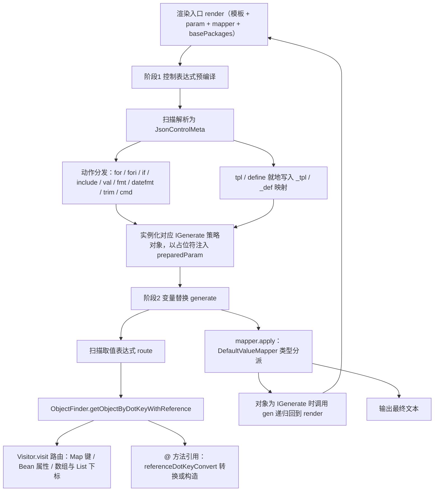

# i2f-template-render

> **基于正则表达式的轻量级文本模板渲染引擎 / 纯 JDK 实现的「控制表达式」模板**——全模块 **15 个源文件、2441 行、5 个包**，无 `src/test` 测试目录、无 `resources`。核心是 `RegexGenerator`（632 行，两阶段渲染管线 + 4 组核心正则常量），配套 9 个 `IGenerate` 策略实现（`core/impl/` 包，覆盖 for/fori/if/include/val/fmt/datefmt/trim/cmd）、1 个路由求值器 `ObjectFinder`（361 行，`Visitor` 路由 + `@类.方法` 引用转换）、1 个默认值转换器 `DefaultValueMapper`（201 行）与 1 个文件模板加载器 `FileTemplateLoader`——不依赖任何三方模板引擎（Freemarker/Velocity），仅用 JDK 正则 + 内部反射工具完成「数据 + 模板 → 文本」的生成。
>
> **表达式体系**：取值表达式 `${route}`（路由取值 + `@方法` 引用转换）；控制表达式 `#{[action,route],k="v"*}` 共 **11 种动作**——`for`（迭代 Iterable/数组/Map）、`fori`（数值循环）、`if`（条件判断）、`tpl`/`include`（模板声明/引入，支持 `_tpl` 收纳与文件加载）、`val`（自定义转换器）、`fmt`（String.format）、`datefmt`（日期格式化）、`trim`（前后缀裁剪）、`define`（变量定义 `_def`）、`cmd`（命令行执行并回显）——模板可任意嵌套（`IGenerate.gen()` 内部递归调用完整渲染管线），上下文变量 `_item`/`_root`/`_ctx`（`first`/`last`/`index`，fori 增 `i`/`fmti`）。
>
> **当前全仓零消费方**：模块外 Java `import` **0 处**（检索 `i2f\.template\.render|RegexGenerator` 全部命中均在模块自身）；POM 级仅 2 处「聚合/版本管理」声明（i2f-jdk-all:pom.xml:551-554 聚合、根 pom.xml:789-793 `dependencyManagement`），无任何应用模块直接依赖——**能力可用但无人使用**。⚠ 主要风险：非法条件表达式抛 `EmptyStackException`、条件 `true/false` 字面量不支持（与 Javadoc 矛盾）、`cmd` 表达式可执行任意命令且异常静默、`basePackages` 被就地修改致循环渲染下列表膨胀、依赖的上游 `Visitor` 对非 List 的 Iterable 索引访问必抛 `ClassCastException`——详见「模块瑕疵或错误」。

## 模块路径

- `i2f-jdk/i2f-template-render`

## 模块依赖

| 依赖（maven 坐标） | scope | optional | 用途 |
| --- | --- | --- | --- |
| `i2f.turbo:i2f-reflect:1.0-jdk8` | compile | 否 | 反射底座——`ReflectResolver`（`loadClass`/`getInstance`/`findMethod`/`getConstructors`/`invokeMethod`）、`vistor.Visitor`（路由表达式求值的实际执行者，ObjectFinder.java:56）、`LruMap` 级联缓存（pom.xml:20-23） |
| `i2f.turbo:i2f-io-file:1.0-jdk8` | compile | 否 | `FileUtil.loadTxtFile`/`getFileWithClasspath`——`FileTemplateLoader` 的 classpath/文件模板加载（FileTemplateLoader.java:23-25）（pom.xml:25-28） |
| `i2f.turbo:i2f-os:1.0-jdk8` | compile | 否 | `OsUtil.runCmd`——`cmd` 表达式的命令执行（CmdGenerate.java:50）（pom.xml:30-33） |
| `i2f.turbo:i2f-tuple-impl:1.0-jdk8` | compile | 否 | `Tuple2`/`Tuple3`——`IfGenerate` 条件解析与布尔求值的载体（pom.xml:35-38） |
| `org.projectlombok:lombok` | provided（继承根 POM `dependencyManagement`，pom.xml:83-89） | true（继承） | `@Data`/`@NoArgsConstructor`：为 9 个 IGenerate 实现生成 getter/setter（其实例字段全部 public 直访问），JsonControlMeta 生成访问器 |

- **隐性传递依赖（源码直接使用但 POM 未声明）**：`i2f.convert.obj.ObjectConvertor`（来自 **i2f-convert**，ObjectFinder.java:4、IfGenerate.java:4）与 `i2f.typeof.TypeOf`（来自 **i2f-typeof**，ObjectFinder.java:7）——二者经 `i2f-reflect` 的 compile 依赖传递获得（i2f-reflect/pom.xml:25-33），当前编译/运行可用，但属依赖声明不完整，升级 i2f-reflect 依赖树时可能断裂。
- 构建插件：仅 `maven-assembly-plugin`（裸声明，版本由父 POM 统一管理）；版本继承 `i2f-jdk` parent（`1.0-jdk8`）；根 POM `dependencyManagement` 统一 `${i2f.version}`（pom.xml:789-793）；`i2f-jdk-all` 聚合发布（i2f-jdk-all/pom.xml:551-554）；`i2f-jdk` 模块清单第 151 项（i2f-jdk/pom.xml:151，紧随 i2f-swl-std 之后）。
- 模块无 `src/test`、无 `resources`，编译产物仅 15 个 class。

## 模块设计

1. **两阶段渲染管线（核心架构）**——`RegexGenerator.render(template, param, mapper, basePackages)` 不直接做替换，而是「先编译控制表达式、后统一替换变量」，使控制表达式与取值表达式可以任意嵌套、递归展开：



   - **阶段 1（控制表达式预编译，RegexGenerator.java:265-567）**：用 `JSON_CONTROL_REGEX` 扫描 `#{[action,route],k="v"*}`，经 `inflateJsonControlRegexString`（:84-125）解析为 `JsonControlMeta{action, routeExpression, parameters}`；按 action 实例化对应 `IGenerate`（注入 mapper/root/data/basePackages），并把原表达式替换为 `${_for_tmp_N}`/`${_if_tmp_N}` 等占位符写入 `preparedParam`（param 的浅拷贝，:266-269）；`tpl`/`define` 两个动作无独立类，就地写入 `_tpl`/`_def` 映射（:357-373、:475-485）。
   - **阶段 2（变量替换，RegexGenerator.java:596-629）**：用 `JSON_PARAM_REGEX` 扫描 `${route}`，经 `ObjectFinder.getObjectByDotKeyWithReference` 从 `preparedParam` 路由取值，再交 `mapper.apply` 转换输出；取出的对象若为 `IGenerate`（即阶段 1 注入的占位符），`DefaultValueMapper` 会调用其 `gen()`（DefaultValueMapper.java:43-45）——`gen()` 内部再度调用 `RegexGenerator.render` 渲染子模板，形成「控制表达式 → 占位符 → 递归 render」的递归链路。
   - 注：`fori` 分支在源码中为独立 `if`（RegexGenerator.java:506，位于 else-if 链之后），与 else-if 链功能等效。

2. **策略模式（IGenerate 家族）**——`core/IGenerate` 仅一个方法 `String gen()`（IGenerate.java:7-9）；9 个实现全部为「public 字段 + gen()」的可变值对象（Prefer lombok @Data），由 RegexGenerator 装配后经 mapper 触发：

| 实现类（core/impl/） | 行数 | 对应动作 | 产出要点 |
| --- | --- | --- | --- |
| `ForGenerate` | 135 | for | data 为数组→转 List；Iterable/Map（entrySet）→迭代；separator 仅加在「合法产出」之间；blank=true 时空集直接返回空串（丢弃 prefix/suffix）；jump=true 时跳过 trim 后为空的项 |
| `ForiGenerate` | 193 | fori | `for(long i=begin; i <condition> end; i+=step)` 语义；condition 缺省 `!=`（isPass 支持 ==/!=/<>/>/</>=/<=）；format 缺省 `%d`；无最大循环次数保护（见瑕疵 6） |
| `IfGenerate` | 464 | if | test 支持 `==`/`!=`/`>`/`<`/`>=`/`<=`/`instanceof`/`match` 八种运算符；数字经 BigDecimal、日期经 Date 优先比较；`&&`/`||` 组合（&& 优先，无括号）；template 为空则直接输出 `mapper.apply(data)` |
| `IncludeGenerate` | 54 | include | 以 `_item=data`、`_root` 保留渲染引入的模板一次（非循环） |
| `ValGenerate` | 43 | val | 以 `mapper` 参数指定类名反射实例化 `Function<Object,String>` 转换；失败静默回退继承的 mapper |
| `FmtGenerate` | 61 | fmt | `String.format(format, values...)`；values 为逗号分隔路由表达式（支持 `_item[0]`），缺省以取值本身为唯一参数 |
| `DatefmtGenerate` | 41 | datefmt | `SimpleDateFormat(format).format(data)`，仅当 data 为 Date，否则回退 mapper |
| `TrimGenerate` | 129 | trim | 去除前缀/后缀（多个用 `\|` 分隔）、sensible 控制大小写敏感、trimBefore/trimAfter 控制裁剪前后 trim |
| `CmdGenerate` | 70 | cmd | command 先渲染再交给 `OsUtil.runCmd` 执行；show 缺省 true（回显入模板）；charset 缺省 UTF-8 |

3. **表达式语法体系（4 组核心正则常量，RegexGenerator.java:35-82）**——全部大小写敏感、严格匹配：

| 常量 | 正则要点 | 示例 |
| --- | --- | --- |
| `DECLARE_NAME_REGEX` | `[a-zA-Z_][a-zA-Z0-9_]*` | `abc`、`_a1` |
| `REFERENCE_METHOD_REGEX` | `@` + 声明名（可多级点分） | `@size`、`@String.valueOf`、`@com.i2f.CommUtil.getData` |
| `OBJECT_FIELD_ROUTE_REGEX` | 声明名 + `[数字]` 下标 + 点分 + 可选 @ 方法引用 | `abc.de[2].cf@Integer.parseInt` |
| `JSON_PARAM_REGEX` | `${` + 路由 + `}` | `${abc.de[1]}${size}` |
| `JSON_CONTROL_REGEX` | `#{[动作,路由](,k="v")*}`，参数值仅支持双引号字符串 | `#{[for,list],separator=",",template="${_item}"}` |

4. **路由求值（ObjectFinder）**——`getObjectByDotKeyWithReference(obj, dotKey, basePackages)`（:40-59）把 `route@引用` 拆两段：路由部分交 `Visitor.visit(expr, obj).get()`（i2f-reflect）执行——按 token 依次处理 Map 键（缺失返回 null）、Bean 字段/getter（**缺失抛 IllegalStateException**）、数组/List 下标；`@` 后为方法引用（`referenceDotKeyConvert`，:98-150）：依次尝试 `java.lang`/`java.util`/`java.math`/`java.time`/`java.io` 与用户 `basePackages` 前缀补全类名（:106-116），跳过参数多于 1 个的重载；优先取「单参且参数可转换匹配」的重载（转换后调用），否则取第一个候选（不转换直接调用，异常静默返回原对象，:286-303）；void 返回值时以（转换后的）入参/原对象作为结果；关键字 `class` 取对象 Class、`instanceof` 走构造函数创建（:143-148）。

5. **默认值转换（DefaultValueMapper）**——`Function<Object,String>`，apply 按类型分派（:28-110）：null→`NULL_VAL`("null")、Iterable/数组→递归 join（`ITERABLE_SEPARATOR`=","）、Map→entrySet 渲染、`IGenerate`→`gen()`（递归触达点）、String 原样、Date→`DATE_FMT`("yyyy-MM-dd HH:mm:ss SSS")、各包装类型/原子类型→`String.valueOf`、Map.Entry→`toString`、其余对象→`onCustomObject`（toString）；5 个 public 字段与 protected 钩子方法（`onNull`/`onString`/`onDate`/`onIterable` 等）供定制。

6. **模板加载（FileTemplateLoader）**——`Function<String,String>`：经 `FileUtil.getFileWithClasspath`（支持 `classpath:` 前缀）解析文件后以 UTF-8 读取全文，任何异常静默返回 null（FileTemplateLoader.java:22-30）；`tpl` 动作的 `load` 参数可指定任意 `Function<String,String>` 实现类名反射替换（RegexGenerator.java:569-587）。

7. **包结构**：

| 包 | 类 | 说明 |
| --- | --- | --- |
| `i2f.template.render` | `RegexGenerator` | 两阶段渲染入口 + 正则常量 + inflate 解析 |
| `i2f.template.render.core` | `IGenerate`、`ObjectFinder` | 策略接口 + 路由求值器 |
| `i2f.template.render.core.impl` | 9 个 IGenerate 实现 | 各控制动作 |
| `i2f.template.render.data` | `JsonControlMeta` | 控制表达式解析载体（action/route/parameters） |
| `i2f.template.render.impl` | `DefaultValueMapper`、`FileTemplateLoader` | 默认转换器 + 模板加载器 |

## 模块目的

- **零三方模板引擎依赖**：以 2441 行纯 JDK 正则 + 内部反射工具替代 Freemarker/Velocity/Thymeleaf，在依赖受限（不允许引入三方模板库）的场合提供「循环 + 条件 + 模板复用」级能力。
- **面向代码/文本生成场景**：数据库反向工程代码生成、配置/脚本批量产出、通知文案拼装等「结构化数据 → 文本」的既有场景（仓库内反向工程生成器另有 Velocity 路线，本模块提供纯 JDK 备选）。
- **DSL 化的动态文本能力**：通过 `@方法引用`（任意静态方法/属性转换）、`val`/`tpl` 的自定义实现类注入、`cmd` 的命令执行，让模板具备「取值-转换-执行」全链路表达力。
- **低侵入集成**：单一静态入口（`RegexGenerator.render`）+ 可插拔 `Function` 组件（mapper/loader），无需容器、无状态管理。

## 模块功能

- **取值表达式**：`${route}` 路由取值（Map 键 / Bean 属性 / 数组与 List 下标 / `[i]` 索引），支持 `@方法引用` 链式转换（如 `${age@String.valueOf}`、`${list[0].name@toUpperCase}`）。
- **11 种控制表达式**（`#{[action,route],k="v"*}`）：

| 动作 | 关键参数 | 功能 |
| --- | --- | --- |
| `for` | separator/prefix/suffix/template/blank/jump/ref | 迭代 Iterable/数组/Map，逐项渲染 template（`_item`/`_ctx.first/last/index`） |
| `fori` | begin/end/step/condition/format + 同上 | 数值循环 `for(long i=begin; i <cond> end; i+=step)`，`_ctx.i`/`_ctx.fmti` |
| `if` | test/template | 条件判断，test 表达式中 `_item` 指代 route 取值 |
| `tpl` | template/load/key | 声明模板存入 `_tpl.{route}`，可用 `ref` 被复用；key 非空时优先从 load（默认文件）加载 |
| `include` | ref | 以 route 取值为 `_item` 渲染 `_tpl` 中 ref 指定的模板 |
| `val` | mapper | 用指定类（`Function<Object,String>`）转换 route 取值 |
| `fmt` | format/values | `String.format` 格式化，values 为逗号分隔路由式参数 |
| `datefmt` | format | `SimpleDateFormat` 格式化 Date 取值 |
| `trim` | prefix/suffix/sensible/trimBefore/trimAfter/template/ref | 去除渲染结果的前后缀（`\|` 分隔多个） |
| `define` | value | 定义变量存入 `_def.{route}`（value 先渲染），经 `${_def.xxx}` 引用 |
| `cmd` | command/show/charset | 渲染 command 并执行（`Runtime.exec`），show=true（默认）时把回显（stdout+stderr 合并）渲染进模板 |

- **上下文变量**：`_item`（当前取值对象/循环项）、`_root`（顶层渲染参数）、`_ctx`（`first`/`last`/`index`，fori 额外 `i`/`fmti`）、`_tpl`（模板收纳）、`_def`（变量收纳）。
- **条件运算符**：`==`、`!=`、`>`、`<`、`>=`、`<=`、`instanceof`、`match`（正则 matches），左右值支持路由表达式、数值、单引号字符串；组合仅支持 `&&`/`||`（**两侧必须留空格**，&& 优先，无括号优先级）。
- **两级 API**：`render`（完整两阶段，param 限定 `Map<String,Object>`）与 `generate`（仅 `${}` 替换，param 任意 Object/Bean，可单独作为纯占位符替换器）。
- **单独使用 ObjectFinder**：`getObjectByDotKeyWithReference(obj, "a.b[0].c@Integer.parseInt")` 可在任何位置独立完成「JS 风格路由取值 + 方法转换」；`referenceDotKeyConvert` 支持 `class`/`instanceof` 关键字与 `basePackages` 简写前缀。

## 模块主要使用方法

```java
// 1) 基础：${} 取值（render 顶层 param 必须是 Map；generate 可传任意 Bean）
Map<String, Object> param = new HashMap<>();
param.put("name", "i2f");
param.put("items", Arrays.asList("a", "b", "c"));
param.put("age", 25);

String s1 = RegexGenerator.render("hello ${name}, age=${age}", param);
// hello i2f, age=25

String s2 = RegexGenerator.generate("hello ${name}", someBean); // 仅占位符替换，可传 Bean

// 2) 循环 + 上下文变量：separator/prefix/suffix/template
String s3 = RegexGenerator.render(
        "#{[for,items],separator=\",\",prefix=\"[\",suffix=\"]\",template=\"${_ctx.index}-${_item}\"}",
        param);
// [0-a,1-b,2-c]（_ctx.first/_ctx.last 可做首尾特判）

// 3) 条件：test 中 _item 指代 route 取值；&&/|| 两侧必须留空格
param.put("status", "active");
param.put("score", 88);
String s4 = RegexGenerator.render(
        "#{[if,status],test=\"_item=='active' && score>60\",template=\"通过\"}", param);
// 通过（不满足时整段输出为空串）

// 4) 模板复用：tpl 声明 + include 引入（ref 为 _tpl 的模板 ID）
String s5 = RegexGenerator.render(
        "#{[tpl,header],template=\"== ${title} ==\"}#{[include,title],ref=\"header\"}", param);
// == null ==（title 不存在时 Map 取值返回 null → 渲染 "null"）

// 5) define 变量：存 _def，经 ${_def.xxx} 引用（value 可再渲染）
String s6 = RegexGenerator.render(
        "#{[define,greet],value=\"hi ${name}\"}${_def.greet}", param);
// hi i2f
```

```java
// 6) 自定义值转换器：覆写 5 个样式字段或继承重写 protected 钩子
DefaultValueMapper mapper = new DefaultValueMapper();
mapper.NULL_VAL = "-";           // null 的渲染文本（默认 "null"）
mapper.DATE_FMT = "yyyy/MM/dd";  // 日期默认格式
String s7 = RegexGenerator.render("${missing}|${birthday}", param, mapper, null);
// -|1999/01/01

// 7) 单独使用路由求值
Object v = ObjectFinder.getObjectByDotKeyWithReference(param, "items[0]@String.valueOf");
// "a"
```

注意事项：

- **`render` 的 param 必须是 `Map<String,Object>`**（内部要浅拷贝 + 注入占位符）；传 Bean 请用 `generate`，或把 Bean 放进 Map 的某个 key 下再以 `${key.attr}` 取值。
- **控制表达式参数值必须用双引号**，且**转义序列不会还原**：`template="a\"b"` 会得到字面 `a\"b`（含反斜杠，RegexGenerator.java:118）——模板内需要引号时建议改用单引号字符串。
- **动作名大小写敏感**（严格 `equals`），拼写错误（如 `iff`）会让整个表达式**静默消失**（不报错、不保留原文，见瑕疵 8）。
- **条件 test 的 `&&`/`||` 两侧必须空格**，且**不支持 `true`/`false` 字面量**——布尔比较请用数值（`==1`）或单引号字符串（`=='true'`）；`null` 字面量仅在 Map 参数下可用（见瑕疵 2）。
- **`for`/`fori` 的 `ref` 与 `include` 的 `ref` 语义不同**：前者表示「从 param 路由取值得到模板字符串」（RegexGenerator.java:300-307），后者表示「从 `_tpl` 按 ID 取模板」（:375-384）。
- **`basePackages` 会被就地修改**（ObjectFinder.java:106-116 每次调用向列表头部 add 5 个默认包）——请勿传入复用列表或固定长度列表（见瑕疵 7）。
- **`cmd` 表达式具备任意命令执行能力**、`val`/`tpl.load` 可反射任意类——模板内容必须视为可信输入，禁止拼接外部用户数据（见瑕疵 10）。
- **递归渲染依赖 `mapper`**：占位符对象（`IGenerate`）只能被 `DefaultValueMapper` 识别触发；自定义 mapper 若自行处理所有值而漏掉 `IGenerate` 分支，循环/条件将无法展开。

## 模块特性总结

1. **零三方模板引擎**：全模块仅依赖内部 4 个基础模块，纯 JDK 正则驱动，适合三方依赖受限环境。
2. **两阶段递归渲染**：控制表达式先编译为策略对象 + 占位符，再统一替换——天然支持控制表达式任意嵌套。
3. **11 种控制动作**：for/fori/if/tpl/include/val/fmt/datefmt/trim/define/cmd，覆盖循环、条件、复用、格式化、变量、命令全场景。
4. **可插拔组件**：mapper（值转换）、loader（模板加载）、basePackages（类名简写）、val.mapper（局部转换器）均按类名反射注入，零代码改造成本。
5. **双入口 API**：`render`（完整能力，Map 参数）/`generate`（纯 `${}` 替换，任意参数），`ObjectFinder` 可独立复用。
6. **上下文完备**：`_item`/`_root`/`_ctx`（含首尾/索引/循环变量与格式化值）/`_tpl`/`_def`，满足嵌套循环与变量复用。
7. **零测试零消费**：无自动化测试；全仓无 import 消费方（瑕疵 11）。
8. **动态能力即风险面**：命令执行 + 反射加载类 + 文件读取，模板等价于「可执行脚本」（瑕疵 10）。

## 模块瑕疵或错误

1. **非法条件表达式致 `EmptyStackException` 崩溃（健壮性缺陷）**：`IfGenerate.test()` 对不匹配 `CONDITION_REGEX` 的子条件静默丢弃（:102-104），若全部被丢弃（如 `a==1&&b==2`——连接符分隔正则 `\s+(&&|\|\|)\s+` 要求两侧空格，无空格时整串成为单条非法条件；又如 `abc` 无操作符），`legalConds` 为空 → `calcBooleanResult` 空栈执行 `valStack.pop()`（IfGenerate.java:165）抛 `EmptyStackException`——整个渲染中断且异常信息无上下文。
2. **条件 `true`/`false` 字面量不支持（与文档矛盾）**：RegexGenerator.java:169 的 Javadoc 宣称「左右值支持 true、false、null 三个特殊值」；实际 `parseValue`（IfGenerate.java:435-444）只处理数值/单引号字符串/路由表达式，`true`/`false` 会被当路由表达式去参数取值——由于 test 的参数恒为 HashMap（IfGenerate.java:115-120），取不到返回 null，与布尔值比较恒不成立（如 `_item.flag==true` 判定失败）；`null` 字面量同理是「Map 缺失键返回 null」的副作用而非语法支持。
3. **表达式参数缺失时 NPE（兜底缺失）**：`FmtGenerate.gen()` 对 `format=null` 直接 `String.format(null,...)`（FmtGenerate.java:32）；`CmdGenerate.getCmdline()` 在 command 未指定时 `render(null,...)` 内部 `template.length()` NPE（CmdGenerate.java:65 → RegexGenerator.java:270）；顶层 `render(null,...)` 同样 NPE——以上均无参数校验。
4. **`cmd` 的 show=false 不执行命令（与 Javadoc 矛盾）**：Javadoc 称「show为true时将回显渲染到模板中，否则只执行」；实现中 `!isShow` 直接 `return ""`（CmdGenerate.java:39-41），命令**根本不会执行**；且执行异常被静默吞掉返回空串（:52-55），无日志无告警。
5. **`ForiGenerate.format` 空串误判字段（复制粘贴错误）**：ForiGenerate.java:104-109 判断 `"".equals(scondition)` 而非 `sformat`——当 `format=""` 时 `sformat` 留空，`String.format("", i)` 返回空串，`_ctx.fmti` 渲染为空而非回退 `%d`。
6. **`fori` 无循环次数保护（死循环风险）**：`while (isPass(lbegin, scondition, lend))`（ForiGenerate.java:146）无最大轮次限制——`step="0"` + `condition="!="`、负步长 + 方向不匹配等参数组合会永久循环，且循环体内每轮都会渲染模板（直接挂起调用线程）。
7. **`basePackages` 就地修改 + 循环膨胀（副作用缺陷）**：`ObjectFinder.referenceDotKeyConvert` 每次被调用都向传入的 List **头部插入** 5 个默认包前缀（:112-116）——① 用户传入的列表被意外篡改；② 传入 `Arrays.asList` 等固定长度/不可变列表抛 `UnsupportedOperationException`；③ `for`/`fori` 循环中每轮渲染复用同一列表实例（ForGenerate.java:105、ForiGenerate.java:162 等传递原引用），**列表元素随循环次数无限增长**（n 轮 +5n），长循环下查找性能持续退化。
8. **未知动作静默消失**：阶段 1 对不匹配任何分支的 action（拼写错误、大小写不符）既不报错也不保留原文——表达式被从文本中「吞掉」（分支链 RegexGenerator.java:283-559 无 else 兜底，lidx 已越过该片段），排错困难。
9. **依赖的上游缺陷（使用本模块时应规避）**：① i2f-reflect `VisitorParser` 对非 List 的 Iterable（Set/Collection）执行索引访问时 `(Iterable) ret` 强转的是 Visitor 对象（VisitorParser.java:362），**`${set[0]}` 形式必抛 `ClassCastException`**（本模块 `ObjectFinder.getCollectionIndexObj` 提供了正确的索引实现却未被 Visitor 使用）；② `ReflectResolver.LOAD_CLASS_PREFIXES` 含拼写错误前缀（`java.concurrent.`、`java,time.temporal.`，ReflectResolver.java:210/221），这些包的简写类名不可达；③ **Bean 参数下访问不存在的属性/字段抛 `IllegalStateException`**（VisitorParser.java:374-380，Map 参数则宽容返回 null）——模板中出现未知字段即中断渲染（顶层 render 的 param 为 Map 时无此问题，`_item` 为 Bean 时需注意）；④ `FileTemplateLoader` 经 `new File(url.getFile())` 落地（FileUtil.java:648-655，URL 未解码），**JAR 部署、含空格/中文路径场景加载失败**（被 catch 后静默返回 null）。
10. **动态能力安全面（使用提示）**：`cmd` 可执行任意系统命令；`tpl.load`、`val.mapper` 可反射实例化任意类（仅需 public 无参构造）；`include`/`tpl` 可读取任意文件内容——模板文件应视为**可信代码**管理，禁止将外部输入直接拼入模板文本；命令回显会包含 stderr（OsUtil 合并输出，OsUtil.java:131-163）。
11. **零测试**：无 `src/test` 目录——两阶段递归、条件解析、jump/blank 过滤、basePackages 传递等复杂路径全部无回归保护；结合全仓零消费方，实际正确性无验证记录。
12. **异常处理风格不一致**：静默吞异常（FileTemplateLoader/ValGenerate/CmdGenerate 兜底、ObjectFinder 方法调用失败返回原值、ForiGenerate 数值解析回退默认值）与裸抛未包装异常（Visitor 的 `IllegalStateException`、本模块的 `EmptyStackException`/`NullPointerException`）并存，调用方无法用统一策略捕获；`loadTemplate` 是唯一做包装的路径（IllegalAccessException → IllegalStateException，RegexGenerator.java:576-578）。

## 消费现状与验证（拓展）

- **Java 源码级消费：0 处**。全仓检索 `i2f\.template\.render|RegexGenerator` 的 import/引用全部落在模块自身；`i2f-template-render` 字符串命中仅 4 处 POM 声明（根 POM:791、i2f-jdk/pom.xml:151、i2f-jdk-all:553、自身）。
- **POM 级引用（2 处，均为聚合/版本管理，非消费）**：

| 声明方 | 位置 | 用途 |
| --- | --- | --- |
| `i2f-jdk-all` | pom.xml:551-554 | 聚合依赖（全模块集合打包） |
| 根 POM `dependencyManagement` | pom.xml:789-793 | 统一版本 `${i2f.version}` |

- **无任何应用模块直接依赖**——这是与 i2f-image、i2f-swl 等「有实际消费方」模块的关键差别：本模块处于「能力可用但无人使用」状态。
- **发布路径**：随 `i2f-jdk-all` 聚合发布；版本继承 `i2f-jdk` parent `1.0-jdk8`。
- **验证口径**：以上基于当前仓库快照（15 源文件 2441 行、5 包、依赖 5 条）静态核实；上游语义（Visitor/ReflectResolver/ObjectConvertor/OsUtil/FileUtil）均经源码逐项验证；模块正确性未做运行期验证（无测试资源可用）。

## 关键行为约束（依赖上游语义，拓展）

| 上游组件 | 行为约束 | 影响 |
| --- | --- | --- |
| `Visitor.visit`（i2f-reflect） | Map 缺失键返回 null（宽容）；Bean 缺失属性抛 `IllegalStateException`；非 List 的 Iterable 索引访问 `ClassCastException` | 决定 `${route}` 对 Map/Bean 的不同容错与 Set 下标不可用 |
| `ReflectResolver.loadClass` | 拼写错误前缀影响部分 JDK 包简写；找不到类返回 null；静态 LRU 缓存（2048） | `@方法引用`/`load`/`mapper` 的类名解析与缓存行为 |
| `ReflectResolver.getInstance` | 仅接受 public 构造；找不到抛 `IllegalAccessException`；对 Map/Set/List 接口有内置默认实现 | `val.mapper`/`tpl.load`/`Class@instanceof` 的实例化前置条件 |
| `ObjectConvertor.tryConvertAsType` | 尽力转换，失败返回 null（不抛异常） | 方法引用参数匹配与条件数值比较的类型容错 |
| `OsUtil.runCmd` | 阻塞读取 stdout+stderr 合并输出；最多等待 3 分钟（超时被忽略，进程可能残留）；异常包装 `IllegalStateException` | `cmd` 表达式的执行语义与超时行为 |
| `FileUtil.getFileWithClasspath` | `URL.getFile()` 直接转 `File`（未解码）；资源不存在返回 null → NPE（被捕获） | 模板文件加载仅目录部署可靠（见瑕疵 9④） |
| `LruMap`（i2f-lru-map） | 静态共享缓存（VisitorParser 正则/分词缓存 4096、ReflectResolver 类缓存 2048） | 高频渲染下缓存命中率与跨线程共享语义 |
