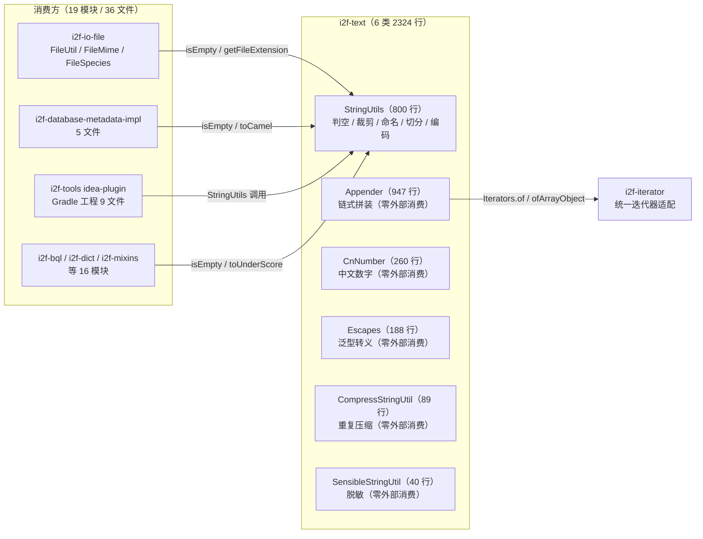

# i2f-text

> **通用文本/字符串工具库——i2f 生态内引用最广的基础模块之一**：全模块 **6 个源文件、2324 行、2 个包**（`i2f.text` + `i2f.text.escape`），无 `src/test` 测试目录、无 `resources`、**无任何三方依赖**。六类分工：**`StringUtils`（800 行，主力）**——判空/24 种不可见字符清洗/裁剪/命名风格转换（Camel/Pascal/UnderScore/Snake/Property/Path/Colon）/前后缀判定与保证/合并切分/文件名与扩展名/子串定位/嵌套对象与异常堆栈可读化/字符集转换；**`Appender`（947 行）**——泛型链式文本拼装 DSL（条件/循环/迭代器族/Map/格式化/字节序列）；**`CnNumber`（260 行）**——数字 → 中文简繁/金额读法（万进制 4 位分组 + 简繁双表）；**`Escapes`（188 行）**——泛型转义/反转义算法（规则序列匹配 + C 风格转义表）；**`CompressStringUtil`（89 行）**——连续重复字符 RLE 压缩（数字/A-E/`[hex]` 三档计数编码）；**`SensibleStringUtil`（40 行）**——敏感信息星号脱敏。
>
> **消费规模为全仓第一梯队（与多数零消费模块形成鲜明对比）**：全仓 **19 个模块、36 个 Java 文件**真实 import，涉及类**仅 `StringUtils` 一个**（其余 5 类零外部消费）；方法热度——`isEmpty` 158 处、`toUnderScore` 10 处、`hasText`/`getFileExtension` 各 4 处、`toCamel` 3 处；POM 直接声明依赖 15 个模块（i2f-jdk 内 10 + i2f-extension 内 5）+ `i2f-jdk-all` 聚合；另有 8 个消费模块未直接声明（经传递依赖获得，依赖关系隐性化）；最大消费方为 Gradle 工程 `i2f-tools/i2f-jdbc-procedure-idea-plugin`（9 文件）。
>
> ⚠ **主要风险**：`trimRight` 因索引从未更新而**完全失效**（恒返回原串）；`ensureStartsWith`/`ensureEndsWith` 的 `ignoreCase` 分支把 `str` 误作 `prefix`/`suffix`，且 `ensureEndsWith` 用 `startsWith` 判定——两方法在对应场景下行为错误；`Appender.$trim` 的 `trimSuffixes` 误用 `startsWith` 导致错误截尾；`Escapes.escape` 末尾匹配 off-by-one（`i+plen>=len`）使**串尾的转义/反转义序列不生效**；`convertCharset` 不可映射字符被静默丢弃；POM 声明 `i2f-match` 但 6 文件零引用——详见「模块瑕疵或错误」。

## 模块路径

- `i2f-jdk/i2f-text`

## 模块依赖

| 依赖（maven 坐标） | scope | optional | 用途 |
| --- | --- | --- | --- |
| `i2f.turbo:i2f-iterator:1.0-jdk8` | compile | 否 | `Iterators` 统一迭代器适配——`Appender` 的 `addIterator/addIterable/addCollection/addEnumeration/addArray/addReflectArray` 系列与 `adds*` 变参入口（Appender.java:3、705-726、845-865）（pom.xml:15-18） |
| `i2f.turbo:i2f-match:1.0-jdk8` | compile | 否 | **声明未用**——6 个源文件零 `i2f.match` 引用（pom.xml:20-23，见瑕疵 14） |

- 无任何三方依赖（连 lombok 也未引入，模块内全部手写实现）。
- 构建插件：仅 `maven-assembly-plugin`（裸声明，版本由父 POM `i2f-jdk` → `i2f-turbo-java` 统一管理）；编译产物 `i2f-text-1.0-jdk8.jar`（模块 `target/` 实证）。
- 版本继承 `i2f-jdk` parent（`1.0-jdk8`）；根 POM `dependencyManagement` 以 `${i2f.version}` 统一版本（pom.xml:794-798）；`i2f-jdk-all` 聚合发布（i2f-jdk-all/pom.xml:555-558）；`i2f-jdk` 模块清单第 152 项（i2f-jdk/pom.xml:152，紧随 i2f-template-render 之后）。
- 模块无 `src/test`、无 `resources`，编译产物仅 6 个 class。

## 模块设计

1. **六类总览与外部消费热度**：

| 类 | 行数 | 职责 | 外部消费 |
| --- | --- | --- | --- |
| `StringUtils` | 800 | 判空/空白/裁剪/命名风格/前后缀/切分合并/文件路径/子串定位/对象展示/编码转换 | **唯一被消费类**：19 模块 36 文件 |
| `Appender` | 947 | 链式拼装 DSL（条件/循环/迭代器族/Map/格式化/字节） | 0（模块外零引用） |
| `CnNumber` | 260 | 数字 → 中文（简/繁、普通/金额、精度控制） | 0 |
| `Escapes` | 188 | 泛型转义算法 + C 风格转义表 | 0 |
| `CompressStringUtil` | 89 | 连续重复字符压缩/解压（互为逆操作） | 0 |
| `SensibleStringUtil` | 40 | 敏感信息星号脱敏（保留首尾） | 0 |

2. **模块组成与消费关系**——「一个类撑起全部外部引用」，其余五类为内部/备用能力：



3. **StringUtils 方法体系（13 组）**：

| 组 | 方法（节选） | 说明 |
| --- | --- | --- |
| 不可见字符 | `SPECIAL_WHITE_SPACE_STR`/`isSpecialWhiteSpaceChar`/`hasSpecialWhiteSpaceChars`/`trimSpecialWhiteSpaceChars` | 识别/清洗网页、Word 复制带入的 24 种不可见 Unicode 字符（NBSP、零宽空格/连接符、全角空格、行/段分隔符等，:16-58） |
| 判空 | `isEmpty`/`nonEmpty`/`hasText`/`nonText` | `hasText` 按 `Character.isWhitespace` 判定（:60-83） |
| 裁剪 | `trim`/`trimLeft`/`trimRight`/`trimAll`/`trimPrefix`/`trimSuffix`/多规则 `trim` | `trimAll` 去全部空白；多规则 `trim` 支持 ignoreCase/trimWhiteSpace/append 包装（:388-481，缺陷见瑕疵 1、10） |
| 大小写 | `firstUpper`/`firstLower`/`toUpper`/`toLower` | 首字母转换（空串越界，瑕疵 13）（:141-167） |
| 命名风格 | `toPascal`/`toCamel`/`toUnderScore`/`toSnake`/`toPropertyCase`/`toPathCase`/`toColonCase` | 规则见下（:169-240） |
| 前缀后缀 | `endsWith`×4 / `startsWith`×3 / `ensureStartsWith`×3 / `ensureEndsWith`×3 | 「保证」类在 ignoreCase 场景有缺陷（瑕疵 2、3）（:274-386） |
| 合并切分 | `joins`/`join`/`split` | `join` 自动去除相邻重复分隔符；`split` 支持 trimBefore/limit/removeEmpty（:483-553） |
| 子串定位 | `substringBefore/AfterLastIndexOf`、`substringBefore/AfterIndexOf` | 「after + withIdx」返回含 idx 的片段（`getFileExtension` 依赖该约定）（:571-645） |
| 文件 | `getFileExtension`/`getFileNameOnly` | 前者返回**含点**后缀（如 `.txt`，与 FileMime 的 `.txt` 映射表约定一致）（:555-569） |
| 对象展示 | `of(Object)`/`ofMap`/`ofIterable`/`ofArray`/`ofThrowable` | 递归展示嵌套 Map/Iterable/数组；异常输出「类名:消息 + 完整堆栈」（:647-743） |
| 编码 | `ofBytes`/`ofUtf8`/`ofGbk`、`toBytes`/`toUtf8`/`toGbk`、`convertCharset` | 字符集互转（`convertCharset` 有静默丢弃缺陷，瑕疵 9）（:745-799） |

4. **命名风格转换规则**（核心为 `toLinkCase0` 的逐字符实现，:223-240）：已含目标分隔符时原样返回（仅 trim）；否则遇大写字母前置分隔符并小写化——`toUnderScore("userName") → "user_name"`、`toSnake → "user-name"`、`toPropertyCase → "user.name"`、`toPathCase → "user/name"`、`toColonCase → "user:name"`；反向 `toCamel("user_name") → "userName"`、`toPascal → "UserName"`（按 `_`/`-` 切分后首字母处理）。注意：连续大写、数字边界的转换结果与主流工具（Guava CaseFormat 等）可能不同，接入时先验证。
5. **Appender 链式拼装设计**——`Appender<T extends Appendable>` 以 `volatile T appender` 持有底层缓冲（静态工厂 `buffer()`/`builder()` 分别产出 StringBuffer/StringBuilder 版本，:47-53），所有操作返回 `this` 支持链式书写，`get()`/`build()`/`toString()` 输出结果；`DEFAULT_FILTER`（:23-41）统一过滤 null/空串/空集合/空 Map/空数组：

| 能力组 | 方法（节选） | 说明 |
| --- | --- | --- |
| 添加 | `add`/`addLine`/`adds`/`addsLine`/`addsSep`/`addsSepLine`/`addsFull` | `adds*` 为变参批添加（:79-93、:333-342、:845-865） |
| 条件 | `addWhen`/`addNotWhen`/`addsWhen`/`addIteratorWhen`/`addWhenEnd`/`addWhenTo`/`addNullTo`/`addEmptyTo` | 布尔条件包装（:482-522、:628-678） |
| 迭代器族 | `addIterator`/`addIterable`/`addCollection`/`addEnumeration`/`addArray`/`addReflectArray`（+ `*Elem` 版） | 统一走 `Iterators.of*` 适配；`*Elem` 版以 `BiConsumer` 自定义逐项写入（:680-843） |
| 编辑 | `insert`/`addStart`/`del`/`substr`/`trunc`/`set`/`clear`/`length`/`addRepeat` | 直接操作底层缓冲（:96-116、:322-413） |
| 裁剪 | `trim`/`keepStart`/`keepEnd`/`trimStart`/`trimEnd` | 幂等式头尾保证（:524-626） |
| 格式化 | `addFormat`/`addDateFormat`（Date/LocalDate/LocalDateTime/LocalTime） | `String.format` / `SimpleDateFormat` / `DateTimeFormatter`（:415-447） |
| Map | `addMap(map, kvSeparator, entrySeparator, open, close)` | 见瑕疵 5（:871-900） |
| 字节 | `addStrBytes`/`addHexBytes`/`addOtcBytes` | 十六进制 `0x` 前缀、八进制 `0` 前缀变体（:902-946） |
| 空白 | `line`/`tab`/`blank`（含 count 重载） | 常用分隔符快捷方法（:449-480） |

6. **CnNumber 中文数字算法**——以 4 位为组（万进制）自低向高拆分入 `ArrayDeque`，再自高位读出；表驱动：数字位表 `〇一二…九`/`零壹贰…玖`（简/繁）、位权表 `十百千`/`拾佰仟`、大单位表 `""/万/亿/万亿/兆…涧`（简/繁，:23-60）；小数按 `点分厘毫`（普通）或 `元角分厘毫`（金额）逐位读出；`precision` 控制小数扫描轮数；负数加「负」前缀；金额版自动补「元」；输出为**完整读法**（10 → `一十`/`壹拾`，不省略）。含 `main` 演示方法（:62-87，见瑕疵 16）。
7. **CompressStringUtil 编码方案**——连续相同字符读作「字符 + 计数」：计数 1-9 用 `'1'-'9'`、10-14 用 `'A'-'E'`、≥15 用 `[十六进制]`（`aaabbccccdd` → `a3b2c4d2`；15 个 `a` → `a[f]`，:19-49）；`deCompress` 反向解析（:51-88）。作者注明仅适用于大量连续重复的场景，否则体积翻倍。
8. **Escapes 泛型转义算法**——`escape(List<T>, List<Entry<List<T>,List<T>>>)`（:130-186）：把「原序列 → 替换序列」规则表按首元素建 `active` 索引，对输入序列从前往后扫描、优先整段匹配替换；`charEscape`/`byteEscape`（:48-116）为字符/字节入口；`getClangEscapeMap`/`getClangDescapeMap`（:24-38）提供 C 风格 8 组转义表（`\\ \n \t \" \' \r \b \f`）；`reverseKeyVal` 可反转映射。**末尾匹配缺陷见瑕疵 8**。
9. **包结构**：`i2f.text`（`StringUtils`/`Appender`/`CnNumber`/`CompressStringUtil`/`SensibleStringUtil`）+ `i2f.text.escape`（`Escapes`）；除 `SensibleStringUtil → StringUtils`（复用 `isEmpty`，:19）与 `Appender → Iterators` 外无类间依赖。

## 模块目的

- **统一文本工具出口**：把「判空、命名转换、大小写、切分、展示」等高频字符串操作收敛到单一入口，避免各模块重复造轮子——这也是其成为全仓引用最广模块之一的直接原因。
- **命名风格治理**：为数据库字段 → Java 属性 → URL 路径等跨层转换提供约定一致的双向命名转换（`toUnderScore`/`toCamel` 等，被反向工程生成器、数据库元数据模块直接使用）。
- **可读化输出**：`of`/`ofThrowable` 为日志与调试提供嵌套对象、异常堆栈的可读文本。
- **领域补位**：中文数字/金额（会计、合同场景）、敏感信息脱敏（展示层）、重复字符压缩（简易存储）、自定义转义（协议处理）等单点场景的低成本方案。

## 模块功能

- **StringUtils**：判空与文本判定；24 种不可见字符识别与清洗；trim 全家族（含多规则前后缀裁剪与包装）；大小写与 7 种命名风格转换；前后缀判定与「保证」（ensure*）；join/split 增强；文件名/扩展名提取；4 向后缀子串定位；任意对象（嵌套 Iterable/Map/数组/异常）递归可读化；编码字节互转（UTF-8/GBK 快捷）与字符集往返校验。
- **Appender**：泛型链式拼装（添加/条件/迭代器族/Map/编辑/裁剪/格式化/字节/空白快捷）；静态快捷 `str(...)`/`sepStr(...)`。
- **CnNumber**：`number2CnSim`/`number2CnTra`/`number2CnSimMoney`/`number2CnTraMoney` 四个入口，BigDecimal 输入 + precision 控制。
- **CompressStringUtil**：`compress`/`deCompress` 互逆对。
- **Escapes**：`charEscape`/`byteEscape`/`escape` 泛型入口 + C 风格转义表（escape/descape 双向）。
- **SensibleStringUtil**：`hideSensibleInfo` 保留首尾、中部星号化（3 重载）。

## 模块主要使用方法

```java
// 1) 判空与命名转换（消费方最常用）
StringUtils.isEmpty("");               // true
StringUtils.hasText("  a ");           // true
StringUtils.toUnderScore("userName");  // user_name
StringUtils.toCamel("user_name");      // userName
StringUtils.toPascal("user_name");     // UserName

// 2) 前后缀裁剪与包装（append 仅在结果非空时拼接）
String s1 = StringUtils.trim("(abc)", false, false,
        Collections.singletonList("("), Collections.singletonList(")"), "[", "]");
// [abc]

// 3) 不可见字符清洗（网页/Word 拷贝场景）
boolean has = StringUtils.hasSpecialWhiteSpaceChars(text); // 检测 NBSP/零宽字符等
String clean = StringUtils.trimSpecialWhiteSpaceChars(text);

// 4) 文件名与后缀（注意返回含点后缀）
StringUtils.getFileExtension("report.pdf");      // ".pdf"
StringUtils.getFileNameOnly("/data/report.pdf"); // "report"

// 5) 对象可读化（日志场景）
StringUtils.of(map);                 // {k1 : v1, k2 : [a, b]}
StringUtils.ofThrowable(ex, "null"); // 类名:消息 + 完整堆栈
```

```java
// 6) Appender 链式拼装
String sql = Appender.builder()
        .add("select ").addsSep(", ", "id", "name")
        .add(" from t_user")
        .addWhen(true, " where id = ?")
        .get();
// select id, name from t_user where id = ?

// 7) 中文数字/金额
CnNumber.number2CnSim(BigDecimal.valueOf(1234), 4);        // 一千二百三十四
CnNumber.number2CnSimMoney(BigDecimal.valueOf(1234.5), 4); // 一千二百三十四元五角
CnNumber.number2CnTra(BigDecimal.TEN, 2);                  // 壹拾（完整读法不省略）

// 8) C 风格转义（charEscape 可用于任意规则映射；注意串尾缺陷）
String esc = Escapes.charEscape("line1\nline2", Escapes.getClangEscapeMap());
// line1\nline2（换行转义为 \n 两个字符；若换行位于串尾则因瑕疵 8 不生效）
String raw = Escapes.charEscape("line1\\nline2", Escapes.getClangDescapeMap());
// line1<真实换行>line2

// 9) 压缩与脱敏
CompressStringUtil.compress("aaabbccccdd"); // a3b2c4d2
CompressStringUtil.deCompress("a3b2c4d2");  // aaabbccccdd
SensibleStringUtil.hideSensibleInfo("13812345678", 3, 4); // 138****5678
```

注意事项：

- **`getFileExtension` 返回含点后缀**（`.pdf`），与 Spring `StringUtils.getFilenameExtension`（返回 `pdf`）不同；仓库内约定是直接与带点后缀表（如 `FileMime` 的 `.txt`）匹配——接入新代码时注意不要重复补点。
- **`firstUpper`/`firstLower`/`getFileNameOnly` 无空值防护**：空串/`null` 会抛 `StringIndexOutOfBoundsException`/`NPE`（见瑕疵 13），调用前请自行判空。
- **`ensureStartsWith`/`ensureEndsWith`/`trimRight` 在特定场景行为错误**（瑕疵 1-3），在这些方法修复前不要依赖其返回值。
- **`Appender` 实际仅支持 `StringBuilder`/`StringBuffer`**：`add`/`insert`/`del`/`length` 等全部按 `instanceof` 分支执行，传入其他 `Appendable`（如 `Writer`）时操作**静默无效**、`length()` 返回 `-1`；请始终使用 `buffer()`/`builder()` 工厂。
- **多规则 `trim` 命中规则只删一次且按规则列表顺序**（`:437-462` 首个命中即 `break`），且 `trimWhiteSpace` 会在每段处理前 trim。
- **`Escapes` 的 `charEscape`/`byteEscape` 传入自定义 map 时**：规则顺序取决于 `HashMap` 迭代顺序，存在前缀包含关系的规则（如 `"ab"` 与 `"a"`）结果不确定。
- **`CompressStringUtil.deCompress` 的输入必须是 `compress` 产物**：手工构造的异常输入可能抛 `NumberFormatException`；末尾孤立字符会被静默丢弃（瑕疵 12）。
- **`Appender.$for` 的 `itemCaller` 索引包含被 `itemFilter` 过滤掉的项**（`:287-290` 先自增再 `continue`），与直觉的「有效输出序号」不同。

## 模块特性总结

1. **零三方依赖**：全部手写实现（无 lombok、无 Apache/Guava），复制进任何 JDK8 工程即可编译——与项目「方便复制源码使用」的定位一致。
2. **全仓引用最广模块之一**：19 模块 36 文件消费，`isEmpty` 单方法即 158 处调用，是事实上的「判空与命名转换标准入口」。
3. **能力面宽**：6 类覆盖判空/命名/清洗/拼装/中文数字/转义/压缩/脱敏八大场景，单类方法数（`StringUtils` 60+ 方法、`Appender` 90+ 方法）在 i2f-jdk 中居前。
4. **链式 DSL**：`Appender` 以流式风格替代裸 `StringBuilder`，条件/循环/迭代器/格式化一条链写完。
5. **表驱动实现**：`CnNumber` 简繁双表、`Escapes` 规则表、`CompressStringUtil` 三档编码——扩展只需加表。
6. **消费单极化**：外部只消费 `StringUtils`，其余 5 类（含 947 行的 `Appender`）零消费——能力储备与实际使用严重不对称。
7. **零测试**：无任何自动化测试；多个显然是缺陷的方法（瑕疵 1-4）长期未被发现，与缺乏测试互相印证。
8. **依赖错配**：本模块声明未用依赖（`i2f-match`）；反向地，4 个声明依赖方零引用、8 个使用方未声明（见「消费现状与验证」）。

## 模块瑕疵或错误

1. **`trimRight` 完全失效（命名级缺陷，高危）**：StringUtils.java:111-124——从右向左找首个非空白字符的循环只 `break` 从不更新 `idx`（初值 `len-1`），`str.substring(0, idx + 1)` 恒等于原串；该 API 目前全仓零消费（0 处），一旦使用必然踩坑。修复：循环内 `idx = i` 后再 `break`。
2. **`ensureStartsWith` 的 ignoreCase 判定串错误**：StringUtils.java:352-354——`cmpPrefix = str.toLowerCase()` 应为 `prefix.toLowerCase()`（两变量都取自 `str`），导致 `cmpStr.startsWith(cmpPrefix)` 恒成立——`ignoreCase=true` 时**永远直接返回原串**，前缀永不补齐。
3. **`ensureEndsWith` 双重缺陷**：StringUtils.java:378-384——同样把 `cmpSuffix` 误赋为 `str.toLowerCase()`（应为 `suffix.toLowerCase()`）；且判定用 `cmpStr.startsWith(cmpSuffix)`（应为 `endsWith`）——非 ignoreCase 场景下「以 suffix 结尾但不以它开头」的串会被**重复追加后缀**（`ensureEndsWith("a.txt", ".txt")` → `a.txt.txt`）；ignoreCase 场景则恒直接返回。
4. **`Appender.$trim` 的 `trimSuffixes` 误用 `startsWith`**：Appender.java:195-205——按「开头匹配」判定却执行「删除末尾 `item.length()` 字符」：字符串以某后缀规则为开头时被错误截尾（如 `trimSuffixes=["abc_"]` 处理 `"abc_xxx"` 会截掉尾部 4 字符得 `"abc"`）。
5. **`Appender.addMap` 的 close 在遍历前写入**：Appender.java:872-878——`open` 与 `close` 两个分支都在 `entrySet` 循环之前执行，产出 `"[]k1:v1,k2:v2"` 而非预期的 `"[k1:v1,k2:v2]"`；`close` 应移到循环之后。
6. **`Appender.addsFullMap` 静默丢弃 mapper 参数**：Appender.java:867-869——方法签名带 `Function<Object, ?> mapper`，但内部调用的是无 mapper 的 `addIterator(iterator, separator, open, close)` 三参重载——**传入的 mapper 恒无效**，逐项值不被转换。
7. **`Appender.$for` 分隔符为 null 时输出字面量 "null"**：Appender.java:291-293——`next.add(separator)` 无判空，`StringBuilder.append((Object)null)` 写入 `"null"` 文本；同文件 `addIterator` 系列（:735-739）有判空保护，行为不一致。期望「无分隔」时应传 `""`。
8. **`Escapes.escape` 末尾匹配 off-by-one（转义/反转义均受影响）**：Escapes.java:156-158——`if (i + plen >= len) continue;` 应为 `i + plen > len`；恰好**对齐串尾**的匹配被跳过：单字符规则（如换行符）永远无法匹配最后一个字符；多字符转义序列（如 `\n` 两字符字面）出现在串尾时不还原——`charEscape`/`byteEscape` 共用此算法。
9. **`StringUtils.convertCharset` 无法表示字符被静默丢弃**：StringUtils.java:780-799——`str.getBytes(targetCharset)` 对不可映射字符默认替换为 `?` 而不抛异常，`str.equals(rev)` 为 false 的字符既不保留也不写 `unrecognizeCharReplacer`（该参数仅在异常分支生效）——与参数语义（不可识别字符的替代符）不符，实际效果是删除。
10. **`StringUtils.trim` 判定串与实际串不同步（潜在越界）**：StringUtils.java:424-481——`cmpStr` 仅在方法头部计算/trim，`trimPrefixes` 命中删除后未同步；`trimSuffixes` 的命中判定基于**删除前缀前**的旧串，而裁剪动作作用于新 `str`——当旧串命中后缀但新串短于该后缀时 `substring(0, str.length()-item.length())` 抛 `StringIndexOutOfBoundsException`（如 `trim("ab_", ["ab_"], ["ab_"])`）。
11. **`SensibleStringUtil.hideSensibleInfo` 越界风险**：SensibleStringUtil.java:22-29——`maxLen` 裁剪 `mid.substring(0, llen)` 未校验 `llen <= mid.length()`（`maxLen` 大于实际可脱敏长度时越界）；`keepStartLen + keepEndLen` 超过串长、或 `keepEndLen` 为负时同样越界，均无防护。
12. **`CompressStringUtil` 空值防护缺失 + 解析鲁棒性问题**：CompressStringUtil.java——`compress`/`deCompress` 对 `null` 直接 NPE（:21、:54）；`deCompress` 中 `if (i + 1 >= len) break`（:57-59）静默丢弃末尾无计数字符；输入非 `compress` 产物（如 `"a[x]"`）抛 `NumberFormatException`。
13. **`firstUpper`/`firstLower` 空串越界、`getFileNameOnly(null)` NPE**：StringUtils.java:141-153（`"".substring(0, 1)` 越界，仅判了 null）；:563-569（`new File(null)` NPE）——周边方法普遍有判空，这两处是漏网。
14. **`i2f-match` 声明未用依赖**：pom.xml:20-23——6 个源文件零 `i2f.match` 引用（模块内唯一被使用的内部依赖是 `i2f-iterator`），属构建垃圾，建议移除或补上用途。
15. **依赖双向错配（模块 ↔ 消费方）**：反向地，4 个模块 POM 声明 i2f-text 却源码零引用（i2f-extension-freemarker、i2f-extension-velocity、i2f-firewall、i2f-io-filesystem——疑似为传递其他能力或历史遗留）；另有 8 个消费模块**未直接声明**依赖却 import `StringUtils`（经传递依赖获得）：i2f-jdk-ext-swl、i2f-jdk-ext-web、i2f-extension-document、i2f-extension-xproc4j、i2f-translate-en2zh、i2f-translate-zh2pinyin、i2f-jdbc-procedure、i2f-tools/i2f-jdbc-procedure-idea-plugin（Gradle 工程）——依赖关系隐性化，上游依赖树调整时可能编译失败。
16. **`CnNumber` 含 `main` 方法**：CnNumber.java:62-87——演示/调试代码残留在工具类中（模块内唯一 `main`）。
17. **零测试**：无 `src/test`——上述多个确定性缺陷（1-4、8）表明核心方法从未被系统验证。

## 消费现状与验证

- **Java 层消费**（检索 `import i2f.text.StringUtils;`，`grep` + PowerShell 双重复核）：**19 个模块、36 个文件**真实 import（另有 1 处出现在代码生成模板字符串内，`i2f-tools/idea-plugin` 的 `JdbcProcedureXmlLangInjectInjector.java:209`）；**消费类仅 `StringUtils`**，其余 5 类（`Appender`/`CnNumber`/`Escapes`/`CompressStringUtil`/`SensibleStringUtil`）模块外零引用（含全限定名检索）。

| 消费方 | 文件数 | 典型场景 |
| --- | --- | --- |
| i2f-tools/i2f-jdbc-procedure-idea-plugin（Gradle） | 9 | IDEA 插件注入处理器（注解/JSON/YAML/XML/SQL 参数注入） |
| i2f-jdk/i2f-database-metadata-impl | 5 | 各数据库元数据提供者（mysql/oracle/pgsql/h2/sqlserver） |
| i2f-jdk/i2f-io-file | 3 | `FileUtil`（`getFileExtension`/`getFileNameOnly` 包装入口）、`FileMime`、`FileSpecies`（带点后缀与 MIME/类型映射表匹配） |
| i2f-jdk/i2f-bql、i2f-jdk/i2f-database-metadata-bean、i2f-extension/i2f-extension-reverse-engineer-generator | 各 2 | 表名/列名命名转换（`toUnderScore` 等） |
| 其余 13 个模块 | 各 1 | i2f-dict、i2f-mixins、i2f-properties、i2f-form-url-encoded、i2f-jdbc-procedure、i2f-jdk-ext-swl、i2f-jdk-ext-web、i2f-translate-en2zh、i2f-translate-zh2pinyin、i2f-extension-easyexcel、i2f-extension-fastexcel、i2f-extension-document、i2f-extension-xproc4j |

- **方法热度**（全仓静态统计）：`isEmpty` 158 处 > `toUnderScore` 10 > `hasText`/`getFileExtension` 各 4 > `toCamel` 3 > `toPascal` 2 > `toPathCase`/`toPropertyCase`/`getFileNameOnly`/`toColonCase`/`substringBeforeIndexOf`/`toSnake`/`join` 各 1——**判空类方法占绝对主导**。
- **POM 级消费**：15 个模块直接声明依赖（i2f-jdk 内：bql、database-metadata-bean、database-metadata-impl、dict、firewall、form-url-encoded、io-file、io-filesystem、mixins、properties；i2f-extension 内：easyexcel、fastexcel、freemarker、reverse-engineer-generator、velocity），其中 **4 个声明未用**（freemarker、velocity、firewall、io-filesystem）；`i2f-jdk-all` 聚合收录（:555-558）；根 POM 版本管理（:794-798）；`i2f-jdk` 模块清单（:152）。
- **传递消费（未声明）**：8 个模块，详见瑕疵 15。
- **构建实证**：`target/` 存在（已编译）；6 个源文件均为 `src/main/java`，无测试与资源目录。
