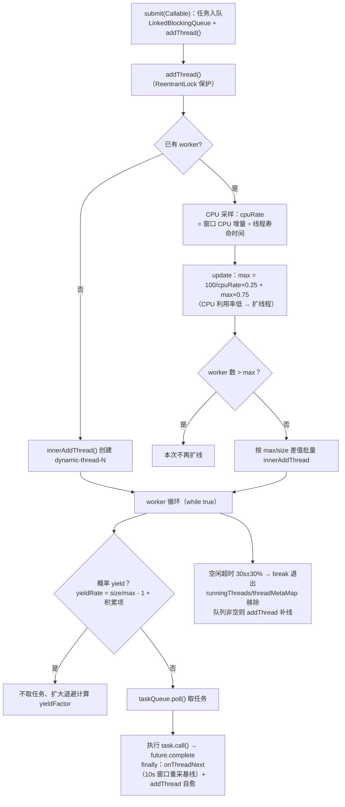

# i2f-thread

> **纯 JDK 并发编程工具箱——并行执行 / 跨线程通信 / 动态线程池 / 任务编排 / 命名线程的一站式基础设施**：全模块 **18 个源文件、1787 行、7 个包**（根包 `i2f.thread` 9 文件 + `i2f.thread.dynamic`/`.dynamic.test`/`i2f.thread.parallelism`/`i2f.thread.sync`/`.sync.test`/`i2f.thread.test`），无 `src/test`、无 `resources`（3 个演示 main 类位于 `src/main` 内），仅依赖 `lombok`（2 处 `@Data`：`LatchRunnable`/`ParallelismLatchRunnable`）与 `i2f-tuple-impl`（`Asyncs` 元组组装、`ProcessTaskRunner` 链路记录），其余全部为 JDK 并发原语。九类能力：①并行执行门面 `Asyncs`（269 行）——`async(Supplier…)` 经共享 `ForkJoinPool`（`NamingForkJoinPool` 命名）并发求值、全部完成后按索引返回 `Map<Integer,Optional<Object>>`，`promise` 提供 1~10 元组重载直接组装 `Tuple1`~`Tuple10`；②跨线程异步等待 `AsyncMessageAwaiter`（231 行）——`async` 取等待器、`then` 设值唤醒、`await` 取走结果，`msgMapping`+`cleanMapping` 双映射配 30 线程 `ScheduledExecutorService` 做 15 分钟超时清理，`NullRef` 哨兵兼容 null，实现 `Closeable`；③异步串行队列 `AsyncQueue`（87 行）——多线程 `submit` 汇聚、消费者线程 `poll`+指数退避（1→300ms）串行消费；④动态线程池 `DynamicThreadPool`（315 行，模块最大类、设计最复杂）——`LinkedBlockingQueue` 任务队列 + **CPU 利用率反馈调节线程数**（每 10 秒采样窗口，`mcnt = 100/cpuRate×0.25 + max×0.75`）、任务等待超 1 秒自动扩线、worker 概率 yield 退避防抢核、空闲 30s±30% 自动退出并自愈补线，目标是「尽量避免因 IO/网络等待造成 CPU 利用率低」（类注释）；⑤PV 操作 DAG 编排 `ProcessTaskRunner`（139 行）——`addTask`/`addLink` 构图，每节点「入度闩 await → 执行 → 出度闩 countDown」；⑥并发窗口调度 `ParallelismDispatcher`（74 行）——按 `parallel` 限制并发数分批提交、30ms 轮询补位、`runCount`/`submitCount`/`parallelism` 统计；⑦ForkJoin 工具族 `ForkJoinUtil`/`ForkJoinAtomicBlocker`/`NamingForkJoinPool`（ManagedBlocker 等待补偿 + 反射命名池）；⑧命名线程工厂 `NamingThreadFactory`（`pool-N-thread-M`、非守护、NORM_PRIORITY）；⑨轻量协作原语 `LatchRunnable`/`AtomicCountDownLatch`/`ArgsRunnable`。
>
> **消费现状（全仓最低消费模块之一）**：真实消费仅 **1 个模块、1 个文件、3 个调用点**——`i2f-extension-cron` 的 `CronExecutor`（:60-62）用 `NamingThreadFactory` 命名 cron 解析/触发/执行三个线程池；POM 有效声明 1 处（i2f-extension-cron/pom.xml:20-23，无声明浪费）；`Asyncs`/`AsyncQueue`/`AsyncMessageAwaiter`/`DynamicThreadPool`/`ProcessTaskRunner`/`ParallelismDispatcher`/`NamingForkJoinPool` 等全部类**模块外零引用**。`i2f-jdk/test-features` 中存在同名包 `i2f.thread` 的实验代码（`DynamicSharedThreadPool`/`ThreadLocalUtil`），系**其自建且不依赖本模块**（test-features 未声明本模块依赖）；`i2f-jdk-all` 聚合（:559-562）、根 POM 版本管理（:799-803）、`i2f-jdk` 模块清单第 153 项。发布产物 `i2f-thread-1.0-jdk8.jar`/`-jdk17.jar` 见 `bash/backup-*`、`bash/deploy-*` 四目录。
>
> ⚠ **主要风险**：`Asyncs.promise` 系**异常即 NPE**——任一 supplier 抛异常被 `LatchRunnable` 静默吞进 `thr` 字段、结果不落 map，`map.get(idx).orElse(null)` 直接 NPE 且掩盖原始异常；`DynamicThreadPool` **无 shutdown/close API**（靠 worker 空闲自退）、`poolName` 为赋值后从未使用的死字段、`Double.doubleToLongBits` 位模式当整数累加的统计 bug、CPU 采样「窗口增量 ÷ 线程寿命」口径混合；`ProcessTaskRunner.call()` **提交即返回空 map**（结果由任务线程异步填充，调用方须自行等待——演示类 sleep 10 秒）、无环检测；`ParallelismDispatcher` 在 `parallel<=0` 时 **30ms 空转死循环**；`AsyncQueue`/`AtomicCountDownLatch` 均为**忙轮询**（`poll`+`sleep` 替代 `take()`；`sleep(1)` 自旋）、相关线程/池非守护且无停止入口；`NamingForkJoinPool` 全反射构造（JDK 私有构造器/常量/静态方法）失败全静默、退回无命名池。详见「模块瑕疵或错误」。

## 模块路径

- `i2f-jdk/i2f-thread`

## 模块依赖

- **`lombok`**：`LatchRunnable.java:12`、`ParallelismLatchRunnable.java:14` 的 `@Data`（生成 getter/setter）——真实使用。
- **`i2f-tuple-impl`**：`Asyncs.java:4-5`（`i2f.type.tuple.Tuples` + `i2f.type.tuple.impl.*` 的 `Tuple1`~`Tuple10`）、`ProcessTaskRunner.java:4`（`Tuple2` 作为链路记录）——真实使用。
- 构建插件：仅 `maven-assembly-plugin`（裸声明，版本由父 POM 统一管理）；产物 `i2f-thread-1.0-jdk8.jar`。
- 版本继承 `i2f-jdk` parent（`1.0-jdk8`）；根 POM 版本管理（pom.xml:799-803）；`i2f-jdk-all` 聚合收录（i2f-jdk-all/pom.xml:559-562）；`i2f-jdk` 模块清单第 153 项（i2f-jdk/pom.xml:153，位于 i2f-text 与 i2f-trace 之间）。
- 无 `src/test`、无 `resources`；18 个源文件（根包 9 + parallelism 4 + dynamic 1 + sync 1 + 演示 3）；发布产物 4 处 jar（`bash/backup-jdk8`、`bash/deploy-jdk8`、`bash/backup-jdk17`、`bash/deploy-jdk17`）。

## 模块设计

1. **类总览与消费热度**：

主源码（15 文件 1549 行）：

| 类 | 行数 | 包 | 职责 | 外部消费 |
| --- | --- | --- | --- | --- |
| `Asyncs` | 269 | `i2f.thread` | 并行求值门面：Supplier 数组并发 → 索引 Map；1~10 元组 `promise` | 零 |
| `AsyncMessageAwaiter` | 231 | `i2f.thread` | 跨线程异步等待：async/then/await + 15 分钟超时清理；`Closeable` | 零 |
| `AsyncQueue` | 87 | `i2f.thread` | 异步串行处理队列：多线程提交汇聚、消费者轮询消费 | 零 |
| `AtomicCountDownLatch` | 48 | `i2f.thread` | 轻量计数闩：begin/finish/count/down + 忙等 await（返回等待毫秒数） | 零 |
| `ArgsRunnable` | 21 | `i2f.thread` | 参数化 Runnable 抽象（构造快照 args → `doRun(Object...)`） | 零 |
| `ForkJoinUtil` | 30 | `i2f.thread` | ForkJoinPool 提交工具（静态默认池，`invoke` 同步） | 零 |
| `LatchRunnable` | 40 | `i2f.thread` | CountDownLatch 协作抽象：异常捕获到 `thr` + `finally countDown` | 零 |
| `NamingForkJoinPool` | 153 | `i2f.thread` | 反射构造带命名线程的 ForkJoinPool（失败静默回退默认池） | 零 |
| `NamingThreadFactory` | 61 | `i2f.thread` | 命名线程工厂（`pool-N-thread-M`、非守护、NORM_PRIORITY） | **cron 1 文件 3 点** |
| `DynamicThreadPool` | 315 | `i2f.thread.dynamic` | CPU 反馈动态线程池：任务队列 + 概率 yield + 空闲回收自愈 | 零 |
| `ProcessTaskRunner` | 139 | `i2f.thread.sync` | PV 操作 DAG 编排：入度 await → 执行 → 出度 countDown | 零 |
| `ParallelismDispatcher` | 74 | `i2f.thread.parallelism` | 并发窗口调度：按 parallel 分批提交 + 30ms 补位轮询 | 零 |
| `ForkJoinAtomicBlocker` | 45 | `i2f.thread.parallelism` | `ForkJoinPool.ManagedBlocker`：把等待转为可补偿阻塞规避线程饥饿 | 零 |
| `ParallelismLatchRunnable` | 26 | `i2f.thread.parallelism` | 并行统计载体（runCount/submitCount/parallelism 三原子计数） | 零 |
| `ParallelismTaskRunner` | 10 | `i2f.thread.parallelism` | 单方法任务接口 `run(E, Object...)` | 零 |

演示类（位于 `src/main`，无 `src/test`，无断言）：

| 类 | 行数 | 包 | 演示内容 |
| --- | --- | --- | --- |
| `TestThread` | 63 | `i2f.thread.test` | AsyncMessageAwaiter 20 组异步等待 + `promise` 组合用法 |
| `TestThreadPool` | 81 | `i2f.thread.dynamic.test` | DynamicThreadPool 5000 任务 × 10 组不同 sleep 压测对比 |
| `PvTest` | 94 | `i2f.thread.sync.test` | ProcessTaskRunner 5 节点 DAG（含菱形依赖）演示 |

2. **DynamicThreadPool 线程数反馈调节流程**（`DynamicThreadPool.java`，:77-313）：



3. **Asyncs 并行求值数据流**（`Asyncs.java`，:23-56）：静态共享池 `NamingForkJoinPool.getPool("async","supplier")`（线程名前缀 `fj-async-N-supplier-`）→ 每个 Supplier 包装为 `LatchRunnable`（异常捕获到 `thr`、`finally countDown`）提交 → 主线程 `latch.await()` 全量等待 → 结果按提交序放入 `ConcurrentHashMap<Integer, Optional<Object>>`；`promise` 重载按索引取值强转并 `Tuples.of` 组装（1~10 元组共 10 个重载）。

4. **包结构**：根包 `i2f.thread`（并行门面 + 通信原语 + 池/工厂工具）→ `.dynamic`（CPU 反馈动态池）→ `.parallelism`（ForkJoin 阻塞补偿 + 并发窗口调度）→ `.sync`（PV 操作 DAG）→ 三个 `.test` 演示包；依赖方向单向、无循环。

## 模块目的

- **补齐 JDK 并发易用性缺口**：JDK 的 `Future`/`ExecutorService` 原生 API 冗长——本模块提供「多供应商并行取结果」（Asyncs）、「跨线程结果等待」（AsyncMessageAwaiter）、「并发窗口限流」（ParallelismDispatcher）等高层封装。
- **动态资源调节实验**：`DynamicThreadPool` 以 CPU 利用率反馈替代固定线程数配置，目标是「避免 IO/网络等待造成的 CPU 低利用率」（针对提交任务执行时间具有相似性的场景）。
- **任务依赖编排**：`ProcessTaskRunner` 以 PV 操作（信号量）实现 DAG 节点间「等待全部入度 → 执行 → 释放全部出度」的拓扑执行。
- **线程可观测性**：`NamingThreadFactory`/`NamingForkJoinPool` 让线程池线程携带业务前缀（`cron-1-dispatcher-pool-N-...`），故障排查时可以从线程名定位来源（cron 扩展的唯一采用点即为此目的）。

## 模块功能

- **并行执行**（`Asyncs`）：`async(Supplier...)`/`async(ExecutorService, Supplier...)` 并行求值 → `Map<Integer,Optional<Object>>`；`promise` 1~10 元组便捷重载；共享池懒加载（静态）。
- **跨线程通信**：`AsyncMessageAwaiter`（async/then/await/timeout/shutdown + PromiseTask 组合）、`AsyncQueue`（handle/submit + 消费者计数）。
- **线程池与工厂**：`DynamicThreadPool`（submit → `Future`；CPU 反馈调线）、`ForkJoinUtil`（RecursiveTask/RecursiveAction → 静态池）、`NamingForkJoinPool`（命名 ForkJoinPool）、`NamingThreadFactory`（命名线程工厂）。
- **任务编排**：`ProcessTaskRunner`（addTask/addLink/addLinkTask → DAG 并行执行）、`ParallelismDispatcher`（集合/迭代器 → 并发窗口分批提交）。
- **协作原语**：`LatchRunnable`（异常-闩模板）、`AtomicCountDownLatch`（可重置计数闩）、`ArgsRunnable`（参数化 Runnable）、`ForkJoinAtomicBlocker`（ManagedBlocker 等待补偿）、`ParallelismLatchRunnable`/`ParallelismTaskRunner`（调度统计/回调接口）。

## 模块主要使用方法

```java
// 1) 并行执行 + 元组结果（Asyncs；共享 ForkJoinPool）
Tuple2<String, Integer> r = Asyncs.promise(() -> "user-1", () -> 42);
// 注意：任一 supplier 抛异常会因结果索引缺失而 NPE（见瑕疵 1）
Map<Integer, Optional<Object>> all = Asyncs.async(() -> a(), () -> b());

// 2) 跨线程异步等待（AsyncMessageAwaiter，实现 Closeable）
try (AsyncMessageAwaiter awaiter = new AsyncMessageAwaiter()) {
    AsyncMessageAwaiter.Awaiter lock = awaiter.async();           // 取等待器
    new Thread(() -> awaiter.then(lock, "result")).start();       // 异步设值唤醒
    String v = awaiter.await(lock);                               // 阻塞取结果（可带超时）
    Integer n = awaiter.promise((m, lk) -> m.then(lk, 3000));     // 组合：先提交再等待
}

// 3) 异步串行队列（AsyncQueue）
AsyncQueue<String, LinkedBlockingQueue<String>> q = AsyncQueue.instance();
q.handle("writer", e -> System.out.println(e)); // 每调用启动一个消费者线程
q.submit("hello");                              // 阻塞入队（消费者轮询领取）

// 4) 动态线程池（DynamicThreadPool；无 shutdown，空闲约 30s 自动回收 worker）
DynamicThreadPool pool = new DynamicThreadPool("compute");
Future<Integer> f = pool.submit(() -> calc());
Integer v = f.get();

// 5) PV/DAG 任务编排（ProcessTaskRunner）
ProcessTaskRunner runner = new ProcessTaskRunner(pool);
runner.addTask("a", () -> "A").addTask("b", () -> "B");
runner.addLink("a", "b");
Map<String, Optional<?>> ret = runner.call(); // 注意：提交即返回空 map，需自行等待（见瑕疵 9）

// 6) 并发窗口调度（ParallelismDispatcher）
ParallelismLatchRunnable task = ParallelismDispatcher.dispatch(
        pool, list, 8, (elem, args) -> handle(elem)); // 并发度 8
pool.submit(task); // 内部按窗口分批提交子任务并统计

// 7) 命名线程（cron 扩展的用法）
ThreadFactory tf = new NamingThreadFactory("cron-1", "executor"); // pool-N-thread-M
ForkJoinPool fj = NamingForkJoinPool.getPool("async", "supplier"); // fj-async-N-supplier-
```

注意事项：

- **`Asyncs.promise` 的异常陷阱**：supplier 抛异常时该索引缺失 → `map.get(idx).orElse(null)` NPE、原始异常丢失（见瑕疵 1）——对可能失败的任务不要依赖本门面收集异常。
- **无关闭语义**：`DynamicThreadPool` 无 shutdown/close（worker 空闲 30s±30% 自退）；`AsyncMessageAwaiter` 有 `close/shutdown` 但非守护线程池必须显式调用；`AsyncQueue`/`AtomicCountDownLatch` 的等待/消费线程无停止入口。
- **`ProcessTaskRunner` 是异步返回**：`call()` 仅提交任务即返回空 map 引用（任务线程继续填充），须自行等待（演示中 sleep 10 秒），不可直接当同步执行器用。
- **忙轮询语义**：`AsyncQueue` 用 `poll`+指数退避（延迟最高 300ms）而非 `take`；`AtomicCountDownLatch.await` 为 `sleep(1)` 自旋——高实时性场景注意延迟与空转开销。
- **`ParallelismDispatcher` 并发度必须 > 0**：`parallel<=0` 会 30ms 空转死循环（见瑕疵 10）。
- **`NamingForkJoinPool` 依赖 JDK 内部结构**：私有构造器/`FIFO_QUEUE` 等常量反射失败时静默退回无命名池（无提示），跨 JDK 版本升级需关注线程名是否生效。

## 模块特性总结

1. **零框架纯 JDK 并发工具箱**：1787 行仅倚赖 lombok（2 处 `@Data`）与 `i2f-tuple-impl`（元组），全部能力基于 JDK 标准并发原语（CountDownLatch/ReentrantLock/AtomicXxx/ForkJoinPool/ManagedBlocker 等）自建。
2. **能力域覆盖面广**：并行执行、跨线程通信、动态池、ForkJoin 补偿、DAG 编排、并发窗口、命名线程、协作原语——「一个模块覆盖并发编程常用场景」。
3. **动态自适应是设计核心**：`DynamicThreadPool` 以 CPU 利用率反馈 + 概率 yield 退避 + 空闲回收自愈替代固定配置，是全模块最复杂（315 行）也最具实验性质的类（类注释即注明适用「任务执行时间相似性」场景）。
4. **命名线程贯穿**：`NamingThreadFactory`（`pool-N-thread-M`）、`NamingForkJoinPool`（`fj-group-id-name-`）、`DynamicThreadPool`（`dynamic-thread-N`）——统一的线程命名约定便于线上排查。
5. **元组集成**：`Asyncs.promise` 1~10 元组直接输出 `Tuple1`~`Tuple10`，免手工解包；`ProcessTaskRunner` 用 `Tuple2` 记录 DAG 边。
6. **消费极低、实验色彩明显**：全仓唯一真实消费是 `i2f-extension-cron` 的 `NamingThreadFactory`（3 点）；主力类（Asyncs/AsyncQueue/DynamicThreadPool/ProcessTaskRunner）模块外零引用，3 个演示 main 类承担「事实上的验收测试」——典型的「先写工具后落地消费」模块。
7. **缺陷集中在并发边界**：无界等待、忙轮询、无关闭语义、统计逻辑 bug、异步返回语义误导——均为无自动化测试掩盖的确定性缺陷（详见下节）。

## 模块瑕疵或错误

1. **`Asyncs.promise` 系「异常即 NPE」并掩盖原始异常**：Asyncs.java:42-45、60、69-70 等——supplier 抛出的异常被 `LatchRunnable.run` 捕获进 `thr` 字段（:29-30）且不放入结果 map；`promise` 随后执行 `map.get(retIdx).orElse(null)` 时因索引缺失抛 NPE——**原始异常完全丢失**，10 个 promise 重载（1~10 元组）全部受影响。修复方向：promise 内判 `map.get(idx)==null` 时抛含 `thr` 的异常或返回空元组。
2. **`DynamicThreadPool` 无 shutdown/close API**：DynamicThreadPool.java 全文——池无任何关闭方法，worker 仅在「连续空闲超过 30s±30%」后自行退出（:274-294）；线程未设 daemon（继承创建者），任务持续提交时无统一停机手段；`poolName` 字段（:48-59）构造后**从未使用**（worker 命名固定 `dynamic-thread-N`、日志亦不含池名）——死字段。
3. **`DynamicThreadPool` 统计位模式 bug**：DynamicThreadPool.java:113——`diffSum.addAndGet(Double.doubleToLongBits(diffRate))` 把 double 的 IEEE 754 位模式当整数累加，后续 `Double.longBitsToDouble(diffSum.get())` 得到的 avgRate 为无意义数值；且 `update` 直接 `System.out.println` 输出统计（:117-123，无日志框架、生产环境刷屏）；`avgWaitTs` 计算在 `processCount` 为 0 时除零（NaN 打印）。
4. **`DynamicThreadPool` CPU 采样口径混合**：DynamicThreadPool.java:146-154——`cpuTime = threadCpuTime - offsetCpuNanoSeconds`（自上次 10 秒窗口采样以来**增量**）÷ `totalTime = now - initNanoSeconds`（线程**全生命周期**）——分子为窗口量、分母为全量，比值随线程寿命增长被持续稀释，反馈公式 `mcnt = 100/avgCpuRate×0.25 + max×0.75`（:164-168）据此调线可能失真（过度扩张）。
5. **`AsyncMessageAwaiter` 清理任务竞态 + 非守护 30 线程池**：AsyncMessageAwaiter.java:132-147——`put` 先 `schedule` 新清理任务、再取消旧任务：若旧任务已到期开始执行（`cancel` 无效），其回调 `msgMapping.remove(lock)` 可能在重 put 之后执行而**误删刚写入的新值**（无同步保护窗口）；`cleanPool = Executors.newScheduledThreadPool(30)`（:29）非守护、默认线程工厂，忘记 `close/shutdown` 将阻止 JVM 退出；`await` 超时与「值就是 null」不可区分（:214-230 统一返回 null）。
6. **`AsyncQueue` 用 `poll` 忙轮询替代 `take`**：AsyncQueue.java:51-76——消费者线程 `while(true)` 内 `queue.poll()` + 空转指数退避（`sleepTs` 1→300ms）而非阻塞式 `take()`——BlockingQueue 的阻塞能力被弃用、空闲时唤醒延迟最高 300ms；消费者线程无终止条件、非守护；`submit` 用 `LinkedBlockingQueue` 默认**无界**（:32-33）——生产速率高于消费时无限堆积（OOM 风险转嫁调用方）。
7. **`AtomicCountDownLatch` 忙等自旋**：AtomicCountDownLatch.java:35-47——`await` 为 `sleep(1)` 轮询（+ 两个原子读），无超时版本；`finish` 永不被调用时死循环；`down()` 无下界保护（可减为负）；`begin()` 重置与并发使用不安全（无 happens-before 保证）。
8. **`NamingForkJoinPool` 全反射静默降级**：NamingForkJoinPool.java:54-75——依赖 JDK 私有 5 参构造器（:58-63，未匹配到则 `ins` 为 null 时 `setAccessible` NPE 被吞）、反射读取 `FIFO_QUEUE`/`LIFO_QUEUE`/`MAX_CAP`（:78-115）与 `checkParallelism`/`checkFactory`/`nextPoolId`（:117-152）；所有 catch 块为空——**任何一步失败都静默退回无命名默认池**（线程名丢失、`nextPoolId` 返回 1 导致池名重复），JDK 升级（模块化限制反射）后行为变化无任何提示；全部 `getPool` 带 `static synchronized`（:15-53）串行化。
9. **`ProcessTaskRunner.call()` 提交即返回空 map**：ProcessTaskRunner.java:75-138——`call()` 向线程池提交全部节点 Runnable 后**立即返回 `retMap` 引用**（任务线程异步填充，:131），调用方（如 PvTest:44-46）必须自行 sleep 等待——与 `Callable` 契约（返回即完成）严重错位；无 DAG 环检测（成环则节点永久 `await` 死锁）；节点异常仅 `printStackTrace` 并落 `Optional.empty()`（:121-123、:131）——异常静默；入度 `await` 被中断后仅打印并继续执行（:110-114）。
10. **`ParallelismDispatcher` 在 `parallel<=0` 时空转死循环**：ParallelismDispatcher.java:33-64——`while(true)` 中 `curr < parallel` 在 parallel≤0 时恒假（任务永不提交）、`iterator.hasNext()` 恒真（迭代器不消耗无法 break）→ 30ms `Thread.sleep` 无限空转；并发窗口维护本身亦为 30ms 轮询（无信号唤醒）；`parallelism` 计数在 `pool.submit` **之前**自增（:37 与 :40），提交失败（拒绝策略）时并发度永久虚占。
11. **零测试、演示类占用 `src/main`**：无 `src/test` 目录；`TestThread`/`TestThreadPool`/`PvTest` 三个 main 演示类位于源码树内且无断言——DynamicThreadPool 的调线算法、ProcessTaskRunner 的 PV 编排、AsyncMessageAwaiter 的清理机制（瑕疵 5）等并发核心逻辑**零自动化验证**（`Asyncs` 的 NPE 缺陷 1 有该测试即可暴露出）。
12. **错误处理风格不统一 + `ForkJoinAtomicBlocker` 忙等命名**：全模块 `printStackTrace` 5 处（DynamicThreadPool:268/298、AsyncQueue:68、ProcessTaskRunner:113/122）、`System.err.println` 2 处（AsyncQueue:67/82）、`NamingForkJoinPool` 全静默 catch——三种风格并存且无日志框架集成（模块零日志依赖的定位使然，但异常语义无约定）；`ForkJoinAtomicBlocker.fork()`（:14-18）命名与语义相反（该调用**阻塞**直至 `done()`）、`block()` 以 `sleep(0)` 忙等最多 100 次迭代（:29-39）；`LatchRunnable` 的 `@Data` 暴露 `setLatch`（外部可篡改协作闩），`Asyncs` 共享池（:21）永不关闭。

## 消费现状与验证

- **Java 层消费**（检索 `import i2f.thread.` 与 `i2f.thread.` 全限定引用、PowerShell 全仓双重复核并逐一排除同名包误报）：**1 个模块、1 个文件、3 个调用点**。

| 消费方 | 文件（行号） | 调用规模 | 场景 |
| --- | --- | --- | --- |
| i2f-extension/i2f-extension-cron | `CronExecutor.java`（:5 import、:60-62 使用） | 3 处 `new NamingThreadFactory(...)` | 为 cron 解析池/触发池/执行池命名 `cron-N-dispatcher/trigger/executor-pool-M-...` |

- **消费热度**：`NamingThreadFactory` 2 个构造器中的 `(String, String)` 重载被使用（3 次）；`Asyncs`/`AsyncQueue`/`AsyncMessageAwaiter`/`AtomicCountDownLatch`/`ArgsRunnable`/`ForkJoinUtil`/`NamingForkJoinPool`/`DynamicThreadPool`/`ProcessTaskRunner`/`ParallelismDispatcher`/`ForkJoinAtomicBlocker`/`ParallelismLatchRunnable`/`ParallelismTaskRunner`/`LatchRunnable` 等**模块外零引用**；模块自身的引用集中在演示类与内部协作（`Asyncs`→`NamingForkJoinPool`/`LatchRunnable`、`ParallelismDispatcher`→`LatchRunnable`/`ParallelismLatchRunnable`、`ParallelismLatchRunnable`→`LatchRunnable`）。
- **POM 级消费**：有效声明 **1 处**——`i2f-extension-cron/pom.xml:20-23`（真实使用、无声明浪费）；`i2f-jdk-all` 聚合（:559-562）；根 POM 版本管理（:799-803）；`i2f-jdk` 模块清单（:153）。
- **同名包误报核实**：`i2f-jdk/test-features` 的 `i2f.thread.DynamicSharedThreadPool`（397+ 行，引用其自建 `i2f.thread.local.ThreadLocalUtil`）与 `i2f.thread.test.TestThreadPool` 均属 **test-features 模块内部实验代码**（同模块内互相引用），test-features 的 pom **未声明** i2f-thread 依赖——与本模块无任何引用关系（该实验池是另一套动态共享线程池设计）。
- **非 Java 侧**：全仓 `*.xml`/`*.properties`/`*.factories`/`*.yml` 无本模块类名引用（无 SPI 注册、无自动装配）；`bash/backup-jdk8`、`bash/deploy-jdk8`、`bash/backup-jdk17`、`bash/deploy-jdk17` 四目录含编译产物 `i2f-thread-1.0-jdk8.jar`/`i2f-thread-1.0-jdk17.jar`。
- **平行模块参考**：与同目录 `i2f-trace`（调用栈定位）、`i2f-trace-mdc`（MDC 传播，其中 `MdcThreadFactory` 与本模块 `NamingThreadFactory` 功能类似但为独立零依赖实现）**双向零依赖**——本模块是纯并发工具箱，不参与日志链路。
