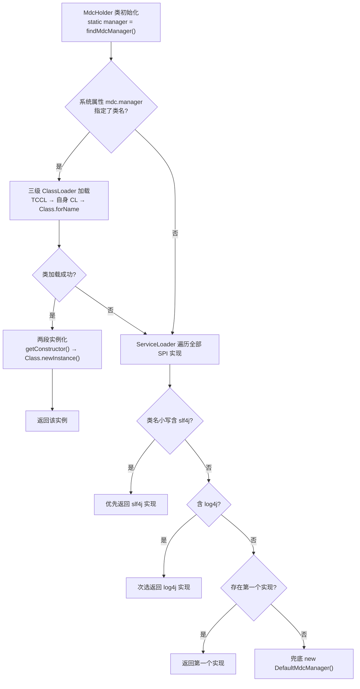

# i2f-trace-mdc

> **MDC（Mapped Diagnostic Context）上下文容器与跨线程传播基础设施——日志链路 traceId 的统一存取门面**：全模块 **11 个源文件、739 行、4 个包**（`i2f.trace.mdc`、`i2f.trace.mdc.manager`、`i2f.trace.mdc.manager.impl`、`i2f.trace.mdc.thread`），零测试零资源、**零依赖**（pom.xml 无任何 `<dependencies>`，纯 JDK `ThreadLocal` + 并发包实现）。静态门面 `MdcHolder`（119 行）以三级策略选定存储实现——「系统属性 `mdc.manager` 指定全类名 → `ServiceLoader` SPI 发现（类名含 slf4j 优先、其次 log4j、再取第一个）→ 内置 `DefaultMdcManager`」；`MdcManager` 接口定义 `put`/`get`/`remove`/`clear`/`copyOf`/`replaceAs` 六操作；`DefaultMdcManager`（101 行）以 `InheritableThreadLocal<Map<String,String>>` + 静态 `ReentrantReadWriteLock` 实现；`MdcTraces`（47 行）定义 5 个标准键（`traceId`/`traceSource`/`traceUrl`/`traceIp`/`traceApp`）、2 组 × 6 个 HTTP Header 命名变体与 32 位 hex traceId 生成（UUID 去横线）；`thread` 包（7 文件 450 行）提供完整线程传播包装族——`MdcRunnable`/`MdcCallable`（构造时捕获上下文快照、执行时注入、`finally` 清理，`ofNewTrace` 生成新链路）与 `MdcThread`/`MdcThreadFactory`/`MdcExecutor`/`MdcExecutorService`/`MdcScheduledExecutorService` 装饰器（周期任务自动 `ofNewTrace`，普通任务幂等包装）。
>
> **消费围绕日志链路（4 模块 13 文件 71 行调用点 / 123 次符号引用 + 1 个 SPI 实现）**：`i2f-extension-slf4j` 提供 `Slf4jMdcManager`（写穿 `org.slf4j.MDC`）并经 `META-INF/services/i2f.trace.mdc.manager.MdcManager` 注册——**引入该扩展即自动接管存储实现**；`i2f-springboot-trace-mdc-starter`（9 文件 67 行调用点）以 Servlet Filter/Gateway Filter/Feign/HttpClient/AOP/定时任务等入口完成「入链注入 + 出链清理 + 请求头透传」，并依赖 slf4j 扩展把 SPI 实现拉入 classpath；`i2f-log-std` 的 `LogUtil` 构造日志数据时写入 traceId（1 处）；`i2f-extension-slf4j-log` 测试类消费但 **POM 未声明**（经 i2f-log → i2f-log-std 传递）。POM 有效声明 3 处（i2f-log-std、i2f-extension-slf4j、springboot-trace-mdc-starter，均被真实使用、无声明浪费）；`i2f-jdk-all` 聚合（:567-570）、根 POM 版本管理（:809-813）。同目录同族命名的 `i2f-trace` 是**平行模块**（调用栈定位），双向零依赖。
>
> ⚠ **主要风险**：`DefaultMdcManager.LOCAL` 为**原生 `InheritableThreadLocal`（未覆写 `childValue`）**——JDK 默认 childValue 直接返回父值引用，创建子线程/池线程时若父线程已有数据则二者**共享同一 `HashMap`**，子线程写入会反向污染父线程上下文（`MdcThread` + `ofNewTrace` 组合会把父线程 traceId 改写成子线程新 ID）；`MdcRunnable`/`MdcCallable` 的 `finally` **无条件全量 `clear()`**（Slf4jMdcManager 下即 `MDC.clear()` 清光所有键，嵌套执行会破坏外层上下文）；`ofNewTrace`/`of(…, true)` 对已包装实例**二次包装**，内层旧 traceId 覆盖外层新生成值使 `newTrace` 失效；`MdcHolder` 加载失败**全静默**（`mdc.manager` 配错无提示、SPI 坏 provider 抛 `ServiceConfigurationError` 直接中断类初始化）；`MdcManager` 接口零 Javadoc，两实现 null 契约不一致（`copyOf()` 空数据返回空 map vs null）。详见「模块瑕疵或错误」。

## 模块路径

- `i2f-jdk/i2f-trace-mdc`

## 模块依赖

- **无任何依赖**：pom.xml 无 `<dependencies>` 段（连 lombok、i2f 内部依赖都未引入；源码仅 import `java.util.*`、`java.util.concurrent.*`、`java.util.function.Supplier`、`java.lang.reflect.Constructor`）。
- 构建插件：仅 `maven-assembly-plugin`（裸声明，版本由父 POM `i2f-jdk` → `i2f-turbo-java` 统一管理）；产物 `i2f-trace-mdc-1.0-jdk8.jar`。
- 版本继承 `i2f-jdk` parent（`1.0-jdk8`）；根 POM 版本管理（pom.xml:809-813）；`i2f-jdk-all` 聚合收录（i2f-jdk-all/pom.xml:567-570）；`i2f-jdk` 模块清单第 155 项（i2f-jdk/pom.xml:155，紧邻 i2f-trace 之后）。
- **与 `i2f-trace` 是平行模块**：命名同族（trace）但互不依赖——本模块 pom 零依赖，i2f-trace 亦无本模块引用；职责区分——i2f-trace 负责「调用栈位置定位」，本模块负责「traceId 等上下文存取与跨线程传递」。
- 无 `src/test`、无 `resources`；11 个源文件（门面 1 + 接口 1 + 实现 1 + 常量工具 1 + 线程族 7）。

## 模块设计

1. **类总览与消费热度**：

| 类 | 行数 | 包 | 职责 | 外部消费 |
| --- | --- | --- | --- | --- |
| `MdcHolder` | 119 | `i2f.trace.mdc` | 静态门面：manager 三级选择 + 六操作静态代理 | 12 文件引用 |
| `MdcTraces` | 47 | `i2f.trace.mdc` | 5 标准键 + 2 组 Header 变体 + traceId 生成/复用 | 12 文件引用 |
| `MdcManager` | 22 | `i2f.trace.mdc.manager` | 存储接口六操作（零 Javadoc） | SPI 被实现 1 次 |
| `DefaultMdcManager` | 101 | `i2f.trace.mdc.manager.impl` | InheritableThreadLocal + 读写锁的默认实现 | SPI/属性兜底 |

线程传播包装族（`i2f.trace.mdc.thread`，7 文件 450 行）：

| 包装器 | 行数 | 机制与语义 |
| --- | --- | --- |
| `MdcRunnable` | 70 | 构造时捕获 `traceId`/`traceSource` 快照；`run` 时 `put`、`finally clear`；`ofNewTrace` 新链路（traceSource 置 null） |
| `MdcCallable` | 71 | 与 `MdcRunnable` 对称（`call` 返回值直通） |
| `MdcThread` | 40 | 8 个构造器，凡带 target 者经 `MdcRunnable.of` 包装 |
| `MdcThreadFactory` | 30 | 装饰 `ThreadFactory`：`newThread` 时包装 Runnable；`of` 幂等 |
| `MdcExecutor` | 31 | 装饰 `Executor`：`execute` 包装；`of` 幂等 |
| `MdcExecutorService` | 94 | 装饰 `ExecutorService`：13 方法全委托（submit×3/invokeAll×2/invokeAny×2） |
| `MdcScheduledExecutorService` | 114 | 装饰 `ScheduledExecutorService`：`schedule` 继承链路；`scheduleAtFixedRate`/`scheduleWithFixedDelay` 用 `ofNewTrace`（每次执行新 traceId） |

2. **manager 三级选择流程**（`MdcHolder.findMdcManager`，:19-90）：



所有失败路径均静默（catch Throwable 空块），最终必有返回——「配置错误降级不报错」（见瑕疵 5/6）。

3. **标准键与 Header 变体**（`MdcTraces`，:12-34）：5 个标准键 `traceId`/`traceSource`/`traceUrl`/`traceIp`/`traceApp`；两组各 6 个 Header 别名（`TRACE_ID_HEADERS`：`traceId`、`X-Trace-Id`、`Trace-Id`、`X-Request-Id`、`Request-Id`、`RequestId`；`TRACE_SOURCE_HEADERS` 同构）——用于跨服务透传时兼容不同网关/客户端命名；`genTraceId()` 为 UUID 去横线（32 位 hex），`getOrGenTraceId(Supplier)` 提供「取不到就生成」惯例。

4. **SPI 接管闭环（关键跨模块契约）**：`i2f-extension-slf4j` 的 `Slf4jMdcManager`（委托 `org.slf4j.MDC` 六操作）经 `META-INF/services/i2f.trace.mdc.manager.MdcManager` 注册；`MdcHolder` 的 SPI 选择规则「类名小写含 `slf4j` 优先」（:71-74）与之精确呼应——**日志应用引入 slf4j 扩展后，MDC 自动写穿 SLF4J**（与日志框架 `%X{traceId}` 占位符打通）；`i2f-springboot-trace-mdc-starter` 依赖该扩展（其 pom:38-41）即自动拉起此链路。

5. **包结构**：`i2f.trace.mdc`（门面 + 常量）→ `.manager`/`.manager.impl`（接口 + 默认实现）→ `.thread`（7 个包装器）；依赖方向单向（thread → 门面 → 接口 ← 实现），无反向依赖、无缓存无状态（除 `DefaultMdcManager` 的静态 ThreadLocal/锁）。

## 模块目的

- **无侵入链路标识**：应用只需在入口 `put` 一次 traceId，日志体系即可在任意位置读取并落盘（`LogUtil` 已集成）——是「一次请求一条链路、全链路日志可串联」的底层容器。
- **可插拔存储**：以 `MdcManager` SPI 抽象「上下文存在哪」——写穿 SLF4J MDC（借用日志框架自带的 MDC 容器与占位符）或使用内置 ThreadLocal 实现，应用代码不变。
- **跨线程上下文传递**：解决 `ThreadLocal` 不随线程池/新线程传播的通用难题——提供 Runnable/Callable/Thread/ThreadFactory/Executor/ExecutorService/ScheduledExecutorService 全链条包装。
- **链路治理约定**：`ofNewTrace`（新链路，如周期任务）与默认继承（同链路，如线程池子任务）两种语义分离；`MdcTraces` 常量统一跨服务透传协议。

## 模块功能

- **门面与存储**：`MdcHolder`（put/get/remove/clear/copyOf/replaceAs 六操作静态代理 + manager 三级选择）、`MdcManager` 接口、`DefaultMdcManager`（InheritableThreadLocal + 静态读写锁；`copyOf` 防御性拷贝、`replaceAs` 全量替换）。
- **常量与工具**（`MdcTraces`）：5 标准键、2 组 × 6 Header 别名、`genTraceId`（32 位 hex）、`getOrGenTraceId`。
- **线程传播族**（`thread` 包）：7 类装饰器/包装器（见上表），`of()` 幂等（已是包装类型则原样返回）、`ofNewTrace` 强制新建链路。
- **SPI 扩展点**：`ServiceLoader` 发现 + 系统属性指定 + 内置兜底三级选择。

## 模块主要使用方法

```java
// 1) 最简：手工注入与清理（i2f-log-std 测试的演示方式）
MdcHolder.put(MdcTraces.TRACE_ID, MdcTraces.genTraceId());
try {
    logger.info("..."); // LogUtil 会读取 traceId 写入日志数据（LogUtil.java:98）
} finally {
    MdcHolder.remove(MdcTraces.TRACE_ID);
}

// 2) 取不到就生成（请求头透传惯例）
String traceId = MdcTraces.getOrGenTraceId(() -> request.getHeader(MdcTraces.TRACE_ID));

// 3) 线程池传播：包装任务（构造时捕获提交线程的上下文快照）
ExecutorService pool = MdcExecutorService.of(Executors.newFixedThreadPool(4));
pool.submit(MdcRunnable.of(() -> { ... }));        // 继承提交时链路
pool.submit(MdcCallable.of(() -> { ...; return v; }));
// 周期任务自动新链路：scheduleAtFixedRate / scheduleWithFixedDelay 内部 ofNewTrace

// 4) 线程与线程工厂装饰
Thread t = new MdcThread(() -> { ... }, "worker");
new ThreadPoolExecutor(1, 1, 0L, TimeUnit.SECONDS, queue, MdcThreadFactory.of(threadFactory));

// 5) 自定义存储实现（二选一）
// -Dmdc.manager=com.example.MyMdcManager        // 系统属性指定全类名
// META-INF/services/i2f.trace.mdc.manager.MdcManager  // SPI 注册（slf4j/log4j 类名优先）
```

注意事项：

- **父子线程共享陷阱**：`DefaultMdcManager` 用原生 `InheritableThreadLocal`（未覆写 `childValue`）——父线程已有数据时新建子线程与父线程共享同一 map，子线程写入（尤其 `ofNewTrace` 新 ID）会反向污染父线程，详见瑕疵 2。
- **清理是全量 clear**：`MdcRunnable`/`MdcCallable` 结束 `clear()` 会清空全部键（slf4j 实现下连带用户其他 MDC 键）；嵌套执行/混用其他 MDC 键的应用需自行恢复快照。
- **避免对已包装实例再 `ofNewTrace`**：会二次包装且 `newTrace` 失效（内层旧 traceId 覆盖外层新值），详见瑕疵 4。
- **manager 一次性定型**：`static final` 于类初始化时选定，运行时无法切换；`mdc.manager` 配错会静默降级（无日志），排查困难。
- **与 SLF4J 集成**：引入 `i2f-extension-slf4j` 后自动切换 `Slf4jMdcManager`，日志配置用 `%X{traceId}`/`%X{traceSource}` 输出；不引扩展则用内置 ThreadLocal（日志数据通过 `LogUtil` 落盘）。
- **Reactive 场景有限**：上下文载体是 ThreadLocal，Reactor 切换线程时依赖各切面自行处理（starter 的 Gateway Filter 在 Netty 线程内 put/清理）。

## 模块特性总结

1. **零依赖零测试**：739 行纯 JDK（ThreadLocal + 并发包）实现，可整包复制进任意项目；无 `src/test`，现有演示分散在 i2f-log-std 与 i2f-extension-slf4j-log 的 test 中。
2. **门面 + SPI 双通道**：`MdcHolder` 六操作静态门面稳定；实现可插拔且三级优先（属性指定 > SPI slf4j > log4j > 第一个 > 内置默认），配置错误静默降级。
3. **日志体系闭环**：SPI 注册 `Slf4jMdcManager` → 自动写穿 SLF4J MDC；starter 的 WebFilter 入链、`MdcRunnable` 跨线程传播、`LogUtil` 落盘（traceId 进日志数据）——从入口到落盘全链条打通。
4. **线程传播族完备**：7 个包装器覆盖 Runnable/Callable/Thread/ThreadFactory/Executor/ExecutorService/ScheduledExecutorService；`of()` 幂等防重复包装、周期任务自动 `ofNewTrace` 新链路——语义设计清晰。
5. **消费高度集中于 starter**：13 文件中 9 个、71 行调用点中 67 行位于 `i2f-springboot-trace-mdc-starter`（WebFilter 17、GatewayFilter 12 最多）；starter 依赖 slf4j 扩展即自动拉起 SPI 实现——**引入 starter = 网关/服务/任务全场景自动链路**。
6. **透传协议先行**：5 标准键 + 2 组 × 6 Header 别名，兼容 `X-Trace-Id`/`Request-Id` 等外部约定；`traceSource` 约定语义（appName / `@Aop,类.方法` / `@Scheduled,类.方法` / `@XxlJob,名称` / `@PowerJobHandler,名称`）。
7. **缺陷集中在并发边界**：父子线程共享 map、全量 clear、`ofNewTrace` 双重包装、静默降级四大风险（详见下节）——均为无自动化测试掩盖的确定性缺陷。

## 模块瑕疵或错误

1. **InheritableThreadLocal 未覆写 childValue：父子线程共享同一 map 引用**：DefaultMdcManager.java:16——`new InheritableThreadLocal<>()` 使用 JDK 默认 `childValue`（直接返回父值引用），创建子线程/池线程时若父线程已有数据，二者共享同一 `HashMap`；子线程 `put`/`remove` 原地修改共享 map → **反向污染父线程上下文**（如父线程 `new MdcThread(MdcRunnable.ofNewTrace(r))`，子线程生成的新 traceId 写进共享 map，父线程后续日志用上子线程的 ID）。修复方向：覆写 `childValue` 返回 `new HashMap<>(parent)` 副本，或包装器清理时恢复快照。
2. **`clear()` 用 `LOCAL.set(null)` 而非 `LOCAL.remove()`**：DefaultMdcManager.java:62-73——语义正确（后续 get 返回 null、新线程继承 null），但 ThreadLocalMap 的 Entry 不释放，池化长寿命线程中残留 null 值 Entry；属最佳实践偏差。
3. **`MdcRunnable`/`MdcCallable` finally 无条件全量 `clear()`**：MdcRunnable.java:65-68、MdcCallable.java:66-69——Slf4jMdcManager 下即 `MDC.clear()` **清空全部键**（连带清除用户/其他框架写入的非本模块键）；嵌套执行（外层任务上下文）会被内层清理破坏；与 `MdcWebFilter` 精确 `remove` 5 键的风格不一致（MdcWebFilter.java:99-103）。应先快照、清理后按需恢复。
4. **`ofNewTrace`/`of(…, true)` 对已包装实例二次包装**：MdcRunnable.java:38-49、MdcCallable.java:39-50——`newTrace=false` 分支有 `instanceof` 幂等短路，`true` 分支没有；传入已是 `MdcRunnable` 的实例时内层 `run` 用**构造时捕获的旧 traceId** 覆盖外层新生成值，`newTrace` 失效（用户任务实际运行在旧链路下）。
5. **`MdcHolder` 加载失败全静默**：MdcHolder.java:19-90——系统属性 `mdc.manager` 指定的类加载失败（三级 ClassLoader 均找不到）或实例化失败（无无参构造等）时，所有 catch 块为空，无任何日志提示即降级 SPI/默认实现；且 manager 为 `static final` 一次性定型，无运行时替换 API（测试注入 mock 困难）。
6. **ServiceLoader 迭代无异常保护**：MdcHolder.java:66-78——任一坏 SPI provider 实例化失败会抛 `ServiceConfigurationError`（Error 子类，不经 catch 块），直接中断 `findMdcManager` → `MdcHolder` 类初始化失败（`ExceptionInInitializerError` 级联 NoClassDefFoundError）；与同方法内 catch Throwable 的防御风格矛盾。
7. **`MdcManager` 接口零 Javadoc、null 契约不一致**：MdcManager.java:10-22——`copyOf()` 无数据时 `DefaultMdcManager` 返回空 map（:81）而 `Slf4jMdcManager` 返回 null（`MDC.getCopyOfContextMap()` 契约，Slf4jMdcManager.java:36-38）；`replaceAs(null)` 前者直接忽略（:91-93）后者透传 `MDC.setContextMap(null)`（:41-43）；消费方 `MdcTaskDecorator` 被迫写 `if (contextMap != null)` 兼容（MdcTaskDecorator.java:29）。
8. **`MdcTraces.getOrGenTraceId(Supplier)` 未判空/未 trim**：MdcTraces.java:40-46——supplier 为 null 时 NPE；空串判定 `isEmpty()` 未 trim，「 」被视为有效 traceId。
9. **`put` 不校验 null 值**：MdcRunnable.java:61-62——构造时捕获不到 `traceSource`（上下文为空）时照样 `put(TRACE_SOURCE, null)`；DefaultMdcManager 存入 null 值，Slf4jMdcManager 交由 SLF4J 绑定处理（各绑定对 null 容忍度不同，两实现行为不一致）。
10. **零测试**：模块无 `src/test`；现有演示仅在 i2f-log-std 的 `TestLogger`（:18）与 i2f-extension-slf4j-log 的 `TestSlf4jLogAdapter`（:23、:28）中附带且无断言——加载策略、线程传播、父子继承语义（瑕疵 1/3/4）没有任何自动化验证。
11. **装饰器无 unwrap 通道**：MdcThreadFactory.java:12、MdcExecutor.java:12、MdcExecutorService.java:15、MdcScheduledExecutorService.java:15——`delegate` 为 protected 无 getter，包装后无法取回原对象（接入既有框架时失去对底层池的直接控制）；四处 `of()` 幂等模板重复实现。
12. **`mdc.manager` 属性名过短易冲突**：MdcHolder.java:17——通用命名空间短键名可能与环境其他配置撞名；与瑕疵 5 的静默降级叠加时难以排查。

## 消费现状与验证

- **Java 层消费**（检索 `import i2f.trace.mdc.` 与 `MdcHolder.`/`MdcTraces.` 全仓双重复核，排除自身）：**4 个模块、13 个文件、71 行调用点（123 次符号引用）**；另有 1 个 SPI 实现（`Slf4jMdcManager`）+ 1 个 SPI 注册文件。

| 消费方 | 文件（行号） | 调用规模 | 场景 |
| --- | --- | --- | --- |
| i2f-springboot/…-trace-mdc-starter | `springmvc/MdcWebFilter.java`（:46-104） | 17 行 | Servlet 入口：取/生成 traceId 与 traceSource、put 5 键 + request attribute、finally remove 5 键 |
| 同上 | `gateway/MdcGatewayFilter.java`（:48-87） | 12 行 | Gateway（Reactive）：入链 5 键 + 请求头透传改写 + `then` 清理 |
| 同上 | `feign/MdcFeignInterceptor.java`（:36-48） | 7 行 | OpenFeign：透传 traceId/traceSource 请求头 |
| 同上 | `httpclient/MdcHttpClientInterceptor.java`（:42-54） | 7 行 | RestTemplate 拦截器：写请求头 |
| 同上 | `aspect/aop/MdcAnnotationAspect.java`（:45-58） | 6 行 | `@MdcTrace` 注解：生成/复用链路、退出 remove |
| 同上 | `xxljob/MdcXxlJobAspect.java`（:43-54） | 5 行 | XxlJob 入口：新 traceId + `@XxlJob,名称` 来源 |
| 同上 | `powerjob/MdcPowerJobAspect.java`（:41-52） | 5 行 | PowerJob 入口：同模式 |
| 同上 | `scheduling/MdcSpringSchedulingAspect.java`（:42-53） | 5 行 | `@Scheduled` 定时任务：每次执行新 traceId |
| 同上 | `executor/MdcTaskDecorator.java`（:25-35） | 3 行 | ThreadPoolTaskExecutor：`copyOf` 快照 → `replaceAs` → `clear` |
| i2f-extension/i2f-extension-slf4j | `Slf4jMdcManager.java`（:13-44） | SPI 实现 | `implements MdcManager` 写穿 `org.slf4j.MDC`；注册于 `META-INF/services/i2f.trace.mdc.manager.MdcManager` |
| i2f-jdk/i2f-log-std | `util/LogUtil.java`（:98） | 1 行 | 构造日志数据时 `setTraceId(MdcHolder.get(TRACE_ID))` |
| i2f-jdk/i2f-log-std（test） | `test/TestLogger.java`（:18） | 1 行 | 演示：put traceId 观察日志携带 |
| i2f-extension/i2f-extension-slf4j-log（test） | `test/TestSlf4jLogAdapter.java`（:23、:28） | 2 行 | 演示：put/remove traceId（**POM 未声明，经 i2f-log → i2f-log-std 传递**） |

- **方法热度**：`MdcHolder.put` 26 次、`remove` 16、`get` 6、`copyOf`/`clear`/`replaceAs` 各 1；`MdcTraces.TRACE_ID` 25 次、`TRACE_SOURCE` 20、`TRACE_APP`/`genTraceId`/`getOrGenTraceId` 各 5、`TRACE_URL`/`TRACE_IP`/两组 header 各 3——**写多读少**（put 26 vs get 6），符合「入口写入、日志实现内部读取」的使用模式。
- **POM 级消费**：有效声明 3 处——`i2f-log-std`（pom.xml:31-34）、`i2f-extension-slf4j`（pom.xml:43-46）、`i2f-springboot-trace-mdc-starter`（pom.xml:33-36），均被真实使用、无声明浪费；`i2f-extension-slf4j-log` **未声明**（传递依赖，见消费表末行）；`i2f-jdk-all` 聚合（:567-570）；根 POM 版本管理（:809-813）；`i2f-jdk` 模块清单（:155）。
- **SPI 装配闭环验证**：注册文件内容为 `i2f.extension.slf4j.Slf4jMdcManager`（1 行）；`MdcHolder.java:71-74` 的「类名小写含 slf4j 优先」规则与之精确匹配——引入 slf4j 扩展即自动切换实现；starter 依赖该扩展（pom:38-41）自动拉起此链路。
- **非 Java 侧**：除上述 SPI 注册文件外无其他配置型文本引用（`spring.factories`/`AutoConfiguration.imports` 引用的是 starter 自身的 `i2f.springboot.trace.mdc.*` 自动配置类）；`bash/` 发布目录含 `i2f-trace-mdc-1.0-jdk8.jar` 编译产物。
- **与 i2f-trace 的平行验证**：本模块 pom 零依赖、源码无 `i2f.trace.ThreadTrace` 引用；i2f-trace 源码亦无 `i2f.trace.mdc` 引用——两模块完全平行，仅常被同一批日志模块（i2f-log-std、i2f-extension-slf4j）并行声明。
