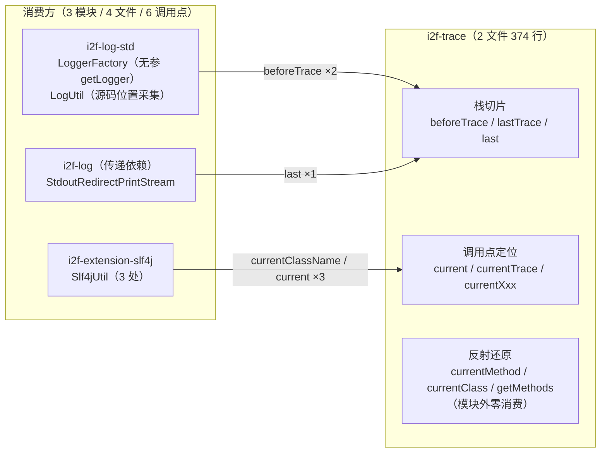

# i2f-trace

> **调用点感知基础设施——基于线程栈回溯的「谁在调用我 / 我在哪」定位工具**：全模块 **2 个源文件、374 行、2 个包**（`i2f.trace` + `i2f.trace.test`），零测试零资源、**零依赖**（pom.xml 无任何 `<dependencies>`，连 i2f 内部模块都未用，仅使用 JDK 反射与集合 API）。核心类 `ThreadTrace`（284 行，全部静态方法、无状态）：两大能力——**①栈切片**：`beforeTrace`（自栈底向上取「最外层」同类帧之后的调用栈——剥离框架内部帧、拿到用户调用点）、`lastTrace`/`last`（取「最内层连续同类帧」之后的第一帧——直接外部调用方）、`currentTrace`/`current`（按自身类名的快捷切片）；**②调用点反射还原**：`currentClassName`/`currentMethodName`/`currentFileName`/`currentLineNumber`/`currentLocation`、`currentClass`（类名 → Class，`Class.forName` + 上下文 `ClassLoader` 双兜底）、`currentMethod`/`currentSingletonMethod`（类名 + 方法名（+ 实参类型）→ `Method`，含 8 组原语-包装类型双向匹配）。另有演示类 `TestFunctional`（90 行，位于 `src/main/java` 内）。
>
> **消费规模小而精准（全部属于日志体系）**：全仓 **3 个模块、4 个文件、6 个调用点**——`i2f-log-std`（`LoggerFactory` 无参 `getLogger()` 以调用者类名建 logger、`LogUtil` 采集日志源码位置）、`i2f-extension-slf4j`（`Slf4jUtil` 生成调用者类/方法/文件行号标签）、`i2f-log`（`StdoutRedirectPrintStream` 检测直接调用方、阻断重定向回环；**其 pom 未声明本依赖，经 i2f-log-std 传递获得**）。POM 侧有效声明仅 2 处（i2f-log-std、i2f-extension-slf4j，均被真实使用、无声明浪费）；`i2f-jdk-all` 聚合（:563-566）、根 POM 版本管理（:804-808）。同族命名的 `i2f-trace-mdc` 是**平行模块**（traceId/MDC 上下文传递），不依赖也不消费本模块。
>
> ⚠ **主要风险**：`currentMethod` **重载消歧不可靠**——`int`/`Integer` 等重载经原语-包装双向映射后同时命中，且 `getDeclaredMethods()` 顺序未定义，返回哪个重载不确定（演示类并存 `trace(int)`/`trace(Integer)` 正是该模糊场景，却只打印无断言）；**可变参数方法永远无法匹配**（实参个数直接比对）；`null` 实参无法消歧（对任意引用类型均视为匹配）；`beforeTrace`/`lastTrace` **未命中类名时静默回退「仅栈底帧」**——`LogUtil` 以接口名 `ILogger` 定位用户位置，依赖「接口 default 方法必然出现在栈中」这一跨模块隐式契约（ILogger 一旦去 default 化，日志行号将静默退化为 main 等栈底帧）；lambda/动态代理调用点 `findClass` 解析失败返回 null。详见「模块瑕疵或错误」。

## 模块路径

- `i2f-jdk/i2f-trace`

## 模块依赖

- **无任何依赖**：pom.xml 无 `<dependencies>` 段（连 lombok、i2f 内部依赖都未引入；源码仅 import `java.lang.reflect.Method` 与 `java.util.*`）。
- 构建插件：仅 `maven-assembly-plugin`（裸声明，版本由父 POM `i2f-jdk` → `i2f-turbo-java` 统一管理）；产物 `i2f-trace-1.0-jdk8.jar`（`bash/backup-jdk8`、`bash/deploy-jdk8` 等发布目录实证）。
- 版本继承 `i2f-jdk` parent（`1.0-jdk8`）；根 POM 版本管理（pom.xml:804-808）；`i2f-jdk-all` 聚合收录（i2f-jdk-all/pom.xml:563-566）；`i2f-jdk` 模块清单第 154 项（i2f-jdk/pom.xml:154，位于 i2f-thread 与 i2f-trace-mdc 之间）。
- 无 `src/test`、无 `resources`；2 个源文件（1 个工具类 + 1 个演示类）。

## 模块设计

1. **类总览与消费热度**：

| 类 | 行数 | 包 | 职责 | 外部消费 |
| --- | --- | --- | --- | --- |
| `ThreadTrace` | 284 | `i2f.trace` | 栈切片 + 调用点反射还原（全静态、无状态） | 3 模块 4 文件 6 调用点 |
| `TestFunctional` | 90 | `i2f.trace.test` | 重载消歧与各类方法签名的演示 `main` | 0（仅模块内） |

2. **栈切片策略**——两种方向相反的定位语义（核心设计）：

| 方法 | 扫描方向与命中规则 | 语义 | 实际消费场景 |
| --- | --- | --- | --- |
| `beforeTrace(className)` | 自栈底向栈顶，取**最大下标**匹配（最外层帧） | 「进入该类之前的调用栈」——剥离该类全部内部帧 | `LoggerFactory` 无参 `getLogger()`；`LogUtil` 位置采集 |
| `lastTrace(className)` / `last(className)` | 自栈顶向栈底，取**最内层连续段**的下一帧 | 「谁调用了本类」——直接外部调用方 | `StdoutRedirectPrintStream` 回环判断 |
| `currentTrace()` / `current()` | `beforeTrace(自身类名)` / 取其 `[0]` | 调用点栈帧快捷方式 | `Slf4jUtil` 调用者标签 |

未命中类名时三者均回退为「仅栈底帧」（见瑕疵 4）。模块组成与消费关系：



3. **调用点反射还原链**：`currentClassName` → `findClass`（`Class.forName` → 线程上下文 `ClassLoader.loadClass` 双兜底、全静默）→ `currentClass`；`currentMethod`/`currentSingletonMethod` 进一步经 `getMethods`（先 `getDeclaredMethods` 再 `getMethods`，沿父类链递归、`LinkedHashSet` 去重、`matchedOne=true` 首个命中即返）还原 `Method`；实参匹配 `argsMatchTypes`（个数相等 + 逐参 `isSameType`：同一性 → 可赋值 → `BASIC_TYPE_MAPPING` 8 组原语-包装双向映射）。

4. **关键跨模块契约（隐式）**——`LogUtil.newLogData` 以 `beforeTrace(ILogger.class.getName())[0]` 采集用户源码位置（类/方法/文件/行号，LogUtil.java:91-97）：之所以可行，是 `ILogger` 以**接口 default 方法**承载全部日志入口（用户调用 `logger.info()` 时栈帧 className 即 `i2f.log.std.ILogger`，多层 default 委托使其连续出现，「最外层」即用户进入日志门面的边界）。ILogger 若改为抽象类或去 default 化，此处将静默退回栈底帧（如 `main`），行号采集整体失效。

5. **包结构**：`i2f.trace`（`ThreadTrace`）+ `i2f.trace.test`（`TestFunctional`）；无类间依赖、无状态无缓存（每次调用实时 `getStackTrace`）。

## 模块目的

- **无侵入调用点感知**：让日志/框架层在不修改调用方代码的前提下回答「谁在调用我、调用发生在哪一行」——是「无参 `getLogger()` 自动绑定调用类」「日志自动行号」等体验的底层支撑。
- **框架帧剥离协议**：以「按类名切片调用栈」的通用做法，让框架取到用户真实调用点而非框架内部帧。
- **直接调用方判定**：`last()` 为「自调用检测」而设计（输出重定向回环阻断场景）。
- **反射还原补位**：为需要 `Method` 对象的场景（AOP 元数据、调试辅助）提供从栈帧到反射对象的还原能力（当前模块外未使用）。

## 模块功能

- **栈切片**：`beforeTrace`/`lastTrace`/`last`/`currentTrace`/`current`（语义见上表）。
- **调用点信息**：`currentClassName`/`currentMethodName`/`currentFileName`/`currentLineNumber`/`currentLocation`（`StackTraceElement.toString()`）/`currentClass`。
- **反射还原**：`currentMethod(Object...)`（名称 + 实参类型）/`currentSingletonMethod()`（仅名称）/`findClass`/`getMethods`/`isSameType`/`argsMatchTypes`。
- **常量**：`CLAZZ`/`CLAZZ_NAME`（自身类引用与全限定名，:14-15）、`BASIC_TYPE_MAPPING`（8 组原语-包装映射表，:227-236）。

## 模块主要使用方法

```java
// 1) 无参日志器范式：以「调用者类.方法」为 logger 名（i2f-log-std 的真实实现方式）
public static ILogger getLogger() {
    StackTraceElement[] elems = ThreadTrace.beforeTrace(LoggerFactory.class.getName());
    return getLogger(elems[0].getClassName() + "." + elems[0].getMethodName());
}
// 用户侧：ILogger log = LoggerFactory.getLogger(); // 自动绑定到当前调用类

// 2) 调用点栈帧信息（Slf4jUtil 标签范式）
String cls = ThreadTrace.currentClassName();   // 调用者类名
StackTraceElement cur = ThreadTrace.current(); // 调用者栈帧（文件/行号/方法名）
String tag = cur.getClassName() + "->" + cur.getMethodName()
        + " in file:" + cur.getFileName() + " of line:" + cur.getLineNumber();

// 3) 找直接外部调用方（跳过自身连续帧；回环判断范式）
StackTraceElement trace = ThreadTrace.last(StdoutRedirectPrintStream.class.getName());

// 4) 调用点方法反射还原（注意重载与可变参限制）
Method m = ThreadTrace.currentMethod(1, "s"); // 调用方法签名恰为 (int, String) 时命中
```

注意事项：

- **两种切片的语义方向相反**：`beforeTrace` 取「最外层同类帧之后」（用户侧调用栈）、`lastTrace`/`last` 取「最内层连续同类帧之后」（直接调用方）；混用会拿到相反方向的帧。
- **未命中即静默回退栈底帧**：类名拼写错误、或该类名根本不出现在栈中（如目标方法由实现类直接声明而非接口 default 方法）时，不抛异常而是返回仅含栈底帧（如 `main`）的数组——使用 `[0]` 前请确认目标类名确实会出现在栈中。
- **`currentMethod` 对重载与可变参不可靠**：`int`/`Integer` 重载同时匹配且 `getDeclaredMethods()` 顺序未定义；varargs 方法恒不匹配（除非传数组本身）；`null` 实参对任意引用类型均匹配。
- **lambda/动态代理中不可用**：`currentClass`/`currentMethod` 依赖 `findClass` 加载类，`Foo$$Lambda$...`、`com.sun.proxy.$Proxy...` 等动态类名加载失败时返回 `null`。
- **性能**：每次调用实时生成 `getStackTrace` 快照（无缓存）；高频路径建议加开关（消费方 `StdoutRedirectPrintStream` 提供 `useTrace` 开关）或仅在 DEBUG 及以上级别采集（`LogUtil` 的做法）。
- **与 `i2f-trace-mdc` 区分**：本模块负责「调用栈位置定位」；`i2f-trace-mdc` 负责「traceId 等上下文跨线程传递」，二者平行、互不依赖。

## 模块特性总结

1. **零依赖零状态**：i2f-jdk 中最底层的模块之一——不依赖任何 i2f 模块与三方库，纯 JDK 实现，可整类复制进任意项目。
2. **小而精准的消费**：3 模块 4 文件 6 调用点，全部服务于日志体系（logger 定位、源码位置采集、回环阻断）——是 i2f 日志栈「调用点感知」的事实入口。
3. **双向切片协议**：`beforeTrace`（框架剥离取用户）/`lastTrace`（取直接调用方）覆盖两类经典需求，是外部消费最集中的核心能力。
4. **反射还原完备但零外部使用**：`currentSingletonMethod`/`currentMethod`/`findClass`/`getMethods`/`isSameType` 系列（:108-283，含类型匹配辅助约 170 行）模块外无消费，唯一使用者是自带演示类——能力储备与实际使用不对称。
5. **隐式契约脆弱点**：`LogUtil` 对 `ILogger` 接口名切片的依赖、消费方对「类名精确匹配」的依赖，均无任何编译期保障。
6. **依赖声明错配与重复实现**：i2f-log 直接消费但 POM 未声明（经 i2f-log-std 传递）；该消费方还自行内联了与 `beforeTrace` 等价的栈回溯（未复用本模块）。
7. **零测试**：无 `src/test`；演示类位于 `src/main/java` 随制品发布，且只有打印没有断言——多个确定性缺陷（重载消歧、varargs 不可匹配）因此长期未暴露。

## 模块瑕疵或错误

1. **`currentMethod`/`currentSingletonMethod` 重载消歧不可靠**：ThreadTrace.java:128-150、:108-126——经 `getMethods(..., true)`（:180-225）取「首个名称命中」；`int`/`Integer` 等重载经 `BASIC_TYPE_MAPPING`（:227-236）双向映射后**同时满足**类型匹配，加之 `getDeclaredMethods()` 返回顺序未定义 → 返回哪个重载不确定。`TestFunctional`（:51-64）恰好并存 `trace(int)`/`trace(Integer)`，却只打印无法断言。
2. **可变参数方法永远无法匹配**：ThreadTrace.java:262-266——`argsMatchTypes` 直接比较 `types.length != args.length`；varargs 方法 `parameterTypes` 为单元素数组，与 n 个实参必然不等 → `currentMethod` 返回 null（除非手动传入数组本身）。
3. **`null` 实参无法消歧**：ThreadTrace.java:270-272——null 实参直接 `continue`（视为匹配任意引用类型）；传 null 时同参数个数的全部重载同时「匹配」，结果退化为顺序不确定性。
4. **未命中类名时静默回退「栈底帧」**：ThreadTrace.java:26-31、:56-61——`beforeTrace`/`lastTrace` 找不到 className 时返回仅含栈底帧（如 `main`）的数组，调用方无法区分「命中」与「未命中」。`LogUtil` 用接口名 `ILogger` 定位（LogUtil.java:92）建立在该接口 **default 方法必然出现在栈中** 的隐式契约上——ILogger 去 default 化即静默退化为栈底帧，行号采集整体失效。
5. **`lastTrace` 对交错同名帧处理不完整**：ThreadTrace.java:42-55——只截断「自栈顶起的第一段连续同名帧」；同名帧交错出现（如 X→Y→X 调用链）时，更外层的 X 帧仍保留在返回结果中。
6. **lambda/动态代理调用点无法还原且异常全静默**：ThreadTrace.java:160-178——`findClass` 对 `Foo$$Lambda$...`、`com.sun.proxy.$Proxy...` 等动态类名 `Class.forName` 与上下文加载器均加载失败 → `currentClass`/`currentMethod` 返回 null；两级 try 的 catch 全空（:166-168、:174-176）。
7. **`isSameType` 条件三/四为冗余分支**：ThreadTrace.java:252-257——对 8 组原语-包装对，原语 `isAssignableFrom` 仅自身为真，实际与前两条等价（不产生错误，但为无效逻辑）。
8. **`getMethods` 边界依赖单一判空兜底**：ThreadTrace.java:182-184、:218-224——接口/原语/数组类的 `getSuperclass()` 为 null，递归安全完全依赖入口 `clazz == null` 判断支撑；两处 catch 静默（:196-198、:210-212），类访问异常时静默得到空集合。
9. **演示类位于 main 源码树、零正式测试**：`TestFunctional`（90 行）在 `src/main/java` 下随 `i2f-trace-1.0-jdk8.jar` 发布；模块无 `src/test`，唯一「验证」是打印 main（:16-31），无任何断言——上述缺陷 1-3 因此长期未暴露。
10. **i2f-log 依赖声明缺失（消费方侧）**：`StdoutRedirectPrintStream`（:8、:117）直接 import `i2f.trace.ThreadTrace`，但 i2f-log/pom.xml 未声明 `i2f-trace`（经 i2f-log-std 传递获得，i2f-log/pom.xml:20-23）——上游依赖树调整时该模块编译失败。另：该消费方在 :127-140 自行内联了与 `beforeTrace` 完全等价的栈回溯（未复用本模块），属重复实现。

## 消费现状与验证

- **Java 层消费**（检索 `import i2f.trace.ThreadTrace;` 与 `ThreadTrace.` 全仓双重复核，排除自身）：**3 个模块、4 个文件、6 个调用点**；非 Java 侧无文本引用（命中的仅为 `bash/` 发布 JAR 内的编译产物）。

| 消费方 | 文件（行号） | 调用 | 场景 |
| --- | --- | --- | --- |
| i2f-jdk/i2f-log-std | `LoggerFactory.java`（:179-182） | `beforeTrace` | 无参 `getLogger()`：以调用者类名+方法名为 logger 名 |
| i2f-jdk/i2f-log-std | `util/LogUtil.java`（:91-97） | `beforeTrace[0]` | DEBUG 及以上采集用户源码位置（类/方法/文件/行号） |
| i2f-extension/i2f-extension-slf4j | `Slf4jUtil.java`（:14、:20、:28） | `currentClassName`、`current` ×2 | 调用者类名 logger、类+方法标签、文件行号 debug 标签 |
| i2f-jdk/i2f-log（传递依赖） | `StdoutRedirectPrintStream.java`（:117） | `last` | 检测直接调用方是否为 `StdoutPlanTextLogWriter`，阻断重定向回环 |

- **方法热度**：`beforeTrace` 2 处、`current` 2 处、`currentClassName` 1 处、`last` 1 处；**反射还原族（`currentMethod`/`currentSingletonMethod`/`currentClass`/`findClass`/`getMethods`/`isSameType`/`argsMatchTypes`）模块外零消费**（全限定名检索亦无）。
- **POM 级消费**：有效声明 2 处——`i2f-log-std`（pom.xml:26-29）、`i2f-extension-slf4j`（pom.xml:38-41），均被真实使用；`i2f-log` **未声明**（传递依赖，见瑕疵 10）；`i2f-jdk-all` 聚合收录（:563-566）；根 POM 版本管理（:804-808）；`i2f-jdk` 模块清单（:154）。
- **平行模块对照**：`i2f-trace-mdc`（同目录，包 `i2f.trace.mdc`）不依赖本模块——其 pom 无 `<dependencies>`、源码无 `i2f.trace.ThreadTrace` 引用；二者命名相近、职责不同（MDC 上下文传递 vs 调用栈定位）。
- **构建实证**：`bash/backup-jdk8`、`bash/deploy-jdk8`、`bash/backup-jdk17`、`bash/deploy-jdk17` 下均存在 `i2f-trace-1.0-jdk8.jar` / `i2f-trace-1.0-jdk17.jar` 发布产物；模块无 `src/test` 与 `resources` 目录。
