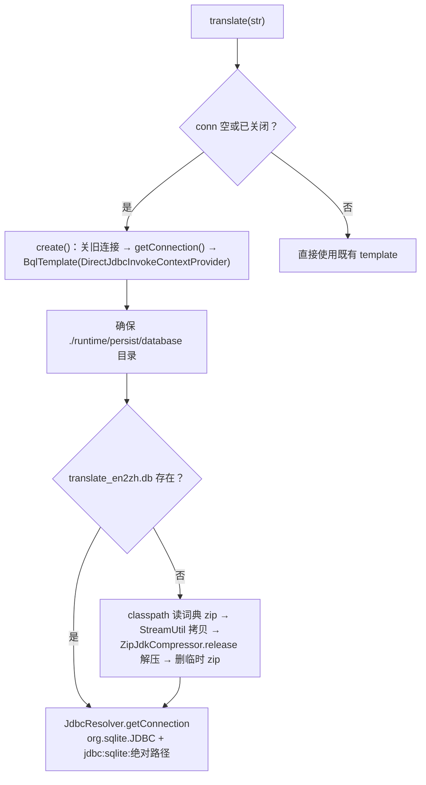
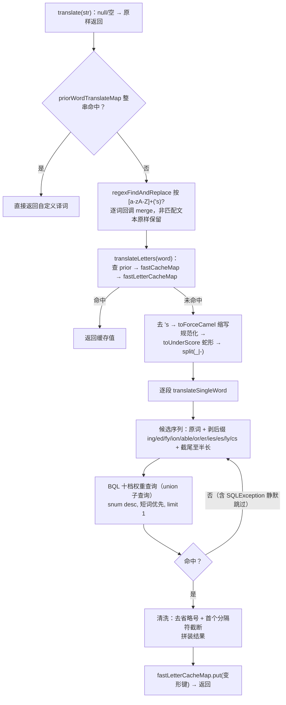

# i2f-translate-en2zh

> **英文标识符→中文注释的「行业词典优先」翻译器——「正则逐词替换 + 标识符启发式还原 + 内置 SQLite FTS3 词典 + 首用自动释放」**：全模块 **3 个源文件、416 行、3 个子包**（`i2f.translate.en2zh.data` 1 文件 + `.impl` 1 文件 + `.test` 1 演示类，无 `src/test`），资源区 1 个词典 zip（6,889,226 字节 → 解压出 17,473,536 字节的 `translate_en2zh.db`，FTS3 库，表 `translate_en2zh` 五列：id/word/book_id/trans_pos/trans_cn）。三大成员：①`SimpleWordTranslator`（296 行，模块核心）——`translate(str)` 以 `RegexUtil.regexFindAndReplace` 按 `[a-zA-Z]+('s)?` 把文本中的英文词逐个交给 `translateLetters`（非英文部分原样保留）：去 `'s` → `toForceCamel` 缩写规范化（`XMLParser`→`xmlParser`，避免缩写被逐字母蛇形化）→ `toUnderScore` 蛇形 → `split("_|-")` 分段，逐段 `translateSingleWord`；`translateSingleWord` 生成候选序列（原词 + 剥离 `ing/ed/fy/ion/able/or/er/ies/es/ly/cs` 后缀 + 截尾至半长），对每个候选执行 **BQL 十档权重查询**（software 词典名词 200 > software 199 > computer 名词 100 > computer 99 > 通用名词 10 > 有词性 9 > 无词性 8 > 前缀模糊 7/6/5，`order by snum desc, length(word) asc, length(trans_cn) asc limit 1`）命中即止，结果清洗（去省略号、按首个分隔符截断）；实例级 `priorWordTranslateMap` 自定义优先词典（先于一切）+ 双静态 `LruMap` 缓存（16k 段级 / 8k 整词级）；②连接与词典生命周期——`ILifeCycle`（create/destroy/close）：`getConnection()` 首用把 classpath 词典 zip 释放到 `./runtime/persist/database/translate_en2zh.db`（`ResourceUtil` + `StreamUtil` + `ZipJdkCompressor.release` + `JdbcResolver`），`create()` 幂等重建（先关旧连接），`translate` 检测连接关闭自动重建；③`TranslateEn2ZhDom`（21 行）——`@Table("translate_en2zh")` 词条 DOM（id/word/transPos/transCn）**未被实现引用**（闲置占位，且缺 `book_id` 列）。
>
> **消费现状（Java 层全仓零消费）**：全仓 **0 个模块、0 个文件**在代码中引用本模块——grep/PowerShell 的 java·xml·md 扫描/非 Java 配置扫描多路验证均为零源码命中；唯一外部引用是 `i2f-extension-reverse-engineer-generator` 的 `tpl/readme.md` **文档模板**（6 处：`systemPath` 引入 jar、`import`、实例化、`getPriorWordTranslateMap()` 自定义词典、表名/列名→中文注释示范）——反向工程生成器对使用者的**推荐集成示例**，非编译期消费；POM 侧无任何模块声明依赖（`i2f-jdk-all` 聚合 :575-578、根 POM 版本管理 :819-823、`i2f-jdk` 模块清单 :157）。反向地，本模块作为**消费方**被 9 处上游 readme 记录（std-const/compress-impl/resources/lifecycle/jdbc-bql/jdbc-impl/bql/database-metadata-bean/以及 text 的隐性消费者名单）。发布产物 `i2f-translate-en2zh-1.0-jdk8.jar`/`-jdk17.jar` 见 `bash/backup-*`、`bash/deploy-*` 四目录。
>
> ⚠ **主要风险**：**隐性依赖八连**——`i2f-bql`/`i2f-jdbc-impl`/`i2f-io-stream`/`i2f-lru-map`/`i2f-match`/`i2f-text`/`i2f-annotations-db`/`i2f-database-metadata-bean` 均直接使用却**未在 POM 声明**（靠 `i2f-jdbc-bql → i2f-jdbc-impl / i2f-bql` 与 `i2f-resources → i2f-io-stream` 传递链）；**`fastLetterCacheMap` 缓存读写键不一致**——写入键是变形后字符串（小写/蛇形），查找键是变形前原始输入，**含大写字母的输入（驼峰/缩写/首字母大写）重复翻译永不命中该缓存层**（仅全小写输入有效）；查询 `SQLException` 被空 catch 吞掉 + 「解压 `printStackTrace` 静默 → SQLite 空库自动建档（`isFile()` 恒真）→ 查询静默」三层链——词典校验失效时翻译**退化为原样输出而无报错**；`sqlite-jdbc` 为 `provided`+`optional`（无静态块，缺驱动为**调用期可重试异常**，危险度低于 zh2pinyin）；后缀列表含可疑项 `"cs"`（疑为笔误）；`TranslateEn2ZhDom` 死代码且缺列；`translate` 未同步 + `destroy()` 并发窗口可致 NPE；`@Data` 生成 `getConn()`/`getTemplate()` 暴露内部可变状态。详见「模块瑕疵或错误」。

## 模块路径

- `i2f-jdk/i2f-translate-en2zh`

## 模块依赖

| 依赖 | 坐标 | scope/optional | 用途 |
| --- | --- | --- | --- |
| `i2f-translate` | `i2f.turbo:i2f-translate` | 编译 | `ITranslator` 接口（extends `ILifeCycle`）；翻译器系列契约 |
| `i2f-jdbc-bql` | `i2f.turbo:i2f-jdbc-bql` | 编译 | `BqlTemplate.get(bql, String.class)` 查询词典；`Bql.$_()` 流式拼装 SQL |
| `i2f-resources` | `i2f.turbo:i2f-resources` | 编译 | `ResourceUtil.getClasspathResourceAsStream` 加载词典 zip |
| `i2f-compress-impl` | `i2f.turbo:i2f-compress-impl` | 编译 | `ZipJdkCompressor.release(zip, dir)` 解压词典 |
| `i2f-std-const` | `i2f.turbo:i2f-std-const` | 编译 | `StdConst.RUNTIME_PERSIST_DIR`（`runtime/persist`）定位词典目录 |
| `i2f-lifecycle` | `i2f.turbo:i2f-lifecycle` | 编译 | `ILifeCycle`（create/destroy/close）生命周期契约 |
| `lombok` | `org.projectlombok:lombok` | 编译（注解） | `@Data`/`@NoArgsConstructor`（2 主类 + 1 Dom） |
| `sqlite-jdbc` | `org.xerial:sqlite-jdbc:3.43.0.0` | **provided + optional** | SQLite JDBC 驱动（运行期需使用方提供） |

- **隐性依赖（未声明却直接 import）**：`i2f-bql`（`SimpleWordTranslator.java:3` `Bql`）、`i2f-io-stream`（`:5` `StreamUtil`）、`i2f-jdbc-impl`（`:6` `JdbcResolver`、`:8` `DirectJdbcInvokeContextProvider`）、`i2f-lru-map`（`:9` `LruMap`）、`i2f-match`（`:10` `RegexUtil`）、`i2f-text`（`:13` `StringUtils`）、`i2f-annotations-db`（`TranslateEn2ZhDom.java:3-4` `@Primary`/`@Table`）、`i2f-database-metadata-bean`（`TestTranslate.java:3` `BeanDatabaseMetadataResolver`）——**8 个**均**未在 POM 声明**，传递链：`i2f-jdbc-bql → i2f-jdbc-impl（→ i2f-match）`、`i2f-jdbc-bql → i2f-bql（→ i2f-lru-map / i2f-text / i2f-annotations-db / i2f-database-metadata-bean）`、`i2f-resources → i2f-io-stream`（i2f-text readme:221 已记录本模块为「未直接声明却 import `StringUtils`」的隐性消费者）。上游依赖树调整即编译失败。
- 构建插件：仅 `maven-assembly-plugin`；版本继承 `i2f-jdk` parent（`1.0-jdk8`）；根 POM 版本管理（pom.xml:819-823）；`i2f-jdk-all` 聚合收录（i2f-jdk-all/pom.xml:575-578）；`i2f-jdk` 模块清单第 157 项（i2f-jdk/pom.xml:157，位于 i2f-translate 与 i2f-translate-zh2pinyin 之间）。
- 无 `src/test`；资源 1 个：`src/main/resources/assets/database/translate_en2zh.zip`（6,889,226 字节，单条目 `translate_en2zh.db` 17,473,536 字节）。

## 模块设计

1. **类总览**：

主源码（2 文件 317 行）：

| 类 | 行数 | 包 | 职责 | 外部消费 |
| --- | --- | --- | --- | --- |
| `SimpleWordTranslator` | 296 | `i2f.translate.en2zh.impl` | 翻译核心：正则逐词 + 标识符预处理 + 候选生成 + BQL 权重查询 + 双缓存 + `ILifeCycle` | 仅文档模板示范（tpl/readme.md） |
| `TranslateEn2ZhDom` | 21 | `i2f.translate.en2zh.data` | `@Table("translate_en2zh")` 词条 DOM：id/word/transPos/transCn（**未被实现引用**） | 零 |

演示类（位于 `src/main`，无断言）：

| 类 | 行数 | 包 | 演示内容 |
| --- | --- | --- | --- |
| `TestTranslate` | 99 | `i2f.translate.en2zh.test` | 读仓库内 springboot-security 源码文件全文翻译（`testTranslateFile`，main 实际执行）+ 反射翻译 4 个类的类/字段/方法/参数名（`testTranslate`，被注释） |

2. **连接建立与词典释放**（`SimpleWordTranslator.java`，:70-113）：



3. **文本翻译处理链**（`translate` → `translateLetters` → `translateSingleWord`）：



4. **BQL 十档权重 SQL**（`translateSingleWord`，:198-279，示意；每段由 `Bql.$_()` 流式拼装并绑定候选词参数）：

```sql
select trans_cn from (
  select distinct 200 snum, ... where word = ? and book_id = 'software' and trans_pos = 'n'
  union select distinct 199 ... where word = ? and book_id = 'software'
  union select distinct 100 ... where word = ? and book_id = 'computer' and trans_pos = 'n'
  union select distinct  99 ... where word = ? and book_id = 'computer'
  union select distinct  10 ... where word = ? and trans_pos = 'n'
  union select distinct   9 ... where word = ? and trans_pos is not null
  union select distinct   8 ... where word = ? and trans_pos is null
  union select distinct   7 ... where word like ?||'%' and trans_pos = 'n'
  union select distinct   6 ... where word like ?||'%' and trans_pos is not null
  union select distinct   5 ... where word like ?||'%' and trans_pos is null
) a order by snum desc, length(word) asc, length(trans_cn) asc
limit ?
```

- **领域优先**：`software`（软件行业词典）> `computer`（计算机词典）> 通用（无 book_id 条件）——保证技术术语译义权威性；
- **词性优先**：同词典内 `trans_pos='n'`（名词）优先于其它词性、有词性优先于无词性；
- **等值优先于前缀**：`word = ?` 七档优先，`word LIKE 候选||'%'`（候选为词典词前缀时的模糊兜底）三档垫底；
- **二次排序**：同权重取最短原词、最短译义（`length(word)`/`length(trans_cn)` 升序）——避免冗长释义；
- **命中即止 + 结果清洗**：每个候选查询 `limit 1`，取回后去 `…`、按 `[,./;:，。、；：]` 截取首个义项，非空即终止候选循环。

5. **包结构**：根包 `i2f.translate.en2zh`（无直接类）→ `.data`（词条 Dom）→ `.impl`（翻译器）→ `.test`（演示）；依赖方向单向。词典为 **SQLite FTS3 虚表**：`CREATE VIRTUAL TABLE translate_en2zh using fts3 (id, word, book_id, trans_pos, trans_cn)`（库内含 `_content` 影子表与 `sqlite_autoindex`）——注意 `TranslateEn2ZhDom` 只有 4 字段（缺 `book_id`）。

6. **三级缓存**：实例级 `priorWordTranslateMap`（ConcurrentHashMap，用户自定义优先词典，一切查询先查它）→ 静态段级 `fastCacheMap`（16384 条 `LruMap`，缓存 `translateSingleWord` 的单段结果）→ 静态整词级 `fastLetterCacheMap`（8192 条，缓存 `translateLetters` 整词结果，**写入键为变形后字符串，见瑕疵 3**）。

## 模块目的

- **中文注释自动生成**：为核心场景「英文标识符（类名/字段名/表名/列名）→ 中文注释」提供开箱翻译——`i2f-extension-reverse-engineer-generator` 的文档模板把本模块作为列注释生成的推荐组件（`translator.translate(tableMeta.getName()).replaceAll("_","")`）。
- **技术术语翻译优先**：以 software/computer 两本行业词典 + 十档权重从 SQL 层保证「软件语义优先于通用语义」（如 `thread`→线程 而非 线/穿线）。
- **标识符启发式还原**：输入预处理（缩写规范化/蛇形分段/'s 剥离/后缀剥离/截尾）把「代码里的变形英文」还原为词典词条形态——提高查得率。
- **词典零配置交付**：词典以 6.6MB zip 随 jar 分发、首用自动释放到工作目录（`runtime/persist`）——使用方零初始化代码。
- **契约统一**：以 `ITranslator` + `ILifeCycle` 与 i2f-translate 系列翻译器（zh2pinyin 等）同构，可组合、可互换。

## 模块功能

- **文本翻译**（`translate`）：按 `[a-zA-Z]+('s)?` 正则逐英文词翻译，非英文部分（中文/数字/符号）原样保留；空串/null 原样返回。
- **标识符预处理**（`translateLetters`）：`'s` 所有格剥离 → `toForceCamel` 缩写规范化 → `toUnderScore` 蛇形 → `_`/`-` 分段。
- **词根候选还原**（`translateSingleWord`）：原词 + 剥离 11 种后缀 + 截尾（保底半长）多候选逐一查词典。
- **领域词典权重查询**：十档 snum 优先级（software/computer/通用 × 名词/非名词 × 等值/前缀）。
- **自定义优先词典**（`priorWordTranslateMap`）：`getPriorWordTranslateMap().put(...)` 直接生效，优先于内置词典与全部缓存。
- **生命周期与自动建库**（`ILifeCycle`）：`create()` 幂等重建连接；`translate` 自动检测关闭并重建；`destroy()`/`close()` 释放 SQLite 连接。

## 模块主要使用方法

```java
// 1) 基本翻译：英文标识符 → 中文（software/computer 词典优先；未收录段原样保留）
try (SimpleWordTranslator translator = new SimpleWordTranslator()) {
    System.out.println(translator.translate("userName, createTime"));
    System.out.println(translator.translate("Hello 世界!"));  // 非英文部分原样保留
}
// 2) 自定义优先词典：先于内置词典与缓存（典型：项目缩写/专名）
SimpleWordTranslator translator = new SimpleWordTranslator();
translator.getPriorWordTranslateMap().put("xxljob", "XXL任务");
translator.getPriorWordTranslateMap().put("pwd", "密码");
translator.translate("xxljob pwd");  // → "XXL任务 密码"
// 3) 表名/列名 → 注释（reverse-engineer-generator 模板的推荐用法）
String comment = translator.translate("user_login_log").replaceAll("_", "");
// 4) 生命周期：close()/destroy() 释放 SQLite 连接；连接关闭后再次 translate 会自动重建
translator.destroy();
```

注意事项：

- **运行期必须提供 SQLite 驱动**：`sqlite-jdbc` 为 `provided`+`optional`——使用方需自行引入 `org.xerial:sqlite-jdbc`；否则 `create()` 抛异常（**无静态块陷阱、可重试**——每次调用都会重新尝试加载驱动与建连）。
- **首用释放词典**：解压到 `./runtime/persist/database/translate_en2zh.db`（相对 JVM 工作目录）——工作目录须可写；zip 拷贝 → 解压 → 删除临时 zip。
- **词典查不到的段原样保留**（不抛异常、无误译占位）；`translate(null/"")` 原样返回。
- **缓存行为差异**：段级 `fastCacheMap` 正常复用；整词级 `fastLetterCacheMap` 因**读写键不一致**对含大写输入永不命中（见瑕疵 3）——驼峰标识符重复翻译以段级缓存兜底。
- **输出取「首个义项」**：译义按分隔符截断（`ret.split("[,./;:，。、；：]", 2)[0]`），长释义只保留第一段。
- **`destroy()` 与 `translate` 并发存在 NPE 窗口**：`translate` 未同步——逐段迭代期间被 `destroy()` 置空 `template` 后，下一段查询直接 NPE（查询 catch 仅覆盖 `SQLException`）。

## 模块特性总结

1. **为「英文标识符翻译」而生**：输入预处理链（'s/缩写/蛇形/分段/后缀/截尾）+ 领域词典优先——专攻类名/字段名/表名/列名 → 中文注释。
2. **十档权重 + 两本行业词典**：software/computer 词典优先级从 SQL 层保证；名词优先、短词优先、前缀模糊兜底、`limit 1` 命中即止。
3. **词典资源化、零配置**：6.6MB zip（内含 16.7MB FTS3 库）随 jar 分发，首用自动释放——「引入即用」。
4. **正则逐词替换、非目标文本透传**：中英混排文本中仅英文词被翻译，中文/数字/符号/换行原样保留。
5. **自定义前置词典优先于一切**：线程安全 `ConcurrentHashMap`，直接 `put` 即生效（先于缓存与 SQL 查询）。
6. **三级缓存 + 短路扫描**：prior → 段级 16k → 整词级 8k；候选序列命中即止减少查询。
7. **连接自愈**：`translate` 检测 `conn` 关闭自动 `create()` 重建——优于同系列 zh2pinyin 的「destroy 后 NPE」。
8. **「能力先行」+ 文档模板示范**：Java 层零消费，但被反向工程生成器的 `tpl/readme.md` 完整示范集成（含自定义词典、表/列注释翻译）——设计意图的直接证据。

## 模块瑕疵或错误

1. **隐性依赖八连（POM 未声明）**：SimpleWordTranslator.java:3/5/6/8/9/10/13 + TranslateEn2ZhDom.java:3-4 + TestTranslate.java:3——`i2f-bql`/`i2f-io-stream`/`i2f-jdbc-impl`/`i2f-lru-map`/`i2f-match`/`i2f-text`/`i2f-annotations-db`/`i2f-database-metadata-bean` 全部直接使用却未声明，经 `i2f-jdbc-bql → i2f-jdbc-impl / i2f-bql` 与 `i2f-resources → i2f-io-stream` 传递链获得——上游依赖树一旦调整，本模块编译即断。
2. **`fastLetterCacheMap` 缓存读写键不一致（本模块独有缺陷）**：`translateLetters` 查找用**变形前**原始输入（:150 `fastLetterCacheMap.get(str)`），写入却用**变形后**字符串（:158-159 `toForceCamel` + `toUnderScore` + `toLowerCase` 后再 `:170 put(str, result)`）——对含大写字母的输入（驼峰/缩写/首字母大写），put 键（如 `user_name`）与未来同输入的 get 键（`userName`）**永不相交**，同一输入重复翻译每次全量重算（仅「全小写无变形」输入恰好 key 相等时可命中）；且正则 `[a-zA-Z]+` 永不含 `_`，写入的蛇形键几乎不可能作为未来输入出现——该缓存层对标识符场景**事实失效**。
3. **查询 `SQLException` 被空 catch 吞掉**：`translateSingleWord` :280-282 空 catch——查询失败与「查无此词」不可区分、候选静默跳过、无日志无异常；叠加 :284-285 的清洗逻辑，故障时表现为「该段原样保留」。
4. **「解压→建库→查询」三层静默失效链**：①`AbsCompressor.release` 解包回调以 `printStackTrace` 吞掉写文件异常；②若词典解压失败/缺文件，`JdbcResolver` 打开不存在的 sqlite 路径会**自动创建空库**（`jdbc:sqlite:` 默认行为，:111）——`dbFile.isFile()` 自此恒真、**永不重试解压**；③空库无表 → 查询 SQLException → 又走第 3 条空 catch——三层叠加使翻译**全面退化为原样输出，全程无任何报错**。另 `zipFile.delete()` 返回值未检查（:108）。
5. **后缀表含可疑项 `"cs"`**：:185-187 后缀数组 `{"ing","ed","fy","ion","able","or","er","ies","es","ly","cs"}`——`"cs"` 非常规后缀（疑为 `"s"`/`"ics"` 的笔误），会把 `dynamics` 类词剥离成无效词根 `dynami`（多余候选，不会误命中但浪费一次查询）；另「截尾至半长」候选（:193-195）在多候选兜底时可能命中不当短词——启发式还原存在固有误译面。
6. **`TranslateEn2ZhDom` 为死代码且缺列**：定义 `@Table("translate_en2zh")`/`@Primary` 的 ORM 风格 DOM，但 `SimpleWordTranslator` 从不使用（查询直接 `template.get(bql, String.class)` 返回字符串）；且表有五列 `book_id` 而 DOM 仅四字段——即便将来按 DOM 映射也会丢列；`@Primary`/`@Table` 注解误导「存在 ORM 落地」。
7. **`sqlite-jdbc` provided+optional**：唯一运行期第三方驱动被标为可选+provided（pom.xml:51-57）——使用方忘引驱动时每次 `translate` 都在 `create()` 抛异常（相对 zh2pinyin 的类永久初始化失败可重试，但「半托管」语义未在代码层声明或文档化）。
8. **`translate` 未同步 + `destroy()` 并发窗口**：`translate`/`translateLetters` 无锁而 `destroy` 为 `synchronized`（锁 `this`）——多段翻译过程中另一线程 `destroy()` 置空 `template`，下一段查询 NPE（catch 仅覆盖 `SQLException` 捕不到 NPE）；另一面 `translateSingleWord` 为 `synchronized`——**段级查询全局串行**（缓存 miss 时）且仅单连接，高并发吞吐受限。
9. **`@Data` 暴露内部可变状态**：Lombok `@Data` 为 `SimpleWordTranslator` 生成 `getConn()`/`getTemplate()`/`setConn()`/`setTemplate()` 及 equals/hashCode——连接与模板可被外部替换破坏生命周期约束（模板被置坏后所有查询静默失败）；equals/hashCode 以**可变缓存与连接字段**参与计算，实例作为集合键时会随机漂移。
10. **零测试 + 演示类占用 main 源码树**：无 `src/test`；`TestTranslate` 为唯一验证载体且无断言——`testTranslateFile` 硬编码仓库相对路径 `i2f-springboot/i2f-springboot-security-starter/.../SecurityAutoConfiguration.java`（换工作目录即静默失败）且 catch 全空（:36-38）；`testTranslate`（反射翻译）默认被注释。
11. **词典与代码软耦合**：`book_id='software'/'computer'`、十档 snum、11 项后缀表全部硬编码在 Java 字符串/数组中——词典换版或新增行业词典需改代码。

## 消费现状与验证

- **Java 层消费**：**0 个模块、0 个文件、0 个调用点**——本模块 3 个类（翻译器/Dom/演示）在全仓（除自身）**无任何 import 或调用**。
- **验证方法（多路）**：①`grep i2f.translate.en2zh`——6 命中：5 处位于模块自身 + 1 处为 `tpl/readme.md` 模板；②PowerShell 全仓 `*.java/*.xml/*.md`（排除本模块）扫描——命中 `.wiki` 12 处与 `tpl/readme.md`、聚合/版本管理/清单 POM，**零外部 `.java` 命中**；③`*.properties/*.json/*.yml/*.yaml/*.ts/*.js/*.vue/*.txt` 非 Java 扫描——零命中（无 SPI/装配/脚本引用）。
- **文档模板引用**（`i2f-extension-reverse-engineer-generator/src/main/resources/tpl/readme.md`，非编译期消费）：

| 位置 | 内容 |
| --- | --- |
| :20 | `<systemPath>${pom.basedir}/lib/i2f-translate-en2zh-1.0.jar</systemPath>`（system scope 引入 jar） |
| :57 | `import i2f.translate.en2zh.impl.SimpleWordTranslator;` |
| :105 | `new SimpleWordTranslator()` 实例化 |
| :107-118 | 自定义词典示范：`getPriorWordTranslateMap().putAll(map)`（xxljob/xxl/pwd/html 等） |
| :153/:158 | 表名/列名 → 中文注释：`translator.translate(tableMeta.getName()).replaceAll("_","")` |

（模板 :17 处 artifactId 写作 `translate-en2zh`——**缺 `i2f-` 前缀**，使用者按模板摘抄坐标会得到错误 artifactId。）
- **POM 级消费**：无任何模块声明本模块依赖；`i2f-jdk-all` 聚合收录（:575-578）；根 POM 版本管理（:819-823）；`i2f-jdk` 模块清单（:157）。
- **反向消费（本模块作为消费方被上游 readme 记录）**：

| 上游模块 | 消费内容 | 记录位置 |
| --- | --- | --- |
| i2f-std-const | `RUNTIME_PERSIST_DIR` 定位词典目录（SimpleWordTranslator:90） | readme.md:152 |
| i2f-compress-impl | `ZipJdkCompressor` 解压内置词典 zip | readme.md:112（mermaid :132） |
| i2f-resources | `getClasspathResourceAsStream` 加载词典 | readme.md:309 |
| i2f-lifecycle | `create()/destroy()`（synchronized）管理 SQLite 连接 | readme.md:167（:192-193） |
| i2f-jdbc-bql | `BqlTemplate` 长持有 + `get(BindSql, Class)` 调用 1 处 | readme.md:264/277 |
| i2f-jdbc-impl | 经 `i2f-jdbc-bql` 传递消费（2 调用） | readme.md:337 |
| i2f-bql | `bean` 查询使用 | readme.md:270 |
| i2f-database-metadata-bean | 测试文件引用（`BeanDatabaseMetadataResolver`） | readme.md:112 |
| i2f-text | 未声明却 import `StringUtils`（隐性消费者名单） | readme.md:221 |

- **wiki 侧引用**：`.wiki/docs/module-i2f-jdk.md:124`（「英译中」）、`.wiki/wiki.md:95`（文本/国际化分类）、`.wiki/modules/i2f-jdk/i2f-translate-zh2pinyin/readme.md:137/171`（平行模块互记）。
- **发布产物**：`bash/backup-jdk8`、`bash/deploy-jdk8`、`bash/backup-jdk17`、`bash/deploy-jdk17` 四目录含 `i2f-translate-en2zh-1.0-jdk8.jar`/`-jdk17.jar`。
- **平行模块**：同目录 `i2f-translate`（翻译基础设施：`ITranslator`/全半角/声调表）、`i2f-translate-zh2pinyin`（中→拼音，同款 SQLite 词典释放模式）——三者构成翻译器系列：en2zh 与 zh2pinyin 互不依赖，但二者均依赖 i2f-translate 的 `ITranslator` 契约；本模块与二者均为「零/低消费」待落地状态（本模块还有反向工程生成器文档模板的推荐集成）。
