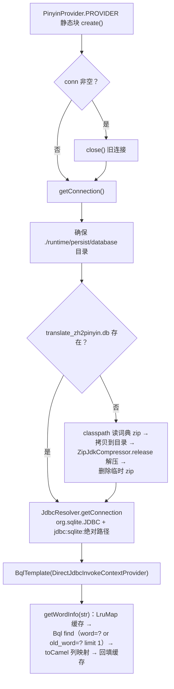
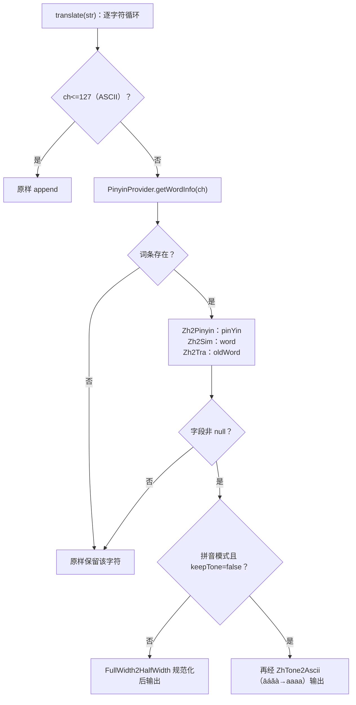

# i2f-translate-zh2pinyin

> **中文→拼音 / 简繁双向转换的零配置翻译器——「ITranslator 三实现 + 内置 SQLite FTS3 词典 + 首用自动释放」**：全模块 **6 个源文件、369 行、3 个子包**（`i2f.translate.zh2pingyin.data` 1 文件 + `.impl` 4 文件 + `.test` 1 演示类，无 `src/test`），资源区 1 个词典 zip（431,171 字节 → 解压出 1,466,368 字节的 `translate_zh2pinyin.db`，FTS3 全文索引库）。五大成员：①`PinyinProvider`（121 行）——词典门面静态单例 `PROVIDER`（类加载静态块自动 `create()`；`create/destroy/getConnection/getWordInfo` 全 `synchronized`），首次使用把 classpath 词典 zip 释放到 `./runtime/persist/database/`（`ResourceUtil` 读流 + `ZipJdkCompressor.release` 解压 + 删临时 zip），经 `JdbcResolver` 建 SQLite 连接、`BqlTemplate.find` 执行 `select … where word=? or old_word=? limit 1`（`toCamel` 列名映射 → `Zh2PinyinVo`），8192 容量静态 `LruMap` 缓存，`ILifeCycle` 管理连接；②`Zh2PinyinTranslator`（54 行）——逐字符拼音转换：ASCII 直通、非 ASCII 查词典取 `pinYin` 经 `FullWidth2HalfWidthTranslator` 规范化；`keepTone=false` 时再经 `ZhTone2AsciiTranslator` 把声调符（āáǎà→aaaa）转纯 ASCII；③`Zh2SimTranslator`（43 行）——繁体→简体（取 `word` 字段）；④`Zh2TraTranslator`（43 行）——简体→繁体（取 `old_word` 字段）；⑤`Zh2PinyinVo`（20 行）——词条载体（id/word/oldWord/strokeNum/pinYin/radicals）。
>
> **消费现状（全仓零消费的「能力先行」模块）**：全仓 **0 个模块、0 个文件**引用本模块任何类——grep 精确检索（13 命中全部在模块内）、PowerShell 全仓 `*.java/*.xml/*.md` 扫描（排除自身）、`*.properties/*.json/*.yml/*.ts/*.js/*.vue/*.txt` 非 Java 扫描三路均为零源码命中；POM 侧无任何模块声明本模块依赖（`i2f-jdk-all` 聚合收录 :579-582、根 POM 版本管理 :824-828、`i2f-jdk` 模块清单 :158）。反向地，本模块作为**消费方**被 7 处上游模块 readme 记录（std-const 的 PERSIST 目录、compress-impl 解压词典、resources 资源加载、lifecycle 静态块 create、jdbc-bql `find`+`toCamel`、jdbc-impl 经传递链、text 隐性消费者）。发布产物 `i2f-translate-zh2pinyin-1.0-jdk8.jar`/`-jdk17.jar` 见 `bash/backup-*`、`bash/deploy-*` 四目录。
>
> ⚠ **主要风险**：**隐性依赖五连**——`i2f-bql`/`i2f-jdbc-impl`/`i2f-io-stream`/`i2f-lru-map`/`i2f-text` 均直接 import 却**未在 POM 声明**（全凭 `i2f-jdbc-bql → i2f-bql` 传递链）；**`sqlite-jdbc` 为 `provided`+`optional`**——运行期缺驱动使 `PROVIDER` 静态块初始化失败且**不可恢复**（类永久 erroneous，`NoClassDefFoundError` 无重试）；**三层静默失效链**——解压失败经 `printStackTrace` 静默、SQLite 空库自动建档、查询 `SQLException` 被空 catch 吞掉，叠加使翻译**全量退化为原样输出而无任何报错**；`getWordInfo` `synchronized` 使**缓存命中路径也全局串行**且**无负缓存**（不存在字符反复打库）；`LruMap` 名义 LRU 实为插入序 FIFO（`accessOrder` 默认 false）；`destroy()` 后再用即 NPE（`template` 置 null 无重建）；逐字符转换**多音字上下文无关**；FTS3 虚表仅当普通存储（MATCH 索引闲置）、`strokeNum`/`radicals` 元数据闲置。详见「模块瑕疵或错误」。

## 模块路径

- `i2f-jdk/i2f-translate-zh2pinyin`

## 模块依赖

| 依赖 | 坐标 | scope/optional | 用途 |
| --- | --- | --- | --- |
| `i2f-translate` | `i2f.turbo:i2f-translate` | 编译 | `ITranslator` 接口（extends `ILifeCycle`）；`FullWidth2HalfWidthTranslator`/`ZhTone2AsciiTranslator` 拼音规范化与去声调 |
| `i2f-jdbc-bql` | `i2f.turbo:i2f-jdbc-bql` | 编译 | `BqlTemplate.find(bql, clazz, mapper)` 查询词典；`Bql.$_()` 构建 SQL |
| `i2f-resources` | `i2f.turbo:i2f-resources` | 编译 | `getClasspathResourceAsStream` 加载词典 zip |
| `i2f-compress-impl` | `i2f.turbo:i2f-compress-impl` | 编译 | `ZipJdkCompressor.release(zip, dir)` 解压词典 |
| `i2f-std-const` | `i2f.turbo:i2f-std-const` | 编译 | `StdConst.RUNTIME_PERSIST_DIR`（`runtime/persist`）定位词典目录 |
| `i2f-lifecycle` | `i2f.turbo:i2f-lifecycle` | 编译 | `ILifeCycle`（create/destroy/close）生命周期契约 |
| `lombok` | `org.projectlombok:lombok` | 编译（注解） | `@Data`/`@NoArgsConstructor`（1 Vo + 4 主类） |
| `sqlite-jdbc` | `org.xerial:sqlite-jdbc:3.43.0.0` | **provided + optional** | SQLite JDBC 驱动（运行期需使用方提供） |

- **隐性依赖（未声明却直接 import）**：`i2f-bql`（`PinyinProvider.java:3` `Bql`）、`i2f-jdbc-impl`（`:6` `JdbcResolver`、`:8` `DirectJdbcInvokeContextProvider`）、`i2f-io-stream`（`:5` `StreamUtil`）、`i2f-lru-map`（`:10` `LruMap`）、`i2f-text`（`:13` `StringUtils`）——5 个均**未在 POM 声明**，靠 `i2f-jdbc-bql → i2f-bql →（i2f-lru-map / i2f-text …）`与 `i2f-jdbc-bql → i2f-jdbc-impl` 传递链编译（i2f-text readme 已记录本模块为「未直接声明却 import `StringUtils`」的隐性消费者）。上游依赖树调整即编译失败。
- 构建插件：仅 `maven-assembly-plugin`；版本继承 `i2f-jdk` parent（`1.0-jdk8`）；根 POM 版本管理（pom.xml:824-828）；`i2f-jdk-all` 聚合收录（i2f-jdk-all/pom.xml:579-582）；`i2f-jdk` 模块清单第 158 项（i2f-jdk/pom.xml:158，位于 i2f-translate-en2zh 与 i2f-tuple-impl 之间）。
- 无 `src/test`；资源 1 个：`src/main/resources/assets/database/translate_zh2pinyin.zip`（431,171 字节，单条目 `translate_zh2pinyin.db` 1,466,368 字节）。

## 模块设计

1. **类总览**：

主源码（5 文件 281 行）：

| 类 | 行数 | 包 | 职责 | 外部消费 |
| --- | --- | --- | --- | --- |
| `PinyinProvider` | 121 | `i2f.translate.zh2pingyin.impl` | 词典门面：静态单例 + zip 释放 + SQLite 连接 + 查询 + 缓存；`ILifeCycle` | 零 |
| `Zh2PinyinTranslator` | 54 | `i2f.translate.zh2pingyin.impl` | 中文→拼音（`keepTone` 双模式） | 零 |
| `Zh2SimTranslator` | 43 | `i2f.translate.zh2pingyin.impl` | 繁体→简体（取 `word`） | 零 |
| `Zh2TraTranslator` | 43 | `i2f.translate.zh2pingyin.impl` | 简体→繁体（取 `oldWord`） | 零 |
| `Zh2PinyinVo` | 20 | `i2f.translate.zh2pingyin.data` | 词条载体：id/word/oldWord/strokeNum/pinYin/radicals | 零 |

演示类（位于 `src/main`，无断言）：

| 类 | 行数 | 包 | 演示内容 |
| --- | --- | --- | --- |
| `TestTranslate` | 88 | `i2f.translate.zh2pingyin.test` | 三组演示：拼音（带调/ASCII 对照）+ 简→繁 + 繁→简 |

2. **词典加载与查询流程**（`PinyinProvider.java`，:32-120）：



3. **三翻译器同构处理链**（唯一差异：取字段 + 拼音后处理；`Zh2PinyinTranslator.java:23-52`）：



4. **包结构**：根包 `i2f.translate.zh2pingyin`（无直接类）→ `.data`（词条 Vo）→ `.impl`（Provider + 3 翻译器）→ `.test`（演示）；依赖方向单向、无循环。词典存储为 **SQLite FTS3 虚表**：`CREATE VIRTUAL TABLE translate_zh2pinyin using fts3 (id, word, old_word, stroke_num, pin_yin, radicals)`（库内含 `_segdir`/`_segments` 影子表与 `sqlite_autoindex`）。

## 模块目的

- **文本处理的拼音基础能力**：为搜索索引、拼音排序、URL slug、读音标注等场景提供「中文→拼音」的开箱转换（带声调/纯 ASCII 双模式）。
- **简繁双向转换**：同一词典同时服务繁体→简体与简体→繁体两个方向。
- **词典零配置交付**：词典以 zip 随 jar 分发、首用自动释放到工作目录（`runtime/persist`）——使用方零初始化代码。
- **契约统一**：以 `ITranslator` 与 i2f-translate 模块的其它翻译器（全角/半角、声调）同构，可组合、可互换。

## 模块功能

- **拼音转换**（`Zh2PinyinTranslator`）：`translate(String)` 逐字转拼音；`keepTone`（默认 true）保留声调符，false 输出纯 ASCII。
- **简繁互转**：`Zh2SimTranslator`（繁体→简体）、`Zh2TraTranslator`（简体→繁体）。
- **词条查询**（`PinyinProvider.getWordInfo`）：单字返回拼音/简体/繁体异体/笔画数/部首。
- **词典生命周期**（`ILifeCycle`）：静态单例自动 `create()`、手动 `destroy()` 释放 SQLite 连接。

## 模块主要使用方法

```java
// 1) 拼音（默认保留声调；词典 pin_yin 为带调格式 ǎ 等）
try (ITranslator py = new Zh2PinyinTranslator()) {
    System.out.println(py.translate("你好，这是一个拼音翻译测试！"));
}
// 2) ASCII 化拼音（keepTone=false → 声调符经 ZhTone2AsciiTranslator 去除）
new Zh2PinyinTranslator(false).translate("你好");
// 3) 繁体 → 简体（取 word 字段）
new Zh2SimTranslator().translate("妳好，這是一個拼音飜譯測試！");
// 4) 简体 → 繁体（取 oldWord 字段）
new Zh2TraTranslator().translate("你好，这是一个拼音翻译测试！");
// 5) 单字词条（笔画/部首元数据）
Zh2PinyinVo vo = PinyinProvider.PROVIDER.getWordInfo("好");
// vo.getPinYin() / getWord() / getOldWord() / getStrokeNum() / getRadicals()
// 6) 生命周期：静态单例随类加载自动 create；用毕销毁 SQLite 连接
PinyinProvider.PROVIDER.destroy();
```

注意事项：

- **运行期必须提供 SQLite 驱动**：`sqlite-jdbc` 为 `provided`+`optional`——使用方需自行引入 `org.xerial:sqlite-jdbc`；否则 `PinyinProvider` 首次触达即 `ExceptionInInitializerError`，此后该类永久不可用（`NoClassDefFoundError`，无法重试初始化）。
- **首用释放词典**：解压到 `./runtime/persist/database/translate_zh2pinyin.db`（相对 JVM 工作目录）——工作目录须可写。
- **逐字符处理**：以单字符粒度查词典——多音字固定取词条读音（无词组/上下文消歧）；词典未收录字符原样保留。
- **`translate(null/"")` 原样返回**；`getWordInfo` 查无返回 `null`（不抛异常）。
- **`destroy()` 后不可继续使用**：`template`/`conn` 置 null，再调用 `getWordInfo` 直接 NPE（需重新 `create()`；静态单例通常不这么做）。
- **全流程 `synchronized`**：缓存命中与 SQL 查询都串行——高并发场景注意吞吐（见瑕疵 5）。

## 模块特性总结

1. **词典资源化、零配置**：431KB zip（内含 1.4MB FTS3 库）随 jar 分发，首次使用自动释放——「引入即用」，无需任何初始化。
2. **一库三能力**：拼音 / 繁→简 / 简→繁三翻译器共享同一词典与静态缓存。
3. **拼音双模式**：`keepTone` 切换「带调符 ǎ」与「纯 ASCII」输出（基于 i2f-translate 的全角/声调映射表）。
4. **契约同构**：`ITranslator` + `ILifeCycle`——与 FullWidth2HalfWidth/ZhTone2Ascii 等翻译器完全同构。
5. **静态单例 + 进程级缓存**：`PROVIDER` 类加载即建、8192 条 `LruMap` 缓存——单进程内多次翻译仅首次触库。
6. **FTS3 全文索引存储**：词典表为 FTS3 虚表（含段落索引影子表）——具备全文检索扩展潜力（当前未利用）。
7. **消费为零的「能力先行」模块**：全仓无任何消费方——与 `i2f-translate-en2zh` 同为「先写工具、待落地」定位（对照 i2f-thread 仅 1 模块消费）。

## 模块瑕疵或错误

1. **隐性依赖五连（POM 未声明）**：PinyinProvider.java:3/5/6/8/10/13——`i2f-bql`（`Bql`）、`i2f-jdbc-impl`（`JdbcResolver`/`DirectJdbcInvokeContextProvider`）、`i2f-io-stream`（`StreamUtil`）、`i2f-lru-map`（`LruMap`）、`i2f-text`（`StringUtils`）全部直接使用却未声明，经 `i2f-jdbc-bql → i2f-bql` 传递链获得——上游依赖树一旦调整（如 i2f-bql 移除 i2f-text），本模块编译即断。
2. **`sqlite-jdbc` provided+optional 与「静态块自动初始化」设计冲突**：唯一运行期第三方驱动被标为可选+provided（pom.xml:51-57）——使用方忘引驱动时 `PinyinProvider` 静态块 `create()` 抛 `ExceptionInInitializerError`（PinyinProvider.java:34-37、70-95），且**类初始化失败不可恢复**——此后任何触达（含 `PROVIDER` 字段引用）抛 `NoClassDefFoundError`，必须重启 JVM。
3. **`getWordInfo` 静默吞 `SQLException`**：PinyinProvider.java:113-115 空 catch——查询失败与「查无此词」不可区分，无日志无异常，故障静默。
4. **「解压→建库→查询」三层静默失效链**：①AbsCompressor.release 的解包回调以 `printStackTrace` 吞掉写文件异常（compress-std:109-111）；②若词典解压失败/缺文件，`JdbcResolver` 打开不存在的 sqlite 路径会**自动创建空库**（jdbc:sqlite: 默认行为，PinyinProvider.java:93）——`dbFile.isFile()` 自此恒真、**永不重试解压**；③空库无表 → 查询 SQLException → 又走第 3 条空 catch——三层叠加使翻译**全面退化为原样输出，全程无任何报错提示**。另 `zipFile.delete()` 返回值未检查（:90）。
5. **全局串行 + 无负缓存**：`getWordInfo` 为 `public synchronized`（:97）——**缓存命中路径也在实例锁内**（LruMap 自身还有锁，双重加锁），全部翻译请求串行化，高并发场景吞吐瓶颈；未命中结果（`null`）不写缓存（:116-118）——不存在字符/标点每次翻译都实际执行一次 SQL 查询。
6. **`LruMap` 名义 LRU、实际 FIFO**：`new LruMap<>(1024*8)` 命中 `LruMap(int maxSize)` 构造器——`super()` 走 `LinkedHashMap` 默认 `accessOrder=false`，`removeEldestEntry` 按**插入顺序**淘汰（get 不提升热度）——「LRU 缓存」实为先进先出，长进程下热点字不保；且 `fastCacheMap` 为 `protected static`——跨全部翻译器实例共享、子类可直接改写（:39）。
7. **字符级转换、上下文无关**：逐 char 查表（`Zh2PinyinTranslator.java:30-50` 等）——多音字固定输出词典统一读音（TestTranslate 示例中的「哈/蛤、好/号、喝/盒/褐」恰是作者的多音字用例），无词组/上下文消歧；Unicode 扩展字符（emoji、生僻字）原样保留。
8. **`destroy()` 后继续使用即 NPE**：`destroy()` 置 `conn=null`、`template=null`（:57-68）——之后 `getWordInfo` 执行 `template.find(...)` 直接 NPE（空 catch 只捕 `SQLException` 捕不到 NPE）；静态单例无自动重建语义（须手动 `create()`）。
9. **FTS3 能力闲置 + 元数据闲置**：词典表为 `CREATE VIRTUAL TABLE … using fts3`（现库含 `_segdir`/`_segments` 影子表）但查询用 `word=? or old_word=?` 等值比较——FTS3 上不触发 `MATCH` 索引（按 `%_content` 影子表全表扫描），全文索引能力完全闲置；`stroke_num`/`radicals` 随 SQL 取回却从未被任何翻译器使用（Vo 仅暴露 getter）。
10. **零测试 + 演示类占用 main 源码树**：无 `src/test`；`TestTranslate`（88 行、3 组 `try-with-resources` 打印）为唯一验证载体且无断言——上述词典加载链、静默失效均无自动化防线。

## 消费现状与验证

- **Java 层消费**：**0 个模块、0 个文件、0 个调用点**——本模块 5 个公开类（Provider/3 翻译器/Vo）在全仓（除自身）**无任何 import 或调用**。
- **验证方法（三路）**：①`grep i2f.translate.zh2pingyin`——13 命中全部位于模块自身；②PowerShell 全仓 `*.java/*.xml/*.md`（排除本模块目录）扫描——仅命中文档/IDE 配置/聚合 POM（`.wiki`、`.idea`、i2f-jdk-all、根 POM 等），**零 `.java` 命中**；③`*.properties/*.factories/*.json/*.yml/*.yaml/*.ts/*.js/*.vue/*.txt` 全仓扫描——零命中（无 SPI/装配/脚本引用）。
- **POM 级消费**：无任何模块声明本模块依赖；`i2f-jdk-all` 聚合收录（:579-582）；根 POM 版本管理（:824-828）；`i2f-jdk` 模块清单（:158）。
- **反向消费（本模块作为消费方被上游 readme 记录）**：

| 上游模块 | 消费内容 | 记录位置 |
| --- | --- | --- |
| i2f-std-const | `RUNTIME_PERSIST_DIR` 定位词典目录 | readme.md:153 |
| i2f-compress-impl | `ZipJdkCompressor` 解压内置词典 zip | readme.md:113 |
| i2f-resources | `getClasspathResourceAsStream` 加载词典 | readme.md:310 |
| i2f-lifecycle | 静态单例静态块 `create()`（try-with-resources） | readme.md:168 |
| i2f-jdbc-bql | `find` + `toCamel` 列映射 | readme.md:265 |
| i2f-jdbc-impl | 经 i2f-jdbc-bql 传递消费 | readme.md:338 |
| i2f-text | 未声明却 import `StringUtils`（隐性消费者） | readme.md:207 |

- **wiki 侧引用**：`.wiki/docs/module-i2f-jdk.md:125`（「中文转拼音」）、`.wiki/wiki.md:95`（文本/国际化分类）。
- **发布产物**：`bash/backup-jdk8`、`bash/deploy-jdk8`、`bash/backup-jdk17`、`bash/deploy-jdk17` 四目录含 `i2f-translate-zh2pinyin-1.0-jdk8.jar`/`-jdk17.jar`。
- **平行模块**：同目录 `i2f-translate`（翻译基础设施：`ITranslator`/全半角/声调表）、`i2f-translate-en2zh`（英译中，同款 SQLite 词典模式）——三者构成翻译器系列：en2zh 与 zh2pinyin 互不依赖，但二者均依赖 i2f-translate 的 `ITranslator` 契约（本模块还调用其全角/半角与声调转换器）；本模块与二者均为「零/低消费」待落地状态。
