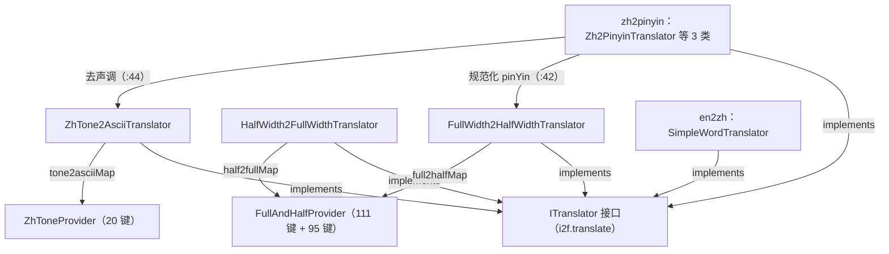
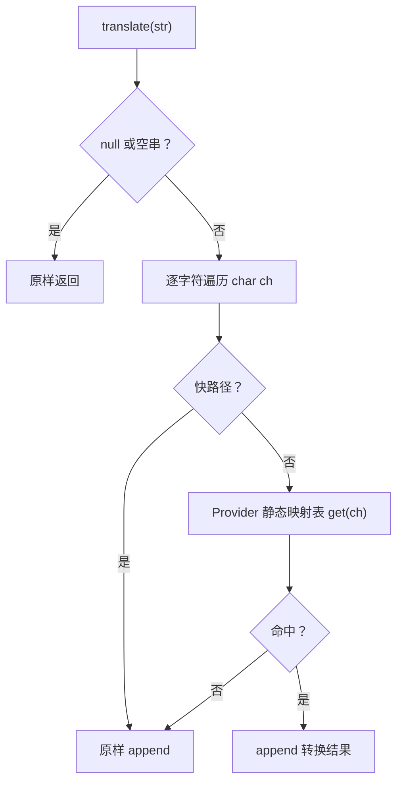

# i2f-translate

> **翻译器系列的「契约层 + 基础转换器」基础设施——「ITranslator 统一接口 + 全角/半角双向映射表 + 声调→ASCII 表」**：全模块 **6 个源文件、175 行、2 个包**（`i2f.translate` 1 接口 + `.impl` 5 文件，无 `src/test`、零资源）。六大成员：①`ITranslator`（11 行）——全系列统一翻译契约：`String translate(String)` + extends `ILifeCycle`（create/destroy/close 均 default 空实现——3 个纯函数实现零覆写）；②`FullWidth2HalfWidthTranslator`（35 行）——全角→半角：ASCII 直通、非 ASCII 查 `full2halfMap`（111 键）；③`HalfWidth2FullWidthTranslator`（35 行）——半角→全角：ASCII 查 `half2fullMap`（95 键、由前表 value→key 反转派生）、非 ASCII 直通；④`ZhTone2AsciiTranslator`（30 行）——声调字符→纯 ASCII 元音（20 键）；⑤`FullAndHalfProvider`（39 行）——映射数据：EN 段 95 字符对（小写 26 + 数字 10 + 大写 26 + IPA `ɡ`〔U+0261〕1 + 符号 32）+ ZH 段 35 字符对（全角空格〔U+3000〕、`·`、`￥`、`…`、`×`、`—`、`【】`、`‘’`、`“”`、`。`、`、`、`《》` 等中文标点），19 对重叠合并后 **full2halfMap 111 键**、反转后 **half2fullMap 95 键**；⑥`ZhToneProvider`（25 行）——`āáǎàōóǒòēéěèīíǐìūúǔù` → `aaaaooooeeeeiiiiuuuu`（20 对）。三个转换器均**无状态纯函数**（静态 `INSTANCE` 单例、无实例字段）。
>
> **消费现状（低消费但关键）**：全仓 **2 个模块 6 个文件 24 处行级引用**——`i2f-translate-zh2pinyin` 是**真实功能消费**（`Zh2PinyinTranslator.java:42` 以 `FullWidth2HalfWidthTranslator.INSTANCE.translate(pinYin)` 规范化词典读音、`:44` 以 `ZhTone2AsciiTranslator.INSTANCE.translate(pinYin)` 实现 `keepTone=false` 去声调；3 类实现 `ITranslator`）；`i2f-translate-en2zh` 实现 `ITranslator`（`SimpleWordTranslator.java:34`）。`ITranslator` 共被 **7 个类实现**（本模块 3 + en2zh 1 + zh2pinyin 3）；`HalfWidth2FullWidthTranslator` 为**零消费**类。POM 声明 2 处（en2zh / zh2pinyin `pom.xml:26-29`）均真实使用、无声明浪费；聚合 `i2f-jdk-all:571-574`、根 POM 版本管理 `:814-818`、模块清单 `i2f-jdk/pom.xml:156`。
>
> ⚠ **主要风险**：`half2fullMap` **反转非双射**——111 个全角键 → 95 个半角值：`'`/`"` 各有 3 个全角候选（＇‘’/＂“”）、`g`/`_`/`^`/`*`/`$`/`[`/`]`/`` ` ``/`.`/`/`/`<`/`>` 各 2 个候选（共 14 个字符），半角→全角的实际产出由 **HashMap 迭代顺序**决定（`FullAndHalfProvider.java:32-38`）；ZH 段映射**语义激进**（`…`→`^`、`×`→`*`、`—`→`_`、`、`→`/`、`。`→`.`、`《》`→`<>`、`【】`→`[]`、`￥`→`$`）——归一化同时损失中文语义；声调表**未覆盖 ü 系**（ǖǘǚǜ）——带调 ü 的拼音在 `keepTone=false` 时不会去调；`ZhTone2AsciiTranslator` 无 ASCII 快路径且以 `ch+""` 每字符新建 String 查询；`lombok` 依赖**声明零使用**（6 文件扫描 0 命中）；`ITranslator` 零 Javadoc；零测试。详见「模块瑕疵或错误」。

## 模块路径

- `i2f-jdk/i2f-translate`

## 模块依赖

| 依赖 | 坐标 | scope/optional | 用途 |
| --- | --- | --- | --- |
| `i2f-lifecycle` | `i2f.turbo:i2f-lifecycle` | 编译 | `ILifeCycle`（create/destroy/close）——`ITranslator` 继承之 |
| `lombok` | `org.projectlombok:lombok` | 编译（注解） | **声明未使用**——6 个源文件零 lombok 注解/import（en2zh/zh2pinyin 同款模块均用 `@Data`，本模块为脚手架遗留） |

- 构建插件：仅 `maven-assembly-plugin`；版本继承 `i2f-jdk` parent（`1.0-jdk8`）；根 POM 版本管理（pom.xml:814-818）；`i2f-jdk-all` 聚合收录（i2f-jdk-all/pom.xml:571-574）；`i2f-jdk` 模块清单第 156 项（i2f-jdk/pom.xml:156，位于 i2f-trace-mdc 与 i2f-translate-en2zh 之间）。
- 无 `src/test`、零资源、零配置文件；6 个源文件全部位于 `src/main/java`。

## 模块设计

1. **类总览**（6 文件 175 行）：

| 类 | 行数 | 包 | 职责 | 外部消费 |
| --- | --- | --- | --- | --- |
| `ITranslator` | 11 | `i2f.translate` | 统一翻译契约：`translate(String)` + extends `ILifeCycle` | 2 模块 7 实现类 |
| `FullWidth2HalfWidthTranslator` | 35 | `i2f.translate.impl` | 全角→半角（111 键表 + ASCII 快路径，单例 `INSTANCE`） | zh2pinyin（:42 真实调用） |
| `HalfWidth2FullWidthTranslator` | 35 | `i2f.translate.impl` | 半角→全角（95 键反转表 + ASCII 快路径，单例 `INSTANCE`） | 零 |
| `ZhTone2AsciiTranslator` | 30 | `i2f.translate.impl` | 声调字符→ASCII 元音（20 键表，单例 `INSTANCE`） | zh2pinyin（:44 真实调用） |
| `FullAndHalfProvider` | 39 | `i2f.translate.impl` | EN/ZH 映射数据：full2halfMap（111 键）+ half2fullMap（95 键反转） | 本模块转换器 |
| `ZhToneProvider` | 25 | `i2f.translate.impl` | 声调映射数据：tone2asciiMap（20 键） | 本模块转换器 |

2. **架构与消费关系**：



3. **转换流程**（三转换器同一模式：null/空串短路 → 快路径分流 → 逐字符查表）：



- **快路径差异**：`FullWidth2HalfWidthTranslator` 对 `ch <= 127` 直通（只查非 ASCII）；`HalfWidth2FullWidthTranslator` 对 `ch <= 127` 查表、非 ASCII 直通；`ZhTone2AsciiTranslator` **无快路径**（全字符无条件查表）。
- 三个转换器均为**无状态纯函数**：无实例字段、方法内无共享可变状态——静态 `INSTANCE` 单例线程安全，也可 `new` 等价使用；`create()/destroy()/close()` 全部继承 `ILifeCycle` 空默认。

4. **映射表构成**（`FullAndHalfProvider.java:14-38`，EN/ZH 两段逐位对齐拼接）：

| 映射表 | 规模 | 内容 |
| --- | --- | --- |
| `full2halfMap` | **111 键** | EN 段 95 对（小写 26 + 数字 10 + 大写 26 + IPA `ɡ`〔U+0261〕1 + 符号 32：`` ｀～！＠＃＄％＾＆＊（）＿＋－＝［］＼｛｝｜；＇：＂，．／＜＞？ ``）+ ZH 段 35 对（全角空格〔U+3000〕+ `·～！＠＃￥％…＆×（）—＋－＝【】＼｛｝｜；‘’：“”，。、《》？`），19 对重叠（全角标点两段同映射）合并 |
| `half2fullMap` | **95 键** | 由 `full2halfMap` 的 value→key 反转派生——111 个全角键映射到 95 个半角值，**16 个多余键被静默覆盖**：14 个半角字符存在多候选全角源 |
| `tone2asciiMap` | **20 键** | `āáǎà→aaaa`、`ōóǒò→oooo`、`ēéěè→eeee`、`īíǐì→iiii`、`ūúǔù→uuuu` |

- **特殊映射样例**：`ɡ`（U+0261，IPA 拉丁 script g）→`g`；全角空格 `　`→半角空格；`·`（U+00B7）↔`` ` ``；`￥`→`$`；`…`→`^`；`×`→`*`；`—`→`_`；`、`→`/`；`。`→`.`；`《》`→`<>`；`【】`→`[]`；`‘’`→`'`；`“”`→`"`。
- 两表均为 `Collections.unmodifiableMap(((Supplier<Map<String, String>>) () -> { ... }).get())` 立即执行构造（等效静态块）；键为单字符 String（查询时以 `ch + ""` 生成）。

5. **包结构**：`i2f.translate`（契约）→ `i2f.translate.impl`（3 转换器 + 2 Provider）；依赖方向单向：`.impl → 根包`、转换器 → Provider、消费方 → 契约；无循环、无第三方运行时依赖（`i2f-lifecycle` 仅为契约继承）。

## 模块目的

- **契约统一**：为翻译器系列（en2zh / zh2pinyin / 自定义实现）提供统一的 `ITranslator` 接口与 `ILifeCycle` 生命周期桥接——「可组合、可互换」。
- **基础文本归一化能力**：全角/半角双向映射（英文字母、数字、符号 + 中文习惯标点）与声调字符 ASCII 化——面向拼音处理、文本清洗、标识符规范化等场景。
- **拼音后处理组件**：作为 zh2pinyin 的配套——词典读音全角规范化 + `keepTone=false` 去声调（本模块当前唯一真实功能消费）。
- **资源型实现预留**：通过 `ILifeCycle` 为需要管理资源（如数据库连接）的翻译器实现预留 `create()/destroy()` 钩子；纯函数实现零成本继承。

## 模块功能

- **统一翻译契约**（`ITranslator`）：`translate(String)`——null/空串原样返回（各实现约定一致）；继承 `ILifeCycle` 的 `create()/destroy()/close()` 空默认。
- **全角→半角**（`FullWidth2HalfWidthTranslator.INSTANCE`）：ASCII 直通、其余查 111 键表、未命中原样保留。
- **半角→全角**（`HalfWidth2FullWidthTranslator.INSTANCE`）：ASCII 查 95 键反转表、非 ASCII 直通、未命中原样保留。
- **声调→ASCII**（`ZhTone2AsciiTranslator.INSTANCE`）：20 个带调元音字符 → 对应无调元音，其余字符原样。
- **映射数据只读访问**：`FullAndHalfProvider.full2halfMap/half2fullMap`、`ZhToneProvider.tone2asciiMap` 均为 `public static final` 不可变 Map，可供外部直接读取。

## 模块主要使用方法

```java
// 1) 全角 → 半角（ASCII 直通、非 ASCII 查表）
String half = FullWidth2HalfWidthTranslator.INSTANCE.translate("Ｈｅｌｌｏ　Ｗｏｒｌｄ！");
// → "Hello World!"

// 2) 半角 → 全角（ASCII 查表、非 ASCII 直通；注意 14 个字符的反转歧义）
String full = HalfWidth2FullWidthTranslator.INSTANCE.translate("Hello World!");
// → "Ｈｅｌｌｏ　Ｗｏｒｌｄ！"

// 3) 声调 → 纯 ASCII
String ascii = ZhTone2AsciiTranslator.INSTANCE.translate("māma nǐ hǎo");
// → "mama ni hao"

// 4) 以 ITranslator 契约统一消费（与 en2zh/zh2pinyin 翻译器互换）
ITranslator t = FullWidth2HalfWidthTranslator.INSTANCE;
t.translate("１２３ａｂｃ"); // → "123abc"

// 5) 也可直接 new（无状态，实例等价于 INSTANCE）
new HalfWidth2FullWidthTranslator().translate("abc"); // → "ａｂｃ"
```

注意事项：

- **无状态线程安全**：三个转换器无实例字段——`INSTANCE` 可直接跨线程共享；`create()/destroy()` 无需调用。
- **null/空串原样返回**；未覆盖字符（emoji、拉丁扩展、汉字等）一律原样保留。
- **反转歧义（半角→全角）**：`'`、`"`、`g`、`_`、`^`、`*`、`$`、`[`、`]`、`` ` ``、`.`、`/`、`<`、`>` 共 14 个字符存在多个全角候选，实际产出取决于 HashMap 迭代顺序——涉及这些字符的场景避免依赖 `HalfWidth2FullWidthTranslator` 的确定性。
- **ZH 标点映射为激进归一化**：`…→^`、`×→*`、`—→_`、`、→/`、`。→.`、`《》→<>`、`【】→[]`、`￥→$` 属有损转换（语义漂移），中文文本慎用。
- **声调表不含 ü 系**：`ǖǘǚǜ` 等未收录——`keepTone=false` 去调不完整的场景需注意。
- **映射表为字符串键**：查询以 `ch + ""` 生成单字符 String（每次分配）——超高吞吐场景可留意。

## 模块特性总结

1. **契约统一**：`ITranslator` 被 3 个模块 7 个类实现（本模块 3 + en2zh 1 + zh2pinyin 3）——翻译器全系列同构、可组合可互换。
2. **纯函数无状态**：三个转换器无线程共享可变状态——静态 `INSTANCE` 单例即全功能，线程安全零管理。
3. **表驱动实现**：转换即逐字符查表——数据（Provider 静态 Map）即功能，逻辑极薄（35/35/30 行）。
4. **双向映射对**：full2halfMap 111 键（EN/ZH 两段拼接 + 19 重叠合并）、half2fullMap 95 键反转派生——一对数据支撑两个方向。
5. **快路径分流**：Width 双向转换器均以 `ch <= 127` 判定 ASCII 直通——半角/全角文本混合场景开销低。
6. **IPA 兼容**：EN 段补充 `ɡ`（U+0261）→`g` 映射——覆盖国际音标字符的归一化。
7. **真实落地消费**：zh2pinyin 以本模块完成词典读音规范化与去声调（:42/:44）——非「纯待落地」模块。
8. **极简依赖**：唯一功能依赖 `i2f-lifecycle`（契约继承）；零资源、零配置、零测试（无 `src/test`）。

## 模块瑕疵或错误

1. **`half2fullMap` 反转非双射——14 个半角字符的全角目标是「HashMap 迭代顺序决定」**：`FullAndHalfProvider.java:32-38` 以 `full2halfMap` 的 value→key 反转构造 half2fullMap——111 个全角键仅 95 个半角值（16 个多余键被静默覆盖）。`'`/`"` 各有 3 个候选（＇‘’/＂“”），`g`（ｇ/ɡ）、`_`（＿/—）、`^`（＾/…）、`*`（＊/×）、`$`（＄/￥）、`[`/`]`（［【 / ］】）、`` ` ``（｀/·）、`.`（．/。）、`/`（／/、）、`<`/`>`（＜《 / ＞》）各 2 个候选——半角→全角产出哪个不可预期（如 `_` 可能变 `—`、`"` 可能变 `“`）；同进程内稳定、跨 JDK 实现无保证；且 full→half→full 往返不还原。
2. **ZH 段「激进归一化」映射损失中文语义**：`…→^`、`×→*`、`—→_`、`、→/`、`。→.`、`《》→<>`、`【】→[]`、`￥→$`、`·→`` ` ``（FullAndHalfProvider.java:17）——中文标点被映射为语义无关 ASCII 符号（如 `、` 与 `/` 混淆、`—` 与 `_` 混淆），作为「全角半角转换」已超出宽度归一化范畴，对中文文本是有损转换。
3. **声调表未覆盖 ü 系**：`ZhToneProvider.java:14` TONE 表仅 20 字符（`āáǎà ōóǒò ēéěè īíǐì ūúǔù`）——`ǖǘǚǜ`（及 `ê/ḿ/ń` 等）不在表中；若上游数据以带调 ü 形式出现，`ZhTone2AsciiTranslator` 不转换——zh2pinyin `keepTone=false` 的「纯 ASCII 输出」承诺会因此破损。
4. **`ZhTone2AsciiTranslator` 无快路径 + 字符串键查询**：`ZhTone2AsciiTranslator.java:20-27` 对所有字符（含 ASCII）无条件执行 `tone2asciiMap.get(ch + "")`——对比两个 Width 转换器均有 `ch <= 127` 快路径；且 `ch + ""` 每字符新建 String（堆分配 + hashCode），三转换器同款（:21/:22/:24）。
5. **`lombok` 依赖声明零使用**：`pom.xml:15-18` 声明 lombok 但 6 个源文件**无任何 lombok 注解或 import**（扫描实测 0 命中）——同系列 en2zh/zh2pinyin 均用 `@Data`/`@NoArgsConstructor`，本模块为脚手架遗留的无效依赖声明（传递依赖污染）。
6. **`ITranslator` 契约零 Javadoc**：`ITranslator.java:5-11` 无方法文档——`translate` 的 null/空串语义、异常语义全靠实现类自行约定（当前 3 实现 + 4 外部实现恰好一致，但无强制）；接口注释仅为 `@author/@date` 模板。
7. **零测试**：无 `src/test` 目录、无断言——映射表（111/95 键、反转歧义、20 键声调）这样的**数据资产**全无自动化防线；两处外部消费的兼容性回归亦无保护。

## 消费现状与验证

- **Java 层消费**：**2 个模块 6 个文件 24 处行级引用**：
  - `i2f-translate-zh2pinyin`（4 文件 18 处）：`Zh2PinyinTranslator.java:3/4/5/16`（import×3 + implements）→ `:42` `FullWidth2HalfWidthTranslator.INSTANCE.translate(pinYin)` 规范化词典读音、`:44` `ZhTone2AsciiTranslator.INSTANCE.translate(pinYin)` 去声调；`Zh2SimTranslator.java:3/14`、`Zh2TraTranslator.java:3/14`（implements）；`test/TestTranslate.java:4/21/22/28/44/45/65/66`（8 处）。
  - `i2f-translate-en2zh`（2 文件 6 处）：`SimpleWordTranslator.java:14/34`（import + implements）；`test/TestTranslate.java:7/32/43/57`（4 处）。
- **ITranslator 实现类分布**：共 7 个——本模块 3（三个转换器）+ zh2pinyin 3（`Zh2PinyinTranslator`/`Zh2SimTranslator`/`Zh2TraTranslator`）+ en2zh 1（`SimpleWordTranslator`）。
- **零消费类**：`HalfWidth2FullWidthTranslator`——全仓（除自身定义）无任何 import/调用。
- **验证方法（双路）**：①grep `i2f\.translate`——52 处命中：本模块 9（自身定义）+ en2zh 7 + zh2pinyin 19（含两模块自身包路径）+ `.wiki` 文档 16 + 生成器模板 1，全部可解释、无遗漏消费方；②PowerShell 全仓（排除 target/.git）独立模块名 `i2f-translate(?!-)`——24 处命中：POM 6（聚合/清单/版本管理/自身/2 消费声明）+ `.wiki` 14 + `.idea` 4（IDE 工程登记）。
- **POM 级消费**：声明依赖本模块的仅 2 处（`i2f-translate-en2zh/pom.xml:26-29`、`i2f-translate-zh2pinyin/pom.xml:26-29`）——均有真实源码使用（无「声明未使用」浪费）；聚合 `i2f-jdk-all/pom.xml:571-574`、根 POM `:814-818`、`i2f-jdk/pom.xml:156`。
- **反向记录（上游模块 readme 对本模块的记载）**：

| 记录方 | 记录内容 | 位置 |
| --- | --- | --- |
| i2f-lifecycle | `ITranslator` 继承 `ILifeCycle`、实现零覆写（:166）；失败信号约定未遵守（:193） | readme.md:3/166/193 |
| i2f-translate-zh2pinyin | 依赖表「编译」行；契约同构特性；拼音双模式基于本模块映射表 | readme.md:17/91/133/171 |
| i2f-translate-en2zh | 依赖表「编译」行；契约统一特性；平行模块互记 | readme.md:17/114/210 |

- **wiki 侧引用**：`.wiki/docs/module-i2f-jdk.md:123`（「翻译抽象」）、`.wiki/wiki.md:95`（文本/国际化分类）。
- **发布产物**：`bash/backup-jdk8`、`bash/deploy-jdk8`、`bash/backup-jdk17`、`bash/deploy-jdk17` 四目录含 `i2f-translate-1.0-jdk8.jar`/`-jdk17.jar`。
- **IDE 工程登记**：`.idea/compiler.xml`（模块注册 :129/:172/:268）、`.idea/encodings.xml`（:462-463 UTF-8 目录声明）。
