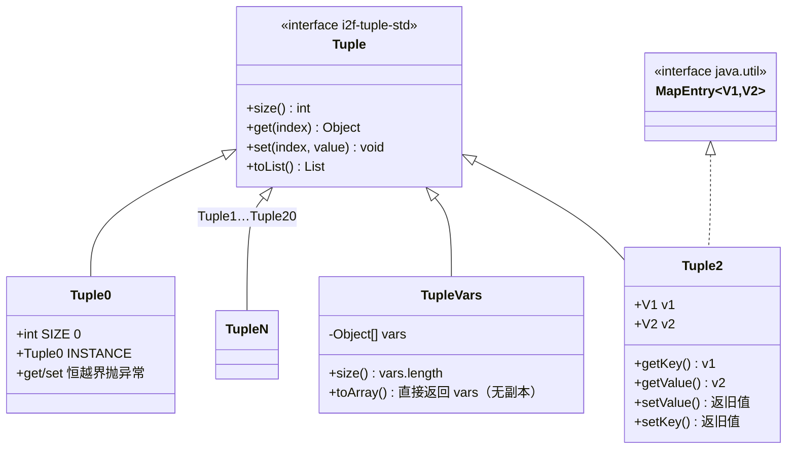
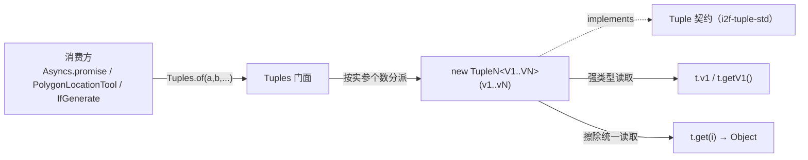

# i2f-tuple-impl

> 元组**强类型实现家族**（tuple-impl），是契约 `i2f-tuple-std.Tuple` 的落地。以「一档 arity 一个类」的模板化方式生成 `Tuple0`…`Tuple20` 共 21 个定长元组，外加承载变长的 `TupleVars`，并由门面 `Tuples.of(...)` / `Tuples.ofVars(...)` 按重载推断产出对应强类型实例。每档元组是一个 `@Data` POJO，把 N 个类型参数存为**具名强类型字段** `v1..vN`（可直接 `t.v1` 或 lombok `getV1()` 访问），同时实现 `Tuple` 的 `size()/get(int)/set(int,Object)/toList()` 擦除统一路径（`switch` 硬编码 + 越界抛异常）。它解决的正是 Java 缺失的「多返回值 / 异质值打包」——最典型的落地是 `i2f-thread` 的 `Asyncs.promise(s1, s2, …)`：并发跑多个 `Supplier` 再把各自结果装配进 `TupleN` 一次性返回。依赖上游 `i2f-tuple-std`（契约）与 `lombok`（`@Data`，本模块真实使用）。

## 模块路径

- `i2f-jdk/i2f-tuple-impl`

## 模块依赖

| GroupId | ArtifactId | Scope | Optional | 来源 | 用途 |
| --- | --- | --- | --- | --- | --- |
| i2f.turbo | i2f-tuple-std | compile | 否 | 内部 | 提供被实现的契约接口 `i2f.type.tuple.std.Tuple` |
| org.projectlombok | lombok | provided | true | 三方（版本由父 POM 托管） | `@Data` 生成 getter/setter/equals/hashCode/toString（本模块真实使用，与 `std` 中「声明却未用」相反） |

- 父 POM：`i2f.turbo:i2f-jdk:1.0-jdk8`；`artifactId` 为 `i2f-tuple-impl`，`version` 由父托管。
- `build` 段仅 `maven-assembly-plugin`（全仓库统一打包约定）。
- 经 `i2f-tuple-std` 间接依赖仅 JDK（`Tuple` 本身无内部依赖）；运行期实际只用到 JDK 的 `java.util.{List,ArrayList,Arrays}`、`java.io.Serializable`——**零三方运行期依赖**。

## 模块设计

### 1. 一 arity 一类的模板家族

`Tuple1`…`Tuple20` 结构完全同构（可视为代码生成产物），每档包含：

| 组成 | 实现 |
| --- | --- |
| 类声明 | `@Data public class TupleN<V1..VN> implements Tuple`（仅 `Tuple2` 额外 `implements Map.Entry<V1,V2>`） |
| 尺寸常量 | `public static final int SIZE = N` |
| 具名字段 | `public V1 v1; … public VN vN;`（公开、强类型） |
| 构造器 | 无参 + **前缀 telescoping** 共 N+1 个：`TupleN()`、`TupleN(v1)`、`TupleN(v1,v2)` … `TupleN(v1..vN)`，未填的高位字段留 `null` |
| `size()` | 直接返回 `SIZE` 常量 |
| `get(int)` | 先 `index>=SIZE||index<0` 越界抛 `IndexOutOfBoundsException`，再 `switch` 到 `case 0..N-1` 返回 `v1..vN` |
| `set(int,Object)` | 同样越界检查，`switch` 分派并对目标字段做 `(Vi) value` **非受检强转** |
| `toList()` | `new ArrayList<>(Arrays.asList(v1..vN))`（新建可变副本） |

> `get(int)` 用 **0 基下标**，字段却是 **1 基命名**（`v1..vN`）：`get(0)` 对应 `v1`。这是「擦除统一路径」与「强类型字段」两套寻址的固有偏移，需在脑内对齐。

### 2. 两档特例



- **`Tuple0`**：`SIZE=0`、无字段、暴露单例 `INSTANCE`；`get/set` 因 `index>=0` 恒成立而对**任何下标**抛异常；`toList()` 返回空 `ArrayList`。用于「有元组形状但零元素」的占位。
- **`Tuple2`**：唯一叠加 `Map.Entry<V1,V2>` 的一档——`getKey()=v1`、`getValue()=v2`、`setValue()` 返回旧值并写入 `v2`、另加 `setKey()` 返回旧值写 `v1`。使「二元组」天然可当「键值对」塞进 `Map` 相关 API。
- **`TupleVars`**：唯一非 `@Data` 者，用 `Object[] vars` 承载**不定 arity**（>20 或运行期才知长度）；覆写 `isEmpty()`（判 `vars.length`）与 `toArray()`（**直接返回内部 `vars`，不做防御拷贝**）。

### 3. 工厂门面 `Tuples`

`i2f.type.tuple.Tuples` 提供 `of()`（返回 `Tuple0.INSTANCE`）、`of(v1)`…`of(v1..v20)` 共 21 个静态重载与 `ofVars(Object...)`，按实参个数在编译期分派到对应强类型元组构造器。这是消费方的主入口——免去手写 `new TupleN<>(...)` 与冗长泛型实参。



### 4. 包结构

- `i2f.type.tuple`：仅 `Tuples`（门面）。
- `i2f.type.tuple.impl`：`Tuple0`…`Tuple20` + `TupleVars`（实现）。

## 模块目的

- 用编译期确定的强类型字段 `v1..vN` 为「多返回值 / 异质打包」提供**类型安全**的载体（`t.v1` 即得声明类型，无需强转），同时向上兼容 `Tuple` 契约供**泛化遍历/序列化**。
- 以模板化的一 arity 一类规避 Java 无原生元组的语言缺口，并覆盖到 20 元这一极宽上限；超出者落 `TupleVars`。
- 让 `Tuples.of(...)` 成为唯一记忆点：调用方只按「传几个值」思考，工厂负责选类。

## 模块功能

| 能力 | 由何提供 | 说明 |
| --- | --- | --- |
| 定长强类型元组 | `Tuple1`…`Tuple20` | 具名字段 `v1..vN` + lombok 访问器 |
| 零长占位元组 | `Tuple0`（`INSTANCE`） | 形状存在、无元素 |
| 变长元组 | `TupleVars` | `Object[]` 承载不定 arity |
| 键值对两用 | `Tuple2 implements Map.Entry` | 可直接参与 Map 语义 |
| 统一构造入口 | `Tuples.of(...)/ofVars(...)` | 编译期按实参数分派 |
| 擦除统一访问 | 实现 `Tuple.get/set/size/toList` | 泛化遍历/转集合/序列化 |
| 并发多返回值装配 | 供 `i2f-thread Asyncs.promise` 等使用 | 见「使用方法」 |

## 模块主要使用方法

**① 直接构造 / 工厂产出，走强类型字段**

```java
Tuple2<String, Integer> t = Tuples.of("age", 18);
String key = t.v1;        // 或 t.getKey()（亦是 Map.Entry）/ t.getV1()
int    val = t.v2;        // 或 t.getValue()
t.setV2(20);              // @Data 生成的 setter，元组可变

// Tuple2 直接当 Map.Entry 用
entrySet.add(Tuples.of(k, v));
```

**② 变长 / 超 20 元用 `TupleVars`**

```java
Tuple vars = Tuples.ofVars(1, "two", 3.0, true);
for (Object o : vars) { System.out.println(o); } // 走 Tuple 默认 iterator()
Object second = vars.get(1);
```

**③ 并发多返回值装配（本家族最典型落地，`i2f-thread/Asyncs`）**

```java
// 三个 Supplier 并发执行，结果装配为 Tuple3 一次性返回
Tuple3<User, Order, Stat> r =
    Asyncs.promise(() -> loadUser(id), () -> loadOrder(id), () -> loadStat(id));
User u = r.v1; Order o = r.v2; Stat s = r.v3;
```

**④ 泛化处理任意 arity（以 `Tuple` 为形参，向上转型）**

```java
void print(Tuple tuple) {           // 需 import i2f-tuple-std 的 Tuple
    int n = tuple.size();
    for (int i = 0; i < n; i++) System.out.println(tuple.get(i));
}
```

### 注意事项

- **`size()` 是「声明元数」而非「已填个数」**：`new Tuple20(a)` 或 `Tuples` 未覆盖的部分构造，只填 `v1`，其余 `v2..v20` 为 `null`，但 `size()` 仍返回 `20`、`toList()` 产出 `[a, null×19]`。不存在「部分填充的短元组」概念。
- **元组实例可变、非线程安全**：字段 `public` 且 `@Data` 生成 setter，`set(int,Object)` 亦可改；「tuple」在此仅是打包结构，不承诺不可变性，跨线程共享需自行同步。
- **`set(int, Object)`/`get(int)` 是非受检擦除路径**：以 `Tuple` 引用 `set(0, 其它类型)` 只在后续读取处抛 `ClassCastException`（堆污染）；类型安全只在直接用 `t.v1`/`getV1` 时成立。
- **`TupleVars.toArray()` 直接返回内部数组**（无防御拷贝），改返回数组会写回元组；其 `toList()` 反而做拷贝——两者一致性相反，需警惕。
- **`equals/hashCode` 由 `@Data` 按类生成**：不同 arity 的元组（如 `Tuple2` 与 `Tuple3`）即便值前缀相同也不相等，跨类无结构等价。

## 模块特性总结

- **模板化定长家族**：`Tuple0…Tuple20` 同构，具名强类型字段带来 `t.vN` 直读的类型安全。
- **契约 + 强类型双轨**：向上 `implements Tuple` 供泛化遍历/序列化，向下保留 `v1..vN`/`getVN()` 精确访问。
- **两个精心特例**：`Tuple0.INSTANCE` 零元占位、`Tuple2` 兼任 `Map.Entry`；`TupleVars` 兜底变长。
- **单一工厂 `Tuples.of`**：以重载做编译期 arity 分派，屏蔽 `new TupleN<>` 与泛型样板。
- **依赖轻**：仅 `i2f-tuple-std` + `lombok`（provided），零三方运行期。

## 已知实现瑕疵

1. **`size()`/`toList()` 语义为「声明元数」，前缀构造留下大量 `null`**：`Tuple20` 的 telescoping 构造器只填低位、高位默认 `null`，但 `size()` 恒为 20、`toList()` 含 `null` 占位，易被误当作「实际元素个数」。
2. **不可变性缺失**：`public` 字段 + `@Data` setter + `set(int,Object)` 三处皆可改，元组实为可变对象，与常见「tuple 不可变」直觉相悖；`Tuple0.INSTANCE` 为共享单例虽无字段，但风格上家族整体非不可变。
3. **`TupleVars.toArray()` 暴露内部数组**（无 `clone`）且其构造器按引用持有传入 `varargs` 数组，外部改动可穿透进元组；与 `toList()`（做拷贝）行为不一致。
4. **`get/set(int,Object)` 非受检强转 `(Vi) value`**：泛化写入类型不符延迟到读取抛 `CCE`（承袭 `Tuple` 契约擦除，实现层未加任何运行时类型校验）。
5. **下标/字段命名偏移**：`get(0)`↔`v1`（0 基 vs 1 基），两套寻址并存，跨用易 off-by-one。
6. **代码规模随 arity 平方膨胀**：telescoping 构造器使 `Tuple20` 达 446 行（多为构造器与 `switch` 分支），属模板生成的固有冗余，非缺陷但维护/审阅成本高。

## 下游与关联

- **上游契约**：`i2f-tuple-std`（`Tuple`）——本模块所有实现类 `implements` 之。
- **主要消费者**：
  - `i2f-thread`：`Asyncs.promise(...)`（本家族最大用户，1..N 元并发多返回值装配至 `Tuple1…TupleN`）、`sync/ProcessTaskRunner`（`Tuple2`）。
  - `i2f-graphics-2d`：`polygon/PolygonLocationTool`（`Tuple2` + `Tuples`）。
  - `i2f-template-render`：`core/impl/IfGenerate`（`Tuple2`/`Tuple3`）。
- **聚合引入**：经 `i2f-jdk-all` 聚合 POM；版本由根 POM `dependencyManagement` 托管。
