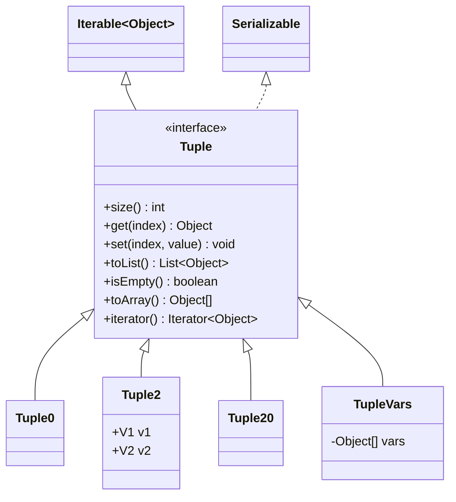
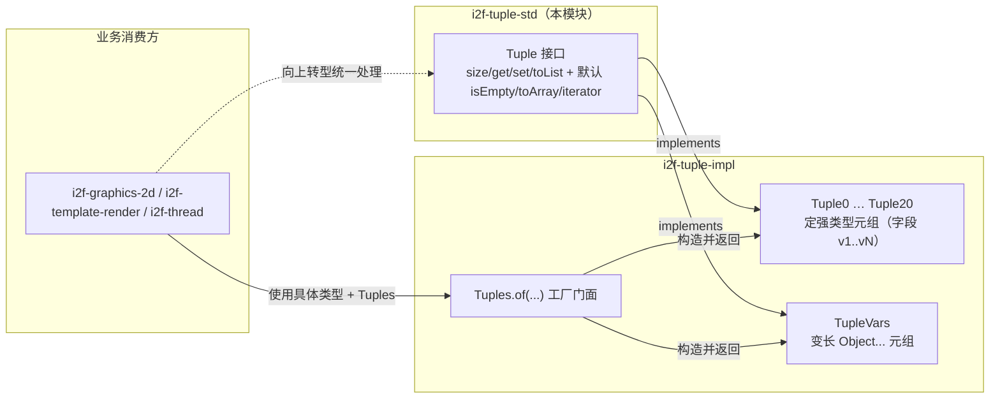

# i2f-tuple-std

> 元组**标准契约层**（tuple-std）。延续 `i2f-ai-std`/`i2f-clock-std`/`i2f-codec-std` 的「契约与实现分离」范式，本模块**只有一个接口** `i2f.type.tuple.std.Tuple`——它以 `extends Iterable<Object>, Serializable` 定义了「一组定长/变长、可按下标读写的异质值容器」的最小公共契约：`size()`/`get(int)`/`set(int,Object)`/`toList()` 四个抽象方法刻画「索引化多值」本质，再用三个 `default`（`isEmpty()`、`toArray()`、`iterator()`）在契约层就派生出「判空、转数组、可 for-each 遍历」，使所有元组实现天然可迭代、可序列化、可转集合。真正的 `Tuple0`…`Tuple20`、`TupleVars` 及 `Tuples.of(...)` 工厂全部下沉到 `i2f-tuple-impl`，消费方拿到的是具体强类型元组，而 `Tuple` 作为共同父类型为「泛化地处理任意元组」提供抽象锚点。自身零 i2f 内部依赖。

## 模块路径

- `i2f-jdk/i2f-tuple-std`

## 模块依赖

| GroupId | ArtifactId | Scope | Optional | 来源 | 用途 |
| --- | --- | --- | --- | --- | --- |
| （无） | | | | | 无任何 i2f 内部依赖 |
| org.projectlombok | lombok | provided | true | 三方（版本由父 POM 托管） | **声明但实际未使用**——`Tuple` 是纯接口，未用任何 Lombok 注解（见「已知实现瑕疵」） |

- 父 POM：`i2f.turbo:i2f-jdk:1.0-jdk8`；`groupId` 沿用 `i2f.turbo`，`artifactId` 为 `i2f-tuple-std`，`version` 由父托管。
- `build` 段仅声明 `maven-assembly-plugin`（与全仓库模块一致的打包约定）。
- 运行期仅用到 JDK 的 `java.io.Serializable`、`java.util.Iterator`、`java.util.List`——**零三方运行期依赖**。

## 模块设计

### 1. 单接口，四抽象 + 三默认

`Tuple` 把「元组」抽象成一个**按整型下标访问的异质值序列**，与方法引用族「以类型换灵活」相反，它刻意走 `Object`/下标这条**最泛化的路径**，以便让任意arity 的强类型元组都能向上转型到同一接口被统一处理。

| 成员 | 修饰 | 契约语义 |
| --- | --- | --- |
| `int size()` | 抽象 | 元素个数（定长元组返回编译期常量，`TupleVars` 返回底层数组长度） |
| `Object get(int index)` | 抽象 | 按下标读；越界由实现抛 `IndexOutOfBoundsException` |
| `void set(int index, Object value)` | 抽象 | 按下标写；类型经擦除为 `Object`，由实现回填到对应字段 |
| `List<Object> toList()` | 抽象 | 导出为 `List`，是 `toArray()`/`iterator()` 两个默认方法的数据源 |
| `boolean isEmpty()` | 默认 | `size() == 0` |
| `Object[] toArray()` | 默认 | `toList().toArray()` |
| `Iterator<Object> iterator()` | 默认 | `toList().iterator()`，配合 `Iterable<Object>` 使元组可直接 `for-each` |



### 2. 契约 / 实现分层（std ↔ impl）



- **std 侧**：只有 `Tuple`，是「泛化地接收/遍历/序列化任意元组」的抽象类型。
- **impl 侧**：`Tuple0`…`Tuple20` 每档是一个 `@Data` POJO，把 N 个类型参数存为具名字段 `v1..vN`，`size()/get()/set()/toList()` 用常量与 `switch` 硬编码实现；`TupleVars` 用一个 `Object[]` 承载变长参数。`Tuples.of(...)` 按重载数推断返回对应强类型元组，`Tuples.ofVars(Object...)` 走变长。
- 关键洞察：全仓对 `i2f.type.tuple.std.Tuple` 的 `import` **只出现在 `i2f-tuple-impl` 内**（`Tuple0..Tuple20`、`TupleVars`）；业务模块（`i2f-graphics-2d`、`i2f-template-render`、`i2f-thread`）import 的是 `i2f.type.tuple.Tuples` 与 `impl.Tuple2/Tuple3` 等**具体类型**。因此 std 接口当前的直接客户端唯一，其价值在于为 impl 家族提供公共父类型、并让消费方在需要时可向上转型做泛化处理。

### 3. Tuple2 复用为 Map.Entry

impl 侧的 `Tuple2<V1,V2>` 除 `implements Tuple` 外还 `implements Map.Entry<V1,V2>`（`getKey()=v1`、`getValue()=v2`、`setValue()` 返回旧值），使「二元组」与「键值对」一体两用——这是 std 契约不规定、由实现自由叠加语义扩展的示例，也说明把契约做成接口（而非抽象类）为实现留出了多继承空间。

## 模块目的

- 用**一个接口**为「多返回值 / 异质值打包」这一 Java 语言缺失的场景提供统一抽象，使 `Tuple0…Tuple20` 与 `TupleVars` 可被同一段代码以 `get/set/size/遍历/转 List` 一致处理。
- 以 `std`/`impl` 分包延续仓库既定的「契约稳定、实现可换」分层，便于消费方仅依赖契约、或按需引入具体实现与工厂。
- 通过 `Serializable` + `Iterable<Object>` 两个 JDK 接口，让元组开箱即得「可序列化传输」与「可 for-each 遍历」，无需在每档实现里重复。

## 模块功能

| 能力 | 由何提供 | 说明 |
| --- | --- | --- |
| 定长/变长多值容器抽象 | `Tuple`（本接口） | 下标读写、取尺寸、导出 List |
| 判空 | 默认 `isEmpty()` | 基于 `size()`，实现可覆写（`TupleVars` 即覆写以免建 List） |
| 转数组 | 默认 `toArray()` | 经 `toList()` 派生 |
| 可 for-each 遍历 | 默认 `iterator()` + `Iterable<Object>` | 每次调用重建 `toList()` 迭代器 |
| 可序列化 | `extends Serializable` | 使元组可作为返回值/缓存/网络传输载体 |
| 具体强类型元组家族 | `i2f-tuple-impl`（下游） | `Tuple0…Tuple20`、`TupleVars`、`Tuples` 工厂 |

## 模块主要使用方法

对**实现方**（`i2f-tuple-impl` 内），实现四抽象方法并统一做越界检查：

```java
// 契约要求：越界一律 IndexOutOfBoundsException
@Override
public Object get(int index) {
    if (index >= SIZE || index < 0) {
        throw new IndexOutOfBoundsException("index " + index + " out of bounds, size = " + SIZE);
    }
    switch (index) {
        case 0: return v1;
        case 1: return v2;
        default: throw new IndexOutOfBoundsException(...);
    }
}
```

对**消费方**，两种姿势：

```java
// ① 常规：依赖 i2f-tuple-impl，用工厂拿强类型元组，直接访问具名字段
Tuple2<String, Integer> t = Tuples.of("age", 18);
String k = t.getKey();      // Tuple2 亦是 Map.Entry
Integer v = t.getValue();

// ② 泛化：以 std 的 Tuple 为形参/集合元素，统一遍历任意 arity 元组
void printAll(Tuple tuple) {
    for (Object o : tuple) {   // 走 default iterator()
        System.out.println(o);
    }
    Object first = tuple.get(0);
    boolean empty = tuple.isEmpty();
    List<Object> asList = tuple.toList();
}
printAll(Tuples.of(1, 2, 3));   // Tuple3
printAll(Tuples.ofVars("a", "b", "c", "d")); // TupleVars
```

### 注意事项

- `set(int, Object)` 与 `get(int)` 的元素类型在契约层被擦除为 `Object`：向强类型元组（如 `Tuple2<V1,V2>`）以 `Tuple` 引用 `set(0, x)` 时，实现内部是 `(V1) value` 的**非受检转型**，写入不匹配类型只会在后续读取处抛 `ClassCastException`（堆污染），泛化写入需自行保证类型正确。
- `toArray()`/`iterator()` 默认实现每次调用都会 `toList()` 重建一份 `ArrayList`（对定长元组即重新装箱/拷贝），高频遍历或对大 arity 元组应考虑直接使用具体类型字段而非父接口。
- `toList()` 契约未规定「是否可变更/是否视图」；`i2f-tuple-impl` 返回的是新建的可变 `ArrayList`，对其 `add/remove` **不会**回写到元组。
- `Tuple` 未声明 `serialVersionUID`；且序列化成功与否取决于各实现字段是否可序列化（契约层无法约束）。

## 模块特性总结

- **极简契约**：单接口、4 抽象 + 3 默认方法，只刻画「下标化异质多值容器」的最小本质。
- **契约/实现分离**：`std` 稳定抽象 + `impl` 的 `Tuple0…Tuple20`/`TupleVars`/`Tuples`，与全仓 `*-std`/`*-impl` 家族一脉相承。
- **JDK 能力嫁接**：`extends Iterable<Object>, Serializable` 一次性获得 for-each 与可序列化，无需各实现重复。
- **默认方法降负担**：`isEmpty/toArray/iterator` 全部基于 `size()/toList()` 派生，实现方最少只需写 4 个方法。
- **零内部依赖**：不引任何 i2f 兄弟模块，可被任意层安全依赖。

## 已知实现瑕疵

1. **`pom.xml` 声明 `lombok` 却完全未用**：`Tuple` 是纯接口，无任何 `@Data/@Getter` 等注解，lombok 属冗余依赖（`@Data` 实际用在下游 `i2f-tuple-impl` 的实现类上，std 模块本身不需要）。移除可让 std 成为真正零依赖。
2. **`set`/`get` 的类型擦除带来非受检转型风险**：契约以 `Object` 收放元素，强类型实现里 `(V1) value` 为非受检转换，泛化写入类型不符时延迟到读取处才抛 `ClassCastException`（详见「注意事项」）。
3. **`toArray()`/`iterator()` 的隐性重建开销**：两默认方法均 `toList()` 现造 `ArrayList`，对定长元组是「每次调用重新装箱拷贝」，遍历大 arity 元组或热路径下父接口调用成本高于直接用具体类型字段。
4. **`toList()` 语义未定型**：契约未约定返回可变副本还是不可变/视图；当前实现返回可变副本且与元组脱钩，易被误当作「活视图」修改。
5. **未声明 `serialVersionUID`**：`Tuple` 可序列化但无稳定 `serialVersionUID`，跨版本反序列化兼容性由实现类自担。

## 下游与关联

- **唯一直接客户端**：`i2f-tuple-impl`（`Tuple0`…`Tuple20`、`TupleVars` 全 `implements Tuple`，`Tuples` 工厂产出）。
- **业务侧间接使用**：`i2f-graphics-2d`（`PolygonLocationTool`）、`i2f-template-render`（`IfGenerate`）、`i2f-thread`（`Asyncs`、`ProcessTaskRunner`）经 `i2f-tuple-impl` 的 `Tuples`/`Tuple2`/`Tuple3` 消费多返回值，需要泛化处理时以 `Tuple` 为公共父类型。
- **聚合引入**：`i2f-jdk-all` 聚合 POM 收录本模块；`i2f-jdk` 模块列表登记 `i2f-tuple-std`；版本由根 POM `dependencyManagement` 托管。
