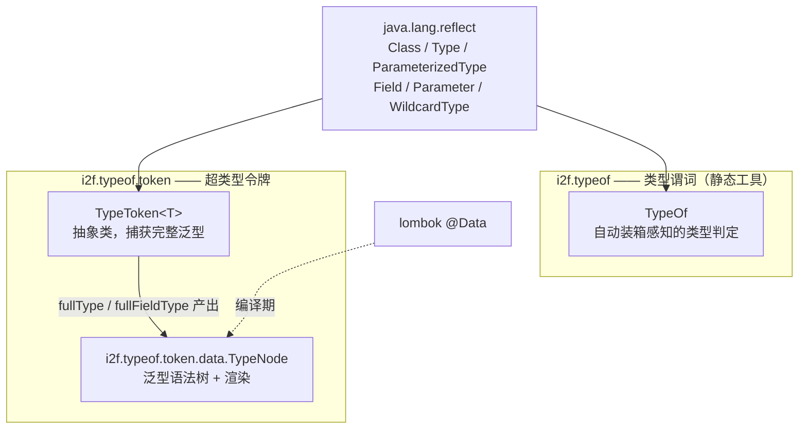
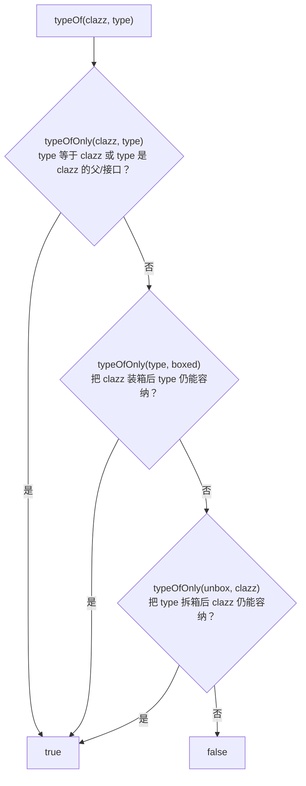
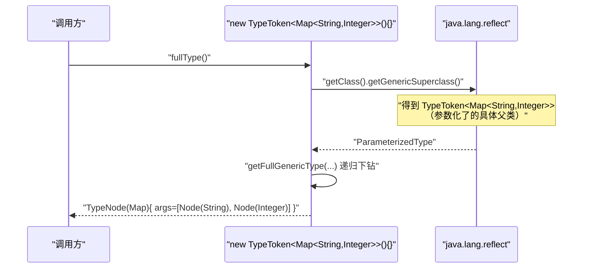

# i2f-typeof

> 类型系统**地基**（typeof）。以两个彼此正交、零 i2f 内部依赖的极小组件，覆盖 Java 反射里最烦人的两类「类型判定」问题：其一是 `TypeOf`——**自动装箱感知的类型谓词门面**，把 `int.class` 与 `Integer.class` 视为同一「基本类型」，并统一「精确/父类可赋值/装箱等价」三态判定（`typeOf`/`typeOfAny`/`instanceOf`/`isBaseType`/`isBigDecimalCompatibleType`…），还内置 `Collections.synchronized*/unmodifiable*` 包装类的识别；其二是 `TypeToken`/`TypeNode`——**Guava 风格的超类型令牌（Super Type Token）**，用匿名子类 `new TypeToken<Map<String,Integer>>(){}` 骗过泛型擦除、经 `getGenericSuperclass()` 还原出**完整嵌套泛型**，再折叠成可递归渲染的 `TypeNode` 语法树（`simpleName`/`importName`/`fullName`）。它是 `i2f-reflect`、`i2f-convert`、`i2f-container-builder`、`i2f-ai-std`、`i2f-form-url-encoded` 等几乎所有需要「运行期知道一个泛型到底是什么」的模块的共同底座，自身仅依赖 lombok（`TypeNode` 的 `@Data`），运行期纯 JDK。

## 模块路径

- `i2f-jdk/i2f-typeof`

## 模块依赖

| GroupId | ArtifactId | Scope | Optional | 来源 | 用途 |
| --- | --- | --- | --- | --- | --- |
| （无内部依赖） | | | | | `TypeOf`/`TypeToken` 全部仅用 `java.lang.reflect.*`、`java.util.*`、`java.math.*` |
| org.projectlombok | lombok | provided | 是（父 POM 托管） | 三方 | 仅 `TypeNode` 使用 `@Data`/`@NoArgsConstructor` 生成读写方法与构造器 |

- `pom.xml` 仅声明 `lombok` 一个依赖，无版本、无 `<scope>`（由父 POM `i2f-jdk` 的 `dependencyManagement` 统一置为 `provided` + `optional`）。
- **零 i2f 内部依赖**：`TypeOf`、`TypeToken`、`TypeNode` 全部只使用 JDK 标准库；`TypeNode.nameString` 形参用的是 `java.util.function.Function` 而非本仓库的 `i2f-functional`，避免循环依赖、保持叶子地位。
- build 段仅 `maven-assembly-plugin`，无自定义打包。

## 模块设计

模块按包切分为「**类型谓词**」与「**泛型令牌**」两支，互不引用：



### 1. `TypeOf`：三态合一的 `typeOf` 判定核

全部逻辑收敛到一个静态方法 `typeOf(clazz, type)`，它把「是不是同一个类型」放宽为三种情形任一成立：



- `basicTypeMap`：`static` 块内构造一份 `LinkedHashMap`，先放 `原始类型 → 包装类型`（含 `void→Void`），再整体反转并入，得到**双向**映射并 `Collections.unmodifiableMap` 冻结。因此 `basicTypeMap.get(int.class)` 得 `Integer`、`basicTypeMap.get(Integer.class)` 得 `int`。
- `typeOf(clazz, type)` 用两次「装箱/拆箱桥接」，使 `typeOf(int.class, Number.class)`、`typeOf(Integer.class, int.class)` 等跨「原始/包装」的比较都成立——这正是全仓库脚本引擎（antlr4 的 funic/tiny）、Excel 导出、schema 生成里判断「这个值能不能落到那个类型」的核心。
- 上层谓词皆为其组合：`typeOfAny`（对可变参数逐一 `typeOf`）、`isBaseType`（命中 `BASE_TYPES_ARRAY`）、`isBigDecimalCompatibleType`/`isBigIntegerCompatibleType`（数值可无损提升为 `BigDecimal`/`BigInteger` 的类型集）、`isSameBasicType`（两个类型是否指向同一基本类型）、`instanceOf(obj, type)`（取 `obj.getClass()` 再 `typeOf`）。
- **包装类识别**：`static` 时用 `Collections.synchronizedXxx(...).getClass()` 与 `unmodifiableXxx(...).getClass()` 采样出 8 种 JDK 隐藏包装类的 `Class`，存入常量数组，`isCollectionsSynchronized`/`isCollectionsUnmodifiable` 据此判定一个集合是否被同步/不可变包装——用于序列化/复制前识别「不能直接改的 List」。

### 2. `TypeToken`/`TypeNode`：超类型令牌与泛型语法树

`TypeToken<T>` 是**必须被匿名子类化**的抽象类（注意末尾 `{}`）：



- **反擦除原理**：编译器会把匿名子类的父类实参写进字节码，`getGenericSuperclass()` 因而返回 `ParameterizedType`，其 `getActualTypeArguments()` 就是 `String`、`Integer`——这是 Java 绕过泛型擦除、在运行期拿到 `Map<String,Integer>` 完整形状的经典技巧。
- **两类出口**：① 简单出口 `getType()/type()` 只取第一层参数并 `rawType()` 掉到 `Class`；② **完整出口 `fullType()`** 递归构造 `TypeNode` 树，保留任意深度嵌套（`Map<Map.Entry<Integer,String>, Boolean>` 也能还原）。
- **静态反射族**：`getMapKeyType/getMapValueType/getListType/getFieldType(clazz, field[, idx])` 直接对某个类的字段做泛型实参下标提取；`getGenericsFieldTypes(Field)`、`getGenericsParameterTypes(Parameter)`、`getGenericsClassTypes(Class)` 分别覆盖「字段/方法参数/类继承」三种携带泛型的载体，是 `i2f-ai-std` 的 `JsonSchema` 从方法参数/字段推导 schema 元素类型的依据。
- `getClassField` 先 `getDeclaredField` 再 `getField` 两次兜底，全失败抛 `IllegalStateException`；`rawType` 把 `ParameterizedType` 剥成 `getRawType()`。
- `getFullGenericType(Type)` 对 `Class`（叶子）、`WildcardType`（`? extends X` 归一为 `Object`）、`ParameterizedType`（递归 args）三类建模，产出 `TypeNode`。

`TypeNode` 是极简 `@Data` 树：`Class<?> type` + `List<TypeNode> args`，三种渲染都走同一 `nameString(Function<Class,String>)` 递归拼接 `Type<A, B>`，仅「类名如何取」不同：

| 渲染方法 | 取名策略 | 典型产物 |
| --- | --- | --- |
| `fullName()` | `Class::getName` | `java.util.Map<java.util.Map$Entry<...>, java.lang.Boolean>` |
| `simpleName()` | 成员类还原 `Outer.Inner`（`$`→`.`），否则 `getSimpleName` | `Map<Map.Entry<Integer, String>, Boolean>` |
| `importName()` | `java.lang.X` 简化为 `X`，其余全名（可作 import） | `java.util.Map<java.util.Map$Entry<java.lang.Integer, java.lang.String>, Boolean>` |

`simpleName()` 里对 `isMemberClass()` 特判，是为了让 `Map.Entry` 这类嵌套接口渲染成 `Map.Entry` 而非 `getSimpleName()` 的裸 `Entry`——`TestType` 打印 `List<Map.Entry<String, Object>>` 正依赖此。

## 模块目的

- 用**一个 `typeOf`** 收敛全仓库「原始 vs 包装 vs 父类」的类型等价判定，避免各处重复写 `isAssignableFrom` + 手工拆装箱的样板。
- 用**一个 `TypeToken`** 让「运行期获取完整泛型」有统一、可嵌套、可渲染的载体，服务序列化/转换/schema/容器构建等必须知道 `List<Foo>` 里 `Foo` 是谁的场景。
- 保持**叶子模块**定位：零内部依赖，可被 `i2f-reflect` 等更底层设施安全引用而不引入耦合。

## 模块功能

| 能力 | 载体 | 说明 |
| --- | --- | --- |
| 装箱感知类型判定 | `TypeOf.typeOf/typeOfOnly/typeOfAny` | 原始/包装/父子三态合一 |
| 值类型判定 | `TypeOf.instanceOf(obj, type)` | 取运行时类再 `typeOf` |
| 基本类型/数值可提升判定 | `isBaseType`/`isBigDecimalCompatibleType`/`isBigIntegerCompatibleType`/`isSameBasicType` | 依据三张常量类型表 |
| 集合包装识别 | `isCollectionsSynchronized`/`isCollectionsUnmodifiable` | 采样 `Collections` 隐藏类做判定 |
| 完整泛型捕获 | `TypeToken.fullType()/type()/getType()` | 匿名子类反擦除 |
| 字段/参数泛型下标提取 | `getMapKeyType`/`getMapValueType`/`getListType`/`getFieldType`/`getGenerics*Types` | 反射取实际类型参数 |
| 泛型语法树渲染 | `TypeNode.simpleName/importName/fullName` | 递归打印嵌套类型名 |

## 模块主要使用方法

**A. 装箱等价的类型判定（脚本/转换器常见）**

```java
TypeOf.typeOf(int.class, Number.class);        // true（int 装箱为 Integer，是 Number 子类）
TypeOf.isBaseType(String.class);               // true（BASE_TYPES_ARRAY 含 String）
TypeOf.isBigDecimalCompatibleType(Long.class); // true
TypeOf.instanceOf(someObj, CharSequence.class);// 值能否当作 CharSequence
TypeOf.isCollectionsUnmodifiable(list);        // 是否为 Collections.unmodifiableList 产物
```

**B. 捕获完整泛型（超类型令牌）**

```java
// 注意末尾 {}：必须匿名子类化，否则 getGenericSuperclass 拿不到实参
Class<Map> raw = new TypeToken<Map<String, Integer>>() {}.getType();   // java.util.Map
TypeNode node = new TypeToken<Map<Map.Entry<Integer, String>, Boolean>>() {}.fullType();
node.simpleName();   // Map<Map.Entry<Integer, String>, Boolean>
node.importName();   // 去 java.lang 前缀的可用 import 形式
node.fullName();     // 全限定名
```

**C. 反射某个类字段的泛型实参**

```java
class Bean { private Map<String, Integer> map; private List<Map.Entry<String,Object>> list; }
TypeToken.getListType(Bean.class, "list");     // Map.Entry（List 的第 0 个实参）
TypeToken.getMapKeyType(Bean.class, "map");    // String
TypeToken.getMapValueType(Bean.class, "map");  // Integer
TypeToken.fullFieldType(Bean.class, "map").simpleName(); // Map<String, Integer>
```

**D. 作为其它模块的类型入参载体**

```java
// i2f-form-url-encoded：用令牌指定反序列化目标（含泛型）
User u = FormUrlEncodedEncoder.ofFormBean(query, new TypeToken<User>() {});
// i2f-container-builder：CollectionBuilder 接受 TypeToken<E> 记录元素类型
```

注意事项：
- `TypeToken` 必须写成 `new TypeToken<X>(){}`（带 `{}` 子类体）；写成 `new TypeToken<X>()` 会使 `getGenericSuperclass()` 返回裸 `TypeToken`，`getGenericsTypes` 抛 `UnsupportedOperationException("not a generics type!")`。
- `TypeOf` 全静态、无缓存；高频调用可自行把常量数组本地化。

## 模块特性总结

- **两支正交、互不依赖**：`TypeOf`（判定）与 `TypeToken`/`TypeNode`（泛型还原）各解决一类问题，共用「零内部依赖」的叶子定位。
- **自动装箱为核心语义**：`basicTypeMap` 双向映射让原始/包装类型判定统一，避免调用方漏考虑 `int` vs `Integer`。
- **反泛型擦除**：`TypeToken` 借匿名子类 + `getGenericSuperclass` 拿到 `Type`，`fullType` 进一步递归为任意深度 `TypeNode`。
- **三档渲染**：同一 `nameString` 递归，切换取名函数即得全名/简名/import 名，满足代码生成与日志不同需求。
- **零三方运行期依赖**：仅 lombok（编译期、provided/optional），可被最底层反射模块安全依赖。

## 已知实现瑕疵与边界（源码核实）

1. **`TypeOf.isGenericType(Type)` 语义反直觉且近乎恒真**：实现仅当 `type` 恰为 `Class.class` 这一个对象时返回 `false`，其余非 null 一律 `true`。故 `isGenericType(Integer.class)` 返回 `true`——而 `Integer.class` 并非泛型类型。若意图是「是否为参数化/类型变量而非裸 `Class`」，正确判定应为 `!(type instanceof Class)`。`hasGenericType` 因复用它而同受影响。
2. **`rawType(Type)` 对非 `ParameterizedType` 的直接强转**：入参为 `GenericArrayType`（如 `List<String[]>` 的数组实参）或 `TypeVariable` 时，`(Class<E>) type` 抛 `ClassCastException`。
3. **`getFullGenericType` 不覆盖 `GenericArrayType`/`TypeVariable`**：这两类返回 `null`；`fullType()` 只在 `args` 循环里对子节点 `null` 兜底成 `Object`，若最外层直接是数组/类型变量仍可能 `node.getArgs()` NPE。
4. **`basicTypeMap` 的 `if (true) { ... }` 死条件**：静态块用恒真分支包裹，无功能影响，属遗留写法。
5. **`getClassField` 首个 `if (field == null)` 恒真**：`field` 刚声明必为 null，判空冗余；两次兜底后 `ex` 记录的是最后一次异常。
6. **`TypeToken` 是一次性反射、无缓存**：每次 `getType()/fullType()` 都重新 `getGenericSuperclass` 并遍历，高频构造匿名令牌有反射开销（与 `i2f-lambda-core` 的 `LruMap` 缓存风格不同）。
7. **`TestType` 位于 `src/main`**：演示类随产物一起发布，非 `src/test`。

## 下游消费（grep 核实）

作为类型地基被广泛依赖，`import i2f.typeof.*` 命中面覆盖两大支柱：

- **`TypeOf` 消费方**：`i2f-ai-std`（`AiAgent`/`AiServiceDynamicProxyHandler`/`ToolRawHelper`/`JsonSchema`）、`i2f-comparator`、`i2f-form-url-encoded`、`i2f-http-proxy`、`i2f-javacode-graph`，及扩展 `antlr4`（funic/tiny 脚本引擎的类型分派）、`easyexcel`/`fastexcel`（导出类型判定）、`freemarker`/`velocity`（代码生成 `typeOfAny`）、`xproc4j`。
- **`TypeToken`/`TypeNode` 消费方**：`i2f-container-builder`（`Builders`/`*Builder` 记录元素类型）、`i2f-ai-std/JsonSchema`（`getGenericsParameterType`/`getGenericsFieldType` 推导 schema 元素类型）、`i2f-form-url-encoded`（`ofFormBean(str, TypeToken)`）、`i2f-reflect`/`i2f-convert`/`i2f-serialize-impl`/`i2f-jdbc-procedure`（POM 依赖）等。
- 经 `i2f-jdk-all` 聚合发布；由 `i2f-jdk` 父 POM 的 `<module>` 收录。

> 结论：`i2f-typeof` 虽只 4 个文件，却是「类型/反射族」中最底层的公共判据——`i2f-reflect` 依赖它，`i2f-lambda` 又依赖 `i2f-reflect`，一条 `typeof → reflect → lambda → bql` 的类型能力链路由此奠基。
