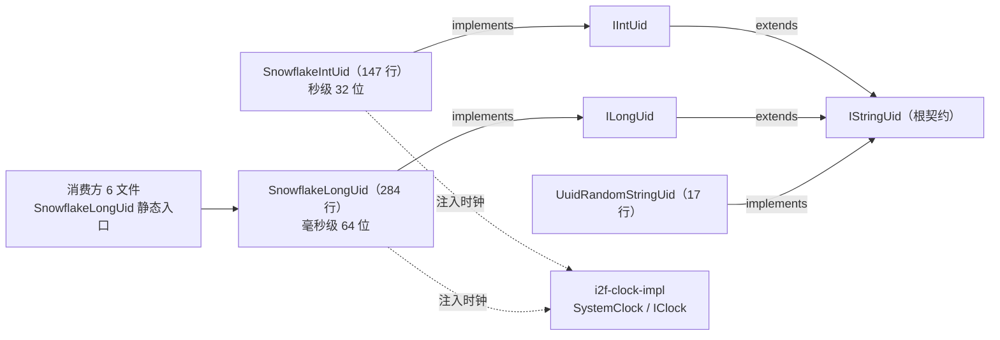

# i2f-uid-impl

> **UID 生成器系列的「默认实现家族」——「秒级雪花 + 毫秒级雪花 + UUID」三件套**：全模块 **3 个实现类、448 行、单包**（`i2f.uid`，无 `src/test`、零资源），全部落地上游 `i2f-uid-std` 契约：①`SnowflakeIntUid`（147 行，`implements IIntUid`）——32 位**秒级**雪花（1 符号 + 28 秒级时间戳 + 3 序列），2022-01-01 起点、约 8 年有效期、每秒仅 7 个 ID，面向「表单提交类低并发、生命周期不超过 8 年」场景；②`SnowflakeLongUid`（284 行，`implements ILongUid`）——64 位**毫秒级**经典雪花（1 + 41ms + 10 worker + 12 seq），2020-01-01 起点、可使用 69 年，`getByMac()` 以网卡 MAC 集 Adler32 校验和推导 workerId（零配置自适应），另有 `nextPart()` 部件拆解；③`UuidRandomStringUid`（17 行，`implements IStringUid`）——`UUID.randomUUID()` 去连字符小写 32 位 hex。双雪花均为「`INSTANCE` 单例 + `public static UID` 可替换全局 + 静态 `getId()/getIdHex()` 快捷入口」三重结构，时钟统一经 `IClock` 注入（默认 `SystemClock.INSTANCE`，来自 i2f-clock-impl）。
>
> **消费现状（6 模块 6 文件引用，全部 `SnowflakeLongUid` 静态用法）**：**POM 直接依赖 4 处**——`i2f-jdbc-procedure:79`、`i2f-log:27`、`i2f-mixins:53`、`i2f-springboot-ops-starter:158`；**代码消费 6 文件**——jdbc-procedure（BasicJdbcProcedureExecutor.java:62，注册脚本 DSL 系统值 `.snow-uid` = `SnowflakeLongUid.getId()` :1368）、i2f-log（JdbcDatasourceLogWriter.java:5/:215 日志表主键）、i2f-mixins（UuidMixins.java:4/:20 混入方法 `snowflake_id()`）、springboot-ops-starter（UidTools.java:8/:44 AI 工具 `create_new_snowflake_id()`）、xproc4j（LangEvalJavaNode.java:68/:140 eval-java 编译模板注入 `import i2f.uid.*`，**经 i2f-jdbc-procedure 传递依赖**）、jdbc-procedure-idea-plugin（JdbcProcedureXmlLangInjectInjector.java:211，Gradle 项目，仅字符串常量注入脚本模板、非编译期引用）。**无任何模块以接口类型（IIntUid/ILongUid/IStringUid）消费、无 `INSTANCE`/`nextId()`/`nextPart()`/`getIdHex()` 外部使用**；`SnowflakeIntUid`/`UuidRandomStringUid` **零外部消费**。聚合 `i2f-jdk-all:597`、根 POM `:846`、模块清单 `i2f-jdk/pom.xml:162`；发布四 jar（bash backup/deploy × jdk8/jdk17）。
>
> ⚠ **主要风险**：`seqId = (seqId + 1) % maxSeqId` **模基 off-by-one**——Int 版每秒实际 **7** 个（注释称 8）、Long 版每毫秒实际 **4095** 个（注释称 4096）；时间回拨 ≤10 秒时 `untilNextTsm` **忙等自旋**（无 sleep/yield，CPU 空耗），>10 秒直接抛 `IllegalStateException`（无降级）；`getByMac()` 的 `Math.abs(checksum) % 1023` 是**哈希槽而非唯一分配**（1023 号槽不可达、跨机可撞槽、同机多实例或多网卡变动即碰撞/漂移），失败时静默降级 `workerId=0` 且仅 `System.out.println` 打日志；`public static SnowflakeXxxUid UID` **非 final 可变全局**（接口方法经静态字段路由，替换后与实例直调 `nextId()` 行为分裂）；Int 版**无 worker 位**——多实例/多节点部署必碰撞（仅限单实例）；固定起点时间到期后（Int 约 2030 年中、Long 约 2089 年）直接截断为负值无防护；`nextId()` 与 `nextPart()` 两套复制粘贴逻辑；`lombok` 声明未用、**零测试**。详见「模块瑕疵或错误」。

## 模块路径

- `i2f-jdk/i2f-uid-impl`

## 模块依赖

| 依赖 | 坐标 | scope/optional | 用途 |
| --- | --- | --- | --- |
| `i2f-uid-std` | `i2f.turbo:i2f-uid-std` | compile | **核心契约**：3 个实现类分别实现 `IIntUid`/`ILongUid`/`IStringUid`（`:20`/`:31`/`:10`） |
| `i2f-clock-impl` | `i2f.turbo:i2f-clock-impl` | compile | `SystemClock.INSTANCE` 默认时钟；`IClock`（`i2f.clock.std`）经其传递自 `i2f-clock-std` |
| `lombok` | `org.projectlombok:lombok` | compile | **声明但未使用**（3 类零 lombok 注解/import） |

- 构建插件：`maven-assembly-plugin`（pom.xml:31-38 显式声明）；版本继承 `i2f-jdk` parent（`1.0-jdk8`）；根 POM 版本管理（pom.xml:846）；`i2f-jdk-all` 聚合收录（i2f-jdk-all/pom.xml:597）；`i2f-jdk` 模块清单第 162 项（i2f-jdk/pom.xml:162，位于 i2f-typeof 与 i2f-uid-std 之间）。
- 无 `src/test`、零资源、零配置文件；3 个源文件全部位于 `src/main/java/i2f/uid`。

## 模块设计

1. **类总览**（3 类 448 行）：

| 类 | 行数 | 位分配 | 实现接口 | 说明 |
| --- | --- | --- | --- | --- |
| `SnowflakeIntUid` | 147 | 1 + 28(秒) + 3 | `IIntUid` | 32 位秒级雪花，2022-01-01 起点，约 8 年，每秒 7 个 |
| `SnowflakeLongUid` | 284 | 1 + 41(ms) + 10(worker) + 12(seq) | `ILongUid` | 64 位毫秒级经典雪花，2020-01-01 起点，69 年，MAC 推导 workerId |
| `UuidRandomStringUid` | 17 | — | `IStringUid` | UUID 去连字符、小写、32 位 hex |

2. **契约落地与依赖关系**：



3. **「单例 + 静态全局 + 实例」三重入口模式**：

- 每个雪花类 = `INSTANCE`（`public static final`；Long 版经 `getByMac()` 自适应 workerId）+ `UID`（`public static` **非 final、可替换**；静态 `getId()`/`getIdHex()` 经它路由）+ 公开构造器（可 new 多实例、注入 `IClock`）。
- 接口方法（`nextIntId()`/`nextLongId()`）内部经静态 `UID` 路由；实例方法（`nextId()`）走 `this`——替换 `UID` 后两种入口行为分裂（见瑕疵 5）。
- `SnowflakeLongUid` 额外提供 `nextPart()`：返回 `UidPart{tsm, workerId, seqId}` 部件拆解（tsm 为相对起点偏移值），与 `nextId()` 共享同一序列状态、逻辑逐行复制（见瑕疵 6）。

4. **雪花算法实现要点**：

- **时间回拨防御**（两雪花同构）：`now < lastTsm` 时，回拨 ≤10 秒（Int 10 秒 / Long 10×1000 毫秒）→ `untilNextTsm` 忙等直到时间追平；超过阈值 → 抛 `IllegalStateException("时间回退 N second(s)/millisecond(s)")`。
- **同时间戳自增**：`seqId = (seqId + 1) % maxSeqId`；回绕到 0 时阻塞等待下一时间片（Int 秒 / Long 毫秒）——同一时间片序号不重复，代价是超出容量时**同步阻塞**调用线程。
- **ID 组装**：`(now - beginTsm) << N | (workerId << seqBits) | seqId`——Int 版 31 位有效直接 `(int)` 截断（正常期内恒正），Long 版恒正 63 位。
- **workerId 推导**（Long 版独有）：枚举全部「非回环 + 非虚拟」网卡 → 按 `网卡名/MAC` 排序去重（`TreeSet`）→ 拼 `[条目]` 串过 `Adler32` 校验和 → `Math.abs(checksum) % 1023` 得 workerId（0..1022）；异常时 `workerId=0` + `System.out` 警告。

5. **包结构**：单包 `i2f.uid`（3 类）；依赖方向单向：`i2f-uid-impl → {i2f-uid-std, i2f-clock-impl}`、消费方 → 具体实现类；无循环。

## 模块目的

- **契约落地**：为 `i2f-uid-std` 的三层契约提供开箱即用的默认实现家族（秒级/毫秒级雪花 + UUID），是 std/impl 分离范式的实现侧。
- **分布式 ID 基础设施**：以经典 Twitter Snowflake 为蓝本，缓解单库自增主键在分库分表/多实例下的碰撞问题；`SnowflakeLongUid` 的 MAC 自适应使「零配置部署」可用。
- **场景化选型**：Int 版面向「表单提交号」类低并发、短周期场景（单实例语义）；Long 版面向全局唯一且趋势递增（按时间）的长期主键场景；UUID 版面向无排序诉求的纯随机标识。

## 模块功能

- **32 位秒级雪花**（`SnowflakeIntUid`）：`nextId()`/`nextIntId()` 同步生成 int 型趋势递增 ID；`nextIdHex()`/接口默认 `nextStringId()` 输出 8 位 hex。
- **64 位毫秒级雪花**（`SnowflakeLongUid`）：`nextId()`/`nextLongId()` 生成 long 型 ID；`nextIdHex()` 16 位 hex；`getByMac()` 自适应 workerId；`nextPart()` 部件拆解；构造器显式指定 workerId（0..1023）。
- **UUID 字符串 ID**（`UuidRandomStringUid`）：`nextStringId()` → 32 位小写 hex。
- **时钟注入**：两雪花构造器可注入 `IClock`（测试/自定义时钟源）。
- **静态快捷入口**：`SnowflakeXxxUid.getId()` / `getIdHex()`。

## 模块主要使用方法

```java
// ① 全局静态入口（6 个消费方的实际用法——64 位雪花）
long id = SnowflakeLongUid.getId();           // 一调即得 long
String hex = SnowflakeLongUid.getIdHex();     // 16 位十六进制文本

// ② 32 位秒级雪花（低并发表单号场景）
int formId = SnowflakeIntUid.getId();
String formHex = SnowflakeIntUid.getIdHex();  // 8 位 hex

// ③ 实例 + 指定 workerId / 注入时钟（多节点部署需保证 workerId 唯一）
SnowflakeLongUid uidA = new SnowflakeLongUid(1);
SnowflakeLongUid uidB = new SnowflakeLongUid(2, myClock); // myClock: IClock
long v = uidA.nextId();
long w = uidB.nextId();

// ④ 面向接口（uid-std 契约；注意 nextStringId 是「再生成一个 ID」）
ILongUid lu = SnowflakeLongUid.INSTANCE;
long l = lu.nextLongId();
String lHex = lu.nextStringId(); // 新 ID 的格式化，非 l 的视图

// ⑤ 部件拆解（Long 版独有，调试/诊断用）
SnowflakeLongUid.UidPart part = SnowflakeLongUid.INSTANCE.nextPart();
// part.tsm（相对 2020-01-01 偏移）/ part.workerId / part.seqId

// ⑥ UUID 字符串
String uuid = UuidRandomStringUid.INSTANCE.nextStringId(); // 32 位小写 hex
```

注意事项：

- **静态与实例二选一**：`getId()` 经可变的静态 `UID` 路由——项目内有替换需求时应统一经实例/`INSTANCE` 调用，避免行为分裂。
- **`SnowflakeLongUid` 初始化副作用**：首次触达类（含静态入口）即执行 `getByMac()` 枚举网卡（可能打印警告）——属一次性的类初始化开销。
- **多实例部署**：Long 版依赖 `getByMac()` 自动区分节点（失败降级 0 号）；Int 版**无 worker 位，跨进程必碰撞**——仅限单实例使用。
- **`IClock` 注入**：默认 `SystemClock.INSTANCE`（i2f-clock-impl 的缓存时钟，可能比真实时间晚少量毫秒）。

## 模块特性总结

1. **三实现 448 行**：秒级雪花 / 毫秒级雪花 / UUID——完整覆盖 uid-std 的 int/long/string 三契约。
2. **双入口（静态 + 实例）**：`INSTANCE` + `UID` + 公开构造器；静态 `getId()` 零样板即用。
3. **workerId 自适应**：`getByMac()` 的 MAC 校验和推导——单机零配置部署开箱即用。
4. **时钟可注入**：`IClock` 构造器注入 + `SystemClock` 默认实现；可测试性设计。
5. **线程安全**：`nextId()`/`nextPart()` 均 `synchronized`——单实例并发安全。
6. **时钟回拨防御**：≤10s 等待追平、>10s 显式报错。
7. **趋势递增**：雪花 ID 整体按时间自增（对索引友好）；UUID 例外。
8. **脚本生态底座**：`SnowflakeLongUid` 被 jdbc-procedure 注册为脚本 DSL 系统值 `.snow-uid`，并由 xproc4j 编译模板与 idea-plugin 注入模板双路径供脚本直接引用。
9. **真实落地**：4 模块 POM 直依 + xproc4j 传递消费，全部经静态 `SnowflakeLongUid.getId()`。

## 模块瑕疵或错误

1. **seqId 模基 off-by-one（容量损失 + 注释与实现矛盾）**：`seqId = (seqId + 1) % maxSeqId`（SnowflakeIntUid.java:101、SnowflakeLongUid.java:180/:257）——`maxSeqId` 是**全 1 掩码**（7 / 4095），取模应为位与 `(seqId + 1) & maxSeqId`。现状序号值 `maxSeqId` 永不出现：Int 版每秒实际 **7** 个（类注释称 `2^3=8` 个）、Long 版每毫秒 **4095** 个（注释称 4096）——12.5% / 0.02% 吞吐损失。
2. **时间回拨忙等自旋**：`untilNextTsm`（SnowflakeIntUid.java:130-136、SnowflakeLongUid.java:209-215）以 `while (now <= tsm) now = getTsm();` 纯自旋等待——无 `Thread.sleep/yield`，回拨窗口内 CPU 空转；且 >10s 回拨直接抛异常，调用方无降级路径（ID 服务不可用）。
3. **workerId 是哈希槽而非唯一分配**（SnowflakeLongUid.java:97-140）：`Math.abs(checksum) % 1023`——① 槽位 0..1022，`1023` 号 workerId 永不可达；② 不同机器校验和可撞槽（无冲突检测）；③ 同机多实例共享同一 MAC 集 → **同 workerId 并发生成必碰撞**（应支持显式部署隔离）；④ 网卡增删/虚拟网卡（`isVirtual()` 判定依赖 JDK 平台实现）变化 → 槽位漂移；校验和为**启动时一次性**计算，运行中网络变化不感知。
4. **静默降级 + `System.out` 日志**：`getByMac()` 两处 catch 全部 `System.out.println("[WARN] 获取网卡信息失败：...")`（SnowflakeLongUid.java:122/:137）——无日志框架集成；网卡枚举失败时 `workerId=0` 静默继续——多台故障节点同部署时全员 0 号，碰撞概率抬高。
5. **`UID` 静态可变全局**（SnowflakeIntUid.java:57、SnowflakeLongUid.java:77）：`public static` **非 final**——外部可替换；且接口方法（`nextIntId()`/`nextLongId()` → `getId()`）经它路由、实例方法 `nextId()` 走 `this`——替换后**同一类两种入口走不同实例**（行为分裂，无文档说明）。
6. **`nextId()`/`nextPart()` 逻辑复制**（SnowflakeLongUid.java:161-197 / :238-270）：两套近乎逐行重复的 synchronized 时间回拨 + 序列推进逻辑（维护双份风险）；`UidPart` 为**非 static 内部类**（隐式持有外部实例引用）+ 公共可变字段（无封装）。
7. **Int 版无 worker 位——仅限单实例**：ID = 秒级时间戳 + 序列，无机器标识——多实例/多节点部署**必碰撞**（类注释仅提「并发很低的场景」，未警示多实例限制）；仅适合单进程表单号等场景。
8. **固定起点 + 溢出无防护**：Int 起点 2022-01-01 + 28 位秒 ≈ **2030 年中**到期；Long 起点 2020-01-01 + 41 位毫秒 ≈ **2089 年**。到期后 `(now - beginTsm)` 溢出高位、直接截断为负值 → **重复/负数**，无任何检测与告警（注释仅陈述年限）。
9. **注释错误**：SnowflakeIntUid.java:43「最大时间回退毫秒」实为**秒**（同秒异常消息 "second(s)" 可证）；:14「每秒可产生 2^3=8 个 ID」与实际 7 个不符（连同瑕疵 1）。
10. **`UuidRandomStringUid` 细节**：`replaceAll("-", "")` 走**正则引擎**（`String.replace` 更宜）；`toLowerCase()` **未指定 Locale**；32 位 hex 与雪花族相比无排序性/时间信息；`@desc` 空。
11. **`lombok` 声明未用 + 零测试**：pom 声明 lombok 但 3 类零使用；无 `src/test`——雪花核心（位运算、回拨、溢出、workerId 推导）零自动化防线。

## 消费现状与验证

- **POM 直接依赖（4 模块）**：`i2f-jdbc-procedure`（pom.xml:79）、`i2f-log`（pom.xml:27）、`i2f-mixins`（pom.xml:53）、`i2f-springboot-ops-starter`（pom.xml:158）——均有真实代码使用，无声明浪费。
- **Java 代码消费（6 文件 6 模块，全部 `SnowflakeLongUid` 静态用法）**：
  - `i2f-jdbc-procedure` BasicJdbcProcedureExecutor.java:62/:1367-1369——注册脚本 DSL 系统值 `.snow-uid` = `SnowflakeLongUid.getId()`（配套文档 `assets/std/design.md:198`）；
  - `i2f-log` JdbcDatasourceLogWriter.java:5/:215——`stat.setLong(i++, SnowflakeLongUid.getId())` 日志表主键；
  - `i2f-mixins` UuidMixins.java:4/:19-21——混入方法 `snowflake_id()`；
  - `i2f-springboot-ops-starter` UidTools.java:8/:43-45——AI 工具 `create_new_snowflake_id()`（同文件 UUID 工具直接用 JDK `UUID`——`UuidRandomStringUid` 零消费的侧证）；
  - `i2f-extension-xproc4j` LangEvalJavaNode.java:68/:140——eval-java 编译模板自动注入 `import i2f.uid.*`（**经 i2f-jdbc-procedure 传递依赖**，POM 无直接声明）；
  - `i2f-jdbc-procedure-idea-plugin` JdbcProcedureXmlLangInjectInjector.java:211——Gradle 子项目，仅**字符串常量**注入 `import i2f.uid.SnowflakeLongUid;` 代码模板（非编译期引用、无构建依赖）。
- **零外部消费**：`SnowflakeIntUid`、`UuidRandomStringUid`——模块外零引用；`INSTANCE`/`nextId()`/`nextPart()`/`getIdHex()` 亦无外部调用（全部经静态 `getId()` 或 `class` 引用）。
- **验证方法**：PowerShell 全仓逐文件扫描（40885 文件全枚举 → xml/md/txt/bat/sh/lst 1904 文件过滤）搜 `i2f-uid-impl`——命中 POM 6 处（4 直接 + 聚合 + 清单）、根 POM、IDE 配置与 wiki 若干；全仓 java 搜 `SnowflakeLongUid|SnowflakeIntUid|UuidRandomStringUid|import i2f\.uid`——6 外部文件 + 3 自身，逐一读行确认用法；grep_code 双路抽样一致（另暴露其 `-Include` 目录模式与 25 条上限的漏报风险，已以 PowerShell 复核为准）。
- **聚合与发布**：`i2f-jdk-all/pom.xml:597`（聚合）、根 POM `pom.xml:846`（版本管理）、`i2f-jdk/pom.xml:162`（模块清单）；`bash/backup-jdk8|backup-jdk17|deploy-jdk8|deploy-jdk17` 四目录含 `i2f-uid-impl-1.0-jdk8.jar`/`-jdk17.jar`。
- **wiki 侧引用**：`.wiki/docs/module-i2f-jdk.md:261`（「UID 实现」）、`.wiki/wiki.md:113`、`.wiki/docs/log.md:41/:294`（i2f-log 依赖树与说明）、`.wiki/docs/mixins.md:20`（mixins 依赖表）、`.wiki/docs/ops-starter.md:51`（ops-starter 依赖表）、`menus.md:197/:647`、`i2f-log/readme.md:16/:115`、`i2f-mixins/readme.md:50`、`i2f-uid-std/readme.md`（多处）。
