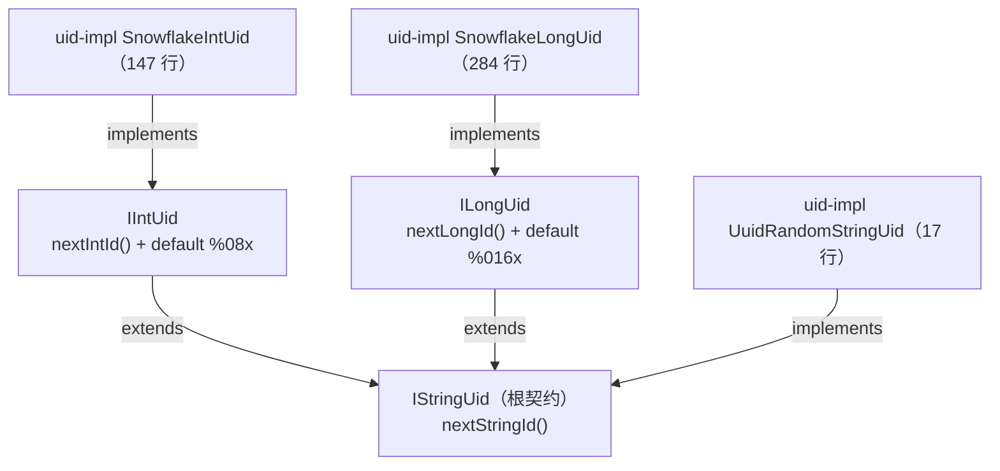

# i2f-uid-std

> **UID 生成器系列的「标准契约层」——「IStringUid 根契约 + IIntUid/ILongUid 数值派生 + 默认 hex 格式化」**：全模块 **3 个接口、40 行、单包**（`i2f.uid`，无 `src/test`、零资源、**零依赖**——pom 无任何 `<dependencies>`，纯 JDK 接口）。三层契约树：①`IStringUid`（10 行）——根契约，唯一抽象方法 `String nextStringId()`；②`IIntUid`（15 行）——`extends IStringUid`，新增抽象 `int nextIntId()` + `default nextStringId()` 以 `String.format("%08x", nextIntId())` 把数值 ID 派生为 **8 位补零小写 hex**；③`ILongUid`（15 行）——同构派生 `long nextLongId()` + `%016x` **16 位** hex。三接口均单一抽象方法（**函数式接口**，可 lambda 直接实现）；真正的实现家族全部下沉到下游 `i2f-uid-impl`（448 行 3 类）——`SnowflakeIntUid`（147 行，雪花 32 位：1 符号 + 28 秒级时间戳 + 3 序列）、`SnowflakeLongUid`（284 行，雪花 64 位：1 + 41ms + 10 worker + 12 seq）、`UuidRandomStringUid`（17 行，UUID 去连字符小写）。
>
> **消费现状（唯一直接消费者 i2f-uid-impl）**：全仓仅 **i2f-uid-impl 实现本模块 3 接口**（`SnowflakeIntUid.java:20`、`SnowflakeLongUid.java:31`、`UuidRandomStringUid.java:10`）；**无任何模块以接口类型（IIntUid/ILongUid/IStringUid）消费**。间接消费链：uid-impl 的 `SnowflakeLongUid` 被 **6 个文件**引用（`i2f-extension-xproc4j` LangEvalJavaNode.java:68、`i2f-jdbc-procedure` BasicJdbcProcedureExecutor.java:62、`i2f-log` JdbcDatasourceLogWriter.java:5、`i2f-mixins` UuidMixins.java:4、`i2f-springboot-ops-starter` UidTools.java:8、`i2f-jdbc-procedure-idea-plugin` 模板字符串 :211）——全部使用具体类而非接口。`SnowflakeIntUid`/`UuidRandomStringUid` 零外部消费。POM：唯一依赖声明 `i2f-uid-impl/pom.xml:22`（无声明浪费）；聚合 `i2f-jdk-all:601`、根 POM 版本管理 `:851`、模块清单 `i2f-jdk/pom.xml:163`。
>
> ⚠ **主要风险**：三接口 `@desc` 全空——**零 Javadoc**（唯一性/单调性/线程安全/位宽/格式语义无任何契约约定）；`nextStringId` 默认方法是**「再生成」语义而非「视图」**——`IIntUid.nextStringId()` 内部调用 `nextIntId()` 生成**新 ID**，「生成一次拿两种形态」实际得到两个不同 ID 且各消耗一次序号；**字符串格式零契约**——实现家族输出长度 8/16/32 位各异（`%08x`/`%016x`/UUID），且负数值输出补码形态无防御；`IIntUid` + `ILongUid` **同时实现构成菱形默认方法冲突**，须手动覆写消歧；无 String→ID 反向解析、无批量生成、无元数据提取；**零测试**。详见「模块瑕疵或错误」。

## 模块路径

- `i2f-jdk/i2f-uid-std`

## 模块依赖

| 依赖 | 坐标 | scope/optional | 用途 |
| --- | --- | --- | --- |
| （无） | — | — | pom.xml 无任何 `<dependencies>` 声明——纯 JDK 接口定义 |

- 构建插件：仅 `maven-assembly-plugin`；版本继承 `i2f-jdk` parent（`1.0-jdk8`）；根 POM 版本管理（pom.xml:851）；`i2f-jdk-all` 聚合收录（i2f-jdk-all/pom.xml:601）；`i2f-jdk` 模块清单第 163 项（i2f-jdk/pom.xml:163，位于 i2f-uid-impl 与 i2f-unsafe 之间）。
- 无 `src/test`、零资源、零配置文件；3 个源文件全部位于 `src/main/java/i2f/uid`。

## 模块设计

1. **类总览**（3 接口 40 行）：

| 接口 | 行数 | 包 | 职责 | 实现（uid-impl） |
| --- | --- | --- | --- | --- |
| `IStringUid` | 10 | `i2f.uid` | 根契约：`String nextStringId()` | `UuidRandomStringUid`（17 行） |
| `IIntUid` | 15 | `i2f.uid` | `extends IStringUid`：`int nextIntId()` + default `%08x` | `SnowflakeIntUid`（147 行） |
| `ILongUid` | 15 | `i2f.uid` | `extends IStringUid`：`long nextLongId()` + default `%016x` | `SnowflakeLongUid`（284 行） |

2. **契约树与实现关系**：



3. **「数值主能力 + 字符串默认派生」的模板设计**：

- 数值生成是主能力（`nextIntId`/`nextLongId` 由实现提供），字符串形态是**接口默认方法免费派生**的产物——实现类只写数值生成即可自动获得 8/16 位 hex 字符串 ID。
- 三个接口都是**函数式接口**（各自恰有一个抽象方法）：`IStringUid uid = () -> "abc";`、`IIntUid uid = () -> 42;`、`ILongUid uid = () -> 42L;` 均可直接 lambda 实现——便于测试 mock 与快速适配。

4. **包结构**：单包 `i2f.uid`（3 接口）；依赖方向单向：`i2f-uid-impl → i2f-uid-std`、下游消费方 → 具体实现类；无循环、零第三方运行期依赖（仅 `String.format`）。

## 模块目的

- **契约统一**：为 ID 生成器生态提供向上转型锚点——字符串 / 32 位整型 / 64 位长整型三种形态的生成器可被同一套代码以接口类型接收与调用。
- **契约与实现分离**：std 侧零依赖保持稳定，实现侧（雪花算法、UUID、自定义）自由替换与扩展——延续全仓 `*-std`/`*-impl` 分层范式。
- **默认派生降负担**：数值实现的字符串形态由 `default` 方法提供（`%08x`/`%016x` 定宽补零小写 hex），实现类无需重复编写格式化逻辑。

## 模块功能

- **字符串 ID 生成契约**（`IStringUid.nextStringId()`）：任意形式的字符串 ID（UUID、格式化数值等）。
- **int ID 生成契约**（`IIntUid.nextIntId()`）：32 位整型 ID + 默认 `%08x` 字符串派生（8 位补零小写 hex）。
- **long ID 生成契约**（`ILongUid.nextLongId()`）：64 位长整型 ID + 默认 `%016x` 字符串派生（16 位补零小写 hex）。
- **函数式实现支持**：三接口均单抽象方法——lambda/方法引用可直接实现。

## 模块主要使用方法

```java
// ① 字符串 ID：以 lambda 自定义实现（或使用 uid-impl 的 UuidRandomStringUid）
IStringUid strUid = () -> UUID.randomUUID().toString();
String sid = strUid.nextStringId();

// ② int ID：生成 + 默认 hex 派生（8 位补零小写；SnowflakeIntUid 来自 uid-impl）
IIntUid intUid = new SnowflakeIntUid();
int i = intUid.nextIntId();
String iHex = intUid.nextStringId(); // 注意：这是「再生成一个 ID」的格式化

// ③ long ID：生成 + 默认 hex 派生（16 位补零小写）
ILongUid longUid = SnowflakeLongUid.INSTANCE;
long l = longUid.nextLongId();
String lHex = longUid.nextStringId();

// ④ 面向接口编程：以 IStringUid 统一承接任意实现
IStringUid any = SnowflakeLongUid.INSTANCE;
String v = any.nextStringId();

// ⑤ 自定义实现：只写数值生成，字符串派生免费获得
IIntUid custom = () -> 42;
custom.nextStringId(); // → "0000002a"
```

注意事项：

- **「生成」语义**：每次调用（包括默认 `nextStringId()`）都产出**新 ID**——不是对已有 ID 的「格式化视图」；需要「一次生成、两种形态」时应保存返回值而非调用两次。
- **实现类在 `i2f-uid-impl`**：本模块仅接口——使用时需引入 `i2f-uid-impl`（或自行实现/lambda）。
- **接口不继承 `ILifeCycle`**：与翻译器/日志等系列不同，UID 契约无 create/destroy 生命周期钩子——纯生成契约、无状态。

## 模块特性总结

1. **极简规模**：3 接口 40 行——全仓最小模块之一。
2. **std 契约与实现分离**：接口层零依赖；实现层（雪花 32/64 位、UUID）在 `i2f-uid-impl` 集中落地（448 行 3 类）。
3. **三层契约树**：字符串根契约 + int/long 两个数值派生——向上转型锚点统一。
4. **模板派生**：数值 ID → 定宽补零 hex 由接口 `default` 方法提供（`%08x`/`%016x`），实现方零重复。
5. **函数式接口**：三接口均恰有一个抽象方法——lambda 即可实现，便于 mock 与快速适配。
6. **生成器语义、无状态**：接口零字段、无生命周期钩子——每次调用产出新 ID。
7. **真实落地消费**：i2f-uid-impl 唯一直接实现方；其 `SnowflakeLongUid` 再被 6 个文件消费（含 idea-plugin 模板注入）。

## 模块瑕疵或错误

1. **零 Javadoc**：3 个接口的 `@desc` 全空（IStringUid.java:6、IIntUid.java:6、ILongUid.java:6）——「唯一性 / 单调性 / 线程安全 / ID 位宽 / 字符串格式」等契约语义零文档，全靠实现类自约定；消费方无法从接口判断能否跨线程共享、输出是否定宽。
2. **`nextStringId` 默认方法是「再生成」而非「视图」**：`IIntUid.java:13` / `ILongUid.java:13` 的 default 内部调用 `nextIntId()`/`nextLongId()`——每调用一次生成一个新 ID。想「取刚生成 ID 的字符串形态」而按 `nextIntId()` + `nextStringId()` 顺序调用，会**消耗两个 ID**且两者互不相关；接口未提供「同值双视图」能力（如静态 `toHex(int id)`）。
3. **字符串格式零契约**：默认派生输出 8/16 位定宽小写 hex，而 `UuidRandomStringUid` 直接实现输出 32 位——实现家族长度 8/16/32 各异；且 `%08x`/`%016x` 对负数值输出**补码形态**（如 `SnowflakeIntUid` 超出 8 年有效期溢出为负后），接口对格式、负数、溢出均无约定与防御。
4. **菱形默认方法冲突**：`IIntUid` 与 `ILongUid` 是 `IStringUid` 的两个**平行派生**，同时 `implements IIntUid, ILongUid` 的类将遭遇两个 `nextStringId()` 默认方法冲突（Java 编译错误），必须手动覆写消歧——契约未提供「数值型公共父接口」（两个 default 实现为复制粘贴关系，仅格式串不同）。
5. **无反向/批量/元数据能力**：无 `String → ID` 解析、无 `nextIds(n)` 批量、无时间戳/workerId 提取——最小契约有意为之，消费方需自行补齐（对比 uid-impl 的雪花类各自实现了 `nextIdHex`）。
6. **零测试**：无 `src/test`——3 接口的 default 行为（hex 宽度、负数补码、lambda 实现）无自动化防线。

## 消费现状与验证

- **Java 层直接消费**：**唯一直接消费者 `i2f-uid-impl`**——3 个实现类全数实现本模块接口：
  - `SnowflakeIntUid.java:20`（`implements IIntUid`，雪花 32 位：1 符号 + 28 秒级时间戳 + 3 序列，2022-01-01 起点）；
  - `SnowflakeLongUid.java:31`（`implements ILongUid`，雪花 64 位：1 + 41ms + 10 worker + 12 seq，MAC 校验和推导 workerId）；
  - `UuidRandomStringUid.java:10`（`implements IStringUid`，UUID 去连字符小写 32 位）。
- **间接消费链**（uid-impl 的下游，全部使用具体类 `SnowflakeLongUid`，无接口类型消费）：6 个文件——`i2f-extension-xproc4j`（LangEvalJavaNode.java:68）、`i2f-jdbc-procedure`（BasicJdbcProcedureExecutor.java:62）、`i2f-log`（JdbcDatasourceLogWriter.java:5）、`i2f-mixins`（UuidMixins.java:4）、`i2f-springboot-ops-starter`（UidTools.java:8）、`i2f-jdbc-procedure-idea-plugin`（JdbcProcedureXmlLangInjectInjector.java:211，以字符串常量注入代码模板）。
- **零外部消费类**：`SnowflakeIntUid`、`UuidRandomStringUid`——uid-impl 模块外零引用。
- **验证方法（三路）**：①grep `import i2f\.uid\.`——6 命中（全部为 `SnowflakeLongUid`）；②PowerShell 全仓（排除 target/.git/.idea）搜 `IStringUid|IIntUid|ILongUid`——6 命中（3 定义 + 3 实现），搜 `SnowflakeIntUid|UuidRandomStringUid`——仅自身文件；③独立模块名 `i2f-uid-std`——7 命中（POM 5 处含自身 + wiki 2 处），全部可解释。
- **POM 级消费**：唯一依赖声明 `i2f-uid-impl/pom.xml:22`（有真实使用、无声明浪费）；聚合 `i2f-jdk-all/pom.xml:601`、根 POM `:851`（版本管理）、`i2f-jdk/pom.xml:163`（模块清单）。
- **wiki 侧引用**：`.wiki/docs/module-i2f-jdk.md:260`（「UID 接口」）、`.wiki/wiki.md:113`（「其他」分类）。
- **发布产物**：`bash/backup-jdk8`、`bash/deploy-jdk8`、`bash/backup-jdk17`、`bash/deploy-jdk17` 四目录含 `i2f-uid-std-1.0-jdk8.jar`/`-jdk17.jar`。
