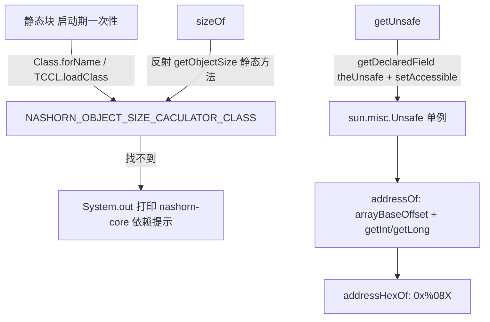

# i2f-unsafe

> 底层**内存窥探工具**（unsafe）。全模块仅一个静态工具类 `UnsafeHacker`，用三行反射撬开 JDK 刻意封闭的 `sun.misc.Unsafe`，并向上封装出三个「越过 Java 内存模型看对象本身」的能力：`getUnsafe()`（双检锁拿到全局唯一 `Unsafe` 实例）、`addressOf(Object)`/`addressHexOf(Object)`（把对象塞进一元素 `Object[]`，用 `arrayBaseOffset` 定位引用槽后按指针宽度 `getInt`/`getLong` 读出其**物理内存地址**）、`sizeOf(Object)`（反射调用 Nashorn 的 `jdk.nashorn.internal.ir.debug.ObjectSizeCalculator.getObjectSize` 求对象**深链字节大小**）。它服务于内存诊断、缓存体积估算、对象引用比对等需要「绕开封装」的场景。`pom.xml` **不声明任何 `<dependencies>`**（连 lombok 都没有），编译期仅用 JDK 内部的 `sun.misc.Unsafe`，Nashorn 则为运行期反射的**可选**依赖——缺失时 `sizeOf` 优雅返回 `-1`。

## 模块路径

- `i2f-jdk/i2f-unsafe`

## 模块依赖

| GroupId | ArtifactId | Scope | Optional | 来源 | 用途 |
| --- | --- | --- | --- | --- | --- |
| —（无 Maven 依赖声明） | | | | | `pom.xml` 内没有 `<dependencies>` 段，父 POM `i2f-jdk` 与根 POM 也仅托管版本不注入依赖，故本模块零显式 Maven 依赖 |

**运行期/编译期的非 Maven 引用**（均不走坐标，靠 JDK 或反射）：

| 引用 | 类型 | 是否必需 | 说明 |
| --- | --- | --- | --- |
| `sun.misc.Unsafe` | JDK 内部类 | 编译期必需 | JDK8 随 `rt.jar` 提供；JDK9+ 归入 `jdk.unsupported` 模块仍导出。用于取内存地址 |
| `jdk.nashorn.internal.ir.debug.ObjectSizeCalculator` | JDK 内置/独立坐标 | 运行期可选 | JDK8~14 随 JRE 附带 Nashorn 时存在；JDK11+ 起被移除。`sizeOf()` 反射调用，缺失返回 `-1` |

> 若运行在已移除 Nashorn 的 JDK 上，`UnsafeHacker` 静态块会打印一段提示，并给出可粘贴的 Maven 依赖：`org.openjdk.nashorn:nashorn-core:15.4`（见常量 `NASHORN_MAVEN_DEPENDENCY`）。

## 模块设计

单类、全 `public static`、无实例状态（除一张 `volatile Unsafe` 惰性字段与一张启动期解析一次的 `Class` 缓存），是一条「**反射撬锁 → 内存原语 → 可选尺寸计算**」的最小组合：



### 1. `getUnsafe()`：绕过 `Unsafe.getUnsafe()` 的类加载器门禁

`sun.misc.Unsafe.getUnsafe()` 会校验调用方是否由引导类加载器加载，普通应用类直接调会抛 `SecurityException`。本方法用标准「撬锁」配方绕开：反射取 `Unsafe` 的私有静态字段 `theUnsafe` → `setAccessible(true)` → `field.get(null)`。缓存到 `private static volatile Unsafe unsafe`，用**双检锁（DCL）**保证进程内仅解析一次且线程安全。

### 2. `addressOf(Object)`：借数组槽读出对象引用值

把目标对象放进一元素 `Object[]{obj}`，用 `unsafe.arrayBaseOffset(Object[].class)` 定位到该引用在数组中的偏移，再按 `unsafe.addressSize()`（本机指针宽度）分派：`4` 走 `getInt`、`8` 走 `getLong`，读出的整数值即对象内存地址；其它宽度抛 `UnsupportedOperationException`。`addressHexOf` 仅是 `String.format("0x%08X", ...)` 的十六进制包装。

### 3. `sizeOf(Object)`：委托 Nashorn 求对象深大小

不在本模块自算对象图，而是**反射调用 Nashorn 自带的 `ObjectSizeCalculator.getObjectSize(Object)`**（静态方法，返回 `long`）。目标类在静态块中一次性解析并缓存到 `NASHORN_OBJECT_SIZE_CACULATOR_CLASS`：先 `Class.forName(...)`，失败再退到线程上下文类加载器 `loadClass(...)`，仍失败则仅打印提示而不抛异常。此后 `sizeOf` 每次取该方法 `invoke(null, obj)`，任何环节失败（类缺失、方法缺失、反射异常）一律吞掉并返回 `-1`。

## 模块目的

- 把 JDK 三处「想用但没门」的能力收敛成一个零依赖工具：拿 `Unsafe`、读对象地址、估对象体积。
- 让内存诊断/缓存配额估算等底层诉求无需各自复制「反射 theUnsafe」「塞数组读地址」等模板代码。
- 对可选的 Nashorn 尺寸计算器做**运行期探测 + 优雅降级**，有则精确报数、无则返回 `-1` 并给出补依赖指引，绝不因缺库而崩溃。

## 模块功能

| 成员 | 签名 | 功能 |
| --- | --- | --- |
| `getUnsafe()` | `static Unsafe getUnsafe()` | 反射撬取全局 `Unsafe` 实例（DCL 缓存，线程安全） |
| `addressOf(Object)` | `static long addressOf(Object obj)` | 返回对象内存地址（`null` 返回 `0`） |
| `addressHexOf(Object)` | `static String addressHexOf(Object obj)` | 地址的 `0x%08X` 十六进制字符串 |
| `sizeOf(Object)` | `static long sizeOf(Object obj)` | 对象深链字节大小；无 Nashorn 或出错返回 `-1` |
| `NASHORN_OBJECT_SIZE_CALCULATOR_CLASS_NAME` | `static final String` | Nashorn 尺寸计算器全限定类名常量 |
| `NASHORN_MAVEN_DEPENDENCY` | `static final String` | 提示用的 `nashorn-core:15.4` pom 片段 |
| `NASHORN_OBJECT_SIZE_CACULATOR_CLASS` | `static Class<?>`（public） | 启动期解析并缓存的 Nashorn 类（可为 `null`） |

## 模块主要使用方法

```java
// 1) 拿到 Unsafe 做底层操作（如 CAS、off-heap、自定义类加载等）
Unsafe unsafe = UnsafeHacker.getUnsafe();

// 2) 读对象内存地址：诊断「两个引用是否同一对象」/ 打印调试信息
Object a = new Object();
long addr = UnsafeHacker.addressOf(a);        // 十进制地址
String hex = UnsafeHacker.addressHexOf(a);    // 形如 0x1A2B3C4D

// 3) 估算对象占用字节数（需运行期存在 Nashorn，否则返回 -1）
long bytes = UnsafeHacker.sizeOf(java.util.Arrays.asList(1, 2, 3));
if (bytes < 0) {
    // Nashorn 缺失：按 UnsafeHacker 打印的提示补 org.openjdk.nashorn:nashorn-core:15.4
}
```

**注意事项：**
- 依赖 `sun.misc.Unsafe` 这一 JDK 内部 API，属「unsupported」范畴，跨 JDK 大版本升级时需自测；`Unsafe` 实例是**全 JVM 共享单例**，用其做写内存/字段偏移等操作影响面极大，须谨慎。
- `addressOf` 以**本机指针宽度**（`addressSize()`）而非**引用槽宽度**（`arrayIndexScale(Object[].class)`）决定 `getInt`/`getLong`；在默认开启压缩指针（Compressed Oops）的 64 位 JVM 上，数组里每个引用实为 4 字节，而 `getLong` 会读 8 字节，读到的值可能掺入相邻内存，故地址宜作**诊断/相对比较**用途，不宜当作可解引用的绝对指针。
- `sizeOf` 的开销与准确性取决于 Nashorn 的实现（遍历对象图求和），非恒定，且对同进程内被 `-1` 降级时不提供替代估算。
- 全部 `catch (Throwable)`/`catch (Exception)` 为**静默吞异常**（`sizeOf` 返回 `-1`、静态块仅打印提示），排查「为什么 sizeOf 总是 -1」时不会看到底层原因。

## 模块特性总结

- **零 Maven 依赖**：`pom.xml` 无 `<dependencies>` 段，仅靠 JDK + 反射；是全仓库最轻量的叶子模块之一。
- **撬锁三件套**：`getUnsafe`（DCL 缓存）、`addressOf`/`addressHexOf`（数组槽读地址）、`sizeOf`（委托 Nashorn）。
- **优雅降级**：Nashorn 缺失时启动期打印依赖提示、运行期 `sizeOf` 返回 `-1`，不影响其它两个能力。
- **纯静态工具类**：无实例状态（除一张 volatile 缓存与一张启动期 Class 缓存），调用即取即用。
- **定位底层**：面向内存诊断、缓存体积估算、对象身份比对等「绕开 Java 封装」的诉求。

## 可拓展方向

- 若要精确对象地址，应改用 `arrayIndexScale` 判定引用宽度并对压缩指针（32 位 oop）解移位，或走 `HotSpot` 的 `ObjectAddress`/SA/JPDA 等正规通道。
- `sizeOf` 可替换为不依赖 Nashorn 的实现（如 `java.lang.instrument.Instrumentation.getObjectSize`、`JOL`、`sizeof` 库），以摆脱「JDK11+ 移除 Nashorn」的限制。
- 可加 `allocateInstance`、`objectFieldOffset`+`get/putObjectVolatile`、内存栅栏等 `Unsafe` 常用封装，让本模块成为 i2f 的底层内存能力汇聚点。

## 已知实现瑕疵与边界

以下为阅读 103 行源码时如实记录、经核对确认的实现细节（非臆测）：

1. **字段名拼写错误且公开可变**：`public static Class<?> NASHORN_OBJECT_SIZE_CACULATOR_CLASS` 中 `CACULATOR` 应为 `CALCULATOR`；该字段 `public`、非 `final`、非 `volatile`，可被外部改写，语义上更像应设为 `private static final`。
2. **静态块首行判空恒真**：`static { if (NASHORN_OBJECT_SIZE_CACULATOR_CLASS == null) {...} }` 处该字段刚随类初始化必为 `null`，此 `if` 冗余；三段 `if (== null)` 是「逐级回退」的意图，但首段的守卫无实际筛选作用。
3. **`addressOf` 宽度选择用错基准**：以 `unsafe.addressSize()`（指针宽度）而非引用实际存储宽度 `arrayIndexScale(Object[].class)` 分派，开压缩指针时 `getLong` 越界读相邻内存，地址值可能失真（见「注意事项」）。
4. **异常全静默**：`sizeOf` 的 `catch (Throwable e){}` 与静态块两处 `catch (Throwable e){}` 均不记录、不上抛，问题定位困难；仅 Nashorn 完全缺失时以 `System.out` 提示。
5. **无功能消费方**：全仓 `import i2f.unsafe` 仅命中本类自身，当前只有 `i2f-jdk-all` 聚合 POM 传递引入，尚无业务代码调用——属对外提供的底层工具出口。
