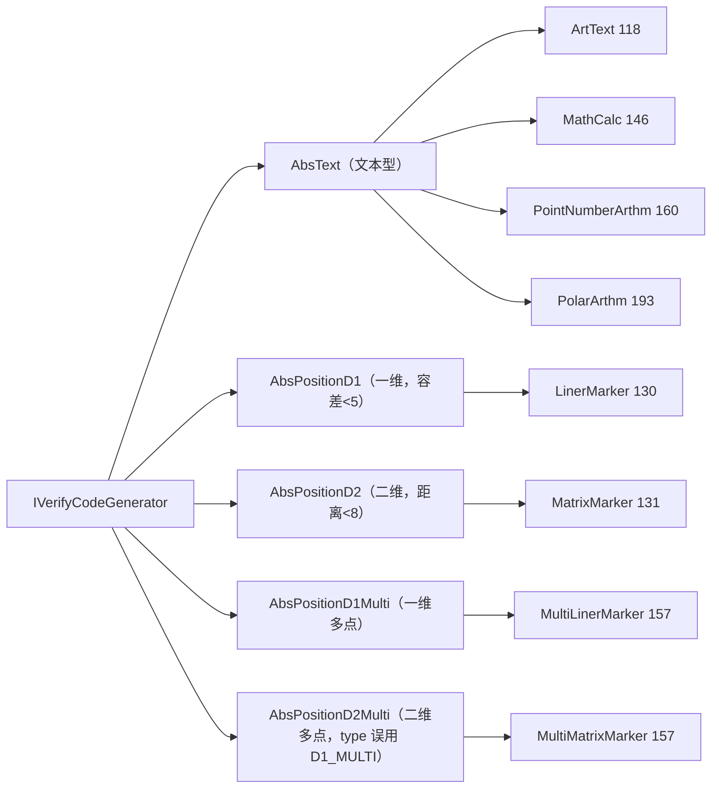

# i2f-verifycode

> **「看图答题」式图形验证码「生成 + 校验」框架——5 种交互形态 × 8 个内置生成器的模板方法落地**：全模块 **19 个源文件、1715 行、4 包**（`std` 6 / `impl` 8 / `data` 4 / `consts` 1，无 `src/test`、零资源）：1 接口 `IVerifyCodeGenerator`（`generate(width,height,params)` + `verify(result,answer)`）+ **5 个抽象基类按「交互形态 × 维度」定型模板方法**——`AbsText`（文本输入，`equalsIgnoreCase` 比对）、`AbsPositionD1`（一维点击，百分比差 `<5`）、`AbsPositionD2`（二维点击，百分比距离 `<8`）、`AbsPositionD1Multi` / `AbsPositionD2Multi`（多点有序点击，逐项同容差）+ **8 个实现**（字符艺术字、四则算式、双箭头加法、极坐标环形加法、横向标尺点击、矩阵散布点击、横向多点、矩阵多点）+ `VerifyCodeType` 枚举（INPUT/D1/D2/D1_MULTI/D2_MULTI，实现 `IDict`）+ 4 个 DTO（含题面 base64 转换器 `VerifyCodeQuestionDto.make`）。答案统一以 **0~100 百分比** 表达（基类注释明言「图片一旦经过缩放，则使用坐标会产生很大的问题」），随机源为 `MathUtil.RANDOM`（**SecureRandom**，MathUtil.java:18）；模块**无状态**——标准答案随 `dto.getResult()` 返回，会话关联由业务侧自持。
>
> **消费现状（零 POM 依赖、零下游源码消费、纯「已发布未落地」模块）**：全仓三路扫描（xml/md 40 命中、java 52 命中、类名 17 命中）**除自身外无任何引用**——`i2f-verifycode` 仅见于三处登记：聚合 `i2f-jdk-all/pom.xml:609`、根 POM `pom.xml:861`（版本管理）、模块清单 `i2f-jdk/pom.xml:165`；wiki 侧引用均为**上游/旁证**：`i2f-enums/readme.md:72/:194/:203`（`VerifyCodeType implements IDict` 的实现方身份）、`i2f-graphics-2d/readme.md:9/:212`（10 处 `GraphicsUtil`/`Point` 消费方）、`i2f-firewall/readme.md:245`（对比性提及）、`.wiki/docs/module-i2f-jdk.md:263`、`.wiki/wiki.md:113`。**平行模块** `i2f-extension-verifycode`（kaptcha 2.3.2 封装，包 `i2f.extension.verifycode`，依赖 i2f-codec-impl）与本模块**互不依赖**——仓库内并存两套独立验证码方案。发布四 jar（`bash/backup|deploy × jdk8|jdk17` 各含 `i2f-verifycode-1.0-jdk8.jar` / `-jdk17.jar`）。
>
> ⚠ **主要风险**：**多点有序点击存在功能级顺序 bug**——`MultiLinerMarker` / `MultiMatrixMarker` 的答案坐标按画布**升序**收集（:120-122 / :104-108），而问题文本按**随机索引序**列出数字（:140-146）、验证**逐项按序比较**——仅当随机序恰为升序时才与答案一致（3 目标约 1/6、4 目标约 1/24），即用户按题面顺序正确点击仍大概率被判失败；`AbsPositionD2Multi.java:31` **类型码误用 `D1_MULTI`**（全部二维多点验证码对外声明 type=3，前端交互形态错配）；Matrix 系 **Y 轴三处不一致**（`posY` 采 `width` :93/:109、单点翻转 Y :125 vs 多点不翻转 :144）；`MathCalc` **除零无兜底**（`boundNumber=1` 时 `nextInt(1)` 恒 0 → 公式含 `/0` → `FormulaCalculator` 除零 `ArithmeticException` 全链路直抛，`generate()` 崩溃）；**空 catch 全家族**（7 处静默吞异常返回 false）；容差（`<5`/`<8`）与 `%.2f` **Locale** 双重硬编码（逗号小数制环境 D2 解析全部失效）；`(Integer)`/`(Boolean)` 强转无防护、`splitCount` 等无上限；`makeCode` 三处逐行复制（2 处死代码）；`Graphics2D` 9 处从不 `dispose()`；全类 `@desc` 空 + **零测试**。详见「模块瑕疵或错误」。

## 模块路径

- `i2f-jdk/i2f-verifycode`

## 模块依赖

| 依赖 | 坐标 | scope/optional | 用途 |
| --- | --- | --- | --- |
| `i2f-math` | `i2f.turbo:i2f-math` | compile | `MathUtil.RANDOM`（**SecureRandom**，MathUtil.java:18）、`MathUtil.distance`（D2 容差）；`FormulaCalculator`（MathCalc 算式求值，FormulaCalculator.java:666-667 除法） |
| `i2f-graphics-2d` | `i2f.turbo:i2f-graphics-2d` | compile | `GraphicsUtil`：`drawArtString` / `drawCenterString` / `drawArrow` / `drawTransform` / `awtRadian` + `Point`（全模块 10 处） |
| `i2f-enums` | `i2f.turbo:i2f-enums` | compile | `IDict`（`VerifyCodeType` 实现，VerifyCodeType.java:11） |
| `lombok` | `org.projectlombok:lombok` | compile | `@Data`（4 个 DTO 的唯一用途） |

- 构建插件：`maven-assembly-plugin`（pom.xml:36-43 显式声明）；版本继承 `i2f-jdk` parent（`1.0-jdk8`）；根 POM 版本管理（pom.xml:861）；`i2f-jdk-all` 聚合收录（i2f-jdk-all/pom.xml:609）；`i2f-jdk` 模块清单第 165 项（i2f-jdk/pom.xml:165，位于 i2f-unsafe 与 i2f-workflow 之间）。
- 无 `src/test`、零资源、零配置文件；19 个源文件分布于 `i2f.verifycode` 的 `std` / `impl` / `data` / `consts` 四包。

## 模块设计

1. **契约层总览**（`std` 6 文件 391 行）：

| 文件 | 行数 | 形态 | type 码 | 答案序列化 | 容差 |
| --- | --- | --- | --- | --- | --- |
| `IVerifyCodeGenerator` | 17 | 接口 | — | — | — |
| `AbsTextVerifyCodeGenerator` | 41 | 文本输入 | INPUT(0) | 原样（`equalsIgnoreCase` 精确比对） | 无 |
| `AbsPositionD1VerifyCodeGenerator` | 56 | 一维点击 | D1(1) | `String.format("%.2f", v)` | 差 `<5`（百分比） |
| `AbsPositionD2VerifyCodeGenerator` | 70 | 二维点击 | D2(2) | `"%.2f,%.2f"` | 百分比距离 `<8` |
| `AbsPositionD1MultiVerifyCodeGenerator` | 96 | 一维多点有序 | D1_MULTI(3) | `"%.2f;%.2f;..."` | 逐项差 `<5` |
| `AbsPositionD2MultiVerifyCodeGenerator` | 111 | 二维多点有序 | **D1_MULTI(3)（误）** | `"%.2f,%.2f;..."` | 逐项距离 `<8` |

2. **实现层总览**（`impl` 8 文件 1192 行）：

| 类 | 行数 | 基类 | 参数常量 / 默认值（宽×高） | 题面玩法 |
| --- | --- | --- | --- | --- |
| `ArtTextVerifyCodeGenerator` | 118 | AbsText | charLength=4 / numberOnly=false（360×160） | 0-9A-Za-z 艺术字 + 干扰线，输入字符 |
| `MathCalcVerifyCodeGenerator` | 146 | AbsText | calcCount=1 / boundNumber=10（240×120） | 四则算式求值，结果两位小数 |
| `PointNumberArthmVerifyCodeGenerator` | 160 | AbsText | splitCount=15 / boundNumber=100（480×480） | 双箭头指向数字之和 |
| `PolarArthmVerifyCodeGenerator` | 193 | AbsText | splitCount=33 / boundNumber=100（480×480） | 环形数字 + 指针 + 中心数相加 |
| `LinerMarkerVerifyCodeGenerator` | 130 | AbsPositionD1 | splitCount=10（480×120） | 横向标尺点击，答百分比 X |
| `MatrixMarkerVerifyCodeGenerator` | 131 | AbsPositionD2 | splitCount=30（480×480） | 散布数字点击，答百分比 (X, 100-Y) |
| `MultiLinerMarkerVerifyCodeGenerator` | 157 | AbsPositionD1Multi | splitCount=10 / verifyCount=3（480×120） | 多点横向有序点击 |
| `MultiMatrixMarkerVerifyCodeGenerator` | 157 | AbsPositionD2Multi | splitCount=30 / verifyCount=3（480×480） | 多点矩阵有序点击 |

3. **继承与分派结构**：



4. **模板方法机制**：`generate()` 在基类定型「内部 DTO → 对外 DTO」骨架——统一 `setCount/setImg/setQuestion` + `setType(形态码)` + result 序列化（文本原样 / `%.2f` / `%.2f,%.2f` / 分号拼接），子类只实现 `generateInner(width,height,params)`（画图、出题、产答案，返回 `VerifyCodeStdDto<T>`）。`verify(result,answer)` 同为骨架：null 检查 → 解析（`Double.valueOf` / `split(",")` / `split(";")`）→ 委托 `verifyInner` 做容差 / 顺序比较；文本型覆写为 `equalsIgnoreCase`（MathCalc 再覆写为 `%.2f` 归一比较，MathCalcVerifyCodeGenerator.java:133-145）。

5. **答案协议与坐标约定**：D1 系单值百分比（`"36.50"`）；D2 系点百分比（`"56.25,43.75"`，注意单点版 Y 已做 `100-y` 翻转、多点版未翻转）；多点系 `;` 分隔多个点/值。中间 DTO `VerifyCodeStdDto<T>` 泛型承载 `String`（文本）/ `Double`（D1）/ `Point`（D2）/ `List<Double>` / `List<Point>`（多点），随机源全局共享 `SecureRandom`。

6. **数据层**（`data` 4 文件 97 行 + `consts` 1 文件 35 行）：`VerifyCodeStdDto<T>`（@Data：question / img / result / type=INPUT / count=0）→ `VerifyCodeDto extends VerifyCodeStdDto<String>`（对外返回体）；`VerifyCodeQuestionDto`（question / base64 / code / width / height / type / count + `make()` 静态转换：`ImageIO.write(png)` → Base64 → `data:image/*;base64,` 前缀）；`VerifyCodeAnswerDto`（code / result 提交体）；`VerifyCodeType`（INPUT(0)/D1(1)/D2(2)/D1_MULTI(3)/D2_MULTI(4)，@Override `code()`/`text()`）。

## 模块目的

- **交互式图形验证码**：面向登录 / 表单防刷场景，避开传统扭曲字符 OCR 型验证码，提供「看图答题」形态族（字符输入、算式、点击定位、多点有序点击），提高自动化破解成本。
- **形态可扩展的模板方法框架**：把「画图 + 出题 + 出答案 / 解析 + 容差判定」的公共骨架沉淀进 5 个抽象基类，新增玩法只需实现一个 `generateInner`。
- **前后端解耦的答案载体**：以 0~100 百分比作为答案坐标（设计动机见基类注释：图片缩放后绝对坐标不可靠），前端任意尺寸展示不影响判定；答案采用字符串协议（两位小数、`,`/`;` 分隔符）。
- **无状态、会话归属业务侧**：模块只负责生成与校验，标准答案随返回值给出，存哪（Redis/HttpSession）由业务侧决定。

## 模块功能

- **字符型**：`ArtTextVerifyCodeGenerator`——定长字符（0-9A-Za-z，可 `numberOnly` 纯数字），艺术字变形 + 随机干扰线/圈。
- **算式型**：`MathCalcVerifyCodeGenerator`——`boundNumber` 范围内四则混合算式（`calcCount` 项 + 随机 0~1 增量），`FormulaCalculator` 求值，结果按 `%.2f` 出题与比对。
- **单点点击型**：`LinerMarkerVerifyCodeGenerator`（横向标尺，答 X 百分比）、`MatrixMarkerVerifyCodeGenerator`（画布散布数字，答 (X,Y) 百分比，Y 翻转）。
- **多点有序点击型**：`MultiLinerMarkerVerifyCodeGenerator`、`MultiMatrixMarkerVerifyCodeGenerator`——默认 3~4 个目标、`;` 分隔的坐标序列。
- **计算混合型**：`PointNumberArthmVerifyCodeGenerator`（双箭头指向数字求和）、`PolarArthmVerifyCodeGenerator`（环形数字 + 指针指向 + 中心数字相加），以文本答案提交。
- **题面打包**：`VerifyCodeQuestionDto.make(dto, code[, withPrefix])`——BufferedImage → PNG → Base64 data URL，附带业务会话码与尺寸/类型元数据。
- **字典集成**：`VerifyCodeType implements IDict`（i2f-enums 生态的 5 值枚举）。

## 模块主要使用方法

```java
// ① 生成（宽、高、可选参数 Map；返回题面 + 标准答案）
IVerifyCodeGenerator gen = new ArtTextVerifyCodeGenerator();
VerifyCodeDto dto = gen.generate(360, 160, null);
// dto.getQuestion()："请输入图片中的4位字符"
// dto.getResult()：如 "aB7c"（标准答案，业务侧保存，如以 Redis/Session 关联）
// dto.getImg()：BufferedImage；dto.getType()：VerifyCodeType.INPUT.code()=0

// ② 打包给前端（PNG → base64 data URL，附带业务侧会话码）
VerifyCodeQuestionDto q = VerifyCodeQuestionDto.make(dto, sessionId);
// q.getBase64() → "data:image/*;base64,..."（ 直接用）；q.getCode() → sessionId 原样带回
// q.getQuestion() / getWidth() / getHeight() / getType() / getCount() 供前端渲染

// ③ 校验（result=生成方标准答案，answer=用户提交；null 直接 false）
boolean ok = gen.verify(dto.getResult(), userAnswer);

// ④ 算式型（换实现类与参数）
MathCalcVerifyCodeGenerator calc = new MathCalcVerifyCodeGenerator();
Map<String, Object> params = new HashMap<>();
params.put(MathCalcVerifyCodeGenerator.PARAM_BOUND_NUMBER, 10);
params.put(MathCalcVerifyCodeGenerator.PARAM_CALC_COUNT, 1);
VerifyCodeDto calcDto = calc.generate(240, 120, params);
// calcDto.getType()=0；getResult() 如 "14.00"

// ⑤ 点击型（答案均为百分比，前端按此换算判定）
VerifyCodeDto linerDto = new LinerMarkerVerifyCodeGenerator().generate(480, 120, null);
// getType()=1（D1）；getResult() 如 "36.50"
VerifyCodeDto matrixDto = new MatrixMarkerVerifyCodeGenerator().generate(480, 480, null);
// getType()=2（D2）；getResult() 如 "56.25,43.75"（Y 已翻转）
VerifyCodeDto multiDto = new MultiLinerMarkerVerifyCodeGenerator().generate(480, 120, null);
// getType()=3（D1_MULTI）；getResult() 如 "36.50;72.00;18.25"（分号分隔）
// ⚠ 多点型当前受顺序 bug 影响：题面数字顺序与答案坐标顺序错位（见瑕疵 2）
```

注意事项：

- **参数常量**：各实现暴露 `PARAM_*` 与 `DEFAULT_*` 常量（表见「模块设计」）；`params` 传 `null` 即全默认；所有数值参数仅校验 `>0`。
- **无状态协议**：模块不保存会话——`generate` 返回值中的 `result` 即标准答案，业务侧必须自行关联存储（建议以 `VerifyCodeQuestionDto.code` 为键），校验时原样传回 `verify`。
- **答案格式**：D1 系 `"36.50"`；D2 系 `"50.00,40.00"`；多点系 `;` 分隔（D2Multi 元素为 `"x,y"`）；文本型（ArtText/MathCalc/PointNumber/Polar）直接比较字符串。
- **容差硬编码**：D1 系差值 `<5`、D2 系距离 `<8`（均为百分比单位），不可经参数调整。
- **MathCalc 边界**：`boundNumber=1` 会触发生成期除零异常（见瑕疵 6）；默认 `boundNumber=10` 安全。
- **安全提示**：答案校验无「一次性 / 有效期」机制（业务侧负责防重放）；随机源为共享 `SecureRandom`。

## 模块特性总结

1. **5 形态 × 8 生成器 × 1715 行**：文本输入 / 一维点击 / 二维点击 / 一维多点 / 二维多点，完整覆盖「看图答题」主流玩法。
2. **模板方法三段式**：接口 17 行 + 5 抽象基类（generate 骨架 / verify 骨架 / generateInner 钩子）+ 8 个轻实现（只画图与产答案）。
3. **百分比坐标协议**：答案与画布尺寸解耦（缩放无关），统一两位小数文本序列化。
4. **泛型中间 DTO**：`VerifyCodeStdDto<T>` 以 `String/Double/Point/List<*>` 承载 5 形态答案，对外统一 `VerifyCodeDto`。
5. **SecureRandom 随机源**：`MathUtil.RANDOM` 为进程级共享 `SecureRandom`（不可预测），非 `java.util.Random`。
6. **无状态**：模块零会话存储，接入灵活；标准答案随生成返回。
7. **题面打包辅助**：`make()` 一行完成 PNG → Base64 data URL（含尺寸/类型/会话码）。
8. **上游复用充分**：graphics-2d 的艺术字/居中/变换/箭头/弧度 5 组绘图原语 + math 的公式计算器与距离函数。
9. **生态集成**：`VerifyCodeType implements IDict`，可被 i2f 字典生态统一消费。

## 模块瑕疵或错误

1. **`AbsPositionD2Multi` 类型码误用**（`AbsPositionD2MultiVerifyCodeGenerator.java:31`）：`ret.setType(VerifyCodeType.D1_MULTI.code())`——应为 `D2_MULTI(4)`。全部二维多点验证码（MultiMatrixMarker）对外声明 `type=3`，前端按「一维」形态处理 → 交互错配；正确值 `D2_MULTI(4)` 从未被任何生成器使用过。
2. **多点有序点击「题面顺序 ↔ 答案顺序」错位（功能级 bug）**：`MultiLinerMarker` 的答案坐标按循环下标 `i` **升序**收集（:120-122 `if (targetIndexes.contains(i)) targetPoints.add(posX)`），但 result/question 按 `targetIndexes` **随机序**输出（:142-146：`result.add(targetPoints.get(i))` 配 `numbers.get(targetIndexes.get(i))`）；`MultiMatrixMarker` 同构（:104-108 / :140-146）。用户按题面顺序点击的坐标序 = 随机序，标准答案序 = 升序——仅当随机序恰为升序时才一致（3 目标概率约 1/6、4 目标约 1/24），否则**正确点击也判失败**，多点玩法实际不可用。
3. **Matrix 系 Y 轴三处不一致**：① `MatrixMarker.java:93` 与 `MultiMatrixMarker.java:109` 的 `posY = RANDOM.nextInt(width)`——Y 坐标用 `width` 生成，非方形画布（`height < width`）时数字被画到画布外；② `MatrixMarker.java:125` 单点版 `100 - y*100.0/height` 做了 Y 翻转，而 `MultiMatrixMarker.java:144` 多点版 `p.getY()*100.0/height` **不翻转**——同族两实现坐标约定互斥，前端只有一套换算方式时必有一端错。
4. **空 catch 全家族静默吞异常**：`AbsPositionD1VerifyCodeGenerator.java:44-46`、`AbsPositionD2` :47-49、`AbsPositionD1Multi` :54-56 / :70-72、`AbsPositionD2Multi` :56-58 / :74-76、`MathCalc` :141-143——共 7 处 `catch (Exception e) {}` 空体，解析失败 / 程序异常与「用户答错」不可区分，全部静默返回 `false`，排障无日志。
5. **容差硬编码**：D1 系 `diffRate < 5`（`AbsPositionD1:52`、`AbsPositionD1Multi:87`）、D2 系 `diffDis < 8`（`AbsPositionD2:66`、`AbsPositionD2Multi:102`）——无参数、无文档、不可调；且百分比单位下 X/Y 容差的**像素含义随画布宽高比变化**（非方形画布下横纵判定敏感度不等）。
6. **`MathCalc` 除零无兜底（异常直抛）**：`boundNumber=1` 时 `RANDOM.nextInt(1)` 恒 0，重试 10 次（`MathCalcVerifyCodeGenerator.java:72-78`）后仍为 0 → 公式含 `/0`；`FormulaCalculator.calculateOperator` 直接 `num1.divide(num2, DEFAULT_CONTEXT)`（FormulaCalculator.java:666-667）对零除数抛 `ArithmeticException: Division by zero`，且 `calculate()` 全部错误路径均为直接 `throw`（无 try-catch 兜底）——异常一路穿透 `generate()`，**接口调用整体失败**而非退化为可用题面。
7. **参数强转无防护 + 无上限校验**：全部 `params` 读取采用 `(Integer) params.get(...)` / `(Boolean) params.get(...)` 强转（如 ArtText:63 / MathCalc:49 / LinerMarker:53 / MatrixMarker:54），传入 `Long`/`String` 即 `ClassCastException`；`splitCount` / `charLength` / `calcCount` / `verifyCount` 仅校验 `>0`，无上限——`splitCount` 极大时字符串集合与绘图开销放大，`charLength > width` 时字体宽度归零（见瑕疵 10）。
8. **`%.2f` 未指定 Locale（国际化致命耦合）**：`AbsPositionD1:31`、`AbsPositionD2:34`、`AbsPositionD1Multi:35`、`AbsPositionD2Multi:37`、`MathCalc:128/:140` 共 6 处 `String.format("%.2f", ...)` 使用 JVM 默认 FORMAT locale——逗号小数制环境（如 `de-DE`）输出 `"1,23"`，D2 系 `parsePoint` 以 `split(",")` 解析必然失败（段数错）→ 生成/验证双向失效；同时题面展示的小数点样式也随环境漂移。
9. **`makeCode` 三处逐行复制 + 死代码 + 死常量**：同款 `makeCode(int, boolean)`（字符集 0-9A-Za-z 62 分支）分别存在于 `ArtText:28-47`（唯一被调用，:77）、`PointNumberArthm:30-49`（**未被调用**）、`PolarArthm:30-49`（**未被调用**）；实现用 `ret += ch` 字符串拼接（应 StringBuilder）；`PARAM_BOUND_NUMBER` 常量在 `LinerMarker:23` / `MatrixMarker:24` 声明但从未读取（误导 API）。
10. **图形资源不释放 + 字体边界值**：全模块 9 处 `img.createGraphics()`（如 ArtText:79、MathCalc:89、LinerMarker:76、MatrixMarker:77、MultiLinerMarker:92、MultiMatrixMarker、PointNumberArthm:93、PolarArthm:92）均无 `finally { g.dispose(); }` 释放图形上下文；`fontWidth = width/15`（或 `min/25`、`width/6`）在画布过小时可为 **0**（`new Font(null, ITALIC, 0)`），`ArtText:84` 更是 `width / result.length()` 与字符数耦合——`charLength` 超过宽度即失效。
11. **`LinerMarker` 布局边界**：`stepWidth = width / splitCount` 整除截断（LinerMarker.java:88，余数丢弃、右侧留白）；`posX = stepWidth * i` 首项恒为 0（:92）——数字中心落在画布左边缘、左半截出画；`fontWidth = width / 15`（:82）与 `splitCount` 无关——`splitCount` 大时相邻数字重叠；数字个数受 `LinkedHashSet` 去重影响（:63-70），实际个数与参数不一致。
12. **`PointNumberArthm` 目标索引可重复 + 箭头长度可为负**：`targetIndexArr[0]`/`[1]` 两次独立 `nextInt(splitCount)`（:90-91）**未去重**——两值相同时「两个指针」指向同一数字（结果为 2×该数、两支箭头叠画）；箭头终点长度 `dis -= fh`（:129）在起点距数字不足一个字高时 `dis` 为负 → 箭头反向 / 指向错误；箭头起点 `bx/by` 亦为随机点（可能压在其他数字上）。
13. **`VerifyCodeQuestionDto` 细节**：`ImageIO.write(img, "png", bos)`（:40）**返回值未检查**（写入失败时产出空字节集）；`URL_IMG_PREFIX = "data:image/*;base64,"`（:21）使用泛型 `image/*` MIME，部分前端/客户端可能不识别（应 `image/png`）；`make()` 直接抛 `IOException` 未做资源收尾（`ByteArrayOutputStream` 由 GC 处理，实际影响小）。
14. **`@desc` 空 + 零测试**：19 个源文件中仅 5 个抽象基类有说明性 `@desc`，接口 / 枚举 / 全部 8 个实现 / 4 个 DTO 的 `@desc` 均为空；无 `src/test`——绘制坐标、多点顺序、类型码、容差判定等核心逻辑零自动化防线。

## 消费现状与验证

- **POM 直接依赖（0 模块）**：除聚合 / 版本管理 / 模块清单三处登记外，仓库内无任何模块以 `<dependency>` 引入 `i2f-verifycode`。
- **Java 代码消费（0 文件）**：全仓三类扫描——① 字符 `i2f-verifycode`：xml/md 40 命中全部为聚合、根 POM、清单登记与 wiki 文档描述；② 内容 `i2f\.verifycode`：java 52 命中全部落在模块自身 19 个源文件内（package/import 自引用）；③ 类名（`ArtTextVerifyCodeGenerator` 等 8 实现 + `VerifyCodeType` + `IVerifyCodeGenerator`）：17 命中全部为自身定义。**无任何外部编译期 / 反射 / 字符串消费**。
- **平行模块关系**：`i2f-extension-verifycode`（`i2f.extension.verifycode` 包，kaptcha 2.3.2 `provided` 封装，见其 pom.xml:26-29）**不依赖本模块**——两者为仓库内并存的独立方案（本模块：自绘「看图答题」；extension 模块：kaptcha 传统字符型），互不替代。
- **聚合与发布**：`i2f-jdk-all/pom.xml:609`（聚合）、根 `pom.xml:861`（版本管理 `${i2f.version}`）、`i2f-jdk/pom.xml:165`（模块清单）；`bash/backup-jdk8|backup-jdk17|deploy-jdk8|deploy-jdk17` 四目录均含 `i2f-verifycode-1.0-jdk8.jar` / `i2f-verifycode-1.0-jdk17.jar`。
- **wiki 侧引用**（均为上游 / 旁证，非消费方）：`i2f-enums/readme.md:72/:194/:203`（`VerifyCodeType implements IDict` 实现方）、`i2f-graphics-2d/readme.md:9/:212`（`GraphicsUtil`/`Point` 10 处消费方）、`i2f-firewall/readme.md:245`（对比性提及）、`.wiki/docs/module-i2f-jdk.md:263`、`.wiki/wiki.md:113`、`menus.md:425/:485`（dict 与 graphics-2d 条目内提及）。
- **验证方法**：PowerShell 全仓逐文件枚举 + 目录分组扫描（xml/md/txt/bat/sh/lst 与 java 双通道）；`grep_code` 对该模块路径型查询返回 0 命中不可信（工具缺陷），一律以 PowerShell 复核为准。
